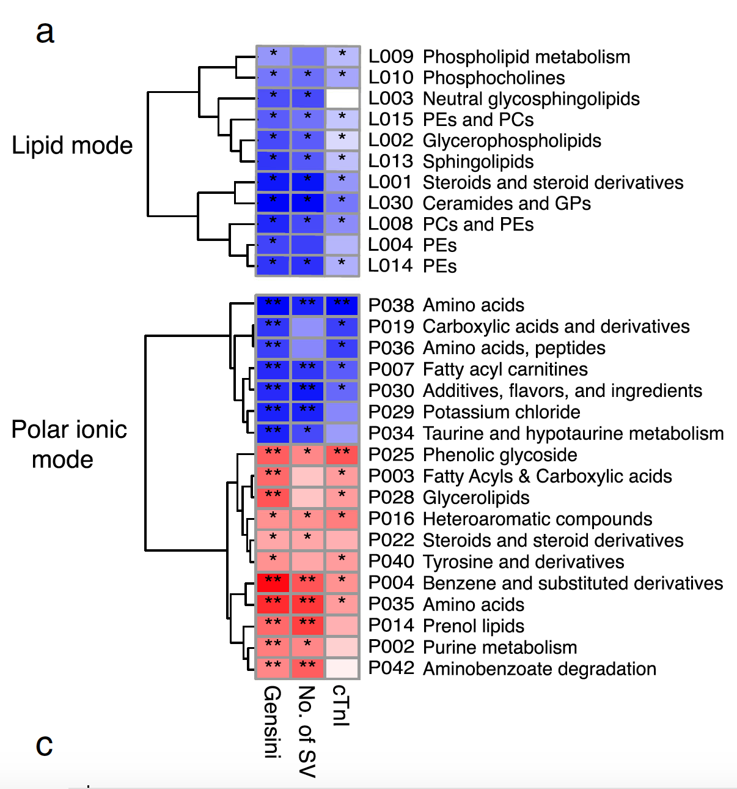

**Author(s)**: `r params$author`  
**Reviewer(s)**: `r params$reviewer`  
**Date**: `r Sys.Date()`  

# Academic Citation
If you use this code in your work or research, we kindly request that you cite our publication:

Xiaofan Lu, et al. (2025). FigureYa: A Standardized Visualization Framework for Enhancing Biomedical Data Interpretation and Research Efficiency. iMetaMed. https://doi.org/10.1002/imm3.70005

```{r setup, include=FALSE}
knitr::opts_chunk$set(echo = TRUE)
```

# 需求描述

这个图，想知道怎么聚类的。WGCNA这个方法不会做，输入的是代谢化合物在各个sample里的浓度。

# Requirement description

I want to know how to cluster this graph. The WGCNA method does not perform it, it only inputs the concentration of metabolic compounds in each sample.



出自<https://microbiomejournal.biomedcentral.com/articles/10.1186/s40168-019-0683-9>

from<https://microbiomejournal.biomedcentral.com/articles/10.1186/s40168-019-0683-9>

Clusters of co-abundant serum metabolites were identified using the R package WGCNA [65]. Signed, weighted metabolite co-abundance correlation networks were calculated for all examined individuals. A scale-free topology criterion was used to choose the soft threshold β = 14 for serum metabolites correlations. Clusters were identified with the dynamic hybrid tree-cutting algorithm using a deepSplit of 4 [66]. The serum polar metabolite and serum molecular lipid clusters (labelled P01???P42 and L01???L30, respectively) were collectively termed metabolite clusters.

**图的解读：**利用hybrid dynamic branch-cutting法构建加权共表达网络，构建方法跟FigureYa15WGCNA不一样，采用的是mannually而不是automatically构建网络。需要对网络模块和其他变量的相关性进行分析、筛选、外部聚类和热图绘制（展示显著性）。

**Interpretation of the figure: * * Using the hybrid dynamic branch cutting method to construct a weighted co expression network, the construction method is different from FigureYa15WGCNA, and the network is constructed manually rather than automatically. It is necessary to analyze, screen, externally cluster, and heat map the correlation between network modules and other variables (to demonstrate significance).

# 应用场景

计算并用热图展示WGCNA找出的共表达模块跟表型数据（数量性状）之间的相关性。

# Application scenarios

Calculate and display the correlation between the co expression modules identified by WGCNA and phenotype data (quantitative traits) using a heatmap.

# 环境设置

# Environment settings

MAC系统可能需要手动下载WGCNA后本地安装，下载链接：<https://horvath.genetics.ucla.edu/html/CoexpressionNetwork/Rpackages/WGCNA/WGCNA_1.67.tgz>

For MAC system, may require manual download of WGCNA and local installation. Download link: <https://horvath.genetics.ucla.edu/html/CoexpressionNetwork/Rpackages/WGCNA/WGCNA_1.67.tgz>

```{r}
source("install_dependencies.R")
# 加载WGCNA包，用于加权基因共表达网络分析
# Load the WGCNA package for weighted gene co-expression network analysis
library(WGCNA)

# 加载ClassDiscovery包，用于癌症类型分类等发现任务
# Load the ClassDiscovery package for cancer type classification and other discovery tasks
library(ClassDiscovery)

# 加载gplots包，提供各种绘图函数增强可视化
# Load the gplots package which provides various plotting functions to enhance visualization
library(gplots)

# 加载pheatmap包，用于绘制精美的热图
# Load the pheatmap package for creating beautiful heatmaps
library(pheatmap)

# 设置环境变量使R显示英文报错信息，便于查找解决方案
# Set environment variable to display error messages in English for easier troubleshooting
Sys.setenv(LANGUAGE = "en") 

# 禁止字符串自动转换为因子类型，避免数据处理中的意外转换
# Disable automatic conversion of strings to factors to avoid unexpected data type conversions
options(stringsAsFactors = FALSE) 
```

# 输入文件

需要两种输入文件，两个的文件的行要一一对应：

- easy_input_data.txt，表达矩阵，用于构建加权共表达网络。每行一个sample，每列一个基因。
- easy_input_anno.txt，表型信息，用于计算module score跟它的相关性分析及聚类热图绘制。每行一个sample，每列一种表型，这里的列是代谢物浓度，还可以是其他数量性状、临床指标等等。如果只想构建共表达网络，就不需要这个文件。

# Input file

Two types of input files are required, and the lines of the two files should correspond one-to-one:

- easy_input_data.txt， Expression matrix, used to construct weighted co expression networks. One sample per row, one gene per column.
- easy_input_anno.txt， Phenotypic information is used to calculate the correlation analysis between module score and it, as well as to draw clustering heatmaps. Each row has one sample, and each column has one phenotype. The columns here represent metabolite concentrations, as well as other quantitative traits, clinical indicators, and so on. If you only want to build a co expression network, you don't need this file.

```{r}
### 读取表达数据
# 从easy_input_data.txt文件读取表达数据，使用制表符分隔，禁用列名检查和字符串转因子
# Read expression data from easy_input_data.txt file, using tab separator, disabling column name checks and string-to-factor conversion
example.data <- read.table("easy_input_data.txt",sep = "\t",check.names = F,stringsAsFactors = F,header = T,row.names = 1)

# 查看数据前3行和3列的基本情况
# View the first 3 rows and 3 columns of the data to understand its structure
example.data[1:3,1:3]

# 转置数据框，使基因作为列、样本作为行，符合WGCNA输入格式要求
# Transpose the data frame so that genes are columns and samples are rows, meeting WGCNA input format requirements
example.data <- as.data.frame(t(example.data))

# 是否需要测试样本或特征质量，或是否需要移除离群点，不属于本需求的目的，可参考FigureYa15WGCNA了解更多预处理工作
# Whether to test sample/feature quality or remove outliers is not the purpose of this requirement. Refer to FigureYa15WGCNA for more preprocessing steps


### 读取表型数据（其他变量）
# 从easy_input_anno.txt文件读取表型数据，使用制表符分隔，禁用列名检查和字符串转因子
# Read phenotype data from easy_input_anno.txt file, using tab separator, disabling column name checks and string-to-factor conversion
example.anno <- read.table("easy_input_anno.txt",sep = "\t",check.names = F,stringsAsFactors = F,header = T,row.names = 1)

# 确保表型数据的样本顺序与表达数据一致（按行名匹配）
# Ensure phenotype data samples are in the same order as expression data (match by row names)
example.anno <- example.anno[rownames(example.data),]

# 查看表型数据的基本结构
# View the basic structure of the phenotype data
head(example.anno)
```

# 共表达网络构建

## 自定义函数用于共表达网络构建（manually）

这里根据例文的方法写了一个自定义函数，后面将调用这个函数来构建共表达网络。可调整的参数如下：

- indata为输入矩阵，行为样本，列为特征
- TOMType为构建TOM相似性时是否考虑符号，一般为"unsigned"，可选用"none", "unsigned", "signed", "signed Nowick", "unsigned 2", "signed 2" and "signed Nowick 2"
- clusterMethod为距离测度方法，默认为"average"，可选用其他"ward.D", "ward.D2", "single", "complete", "average"
- deepSplit为选用hybrid树切割方法时的参数，值为0-4，越大则产生越多的module，默认为1
- minClusterSize是每个module里的最少特征数，默认30
- isprefix为逻辑变量，指示是否修改module名的前缀，若不修改，则将module映射到颜色上
- prefix为当isprefix为TRUE时，生成module的前缀，默认为"P"，如例文。

另外，如果你想用WGCNA自带的函数构建共表达网络（automatically），可参考FigureYa15WGCNA。

# Co expression network construction

## Custom functions for co expression network construction (manually)

Here we have written a custom function based on the example text, which will be called later to construct a co expression network. The adjustable parameters are as follows:

-Indata is the input matrix, behavior samples, and columns are the features
-TOMType refers to whether symbols are considered when constructing TOM similarity, usually "unsigned", which can be selected as "none", "unsigned", "signed", "signed Nowick", "unsigned 2", "signed 2" and "signed Nowick 2"
-ClusterMethod is a distance measurement method that defaults to "average". Other options such as "ward. D", "ward. D2", "single", "complete", and "average" can be used
-DeepSplit is a parameter used when selecting the hybrid tree splitting method, with a value of 0-4. The larger the value, the more modules will be generated, and the default value is 1
-MinClusterSize is the minimum number of features in each module, with a default of 30
-Isprefix is a logical variable that indicates whether to modify the prefix of the module name. If not modified, the module will be mapped to a color
-When isprefix is set to TRUE, prefix is generated for the module, which defaults to "P", as shown in the example text.

In addition, if you want to use the built-in functions of WGCNA to construct a co expression network (automatically), you can refer to FigureYa15WGCNA.

```{r}
# 网络构建函数：基于输入数据构建加权基因共表达网络并进行模块识别
# Network construction function: Builds a weighted gene co-expression network and performs module identification based on input data
# indata: 输入表达矩阵，行为样本，列为基因
# indata: Input expression matrix with samples as rows and genes as columns
# power: 软阈值幂参数，用于构建邻接矩阵
# power: Soft thresholding power parameter for constructing the adjacency matrix
# TOMType: TOM矩阵类型，可选"unsigned"、"signed"等
# TOMType: Type of TOM matrix, options include "unsigned", "signed", etc.
# clustMethod: 层次聚类方法，如"average"、"complete"等
# clustMethod: Hierarchical clustering method, e.g., "average", "complete", etc.
# cutHeight: 动态树剪枝的高度阈值
# cutHeight: Height threshold for dynamic tree cutting
# deepSplit: 模块分割深度参数，值越大分割越精细
# deepSplit: Depth parameter for module splitting, higher values result in finer splits
# minClusterSize: 最小模块大小
# minClusterSize: Minimum module size
# isprefix: 是否使用前缀命名模块
# isprefix: Whether to use prefixes for module names
# prefix: 模块命名前缀
# prefix: Prefix for module names
netconstruct <- function(indata=NULL, power=NULL, TOMType="unsigned",clustMethod="average",cutHeight=0.995,deepSplit=1,minClusterSize=30,isprefix=F,prefix="P") {
  # 计算邻接矩阵：基于表达数据和软阈值构建基因共表达网络
  # Calculate adjacency matrix: Build gene co-expression network based on expression data and soft threshold
  adj = adjacency(indata, power = power)
  
  # 计算拓扑重叠矩阵(TOM)：评估基因间的网络相似性
  # Calculate Topological Overlap Matrix (TOM): Evaluate network similarity between genes
  TOM = TOMsimilarity(adj, TOMType = TOMType) 
  
  # 转换为不相似性矩阵并设置行列名
  # Convert to dissimilarity matrix and set row/column names
  dissTOM = 1 - TOM; dimnames(dissTOM) <- list(colnames(indata),colnames(indata))
  
  # 基于TOM不相似性进行层次聚类
  # Perform hierarchical clustering based on TOM dissimilarity
  hierTOM=hclust(as.dist(dissTOM),clustMethod)
  
  # 原文提到使用 hybrid dynamic branch-cutting
  # Original paper mentions using hybrid dynamic branch-cutting
  
  # 动态树剪枝识别共表达模块
  # Dynamic tree cutting to identify co-expression modules
  dynamicMods=cutreeDynamic(hierTOM,
                            distM=dissTOM,
                            method = "hybrid",
                            cutHeight=cutHeight,
                            deepSplit=deepSplit, 
                            pamRespectsDendro=FALSE,
                            minClusterSize=minClusterSize)
  
  # 根据isprefix参数决定模块命名方式
  # Determine module naming convention based on isprefix parameter
  if(!isprefix) {
    dynamicLabels <-  labels2colors(dynamicMods) # 转为颜色
  } else {
    dynamicLabels=paste0(prefix,sprintf("%03d",dynamicMods)) # 按照例文修改module名字
  }
  
  # 显示各模块中的基因数目
  # Display the number of genes in each module
  print(table(dynamicLabels))
  
  # 计算模块特征基因(模块本征基因)
  # Calculate module eigengenes (representative expression profiles for each module)
  MEList = moduleEigengenes(indata, colors = dynamicLabels)
  MEs = MEList$eigengenes
  
  # 移除特征基因列名中的"ME"前缀
  # Remove "ME" prefix from eigengene column names
  colnames(MEs) <- gsub("ME","",colnames(MEs))
  
  # 返回网络构建结果：包括TOM不相似性矩阵、聚类树、模块标签和特征基因
  # Return network construction results: including TOM dissimilarity matrix, clustering tree, module labels, and eigengenes
  return(list(dissTOM=dissTOM, hierTOM=hierTOM, dynamicMods=dynamicMods, dynamicLabels=dynamicLabels, MEs=MEs))
}
```

## 选择构建网络的合适阈值

原文提到：A scale-free topology criterion was used to choose the soft threshold

### Choose the appropriate threshold for building the network

The original text mentions: A scale free topology criteria were used to choose the soft threshold

```{r}
# 设置待测试的软阈值参数范围（1-10及12-20的偶数）
# Set the range of soft thresholding powers to test (1-10 and even numbers from 12-20)
powers=c(c(1:10),seq(from=12,to=20,by=2))

# 执行软阈值选择：评估不同幂参数对网络无标度特性的拟合程度
# Perform soft threshold selection: Evaluate how different power parameters fit the scale-free topology
sft=pickSoftThreshold(example.data,powerVector=powers)

# 保存无标度拟合度和平均连接度可视化结果
# Save visualizations of scale-free topology fit and mean connectivity
pdf("picksoftthreshold.pdf")
par(mfrow=c(1,2))

# 绘制无标度拓扑模型拟合度图
# Plot scale-free topology model fit
plot(sft$fitIndices[,1],
     -sign(sft$fitIndices[,3])*sft$fitIndices[,2],
     xlab="Soft Threshold (power)",ylab="Scale Free Topology Model Fit, signed R??2",type="n",main=paste("Scale independence"))
text(sft$fitIndices[,1],
     -sign(sft$fitIndices[,3])*sft$fitIndices[,2],
     labels=powers,col="red")
abline(h=0.90,col="red") # 添加R²=0.9的参考线

# 绘制平均连接度图
# Plot mean connectivity
plot(sft$fitIndices[,1],sft$fitIndices[,5],type="n",
     xlab="Soft Threshold (power)",ylab="Mean Connectivity",
     main=paste("Mean connectivity"))
text(sft$fitIndices[,1],sft$fitIndices[,5],labels=powers,
     col="red")
invisible(dev.off())

# 从示例数据可以看到，从6开始进入"平台期"，因此设置power为6
# Based on the example data, the "plateau" starts at power=6, so we choose this value
softPower = 6
```


## 构建共表达网络

## Building a Co expression Network

```{r}
# 执行WGCNA网络构建：基于选定的软阈值和参数识别共表达模块
# Perform WGCNA network construction: Identify co-expression modules based on the selected soft threshold and parameters
wgcna.res <- netconstruct(indata = example.data,
                    power = softPower,
                    TOMType = "signed", # 原文提到构建 Signed, weighted network
                                         # Original paper mentions constructing a signed, weighted network
                    deepSplit = 4, # 根据原文设置为4，可设置为1-4，值越大module越多
                                   # Set to 4 according to the original paper; can be 1-4 (higher values yield more modules)
                    isprefix = T,  # 使用前缀命名模块
                                   # Use prefix for module names
                    prefix = "P")  # 模块前缀为"P"，如P001、P002等
                                   # Module prefix "P", e.g., P001, P002, etc.

# 查看前3个样本的前3个模块特征基因表达值
# View the first 3 module eigengene values for the first 3 samples
wgcna.res$MEs[1:3,1:3]
```

## module score 与其他变量的相关性分析

## Correlation analysis between module score and other variables

```{r,warning=FALSE}
# 检查样本是否顺序完全一致
# Check if samples are in the exact same order between module eigengenes and annotation data
if(!identical(rownames(wgcna.res$MEs),rownames(example.anno))) {
  cat("Mismatch! Please check if annotation shared the same samples (order) with WGCNA input matrix!\n")
} else {cat("Sample matches correct!\n")}

# 配对相关性检验：计算模块特征基因与表型特征之间的关系
# Pairwise correlation test: Calculate relationships between module eigengenes and phenotypic features
r.res <- NULL
for (i in colnames(example.anno)) {
  for (j in colnames(wgcna.res$MEs)) {
    # 使用Spearman秩相关检验评估相关性
    # Use Spearman rank correlation test to evaluate relationships
    tmp <- cor.test(example.anno[,i], wgcna.res$MEs[,j], method = "spearman")
    cat(paste0("Pairwise correlation between ", j, " and ", i, ": ","rho = ",round(tmp$p.value,3),"; p = ",round(tmp$estimate,3),"\n"))
    r.res <- rbind.data.frame(r.res,data.frame(corA=i,corB=j,rho=tmp$estimate,p.value=tmp$p.value,stringsAsFactors = F,row.names = NULL))
  }
}

# FDR校正p值以控制多重检验中的假阳性率
# Apply FDR correction to p-values to control false positive rate in multiple testing
r.res$FDR <- p.adjust(r.res$p.value, method = "fdr")

# 根据FDR值添加显著性标记
# Add significance markers based on FDR values
r.res$star <- ifelse(r.res$FDR < 0.05, "*", ifelse(r.res$FDR < 0.01, "**", ""))

# 保存配对相关性分析结果
# Save pairwise correlation analysis results
write.table(r.res,"output_pairwiseCorrelationResults.txt",sep = "\t",row.names = F,quote = F)

# 生成绘制热图的输入矩阵
# Generate input matrices for heatmap visualization
cor.matrix <- matrix(0, nrow = ncol(example.anno), ncol = ncol(wgcna.res$MEs), dimnames = list(colnames(example.anno),colnames(wgcna.res$MEs)))
cor.star <- matrix("", nrow = ncol(example.anno), ncol = ncol(wgcna.res$MEs), dimnames = list(colnames(example.anno),colnames(wgcna.res$MEs)))

# 填充相关系数矩阵和显著性标记矩阵
# Populate correlation coefficient matrix and significance marker matrix
for (i in colnames(example.anno)) {
  for (j in colnames(wgcna.res$MEs)) {
    cor.matrix[i,j] <- as.numeric(r.res[which(r.res$corA == i & r.res$corB == j),"rho"])
    tmp <- as.numeric(r.res[which(r.res$corA == i & r.res$corB == j),"FDR"])
    cor.star[i,j] <- ifelse(tmp < 0.05, "*",ifelse(tmp < 0.01, "**",""))
  }
}

# 输出热图数据到文件
# Output heatmap data to files
write.table(cor.matrix,"output_correlation matrix.txt",sep = "\t",row.names = T,col.names = NA,quote = F)
write.table(cor.star,"output_correlation star.txt",sep = "\t",row.names = T,col.names = NA,quote = F)
```

# 开始画图

对WGCNA得到的module维度进行聚类，用热图展示，显著的标*。

注意：这里纯粹模仿需求例文中的聚类热图，如需DIY展示多种聚类结果或自行排序，可参考FigureYa91cluster_heatmap。

# Start drawing

Cluster the module dimensions obtained from WGCNA and display them on a heatmap with significant markers *.

Note: This is purely an imitation of the clustering heatmap in the requirement example article. If you need to DIY display multiple clustering results or sort them yourself, you can refer to FigureYa91cluster_ heatmap.

```{r}
# 如果你不需要前面的计算过程，只是想要画带显著性的热图，就按output_correlation matrix.txt和output_correlation star.txt文件整理你的数据。从这里读入，然后画图。
# If you don't need the previous calculations and just want to plot the significance heatmap, 
# organize your data from the output_correlation matrix.txt and output_correlation star.txt files.
# Read them in here and then create the plot.

# 读取相关性矩阵和显著性标记矩阵
# Read correlation matrix and significance marker matrix
cor.matrix <- read.table("output_correlation matrix.txt", sep = "\t", row.names = 1, header = T)
head(cor.matrix)
cor.star <- read.table("output_correlation star.txt", sep = "\t", row.names = 1, header = T)
cor.star[is.na(cor.star)] <- ""
head(cor.star)

# 显著性计数阈值：当某模块与≥sigcut个变量显著相关时保留该模块
# Significance count cutoff: retain modules significantly correlated with ≥sigcut variables
sigcut <- 1 # 可根据实际情况调整该阈值
            # Adjust this cutoff based on your needs

# 如果不筛选，就设为：sigcut <- 0
# To disable filtering, set: sigcut <- 0

# 计算每个模块的显著性关联计数并筛选符合条件的模块
# Calculate significance counts for each module and filter modules
starcount <- apply(t(cor.star), 1, function(x) {sum(x != "")}) >= sigcut
head(starcount)

# 基于相关系数矩阵进行层次聚类
# Perform hierarchical clustering on correlation matrix
hcs <- hclust(distanceMatrix(as.matrix(cor.matrix[,starcount]), "euclidean"), "ward.D")

# 绘制模块与表型特征相关性热图
# Plot heatmap of module-trait correlations
pheatmap(
  t(cor.matrix)[starcount,],  # 转置相关矩阵，行为模块，列为表型特征，并筛选显著模块 / Transpose correlation matrix and select significant modules
  scale = "none",  # 相关性矩阵无需标准化 / No scaling needed for correlation matrix
  color = bluered(64),  # 使用蓝红渐变调色板 / Blue-red gradient color palette
  cellwidth = 15, cellheight = 10,  # 调整热图单元格大小 / Adjust cell dimensions
  cluster_cols = F,  # 不聚类列（表型特征） / Disable column clustering
  cluster_rows = hcs,  # 使用预计算的聚类树聚类行（模块） / Use precomputed hierarchical clustering for rows
  display_numbers = t(cor.star)[starcount,],  # 在热图上显示显著性标记 / Display significance markers
  filename = "wgcnamodule_and_variables_correlation_heatmap.pdf"  # 保存热图为PDF / Save heatmap as PDF
)
```


# Session Info

```{r}
sessionInfo()
```