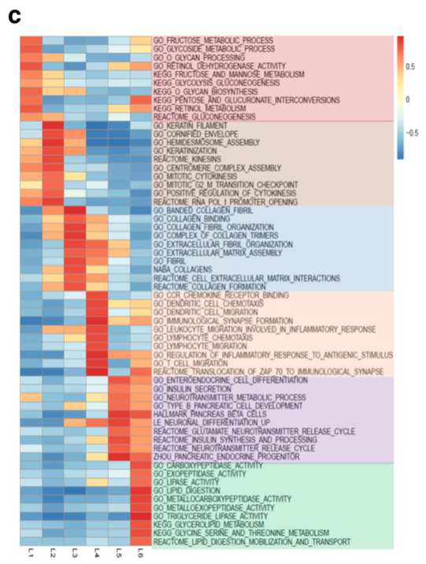

**Author(s)**: `r params$author`  
**Reviewer(s)**: `r params$reviewer`  
**Date**: `r Sys.Date()`  


# Academic Citation
If you use this code in your work or research, we kindly request that you cite our publication:

Xiaofan Lu, et al. (2025). FigureYa: A Standardized Visualization Framework for Enhancing Biomedical Data Interpretation and Research Efficiency. iMetaMed. https://doi.org/10.1002/imm3.70005

```{r setup, include=FALSE}
knitr::opts_chunk$set(echo = TRUE)
# 使用knitr包设置全局代码块选项
# Set global chunk options using knitr package
```

# 需求描述

多组的富集分析及结果展示，用clusterProfiler做GSEA，挑选各组特异性top通路，画出paper里这样的对角热图。图中横坐标的6列对应6个亚型（分组），右侧文字的背景色对应6个亚组（分组）富集的通路。

# Requirement description

Perform enrichment analysis and result display for multiple groups, use clusterProfiler for GSEA, select specific top pathways for each group, and draw a diagonal heatmap as shown in the paper. The 6 columns on the horizontal axis in the figure correspond to 6 subtypes (groups), and the background color of the text on the right corresponds to the enriched pathways of the 6 subtypes (groups).


出自<https://bmccancer.biomedcentral.com/articles/10.1186/s12885-018-4546-8>

from<https://bmccancer.biomedcentral.com/articles/10.1186/s12885-018-4546-8>

Fig. 3c GSEA analysis reveals distinct enriched gene sets between subtypes. In the heatmap, rows are defined by the selected 60 gene sets, and columns by consensus scores for each subtype. Subtype enriched gene sets are highlighted by different color, L1 (light red), L2 (light brown), L3 (light blue), L4 (light orange), L5 (light purple) and L6 (light green).

# 应用场景

多组富集分析结果，画在一起对比展示，就能同时看到同一通路在其他分组里的富集状态。

# Application scenarios

Multiple sets of enrichment analysis results can be compared and displayed together to simultaneously see the enrichment status of the same pathway in other groups.

# 环境设置

# Environment settings

```{r}
source("install_dependencies.R")

# 加载clusterProfiler包：用于基因富集分析和可视化（Load the clusterProfiler package: for gene enrichment analysis and visualization）
library(clusterProfiler) 

# 加载GSVA包：用于基因集变异分析（Load the GSVA package: for gene set variation analysis）
library(GSVA)

# 加载pheatmap包：用于绘制精美热图（Load the pheatmap package: for creating beautiful heatmaps）
library(pheatmap)

# 加载gplots包：提供各种绘图函数（Load the gplots package: provides various plotting functions）
library(gplots)

# 设置系统环境语言为英文，使报错信息显示英文（Set system environment language to English to display error messages in English）
Sys.setenv(LANGUAGE = "en") 

# 禁止字符串自动转换为因子类型，避免数据处理意外（Disable automatic conversion of strings to factors to avoid unexpected data processing issues）
options(stringsAsFactors = FALSE) 
```

# 输入文件

以TCGA皮肤黑色素瘤为例，输入数据包括cBioPortal下载的标准化表达谱以及TCGA定义的3种亚型（keratin, immune，MITF-low），这里按亚型分为3组，将对比展示这三种亚型的富集分析。

easy_input_expr.csv，表达矩阵

easy_input_subtype.txt，分组信息，此处是3种亚型

# Input file

Taking TCGA skin melanoma as an example, the input data includes standardized expression profiles downloaded from cBioPortal and three subtypes defined by TCGA (keratin, immune, MITF low), which are divided into three groups according to subtypes. The enrichment analysis of these three subtypes will be compared and displayed.

easy_input_expr.csv， Expression matrix

easy_input_subtype.txt， Grouping information, here are 3 subtypes

```{r}
# 读取表达矩阵数据，设置check.names=F避免列名被自动修改，设置row.names=1使用第一列作为行名（Read expression matrix data, set check.names=F to prevent column names from being automatically modified, set row.names=1 to use the first column as row names）
expr <- read.csv("easy_input_expr.csv", check.names = F, row.names = 1)

# 查看表达矩阵前3行和前3列的数据，用于数据质量检查（View the first 3 rows and 3 columns of the expression matrix for data quality check）
expr[1:3,1:3]

# 查看表达矩阵的维度（行数和列数）（Check the dimensions (number of rows and columns) of the expression matrix）
dim(expr)

# 读取样本亚型信息，使用制表符分隔，设置check.names=F避免列名被自动修改，stringsAsFactors=F禁止字符串转成因子，header=T表示第一行是列名，row.names=1使用第一列作为行名（Read sample subtype information, use tab as separator, set check.names=F to prevent column names from being automatically modified, stringsAsFactors=F to disable automatic conversion of strings to factors, header=T indicates the first row contains column names, row.names=1 uses the first column as row names）
subt <- read.table("easy_input_subtype.txt", sep = "\t", check.names = F, stringsAsFactors = F, header = T, row.names = 1)

# 查看样本亚型数据的前几行（View the first few rows of the sample subtype data）
head(subt)

# 统计每种亚型的样本数量（Count the number of samples in each subtype）
table(subt$TCGA_Subtype)
```

# 多组差异表达：One vs. Others

做GSEA需要样本中所有基因的排序，这里用的是**每一组 vs. 所有其他组**获得的log2FoldChange。下面将用表达矩阵获得每组基因的log2FoldChange排序。

示例数据样本较多，你的样本可能只有1-3个/组，速度会快很多。

# Multiple differential expressions: One vs. Others

To do GSEA, it is necessary to sort all genes in the sample, using the log2FoldChange obtained from * * each group vs. all other groups * *. Below, the expression matrix will be used to obtain the log2FoldChange ranking for each group of genes.

There are many sample sizes for example data, and your sample size may only be 1-3 per group, which will result in a much faster speed.

```{r}
### 自定义函数显示进度 ###
# 显示进度条函数：根据总任务数和设定的分段数，在完成一定比例的任务时输出进度百分比（Progress display function: based on the total number of tasks and the set number of segments, outputs the progress percentage when a certain proportion of tasks is completed）
# 参数：index-当前任务索引, totalN-总任务数, breakN-进度显示的分段数（Parameters: index - current task index, totalN - total number of tasks, breakN - number of segments for progress display）
display.progress = function ( index, totalN, breakN=20) {
  if ( index %% ceiling(totalN/breakN)  ==0  ) {
    cat(paste(round(index*100/totalN), "% ", sep=""))
  }
} 

n.sub <- length(table(subt$TCGA_Subtype)) # 计算亚型数量（Calculate the number of subtypes）
n.sub.label <- unique(subt$TCGA_Subtype) # 获取唯一的亚型名称（Get unique subtype names）

expr <- log2(expr + 1) # 对表达矩阵进行log2转换，加1是为了避免log(0)（Perform log2 transformation on the expression matrix, add 1 to avoid log(0)）
treat_list <- ctrl_list <- degs.list <- list() # 初始化列表，用于存储处理组、对照组和差异表达基因结果（Initialize lists to store treatment groups, control groups, and differential expression gene results）

# 循环处理每个亚型，进行差异表达分析（Loop through each subtype for differential expression analysis）
for (i in 1:n.sub) {
  cat(paste0(n.sub.label[i], " vs. Others starts!\n")) # 输出当前分析的亚型（Output the current subtype being analyzed）
  
  # 选取某亚型样本作为处理组（Select samples of a specific subtype as the treatment group）
  treat_list[[i]] <- rownames(subt)[which(subt$TCGA_Subtype == n.sub.label[i])] 
  
  # 选取剩余亚型样本作为对照组（Select samples from the remaining subtypes as the control group）
  ctrl_list[[i]] <- rownames(subt)[-which(subt$TCGA_Subtype == n.sub.label[i])] 
  
  # 初始化存储统计结果的向量（Initialize vectors to store statistical results）
  meanA <- meanB <- p <- fc <- lgfc <- c() 
  
  # 对每个基因进行差异表达分析（Perform differential expression analysis for each gene）
  for (k in 1:nrow(expr)) {
    display.progress(index = k,totalN = nrow(expr)) # 显示当前进度（Display current progress）
    
    # 提取处理组和对照组的基因表达值（Extract gene expression values for treatment and control groups）
    a <- as.numeric(expr[k,treat_list[[i]]])
    b <- as.numeric(expr[k,ctrl_list[[i]]])
    
    # 进行t检验，比较两组表达差异（Perform t-test to compare expression differences between the two groups）
    p <- c(p,t.test(a,b,na.rm=T)$p.value) 
    
    # 计算处理组基因表达均值（Calculate the mean gene expression in the treatment group）
    meanA <- c(meanA,mean(a)) 
    
    # 计算对照组基因表达均值（Calculate the mean gene expression in the control group）
    meanB <- c(meanB,mean(b)) 
    
    # 计算表达变化倍数（Calculate fold change）
    fc <- c(fc,mean(a)/mean(b)) 
    
    # 计算log2转换后的表达变化倍数（Calculate log2-transformed fold change）
    lgfc <- c(lgfc,log2(mean(a)/mean(b))) 
  }
  
  # 使用FDR方法校正p值（Adjust p-values using the FDR method）
  fdr <- p.adjust(p,method = "fdr") 
  
  # 生成差异表达结果数据框，格式模仿DESeq2输出（Generate a data frame of differential expression results, mimicking the output format of DESeq2）
  # 由于差异表达分析不是本代码的目的，所以这里采用简单的两样本t检验寻找显著差异表达基因。差异表达分析可根据实际数据情况换用limma（例文）, DESeq, DESeq2, edgeR等方法。
  # (Since differential expression analysis is not the main purpose here, a simple two-sample t-test is used to identify significantly differentially expressed genes. Depending on the data, methods like limma, DESeq, DESeq2, or edgeR can be used instead.)
  degs <- data.frame(mean_treat=meanA,
                     mean_ctrl=meanB,
                     FoldChange=fc,
                     log2FoldChange=lgfc,
                     pvalue=p,
                     padj=fdr,
                     row.names = rownames(expr),
                     stringsAsFactors = F)
  
  # 将差异表达结果写入文件（Write differential expression results to a file）
  write.table(degs,paste0(n.sub.label[[i]],"_degs.txt"),sep = "\t",row.names = T,col.names = NA,quote = F)
  
  # 存储差异表达结果，去除含NA值的行（Store differential expression results after removing rows with NA values）
  degs.list[[n.sub.label[i]]] <- as.data.frame(na.omit(degs))
  
  cat("\n") # 换行（Add a newline for better formatting）
}
```

# 自定义分析函数

先自定义一个函数，便于分别计算显著上调的和显著下调的分组的特异性通路。

重要参数说明：

- msigdb为加载的MSigDB数据库，可从GSEA官网下载gmt格式的文件：<http://software.broadinstitute.org/gsea/downloads.jsp>，此处以c5.all.v6.2.symbols.gmt为例，下载链接：<http://software.broadinstitute.org/gsea/msigdb/download_file.jsp?filePath=/resources/msigdb/6.2/c5.all.v6.2.symbols.gmt>

- n.top是选取的**top通路集的个数**，默认是10

- mode为寻找模式，up代表上调，dn代表下调，推荐寻找亚型特异性上调通路

- degs.list为配对差异表达基因列表

- subtype.label为亚型名称，顺序及名称必须匹配degs.list

- 其余参数为GSEA参数

# Custom analysis function

First, customize a function to calculate the specific pathways for significantly upregulated and significantly downregulated groups separately.

Important parameter description:

-MSIGDB is the loaded MSigDB database, which can be downloaded in GMT format from the GSEA official website< http://software.broadinstitute.org/gsea/downloads.jsp >Here, taking c5.all.v6.2.symbols.gmt as an example, download link:< http://software.broadinstitute.org/gsea/msigdb/download_file.jsp?filePath=/resources/msigdb/6.2/c5.all.v6.2.symbols.gmt >

-N.top is the number of selected * * top path sets * *, default is 10

-Mode is to search for patterns, up represents upregulation, dn represents downregulation, and it is recommended to search for subtype specific upregulation pathways

-Degs.list is a list of paired differentially expressed genes

-Subtype.label is the subtype name, and the order and name must match degs.list

-The remaining parameters are GSEA parameters

```{r}
### 亚型特异性GSEA分析函数 ###
# 亚型特异性基因集富集分析函数：对每个亚型的差异表达基因进行GSEA分析，识别特异性富集的通路
# Subtype-specific gene set enrichment analysis function: Perform GSEA on differentially expressed genes of each subtype to identify specifically enriched pathways
subtype_specific_gsea <- function(msigdb=NULL, n.top=10, mode=c("up","down"), 
                                degs.list=NULL, subtype.label=NULL,
                                nPerm.gsea=1000, minGSSize.gsea=10, 
                                maxGSSize.gsea=500, pvalueCutoff.gsea=1) {

  # 读取MSigDB基因集数据（GMT格式）
  # Read MSigDB gene set data (GMT format)
  MSigDB <- read.gmt(msigdb)
  
  # 初始化GSEA结果列表和顶级基因集列表
  # Initialize GSEA result list and top gene set list
  GSEA.list <- top.gs <- list() 
  
  # 检查分析模式是否为"up"或"dn"，否则报错
  # Check if the analysis mode is "up" or "dn", otherwise throw an error
  if(!is.element(mode, c("up", "dn"))) { 
    stop("mode must be up or dn!\n") 
  }
  
  # 遍历每个亚型进行GSEA分析
  # Loop through each subtype for GSEA analysis
  for (i in 1:n.sub) {
    # 获取当前亚型的差异表达基因数据
    # Get differentially expressed gene data for the current subtype
    degs <- degs.list[[n.sub.label[i]]]
    
    # 提取log2倍数变化作为基因列表，并设置基因为名称
    # Extract log2 fold change as the gene list and set genes as names
    geneList <- degs$log2FoldChange; names(geneList) <- rownames(degs)
    
    # 按log2倍数变化降序排列基因（从高到低排序）
    # Sort genes in descending order of log2 fold change (highest to lowest)
    geneList <- sort(geneList, decreasing = T) 
    
    # 输出当前分析的亚型信息
    # Output information about the current subtype being analyzed
    cat(paste0("GSEA for ", subtype.label[i], " starts!\n"))
    
# 执行GSEA分析
# Perform GSEA analysis
GSEA.list[[subtype.label[i]]] <- GSEA(geneList = geneList,
                                    TERM2GENE = MSigDB,
                                    nPerm = nPerm.gsea,        # 置换检验次数（Number of permutations for testing）
                                    minGSSize = minGSSize.gsea,  # 最小基因集大小（Minimum gene set size）
                                    maxGSSize = maxGSSize.gsea,  # 最大基因集大小（Maximum gene set size）
                                    seed = T,                    # 设置随机种子以保证可重复性（Set random seed for reproducibility）
                                    verbose = F,                 # 关闭详细输出（Turn off verbose output）
                                    pvalueCutoff = pvalueCutoff.gsea)  # p值阈值（p-value cutoff）

# 将GSEA结果转换为数据框
# Convert GSEA results to a data frame
GSEA.dat <- as.data.frame(GSEA.list[[subtype.label[i]]])

# 根据分析模式排序结果（上调或下调通路）
# Sort results based on analysis mode (upregulated or downregulated pathways)
if(mode == "up") {
  GSEA.dat <- GSEA.dat[order(GSEA.dat$NES, decreasing = T),]  # 按NES降序排列，获取上调通路（Sort by NES descending for upregulated pathways）
} else {
  GSEA.dat <- GSEA.dat[order(GSEA.dat$NES, decreasing = F),]  # 按NES升序排列，获取下调通路（Sort by NES ascending for downregulated pathways）
}
    
    # 将GSEA结果写入文件
    # Write GSEA results to a file
    write.table(GSEA.dat, paste0(subtype.label[[i]], "_degs_", mode, "_gsea.txt"),
               sep = "\t", row.names = T, col.names = NA, quote = F)
    
    # 提取每个亚型前n.top个显著富集的基因集
    # Extract the top n.top significantly enriched gene sets for each subtype
    top.gs[[subtype.label[i]]] <- rownames(GSEA.dat)[1:n.top] 
  }
  
  # 构建GSVA分析所需的基因集列表
  # Build the gene set list required for GSVA analysis
  gs <- list()
  for (i in as.character(unlist(top.gs))) {
    gs[[i]] <- MSigDB[which(MSigDB[,1] %in% i), "gene"]
  }
  
  # 返回分析结果（模式、顶级基因集、基因集列表）
  # Return analysis results (mode, top gene sets, gene set list)
  return(list(mode=mode, top.gs=top.gs, gs=gs))
}
```

# 寻找显著上调的亚型特异性通路(推荐)

运行上面的函数来寻找显著上调的亚型特异性通路。

# Search for significantly upregulated subtype specific pathways (recommended)

Run the above function to find subtype specific pathways that are significantly upregulated.

```{r}
# 定义MSigDB基因集文件路径（Define the path to the MSigDB gene set file）
msigdfFile = "c5.all.v6.2.symbols.gmt"

# 设置富集分析后每个亚型保留的顶级通路数量（Set the number of top pathways to retain for each subtype after enrichment analysis）
n.top = 10

# 设置富集分析模式，可选"up"（上调通路）或"dn"（下调通路）（Set the enrichment analysis mode, options are "up" (upregulated pathways) or "dn" (downregulated pathways)）
mode = "up" #"up"和"dn"二选一

# 执行亚型特异性GSEA分析，获取上调通路相关结果（Perform subtype-specific GSEA analysis to obtain results related to upregulated pathways）
gs.up <- subtype_specific_gsea(msigdb = msigdfFile,
                               n.top = n.top,
                               degs.list = degs.list,
                               subtype.label = n.sub.label,
                               mode = mode)

# 计算GSVA得分：基于基因表达矩阵和GSEA分析得到的基因集，使用GSVA方法计算通路富集得分（Calculate GSVA scores: Based on the gene expression matrix and gene sets obtained from GSEA analysis, use the GSVA method to calculate pathway enrichment scores）
gsva_params <- gsvaParam(exprData = as.matrix(expr),
                     geneSets = gs.up$gs)
gsva_gs.up <- gsva(gsva_params)

# 查看GSVA得分矩阵的维度，确认结果（Check the dimensions of the GSVA score matrix to confirm the results）
dim(gsva_gs.up)
# 这里是30条通路，说明top通路无重叠（Here there are 30 pathways, indicating no overlap among the top pathways）

# 初始化数据框，用于存储每个亚型的通路平均GSVA得分（Initialize a data frame to store the average GSVA scores of pathways for each subtype）
gsva_gs.up_mean <- data.frame(row.names = rownames(gsva_gs.up)) 

# 计算每个亚型内样本的通路GSVA得分均值（也可以换用其他统计量，比如中位数等等）（Calculate the mean of pathway GSVA scores for samples within each subtype (other statistics such as median can also be used)）
for (i in n.sub.label) {
  gsva_gs.up_mean <- cbind.data.frame(gsva_gs.up_mean,
                                   data.frame(rowMeans(gsva_gs.up[,rownames(subt)[which(subt$TCGA_Subtype == i)]])))
}

# 设置结果数据框的列名为各亚型名称（Set the column names of the result data frame to the names of each subtype）
colnames(gsva_gs.up_mean) <- n.sub.label
```

绘制热图（无聚类）

Draw a heatmap (without clustering)

```{r}
# 自定义分组的颜色（Define custom colors for subgroups）
jco <- c("#F2CCCC","#E6D8CF","#D5E3F0","#FDE7DA","#E2D6EC", "#CCEFDB")

# 创建行注释数据框，包含通路所属亚型和通路名称（Create row annotation dataframe containing pathway subtype and name）
annRows <- data.frame(subtype=rep(n.sub.label,each=n.top), 
                      names = unlist(gs.up$top.gs), 
                      stringsAsFactors = F)
# 去除重复通路（如果有通路在多个亚型中均为上调）（Remove duplicate pathways if any appear in multiple subtypes）
annRows <- annRows[!duplicated(annRows$names),]; rownames(annRows) <- annRows$names 

# 定义亚型分组的颜色映射（Define color mapping for subtype groups）
# 示例数据是3个分组，有更多组就继续往后添加（Example for 3 subgroups, add more colors for additional subgroups）
annColors <- list(subtype=c("keratin"=jco[1],"immune"=jco[2],"MITF-low"=jco[3]))

# 设置输出文件名（Set output file name）
filename <- paste0("subtype_specific_top_",mode,"_gsea.pdf")

# 绘制热图展示亚型特异性通路富集结果（Plot heatmap to visualize subtype-specific pathway enrichment results）
pheatmap(gsva_gs.up_mean[rownames(annRows),],
         cellwidth = 10, cellheight = 10,         # 设置单元格尺寸（Set cell dimensions）
         #color = bluered(64),                    # 自定义颜色方案（Custom color scheme）
         cluster_rows = F,                       # 不聚类行（Disable row clustering）
         cluster_cols = F,                       # 不聚类列（Disable column clustering）
         border_color = NA,                      # 不显示边框（Remove cell borders）
         annotation_row = annRows[,"subtype",drop = F],  # 添加行注释（Add row annotations）
         annotation_colors = annColors,          # 设置注释颜色（Set annotation colors）
         filename = filename)                    # 保存为PDF文件（Save as PDF file）
```


# 寻找显著下调的亚型特异性通路

# Search for subtype specific pathways that are significantly downregulated

```{r}
# 设置富集分析模式为"dn"，分析下调通路（Set the enrichment analysis mode to "dn" for analyzing downregulated pathways）
mode = "dn"

# 执行亚型特异性GSEA分析，获取下调通路相关结果（Perform subtype-specific GSEA analysis to obtain results related to downregulated pathways）
gs.dn <- subtype_specific_gsea(msigdb = msigdfFile,
                               n.top = n.top,
                               degs.list = degs.list,
                               subtype.label = n.sub.label,
                               mode = mode)

# 计算GSVA得分：基于基因表达矩阵和GSEA分析得到的下调基因集（Calculate GSVA scores: Based on the gene expression matrix and downregulated gene sets from GSEA analysis）
gsva_params <- gsvaParam(exprData = as.matrix(expr),
                     geneSets = gs.dn$gs)
gsva_gs.dn <- gsva(gsva_params)
# 注意这里只有27条通路了，说明top通路有重叠（Note that there are only 27 pathways here, indicating overlap among the top pathways）

# 初始化数据框，用于存储每个亚型的下调通路平均GSVA得分（Initialize a data frame to store the average GSVA scores of downregulated pathways for each subtype）
gsva_gs.dn_mean <- data.frame(row.names = rownames(gsva_gs.dn)) 

# 计算每个亚型内样本的下调通路GSVA得分均值（也可以换用其他统计量，比如中位数等等）（Calculate the mean of downregulated pathway GSVA scores for samples within each subtype (other statistics such as median can also be used)）
for (i in n.sub.label) {
  gsva_gs.dn_mean <- cbind.data.frame(gsva_gs.dn_mean,
                                      data.frame(rowMeans(gsva_gs.dn[,rownames(subt)[which(subt$TCGA_Subtype == i)]])))
}

# 设置结果数据框的列名为各亚型名称（Set the column names of the result data frame to the names of each subtype）
colnames(gsva_gs.dn_mean) <- n.sub.label
```

绘制热图（无聚类）

Draw a heatmap (without clustering)

```{r}
# 创建行注释数据框，包含通路所属亚型和通路名称（Create row annotation dataframe containing pathway subtype and name）
annRows <- data.frame(subtype=rep(n.sub.label,each=n.top), 
                      names = unlist(gs.dn$top.gs), 
                      stringsAsFactors = F)
# 去除重复通路（如果有通路在多个亚型中均为下调）（Remove duplicate pathways if any appear in multiple subtypes）
annRows <- annRows[!duplicated(annRows$names),]; rownames(annRows) <- annRows$names 

# 定义亚型分组的颜色映射（Define color mapping for subtype groups）
# 示例数据是3个分组，有更多组就继续往后添加（Example for 3 subgroups, add more colors for additional subgroups）
annColors <- list(subtype=c("keratin"=jco[1],"immune"=jco[2],"MITF-low"=jco[3]))

# 设置输出文件名（Set output file name）
filename <- paste0("subtype_specific_top_",mode,"_gsea.pdf")

# 绘制热图展示亚型特异性下调通路富集结果（Plot heatmap to visualize subtype-specific downregulated pathway enrichment results）
pheatmap(gsva_gs.dn_mean[rownames(annRows),],
         cellwidth = 10, cellheight = 10,         # 设置单元格尺寸（Set cell dimensions）
         #color = bluered(64),                    # 自定义颜色方案（Custom color scheme）
         border_color = NA,                      # 不显示边框（Remove cell borders）
         cluster_rows = F,                       # 不聚类行（Disable row clustering）
         cluster_cols = F,                       # 不聚类列（Disable column clustering）
         annotation_row = annRows[,"subtype",drop = F],  # 添加行注释（Add row annotations）
         annotation_colors = annColors,          # 设置注释颜色（Set annotation colors）
         filename = filename)                    # 保存为PDF文件（Save as PDF file）
```


# 后期处理

例文行名的颜色应该是后期加上的。

生成的pdf文件是矢量图，可以用Illustrator等软件打开编辑，例如把左侧annotation拉到右侧作为行名的背景色。

# Post processing

The color of the example text name should be added later.

The generated PDF file is a vector image that can be opened and edited using software such as Illustrator, such as pulling the left annotation to the right as the background color for row names.

# Session Info

```{r}
sessionInfo()
```
