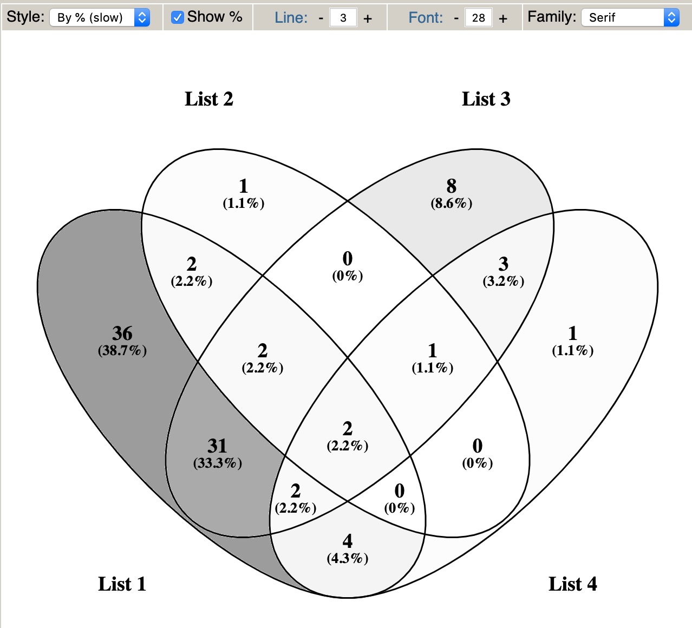

**Author(s)**: `r params$author`  
**Reviewer(s)**: `r params$reviewer`  
**Date**: `r Sys.Date()`  


# Academic Citation
If you use this code in your work or research, we kindly request that you cite our publication:

Xiaofan Lu, et al. (2025). FigureYa: A Standardized Visualization Framework for Enhancing Biomedical Data Interpretation and Research Efficiency. iMetaMed. https://doi.org/10.1002/imm3.70005

```{r setup, include=FALSE}
knitr::opts_chunk$set(echo = TRUE)
# 设置knitr代码块的全局选项 / Set global options for knitr code chunks
```

# 需求描述

vennyhttp://bioinfogp.cnb.csic.es/tools/venny/，新出来个选项，颜色填充by%。

缺点：只能填充灰色，只能保存成png。

我想要彩色，我想要pdf矢量图。

实现FigureYa112venn时还没有R包能直接实现这样按百分比填充颜色的效果，于是FigureYa112venn的作者李誉辉综合了VennDiagram和colorfulVennPlot等R包，实现了想要的效果。

后来高春辉写了R包ggVennDiagram，方便好用，下面就展示一下用这个R包画venn图的用法。

输入基因列表，画出按百分比填充颜色的venn图，并输出各个区域的基因名。

# Requirement description

vennyhttp://bioinfogp.cnb.csic.es/tools/venny/ A new option has emerged, color filling by%.

Disadvantage: It can only be filled in gray and can only be saved as PNG.

I want color, I want PDF vector graphics.

When we wrote FigureYa112venn, there was no R package that could directly achieve the effect of filling colors by percentage. Therefore, the author of FigureYa112venn, Li Yuhui, integrated R packages such as VennDiagram and colorfulVennPlot to achieve the desired effect.

Later, Gao Chunhui wrote the R package ggVennDiagram, which is convenient and easy to use. Below is a demonstration of how to use this R package to draw Venn diagrams.

Input the gene list, draw a Venn chart filled with colors by percentage, and output the gene names for each region.



出自<http://bioinfogp.cnb.csic.es/tools/venny/>

from<http://bioinfogp.cnb.csic.es/tools/venny/>

# 应用场景

展示重叠关系，例如多个分组之间共有的、特异的差异表达基因。

适用于2、3或4个list的overlap，超过4个用upsetR更合适。

# Application scenarios

Display overlapping relationships, such as shared and specific differentially expressed genes between multiple groups.

Suitable for overlaps of 2, 3, or 4 lists, with upsetR being more appropriate for more than 4 lists.

# 环境设置

# Environment settings

```{r}
source("install_dependencies.R")

# 加载stringr包 - 提供字符串处理函数
# Load the stringr package - provides functions for string processing
library(stringr)

# 加载ggplot2包 - 用于创建优雅的图形和可视化
# Load the ggplot2 package - used for creating elegant graphics and visualizations
library(ggplot2)

# 加载ggVennDiagram包 - 用于绘制维恩图
# Load the ggVennDiagram package - used for drawing Venn diagrams
library(ggVennDiagram)

# 加载export包 - 用于导出图形到不同格式
# Load the export package - used for exporting graphics to different formats
library(export)

# 设置环境变量使R显示英文错误信息（便于查找解决方案）
# Set environment variable to display R error messages in English (easier for finding solutions)
Sys.setenv(LANGUAGE = "en") 

# 禁止将字符向量自动转换为因子类型（避免意外的数据转换）
# Disable automatic conversion of character vectors to factors (to avoid unexpected data transformations)
options(stringsAsFactors = FALSE) 
```

自定义函数

Custom functions

```{r}
# 读取文件并筛选差异表达基因，保留统计数值
# 参数：
#   file - 输入文件路径
# 返回：
#   包含FDR值小于等于adjcutoff的差异表达基因的数据框
# Read a file and filter differentially expressed genes (DEGs), retaining statistical values
# Parameters:
#   file - Path to the input file
# Returns:
#   Data frame containing DEGs with FDR values less than or equal to adjcutoff
read_cut <- function(file){
  df <- read.table(file, header = T)
  DEG <- df[df$FDR <= adjcutoff, ]
}

# 读取文件并筛选差异表达基因，只保留基因名
# 参数：
#   file - 输入文件路径
# 返回：
#   包含FDR值小于等于adjcutoff的差异表达基因的ID向量
# Read a file and filter differentially expressed genes (DEGs), retaining only gene names
# Parameters:
#   file - Path to the input file
# Returns:
#   Vector containing IDs of DEGs with FDR values less than or equal to adjcutoff
read_cut_ID <- function(file){
  df <- read.table(file, header = T)
  DEG <- df[df$FDR <= adjcutoff, ]$id
}

# 读取文件并筛选差异表达基因，把上调和下调分开，只保留基因名
# 参数：
#   file - 输入文件路径
# 返回：
#   包含两个元素的列表：
#     up - FDR值小于等于adjcutoff且log2FC大于0的上调基因ID向量
#     down - FDR值小于等于adjcutoff且log2FC小于0的下调基因ID向量
# Read a file and filter differentially expressed genes (DEGs), separating upregulated and downregulated genes, retaining only gene names
# Parameters:
#   file - Path to the input file
# Returns:
#   List containing two elements:
#     up - Vector of IDs for upregulated genes (FDR <= adjcutoff and log2FC > 0)
#     down - Vector of IDs for downregulated genes (FDR <= adjcutoff and log2FC < 0)
read_cut_updown <- function(file){
  df <- read.table(file, header = T)
  DEG <- df[df$FDR <= adjcutoff, ]
  return(list(up = DEG[DEG$log2FC > 0,]$id, 
              down = DEG[DEG$log2FC < 0,]$id))
}
```

# 输入文件

SKCM_\*_test_result.\*.txt，差异表达结果，可以包含全部基因，这里用FDR筛选显著差异基因。

> 怎样获得差异表达结果？

- 用FigureYa59Plus_GEO2DEG 获得芯片的差异表达分析结果文件`easy_input_limma.csv`

- 用FigureYa118MulticlassDESeq2、FigureYa119Multiclasslimma和FigureYa120MulticlassedgeR获得RNA-seq的差异表达分析结果。

这里就以FigureYa118MulticlassDESeq2和FigureYa120MulticlassedgeR的输出文件作为输入，画出venn图展示不同对比的重叠情况。

# Input file

SKCM_\*_test_result.\*.txt， The differential expression results can include all genes, and here FDR is used to screen for significantly differentially expressed genes.

>How to obtain differential expression results?

-Using FigureYa59Plus_GEO2DEG Obtain the differential expression analysis result file of the chip 'easy_input_imma. csv'`

-Obtain differential expression analysis results of RNA seq using FigureYa118MulticlassDESeq2, FigureYa119Multiclasslimma, and FigureYa120MulticlassedgeR.

Here, taking the output files of FigureYa118MulticlassDESeq2 and FigureYa120MulticlassedgeR as inputs, draw Venn diagrams to show the overlap of different comparisons.

## 文件信息的整理

可参考`easy_input_info.txt`文件的格式，自己在Excel里写这个文件，至少要有第一列文件名和最后一列condition。

## Organizing file information

You can refer to the format of the 'easy_input_info. txt' file and write this file yourself in Excel, with at least the first column of file names and the last column of conditions.

```{r}
# 读取输入文件：获取当前目录下所有以"SKCM"开头、".txt"结尾的文件名
# 参数：
#   "SKCM*.txt" - 文件通配符，匹配所有SKCM开头的txt文件
# 返回：
#   包含所有匹配文件名的字符向量
# Read input files: retrieve all file names in the current directory starting with "SKCM" and ending with ".txt"
# Parameters:
#   "SKCM*.txt" - File wildcard to match all txt files starting with SKCM
# Returns:
#   Character vector containing all matched file names
fnames <- Sys.glob("SKCM*.txt")

# 整理文件信息：从文件名中提取分组和分析方法信息
# 参数：
#   file - 原始文件名向量
#   group - 从文件名中提取的分组信息（通过"."分割后的第二部分）
#   method - 从文件名中提取的分析方法信息（通过"_"分割后的第二部分）
# 返回：
#   包含文件名、分组、方法和组合条件的数据框
# Organize file information: extract group and analysis method information from file names
# Parameters:
#   file - Original file name vector
#   group - Group information extracted from file name (second part after splitting by ".")
#   method - Analysis method information extracted from file name (second part after splitting by "_")
# Returns:
#   Data frame containing file names, groups, methods, and combined conditions
finfo <- data.frame(file = fnames, 
                 group = str_split_fixed(fnames, "\\.",3)[,2],
                 method = str_split_fixed(fnames, "_",3)[,2])
finfo$condition <- paste(finfo$group, finfo$method, sep = "_")
head(finfo)

# 输出到文件：将整理后的文件信息保存为制表符分隔的文本文件
# 参数：
#   finfo - 待保存的数据框
#   "easy_input_info.txt" - 输出文件名
#   row.names = F - 不保存行名
#   quote = F - 不使用引号包裹字符值
#   sep = "\t" - 使用制表符作为分隔符
# 输出：
#   生成包含文件信息的文本文件
# Output to file: save the organized file information as a tab-separated text file
# Parameters:
#   finfo - Data frame to be saved
#   "easy_input_info.txt" - Output file name
#   row.names = F - Do not save row names
#   quote = F - Do not enclose character values in quotes
#   sep = "\t" - Use tab as separator
# Output:
#   Text file containing file information
write.table(finfo, "easy_input_info.txt", row.names = F,quote = F, sep = "\t")
```

## 差异表达基因筛选

## Differential expression gene screening

```{r}
# 读入文件信息：从制表符分隔的文本文件中读取先前整理的文件信息
# 参数：
#   "easy_input_info.txt" - 输入文件路径，需包含表头
# 返回：
#   包含文件元数据的数据框（文件名、分组、方法等）
# Read file information: load previously organized file metadata from a tab-separated text file
# Parameters:
#   "easy_input_info.txt" - Path to input file with headers
# Returns:
#   Data frame containing file metadata (names, groups, methods, etc.)
finfo <- read.table("easy_input_info.txt", header = T)

# 读入差异表达分析的结果，筛选显著差异基因
# 设置FDR调整后的p值阈值（可根据具体数据分析需求修改）
# Read differential expression analysis results and filter significant genes
# Set threshold for FDR-adjusted p-value (modify according to specific data analysis needs)
adjcutoff <- 0.05 #根据自己的数据修改阈值

# 读取文件并筛选差异表达基因
# 使用lapply函数对每个文件名调用read_cut函数，返回包含多个数据框的列表
# 参数：
#   fnames - 包含待读取文件名的字符向量
#   read_cut - 自定义函数，用于读取文件并筛选显著差异表达基因
# 返回：
#   命名列表，每个元素是一个数据框，包含一个样本的差异表达基因
# Read files and filter differentially expressed genes
# Apply read_cut function to each file name using lapply, returning a list of data frames
# Parameters:
#   fnames - Character vector containing file names to read
#   read_cut - Custom function to read file and filter significant DEGs
# Returns:
#   Named list where each element is a data frame containing DEGs for one sample
fdataset <- lapply(fnames, read_cut)
names(fdataset) <- finfo$condition

# 输出到Excel文件，每种对比结果占一个sheet，稍微修改一下格式就可以作为文章的Supplementary File了
# 使用openxlsx包将多个数据框写入Excel文件，每个数据框为一个工作表
# 参数：
#   fdataset - 包含多个数据框的列表，将作为不同工作表写入Excel
#   file = paste0(...) - 输出文件名，动态包含阈值信息
#   row.names = F - 不保存行名
# 输出：
#   包含多个工作表的Excel文件，可作为论文补充材料
# Output to Excel file: each comparison result occupies one sheet, 
# which can be used as Supplementary File after minor formatting
# Use openxlsx package to write multiple data frames to Excel, each as a worksheet
# Parameters:
#   fdataset - List containing multiple data frames to be written as worksheets
#   file = paste0(...) - Output file name dynamically including threshold information
#   row.names = F - Do not save row names
# Output:
#   Excel file with multiple worksheets, suitable for use as paper supplementary material
openxlsx::write.xlsx(fdataset, file = paste0("DEG_adj", adjcutoff, ".xlsx"), row.names = F)
```

# 开始画图

## 两个圈

对比两个文件

以SKCM_deseq2_test_result.immune_vs_Others.txt和SKCM_edgeR_test_result.immune_vs_Others.txt为例，展示在两种方法中都被筛到的差异基因。

# Start drawing

## Two circles

Compare two files

Taking SKCM_deseq2_test_desult.immune-vs_Others.txt and SKCM_ edgeR_test_desult.immune-vs_Others.txt as examples, show the differentially expressed genes that were screened in both methods.

```{r, fig.width=4, fig.height=4}
# 读取带有immune_vs_Others的文件，筛选差异基因
# 从文件信息中筛选分组为immune_vs_Others的文件，读取并提取差异表达基因ID
# 参数：
#   finfo[finfo$group == "immune_vs_Others",]$file - 筛选出分组为immune_vs_Others的文件名向量
#   read_cut_ID - 自定义函数，读取文件并返回差异表达基因ID
# 返回：
#   命名列表，每个元素是一个基因ID向量，对应一种分析方法的差异表达基因
# Read files containing "immune_vs_Others" and filter differentially expressed genes
# Filter files with group "immune_vs_Others" from file information, read and extract DEG IDs
# Parameters:
#   finfo[finfo$group == "immune_vs_Others",]$file - Vector of file names filtered by group "immune_vs_Others"
#   read_cut_ID - Custom function to read file and return DEG IDs
# Returns:
#   Named list where each element is a vector of gene IDs, corresponding to DEGs from one analysis method
list_ID <- lapply(finfo[finfo$group == "immune_vs_Others",]$file, read_cut_ID)
names(list_ID) <- finfo[finfo$group == "immune_vs_Others",]$method

# 画venn图
# 使用ggVennDiagram包绘制维恩图，展示不同分析方法鉴定的差异基因重叠情况
# 参数：
#   list_ID - 包含多个基因ID向量的列表
#   label_alpha=0 - 不显示区域内的文本标签
#   scale_fill_gradient - 设置填充颜色从白色到浅蓝色渐变
# 返回：
#   ggplot对象，可用于显示或保存维恩图
# Draw Venn diagram
# Use ggVennDiagram package to visualize overlapping DEGs identified by different methods
# Parameters:
#   list_ID - List containing multiple vectors of gene IDs
#   label_alpha=0 - Do not display text labels inside regions
#   scale_fill_gradient - Set fill color gradient from white to light blue
# Returns:
#   ggplot object for displaying or saving the Venn diagram
p <- ggVennDiagram(list_ID, label_alpha=0) + 
  scale_fill_gradient(low="white", high = "lightblue")
p

# 保存成pdf文件
# 将维恩图保存为PDF格式，设置宽度和高度为4英寸
# 参数：
#   "venn_2.pdf" - 输出文件名
#   width = 4, height = 4 - 图像宽高（英寸）
# 输出：
#   高质量矢量图形文件，可用于学术论文
# Save as PDF file
# Save the Venn diagram as PDF with width and height of 4 inches
# Parameters:
#   "venn_2.pdf" - Output file name
#   width = 4, height = 4 - Image dimensions in inches
# Output:
#   High-quality vector graphic file suitable for academic publications
ggsave("venn_2.pdf", width = 4, height = 4)

# 保存到ppt里
# 使用export包将ggplot对象导出到PowerPoint幻灯片
# 参数：
#   p - ggplot对象（维恩图）
#   file="venn_2.pptx" - 输出文件名
#   width = 4, height = 4 - 图像宽高（英寸）
# 输出：
#   包含矢量图形的PPTX文件，便于在演示中使用
# Export to PowerPoint
# Use export package to export ggplot object to PowerPoint slide
# Parameters:
#   p - ggplot object (Venn diagram)
#   file="venn_2.pptx" - Output file name
#   width = 4, height = 4 - Image dimensions in inches
# Output:
#   PPTX file containing vector graphic for easy presentation
graph2ppt(p, file="venn_2.pptx",width = 4,height = 4)

# 以上两种文件都是矢量图，可以在illustrator或ppt里打开修改文字和图形。
# Both output formats are vector graphics, editable in Illustrator or PowerPoint.

# 把各区域的基因输出到文件
# 提取维恩图各重叠区域的基因ID，保存到Excel文件
# 参数：
#   get_region_items(list_ID) - 获取列表中各组的交集和并集基因ID
#   "venn_2.xlsx" - 输出Excel文件名
# 输出：
#   包含多个工作表的Excel文件，每个表对应维恩图的一个区域
# Output genes in each Venn diagram region to file
# Extract gene IDs in each overlapping region and save to Excel file
# Parameters:
#   get_region_items(list_ID) - Get gene IDs for intersections and unions of groups in the list
#   "venn_2.xlsx" - Output Excel file name
# Output:
#   Excel file with multiple sheets, each representing a region in the Venn diagram
library(openxlsx)
venn_list <- list_ID
intersect_1_2 <- intersect(venn_list[[1]], venn_list[[2]])
write.xlsx(list(Intersect_1_2 = intersect_1_2), "venn_2.xlsx")

```

## 四个圈

对比四个文件

以SKCM_deseq2_test_result.immune_vs_Others.txt和SKCM_edgeR_test_result.immune_vs_Others.txt为例，把上调和下调拆开，展示在两种方法中都被筛到的差异基因。

## Four circles

Compare four files

Taking SKCM_deseq2_test_desult.immune-vs_Others.txt and SKCM_ edgeR_test_desult.immune-vs_Others.txt as examples, the upregulation and downregulation were separated to display the differentially expressed genes screened in both methods.

```{r, fig.width=6, fig.height=6}
file1 <- "SKCM_deseq2_test_result.immune_vs_Others.txt"
file2 <- "SKCM_edgeR_test_result.immune_vs_Others.txt"
list_ID <- list(deseq2_up = read_cut_updown(file1)$up,
                deseq2_down = read_cut_updown(file1)$down,
                edgeR_up = read_cut_updown(file2)$up,
                edgeR_up = read_cut_updown(file2)$down
)

# 画venn图
p <- ggVennDiagram(list_ID, label_alpha=0) + 
  scale_fill_gradient(low="white", high = "lightblue")
p

# 保存成pdf文件
ggsave("venn_4.pdf", width = 6, height = 6)

# 保存到ppt里
graph2ppt(p, file="venn_4.pptx",width = 6,height = 6)

# 把各区域的基因输出到文件
venn_list <- list_ID
intersect_1_2 <- intersect(venn_list[[1]], venn_list[[2]])
write.xlsx(list(Intersect_1_2 = intersect_1_2), "venn_4.xlsx")
```

## 三个圈

对比三个文件

以DESeq2获得的三种差异表达基因为例，展示其overlap

## Three circles

Compare three files

Taking the three differentially expressed genes obtained from DESeq2 as an example, demonstrate their overlap

```{r, fig.width=6, fig.height=6}
# 读取带有deseq2的文件，筛选差异基因
list_ID <- lapply(finfo[finfo$method == "deseq2", ]$file, read_cut_ID)
names(list_ID) <- str_remove(finfo[finfo$method == "deseq2",]$group, "_vs_Others")

# 画venn图，这次换个配色
p <- ggVennDiagram(list_ID, label_alpha=0) + 
  scale_fill_gradient(low="yellow", high = "brown")
p

# 保存成pdf文件
ggsave(paste0("venn_3.pdf"), width = 6, height = 6)

# 保存到ppt里
graph2ppt(p, file="venn_3.pptx",width = 6,height = 6)

# 把各区域的基因输出到文件
venn_list <- list_ID
intersect_1_2 <- intersect(venn_list[[1]], venn_list[[2]])
write.xlsx(list(Intersect_1_2 = intersect_1_2), "venn_3.xlsx")
```

# Session Info

```{r}
sessionInfo()
```