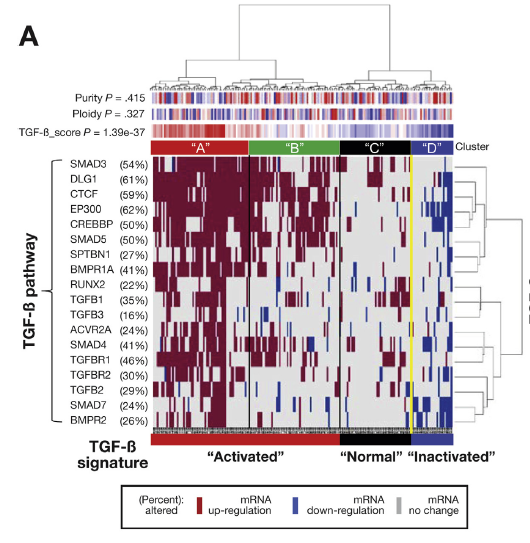

**Author(s)**: `r params$author`  
**Reviewer(s)**: `r params$reviewer`  
**Date**: `r Sys.Date()`  

# Academic Citation
If you use this code in your work or research, we kindly request that you cite our publication:

Xiaofan Lu, et al. (2025). FigureYa: A Standardized Visualization Framework for Enhancing Biomedical Data Interpretation and Research Efficiency. iMetaMed. https://doi.org/10.1002/imm3.70005

```{r setup, include=FALSE}
knitr::opts_chunk$set(echo = TRUE)
```

## 需求描述

仅对某感兴趣通路做聚类分析，同时纳入正常样本表达水平的考虑，来挖掘癌症样本异质性。大神丢的文章能解决我的问题，想画下面这个图

## Requirement description

Perform cluster analysis only on a specific pathway of interest, while considering the expression level of normal samples, to explore cancer sample heterogeneity. The article lost by the great god can solve my problem. I would like to draw the following image



出自<https://www.gastrojournal.org/article/S0016-5085(17)36144-9/abstract>

From<https://www.gastrojournal.org/article/S0016-5085(17)36144-9/abstract>

## 应用场景

在一组样本中某个geneset表达谱变异很大时，展示这个geneset的所有基因表达异质性。

同时还能根据这个geneset的基因表达谱对样本进行分组。分组结果可尝试用于解释样本的另一个性状或临床指标（如预后）的差异，最终证明该geneset与样本性状或临床指标的关联。

## Application scenarios

When there is significant variation in the expression profile of a certain gene set in a set of samples, display all gene expression heterogeneity of this gene set.

At the same time, samples can be grouped based on the gene expression profile of this geneset. The grouping results can be attempted to explain the differences in another trait or clinical indicator (such as prognosis) of the sample, ultimately proving the association between the geneset and the sample trait or clinical indicator.

## 环境设置

## Environment settings

```{r}
source("install_dependencies.R")
library(GSVA)
library(pheatmap)
library(gplots)

# 设置英文报错信息
# Set error messages to English
Sys.setenv(LANGUAGE = "en") 

# 禁止chr自动转换为factor
# Disable automatic conversion of character to factor
options(stringsAsFactors = FALSE) 
```

## 参数设置
## Parameter settings

```{r}
# 表达矩阵前多少列来自肿瘤样本
# Number of columns in the expression matrix from tumor samples
tumornumber <- 147 

# 表达矩阵后多少列来自正常样本
# Number of columns in the expression matrix from normal samples
normalnumber <- 50 

# 特征名称（如信号通路名称）
# Name of the signature (e.g., pathway name)
signaturename <- "TGFB" 

# 设置基因分类阈值，用于判断基因的表达状态
# Threshold for gene classification to determine expression status
halfwidth <- 0.025

# 样本分类个数
# Number of sample clusters
ClusterNumber <- 4

# 样本类对应颜色
# Colors corresponding to each sample cluster
ClusterColor = c("#B31E22","#529B40","#020105","#383D8E")
```

## 读取输入文件

需要两个输入文件：基因表达矩阵和感兴趣的基因通路

- easy_input_expr.csv，文章作者提供的32189*197基因表达矩阵(FPKM)，前147列来自肿瘤样本，后面是50个正常对照的表达谱。
- easy_input_signatures.csv，某一通路基因列表，此处是TGFbeta。

## Read input file

Two input files are required: gene expression matrix and gene pathway of interest

- easy_input_expr.csv， The 32189 * 197 gene expression matrix (FPKM) provided by the author of the article consists of the first 147 columns from tumor samples, followed by the expression profiles of 50 normal controls.
- easy_input_signatures.csv， A list of genes for a certain pathway, here TGFbeta.

```{r}
# 读取表达矩阵数据，设置首行为行名，禁止自动转换列名
# Read expression matrix data, set first column as row names, disable automatic conversion of column names
expr <- read.csv("easy_input_expr.csv", check.names = F, row.names = 1)

# 查看数据前几行几列的结构
# View the structure of the first few rows and columns of the data
expr[1:3,1:3]

# 读取基因集签名数据，仅保留第一列
# Read gene set signature data, keep only the first column
signature <- read.csv("easy_input_signatures.csv")[,1]

# 显示读取的基因集签名内容
# Display the content of the read gene signatures
signature
```

## 估计GSVA富集分数，后面用于检验富集分数在k个类的差异

## Estimate the GSVA enrichment score, which will be used later to test the differences in enrichment scores among k classes

```{r, warning=FALSE}
# 创建空列表用于存储基因集签名
# Create an empty list to store gene signatures
siglist <- list()

# 将指定基因集签名加入列表，键名为签名名称
# Add the specified gene signature to the list with signature name as key
siglist[[signaturename]] <- signature

# 对肿瘤样本进行GSVA富集分析
# Perform GSVA enrichment analysis on tumor samples
# 参数说明:
# - as.matrix(expr[,1:tumornumber]): 提取前tumornumber列的表达矩阵作为肿瘤样本
# - siglist: 包含基因集签名的列表
gsva_params <- gsvaParam(exprData = as.matrix(expr[,1:tumornumber]),
                         geneSets = siglist)
signature.gsva <- gsva(gsva_params)
```

## 根据正常样本signature基因表达将肿瘤样本基因表达状态分成3类：高标达、低表达、不变

## According to the normal sample signature gene expression, the gene expression status of tumor samples can be divided into three categories: high standard, low expression, and unchanged

```{r, warning=FALSE}
# 提取signature基因表达矩阵，筛选样本间有差异的基因
# Extract expression matrix of signature genes and filter genes with inter-sample variability
rowids <- intersect(rownames(expr), signature)  # 获取表达矩阵和基因集共有基因
logdata <- log2(expr[rowids, ] + 0.5)  # 对数转换表达值，加0.5避免log(0)
tumordata <- logdata[, 1:tumornumber]  # 提取肿瘤样本数据
var <- apply(tumordata, 1, sd, na.rm=T)  # 计算每个基因在肿瘤样本中的标准差
selvar <- var[var>0]  # 筛选有表达差异的基因(标准差>0)
tumordata <- tumordata[names(selvar), ]  # 仅保留有差异的基因
normaldata <- logdata[names(selvar), (tumornumber+1):(tumornumber+normalnumber)]  # 提取正常样本对应基因表达

# 根据文献方法提供的标准，判断各个基因相对于正常样本高表达或者低表达的状态
# Determine gene expression status (up/down) relative to normal samples based on literature criteria

# 首先设置基因分类阈值，计算各个基因在正常样本中高表达或者低表达阈值
# First, set thresholds for gene classification and calculate expression cutoffs from normal samples
halfwidth <- 0.025  # 分位数阈值(2.5%)
normaldown <- apply(normaldata, 1, function(x) quantile(x, probs=halfwidth, na.rm=T) )  # 低表达阈值(2.5%分位数)
normalup <- apply(normaldata, 1, function(x) quantile(x, probs=1-halfwidth, na.rm=T) )  # 高表达阈值(97.5%分位数)

# 根据判断表达状态，得到的状态矩阵用于聚类和绘图
# Determine expression status matrix for clustering and visualization
for (k in 1:nrow(tumordata)) {
  rowk <- as.numeric(tumordata[k, ])  # 获取当前基因在所有肿瘤样本中的表达值
  out <- rep(0, times=ncol(tumordata))  # 初始化表达状态为0(无变化)
  out[rowk>normalup[k]] <- 1  # 高于正常样本97.5%分位数标记为高表达(1)
  out[rowk<normaldown[k]] <- -1  # 低于正常样本2.5%分位数标记为低表达(-1)
  tumordata[k, ] <- out  # 更新表达状态矩阵
}

# 输出结果，不用于绘图
# Output results (not for plotting)
outdata <- tumordata  # 复制表达状态矩阵
outdata[outdata==1] <- "UP"  # 高表达标记为UP
outdata[outdata==-1] <- "DOWN"  # 低表达标记为DOWN
outdata[outdata==0] <- "NOCHANGE"  # 无变化标记为NOCHANGE
write.csv(outdata,"Ternary.csv",row.names = T,col.names = NA)  # 保存为CSV文件
```

## 聚类并绘图

## Cluster and plot

```{r, warning=FALSE}
### 行和列使用ward.D聚类
### Perform hierarchical clustering on rows and columns using Ward's method
hcg <- hclust(dist(tumordata), "ward.D")  # 行聚类 | Row clustering
hcs <- hclust(dist(t(tumordata)), "ward.D")  # 列聚类 | Column clustering
k <- ClusterNumber  # 列聚类数目 | Number of column clusters
group <- paste0("C", cutree(hcs, k))  # 生成聚类组名 | Generate cluster names
names(group) <- colnames(tumordata)  # 设置组名对应样本 | Assign cluster names to samples

# 注释信息
# Create annotation data frame
annCol <- data.frame(Cluster=group, score=signature.gsva[signaturename,])

# 检验TGFBscore在k个类的差异(非参),计算pvalue
# Test differential expression scores across clusters using Kruskal-Wallis test
p <- kruskal.test(annCol$score ~ as.factor(annCol$Cluster))$p.value
colnames(annCol)[2] <- paste0(signaturename, "_score P = ", format(p, digits = 3))  # 科学计数法保留2位 | Format p-value to 3 significant digits

# 对应注释信息的颜色
# Define colors for annotations
annColors <- list(Cluster = c(C1 = ClusterColor[1],
                              C2 = ClusterColor[2],
                              C3 = ClusterColor[3],
                              C4 = ClusterColor[4]),
                  bluered(64))  # 连续型变量的颜色渐变 | Color gradient for continuous variable
names(annColors)[2] <- colnames(annCol)[2]  # 设置颜色映射名称 | Set color mapping name

# 计算上调基因百分比并添加到行名
# Calculate percentage of upregulated genes and append to row names
pct <- paste0(round(rowSums(tumordata == 1)/ncol(tumordata), 2) * 100, "%")
rownames(tumordata) <- paste0(rownames(tumordata), " (", pct, ")")

# 绘图
# Generate heatmap with annotations
pheatmap(tumordata,
         cluster_rows = hcg,  # 使用预计算的行聚类结果 | Use precomputed row clustering
         cluster_cols = hcs,  # 使用预计算的列聚类结果 | Use precomputed column clustering
         color = c("#283285", "#DEDEDE", "#651430"),  # 颜色映射：低表达(蓝)、无变化(灰)、高表达(红) | Color scheme: down(blue), no-change(grey), up(red)
         annotation_col = annCol,  # 列注释信息 | Column annotations
         annotation_colors = annColors,  # 注释颜色映射 | Annotation color mapping
         fontsize_col = 2,  # 列名(样本)字体大小 | Column label font size
         fontsize_row = 8,  # 行名(基因)字体大小 | Row label font size
         fontsize = 6,  # 整体字体大小 | Overall font size
         cutree_cols = k,  # 列聚类切割为k组 | Cut columns into k clusters
         legend_breaks = c(-1, 0, 1),  # 图例断点 | Legend breaks
         legend_labels = c("mRNA\ndown-regulation", "mRNA\nno-change", "mRNA\nup-regulation"),  # 图例标签 | Legend labels
         filename = "Heatmap_TernaryCluster.pdf",  # 输出文件名 | Output file name
         width = 7,  # 图片宽度 | Figure width
         height = 5)  # 图片高度 | Figure height
```


# Session Info

```{r}
sessionInfo()
```
