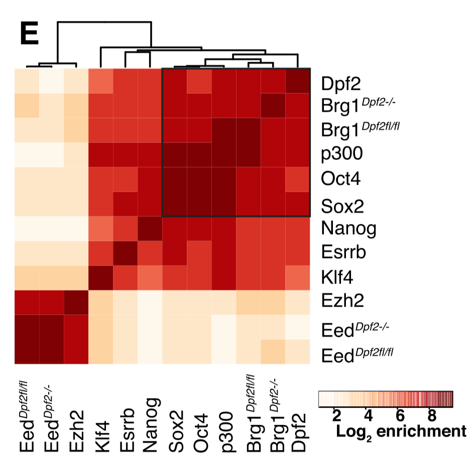

**Author(s)**: `r params$author`  
**Reviewer(s)**: `r params$reviewer`  
**Date**: `r Sys.Date()`  


# Academic Citation
If you use this code in your work or research, we kindly request that you cite our publication:

Xiaofan Lu, et al. (2025). FigureYa: A Standardized Visualization Framework for Enhancing Biomedical Data Interpretation and Research Efficiency. iMetaMed. https://doi.org/10.1002/imm3.70005

```{r setup, include=FALSE}
knitr::opts_chunk$set(echo = TRUE)
# 设置knitr代码块的全局选项 / Set global options for knitr code chunks
```

## 需求描述

ChIP-seq的correlation，用于找cofactor。

deeptools能实现类似的功能，但是它只选其中一个作为标准定为1，然后其他的和这个标准比。我要的是所有样品聚类，看哪一些更相似，没法选定哪个作为标准。我用diffbind做了，可以达到目的，想找到更好的方法。文献里面真不知道是怎么做到的，方法里面完全没有描述。

用这篇Cell
 paper<https://www.cell.com/cell/fulltext/S0092-8674(19)30629-4>的数据画类似这样的相关性热图：

## Requirement description

ChIP seq correlation, used to find cofactors.

Deeptools can achieve similar functionality, but it only selects one as the standard set as 1, and then compares the others with this standard. What I want is to cluster all the samples to see which ones are more similar, I can't choose which one as the standard. I used diffbind to achieve my goal and I want to find a better way. I really don't know how it was done in the literature, there is no description of the method at all.

Using this Cell
paper< https://www.cell.com/cell/fulltext/S0092-8674 (19) Draw a correlation heatmap similar to this for the data of 30629-4>:


出自：<https://genomebiology.biomedcentral.com/articles/10.1186/s13059-019-1721-4>

from: <https://genomebiology.biomedcentral.com/articles/10.1186/s13059-019-1721-4>


出自：<https://www.cell.com/cell/fulltext/S0092-8674(11)01155-X?_returnURL=https%3A%2F%2Flinkinghub.elsevier.com%2Fretrieve%2Fpii%2FS009286741101155X%3Fshowall%3Dtrue>

from: <https://www.cell.com/cell/fulltext/S0092-8674(11)01155-X?_returnURL=https%3A%2F%2Flinkinghub.elsevier.com%2Fretrieve%2Fpii%2FS009286741101155X%3Fshowall%3Dtrue>


出自：<https://www.cell.com/cell/fulltext/S0092-8674(17)30193-9?_returnURL=https%3A%2F%2Flinkinghub.elsevier.com%2Fretrieve%2Fpii%2FS0092867417301939%3Fshowall%3Dtrue>

from: <https://www.cell.com/cell/fulltext/S0092-8674(17)30193-9?_returnURL=https%3A%2F%2Flinkinghub.elsevier.com%2Fretrieve%2Fpii%2FS0092867417301939%3Fshowall%3Dtrue>



出自：<https://www.cell.com/cell-stem-cell/fulltext/S1934-5909(18)30591-5?_returnURL=https%3A%2F%2Flinkinghub.elsevier.com%2Fretrieve%2Fpii%2FS1934590918305915%3Fshowall%3Dtrue>

from: <https://www.cell.com/cell-stem-cell/fulltext/S1934-5909(18)30591-5?_returnURL=https%3A%2F%2Flinkinghub.elsevier.com%2Fretrieve%2Fpii%2FS1934590918305915%3Fshowall%3Dtrue>

## 应用场景

哪些调控蛋白的结合位点更相近？转录因子过表达/敲降后变得跟谁更像了？通过计算ChIP-seq数据间的correlation，找到线索，进而推测转录因子的作用机制。

## Application scenarios

Which regulatory proteins have binding sites that are more similar? Who is more similar to transcription factors after overexpression/knockdown? By calculating the correlation between ChIP seq data, clues can be found to infer the mechanism of action of transcription factors.

## 环境设置

下载并安装Anaconda发行版，https://www.anaconda.com/distribution/#download-section

用Jupyter notebook打开FigureYa115cofactor.ipynb文档

**用法参考这篇：**<https://mp.weixin.qq.com/s/G-CQhNEJBmMRuDe2kxND_w>

通过bioconda安装intervene, python 2.7环境：

**注：**下文以“```bash”开头的代码都要复制粘贴到Terminal里运行（Linux和MAC自带），Windows10用WSL。

## Environment settings

Download and install the Anaconda distribution, https://www.anaconda.com/distribution/#download -section

Open the FigureYa115cofactor.ipynb document with Jupyter notebook

**Refer to this article for usage:**< https://mp.weixin.qq.com/s/G-CQhNEJBmMRuDe2kxND_w >

Install Interne through Bioconda, Python 2.7 environment:

**Note: * * The code starting with 'bash' in the following text should be copied and pasted into Terminal to run (Linux and MAC built-in), Windows 10 uses WSI.

```bash
conda install -c bioconda intervene
```

```{r}
source("install_dependencies.R")
# 加载corrplot包，用于绘制相关系数矩阵图 | Load the corrplot package for visualizing correlation matrices
library(corrplot)

# 加载RColorBrewer包，用于生成色彩方案 | Load the RColorBrewer package for generating color schemes
library(RColorBrewer)

# 加载pheatmap包，用于绘制热图 | Load the pheatmap package for creating heatmaps
library(pheatmap)

# 设置环境变量使R显示英文错误信息 | Set environment variable to display error messages in English
Sys.setenv(LANGUAGE = "en") 

# 禁止将字符串自动转换为因子类型 | Disable automatic conversion of strings to factors
options(stringsAsFactors = FALSE) 
```

## 输入文件的获取

输入文件需要多个ChIP-seq的peak.bed文件。

## Retrieve input files

The input file requires multiple ChIP seq peak.bed files.

### 下载

例文的数据链接：<https://www.ncbi.nlm.nih.gov/geo/query/acc.cgi?acc=GSE120104>，点击Download中的(custom)，选择以’_ChIP_K562_OPTIMAL_ppr.IDR0.02.filt.narrowPeak.gz‘结尾的文件，下载的文件是GSE120104_RAW.tar，位于当前文件夹。

### Download

Data link for example text:< https://www.ncbi.nlm.nih.gov/geo/query/acc.cgi?acc=GSE120104 >Click on (custom) in Download and select the file that ends with '_ChIP_K562∝TIMAL_ppr.IDR0.02. tilt. arrowheadPeak. gz'. The downloaded file is GSE120104_SAW. tar, located in the current folder.

```bash
#解压缩
tar –xvf GSE120104_RAW.tar

#全部解压缩
gunzip *narrowPeak.gz
```

```bash
#Decompress
tar –xvf GSE120104_RAW.tar

#Extract all files
gunzip *narrowPeak.gz
```

### sort peak，并把文件名改为factor的名字

观察文件名发现，本套数据的peak.bed文件都以.narrowPeak结尾，factor的名字在`GSM*`和`_ChIP`之间。

根据本套数据的命名规则提取factor的名字，作为排序后的peak.bed的文件名

```bash
for i in `ls *.narrowPeak`
do
x=${i/_ChIP_K562*.narrowPeak/} 
x=${x/GSM*_/}
sort $i -k1,1V -k2,2n -k3,3n > $x.bed
done

#删除原有数据
rm -rf *.narrowPeak
```

实际操作中，自己的peak.bed文件的名字可以直接写成factor的名字，运行下面这段就好。如果你的peak.bed已经排过序，就可以跳过这部分，直接进入“开始画图”。

```bash
for i in `ls *.narrowPeak`
do
sort $i -k1,1V -k2,2n -k3,3n > $i
done

#删除原有数据
rm -rf *.narrowPeak
```

**题外话：**测序数据在发表文章时，作者会把数据上传到GEO/SRA数据库，GEO里除了原始的fastq、bigwig（bw）或bedGraph文件以外，大部分也提供了peak.bed文件。可以直接下载peak.bed文件，或者从头跑，call peak，生成peak.bed。可参考FigureYa107ChIPheatmap或FigureYa108RNAseqChIP。

**哪些数据更靠谱？**推荐首选高影响因子的文章里的数据，快速查询高分数据的方式，可参考FigureYa104GEOmining。

### sort peak， And change the file name to the name of factor

Observing the file names, it was found that the peak.bed files of this set of data all end with. narrowPeak, and the name of the factor is between 'GSM *' and '_ChIP'.

Extract the name of the factor according to the naming rules of this set of data, and use it as the file name for the sorted peak.bed

```bash
for i in `ls *.narrowPeak`
do
x=${i/_ChIP_K562*.narrowPeak/} 
x=${x/GSM*_/}
sort $i -k1,1V -k2,2n -k3,3n > $x.bed
done

#Delete existing data
rm -rf *.narrowPeak
```

In practical operation, the name of your peak.bed file can be directly written as the name of the factor. Just run the following paragraph. If your peak.bed has already been sorted, you can skip this section and go directly to "Start Drawing".

```bash
for i in `ls *.narrowPeak`
do
sort $i -k1,1V -k2,2n -k3,3n > $i
done

#Delete existing data
rm -rf *.narrowPeak
```

**Off topic: When publishing an article, the author will upload the sequencing data to the GEO/SRA database. In addition to the original fastq, bigwig (bw), or bedGraph files, most GEO also provides peak.bed files. You can directly download the peak.bed file or run it from scratch, call peak， Generate peak.bed. You can refer to FigureYa107ChIPheatmap or FigureYa108RNAseqChIP.

**Which data is more reliable? **Recommend selecting data from articles with high impact factors, and refer to Figure Ya104 GEOmining for a quick way to query high scoring data.

## 开始画图

## Start drawing

### 用intervene计算相关性

通过pearson或者spearman等计算不同peak之间的相关系数，例文用的是pearson

```bash
intervene pairwise -i ./*.bed --filenames --htype color --corr --corrtype pearson 
```

intervene还有许多参数，比如不计算fraction而用jaccard index，需要加--compute jaccard
--htype {tribar,dendrogram,color,pie,circle,square,ellipse,number,shade} 其他图形展示，还包括venn和upset等等，具体官方教程有详细例子，详见官方教程：<https://intervene.readthedocs.io/en/latest/index.html>

**输出文件：**运行结束，会在当前文件夹产生一个Intervene_results文件夹，里面包含3个文件：

- Intervene_pairwise_frac.pdf，Intervene给出的图

- Intervene_pairwise_frac.R，画上面那个图的代码。
- Intervene_pairwise_frac_matrix.txt，相关性矩阵，用它重新画自己喜欢的图。

### Calculate correlation using intervene

Calculate the correlation coefficient between different peaks using Pearson or Spearman, etc. The example used is Pearson

```bash
intervene pairwise -i ./*.bed --filenames --htype color --corr --corrtype pearson 
```

There are still many parameters in the interlayer, such as using the Jaccard index instead of calculating the fraction, which requires adding -- calculate Jaccard
--Htype {tribar, dendrogram, color, pie, circle, square, ellipse, number, shape} other graphic displays, including venn and upset, etc. The official tutorial provides detailed examples, please refer to the official tutorial:<https://intervene. readthedocs. io/en/latex/index. html>

**Output file: * * At the end of the run, an Intervene_ results folder will be generated in the current folder, containing three files:

-Intervene_ pairweise_frac.pdf, the diagram provided by Intervene

- Intervene_pairwise_frac.R， Draw the code for the image above.
- Intervene_pairwise_frac_matrix.txt， Correlation matrix, use it to redraw your favorite graph.

### 用corrplot画图

如果觉得上面的图不够cool，想多些自由发挥空间，就用‘Intervene_pairwise_frac_matrix.txt’文件DIY画图。hclust聚类图：

### Draw with corrplot

If you feel that the above image is not cool enough and want more free space to express yourself, you can DIY draw with the file 'Intervene_pairwas_frac_matrix. txt'. HCLUST Cluster Diagram:

```{r}
# 从文本文件读取交集矩阵数据并转换为矩阵格式 | Read intersection matrix data from text file and convert to matrix format
intersection_matrix <- as.matrix(read.table("Intervene_results/Intervene_pairwise_frac_matrix.txt"))

# 计算矩阵列之间的Pearson相关系数 | Compute Pearson correlation coefficients between columns of the matrix
intersection_matrix <- cor(intersection_matrix, method="pearson")

# Intervene自带的代码，打开Intervene_pairwise_frac.R文件就能看到
# Intervene's built-in code, can be found in Intervene_pairwise_frac.R file
#pdf("Intervene_pairwise_frac.pdf", width=8, height=8)

# 使用corrplot绘制相关系数矩阵图 | Visualize correlation matrix using corrplot
corrplot(intersection_matrix, 
         method ="color",  # 使用颜色表示相关系数 | Use color to represent correlation coefficients
         title="Pairwise intersection-pearson correlation(Fraction of overlap)",  # 图表标题 | Plot title
         tl.col="black", tl.cex=0.8,  # 设置文本标签颜色和大小 | Set text label color and size
         is.corr = TRUE,  # 输入是否为相关系数矩阵 | Whether input is a correlation matrix
         diag=FALSE, addrect=1,  # 不显示对角线，添加1个矩形框 | Don't show diagonal, add 1 rectangle
         mar=c(0,0,2,1),  # 设置边距 | Set margins
         rect.col = "black")  # 矩形框颜色 | Rectangle color
#invisible(dev.off())

# 充分利用corrplot的参数，让图上展示的信息更丰富
# Leverage more corrplot parameters to enhance information visualization
# https://cran.r-project.org/web/packages/corrplot/vignettes/corrplot-intro.html
pdf("Intervene_pairwise_frac_plus.pdf", width=8, height=8)  # 保存高信息密度图表为PDF | Save enhanced plot as PDF

#自定义颜色 | Custom color palette
cols <- brewer.pal(11,"Spectral")  # 使用Spectral调色板 | Use Spectral color palette
# 更多可选的调色板：BrBG PiYG PRGn PuOr RdBu RdGy RdYlBu RdYlGn Spectral
# More color palettes: BrBG PiYG PRGn PuOr RdBu RdGy RdYlBu RdYlGn Spectral

# 使用增强参数绘制相关系数矩阵图 | Enhanced visualization with more parameters
corrplot(intersection_matrix, 
         method ="color",  # 使用颜色表示相关系数 | Use color to represent correlation coefficients
         title="Pairwise intersection-pearson correlation(Fraction of overlap)",  # 图表标题 | Plot title
         tl.col="black", tl.cex=0.8,  # 设置文本标签颜色和大小 | Set text label color and size
         is.corr = TRUE,  # 输入是否为相关系数矩阵 | Whether input is a correlation matrix
         diag=FALSE,  # 不显示对角线 | Don't show diagonal
         col = cols,  # 使用自定义颜色 | Use custom color palette
         order = "hclust",  # 按层次聚类排序变量 | Order variables by hierarchical clustering
         addrect = 4,  # 添加4个聚类矩形框 | Add 4 clustering rectangles
         mar=c(0,0,2,1),  # 设置边距 | Set margins
         rect.col = "black")  # 矩形框颜色 | Rectangle color
invisible(dev.off())  # 关闭PDF设备 | Close PDF device
```


### 用pheatmap画图

corrplot的热图参数很丰富，然而不能画树。我们还是用pheatmap画吧～

### Draw with pheatmap

The heatmap parameters of corrplot are rich, but it cannot draw trees. Let's use pheatmap to draw it

```{r}
# 使用pheatmap绘制热图可视化相关性矩阵 | Visualize correlation matrix using pheatmap
pheatmap(intersection_matrix, 
         cellwidth = 8,  # 每个单元格的宽度（像素） | Width of each cell (pixels)
         cellheight = 8,  # 每个单元格的高度（像素） | Height of each cell (pixels)
         fontsize = 8,  # 文本字体大小 | Font size for text
         
         # 自定义颜色渐变：从深蓝色到白色再到深红色 | Custom color gradient: navy -> white -> firebrick
         color = colorRampPalette(c("navy", "white", "firebrick3"))(20),
         
         show_colnames = TRUE,  # 显示列名 | Show column names
         show_rownames = TRUE,  # 显示行名 | Show row names
         
         # 可选：隐藏行聚类树状图 | Optional: Hide row clustering dendrogram
         # treeheight_row = "0",
         
         # 可选：隐藏列聚类树状图 | Optional: Hide column clustering dendrogram
         # treeheight_col = "0",
         
         filename = "Intervene_pairwise_frac_tree.pdf",  # 保存的文件名 | Output file name
         border_color = "NA")  # 不显示单元格边框 | No border around cells
```


# Session Info

```{r}
sessionInfo()
```