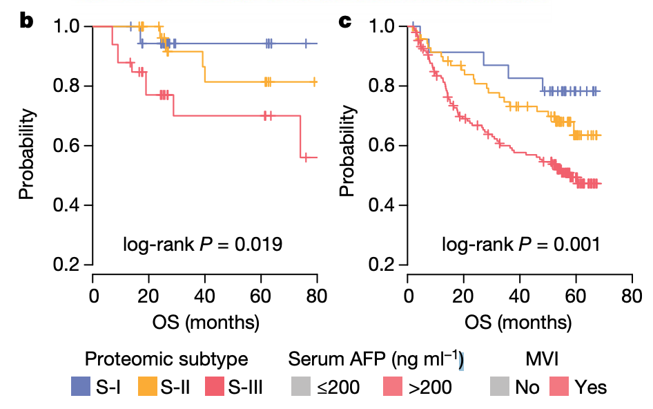

**Author(s)**: `r params$author`  
**Reviewer(s)**: `r params$reviewer`  
**Date**: `r Sys.Date()`  


# Academic Citation
If you use this code in your work or research, we kindly request that you cite our publication:

Xiaofan Lu, et al. (2025). FigureYa: A Standardized Visualization Framework for Enhancing Biomedical Data Interpretation and Research Efficiency. iMetaMed. https://doi.org/10.1002/imm3.70005

```{r setup, include=FALSE}
knitr::opts_chunk$set(echo = TRUE)
# 设置knitr代码块的全局选项 / Set global options for knitr code chunks
```

## 需求描述

已有一个表达谱进行了聚类，找到这个表达谱的signature genes ，同时对另外一个表达谱进行样本聚类。

## Requirement description

An expression profile has already been clustered, and the signature genes of this expression profile have been identified. At the same time, another expression profile has been subjected to sample clustering.



出自<https://www.nature.com/articles/s41586-019-0987-8>

from<https://www.nature.com/articles/s41586-019-0987-8>

## 应用场景

已有亚型的前提下（聚类得到，或者金标准亚型），寻找亚型marker后在独立数据集上做监督分析。

以皮肤黑色素瘤（TCGA-SKCM）为例，采用监督层次聚类算法，用它的金标准亚型寻找marker。利用监督层次聚类在验证集（假设TCGA-SKCM本身就是验证集）上识别新亚型。

## Application scenarios

Under the premise of existing subtypes (obtained through clustering or gold standard subtypes), search for subtype markers and perform supervised analysis on an independent dataset.

Taking skin melanoma (TCGA-SKCM) as an example, supervised hierarchical clustering algorithm is used to search for markers using its gold standard subtype. Use supervised hierarchical clustering to identify new subtypes on the validation set (assuming TCGA-SKCM itself is the validation set).

## 环境设置

## Environment settings

```{r}
source("install_dependencies.R")

# 加载ClassDiscovery包，用于聚类分析和生物信息学数据分析（Load the ClassDiscovery package for clustering analysis and bioinformatics data analysis）
library(ClassDiscovery)
# 加载survival包，用于生存分析（Load the survival package for survival analysis）
library(survival)
# 加载survminer包，用于可视化生存分析结果（Load the survminer package for visualizing survival analysis results）
library(survminer)
# 加载pheatmap包，用于绘制热图（Load the pheatmap package for creating heatmaps）
library(pheatmap)

# 设置系统环境语言为英文，以便显示英文报错信息（Set system environment language to English to display error messages in English）
Sys.setenv(LANGUAGE = "en") 

# 禁止将字符串自动转换为因子类型，保持数据原始格式（Prevent automatic conversion of strings to factors, keeping data in original format）
options(stringsAsFactors = FALSE) 
```

## 输入文件

easy_input_count.txt，表达矩阵，用于训练。采用监督聚类属于聚类分析，因此请选用聚类分析鲁棒的数据类型，例如FPKM、TPM、标准化的count值等等。

easy_input_count_test.txt，表达矩阵，用于验证。可以是TCGA通过抽样出的测试集，也可以是GEO等数据库下载的，数据类型要满足聚类分析要求。此处直接假设TCGA-SKCM本身为验证集，也就是在原有数据集的基础上做监督聚类，实际处理自己的数据时另外再提供一个表达矩阵作为expr_test。

easy_input_info.txt，包含样品的亚型、临床生存信息，用于做生存分析。

SKCM_deseq2_test_result.*_vs_Others.txt，多组差异分析结果，用于找到这个表达谱的signature genes，即marker基因。可以用FigureYa118MulticlassDESeq2，FigureYa119MulticlassLimma，FigureYa120MulticlassedgeR中任意一个的输出作为输入。

## Input file

easy_input_count.txt， Expression matrix, used for training. The use of supervised clustering belongs to cluster analysis, so please choose data types that are robust to cluster analysis, such as FPKM, TPM, standardized count values, and so on.

easy_input_count_test.txt， Expression matrix, used for verification. It can be a test set sampled by TCGA or downloaded from databases such as GEO, and the data type must meet the requirements of cluster analysis. Here, we assume that TCGA-SKCM itself is the validation set, which means that supervised clustering is performed on the basis of the original dataset. In actual data processing, an additional expression matrix is provided as the expr_test.

easy_input_info.txt， Contains subtype and clinical survival information of the sample for survival analysis.

SKCM_deseq2_test_result.*_vs_Others.txt， Multiple sets of differential analysis results are used to identify the signature genes, i.e. marker genes, of this expression profile. Can be used FigureYa118MulticlassDESeq2，FigureYa119MulticlassLimma，FigureYa120MulticlassedgeR Take any one of the outputs as input.

```{r}
# 读取训练集表达矩阵数据（Read training set expression matrix data）
expr <- read.table("easy_input_count.txt",sep = "\t",header = T,check.names = F,stringsAsFactors = F,row.names = 1)
expr[1:3,1:3]  # 查看数据前几行几列的基本结构（View the basic structure of the first few rows and columns）

# 读取验证集表达矩阵数据（Read validation set expression matrix data）
# expr_test <- read.table("easy_input_count_test.txt",sep = "\t",header = T,check.names = F,stringsAsFactors = F,row.names = 1)
# 此处直接假设TCGA-SKCM本身为验证集（Here we directly assume TCGA-SKCM dataset itself as validation set）
expr_test <- expr 

# 读取生存分析相关临床信息（Read clinical information for survival analysis）
Sinfo <- read.table("easy_input_info.txt",sep = "\t",header = T,check.names = F,stringsAsFactors = F,row.names = 1)
head(Sinfo)  # 查看生存数据的基本结构（View the basic structure of survival data）

# 差异表达分析结果文件名列表，这里以DESeq2为例（List of differential expression analysis result files, using DESeq2 results as example）
DEfiles <- c("SKCM_deseq2_test_result.immune_vs_Others.txt",
             "SKCM_deseq2_test_result.keratin_vs_Others.txt",
             "SKCM_deseq2_test_result.MITF-low_vs_Others.txt")
```

## 根据差异表达结果选取每种亚型特异性上调的marker

## Select subtype specific upregulated markers based on differential expression results

```{r}
# 设置差异表达基因筛选阈值（Set thresholds for differential expression gene screening）
fdrcut <- 0.25  # FDR校正p值阈值（FDR correction p-value threshold）
#logfccut <- 2  # 理论上不需要这个阈值（Theoretically this threshold is not needed）
top <- 100      # 每个比较组选取的top marker基因数目（Number of top marker genes selected per comparison group）

# 初始化空向量存储所有候选标记基因（Initialize empty vector to store all candidate marker genes）
marker <- c()

# 遍历所有差异表达分析结果文件（Loop through all differential expression analysis result files）
for (filek in DEfiles) {
  # 读取差异表达结果文件（Read differential expression results file）
  tmp <- read.table(filek,sep = "\t",header = T,check.names = F,stringsAsFactors = F,row.names = 1)
  
  # 提取FDR小于阈值且log2FC大于0的基因（Extract genes with FDR < threshold and log2FC > 0）
  # 这些基因在对应亚型中显著上调（These genes are significantly upregulated in the corresponding subtype）
  marker <- c(marker,rownames(tmp[which(tmp$FDR < fdrcut & tmp$log2FC > 0),]))
}

# 去除重复的候选标记基因（Remove duplicate candidate marker genes）
uqmarker <- setdiff(marker,marker[duplicated(marker)])

# 检查去重后是否存在重复基因（Check for remaining duplicate genes after deduplication）
if(!length(uqmarker) == length(unique(uqmarker))) {cat("Error!\n")}

# 初始化列表存储每个比较组的top marker（Initialize list to store top markers for each comparison group）
topmarker <- list()

# 再次遍历差异表达文件，筛选每个比较组的top marker（Loop through files again to select top markers for each group）
for (filek in DEfiles) {
  # 读取差异表达结果（Read differential expression results）
  tmp <- read.table(filek,sep = "\t",header = T,check.names = F,stringsAsFactors = F,row.names = 1)
  
  # 仅保留之前筛选出的非重复候选基因（Keep only non-duplicated candidate genes）
  tmp <- tmp[uqmarker,]
  
  # 筛选符合FDR和log2FC条件的基因（Filter genes meeting FDR and log2FC criteria）
  tmp <- tmp[which(tmp$FDR < fdrcut & tmp$log2FC > 0),]
  
  # 按log2FC降序排列，选取top个基因（Sort by log2FC descending and select top genes）
  # 如果符合条件的基因不足top个，则选取全部（Select all if fewer than top genes meet criteria）
  tmp <- rownames(tmp[order(tmp$log2FC,decreasing = T),])[1:ifelse(nrow(tmp) > top, top, nrow(tmp))]
  
  # 将筛选结果存入列表，键为文件名（Store筛选结果 into list with file name as key）
  topmarker[[filek]] <- tmp
}

# 检查所有top marker是否唯一（Check if all top markers are unique）
if(!length(unique(as.character(unlist(topmarker)))) == top * length(DEfiles)) {cat("Error!\n")}
```

## 监督层次聚类

**注意：**理论上这里需要一个独立的验证集，可以是TCGA通过抽样出的测试集，也可以是GEO等数据库下载的，数据类型要满足聚类分析要求。此处直接假设TCGA-SKCM本身为验证集，也就是在原有数据集的基础上做监督聚类，实际处理自己的数据时另外再提供一个文件给expr_test。

## Supervised hierarchical clustering

**Note: In theory, an independent validation set is required here, which can be a test set sampled by TCGA or downloaded from databases such as GEO. The data type should meet the requirements of cluster analysis. Here, we assume that TCGA-SKCM itself is the validation set, which means that supervised clustering is performed on the basis of the original dataset, and an additional file is provided to expr_test when processing its own data.

```{r}
# 取每个亚型的top marker与测试集表达矩阵的交集（Intersect top markers with genes in test dataset）
# 确保用于聚类的基因都存在于测试集中（Ensure all clustering genes exist in test dataset）
gene_sel <- lapply(topmarker, function(x){return(intersect(x, rownames(expr_test)))})

# 将筛选后的marker合并为一维字符向量（Combine selected markers into a single character vector）
topmarker.sc <- as.character(unlist(gene_sel))

# 提取测试集中的marker基因表达量并进行log2转换（Extract marker gene expression and perform log2 transformation）
# +1处理避免log(0)错误（+1 to avoid log(0) error）
indata <- log2(expr_test[topmarker.sc,] + 1) 

# 使用Pearson相关系数计算样本间距离矩阵，采用Ward方法进行层次聚类（Calculate sample distance matrix using Pearson correlation and perform hierarchical clustering with Ward's method）
# 修改层次聚类参数请参阅??distanceMatrix（See ??distanceMatrix for clustering parameter modification）
hcs <- hclust(distanceMatrix(as.matrix(indata), "pearson"), "ward.D")

# 将样本聚为3类，与金标准分类数保持一致（Cluster samples into 3 groups to match gold standard classification）
# sc表示supervised cluster（sc stands for supervised cluster）
scgroup <- cutree(hcs, k = 3)

# 将聚类结果转换为scC1, scC2, scC3格式（Convert cluster labels to scC1, scC2, scC3 format）
scgroup <- paste0("scC", as.character(scgroup))
names(scgroup) <- colnames(indata)  # 设置样本名称为聚类结果的名称（Set sample names for clustering results）
```

## 画热图确定亚型对应关系 

层次监督聚类法优点是很灵活，但缺陷是你不知道原本的C1是不是监督聚类后名义上的C1（可能变成了C2），因此最好是用监督聚类的marker画个热图，肉眼判断具体的亚型对应关系，并重新命名给出对应的颜色。

这里简单画个热图判断具体的亚型对应关系，更复杂的外部聚类绘制热图可参考FigureYa91cluster_heatmap

## Draw a heat map to determine the correspondence between subtypes

The advantage of hierarchical supervised clustering is that it is very flexible, but the drawback is that you do not know whether the original C1 is the nominal C1 after supervised clustering (it may become C2). Therefore, it is best to use a supervised clustering marker to draw a heatmap, visually determine the specific subtype correspondence, and rename it with the corresponding color.

Here is a simple heatmap to determine the specific subtype correspondence. For more complex external clustering heatmaps, please refer to FigureYa91cluster_ heatmap

```{r}
### 设置颜色 ###
# 定义用于热图聚类注释的颜色方案（Define color scheme for heatmap cluster annotation）
blue <- "#6C86EB"  # 蓝色用于标记scC2簇（Blue for scC2 cluster）
gold <- "#FDA810"  # 金色用于标记scC1簇（Gold for scC1 cluster）
red  <- "#FE5B64"  # 红色用于标记scC3簇（Red for scC3 cluster）

# 创建样本注释数据框，用于热图列注释（Create sample annotation data frame for column annotation in heatmap）
annCol.sc <- data.frame(scC=as.character(scgroup),
                        row.names = names(scgroup),
                        stringsAsFactors = F)

# 定义热图注释颜色映射（Define color mapping for heatmap annotations）
# 注意：颜色顺序需与聚类结果匹配，可能需要根据热图调整（Note: Color order must match clustering results, may need adjustment based on heatmap）
annColors <- list("scC" = c("scC1" = gold, "scC2" = blue, "scC3" = red))

# 数据标准化与截断处理（Data standardization and truncation）
# 对基因表达矩阵进行样本间Z-score标准化（Perform Z-score normalization across samples for each gene）
plotdata <- t(scale(t(indata)))
# 截断极端值以增强热图视觉效果（Truncate extreme values for better heatmap visualization）
plotdata[plotdata > 3] <- 3
plotdata[plotdata < -3] <- -3

# 绘制热图展示聚类结果（Generate heatmap to visualize clustering results）
pheatmap(plotdata,
         annotation_col = annCol.sc,          # 使用之前创建的样本聚类注释（Use sample cluster annotations）
         annotation_colors = annColors,       # 应用自定义颜色映射（Apply custom color mapping）
         cluster_cols = hcs,                  # 使用之前计算的层次聚类结果（Use precomputed hierarchical clustering results）
         cluster_rows = F,                    # 不对基因进行聚类（Do not cluster genes）
         show_rownames = F,                   # 隐藏基因名称（Hide gene names）
         show_colnames = F,                   # 隐藏样本名称（Hide sample names）
         filename = "heatmap for validation set by top markers.pdf")  # 保存热图为PDF（Save heatmap as PDF）
```


从生成的热图可以看到，topmarker中第一个marker list（immune的高表达基因）对应的高表达热图色块位于scC3下，所以它对的immune类，分配蓝色。

同理，topmarker对应的第二个marker list（keratin的高表达基因）的高表达热图色块位于scC1下，所以它对应keratin，分配红色。

请自行推理黄色色块。

From the generated heatmap, it can be seen that the high expression heatmap color block corresponding to the first marker list (high expression genes of immune) in topmarker is located under scC3, so it is assigned blue for the immune class.

Similarly, the high expression heatmap color block of the second marker list (high expression genes of keratin) corresponding to topmarker is located under scC1, so it corresponds to keratin and is assigned in red.

Please reason for the yellow color block on your own.

## 开始画图

## Start plot

```{r}
# 数据预处理：将生存时间列中的非数值标记替换为缺失值（Data preprocessing: Replace non-numeric markers in survival time column with NA）
# 处理原始数据中存在的异常值（Handle outliers in original data）
Sinfo[which(Sinfo$futime == "[Discrepancy]"), "futime"] <- NA

# 将生存时间列转换为数值类型（Convert survival time column to numeric type）
Sinfo$futime <- as.numeric(Sinfo$futime)

# 将聚类结果合并到生存信息数据框中（Merge clustering results into survival information dataframe）
# 使用样本ID作为索引匹配（Match by sample ID）
Sinfo$scgroup <- scgroup[rownames(Sinfo)]
```

### 主分类的生存分析（金标准或训练集聚类结果）

如果只是想画生存曲线，可参考FigureYa1survivalCurve。

### Survival analysis of the main classification (gold standard or training set clustering results)

If you just want to draw a survival curve, you can refer to FigureYa1survivalCurve.

```{r}
# 执行对数秩检验(Log-rank test)比较不同亚型的生存差异（Perform Log-rank test to compare survival differences between subtypes）
# Surv(futime, fustat)：定义生存时间和事件状态（Define survival time and event status）
# ~ subtype：按亚型分组比较（Group comparison by subtype）
# na.action=na.exclude：排除含缺失值的样本（Exclude samples with missing values）
fitd <- survdiff(Surv(futime, fustat) ~ subtype, data=Sinfo, na.action=na.exclude)

# 计算对数秩检验的p值（Calculate p-value from Log-rank test）
# fitd$chisq：卡方统计量（Chi-square statistic）
# length(fitd$n)-1：自由度（Degrees of freedom）
p.val <- 1 - pchisq(fitd$chisq, length(fitd$n) - 1)

# 拟合Kaplan-Meier生存曲线（Fit Kaplan-Meier survival curves）
# type="kaplan-meier"：指定使用K-M方法（Specify Kaplan-Meier method）
# error="greenwood"：使用Greenwood公式计算标准误差（Calculate standard error using Greenwood formula）
# conf.type="plain"：使用普通置信区间（Use plain confidence interval）
fit <- survfit(Surv(futime, fustat) ~ subtype, data=Sinfo, 
               type="kaplan-meier", error="greenwood", 
               conf.type="plain", na.action=na.exclude)

# 绘制生存分析可视化结果（Plot survival analysis results）
survp1 <- ggsurvplot(fit, 
                     conf.int=F,                # 不显示置信区间（Do not show confidence interval）
                     risk.table=F,              # 不显示风险表（Do not show risk table）
                     risk.table.col="strata",   # 风险表按组别着色（Color risk table by group）
                     palette=c(blue, red, gold), # 指定各组颜色（Specify colors for each group）
                     data=Sinfo,
                     size=0.8,                  # 设置曲线粗细（Set curve line width）
                     font.legend=10,            # 设置图例字体大小（Set legend font size）
                     # 自定义p值显示格式（Customize p-value display format）
                     pval=paste0("Log-rank P ", ifelse(p.val < 0.001, "< 0.001", paste0("= ", round(p.val, 3)))))

# 保存生存分析图为PDF文件（Save survival plot as PDF file）
ggsave("training_data.pdf")
```


### 验证集的生存分析

### Survival analysis of validation set

```{r}
# 执行对数秩检验比较不同聚类组的生存差异（Perform Log-rank test to compare survival differences between clustering groups）
# 使用层次聚类得到的scgroup作为分组变量（Use scgroup from hierarchical clustering as grouping variable）
fitd2 <- survdiff(Surv(futime, fustat) ~ scgroup, data=Sinfo, na.action=na.exclude)

# 计算对数秩检验的p值（Calculate p-value for Log-rank test）
p.val2 <- 1 - pchisq(fitd2$chisq, length(fitd2$n) - 1)

# 拟合Kaplan-Meier生存曲线（Fit Kaplan-Meier survival curves）
# 按scgroup聚类结果分组（Group by scgroup clustering results）
fit2 <- survfit(Surv(futime, fustat) ~ scgroup, data=Sinfo, 
                type="kaplan-meier", error="greenwood", 
                conf.type="plain", na.action=na.exclude)

# 绘制生存分析可视化结果（Plot survival analysis results）
survp2 <- ggsurvplot(fit2, 
                     conf.int=F,                # 不显示置信区间（Do not show confidence interval）
                     risk.table=F,              # 不显示风险表（Do not show risk table）
                     risk.table.col="strata",   # 风险表按组别着色（Color risk table by group）
                     # 根据热图中的聚类颜色手动指定对应颜色（Manually specify colors to match heatmap clustering）
                     # 顺序需与scC1, scC2, scC3对应（Order must match scC1, scC2, scC3）
                     palette=c(gold, blue, red), 
                     data=Sinfo,
                     size=0.8,                  # 设置曲线粗细（Set curve line width）
                     font.legend=10,            # 设置图例字体大小（Set legend font size）
                     # 自定义p值显示格式（Customize p-value display format）
                     pval=paste0("Log-rank P ", ifelse(p.val2 < 0.001, "< 0.001", paste0("= ", round(p.val2, 3)))))

# 保存生存分析图为PDF文件（Save survival plot as PDF file）
ggsave("testing_data.pdf")
```


## Session Info

```{r}
sessionInfo()
```