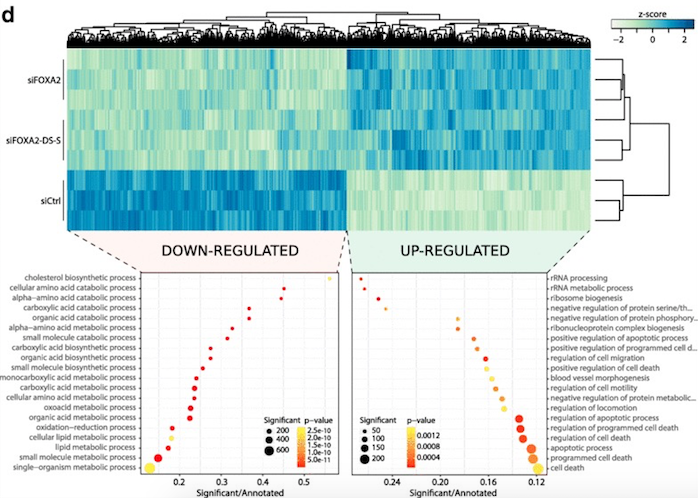

**Author(s)**: `r params$author`  
**Date**: `r Sys.Date()`  


# Academic Citation
If you use this code in your work or research, we kindly request that you cite our publication:

Xiaofan Lu, et al. (2025). FigureYa: A Standardized Visualization Framework for Enhancing Biomedical Data Interpretation and Research Efficiency. iMetaMed. https://doi.org/10.1002/imm3.70005


```{r setup, include=FALSE}
knitr::opts_chunk$set(echo = TRUE)
```

# 需求描述
# Requirement description

用R代码画出paper里的基因功能富集分析泡泡图，按对角线排列很好看

热图用代码9解决，本代码解决泡泡图

Use R code to draw the gene function enrichment analysis bubble map from the paper, it looks good arranged diagonally

Heat maps are solved with code 9, this code solves bubble maps



# 使用场景
# Usage scenario

场景一：展示基因功能富集分析的结果

场景二：多维度的数据信息展示

Scenario 1: Present the results of gene function enrichment analysis

Scenario 2: Multi-dimensional data information display

# 环境设置
# Environment setting

```{r}
source("install_dependencies.R")

library(ggplot2)

Sys.setenv(LANGUAGE = "en") #显示英文报错信息 display English error messages
options(stringsAsFactors = FALSE) #禁止chr转成factor prohibit the conversion of chr to factor
```

# 输入数据
# Input data

例文左半部分是下调表达的基因，右侧是上调表达的基因。

我们这里都用easy_input.txt文件，实际应用时，替换成你的富集分析结果即可。

至少包括：Term、Pvalue、number of genes in group(test, Pop.Hits)，number of annotated gene(background, Count)或者Gene Ratio(test/background)

The left half of the example shows down-regulated genes, while the right side shows up-regulated genes.

We all use the easy_input.txt file here, just replace it with the results of your enrichment analysis when you actually apply it.

Include at least: Term, Pvalue, number of genes in group (test, Pop.Hits), number of annotated gene (background, Count) or Gene Ratio (test/background)

```{r}
df <- read.table("easy_input.txt", header = T, sep = "\t", as.is = T)
head(df)
# 算一下gene ratio
# calculate the gene ratio
df$GeneRatio <- df$Pop.Hits/df$Count
```

# 开始画图
# Start drawing

例图横坐标是GeneRatio，点的大小是组内基因数量，颜色代表pvalue。

实际应用时，可以把横坐标、颜色或点的大小所代表的特征值改为你想要的其他列。

The horizontal coordinate of the example plot represents GeneRatio, the size of the dots indicates the number of genes in the group, and the color represents the p-value.

In practical applications, you can modify the feature values represented by the horizontal coordinates, colors, or point sizes to the other columns you want.

```{r, fig.height=6, fig.width=8}
# 查看GeneRatio的最大值和最小值，可以用来确定合理的x轴范围
# viewing the maximum and minimum values of GeneRatio can be used to determine a reasonable range for the x-axis
summary(df$GeneRatio)

# 为了画出对角线排列的效果，按GeneRatio排序
# To draw a diagonal arrangement effect, sorted by GeneRatio
sortdf <- df[order(df$GeneRatio), ] #如果想按Pvalue排序，就把GeneRatio改为PValue If you want to sort by Pvalue, change the GeneRatio to PValue
sortdf$Term <- factor(sortdf$Term, levels = sortdf$Term)

pl <- ggplot(sortdf, aes(GeneRatio, Term, #横坐标、纵坐标 horizontal and vertical coordinates
              colour = PValue)) + # 颜色代表p-value color represents p-values
  geom_point(aes(size= Count)) + #圆点的大小代表组内基因数 the size of the dots represents the number of genes in the group
  scale_size_continuous(range = c(2,10)) + #圆点的大小范围 size range of the dot
  scale_color_gradientn(colours=c("red", "yellow")) + #可以自己改颜色 you can change the color yourself
  #scale_x_continuous(limits = c(0.2,1)) + #设置x轴范围 set the x-axis range
  theme_bw() + 
  ylab("") + 
  theme(legend.position=c(1,0), legend.justification = c(1, 0)) + #legend画在右下角 the legend is drawn in the lower right corner
  #下面两行让legend融入图
  #the next two lines make the legend fit into the plot
  theme(legend.background = element_blank()) + #移除legend整体的边框 remove the overall border of the legend
  theme(legend.key = element_blank())#移除legend每个项目周围的边框 remove the border around each item in the legend
pl

ggsave("dot.pdf", width = 7, height = 6)
# 还可以直接保存为png、tiff等格式
# you can also save directly as png, tiff, etc.
#ggsave("dot.png", width = 7, height = 6)
#ggsave("dot.tiff", width = 7, height = 6)
```

想按相反的方向排序，只需在排序的时候加上decreasing = T

把term放到右侧，添加scale_y_discrete(position = "right")

To sort in the opposite direction, just add decreasing = T

Put term on the right, add scale_y_discrete(position = “right”)

```{r, fig.height=6, fig.width=8}
sortdf <- df[order(df$GeneRatio, decreasing = T), ] #降序 descending order
sortdf$Term <- factor(sortdf$Term, levels = sortdf$Term)

pr <- ggplot(sortdf, aes(GeneRatio, Term, 
              colour=PValue)) + 
  geom_point(aes(size=Count)) + 
  scale_color_gradientn(colours=c("red", "yellow")) + 
  scale_size_continuous(range = c(2, 10)) + 
  #scale_x_continuous(limits = c(0.2, 1)) + 
  ylab("") + 
  scale_y_discrete(position = "right") + #把term放到右侧 put term on the right
  
  theme_bw() + 
  theme(legend.position=c(0, 0), legend.justification = c(0, 0)) + #legend画在左下角 the legend is drawn in the lower left corner
  theme(legend.background = element_blank()) + 
  theme(legend.key = element_blank())
pr
```

把两个图并排组合到一起

Put two plots side by side

```{r, fig.height=6, fig.width=15}
library(cowplot)
plot_grid(pl, pr, labels = "")
ggsave(file="bubbles.pdf")
```

# 会话信息
# SessionInfo

```{r}
sessionInfo()
```