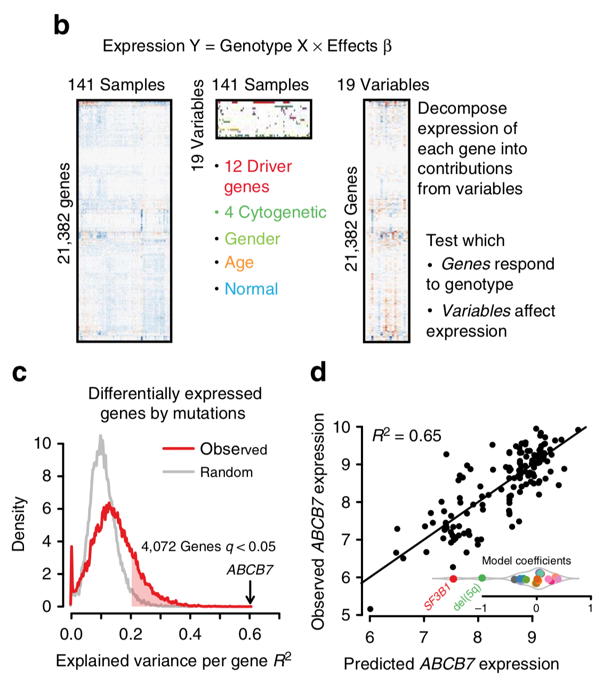

**Author(s)**: `r params$author`  
**Reviewer(s)**: `r params$reviewer`  
**Date**: `r Sys.Date()`  


# Academic Citation
If you use this code in your work or research, we kindly request that you cite our publication:

Xiaofan Lu, et al. (2025). FigureYa: A Standardized Visualization Framework for Enhancing Biomedical Data Interpretation and Research Efficiency. iMetaMed. https://doi.org/10.1002/imm3.70005

```{r setup, include=FALSE}
knitr::opts_chunk$set(echo = TRUE)
# 设置knitr代码块的全局选项 / Set global options for knitr code chunks
```

## 需求描述

虽然原文附件给出了代码，但自己看着费劲，请高手带我们理解并复现原文的Figure 1b建模。

## Requirement description

Although the original attachment provides the code, it seems difficult for us to understand and reproduce the Figure 1b modeling in the original text. Please help us understand and reproduce it.



出自<http://www.nature.com/articles/ncomms6901>

from<http://www.nature.com/articles/ncomms6901>

代码在原文补充材料中有提供，里面有很多东西值得学习。同时我自己写了一些比原文精简的代码（一些数据命名尽量和原文一致，确保小伙伴跑的时候能够理解不同做法的异曲同工）。

像这种附带代码的好文章越来越多，是非常好的学习资源。

这类文章怎么找到呢？在感兴趣的期刊主页的高级搜索里，搜code或script，同时限定research article和发表年份等信息。检索结果里会有上下文，一眼扫过去，就能看到哪些文章带代码。

怎样学习这类代码？这次就从这篇带代码的文章带你上手，以后你就可以自己去挖宝藏了。推荐路线：

- 先尝试自己写，或者至少在脑子里猜测作者是用什么方法哪个包实现的
- 看原文代码，边看边实践
- 记笔记，思考这段代码能应用到哪些场景上，可以尝试按照FigureYa的格式来写，或者干脆写成R包（Guangchuang Yu说写R包要趁早）
- 用在自己的数据上，争取能用到paper里，经历了这一过程，你会有质的提升

自己死磕一篇文章的代码是孤独的，遇到问题也没人讨论，以后有机会我们可以搞个学习小组，感兴趣的小伙伴一起讨论同一篇文章的代码。

The code is provided in the supplementary materials of the original text, and there are many things worth learning from it. At the same time, I wrote some code that was more concise than the original text (some data names should be as consistent as possible with the original text to ensure that my friends can understand the similarities of different approaches when running).

There are more and more good articles with accompanying code, which are very good learning resources.

How can I find such articles? Search for code or script on the advanced search page of the journal, while limiting information such as research article and publication year. There will be context in the search results, and at a glance, you can see which articles have code.

How to learn this type of code? This time campaign will take you through this article with code, so you can dig for treasure on your own in the future. Recommended route:

-Try writing it yourself first, or at least guess in your mind what method and package the author used to implement it
-Read the original code and practice while reading
-Take notes and think about which scenarios this code can be applied to. You can try writing it in the format of FigureYa, or simply write it as an R package (Guangchuang Yu said it's better to write an R package as soon as possible)
-Apply it to your own data and strive to use it in a paper. Through this process, you will have a qualitative improvement

It's lonely to tinker with the code of an article by oneself, and no one will discuss it when encountering problems. In the future, we can form a study group where interested friends can discuss the code of the same article together.

## 应用场景

已有genotype和转录数据，通过线性模型解析突变对基因表达的贡献，即基因表达如何响应不同的genotype，不同的突变如何影响基因表达。

该模型的假设：

1. 每个突变位点只是影响特定的一些基因的表达；

2. 包含2种以上突变的个体，基因表达变化为两个或多个突变影响基因集合的并集；

缺点：该模型忽略了基因间的相互调控。

如果想要系统的研究基因之间的相互关系，就需要更多的基因样本容量，所以该线性模型方法是相对小样本量的很好的方式。

## Application scenarios

There is already genotype and transcription data available, and a linear model is used to analyze the contribution of mutations to gene expression, that is, how gene expression responds to different genotypes and how different mutations affect gene expression.

The assumption of this model is:

1. Each mutation site only affects the expression of specific genes;

2. Individuals with two or more mutations whose gene expression changes result in the union of gene sets affected by two or more mutations;

Disadvantage: This model ignores the mutual regulation between genes.

If you want to systematically study the interrelationships between genes, you need more gene sample sizes, so this linear model method is a good way for relatively small sample sizes.

## 环境设置

## Environment settings

```{r}
source("install_dependencies.R")

# 加载用于读取Excel文件的包
# Load the package for reading Excel files
library(openxlsx)
# 加载用于芯片数据处理的包
# Load the package for microarray data processing
library(GEOquery)
library(affy) 
# 加载用于芯片数据处理的包（GCRMA算法）
# Load the package for microarray data processing (GCRMA algorithm)
library(gcrma) 
# 加载人类基因注释包
# Load the human gene annotation package
library(org.Hs.eg.db) 
# 加载人类芯片(hgu133plus2)注释包
# Load the human microarray (hgu133plus2) annotation package
library(hgu133plus2.db) 
# 加载线性模型分析包
# Load the package for linear model analysis
library(limma) 
# 加载颜色方案包
# Load the package for color palettes
library(RColorBrewer) 

# 设置环境变量，使R显示英文报错信息
# Set environment variable to display error messages in English
Sys.setenv(LANGUAGE = "en") 
# 设置选项，禁止将字符串自动转换为因子类型
# Set option to prevent automatic conversion of strings to factors
options(stringsAsFactors = FALSE) 
```

## 输入数据的预处理

需要两种输入数据：表达数据和基因型数据

表达数据：159个突变体和17个正常个体芯片数据，下载地址：< http://www.ncbi.nlm.nih.gov/geo/query/acc.cgi?acc=GSE58831>，点击Download里的http下载（早上下载速度更快），解压缩到当前文件夹。

genotype和表型数据：Supplementary Data 1—ncomms6901-s2.xlsx，其中部分个体数据缺失。

## Preprocessing of input data

Two types of input data are required: expression data and genotype data

Expression data: Chip data from 159 mutants and 17 normal individuals, download link:< http://www.ncbi.nlm.nih.gov/geo/query/acc.cgi?acc=GSE58831 >Click on the HTTP download in Download (faster download speed in the morning), and extract it to the current folder.

Genotype and phenotype data: Supplementary Data 1- ncomms6901-s2.xlsx, with some individual data missing.

### 芯片数据处理：

以下是芯片数据处理过程，主要用到affy，gcrma包

下面这一步需要较长的运行时间，我把运行结果gset保存在文件里，便于再次运行时读取

### Chip data processing:

The following is the chip data processing process, mainly using the affy and gcrma packages

The following step requires a relatively long running time. I will save the running result gset in a file for easy retrieval when running again

```{r}
if (!file.exists("gset.RData")) {
  cat("gset.RData not found. Downloading from GEO...\n")
  
  gset_list <- getGEO('GSE58831', destdir = ".", getGPL = FALSE)
  
  if (length(gset_list) > 0) {
    gset <- gset_list[[1]]
    save(gset, file = "gset.RData")
    cat("Downloaded and saved gset.RData successfully.\n")
  } else {
    stop("Failed to download or parse data from GEO for GSE58831.")
  }
} else {
  cat("Found existing gset.RData. Skipping download.\n")
}
```

```{r}
# 加载基因表达数据集   Load gene expression dataset
load("gset.RData")

# 处理样本名称，将格式为GSM1420467_MDS194.CEL.gz的样本名简化为GSM1420467
# Process sample names: simplify from format like GSM1420467_MDS194.CEL.gz to GSM1420467
samples <- sub("_.+","", sampleNames(gset)) 
sampleNames(gset) <- samples

# 将探针ID转换为ENTREZID（基因ID）
# Convert probe IDs to ENTREZIDs (gene IDs)
# 由于存在多个探针对应一个基因的情况（如1570001_at和222201_s_at均对应ENTREZID 9994），需对这些探针数据求平均值
# Note: Multiple probes may map to the same gene (e.g., 1570001_at and 222201_s_at both map to ENTREZID 9994), averaging their expression values is required
e <- exprs(gset)  # 提取表达矩阵  Extract expression matrix
e[1:3,1:3] # 查看表达矩阵前几行几列  View first few rows and columns of the matrix
tab <- select(hgu133plus2.db, keys = keys(hgu133plus2.db), columns = c("ENTREZID"))   # 构建探针ID与ENTREZID的映射表  Build probe-to-gene mapping table
```

上面的e里面保存了探针组的表达矩阵，需要转换成ENTREZID对应的表达矩阵，这里提供三种方式，便于理解：

**方式一：**我自己用的code，比较繁琐，也容易理解。

思路是：在表达数据中加入ENTREZID，然后根据ENTREZID把dataframe通过split转换成list。之后把list中第一列的PROBEID和最后一列的ENTREZID去掉，最后通过sapply得到表达数据：

The expression matrix of the probe group is saved in the e above, which needs to be converted into the expression matrix corresponding to ENTREZID. Here are three ways to facilitate understanding:

**Method 1: * * The code I use myself is quite cumbersome and easy to understand.

The idea is to add ENTREZID to the expression data, and then convert the dataframe into a list through split based on ENTREZID. Afterwards, remove the PROBEID in the first column and ENTREZID in the last column of the list, and finally obtain the expression data through sapply:

```r
expr <- as.data.frame(e)
expr$PROBEID <- rownames(expr)
expr.id <- merge(expr,tab,by="PROBEID")
list <- split(expr.id, expr.id[,178])
list_new <- list
for (i in 1:length(list_new)){
list_new[[i]] <- list[[i]][,2:177] 
}
geneExpr <- t(sapply(list_new,colMeans))
```

**方式二：**这是文章作者的代码，明显简洁许多，运行速度也快了很多，主要是在转换list这里节省了大量时间。

作者的思路是：首先把只含有PROBEID和ENTREZID两列数据按照ENTREZID转换成list，然后通过sapply加一个function就可以了:

**Method 2: * * This is the author's code, which is obviously much simpler and runs much faster, mainly saving a lot of time in converting lists.

The author's idea is to first convert the data containing only two columns, PROBEID and ENTREZID, into a list according to ENTREZID, and then add a function through sapply

```{r}
# 根据ENTREZID对探针分组，并计算每组探针表达值的均值，生成基因表达矩阵
# Group probes by ENTREZID and calculate the mean expression values for each gene, generating a gene expression matrix
geneExpr <- t(sapply(split(tab[,1], tab[,2]), function(ids){
                    colMeans(e[ids,,drop=FALSE])
                }))
```

**方式三：**如果以上理解有点困难，可以通过以下代码进行逐步操作，就会明白了：

**Method 3: * * If the above understanding is a bit difficult, you can gradually operate through the following code to understand:

```{r}
# 根据tab数据框的第二列对第一列进行分组，并存储为列表
# Split the first column of the 'tab' data frame by the second column and store as a list
list <- split(tab[,1], tab[,2])

# 定义一个函数，用于计算表达矩阵e中特定行(基因)的平均表达值
# Define a function to calculate the average expression values of specific rows (genes) in the expression matrix 'e'
colmean <- function(ids){
  colMeans(e[ids,,drop=FALSE])  
}

# 对列表中的每个元素(基因集合)应用colmean函数，计算平均表达矩阵
# Apply the 'colmean' function to each element (gene set) in the list to calculate the average expression matrix
geneExpr1 <- sapply(list, colmean)

# 转置基因表达矩阵，使行代表样本，列代表基因集合
# Transpose the gene expression matrix so that rows represent samples and columns represent gene sets
geneExpr <- t(geneExpr1)
```

这里有一个小tip就是`e[ids,,drop=FALSE]`，一般来讲用中括号[]来提取大于一列时，得到的是matrix，但是提取某一列的时候一般得到的数据是vector，如果加上drop=FALSE参数，即使提取一列，同样也会得到matrix。

There is a small tip here, which is' e [ids, drop=FALSE] '. Generally speaking, when using parentheses [] to extract more than one column, the result is a matrix. However, when extracting a certain column, the data obtained is usually a vector. If the drop=False parameter is added, even if one column is extracted, the matrix will still be obtained.

### genotype突变信息

### Genotype mutation information

```{r}
# 从Excel文件中读取MDS数据，从第2行开始加载（跳过标题行）
# Read MDS data from an Excel file starting from row 2 (skipping the header)
mdsData <- read.xlsx("ncomms6901-s2.xlsx", startRow = 2, check.names = F)

# 查看数据前几行，了解数据结构
# View the first few rows of the data to understand its structure
head(mdsData)

# 找出数据框中PDID列包含缺失值(NA)的行索引
# Find the row indices where the PDID column contains missing values (NA)
nu <- which(is.na(mdsData$PDID))

# 构建分析用的设计矩阵：移除PDID为NA的行（包括normal样本）
# 选择第27到79列、第7列和第90列作为分析变量
# Build the design matrix for analysis: remove rows with NA in PDID (including normal samples)
# Select columns 27 to 79, column 7, and column 90 as analysis variables
design <- mdsData[-nu, c(27:79, 7, 90)]

# 查看设计矩阵的前3行和前3列，确认数据结构
# View the first 3 rows and 3 columns of the design matrix to confirm data structure
design[1:3, 1:3]
```

把normal信息整合成起来，normal信息的所有突变基因列为0。定义年龄数据为NA：

Integrate the normal information and list all mutated genes in the normal information as 0. Define age data as NA:

```{r}
# 从mdsData中提取Normal样本，并选择分析所需的列(27:79,7,90)
# Extract Normal samples from mdsData and select columns for analysis (27:79,7,90)
normal <- mdsData[mdsData[,6]=="Normal", c(27:79,7,90)]

# 将Normal数据中的缺失值替换为0
# Replace missing values in Normal data with 0
normal[is.na(normal)] <- 0

# 初始化Normal样本的age_imp列为缺失值(后续可能用于年龄插补)
# Initialize age_imp column for Normal samples as NA (to be imputed later)
normal$age_imp <- NA

# 将处理后的突变样本(design)与正常样本(normal)合并
# Combine processed mutant samples (design) with normal samples (normal)
design <- rbind(design, normal)

# 根据基因7503的表达水平推断Normal样本的性别(表达>5为男性)
# Infer gender of Normal samples based on expression of gene 7503 (expression >5 indicates male)
design[125:141, "Gender"] <- geneExpr["7503", as.character(mdsData[mdsData[,6]=="Normal", 2])] > 5

# 筛选至少在5个样本中出现的特征(过滤低频特征)
# Filter features present in at least 5 samples (remove rare features)
design <- design[, colSums(design, na.rm=T) >= 5]

# 添加Normal列标记样本类型(0=突变样本,1=正常样本)
# Add Normal column to indicate sample type (0=mutant, 1=normal)
design$Normal <- c(rep(0, nrow(design)-nrow(normal)), rep(1, nrow(normal)))

# 添加offset列作为模型偏移项(通常设为1)
# Add offset column for modeling purposes (typically set to 1)
design$offset <- 1

# 重新排列列顺序以优化分析
# Rearrange column order for analysis
design <- design[, c(20, 1:16, 19, 17:18)]

# 对age_imp列进行中心化处理(减去均值)
# Center the age_imp column (subtract mean)
design$age_imp <- scale(design$age_imp, center=T, scale=F)

# 设置行名为样本ID
# Set row names to sample IDs
rownames(design) <- c(as.character(mdsData[-nu, 2]), as.character(mdsData[mdsData[,6]=="Normal", 2]))

# 用列均值填充缺失值(常见的数据预处理步骤)
# Fill missing values with column means (common data preprocessing step)
for(j in 1:ncol(design))
    design[is.na(design[,j]), j] <- mean(design[,j], na.rm=TRUE)

# 查看处理后的设计矩阵前几行
# View the first few rows of the processed design matrix
head(design)
```

## 构建线性模型

这里主要用到limma包，其中F.stat，是F-statistic检验，该值越大，一般p值越小，即差异显著。

## Constructing a linear model

The limma package is mainly used here, where F.stat is the F-statistical test. The larger the value, the smaller the p-value, indicating a significant difference.

```{r}
# 使用limma包的lmFit函数拟合线性模型，分析基因表达数据与设计矩阵的关系
# Fit a linear model using limma's lmFit function to analyze the relationship between gene expression and design matrix
glm <- lmFit(geneExpr[, rownames(design)], design = design)

# 使用eBayes函数对线性模型的结果进行经验贝叶斯调节，提高统计检验的稳定性
# Apply empirical Bayes moderation to the linear model results using eBayes to improve statistical testing stability
glm <- eBayes(glm)

# 计算F统计量，用于评估多个变量对基因表达的联合效应
# F.stat包含每个基因的F统计量值，用于后续的差异表达基因筛选
# Calculate F-statistics to evaluate the joint effect of multiple variables on gene expression
# F.stat contains F-statistic values for each gene, used for subsequent differential expression gene screening
F.stat <- classifyTestsF(glm[,-1], fstat.only = TRUE)
```

## 开始画图-b

b图里有三个小图，我们分别来画。

定义颜色，主要定义19种颜色，每种颜色在之后会代表每一个design的列信息：

## Start drawing - b

There are three small pictures in Figure B, let's draw them separately.

Define colors, mainly 19 colors, each representing column information for each design:

```{r}
# 从RColorBrewer包中创建一个包含多种颜色的向量，用于可视化不同突变类型
# Create a color vector from RColorBrewer for visualizing different mutation types
colMutations <- c(brewer.pal(8, "Set1")[-6], rev(brewer.pal(8, "Dark2")), brewer.pal(7, "Set2"))[c(1:12, 16:19, 13:15)]

# 根据颜色的色相(Hue)对颜色向量进行排序
# Sort the color vector by hue for better visual grouping
o <- order(apply(col2rgb(colMutations), 2, rgb2hsv)[1, ])

# 反转排序顺序并重新排列颜色，创建更美观的颜色循环
# Reverse the order and reposition colors to create a visually appealing cycle
colMutations <- colMutations[rev(o)][(4*1:19 + 15) %% 19 + 1]

# 为颜色向量命名，使其与设计矩阵中的列名(突变类型)对应
# Name the colors to match the column names (mutation types) in the design matrix
names(colMutations) <- colnames(design)[-1]

# 加载scales包用于颜色显示
# Load the scales package for color visualization
library("scales")

# 显示颜色方案，帮助用户预览用于后续图表的颜色
# Display the color palette for preview before using in plots
show_col(colMutations)
```

选取Fstat最大的前1000个基因用于作图

Select the top 1000 genes with the highest Fstat for mapping

```{r}
# 选择F统计量最高的前1000个基因，按降序排列并提取基因名称
# Select the top 1000 genes with the highest F-statistics, sorted in descending order, and extract gene names
w <- names(sort(F.stat, decreasing = TRUE)[1:1000])

# 从设计矩阵中移除第一列(通常是截距项)，保留突变类型相关的列
# Remove the first column (usually the intercept term) from the design matrix, retaining mutation type columns
z <- design[,-1]

# 筛选基因表达矩阵，仅保留设计矩阵中存在的样本对应的列
# Filter the gene expression matrix to include only columns (samples) present in the design matrix
geneExpr <- geneExpr[, rownames(design)]
```

### b中间图：

这是另外一种画heatmap的方法，也是最让我惊艳的一部分。

大体思路就是：首先通过hclust对数据进行聚类，之后通过rasterImage按照聚类的顺序画heatmap。

### B Middle image:

This is another method of drawing heatmaps, and it is also the most stunning part for me.

The general idea is to first cluster the data using HCluster, and then draw a heatmap in the order of clustering using RasterImage.

```{r, fig.width=8, fig.height=5}
# 设置绘图参数，包括无边框、坐标轴标签位置、边距等
# Set plot parameters including no border, axis label positions, margins, etc.
par(bty="n", mgp = c(2,.33,0), mar=rep(0,4), las=1, tcl=-.25, xpd=NA)

# 创建一个空绘图区域，设置x轴为设计矩阵的列数，y轴为设计矩阵的行数
# Create an empty plot area with x-axis set to the number of columns and y-axis to the number of rows in the design matrix
plot(NA, NA, xlim=c(0, ncol(design)), ylim=c(0, nrow(design)), 
     xaxt="n", yaxt="n", xlab="", ylab="", xaxs="i", yaxs="i")

# 对设计矩阵的前16列进行层次聚类，以便后续对样本进行排序
# Perform hierarchical clustering on the first 16 columns of the design matrix to sort samples
h <- hclust(dist(z[,1:16]))

# 对设计矩阵的转置进行层次聚类，以便后续对特征进行排序
# Perform hierarchical clustering on the transposed design matrix to sort features
j <- hclust(dist(t(z)))

# 创建热图：将突变状态(z矩阵)转换为颜色矩阵，使用聚类结果排序后绘制
# 有突变的位置使用对应颜色，无突变位置使用白色
# Create a heatmap: convert mutation status (z matrix) to a color matrix, sort using clustering results, and plot
# Mutated positions use corresponding colors, non-mutated positions use white
rasterImage(sapply(1:ncol(z), function(i) ifelse(z[,i] > 0, colMutations[i-1], "#FFFFFF"))[h$order, j$order], 
            0, 0, ncol(design), nrow(design), interpolate=FALSE)
```

可以把画图部分分解来做:

You can break down the drawing part to do:

```r
func <- function(i) ifelse(z[,i]>0, colMutations[i-1], "#FFFFFF")
matrix <-sapply(1:ncol(z), func)
matrix_order <- matrix[h$order,j$order]
rasterImage(matrix_order, 0, 0, ncol(design), nrow(design), interpolate=FALSE)
```

### b左侧图：

首先是把基因表达的大小分成12份，然后换成11个颜色，之后组成颜色的矩阵。通过rasterImage画出来。rasterImage还有其他有意思的用法，可以参考Guangchuang Yu的<https://guangchuangyu.github.io/cn/2017/04/ggimage/>

### Left side image:

Firstly, divide the size of gene expression into 12 parts, then replace them with 11 colors, and then form a matrix of colors. Draw it through RasterImage. RasterImage has other interesting uses, you can refer to Guangchuang Yu's< https://guangchuangyu.github.io/cn/2017/04/ggimage/ >

```{r}
# 设置绘图参数，包括无边框、坐标轴标签位置、边距等
# Set plot parameters including no border, axis label positions, margins, etc.
par(bty="n", mgp = c(2,.33,0), mar=rep(0,4), las=1, tcl=-.25, xpd=NA)

# 创建一个空绘图区域，设置x轴为设计矩阵的列数，y轴为设计矩阵的行数
# Create an empty plot area with x-axis set to the number of columns and y-axis to the number of rows in the design matrix
plot(NA, NA, xlim=c(0, ncol(design)), ylim=c(0, nrow(design)), 
     xaxt="n", yaxt="n", xlab="", ylab="", xaxs="i", yaxs="i")

# 对设计矩阵的前16列进行层次聚类，以便后续对样本进行排序
# Perform hierarchical clustering on the first 16 columns of the design matrix to sort samples
h <- hclust(dist(z[,1:16]))

# 对设计矩阵的转置进行层次聚类，以便后续对特征进行排序
# Perform hierarchical clustering on the transposed design matrix to sort features
j <- hclust(dist(t(z)))

# 创建热图：将突变状态(z矩阵)转换为颜色矩阵，使用聚类结果排序后绘制
# 有突变的位置使用对应颜色，无突变位置使用白色
# Create a heatmap: convert mutation status (z matrix) to a color matrix, sort using clustering results, and plot
# Mutated positions use corresponding colors, non-mutated positions use white
rasterImage(sapply(1:ncol(z), function(i) ifelse(z[,i] > 0, colMutations[i-1], "#FFFFFF"))[h$order, j$order], 
            0, 0, ncol(design), nrow(design), interpolate=FALSE)
```

### b右侧图：

### Right side image:

```{r}
# 设置绘图参数，包括无边框、坐标轴标签位置、边距等
# Set plot parameters including no border, axis label positions, margins, etc.
par(bty="n", mgp = c(2,.33,0), mar=rep(0,4), las=1, tcl=-.25, xpd=NA)

# 创建一个空绘图区域，设置x轴为设计矩阵的列数减1(排除第一列)，y轴为1000个基因
# Create an empty plot area with x-axis set to number of columns in design matrix minus 1 (excluding first column), 
# y-axis set to 1000 genes
plot(NA, NA, xlim=c(0, ncol(design)-1), ylim=c(0, 1000), 
     xaxt="n", yaxt="n", xlab="", ylab="", xaxs="i", yaxs="i")

# 创建热图：将线性模型系数矩阵(glm$coefficients)中的前1000个基因与突变类型的关系
# 映射到红-蓝(RdBu)颜色渐变，使用之前的聚类结果排序后绘制
# 颜色表示基因表达与突变类型之间的关联强度(-3到3之间分为12个等级)
# Create a heatmap: visualize the relationship between the top 1000 genes and mutation types 
# using linear model coefficients (glm$coefficients)
# Map values to a red-blue (RdBu) color gradient, sort by previous clustering results, and plot
# Colors represent the strength of association between gene expression and mutation types 
# (divided into 12 levels between -3 and 3)
rasterImage(matrix(brewer.pal(11, "RdBu")[cut(glm$coefficients[w, -1][h$order, j$order], seq(-3, 3, length.out=12))], 
                   ncol=ncol(design)-1), 
            0, 0, ncol(design)-1, 1000, interpolate=FALSE)
```

## c和d

仅用b图的heatmap回答基因表达如何响应不同的genotype以及各种不同的突变如何影响基因表达还不够完美，作者又画了c和d图。

原文代码用baseplot画c和d图，我自己用ggplot2复现了c和d图。

## C and D

It is not perfect to answer how gene expression responds to different genotypes and how various mutations affect gene expression using only the heatmap in Figure B. The author has also drawn Figures C and D.

The original code used baseplot to draw c and d graphs, and I reproduced the c and d graphs myself using ggplot2.

```{r}
# 创建一个包含Set1和Dark2调色板颜色的向量，用于后续绘图的颜色设置
# Create a vector of colors from Set1 and Dark2 palettes for use in subsequent plots
set1 = c(brewer.pal(9,"Set1"), brewer.pal(8, "Dark2"))

# 加载外部R脚本"mg14.R"，该脚本来自https://github.com/mg14/mg14仓库
# 该脚本可能包含自定义函数或分析流程
# Source an external R script "mg14.R" from https://github.com/mg14/mg14 repository
# This script likely contains custom functions or analysis pipelines
source("mg14.R")
```

### 1. 构建随机的表型数据。

方法和上面的”构建线性模型” 是一样的，只不过随机一下表型数据，即基因型数据，从而能够展现出基因型的差异对基因表达值是有影响的。但是这部分不考虑后面的“Normal”,“Gender”,"Age"等，所以用到的是glm中2-17列（这里我认为原文的2：16是有错误的，因为这样就没有了del(20q)这一列，因为有17个突变体信息，而且仔细看看原文里面的图和补充材料里提供的图是有差别的，所以这里不用太纠结，明白代码原理最重要）

### 1. Construct random phenotype data.

The method is the same as "building a linear model" above, except that phenotype data, i.e. genotype data, is randomly selected to demonstrate that genotype differences have an impact on gene expression values. But this part does not consider the later "Normal", "Gender", "Age", etc., so columns 2-17 in glm are used (here I think the original 2:16 is incorrect because there is no del (20q) column because there are 17 mutant information, and carefully looking at the figures in the original text and the figures provided in the supplementary materials are different, so there is no need to worry too much here, understanding the code principle is the most important)

```{r}
# 重新计算F统计量，仅考虑线性模型中第2到17列的变量（通常是突变类型相关变量）
# Recompute F-statistics considering only variables in columns 2 to 17 of the linear model 
# (typically mutation type-related variables)
F.stat <- classifyTestsF(glm[,2:17], fstat.only=TRUE)

# 设置随机数种子以确保结果可重现
# Set random seed for reproducibility
set.seed(42)

# 构建随机化对照模型：对设计矩阵的每一列进行随机重排，破坏变量与样本的真实关联
# 然后拟合线性模型并进行经验贝叶斯调节
# Build a randomized control model: randomly permute each column of the design matrix to disrupt 
# the true association between variables and samples, then fit a linear model and apply empirical Bayes
rlm <- lmFit(geneExpr[, rownames(design)], apply(design, 2, sample))
rlm <- eBayes(rlm)

# 计算随机化模型的F统计量，用于评估观察到的F统计量的显著性
# Compute F-statistics for the randomized model to assess the significance of observed F-statistics
R.stat <- classifyTestsF(rlm[,2:17], fstat.only=T)
```

到这里为止，我们有两个 t-statistics数值，分别为F.stat和R.stat，分别代表真实的基因型对基因表达的影响和随机出来的基因型对表达的影响。F.stat的官方解释是：For each gene, classify a series of related t-statistics as significantly up or down using nested F-tests。也就是说，对于一个基因来说，F.stat越大，不同的基因型之间表达差异越明显，so基因型是对这个基因是决定因素的可能性越大。

So far, we have two t-statistics values, F.stat and R.stat, representing the impact of real genotypes on gene expression and the impact of randomly selected genotypes on expression, respectively. F. The official explanation of stat is: For each gene, classify a series of related t-statistics as significantly up or down using nested F-tests。 That is to say, for a gene, the larger the F.stat, the more significant the expression differences between different genotypes, and the greater the possibility that genotype is the determining factor for this gene.

### 2. 计算基因型差异和表达差异之间的R平方。

实话实说作者的计算公式没太理解。一般来讲计算R平方R2=SSR/SST=1-SSE/SST，其中：SST=SSR+SSE，SST(total sum of squares)为总平方和，SSR(regression sum of squares)为回归平方和，SSE(error sum of squares) 为残差平方和。这里的代码是：

### 2. Calculate the R-squared between genotype differences and expression differences.

To be honest, the author didn't quite understand the calculation formula. Generally speaking, calculating R-squared R2=SSR/SST=1-SSE/SST, where SST=SSR+SSE, SST (total sum of squares) is the total sum of squares, SSR (regression sum of squares) is the regression sum of squares, and SSE (error sum of squares) is the residual sum of squares. The code here is:

```{r}
# 基于F统计量计算遗传效应的R²值（解释方差比例）
# 使用公式 R² = 1 - 1/(1 + F·df1/df2)，其中df1=15（突变类型数），df2=n-p（样本数-参数数）
# Calculate R-squared values (proportion of variance explained) for genetic effects based on F-statistics
# Using the formula R² = 1 - 1/(1 + F·df1/df2), where df1=15 (number of mutation types), df2=n-p (number of samples minus number of parameters)
Rgenetics = 1 - 1/(1 + F.stat * 15/(nrow(design)-ncol(design)))

# 基于随机化模型的F统计量计算零分布下的R²值
# 用于评估观察到的Rgenetics的显著性
# Calculate R-squared values under the null distribution using F-statistics from the randomized model
# Used to assess the significance of observed Rgenetics values
Pgenetics = 1 - 1/(1 + R.stat * 15/(nrow(design)-ncol(design)))

# 为R²值向量命名，使其与基因表达矩阵的行名(基因ID)对应
# Name the R-squared vectors to match the row names (gene IDs) of the gene expression matrix
names(Rgenetics) <- names(Pgenetics) <- rownames(geneExpr)
```

Rgenetics正式基因型数据；Pgenetics随机基因型数据。

### 3. 寻找adjust.p值小于0.05的基因（相关性最强的基因）

Regenetics official genotype data; Pgenetics random genotype data.

### 3. Search for genes with an adjust.P value less than 0.05 (the genes with the strongest correlation)

```{r}
# 从F统计量对象中提取分子自由度和分母自由度
# 这两个参数用于后续的F检验和p值计算
# Extract degrees of freedom (numerator and denominator) from the F-statistic object
# These parameters are used for subsequent F-tests and p-value calculations
df1 <- attr(F.stat, "df1")
df2 <- attr(F.stat, "df2")

# 基于F统计量计算p值，使用卡方分布近似（F统计量乘以分子自由度近似服从卡方分布）
# Calculate p-values based on F-statistics using a chi-squared distribution approximation 
# (F-statistic multiplied by numerator degrees of freedom approximates a chi-squared distribution)
F.p.value <- pchisq(df1 * F.stat, df1, lower.tail = FALSE)

# 计算多重检验校正后的q值（使用Benjamini-Hochberg方法控制FDR）
# 筛选q值小于0.05的显著基因，并找出其中最小的Rgenetics值
# 该值作为后续分析中"显著可解释方差"的阈值
# Calculate q-values using Benjamini-Hochberg method to control FDR
# Select significant genes with q-value < 0.05 and find the minimum Rgenetics value among them
# This value serves as the threshold for "significantly explained variance" in subsequent analyses
r <- min(Rgenetics[p.adjust(F.p.value, "BH") < 0.05])
```

前三步为计算p值。r：adjust.p <0.05的最小的Rgenetics(相关系数)的值.我们认为Rgenetics大于r的基因都是和突变有相关性的基因。

The first three steps are to calculate the p-value. r: The minimum value of Rgenetics (correlation coefficient) with adjustment. p<0.05 We believe that genes with Rgenetics greater than r are genes associated with mutations.

### 4. 原文画c图的代码

### 4. The code for drawing a C diagram in the original text

```{r}
# 设置绘图参数，包括无边框、坐标轴标签位置、边距等
# Set plot parameters including no border, axis label positions, margins, etc.
par(bty="n", mgp = c(2,.33,0), mar=c(3,2.5,1,1)+.1, las=1, tcl=-.25, xpd=NA)

# 计算随机模型解释方差(Pgenetics)的密度分布
# Compute the density distribution of explained variance from the randomized model (Pgenetics)
d <- density(Pgenetics, bw=1e-3)

# 定义缩放因子(原文中由nrow(gexpr)/512得到)
# Define scaling factor (derived from nrow(gexpr)/512 in the original code)
f <- 1

# 绘制随机模型的密度曲线(灰色)，x轴为解释方差(R²)，y轴为密度
# Plot the density curve of the randomized model (grey), x-axis is explained variance (R²), y-axis is density
plot(d$x, d$y * f, col='grey', xlab=expression(paste("Explained variance per gene ", R^2)), 
     main="", lwd=2, type="l", ylab="", xlim=c(0,0.7))
title(ylab="Density", line=1.5)  # 添加y轴标签

# 计算实际模型解释方差(Rgenetics)的密度分布
# Compute the density distribution of explained variance from the actual model (Rgenetics)
d <- density(Rgenetics, bw=1e-3)

# 找出密度曲线中解释方差大于阈值r的部分
# Find the part of the density curve where explained variance exceeds the threshold r
x0 <- which(d$x > r)

# 填充实际模型中超过阈值r的区域(使用半透明红色)
# Shade the area under the density curve where Rgenetics exceeds the threshold r (using translucent red)
polygon(d$x[c(x0[1], x0)], c(0, d$y[x0]) * f, col=paste(set1[1], "44", sep=""), border=NA)

# 绘制实际模型的密度曲线(红色)
# Plot the density curve of the actual model (red)
lines(d$x, d$y * f, col=set1[1], lwd=2)

# 添加文本标注：显示超过阈值r的基因数量
# Add text annotation: number of genes with Rgenetics exceeding threshold r
text(d$x[x0[1]], d$y[x0[1]] * f, pos=4, paste(sum(Rgenetics > r), "genes q < 0.05"))

# 添加箭头指向ENTREZID为22的基因(ABCB7)
# Add an arrow pointing to the gene with ENTREZID 22 (ABCB7)
arrows(Rgenetics["22"], par("usr")[4]/7, Rgenetics["22"], par("usr")[4]/50, length=0.05)

# 找出解释方差最高的基因并显示前几个
# Find genes with the highest explained variance and display the top ones
M_Rgenetics <- sort(Rgenetics, decreasing=T)
head(M_Rgenetics)

# 标注ABCB7基因(ENTREZID 22)及其解释方差值
# Label the ABCB7 gene (ENTREZID 22) and its explained variance value
text(Rgenetics["22"], par("usr")[4]/8, "ABCB7", font=3, pos=3)

# 添加图例说明不同曲线的含义
# Add legend to explain different curves
legend("topright", bty="n", col=c(set1[1], "grey"), lty=1, c("Observed", "Random"), lwd=2)
```

这张图只要能说明：

1. 突变体确实和基因表达相关，因为随机出来的random突变信息和表达像相关性要小于真实的（灰线和红线）。
2. 4049个基因和这16中突变类型是有比较强的相关性（浅红色填充部分）。
3. ABCB7基因，和突变类型相关性最强（所以下一张图在详细展示ABCB7）。

This picture only needs to illustrate:

1. Mutants are indeed related to gene expression, as the correlation between randomly generated mutation information and expression patterns is smaller than that of the real ones (gray and red lines).
There is a strong correlation between 4049 genes and these 16 mutation types (highlighted in light red).
The ABCB7 gene has the strongest correlation with mutation types (so the next figure will show ABCB7 in detail).

### 5. 原文画d图的代码

首先通过上面得到的线性模型预测一下基因表达水平。首先是预测所有的基因和突变的关系。这里涉及到一个“%*%”，这个代表矩阵相乘的含义。矩阵相乘是第一个矩阵的row * 第二个矩阵column的和。

### 5. The code for drawing a diagram in the original text

Firstly, predict the gene expression level using the linear model obtained above. The first step is to predict the relationship between all genes and mutations. This involves a '% *%', which represents the meaning of matrix multiplication. Matrix multiplication is the sum of the row of the first matrix and the column of the second matrix.

```{r}
# 基于线性模型系数和设计矩阵预测所有基因的表达值
# 矩阵乘法结果：基因数×样本数，每行代表一个基因在所有样本中的预测表达
# Predict gene expression values using linear model coefficients and design matrix
# Result of matrix multiplication: number of genes × number of samples
glmPrediction <- glm$coefficients %*% t(design)

# 设置绘图参数，包括无边框、坐标轴标签位置、边距等
# Set plot parameters including no border, axis label positions, margins, etc.
par(bty="n", mgp = c(1.5,.33,0), mar=c(2.5,2.5,1,1)+.1, las=1, tcl=-.25)

# 绘制ABCB7基因(ENTREZID 22)的预测表达值与实际表达值的散点图
# 横坐标：预测表达值，纵坐标：实际表达值，共有141个样本点
# Scatter plot of predicted vs. observed expression values for ABCB7 gene (ENTREZID 22)
# X-axis: predicted expression, Y-axis: observed expression, 141 samples in total
plot(glmPrediction["22",], geneExpr["22", rownames(design)], 
     ylab=expression(paste("Observed ", italic("ABCB7"), " expression")), 
     xlab=expression(paste("Predicted ", italic("ABCB7"), " expression")), 
     pch=16, cex=.8)

# 添加y=x参考线，表示预测完全准确的情况
# Add y=x reference line indicating perfect prediction
abline(0,1)

# 准备在主图右下方添加小图：展示ABCB7基因与各基因型的相关性分布
# Prepare to add an inset plot showing correlation distribution between ABCB7 and genotypes
y <- glm$coefficients["22", -1] + glm$coefficients["22", 1]  # 获取ABCB7与各基因型的关联系数
u <- par("usr")  # 获取当前绘图区域坐标
par(xpd=NA)  # 允许图形元素超出绘图区域

# 计算小图中各点的位置坐标
# Calculate coordinates for points in the inset plot
x0 <- rep(u[3] + 1, ncol(design) - 1)  # x坐标固定在主图左侧
y0 <- u[4] + 0.05 * (u[4] - u[3]) - rank(-y) / length(y) * (u[4] - u[3]) / 1.2  # y坐标按系数排序

# 计算ABCB7与各基因型关联系数的密度分布
# Compute density distribution of correlation coefficients between ABCB7 and genotypes
d <- density(y)

# 绘制关联系数的密度分布轮廓(类似小提琴图)
# Draw density distribution outline (similar to violin plot)
lines(d$x, d$y/5 + 1 + u[3], col="grey")
lines(d$x, -d$y/5 + 1 + u[3], col="grey")

# 在密度分布区域内绘制各基因型的关联系数点，使用不同颜色区分基因型
# Plot correlation coefficients for each genotype with different colors
points(x = y, y = x0 + violinJitter(y, magnitude = 0.25)$y, col = colMutations, pch = 16)

# 添加标题：模型系数
# Add title: Model coefficients
text(x = glm$coefficients["22", 1], y = 1.5 + u[3], "Model coefficients", cex = 0.8)

# 找出与ABCB7最相关的基因型(p值<0.01)
# Identify genotypes most significantly associated with ABCB7 (p-value < 0.01)
w <- glm$p.value["22", -1] < 0.01

# 为显著相关的基因型添加旋转标签
# Add rotated labels for significantly associated genotypes
rotatedLabel(y[w], x0[w] + 0.1, labels = colnames(design)[-1][w], 
             font = ifelse(grepl("[[:lower:]]", colnames(design)[-1]), 1, 3)[w], 
             cex = .66, pos = 1, col = colMutations[w])

# 添加x轴刻度，显示相对于截距的系数值
# Add x-axis ticks showing coefficient values relative to the intercept
axis(at = -1:1 + glm$coefficients["22", 1], labels = -1:1, side = 1, 
     cex.axis = .8, line = -1, mgp = c(1.5, .05, 0), tcl = -.15)

# 在图的右上角添加R²值，表示模型对ABCB7表达的解释程度
# Add R² value in the top-right corner, indicating the proportion of variance explained
text(u[1], u[4], substitute(paste(R^2 == r), list(r = round(Rgenetics["22"], 2))), pos = 4)
```

### 6. 用ggplot2画c和d图

构建数据

### 6. Use ggplot2 to draw graphs c and d

Building data

```{r}
# 加载ggplot2包，用于创建高质量统计图形
# Load the ggplot2 package for creating high-quality statistical graphics
library(ggplot2)

# 创建数据框，包含观察到的解释方差(Rgenetics)和随机模型的解释方差(Pgenetics)
# Create a data frame containing observed explained variance (Rgenetics) and 
# explained variance from the random model (Pgenetics)
genetics <- data.frame(Observed = Rgenetics, Random = Pgenetics)

# 根据阈值r标记显著基因和非显著基因
# Label significant and non-significant genes based on threshold r
for (i in 1:nrow(genetics)) {
  if (genetics[i, 1] > r) {
    genetics[i, 3] <- "sign"  
  } else {
    genetics[i, 3] <- "nc"   
  }
}
```

画图

plot

```{r}
# 使用ggplot2创建解释方差密度图，比较观察值与随机模型的分布差异
# Create a density plot of explained variance using ggplot2 to compare observed vs. random distributions
ggplot(genetics) +
  
  # 绘制随机模型解释方差的密度曲线(灰色)
  # Plot density curve for explained variance from the random model (grey)
  geom_density(aes(Random, stat(count)), col="grey", adjust=0.01, size=1) +
  
  # 绘制观察到的解释方差的密度曲线(红色)，并按显著性分组填充颜色
  # Plot density curve for observed explained variance (red) with color fill by significance
  geom_density(aes(Observed, stat(count), fill=V3), col="red", adjust=0.01, size=1, alpha=0.3) +
  
  # 添加文本标注，显示显著基因数量(q<0.05)
  # Add text annotation showing the number of significant genes (q<0.05)
  geom_text(aes(r+0.2, 530000), label= paste(sum(Rgenetics > r), "genes q < 0.05"), size=5) +
  
  # 添加箭头指向ABCB7基因的解释方差值
  # Add an arrow pointing to the explained variance value of ABCB7 gene
  geom_segment(aes(x=Rgenetics["22"], xend=Rgenetics["22"], y=250000, yend=1), 
               size=1.5, arrow=arrow(length=unit(0.3, "cm"))) +
  
  # 添加ABCB7基因标签
  # Add label for ABCB7 gene
  geom_text(aes(Rgenetics["22"], 300000), label="ABCB7", size=5, fontface="italic") +
  
  # 手动设置显著性分组的填充颜色(非显著=白色，显著=红色)
  # Manually set fill colors for significance groups (non-significant=white, significant=red)
  scale_fill_manual(values=c("white", "red")) +
  
  # 设置x轴标签为解释方差(R²)
  # Set x-axis label to explained variance (R²)
  labs(x=expression(paste("Explained variance per gene ", R^2))) +
  
  # 使用黑白主题并设置基础字体大小
  # Use black-and-white theme with specified base font size
  theme_bw(base_size=16) +
  
  # 移除网格线并隐藏图例
  # Remove grid lines and hide legend
  theme(panel.grid=element_blank(), legend.position="none") +
  
  # 设置x轴显示范围为0到0.7
  # Set x-axis limits from 0 to 0.7
  coord_cartesian(xlim=c(0, 0.7))
```

```{r}
# 创建数据框，包含ABCB7基因的预测表达值和实际观测值
# Create a data frame containing predicted and observed expression values for ABCB7 gene
expr <- data.frame(Predict = glmPrediction["22",], Observed = geneExpr["22", rownames(design)])

# 创建小提琴图所需的数据框，包含ABCB7与各基因型的关联系数
# Create data frame for violin plot containing association coefficients between ABCB7 and genotypes
vio_data <- as.data.frame(glm$coefficients["22", -1])
colnames(vio_data) <- "coefficients"
vio_data$color <- rownames(vio_data)

# 创建预测值与观测值的散点图
# Create scatter plot of predicted vs. observed expression values
p1 <- ggplot(expr, aes(Predict, Observed)) +
  geom_point(size=2) +  
  geom_segment(aes(x=6, xend=10, y=6, yend=10), size=1) +  
  labs(x=expression(paste("Predicted ", italic("ABCB7"), " expression")),
       y=expression(paste("Observed ", italic("ABCB7"), " expression"))) +  
  geom_text(aes(6.5, 9.8, label="R^2 = 0.6"), size=8) +  
  theme_bw(base_size=16) +  
  theme(panel.grid=element_blank(), legend.position="none")  

# 为小提琴图数据添加颜色标签（基因型名称）
# Add color labels (genotype names) to violin plot data
vio_data$color <- rownames(vio_data)

# 创建关联系数的小提琴图
# Create violin plot of association coefficients
p2 <- ggplot(vio_data, aes(x=1, y=coefficients)) +
  geom_violin(bw=0.1) +  
  geom_jitter(aes(color=color), size=4) +  
  geom_text(aes(1.2, -1.5), label="SF3B1", size=5, col=colMutations["SF3B1"]) +  
  geom_text(aes(1.2, -1), label="del(5q)", size=5, col=colMutations["del(5q)"]) +  
  coord_flip() + 
  scale_color_manual(values=colMutations) + 
  theme_classic(base_size=16) +  
  theme(panel.grid=element_blank(), legend.position="none", 
        axis.title.y=element_blank(), 
        axis.text.y=element_blank(),  
        axis.ticks.y=element_blank(), 
        axis.line.y=element_blank())  

# 使用cowplot包将两个图组合在一起
# Combine the two plots using cowplot package
library(cowplot)
p1 +
  annotation_custom(ggplotGrob(p2),  
                    xmin=7, ymin=4.9, xmax=10, ymax=6.5)  
```

# Session Info

```{r}
sessionInfo()
```