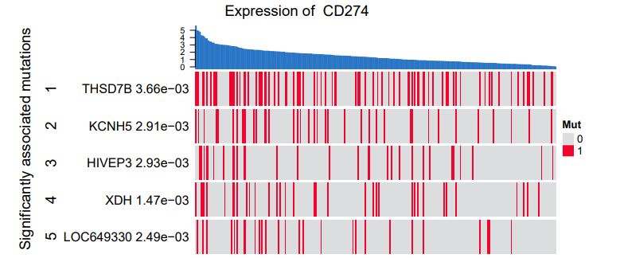

**Author(s)**: `r params$author`  
**Reviewer(s)**: `r params$reviewer`  
**Date**: `r Sys.Date()`  


# Academic Citation
If you use this code in your work or research, we kindly request that you cite our publication:

Xiaofan Lu, et al. (2025). FigureYa: A Standardized Visualization Framework for Enhancing Biomedical Data Interpretation and Research Efficiency. iMetaMed. https://doi.org/10.1002/imm3.70005


```{r setup, include=FALSE}
knitr::opts_chunk$set(echo = TRUE)
# 设置knitr代码块的全局选项 / Set global options for knitr code chunks
```

## 需求描述

昨天在群里问了一下突变和表达的相关性，有小伙伴说只能做分组的bar图，我找到一个网站，可以做出这样的图，都是TCGA的数据，想用R复现：<http://tumorsurvival.org/TCGA/Lung_TCGA_LUAD/process.php?geneName=CD274&devidePatientN=median&LowVal=&HighVal=&subtype=All>

## Requirement description

Yesterday, I asked in the group about the correlation between mutations and expression, and a friend said that we can only make bar charts for grouping. I found a website that can make such charts, all of which are TCGA data, and I want to reproduce them using R< http://tumorsurvival.org/TCGA/Lung_TCGA_LUAD/process.php?geneName=CD274&devidePatientN=median&LowVal=&HighVal=&subtype=All >



出自TCGAportal<http://tumorsurvival.org/TCGA/Lung_TCGA_LUAD/data/expression_cBioportal_mutation_figures/CD274_ENSG00000120217.12_expression_mutation.png>

fromTCGAportal<http://tumorsurvival.org/TCGA/Lung_TCGA_LUAD/data/expression_cBioportal_mutation_figures/CD274_ENSG00000120217.12_expression_mutation.png>

## 应用场景

用于展示突变与表达之间的相关性（独立性）

## Application scenarios

Used to demonstrate the correlation (independence) between mutations and expression

## 环境设置


## Environment settings

```{r}
source("install_dependencies.R")

# 加载coin包，用于进行置换检验(非参数检验方法)
# Load the coin package for permutation tests (non-parametric test methods)
library(coin) 

# 加载ComplexHeatmap包，用于绘制复杂热图(支持柱状图等多种注释)
# Load the ComplexHeatmap package for creating complex heatmaps (supports various annotations like bar charts)
library(ComplexHeatmap) 

# 设置系统环境变量，强制R显示英文错误信息(便于定位问题)
# Set system environment variable to force R to display error messages in English (facilitates troubleshooting)
Sys.setenv(LANGUAGE = "en") 

# 全局选项设置：禁止自动将字符向量转换为因子类型
# Global option setting: prevent automatic conversion of character vectors to factors
options(stringsAsFactors = FALSE) 
```

自定义函数

Custom functions

```{r}
# 显示进度条函数 - 用于在循环中输出进度百分比
# Display progress bar function - Used to output progress percentage during loops

display.progress = function ( index, totalN, breakN=20) {
  # 计算显示频率，确保在整个循环中均匀显示breakN次进度
  # Calculate display frequency to ensure progress is shown breakN times evenly throughout the loop
  if ( index %% ceiling(totalN/breakN)  ==0  ) {
    # 输出当前进度百分比，格式为"XX%"
    # Output current progress percentage in the format "XX%"
    cat(paste(round(index*100/totalN), "% ", sep=""))
  }
}
```

## 输入文件

需要表达谱数据和突变数据：

- SKCM_EXP_CD274.txt，CD274的表达数据
- SKCM_MUT.txt，突变的01矩阵，从XENA下载：<https://xenabrowser.net/datapages/?dataset=TCGA.SKCM.sampleMap%2Fmutation&host=https%3A%2F%2Ftcga.xenahubs.net&removeHub=https%3A%2F%2Fxena.treehouse.gi.ucsc.edu%3A443>

## Input file

Need to express spectrum data and mutation data:

-SKCM.exe P_CD274.txt, CD274 expression data
- SKCM_MUT.txt， The mutated 01 matrix can be downloaded from XENA:< https://xenabrowser.net/datapages/?dataset=TCGA.SKCM.sampleMap%2Fmutation&host=https%3A%2F%2Ftcga.xenahubs.net&removeHub=https%3A%2F%2Fxena.treehouse.gi.ucsc.edu%3A443 >

```{r}
# 读取表达谱数据 - 从制表符分隔文件中加载基因表达矩阵
# Read expression profile data - Load gene expression matrix from tab-separated file
# 文件格式要求: 行名为基因名，列名为样本名，第一行为表头
# File format requirements: Row names are gene names, column names are sample names, first row is header
expr <- read.table("SKCM_EXP_CD274.txt",sep = "\t",check.names = F,stringsAsFactors = F,header = T,row.names = 1)

# 查看表达矩阵前3列的基本情况(数据结构和内容预览)
# View basic information of the first 3 columns of the expression matrix (data structure and content preview)
expr[,1:3]

# 读取基因突变数据 - 从制表符分隔文件中加载体细胞突变矩阵
# Read gene mutation data - Load somatic mutation matrix from tab-separated file
# 文件格式要求: 行名为基因名，列名为样本名，值为突变状态(0/1)
# File format requirements: Row names are gene names, column names are sample names, values are mutation status (0/1)
muta <- read.table("SKCM_MUT.txt",sep = "\t",check.names = F,stringsAsFactors = F,header = T,row.names = 1)

# 查看突变矩阵前3行和前3列的基本情况
# View basic information of the first 3 rows and 3 columns of the mutation matrix
muta[1:3, 1:3]

# 数据预处理：提取两个数据集中共同存在的样本(交集)
# Data preprocessing: Extract samples that exist in both datasets (intersection)
# 确保后续分析基于相同的样本集合
# Ensure subsequent analysis is based on the same set of samples
com_sam <- intersect(colnames(expr),colnames(muta)) 

# 表达量数据转换：对表达值进行log2(x+1)转换
# Expression data transformation: Apply log2(x+1) transformation to expression values
# 目的: 归一化表达量分布，减小高表达值的影响
# Purpose: Normalize expression distribution, reduce impact of high expression values
expr <- log2(expr[,com_sam] + 1) 

# 突变数据过滤：仅保留在至少10%样本中发生突变的基因
# Mutation data filtering: Retain only genes mutated in at least 10% of samples
# 过滤低频率突变基因，避免噪声干扰后续分析
# Filter out low-frequency mutation genes to avoid noise in subsequent analysis
muta <- muta[rowSums(muta) > 0.1* ncol(muta),com_sam] 
```

## 置换检验独立性

## Substitution test independence

```{r}
# 定义目标基因名称 - 本例中为PD-L1(CD274)
# Define the target gene name - PD-L1 (CD274) in this example
gene <- "CD274" 

# 初始化p值存储向量 - 用于保存每个基因与CD274表达的关联检验结果
# Initialize vector to store p-values - Will hold association test results for each gene with CD274 expression
p <- c()

# 循环遍历所有突变基因，逐一检验其与CD274表达量的关系
# Loop through all mutated genes to test their association with CD274 expression levels
for (i in 1:nrow(muta)) {
  # 显示当前循环进度 - 方便用户了解计算进度
  # Display current loop progress - Helps user track computation progress
  display.progress(i,nrow(muta)) 
  
  # 创建临时数据框 - 包含CD274表达量和当前基因的突变状态
  # Create temporary dataframe - Contains CD274 expression and mutation status of current gene
  tmp <- data.frame(exp=as.numeric(expr[gene,]), mut=sapply(muta[i,],as.factor),stringsAsFactors = F) 
  
  # 执行置换检验(独立性检验) - 评估基因突变状态与CD274表达量之间的关联性
  # Perform permutation test (independence test) - 
  # Assess association between gene mutation status and CD274 expression levels
  # 优势: 不依赖数据分布假设，适用于小样本和非正态分布数据
  # Advantage: Distribution-free, suitable for small samples and non-normal data
  p <- c(p,pvalue(independence_test(exp ~ mut,data = tmp))) 
}

# 为结果向量添加基因名称作为标识符
# Add gene names as identifiers to the result vector
names(p) <- rownames(muta)
```

## 开始画图

## Start plot


```{r}
### 设置颜色 ###
darkred   <- "#F2042C"
blue      <- "#2874C5"
lightgrey <- "#dcddde"

p.cutoff <- 0.005 # 设置p的阈值
mut_sel <- names(p[p < p.cutoff]) # 这里仅保留少量的相关突变

sam_order <- as.numeric(expr[gene,]); names(sam_order) <- colnames(expr); sam_order <- sort(sam_order,decreasing = T)
mat <- muta[mut_sel,names(sam_order)] # 根据表达谱排序后确定热图输入数据
rownames(mat) <- paste(mut_sel,format(p[mut_sel],digits = 3,scientific = T)) # 行名添加保留3位科学计数法的p值

# 设置图例
column_ha = HeatmapAnnotation(bar = anno_barplot(as.numeric(sam_order),
                                                 gp = gpar(col = blue,fill = blue), # 设置颜色，柱子的填充和边框均为蓝色
                                                 border = F, # 取消柱状图最外缘的矩形
                                                 axis = T), # 添加y轴
                              height = unit(1.5,"cm")) # 控制注释的高度
# 绘图
hm <- Heatmap(mat, # 注意这里是排序后的数据
              name = "Mut", # 图例的名称
              width  = unit(12, "cm"), # 控制热图的宽度
              col = c(lightgrey,darkred), # 热图填充的颜色，这里是二分类
              cluster_columns = F, # 列不聚类
              cluster_rows = F, # 行不聚类
              show_column_names = F, # 不显示列名
              show_row_names = T, # 显示行名
              row_names_side = "left", # 行名显示在左侧
              split = 1:length(mut_sel), # 每个突变分割开
              top_annotation = column_ha) # 顶部柱状图注释

pdf("mutVSexpr.pdf",width = 10,height = 3.5)
draw(hm, 
     row_title = "Significantly associated mutations", # 设置热图的行title
     column_title = paste("Expression of ",gene), # 设置热图的列title
     heatmap_legend_side = "right") # 确定legend的位置
invisible(dev.off())
```


```{r}
sessionInfo()
```