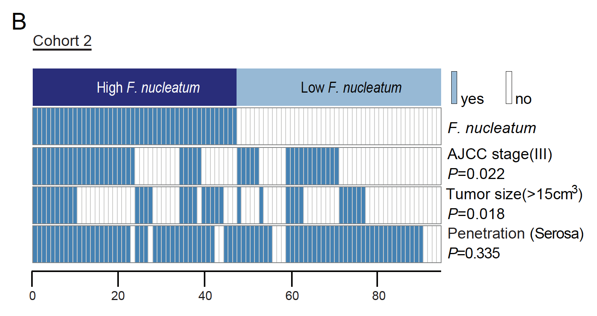

**Author(s)**: `r params$author`  
**Reviewer(s)**: `r params$reviewer`  
**Date**: `r Sys.Date()`  


# Academic Citation
If you use this code in your work or research, we kindly request that you cite our publication:

Xiaofan Lu, et al. (2025). FigureYa: A Standardized Visualization Framework for Enhancing Biomedical Data Interpretation and Research Efficiency. iMetaMed. https://doi.org/10.1002/imm3.70005


```{r setup, include=FALSE}
knitr::opts_chunk$set(echo = TRUE)
# 设置knitr代码块的全局选项 / Set global options for knitr code chunks
```

## 需求描述

将感兴趣变量和亚型（分组）之间的独立性用“热图”方式展现出来。

## Requirement description

Present the independence between the variables of interest and subtypes (groups) using a heatmap.



出自<https://www.cell.com/cell/fulltext/S0092-8674(17)30815-2>

from<https://www.cell.com/cell/fulltext/S0092-8674(17)30815-2>

Figure S1. (B) Comparing tumor size, positive or negative serosal invasion, and AJCC stage between F. nucleatum high-expression and low-expression tumors of Cohort 2. The heatmap illustrates the association of different clinical characters with F. nucleatum high- and low-expression tumors. Statistical significance was performed by Chi-square test.

## 应用场景

已知分组的样本，想同时展示每个样本多个层面的特征，并标出两组间差异显著性P value。

其实个人感觉，这样的“关系”图可以作为热图的Annotation bar，绘制起来简单方便，没有必要单独画出来。不过这张图还是蛮精美的，所以我还是采用base plot来和大家玩一玩这一张“热图”。

**注意：**本人能力有限没有办法在这份代码的基础上尽可能多地考虑其他情况（输入数据类型），因此如果输入数据结构发生较大变化，代码本身需要做比较大的改动，代码的注释应该比较全面，希望大家在理解的基础上运行此代码，学习base plot的画图思路。

## Application scenarios

Given the grouped samples, we want to display multiple levels of features for each sample simultaneously and indicate the significant P value of the differences between the two groups.

In my personal opinion, such a "relationship" diagram can be used as an annotation bar for heat maps, which is simple and convenient to draw, and there is no need to draw it separately. However, this image is quite exquisite, so I will still use the base plot to play with everyone on this' heat map '.

**Attention: * * Due to my limited abilities, I am unable to consider as many other situations (input data types) as possible on the basis of this code. Therefore, if there are significant changes in the input data structure, the code itself needs to be significantly modified, and the comments on the code should be comprehensive. I hope everyone can run this code on the basis of understanding and learn the drawing ideas of base plot.

## 环境设置

## Environment settings

```{r}
source("install_dependencies.R")
# 设置系统环境语言为英文，用于显示英文报错信息
# Set system environment language to English for displaying error messages in English
Sys.setenv(LANGUAGE = "en") 

# 配置选项，禁止将字符型向量自动转换为因子类型
# Configure option to disable automatic conversion of character vectors to factors
options(stringsAsFactors = FALSE) 
```

## 输入文件

easy_input.txt，每行一个样本，第一列为分组（被画在图的第一行），第二列往后是其他信息（被画在图的第二行以后），用yes和no记录。

## Input file

easy_input.txt， Each row contains one sample, with the first column representing the grouping (shown in the first row of the graph) and the second column followed by other information (shown in the second row of the graph), recorded with 'yes' and' no '.

```{r}
# 从easy_input.txt文件读取表格数据
# 分隔符设为制表符，禁止自动修正列名，禁止将字符串转为因子，指定包含表头行，不设置行名
# Read tabular data from easy_input.txt file
# Set delimiter as tab, disable automatic column name correction, disable string-to-factor conversion, specify header row, do not set row names
dat <- read.table("easy_input.txt",sep = "\t",check.names = F,stringsAsFactors = F,header = T,row.names = NULL)

# 查看数据集行数和列数
# View the number of rows and columns in the dataset
rows_cols <- dim(dat)

# 查看数据集前几行，行数为数据集行数和6的较小值
# View the first few rows of the dataset, with the number of rows being the smaller value between the dataset's row count and 6
head(dat, min(6, rows_cols[1]))

# 查看数据集后几行，行数为数据集行数和6的较小值
# View the last few rows of the dataset, with the number of rows being the smaller value between the dataset's row count and 6
tail(dat, min(6, rows_cols[1]))
```

## 独立性检验，计算P value，用于标注在图的右侧

## Independence test, calculate P value, used for labeling on the right side of the graph

```{r}
# 初始化存储卡方检验p值的向量
# Initialize vector to store p-values from chi-square tests
p.chisq <- c()

# 对数据框从第3列至最后一列进行循环（第1列是亚型，第2列不参与独立性检验）
# Loop through columns from 3 to the last column (skip first two columns)
for (i in 3:ncol(dat)) { 
  # 创建第1列(亚型)与当前列的列联表
  # Create contingency table between subtype (col1) and current column
  tmp <- table(dat[,1],dat[,i])
  # 执行卡方检验并将p值保留3位小数后添加到结果向量
  # Perform chi-square test and append p-value (rounded to 3 decimals) to results
  p.chisq <- c(p.chisq,round(chisq.test(tmp)$p.value,3)) 
}

# 查看前几个卡方检验结果
# View the first few chi-square test results
head(p.chisq)

# 生成右侧注释标签，根据检验结果格式化显示
# Generate right-side annotation labels with formatted p-values
ann_labels <- paste0(c("AJCC stage(III)", "Tumor size (>15cm3)","Penetration (Serosa)"),
                     "\nP",ifelse(p.chisq < 0.001," < 0.001",paste0(" = ",p.chisq)))

# 补全标签向量，第一列留空(由图例占据)，第二列指定为"F.nucleatum"
# Complete label vector: first position NA (for legend), second for "F.nucleatum"
ann_labels <- c(NA,"F.nucleatum",ann_labels) 
```

## 开始画图

下面感受一下用base plot像画笔一样画出图中的每一个元素：

## Start drawing

Here's how to use base plot to draw every element in the graph like a paintbrush:

```{r}
### 设置颜色 ###
# Set colors
darkblue  <- "#292C7C"
lightblue <- "#97B9D7"
blue      <- "#4582B5"
white     <- "#FFFFFF"
dwhite    <- "#B6D1E8"

# 创建PDF文件用于保存热图，设置宽度为8英寸，高度为5英寸
# Create PDF file to save heatmap, set width to 8 inches and height to 5 inches
pdf("AssociationHeatmap.pdf",width = 8,height = 5)

# 设置绘图参数：无边框，调整坐标轴标签位置，设置边距，调整刻度线长度，设置标题字体样式
# Set plotting parameters: no border, adjust axis label positions, set margins, adjust tick mark length, set title font style
par(bty="n", mgp = c(2,0.15,0), mar = c(3.1,2.1,3.1,8.1),tcl=-.25, font.main=3)
# 允许图形元素绘制在绘图区域外
# Allow graphic elements to be drawn outside the plotting area
par(xpd=NA)

# 生成一个空白图作为画布，设置x轴范围为0到数据行数，y轴范围为0到数据列数
# Generate a blank plot as canvas, set x-axis range from 0 to number of data rows, y-axis from 0 to number of data columns
plot(c(0,nrow(dat)), c(0,ncol(dat)), 
     col = "white",          
     xlab = "", xaxt = "n",  
     ylab = "", yaxt = "n")  

# 添加带下划线的标题，左对齐
# Add underlined title, left aligned
title(bquote(underline("Cohort 2")), adj = 0, line = 0)

# 生成纵坐标标签，位于每个间隔的中心位置
# Generate y-axis labels, positioned at the center of each interval
axis(4, at = 0.475:(ncol(dat)-0.475), 
     labels = ann_labels[5:1], las = 1,  
     col = "white")  

# 生成横坐标刻度，间隔为20
# Generate x-axis tick marks at intervals of 20
axis(1, at = c(seq(0, nrow(dat), 20), nrow(dat)), labels = T)

# 准备热图颜色矩阵
# Prepare color matrix for heatmap
input_matrix <- as.matrix(dat) 
col.mat <- matrix(NA, byrow = T, ncol = nrow(input_matrix), nrow = ncol(input_matrix))
rownames(col.mat) <- colnames(input_matrix)

# 根据数据值填充颜色矩阵，第二列及以后的数据：yes为蓝色，no为白色
# Fill color matrix based on data values: for columns 2 and after, "yes" is blue, "no" is white
for (i in 2:nrow(col.mat)) { 
  for (j in 1:ncol(col.mat)) {
    col.mat[i,j] <- ifelse(input_matrix[j,i] == "yes",blue,white)
  }
}
# 第一列数据：High_F.nucleatum为深蓝色，否则为浅蓝色
# For first column: High_F.nucleatum is dark blue, otherwise light blue
col.mat[1,] <- ifelse(input_matrix[,1] == "High_F.nucleatum",darkblue,lightblue)

# 绘制热图矩形
# Draw heatmap rectangles
x_size <- nrow(input_matrix)
y_size <- ncol(input_matrix)

# 计算每个矩形的坐标
# Calculate coordinates for each rectangle
my_xleft = rep(0:(x_size-1), each = y_size)  
my_xright = my_xleft + 1                     
my_ybottom = rep((y_size-1):0, x_size)       
my_ytop = my_ybottom + 0.95                  

# 绘制带边框的矩形
# Draw rectangles with borders
rect(xleft = my_xleft,
     ybottom = my_ybottom,
     xright = my_xright,
     ytop = my_ytop,
     col= col.mat,        
     border = dwhite)     

# 修饰第一行，隐去间隔
# Modify first row to remove gaps
my_xleft = rep(0:(x_size-1))
my_xright = my_xleft + 1
my_ybottom = rep(y_size-1, x_size)
my_ytop = my_ybottom + 0.95

# 绘制无边框的第一行矩形
# Draw first row rectangles without borders
rect(xleft = my_xleft,
     ybottom = my_ybottom,
     xright = my_xright,
     ytop = my_ytop,
     col= col.mat[1,],     
     border = NA)          

# 在第一行添加文字标签
# Add text labels to first row
text(nrow(input_matrix)/4, ncol(input_matrix) - 0.55,
     substitute(paste("High ", italic("F.nucleatum"))), cex = 1.3, col = "white")
text(nrow(input_matrix)/4*3, ncol(input_matrix) - 0.55,
     substitute(paste("Low ", italic("F.nucleatum"))), cex = 1.3, col = "black")

# 添加图例，位于右上角外侧
# Add legend outside top-right corner
legend("topright", 
       inset = c(-0.1,0.07),  
       xjust = 0,             
       cex = 1,
       y.intersp = 1.3,       
       fill = c(blue, white), 
       legend = c("yes", "no"), 
       bty = "n")             

# 关闭PDF设备
# Close PDF device
invisible(dev.off())
```


```{r}
sessionInfo()
```