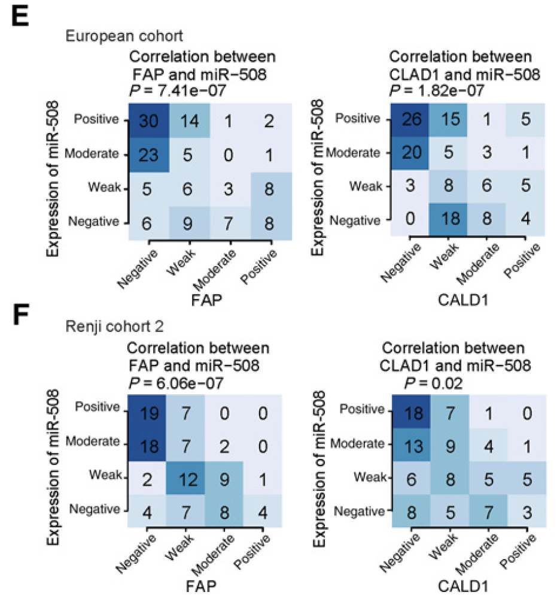

**Author(s)**: `r params$author`  
**Reviewer(s)**: `r params$reviewer`  
**Date**: `r Sys.Date()`  


# Academic Citation
If you use this code in your work or research, we kindly request that you cite our publication:

Xiaofan Lu, et al. (2025). FigureYa: A Standardized Visualization Framework for Enhancing Biomedical Data Interpretation and Research Efficiency. iMetaMed. https://doi.org/10.1002/imm3.70005

```{r setup, include=FALSE}
knitr::opts_chunk$set(echo = TRUE)
# 设置knitr代码块的全局选项 / Set global options for knitr code chunks
```

# 需求描述

两个指标（miRNA和FAP蛋白）按照高低分为四组，计算两个指标的相关性和p value，用热图展示。

# Requirement description

Divide the two indicators (miRNA and FAP protein) into four groups according to their levels, calculate the correlation and p-value between the two indicators, and display them using a heatmap.



出自<http://cancerres.aacrjournals.org/content/78/7/1751>

from<http://cancerres.aacrjournals.org/content/78/7/1751>

Figure 4. E–F, Comparison of the miR-508 ISH scores and the CALD1 and FAP IHC scores in colorectal cancer tissues. The correlations are shown in European cohort (n ¼ 128; E) and Renji cohort 2 (n ¼ 100; Fisher exact test; F).

# 应用场景

本质上就是把连续型因素分类后，研究两种因素间的相关性，用列联表热图展示，同时做Fisher's exact test。

可用于计算和展示miRNA跟靶基因，或转录因子跟靶基因之间的相关关系。

# Application scenarios

Essentially, it is to classify continuous factors, study the correlation between two factors, display it using a contingency table heatmap, and conduct Fisher's exact test.

Can be used to calculate and display the correlation between miRNA and target genes, or transcription factors and target genes.

# 环境设置

# Environment settings

```{r}
# 设置系统环境变量，使R显示英文报错信息 (Set system environment variable to display error messages in English)
Sys.setenv(LANGUAGE = "en") 

# 禁止R在读取数据时自动将字符串转换为因子 (Prevent R from automatically converting strings to factors when reading data)
options(stringsAsFactors = FALSE) 
```

# 输入文件

easy_input.txt，两个连续型变量在每个样本里的观测值。每行一个样本，两列分别是两个观测值，此处是miRNA ISH scores和FAP IHC scores。

# Input file

easy_input.txt， The observed values of two continuous variables in each sample. Each row contains one sample, and the two columns represent two observations, namely miRNA ISH scores and FAP IHC scores.

```{r}
# 从easy_input.txt文件读取数据，假设首行为列名 (Read data from easy_input.txt, assuming the first row contains column names)
simdata <- read.table("easy_input.txt",header = T)
# 查看数据前几行，了解数据结构 (View the first few rows of the data to understand its structure)
head(simdata)

# 计算两个连续变量之间的相关系数 (Calculate the correlation coefficient between two continuous variables)
# 此结果将在后续作为图表标题的一部分 (This result will be used as part of the chart title later)
r.cor <- cor(simdata$miR.508, simdata$FAP)
# 打印相关系数结果 (Print the correlation coefficient)
r.cor

# 计算相关系数的p值，用于检验相关性的显著性 (Calculate the p-value for the correlation coefficient to test its significance)
# 结果同样会用于图表标题 (This result will also be used in the chart title)
p.cor <- cor.test(simdata$miR.508, simdata$FAP)$p.value
# 打印p值结果 (Print the p-value)
p.cor
```

附：这里的输入数据是模拟出来的，生成方法如下：

```r
### 自定义函数模拟数据 ###
# 相关性模拟函数参考https://stackoverflow.com/questions/13291308/generate-numbers-with-specific-correlation
simcor <- function (n, xmean, xsd, ymean, ysd, correlation) {
  x <- rnorm(n)
  y <- rnorm(n)
  z <- correlation * scale(x)[,1] + sqrt(1 - correlation^2) * 
    scale(resid(lm(y ~ x)))[,1]
  xresult <- xmean + xsd * scale(x)[,1]
  yresult <- ymean + ysd * z
  data.frame(x=xresult,y=yresult)
}

# 模拟数据
r <- simcor(n = 100, xmean = 12, ymean = 30, xsd = 3, ysd = 4, correlation = -0.8) # 模拟负相关的
simdata <- data.frame("miR.508" = r$x, "FAP" = r$y, stringsAsFactors = F, check.names = F)
write.table(simdata,"easy_input.txt",sep = "\t",row.names = F,quote = F)
```

Attachment: The input data here is simulated, and the generation method is as follows:

```r
###Customize functions to simulate data###
#Reference for correlation simulation function https://stackoverflow.com/questions/13291308/generate-numbers-with-specific-correlation
simcor <- function (n, xmean, xsd, ymean, ysd, correlation) {
x <- rnorm(n)
y <- rnorm(n)
z <- correlation * scale(x)[,1] + sqrt(1 - correlation^2) * 
scale(resid(lm(y ~ x)))[,1]
xresult <- xmean + xsd * scale(x)[,1]
yresult <- ymean + ysd * z
data.frame(x=xresult,y=yresult)
}

#Simulated data
r <- simcor(n = 100, xmean = 12, ymean = 30, xsd = 3, ysd = 4, correlation = -0.8) #  Simulate negative correlation
simdata <- data.frame("miR.508" = r$x, "FAP" = r$y, stringsAsFactors = F, check.names = F)
write.table(simdata,"easy_input.txt",sep = "\t",row.names = F,quote = F)
```

# 连续变量分类

例文把两个因素都分为四组：Positive，Moderate，Weak，Negative。

因此，我们根据四分位数将数据分割为四种类型：

# Continuous variable classification

The example text divides both factors into four groups: positive, moderate, weak, and negative.

Therefore, we divide the data into four types based on quartiles:

```{r}
# 根据miR.508表达量的四分位数将数据分为四类 (Classify data into four categories based on quartiles of miR.508 expression)
# 分类标签参考示例设置 (Classification labels follow the example provided)
# 因子水平按降序排列，便于后续可视化 (Factor levels sorted in descending order for visualization)
simdata$miR.508_classify <- factor(cut(simdata$miR.508, quantile(simdata$miR.508), 
                                       labels = c("Negative", "Weak", "Moderate", "Positive")),
                                   levels = c("Positive", "Moderate", "Weak", "Negative")) 

# 可选方案：根据中位数将数据分为高低两类 (Alternative: classify data into two categories based on median)
# 此代码行被注释，保留作为参考 (This line is commented out for reference)
#simdata$miR.508_classify <- factor(cut(simdata$miR.508, c(0, median(simdata$miR.508),max(simdata$miR.508)), 
#                                       labels = c("Negative", "Positive")), 
#                                   levels = c("Positive", "Negative"))

# 根据FAP表达量的四分位数将数据分为四类 (Classify data into four categories based on quartiles of FAP expression)
# 分类标签与示例一致 (Classification labels consistent with the example)
# 因子水平按升序排列 (Factor levels sorted in ascending order)
simdata$FAP2_classify <- factor(cut(simdata$FAP, quantile(simdata$FAP), 
                             labels = c("Negative", "Weak", "Moderate", "Positive")), 
                         levels = c("Negative", "Weak", "Moderate", "Positive")) 

# 创建miR.508和FAP2分类的列联表 (Create contingency table for miR.508 and FAP2 classifications)
# 将列联表转换为数据框格式 (Convert contingency table to data frame format)
tab_classify <- as.data.frame.array(table(simdata$miR.508_classify,simdata$FAP2_classify)) 
# 打印列联表查看结果 (Print contingency table to inspect results)
tab_classify

# 对分类变量执行Fisher精确检验 (Perform Fisher's exact test on the contingency table)
# 当分类较多时需要增加workspace参数以避免内存不足错误 (Increase workspace for large contingency tables)
# 通常设置为1e9可满足大多数情况需求 (Typical value of 1e9 suffices for most cases)
p.fisher <- fisher.test(tab_classify, workspace = 1e9)$p.value 
# 打印Fisher检验的p值 (Print p-value from Fisher's exact test)
p.fisher
```

**注意：**由于不同字符串的排序不同，或者是最终列联表的横纵坐标编号不同，请一定在绘制完成后仔细核对原始数据和计数矩阵，谨防映射关系出错。

**Attention: * * Due to different sorting of strings or different horizontal and vertical coordinate numbers in the final contingency table, please carefully check the original data and count matrix after drawing to avoid mapping errors.

# 开始画图

下面用base plot一笔一笔画图：

# Start drawing

Below is a stroke by stroke plot using the base plot:

```{r}
### 设置颜色 ###
# 定义绘图使用的蓝色系配色方案 (Define blue color palette for the plot)
blue   <- "#204F8D"  # 深蓝色 (Dark blue)
lblue  <- "#498EB9"  # 浅蓝色 (Light blue)
dwhite <- "#B6D1E8"  # 淡蓝色 (Very light blue)
white  <- "#E6EAF7"  # 接近白色的浅蓝色 (Near-white light blue)

# 创建PDF输出文件，设置宽度和高度为5英寸 (Create PDF output file with 5x5 inch dimensions)
pdf("ContigencyTable.pdf",width = 5,height = 5)

# 设置绘图参数 (Set plotting parameters)
par(bty="n", mgp = c(2,0.5,0), mar = c(5.1,6.1,4.1,2.1),tcl=-.25, font.main=3)
par(xpd=NA)  # 允许文本绘制超出绘图区域边界 (Allow text to extend beyond plot area)

# 生成一个空白图作为热图基础 (Create a blank plot as the basis for the heatmap)
plot(c(0,ncol(tab_classify)),c(0,nrow(tab_classify)), # 设置绘图区域范围 (Set plot area range)
     col = "white", # 点设置为白色，实际不可见 (Make points invisible)
     xlab = "",xaxt = "n", # 不显示x坐标轴 (Suppress x-axis)
     ylab = "",yaxt = "n") # 不显示y坐标轴 (Suppress y-axis)

# 设置图标题，包含相关系数和p值信息 (Set plot title with correlation and p-value information)
title(paste("Correlation between FAP and miR-508\nrho = ", round(r.cor,2), "; ", "P.cor = ", format(p.cor, digits = 3, scientific = T),
            "\nP.fisher = ", format(p.fisher, digits = 3, scientific = T)), adj = 0, line = 0)

# 画纵坐标 (Draw y-axis)
axis(2, at = 0.5:(nrow(tab_classify)-0.5), labels = FALSE) # 生成y坐标轴刻度 (Generate y-axis tick marks)
text(y = 0.5:(nrow(tab_classify)-0.5), # 添加y轴标签 (Add y-axis labels)
     par("usr")[1], 
     labels = rownames(tab_classify)[nrow(tab_classify):1], # 注意这里根据例文原图设置为倒置的坐标 (Reverse order to match example)
     srt = 0, pos = 2, xpd = TRUE)
mtext("Expression of miR-508", side=2, line = 4.5) # 添加y轴标题 (Add y-axis title)

# 画横坐标 (Draw x-axis)
axis(1, at = 0.5:(ncol(tab_classify)-0.5), labels = FALSE) # 生成x坐标轴刻度 (Generate x-axis tick marks)
text(x = 0.5:(ncol(tab_classify)-0.5), # 添加x轴标签 (Add x-axis labels)
     par("usr")[1] - 0.2, # 微调横坐标标签与坐标轴的相对位置，防止重合 (Adjust label position)
     labels = colnames(tab_classify), 
     srt = 45, pos = 1, xpd = TRUE)
mtext("FAP", side=1, line = 3.5) # 添加x轴标题 (Add x-axis title)

# 产生线性变化的颜色 (Generate linearly changing color palette)
input_matrix <- as.matrix(tab_classify) 
mat.max = max(input_matrix) # 输入矩阵的最大计数值 (Maximum value in the matrix)
unq.value <- unique(sort(as.vector(input_matrix))) # 得出所有独特的计数值 (Unique values in the matrix)
rbPal <- colorRampPalette(c(white,dwhite,lblue,blue)) # 产生颜色区间函数 (Create color gradient function)
col.vec <- rbPal(max(unq.value) + 1) # 产生计数值个数+1个颜色 (Generate colors for each unique value)
col.mat <- matrix(NA,byrow = T,ncol = ncol(input_matrix),nrow = nrow(input_matrix)) # 生成空的颜色矩阵 (Initialize color matrix)

# 根据计数矩阵填充颜色矩阵 (Fill color matrix based on count matrix)
for (i in 1:nrow(col.mat)) {
  for (j in 1:ncol(col.mat)) {
    col.mat[i,j] <- col.vec[input_matrix[i,j] + 1]
  }
}

# 通过矩形块产生热图 (Create heatmap using rectangles)
x_size <- ncol(input_matrix)
y_size <- nrow(input_matrix)

my_xleft = rep(c(0:(x_size-1)),each = y_size) # 产生各个矩形的左x点 (Calculate left x-coordinates)
my_xright = my_xleft + 1 # 产生各个矩形的右x点 (Calculate right x-coordinates)
my_ybottom = rep(c((y_size-1):0),y_size) # 产生各个矩形的下y点 (Calculate bottom y-coordinates)
my_ytop = my_ybottom + 1 # 产生各个矩形的上y点 (Calculate top y-coordinates)
rect(xleft = my_xleft,
     ybottom = my_ybottom,
     xright = my_xright,
     ytop = my_ytop,
     col=col.mat, # 填充颜色 (Fill rectangles with colors)
     border = F) # 取消矩形的边界 (Remove rectangle borders)

text(my_xleft + 0.5,my_ybottom + 0.5,input_matrix, cex = 1.3) # 在矩形中心添加计数值 (Add count values to rectangles)

invisible(dev.off()) # 关闭图形设备 (Close graphics device)
```


# Session Info

```{r}
sessionInfo()
```