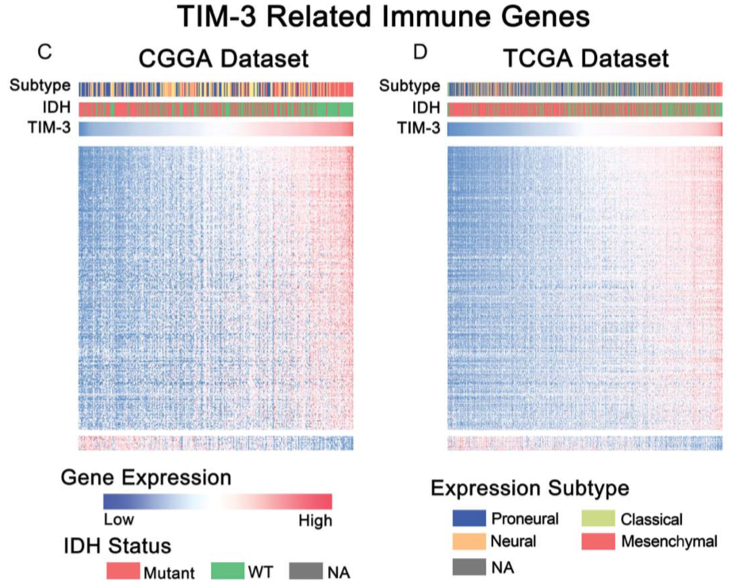

**Author(s)**: `r params$author`  
**Reviewer(s)**: `r params$reviewer`  
**Date**: `r Sys.Date()`  


# Academic Citation
If you use this code in your work or research, we kindly request that you cite our publication:

Xiaofan Lu, et al. (2025). FigureYa: A Standardized Visualization Framework for Enhancing Biomedical Data Interpretation and Research Efficiency. iMetaMed. https://doi.org/10.1002/imm3.70005


```{r setup, include=FALSE}
knitr::opts_chunk$set(echo = TRUE)
# 设置knitr代码块的全局选项 / Set global options for knitr code chunks
```

## 需求描述

根据相关系数排列的无聚类热图，展示和TIM-3基因表达（某一连续变量）相关的免疫基因（其他连续变量）在样本中的分布情况。使用TCGA GBM数据以及例文给出的基因集，复现原图。

## Requirement description

Display the distribution of immune genes (other continuous variables) related to TIM-3 gene expression (a certain continuous variable) in the sample using a non clustered heatmap arranged according to the correlation coefficient. Using TCGA GBM data and the gene set provided in the example text, reproduce the original image.



出自<https://www.tandfonline.com/doi/full/10.1080/2162402X.2017.1328339>

from<https://www.tandfonline.com/doi/full/10.1080/2162402X.2017.1328339>

Figure 3. (C, D) Most immune response related genes were significantly positively correlated with TIM-3 expression, while there were still a small number of genes were significantly negatively correlated with Tim-3 expression.

## 应用场景

展示跟某一个基因呈正/负相关的多个基因的表达模式。

例如像例文这种，每列一个样本，每行一个基因。上半部分画出与目标基因的表达模式呈正相关的免疫相关基因，下半部分是负相关的。顶部展示样本的亚组、基因型或其他临床信息。

## Application scenarios

Display the expression patterns of multiple genes that are positively/negatively correlated with a certain gene.

For example, in the example text, there is one sample per column and one gene per row. The upper part shows immune related genes that are positively correlated with the expression pattern of the target gene, while the lower part shows a negative correlation. Display the subgroups, genotypes, or other clinical information of the sample at the top.

## 环境设置


## Environment settings

Use domestic image installation package

```{r}
source("install_dependencies.R")

```


```{r}
# 加载clusterProfiler包，用于基因富集分析和功能注释
# Load the clusterProfiler package for gene enrichment analysis and functional annotation
library(clusterProfiler)

# 加载org.Hs.eg.db包，包含人类基因注释信息
# Load the org.Hs.eg.db package containing human gene annotation information
library(org.Hs.eg.db)

# 加载biomaRt包，用于访问Ensembl数据库获取基因注释
# Load the biomaRt package for accessing Ensembl databases to retrieve gene annotations
library(biomaRt)

# 加载pheatmap包，用于绘制热图
# Load the pheatmap package for drawing heatmaps
library(pheatmap)

# 加载RColorBrewer包，提供丰富的配色方案
# Load the RColorBrewer package providing a variety of color schemes
library(RColorBrewer)

# 设置环境语言为英文，使报错信息以英文显示
# Set the environment language to English to display error messages in English
Sys.setenv(LANGUAGE = "en") 

# 禁止字符串自动转换为因子类型，避免数据处理中的意外转换
# Disable automatic conversion of strings to factors to prevent unexpected conversions during data processing
options(stringsAsFactors = FALSE) 
```

## 输入文件

easy_input_expr.csv，TCGA-GBM.htseq_fpkm，基因表达谱。从XENA下载得到，值为log2（FPKM+1），为方便传输，小数点后保留2位。需要把基因名换成gene symbol。

gbm_tcga_pub2013_clinical_data.tsv，临床信息。从cBioPortal上下载得到：http://www.cbioportal.org/study/clinicalData?id=gbm_tcga_pub2013

easy_input_genes.txt，immune-response-related基因集。来自例文补充材料：Supplementary table1.xlsx

## Input file

easy_input_expr.csv，TCGA-GBM.htseq_fpkm， Gene expression profile. Downloaded from XENA, the value is log2 (FPKM+1), with 2 decimal places reserved for ease of transmission. We need to change the gene name to gene symbol.

gbm_tcga_pub2013_clinical_data.tsv， Clinical information. Download from cBioPortal: http://www.cbioportal.org/study/clinicalData?id=gbm_tcga_pub2013

Easyinput_genes. txt, immune response related gene set. Supplementary Table 1. xlsx

```{r}
### 读取GMB表达谱 ###
# Read the GMB expression profile data
expr <- read.csv("easy_input_expr.csv", header = T, row.names = 1, stringsAsFactors = F, check.names = F)

# 基因ID取.号前的字符
# Extract gene ID by taking characters before the '.'
rownames(expr) <- sapply(strsplit(rownames(expr),".",fixed = T),"[",1) 
# 截取样本名前15个字符
# Truncate sample names to the first 15 characters
colnames(expr) <- substr(colnames(expr),1,15)

# 利用bitr将entrez id 转为 gene symbol
# Convert Entrez IDs to gene symbols using bitr function
ensembl2gs <- bitr(rownames(expr), fromType = "ENSEMBL", toType = "SYMBOL", OrgDb = org.Hs.eg.db)
# 去除重复的基因符号
# Remove duplicate gene symbols
ensembl2gs <- ensembl2gs[!duplicated(ensembl2gs$SYMBOL),] 

# 根据TCGA样品名的命名规律，提取出肿瘤样本
# Extract tumor samples based on TCGA sample naming convention
tum.sam <- colnames(expr)[which(substr(colnames(expr),14,15) == "01")]

# 生成新的表达谱，行名为基因符号，列名为肿瘤样本
# Generate a new expression matrix with gene symbols as row names and tumor samples as column names
expr2 <- expr[ensembl2gs$ENSEMBL,tum.sam]
rownames(expr2) <- ensembl2gs$SYMBOL
# 查看新表达谱的前3行3列
# View the first 3 rows and 3 columns of the new expression matrix
expr2[1:3, 1:3]

### 读取临床数据并提取带临床信息的样本的表达谱 ###
# Read clinical data and extract expression profiles for samples with clinical information
Sinfo <- read.table("gbm_tcga_pub2013_clinical_data.tsv",sep = "\t",check.names = F,stringsAsFactors = F,header = T,row.names = NULL)
rownames(Sinfo) <- Sinfo$`Sample ID`
# 保留表达谱和临床数据共有的样本
# Keep only samples that exist in both expression matrix and clinical data
Sinfo <- Sinfo[intersect(colnames(expr2),rownames(Sinfo)),]
# 查看临床数据前几行
# View the first few rows of clinical data
head(Sinfo)
# 提取带临床信息的样本对应的表达谱
# Extract expression profiles for samples with clinical information
expr2 <- expr2[,rownames(Sinfo)]

# 根据TIM-3的表达量，给样本排序（TIM-3即为HAVCR2）
# Sort samples by the expression level of TIM-3 (HAVCR2)
sam.order <- sort(sapply(expr2["HAVCR2",], as.factor),decreasing = F)

### 读取相关基因的表达量，用于画热图，例文画的是免疫相关基因 ###
# Read the list of genes for heatmap generation, example uses immune-related genes
genelist <- read.table("easy_input_genes.txt",sep = "\t",check.names = F,stringsAsFactors = F,header = T,row.names = NULL)
# 查看基因列表前几行
# View the first few rows of the gene list
head(genelist)
# 提取基因列表中存在于表达谱中的基因，并按TIM-3表达量排序
# Extract genes from the gene list that exist in the expression matrix and order by TIM-3 expression
imm.expr <- expr2[intersect(rownames(expr2), genelist$`GENE LIST`), names(sam.order)]
# 查看免疫相关基因表达量矩阵的前3行3列
# View the first 3 rows and 3 columns of the immune-related gene expression matrix
imm.expr[1:3, 1:3]
```

## 与基因集的相关性分析

## Correlation analysis with gene set

```{r}
# 初始化相关性结果矩阵
# Initialize matrix to store correlation results
cor.res <- NULL

# 计算免疫相关基因表达量与TIM-3表达量的Spearman相关性
# Calculate Spearman correlation between immune-related gene expression and TIM-3 expression
for (i in 1:nrow(imm.expr)) {
  tmp <- cor.test(as.numeric(imm.expr[i,]),as.numeric(sam.order),method = "spearman") # 使用非参相关性分析
  # Non-parametric correlation analysis using Spearman method
  cor.res <- rbind.data.frame(cor.res,data.frame(gene = rownames(imm.expr)[i], rho = tmp$estimate, p = tmp$p.value, stringsAsFactors = F))
}

# 筛选与TIM-3表达显著正相关的基因（rho>0.3且p<0.05）
# Select genes significantly positively correlated with TIM-3 expression (rho>0.3 and p<0.05)
pos.cor.gene <- cor.res[which(cor.res$rho > 0.3 & cor.res$p < 0.05), c("gene","rho")] 

# 筛选与TIM-3表达显著负相关的基因（rho<-0.3且p<0.05）
# Select genes significantly negatively correlated with TIM-3 expression (rho<-0.3 and p<0.05)
neg.cor.gene <- cor.res[which(cor.res$rho < -0.3 & cor.res$p < 0.05), c("gene","rho")] 
# 注释：若用例文的-0.4 cutoff，这里只能找到2个基因，最终图的效果可能不明显
# Note: Using -0.4 cutoff as in the example yields only 2 genes, resulting in less visible heatmap patterns

# 按相关系数升序排列正相关基因，使热图呈现楔形渐变效果
# Sort positively correlated genes by rho ascending for wedge-shaped gradient in heatmap
pos.cor.gene <- pos.cor.gene[order(pos.cor.gene$rho,decreasing = F),] 

# 按相关系数升序排列负相关基因，使热图呈现楔形渐变效果
# Sort negatively correlated genes by rho ascending for wedge-shaped gradient in heatmap
neg.cor.gene <- neg.cor.gene[order(neg.cor.gene$rho,decreasing = F),]
```

## 开始画图

## Start drawing

```{r}
### 设置颜色 ###
# Set colors
heatmap.BlWtRd <- c("#6699CC", "white", "#FF3C38")  # 蓝-白-红渐变色板 / Blue-white-red color palette
red    <- "#EA6767"  # 红色 / Red
green  <- "#70C17A"  # 绿色 / Green
blue   <- "#445EAD"  # 蓝色 / Blue
grey   <- "#7A7A7A"  # 灰色 / Grey
orange <- "#F7C07C"  # 橙色 / Orange
yellow <- "#CEDC7C"  # 黄色 / Yellow

# 生成注释表
# Generate annotation table
annCol <- data.frame(
  "TIM-3" = as.numeric(sam.order[rownames(Sinfo)]),  # TIM-3表达值 / TIM-3 expression values
  "Subtype" = Sinfo$`Gene Expression Subtype`,  # 基因表达亚型 / Gene expression subtype
  "IDH" = Sinfo$`IDH1 Mutation`,  # IDH1突变状态 / IDH1 mutation status
  row.names = rownames(Sinfo),  # 行名设为样本名 / Set row names as sample names
  stringsAsFactors = F,  # 不将字符转换为因子 / Do not convert characters to factors
  check.names = F  # 防止自动修改列名（如将“-”转换为“.”） / Prevent automatic column name modification
)
annCol[is.na(annCol)] <- "NA"  # 将NA值统一标记为"NA" / Mark NA values as "NA"

# 生成注释颜色
# Generate annotation colors
annCol$IDH <- ifelse(
  annCol$IDH == "WT", "WT", 
  ifelse(annCol$IDH == "NA", "NA", "Mutant")
)  # 标准化IDH突变状态标签 / Standardize IDH mutation status labels
annColors <- list()  # 初始化注释颜色列表 / Initialize annotation color list
annColors[["TIM-3"]] <- colorRampPalette(heatmap.BlWtRd)(128)  # TIM-3表达值渐变色 / TIM-3 expression gradient
annColors[["IDH"]] <- c("WT" = red, "Mutant" = green, "NA" = grey)  # IDH突变状态颜色 / IDH mutation colors
annColors[["Subtype"]] <- c(
  "Classical" = yellow,       # 经典亚型 / Classical subtype
  "Mesenchymal" = red,       # 间充质亚型 / Mesenchymal subtype
  "Neural" = orange,         # 神经亚型 / Neural subtype
  "Proneural" = blue,        # 前神经亚型 / Proneural subtype
  "G-CIMP" = green,          # 胶质母细胞瘤CpG岛甲基化表型 / G-CIMP
  "NA" = grey                # 缺失值 / Missing value
)

# 标准化并截断数据
# Normalize and truncate data
indata <- t(scale(t(imm.expr[c(pos.cor.gene$gene, neg.cor.gene$gene), names(sam.order)]))) 
# 转置后标准化再转置，确保按TIM-3表达顺序排列 / Transpose, scale, transpose back; order by TIM-3 expression
indata[indata > 3]  <- 3  # 截断大于3的值为3 / Truncate values >3 to 3
indata[indata < -3] <- -3  # 截断小于-3的值为-3 / Truncate values <-3 to -3

# 绘制热图
# Plot heatmap
pheatmap(
  mat = indata,  # 输入数据矩阵 / Input data matrix
  scale = "none",  # 不进行标准化 / No scaling
  border_color = NA,  # 无边框 / No border
  color = colorRampPalette(heatmap.BlWtRd)(128),  # 蓝-白-红渐变色 / Blue-white-red gradient
  cluster_cols = F,  # 列不聚类 / No column clustering
  cluster_rows = F,  # 行不聚类 / No row clustering
  show_rownames = F,  # 不显示行名 / Hide row names
  show_colnames = F,  # 不显示列名 / Hide column names
  annotation_col = annCol[names(sam.order), ],  # 列注释（按TIM-3表达顺序排列） / Column annotations (ordered by TIM-3 expression)
  annotation_colors = annColors,  # 注释颜色方案 / Annotation color scheme
  gaps_row = length(pos.cor.gene$gene),  # 行分割位置（正相关基因后） / Row gap after positive correlation genes
  filename = "correlationHeatmap.pdf"  # 输出文件名 / Output file name
)
```


```{r}
sessionInfo()
```