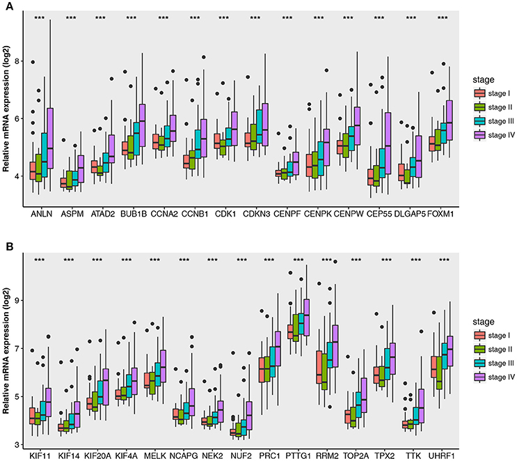

**Author(s)**: `r params$author`  
**Date**: `r Sys.Date()`  


[](https://guangchuangyu.github.io/blog_images/biobabble.jpg) 

# Academic Citation
If you use this code in your work or research, we kindly request that you cite our publication:

Xiaofan Lu, et al. (2025). FigureYa: A Standardized Visualization Framework for Enhancing Biomedical Data Interpretation and Research Efficiency. iMetaMed. https://doi.org/10.1002/imm3.70005


```{r setup, include=FALSE}
knitr::opts_chunk$set(echo = TRUE)
```

## 需求描述
## Requirement description

用R代码画出paper里的图

Drawing plots in paper with R code

图1

Figure 1



图2

Figure 2


出自<https://www.frontiersin.org/articles/10.3389/fphys.2018.00399/full>

from<https://www.frontiersin.org/articles/10.3389/fphys.2018.00399/full>

## 使用场景
## Usage scenario

用boxplot展示基因表达量分布，同时计算p value。

Use a boxplot to show the distribution of gene expression and calculate the p-value.

## 输入数据
## Input data

### 1. 基因表达量列表
### 1. gene expression list

easy_input_expr.csv，多个sample中所有基因的表达量。

包含stage1, stage2, stage3，各10个样本，stage以样本名后面`_数字`标识。

easy_input_expr.csv, expression of all genes in multiple samples.

It includes stage1, stage2, and stage3, with 10 samples each. Stage is indicated by `_number` following the sample name.

```{r}
source("install_dependencies.R")
require(ggplot2)
require(tidyr)
require(cowplot)

d <- read.csv("easy_input_expr.csv", row.names=1)
dim(d)
head(d)
```
总共有`r nrow(d)`个基因的表达量

There are `r nrow(d)` gene expression in total

### 2. 差异表达的基因名列表
### 2. list of differentially expressed gene names

单独一列基因名；

或者第一列是基因名，后面是其他信息。

a single column of gene names;

Or the first column is the gene name followed by other information.

```{r}
up<-read.table("easy_input_up.txt",header = T, as.is = T, row.names = 1)
down<-read.table("easy_input_down.txt",header = T, as.is = T, row.names = 1)
```

## 开始画图
## Start drawing

### 1. 多组画在同一个绘图区域
### 1. multiple groups in the same drawing area

分别绘制上下调的基因，然后用cowplot来拼。

Draw the upregulated and downregulated genes separately, then combine them using cowplot.

```{r fig.width=15.5, fig.height=6.6}
require(tidyr)
require(ggplot2)

box <- lapply(list(up=row.names(up), down=row.names(down)), function(ii) {
    dd <- d[ii,]
    dd$gene = rownames(dd)
    
    ## 宽变长，变成tidy data frame，好用于ggplot2画图
    ## The width becomes length and becomes tidy data frame, which is easy to use for ggplot2 drawing.
    d2 <- gather(dd, sample, expr, 1:30)
    
    ## 通过sample名，衍生出stage变量
    ## derive the stage variable from the sample name
    d2$stage <- paste('stage', sub(".*_(\\d)$", "\\1", d2$sample))

    ## 用one way anova计算 p value
    ## calculate p value with one way anova
    pvalues <- sapply(d2$gene, function(x) {
        res <- aov(expr ~ stage, data = subset(d2, gene == x))
        summary(res)[[1]]$'Pr(>F)'[1] #
    })
    pv <- data.frame(gene = d2$gene, pvalue = pvalues)

    ## 画boxplot，并标识p-value
    ## draw boxplot and identify p-value
    ggplot(d2, aes(gene, expr, fill=stage)) + 
      geom_boxplot() + 
      geom_text(aes(gene, y=max(d2$expr) * 1.1, 
                    label=paste("p = ",round(pvalue, 2))),
                data=pv, #
                inherit.aes=F) + #
      xlab(NULL)+ylab("Relative expression (log2)")
})

#拼图
#pictures put together
require(cowplot)
plot_grid(plotlist=box, labels=c("A", "B"), ncol=1)

#保存到pdf文件
#save as pdf file
ggsave(file="box1.pdf")
```

如果想用“\**”或“***”来标记是否<0.05或<0.001，这样做：

把pvalue变成sigcode，然后再下面画图代码中`label=paste("p = ",round(pvalue, 2))`标记p值的地方，改成`label = sigcode`即可。

If you want to use "\**" or "***" to denote <0.05 or <0.001, proceed as follows: 

Change p-value to sigcode, and then in the plotting code below, change `label=paste("p = ",round(pvalue, 2))` where the p-value is labeled to `label = sigcode`.

```{r fig.width=15.5, fig.height=6.6}
box <- lapply(list(up=row.names(up), down=row.names(down)), function(ii) {
    dd <- d[ii,]
    dd$gene = rownames(dd)
    d2 <- gather(dd, sample, expr, 1:30)
    d2$stage <- paste('stage', sub(".*_(\\d)$", "\\1", d2$sample))
    pvalues <- sapply(d2$gene, function(x) {
        res <- aov(expr ~ stage, data = subset(d2, gene == x))
        summary(res)[[1]]$'Pr(>F)'[1] #
    })
    pv <- data.frame(gene = d2$gene, pvalue = pvalues)
    
    ## Signif. codes:  0 ‘***’ 0.001 ‘**’ 0.01 ‘*’ 0.05 ‘.’ 0.1 ‘ ’ 1
    pv$sigcode <- cut(pv$pvalue, c(0, 0.001, 0.01, 0.05, 0.1, 1), 
                    labels=c('***', '**', '*', '.', ' '))

    ggplot(d2, aes(gene, expr, fill=stage)) + 
      geom_boxplot() + 
      geom_text(aes(gene, y=max(d2$expr) * 1.1, 
                    label=pv$sigcode),
                data=pv, inherit.aes=F) + 
      xlab(NULL)+ylab("Relative expression (log2)")
})

require(cowplot)
plot_grid(plotlist=box, labels=c("A", "B"), ncol=1)
ggsave(file="box2.pdf")
```

### 2. 多个小图拼成一个大图
### 2. Multiple small images into one large image

```{r fig.width=20, fig.height=23}
box2 <- lapply(c(row.names(up), row.names(down)), function(i) {
    dd <- d[i,]
    dd$gene = rownames(dd)
    d2 <- gather(dd, sample, expr, 1:30)
    
    ## 通过sample名，衍生出stagge变量
    ## derive the stagge variable from the sample name.
    d2$stage <- paste('stage', sub(".*_(\\d)$", "\\1", d2$sample))

    ## 用one way anova计算 p value
    ## calculate p value with one way anova
    res <- aov(expr ~ stage, data = d2)
    pv1 <- summary(res)[[1]]$'Pr(>F)'[1]
    pv1.lab <- paste("one-way ANOVA p =", round(pv1,3))

    ## t检验用于比较第3阶段与第1阶段
    ## t test for comparing stage 3 vs stage 1
    pv2 <- t.test(expr~stage, data=subset(d2, stage!='stage 2'))$p.value
    pv2.lab <- paste("stage III vs stage I p =", round(pv2, 3))

    lab <- paste(dd$gene, pv1.lab, pv2.lab, sep="\n")

    label <- ggdraw() + draw_label(lab)
    plot_grid(label, 
              ggplot(d2, aes(stage, expr, fill=stage)) +
                geom_boxplot() +
                xlab("") +
                ylab(paste("Relative ",dd$gene," expression (log2)")) +
                theme(axis.title.y = element_text(size = 10)), #调整y轴标题字号 adjust y-axis title font size
              ncol=1, rel_heights=c(.3, 1))
})

plot_grid(plotlist=box2, ncol=6)
ggsave(file="box3.pdf")

```
```{r}
sessionInfo()
```