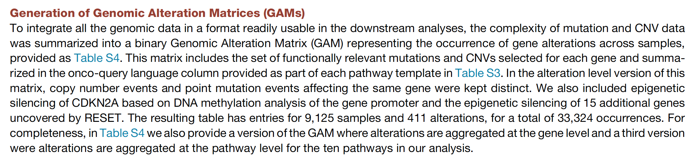

**Author(s)**: `r params$author`  
**Reviewer(s)**: `r params$reviewer`  
**Date**: `r Sys.Date()`  


# Academic Citation
If you use this code in your work or research, we kindly request that you cite our publication:

Xiaofan Lu, et al. (2025). FigureYa: A Standardized Visualization Framework for Enhancing Biomedical Data Interpretation and Research Efficiency. iMetaMed. https://doi.org/10.1002/imm3.70005


```{r setup, include=FALSE}
knitr::opts_chunk$set(echo = TRUE)
```

## 需求描述
## Requirement description

复现文章里的扫雷图。
Reproduce the minesweeper diagram in the article.


出自<https://www.cell.com/cell/fulltext/S0092-8674(18)30359-3>
From <https://www.cell.com/cell/fulltext/S0092-8674(18)30359-3>

Figure 4. (B) Detailed heatmap of alteration frequencies in members of the RTK-RAS pathway. Only known or likely oncogenic alterations in each gene are considered, as described in STAR Methods. The individual gene alteration frequencies may add up to more than the total for each tumor type, as some tumor samples may have multiple alterations. Color side bars show the fraction of samples affected by each type of somatic alteration (or a combination of them) for each pathway gene. Top color bars show the proportion of different types of alterations for each cancer subtype.

**图的解析**
**Analysis of the figure**

- 横坐标按器官排列，列出了TCGA的33种癌症类型。
- 纵坐标列出作者重点关注的RTK-RAS pathway里的重要基因，其中红色为原癌基因，蓝色为抑癌基因。
- 顶部和右侧分别对应每种癌症（纵坐标）和每个基因（横坐标）里各种alteration的frequency
- The horizontal axis is arranged by organ, listing the 33 cancer types of TCGA.
- The vertical axis lists the important genes in the RTK-RAS pathway that the author focuses on, with red for proto-oncogenes and blue for tumor suppressor genes.
- The top and right sides correspond to the frequency of various alterations in each cancer (vertical axis) and each gene (horizontal axis) respectively

例文作者选取了10个重要pathway，并总结出参与这些pathway的基因共187个，保存在NIHMS957693-supplement-7.xlsx文件。提取出这些基因在TCGA 33种癌症（NIHMS957693-supplement-5.xlsx）中的alteration，总结成alteration层面、gene层面和pathway层面，保存在NIHMS957693-supplement-8.xlsx文件。
The author of the example selected 10 important pathways and summarized a total of 187 genes involved in these pathways, which are saved in the NIHMS957693-supplement-7.xlsx file. Extract the alterations of these genes in 33 types of TCGA cancer (NIHMS957693-supplement-5.xlsx), summarize them at the alteration level, gene level and pathway level, and save them in the NIHMS957693-supplement-8.xlsx file.

## 应用场景
## Application scenario

可以从作者总结的参与10个重要通路的187个基因中提取出感兴趣的基因的alteration，画你感兴趣的癌症类型里他们的突变频率图。
You can extract the alterations of the genes of interest from the 187 genes involved in 10 important pathways summarized by the author, and draw their mutation frequency charts in the cancer types you are interested in.

还可以把这个思路应用到其他基因或自己收集的突变数据上，需要先把突变数据整理成NIHMS957693-supplement-*.xlsx的格式。
This idea can also be applied to other genes or mutation data collected by yourself. You need to organize the mutation data into the format of NIHMS957693-supplement-*.xlsx.

例文多个Figure都用了这种展示方式。参考例文这些图的用法，套用在自己的数据上：
This display method is used in multiple Figures in the example text. Refer to the usage of these figures in the example text and apply them to your own data:

- 我们复现的Figure 4，RTK-RAS pathway
- Figure 5，其余9个pathway中突变频率最高的基因
- Figure S2和S3，对应Figure 5，9个pathway中所有的基因
- Figure 7，跟治疗和药物联系起来
- Figure 4 we reproduced, RTK-RAS pathway
- Figure 5, the gene with the highest mutation frequency in the remaining 9 pathways
- Figure S2 and S3, corresponding to Figure 5, all genes in the 9 pathways
- Figure 7, linked to treatment and drugs

## 环境设置
## Environment settings


```{r}
source("install_dependencies.R")
```

Load package

```{r}
library(ggplot2)
library(reshape2)

Sys.setenv(LANGUAGE = "en") #显示英文报错信息 #Display English error message
options(stringsAsFactors = FALSE) #禁止chr转成factor #Disable chr conversion to factor
```

自定义函数
Custom function

```{r}
# 让SAMPLE_BARCODE作为rowname
# Let SAMPLE_BARCODE be rowname
setIndex <- function(df, index = 'SAMPLE_BARCODE'){
  df <- as.data.frame(df)
  rownames(df) <- df[,index]
  df[,index] <- NULL
  return(df)
}

#生成颜色
#Generate colors
multiColorMapping <- function(x, type, colors = c("blue", "red"), log = T){
  if(!is.list(colors) && !is.factor(type)){
    type <- as.factor(type)
  }
  if(log){
    x <- log(x+1)
  }
  x_color <- rep("white", length(x))
  for(i in 1:length(x)){
    x_color[i] <- rgb(colorRamp(colors = c("white", 
                                           colors[type[i]]))(x[i]/max(x[type == type[i]])), 
                      maxColorValue = 255)
  }
  return(x_color)
}
```

## 输入文件
## Input file

例文的supplementary作为输入文件，都是例文作者整理好的pan-cancer信息。用到自己的paper里时，记得引用这篇例文。
The supplementary of the example paper is used as an input file. It contains pan-cancer information compiled by the author of the example paper. When using it in your own paper, remember to cite this example paper.

- NIHMS957693-supplement-5.xlsx，TCGA里所有sample的信息，包括disease和subtype。
- NIHMS957693-supplement-7.xlsx，作者整理的重要pathway所包含的基因，共187个。例文Figure 4画的是RTK RAS，因此读取相应的sheet“RTK RAS”。如果画**其他pathway，读取对应的sheet即可**。
- NIHMS957693-supplement-8.xlsx，TCGA里9千多个sample里187个基因发生的alteration，三个sheet分别是alteration层面、gene层面和pathway层面。如果想知道这三个sheet是怎样获得的，看method里的Generation of Genomic Alteration Matrices (GAMs)。
- NIHMS957693-supplement-5.xlsx, information on all samples in TCGA, including disease and subtype.
- NIHMS957693-supplement-7.xlsx, a total of 187 genes included in the important pathways compiled by the author. Figure 4 of the example paper shows RTK RAS, so read the corresponding sheet "RTK RAS". If you draw **other pathways, just read the corresponding sheet**.
- NIHMS957693-supplement-8.xlsx, the alterations of 187 genes in more than 9,000 samples in TCGA, the three sheets are alteration level, gene level and pathway level respectively. If you want to know how these three sheets are obtained, see Generation of Genomic Alteration Matrices (GAMs) in method.



```{r}
### 读入每个sample的alteration信息
### Read in the alteration information of each sample
# sheet1 is a matrix of patient * alteration (that is type.gene)
data_alteration <- setIndex(readxl::read_excel("NIHMS957693-supplement-8.xlsx", skip = 2))
dim(data_alteration)
data_alteration[1:3,1:3]

# sheet2 is a matrix of patient * gene，包含187个基因
# sheet2 is a matrix of patient * gene, containing 187 genes
data_gene <- setIndex(readxl::read_excel("NIHMS957693-supplement-8.xlsx", skip = 0, sheet = 2))
dim(data_gene)
data_gene[1:3,1:3]

# sheet3 is a matrix of patient * pathway，包含10个pathway
# sheet3 is a matrix of patient * pathway, containing 10 pathways
data_pathway <- setIndex(readxl::read_excel("NIHMS957693-supplement-8.xlsx", skip = 0, sheet = 3, na = "NA"))
dim(data_pathway)
data_pathway[1:3,1:3]

### read pathway information, select one Pathway and get its key genes
# 例文Figure 4画的是RTK RAS，读取相应的sheet
# Example Figure 4 shows RTK RAS, read the corresponding sheet
# 如果画其他pathway，读取对应的sheet即可
# If you draw other pathways, just read the corresponding sheet
pathway_info <- readxl::read_excel(path = "NIHMS957693-supplement-7.xlsx", 
                                   sheet = "RTK RAS") #读取Excel表格里哪个sheet #Read which sheet in the Excel table
pathway_info <- subset(pathway_info, `OG/TSG` != "NA")[1:39,] 
pathway_info[1,]

### read sample information and create new sub-subtypes (subDisease)
sample_info <- setIndex(readxl::read_excel(path = "NIHMS957693-supplement-5.xlsx", skip = 2))
#把disease和subtype合并成为新的一列subDisease
#Merge disease and subtype into a new column subDisease
sample_info$subDisease <- paste0(sample_info$DISEASE, "_",
                                 sapply(sample_info$SUBTYPE, function(x){if(x == "Not_Applicable")  "" else x}))
sample_info$subDisease <- gsub(x = sample_info$subDisease, pattern = "_$", replacement = "", perl = T)
head(sample_info)
```

## 数据整理与计算
## Data collation and calculation

筛选至少包含5个patient的subDisease（disease和subtype）、至少包含一个alteration的sample、至少有1个alteration的gene
Screen subDiseases (disease and subtype) with at least 5 patients, samples with at least one alteration, and genes with at least one alteration

把癌症按照发生部位排序，基因名按例图排序
Sort cancers by site of occurrence, and sort gene names by example

```{r}
# 定义alter_types，6种
# Define alter_types, 6 types
# several alteration types c("AMP", 'DEL', "MUT", "FUSION", 'EPISIL') and additional 'Multiple' when two or more alteration types occur in the same gene for one patient.
alter_types <- c(unique(sapply(colnames(data_alteration), function(x) {strsplit(x, "\\.")[[1]][1]})), 'Multiple')
alter_types

# generage data_gene_alter matrix which is similar to data_gene except for alteration types as elements
data_gene_alter <- data_gene

for(i in colnames(data_gene)){
  alter_col <- intersect(paste0(alter_types, '.', i), colnames(data_alteration))
  if(length(alter_col) > 0){
    data_alter_col <- data_alteration[,alter_col,drop = F]
    for(j in alter_col){
      data_gene_alter[data_alteration[,j] > 0, i] <- strsplit(j, "\\.")[[1]][1]
    }
    data_gene_alter[rowSums(data_alteration[,alter_col,drop = F] > 0) > 1, i] <- "Multiple"
  }
}

# Check whether row orders is identical or not?
identical(rownames(sample_info), rownames(data_gene_alter))
identical(rownames(sample_info), rownames(data_gene))
identical(rownames(sample_info), rownames(data_pathway))
# Yes, all is same.

# subset samples and genes 
### excluding sub-subtypes with less than 5 patients
subtype_used <- names(which(table(sample_info[, "subDisease"]) > 5))

# 参照文中顺序给各个癌症类型排序，即按肿瘤发生部位排列
# Sort the cancer types by the order given in the text, i.e. by the location of the tumor
subtype_in_fig4 <-  c("GBM_IDHwt", "LGG_IDHwt","LGG_IDHmut-codel","LGG_IDHmut-non-codel",
                     "UVM",
                     "HNSC_HPV+","HNSC_HPV-",
                     "THCA", "ACC","PCPG",
                     "THYM",
                     "LUAD","MESO","LUSC",
                     "BRCA_LumA", "BRCA_LumB","BRCA_Her2","BRCA_Basal","BRCA_Normal",
                     "ESCA_CIN","ESCA_ESCC","STAD_CIN","STAD_EBV","STAD_GS","STAD_MSI","STAD_POLE","COAD_MSI","COAD_POLE","COAD_GS","COAD_CIN", "READ_CIN","READ_GS",
                     "LIHC","CHOL","PAAD",
                     "KIRC","KIRP","KICH","BLCA","PRAD","TGCT_seminoma","TGCT_non-seminoma",
                     "OV","UCEC_CN_HIGH","UCEC_CN_LOW","UCEC_MSI","UCEC_POLE","UCS","CESC_AdenoCarcinoma","CESC_SquamousCarcinoma",
                     "SKCM",
                     "SARC_DDLPS","SARC_LMS","SARC_MFS/UPS", "SARC_Other",
                     "DLBC","LAML")

# 按发生部位分组，用于分配颜色
# Group by location, used to assign colors
subtype_group_in_fig4 <- setNames(c(rep("CNS", 4), "Eye", rep("Head & Neck",2), rep("Endocrine",3), "Thymus", rep("Thoracic",3), 
                           rep("Breast", 5), rep("Gastrointestinal", 13), rep("Developmental GI Tract", 3), rep("Genitourinary", 7),
                           rep("Gynecologic", 8), rep("Skin",1), rep("Soft Tissue", 4), rep("Heme",2)
                           ), nm = subtype_in_fig4)

subtype_used <- intersect(subtype_in_fig4, subtype_used)
head(subtype_used)

### For each tumor type and subtype, we computed the fraction of samples with at least one alteration in each of the 10 signaling pathways (Figure 3). 
# samples with > 0 pathway alteration were used and too small sub-subtypes were excluded.
sample_used <- rownames(data_pathway)[data_pathway$`RTK RAS` > 0 & 
                                        sample_info$subDisease %in% subtype_used]

### genes with > 0 alteration were used
genes_used <- pathway_info$Gene[colSums(data_gene[sample_used,pathway_info$Gene]) > 0]

# 按图中基因顺序排列，具体到自己感兴趣的基因，结合背景知识给出顺序即可
# Arrange the genes in the order shown in the figure, and give the order based on the background knowledge of the genes you are interested in.
genes_in_fig4 <- c("EGFR", "IGF1R", "ERBB2", "ERBB3", "ERBB4", "FGFR1","FGFR2", "FGFR3", "FGFR4", "MET", "KIT", "PDGFRA",
                   "NTRK1", "NTRK2", "NTRK3", "ABL1", "RET", "ALK", "ROS1", "FLT3", "JAK2", "SOS1", "CBL", "PTPN11", 
                   "ERRFI1", "NF1", "RASA1", "RAC1", "KRAS", "HRAS", "NRAS", "ARAF", "BRAF", "RAF1", "MAP2K1", "MAPK1", "MAP2K2")
genes_used <- intersect(genes_in_fig4, genes_used) # JAK is not in the supplementary tables
# set gene order as you like
gene_levels <- c("Total", rev(genes_used)) # Total must be the first! 

row_annot <- data.frame(Gene = c(gene_levels), 
                        Type = c("Other", na.omit(pathway_info$`OG/TSG`[match(gene_levels, pathway_info$Gene)])))
row_annot$Gene <- factor(row_annot$Gene, gene_levels)
```

## 开始画图
## Start drawing

分别画出图的每一部分，最后组图
Draw each part of the picture separately, and then combine them into one

### Subtype - column annotation

```{r}
# set sub-subtype order as you like
subtype_levels <- subtype_used

col_annot <- data.frame(Subtype = subtype_levels, 
                        group = subtype_group_in_fig4[subtype_levels])
col_annot$Subtype <- factor(col_annot$Subtype, levels = subtype_levels)

p_bottom_text <- ggplot(col_annot) +
  geom_text(mapping = aes(Subtype, y = 0, 
                          label = Subtype, color = group),
            angle = 90, hjust = 1, size = 3) + ylim(-100,0) +
  theme_void()

p_bottom_text
```

### Center plot

```{r}
dgm <- as.data.frame(apply(as.data.frame(data_gene_alter[sample_used, genes_used]), 2, function(x){
  tapply(x, INDEX = sample_info[sample_used, 'subDisease'], function(x) {sum(x!=0)})
}))
dgm[,"Total"] <- tapply(rowSums(data_gene_alter[sample_used, genes_used] != 0), 
                        INDEX = sample_info[sample_used, 'subDisease'], 
                        function(x) {sum(x!=0)})

ggData_center <- melt(as.matrix(dgm), varnames = c("Subtype", "Gene"), as.is = T) 
ggData_center$multicolor <- multiColorMapping(ggData_center$value, 
                                              row_annot$Type[match(ggData_center$Gene, 
                                                                  row_annot$Gene)],
                                              colors = list(OG = "red", TSG = "blue", Other = "grey30"))
ggData_center$label <- ggData_center$value
ggData_center$label[ggData_center$value == 0] <- NA
ggData_center$Gene <- factor(ggData_center$Gene, levels = gene_levels)
ggData_center$Subtype <- factor(ggData_center$Subtype, levels = subtype_levels)

p_center <- 
  ggplot(data = ggData_center) +
  geom_tile(mapping = aes(Subtype, Gene),
            fill = ggData_center$multicolor, 
            color = "grey") +
  geom_text(mapping = aes(Subtype, Gene, label = label), size =3) +
  theme_void() + #theme(axis.text.x = element_text(angle = 45))
  theme(legend.position = 'none') 
p_center
```

### Right plot - gene stat

```{r}
gene_centric <- matrix(0, nrow = nrow(row_annot), ncol = length(alter_types), 
                       dimnames = list(row_annot$Gene, alter_types))
for(i in genes_used){
  gene_centric[i,] <- table(data_gene_alter[,i])[alter_types]
}
gene_centric[is.na(gene_centric)] <- 0

ggData_right <- melt(gene_centric, varnames = c("Gene", "Alter"))
ggData_right$Gene <- factor(ggData_right$Gene, levels = gene_levels)
p_right <- ggplot(data = ggData_right) +
  geom_bar(mapping = aes(x = Gene, y = value, fill = Alter),
           stat = 'identity',position = 'fill')+
  scale_fill_brewer(type = 'div', palette = 'Paired', direction = -1) +
  coord_flip() +
  theme_void() +
  theme(legend.position = "none")
p_right
```

### Top plot - subtype stat

```{r}
subtype_centric <- matrix(0, nrow = length(subtype_used), 
                          ncol = length(alter_types), 
                          dimnames = list(subtype_used, alter_types))
for(i in subtype_used){
  for(j in alter_types){
    alter_col <- intersect(paste0(j, '.', genes_used), colnames(data_alteration))
    if(length(alter_col) > 0){
      subtype_centric[i,j] <- sum(data_alteration[sample_info$subDisease == i,
                                                  alter_col])
    }
  }
}

ggData_subtype <- melt(subtype_centric, varnames = c("Subtype", "Alter"))
ggData_subtype$Subtype <- factor(ggData_subtype$Subtype, levels = subtype_levels)
p_top <- ggplot(data = ggData_subtype) +
  geom_bar(mapping = aes(x = Subtype, y = value, fill = Alter), 
           stat = 'identity',position = 'fill') + 
  scale_fill_brewer(type = 'div', palette = 'Paired', direction = -1) +
  theme_void() #+  theme(axis.text.x = element_text(angle = 45))
p_top
```

### Gene annot

```{r}
p_left <- ggplot(row_annot) +
  geom_tile(mapping = aes(x = 0, y = Gene, fill = Type), 
            height = 0.9, color = "white") +
  scale_fill_manual(values = c(OG = "orangered", TSG = 'royalblue', Other = "white")) +
  theme_void()
p_left

p_left_text <- ggplot(row_annot) +
  geom_text(mapping = aes(x = 0, y = Gene, label = Gene),
            hjust = 1, fontface = 'bold', size = 3)+ xlim(-1,0) +
  theme_void()
p_left_text
```

### Combine plots

```{r, fig.width= 12, fig.height=10}
ggpubr::ggarrange(NULL,NULL,p_top,NULL,
          p_left_text, p_left,p_center, p_right, 
          NULL,NULL,p_bottom_text,NULL,
          nrow = 3, ncol = 4, 
          widths = c(1,0.1,8,1), heights = c(1,8,3),
          align = "hv", common.legend = T)
# Note: axis orders (variable order in x and y) of plots top, right and left should be the same with the corresponding axis order in center!
#       Here I used same levels to control it.

# set appropriate width and height, and then save into PDF file 
ggsave(filename = "alteration.pdf", 
       width = 12, 
       height = 10)
```

## 补充说明
## Additional explanation

1. 数值跟原文对不上。我反复看过原文，文章提供数据是对应fig3（我自己统计，与图上的数值也对应不上），最有可能是作者进一步对突变做了某些过滤或筛选。也反复看过方法部分的描述，没有明确的文字描述来帮助完全复现，所以经过一番努力后我放弃了；
1. The values do not match the original text. I have read the original text repeatedly, and the data provided in the article corresponds to fig3 (I counted it myself, and it does not match the values on the figure). It is most likely that the author further filtered or screened the mutations. I also read the description of the method repeatedly, and there is no clear text description to help fully reproduce it, so after some effort I gave up;

2. 横坐标的顺序可以根据需要人工设定，这里尽量与文中保持一致；
2. The order of the horizontal axis can be set manually as needed, and try to keep it consistent with the text;

3. 文中没有提及纵坐标基因排序的规则，根据自己的需要人为指定即可。
3. The rules for the vertical axis gene sorting are not mentioned in the text, so you can specify it manually according to your needs.

```{r}
sessionInfo()
```