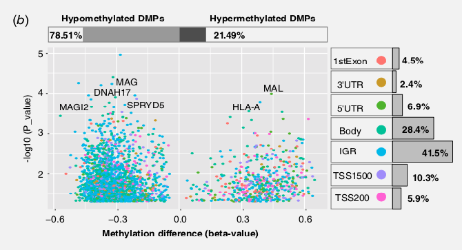

**Author(s)**: `r params$author`  
**Reviewer(s)**: `r params$reviewer`  
**Date**: `r Sys.Date()`  


# Academic Citation
If you use this code in your work or research, we kindly request that you cite our publication:

Xiaofan Lu, et al. (2025). FigureYa: A Standardized Visualization Framework for Enhancing Biomedical Data Interpretation and Research Efficiency. iMetaMed. https://doi.org/10.1002/imm3.70005


```{r setup, include=FALSE}
knitr::opts_chunk$set(echo = TRUE)
```

## 需求描述
## Requirement description

从形式上复现文章里的这个复杂火山图。
Reproduce the complex volcano map in the article in form.



出自<https://onlinelibrary.wiley.com/doi/abs/10.1002/ijc.31765>
From <https://onlinelibrary.wiley.com/doi/abs/10.1002/ijc.31765>

Figure 1. DMPs analysis in LSTs cases and controls. (b) Volcano plot of top DMPs and position of methylation probes in relation to the gene (IGR, intergenic region; TSS, transcription start site; UTR, untranslated region). The percentages of hypermethylated and hypomethylated DMPs are displayed on top. The proportions of different genomic features are shown on the right.

**图的解析：**
**Analysis of the figure:**

- 中央散点图横坐标是甲基化差异（foldchange），纵坐标是P value；
- 右侧是位于各特征区域内的位点所在百分比，根据feature计算而来
- 顶部是对位点的另一层分类信息hypo、hyper所在的百分比，根据散点图横坐标beta-value计算而来。
- The horizontal axis of the central scatter plot is the methylation difference (foldchange), and the vertical axis is the P value;
- The right side is the percentage of sites located in each feature region, calculated based on the feature
- The top is another layer of classification information for the site, the percentage of hypo and hyper, calculated based on the horizontal axis beta-value of the scatter plot

## 应用场景
## Application scenarios

同时展示多层信息，不仅限于例文中的甲基化位点。
Show multiple layers of information at the same time, not limited to the methylation sites in the example text.

还可以换成差异表达基因，把横坐标deltabeta换成foldchange，feature换成基因分类即可。
You can also change to differentially expressed genes, replace the horizontal axis deltabeta with foldchange, and replace feature with gene classification.

## 环境设置
## Environment settings


```{r}
source("install_dependencies.R")
# BiocManager::install("janitor")
```

Load package

```{r}
library(magrittr)
library(ggplot2)
library(ggrepel)
library(janitor)
library(cowplot)
Sys.setenv(LANGUAGE = "en") #显示英文报错信息 #Display English error message
options(stringsAsFactors = FALSE) #禁止chr转成factor #Disable chr conversion to factor
```

## 输入文件
## Input file

easy_input.csv，包含四列：
easy_input.csv, contains four columns:

- 第一列ID，用于在图中标出P value低的位点ID。
- 第二列p value，用于画散点图。
- 第三列deltaBeta（foldchange），用于画散点图。另外，这里会用这列计算hypo和hypermethylated的百分比，用来画顶端百分比图。如果你不想用deltaBeta列来计算百分比，可以直接给出百分比，详见文档中“顶部百分比图 `p3` 的绘制”部分。
- 第四列feature，用于画右侧柱状图。这里是位点所在的基因组位置特征，也可以换做其他特征，例如差异表达基因所在的通路、编码/非编码、原癌/抑癌等。
- The first column ID is used to mark the site ID with low P value in the figure.
- The second column p value is used to draw scatter plots.
- The third column deltaBeta (foldchange) is used to draw scatter plots. In addition, this column will be used to calculate the percentage of hypo and hypermethylated, which is used to draw the top percentage map. If you do not want to use the deltaBeta column to calculate the percentage, you can directly give the percentage. For details, see the "Drawing the top percentage map `p3`" section in the document.
- The fourth column, feature, is used to draw the bar graph on the right. This is the genomic location feature of the site, which can also be replaced by other features, such as the pathway where the differentially expressed gene is located, coding/non-coding, proto-oncogene/cancer suppressor, etc.

```{r}
data <- read.csv("easy_input.csv", check.names=FALSE)
row.names(data) <- data[, 1]
colnames(data)[1] <- "Geneid"
head(data)
```

下面分别绘制散点图、顶部比例和右侧bar plot，最后组图。
The following are the scatter plots, top ratios and right bar plots, and finally the group diagrams.

## 散点图 `p1` 的绘制
## Draw a scatter plot `p1`

```{r }
p1 <- ggplot(data, aes(deltaBeta, -log10(data$P.Value))) +
  # 只给-log10(data$P.Value) > 60 的点写文字标签
  # Write text labels only for points with -log10(data$P.Value) > 60
  geom_text_repel(aes(deltaBeta, -log10(data$P.Value),
                      label = ifelse(-log10(data$P.Value) > 60, rownames(data), ""))) + 
  geom_point(aes(color = feature)) +
  guides(colour = guide_legend(override.aes = list(size=5))) + # 修改 legeng size 大小 # Modify the size of the legeng
  theme(legend.position = "none") + # 去掉图例 # Remove the legend
  labs(x = "Methylation difference (beta-value)",
       y = bquote(~-log[10]~(italic("P-value")))) + #参考了FigureYa59Volcano # Reference to FigureYa59Volcano
  theme(axis.title.x = element_text(color="black", size = 14, face = "bold"),
        axis.title.y = element_text(color="black", size = 14, face = "bold"))

p1
# 原图带灰色背景和网格线
# Original image with gray background and grid lines

# 如果想去除背景和网格线，就运行下面这段
# If you want to remove the background and grid lines, run the following paragraph
p1 <- p1 + theme_classic() +
  theme(#panel.background = element_rect(fill = NA),
        panel.border = element_rect(color = NA, fill = NA, size = 2),
        panel.grid.major.x = element_blank(),
        panel.grid.minor.x = element_blank(),
        panel.grid.minor.y = element_blank(),
        panel.grid.major.y = element_blank()) +
  scale_y_continuous(breaks = c(0, 25, 50, 75, 100),
                     labels = c(0, 25, 50, 75, ""),
                     limits = c(0, 100))
p1
```

## 散点图右侧面的柱子图 `p2` 的绘制
## Draw the column chart `p2` on the right side of the scatter plot

```{r}
### 得到百分比信息
### Get percentage information
Percent <- data[, -1] %>%
  tabyl(feature) %>%
  adorn_totals("row") %>%
  adorn_pct_formatting() %>%
  .[-8,]
Percent
# 获得 Percent 中计数列的 n 的最大值
# Get the maximum value of n in the count column in Percent
n_max = max(Percent$n)
n_max

### 构造用于画彩色圆点的数据
### Construct data for drawing colored dots
# 注意这里填充要与前面的顺序一致，也就是说颜色要与散点图中的颜色对应
# Note that the filling here should be consistent with the previous order, that is, the color should correspond to the color in the scatter plot
Percent$A <- 1:7
test = data.frame(x = c(1, 2, 3, 4, 5, 6, 7),
                  y = rep(-n_max/15, 7),
                  type = LETTERS[1:7])

### 构造 geom_rect() 函数的输入对象
### Construct the input object of the geom_rect() function
# 这里一定要添加 `inherit.aes = FALSE` 这个参数，不然它是会报错的，被坑惨了
# Be sure to add the parameter `inherit.aes = FALSE` here, otherwise it will report an error, which is a pitfall
# geom_rect文档里的说明：If FALSE, overrides the default aesthetics, rather than combining with them. This is most useful for helper functions that define both data and aesthetics and shouldn't inherit behaviour from the default plot specification, e.g. borders().
# Description in the geom_rect document: If FALSE, overrides the default aesthetics, rather than combining with them. This is most useful for helper functions that define both data and aesthetics and shouldn't inherit behavior from the default plot specification, e.g. borders().
rect_data <- data.frame(
  xstart = c(0.55, 1.55, 2.55, 3.55, 4.55, 5.55, 6.55),
  xend   = c(1.45, 2.45, 3.45, 4.45, 5.45, 6.45, 7.45), 
  ystart = c(rep(-n_max/2, 7)),
  yend   = c(rep(0, 7)))

### 画图
### Draw the picture
p2 <- ggplot(Percent, aes(A, n)) +
  geom_bar(stat = "identity", fill = "#BEBEBE", color = "black") + 
  geom_point(data = test, 
             aes(x, y, color = type), size = 4) +
  geom_text(aes(label = Percent$percent,
                hjust = ifelse(n > 1000, 2, -0.2)),
            #nudge_y = -120, 
            vjust = 0,
            fontface = "bold", size = 3) +
  geom_text(data = Percent,
            aes(A, -n_max/3, label = c("1stExon", "3'UTR", "5'UTR", "Body", "IGR", "TSS1500", "TSS200")), 
            color = "black", fontface = "bold",
            size = 3, hjust = 0.5) +
  geom_rect(data = rect_data, inherit.aes = FALSE,
            aes(xmin = xstart, xmax = xend,
                ymin = ystart, ymax = yend), 
            fill = "NA", color = "black") +
  theme_bw() +
  coord_flip() +
  
  #下面这两个参数很重要，只有这样才能保证与 xy 轴之间没有间隙，才能达到图中的长宽对应。否则会对不上，自己尝试有和无就知道差别。
  #The following two parameters are very important. Only in this way can we ensure that there is no gap between the xy axis and the length and width correspond to each other in the figure. Otherwise, they will not match. Try it yourself with and without it to know the difference.
  scale_x_continuous(expand = c(0, 0)) +
  scale_y_continuous(expand = c(0, 0)) +
  
  theme(panel.background = element_rect(fill = NA),
        panel.border = element_blank(),
        panel.grid.major.x = element_blank(),
        panel.grid.minor.x = element_blank(),
        panel.grid.minor.y = element_blank(),
        panel.grid.major.y = element_blank(),
        axis.line.x = element_blank(),
        axis.ticks.x = element_blank(),
        axis.ticks.y = element_blank(),
        axis.text.y = element_blank(),
        axis.text.x = element_blank(),
        legend.position = "none"
  ) +
  guides(fill = FALSE) +
  xlab("") + ylab("") 
p2
```

## 顶部百分比图 `p3` 的绘制
## Drawing of the top percentage graph `p3`

首先计算 `Hyper` 和 `Hypo` 各占的比例，看图两者加起来是百分之一百，这里没有 0 ，就不考虑 0 了。
First, calculate the proportion of `Hyper` and `Hypo`. As you can see from the graph, the sum of the two is 100%. There is no 0 here, so 0 is not considered.

因此定义 `> 0` 就为 `Hyper`, `< 0` 就为 `Hypo`。得到 `Hyper` 所占百分比为 `r paste(round(sum(data$deltaBeta > 0) / nrow(data) * 100, 2), "%")`, 得到 `Hypo` 所占百分比为 `r paste(round(sum(data$deltaBeta < 0) / nrow(data) * 100, 2), "%")`
Therefore, define `> 0` as `Hyper`, and `< 0` as `Hypo`. The percentage of `Hyper` is `r paste(round(sum(data$deltaBeta > 0) / nrow(data) * 100, 2), "%")`, and the percentage of `Hypo` is `r paste(round(sum(data$deltaBeta < 0) / nrow(data) * 100, 2), "%")`

```{r}
### 计算得到百分比
### Calculate the percentage
percent_Hypo <- sum(data$deltaBeta > 0) / nrow(data)
paste("Hypo was", round(percent_Hypo * 100, 2), "%" )

percent_Hyper <- sum(data$deltaBeta < 0) / nrow(data)
paste("Hyper was", round(percent_Hyper * 100, 2), "%" )

# 如果你不想用deltaBeta列来计算百分比，可以用以下两行直接给出百分比：
# If you don't want to use the deltaBeta column to calculate the percentage, you can use the following two lines to give the percentage directly:
#percent_Hypo <- "0.8"
#percent_Hyper <- "0.2"

### 手动给两个百分比的文字标签写个位置
### Manually write a position for the two percentage text labels
# 实际使用当中要根据自己的数据调整xmin和xmax
# In actual use, you need to adjust xmin and xmax according to your own data
df1 <- data.frame(xmin = c(-350, 500, 1928, 4591),
                  xmax = c(500, 1928, 4591, 6500),
                  ymin = 00,
                  ymax = 100,
                  class  = c("A","B","C","A"),
                  text = c(paste(round(percent_Hyper * 100, 2), "%" ),  "", "", paste(round(percent_Hypo * 100, 2), "%" )))
df1

### 画图
### Plot
p3 <- ggplot(df1, aes(xmin= xmin, xmax = xmax, 
                      ymin= ymin , ymax= ymax, 
                      fill = class, label = text )) + 
  geom_rect(color = "black") +
  geom_text(aes(label = df1$text, x = xmin + 400, y = ymax - 50),
            position = position_dodge(0.9),
            vjust = 0, fontface = "bold", size = 3) +
  scale_fill_manual(values = c("#FFFFFF", "#4D4D4D", "#BEBEBE", "#FFFFFF")) +
  theme_bw() +
  
  # 同图 `p2` 也一样的道理，以下两个参数很重要，不然会发现宽度与散点图宽度不一样
  # Same as figure `p2`. The following two parameters are very important, otherwise you will find that the width is different from the scatter plot width 
  scale_x_continuous(expand = c(0, 0)) +
  scale_y_continuous(expand = c(0, 0)) +
  
  theme(panel.background = element_rect(fill = NA),
        panel.border = element_rect(color = NA, fill = NA, size = 2),
        panel.grid.major.x = element_blank(),
        panel.grid.minor.x = element_blank(),
        panel.grid.minor.y = element_blank(),
        panel.grid.major.y = element_blank(),
        axis.line.x = element_blank(),
        axis.ticks.x = element_blank(),
        axis.ticks.y = element_blank(),
        axis.text.y = element_blank(),
        axis.text.x = element_blank()) +
  guides(fill = FALSE) +
  xlab("") + ylab("") 
p3
```

## 组图
## Group pictures

```{r,fig.width = 10, fig.height = 6}
combined_plot <- insert_xaxis_grob(p1, p3, 
                                   position = "top",
                                   height = grid::unit(0.4, "in") # 调节高度比
) 

combined_plot <- insert_yaxis_grob(combined_plot, p2, 
                                   position = "right",
                                   width = grid::unit(2.5, "in")
)
# ggdraw(combined_plot) 

subtitle_theme_1 <- ggdraw() +
  draw_label("Hyermethylated DMPs          Hypomethylated DMPs",
             x = 0.1, y = 0.25,
             hjust = 0, vjust = 1.01, size = 10,  fontface = "bold")

p <- plot_grid(subtitle_theme_1, combined_plot, ncol = 1, 
               rel_heights = c(0.1, 1)) #顶部百分比图和散点图的比例
p

# 保存到文件
# Save to file
ggsave("multiVolcano.pdf")
```

```{r}
sessionInfo()
```