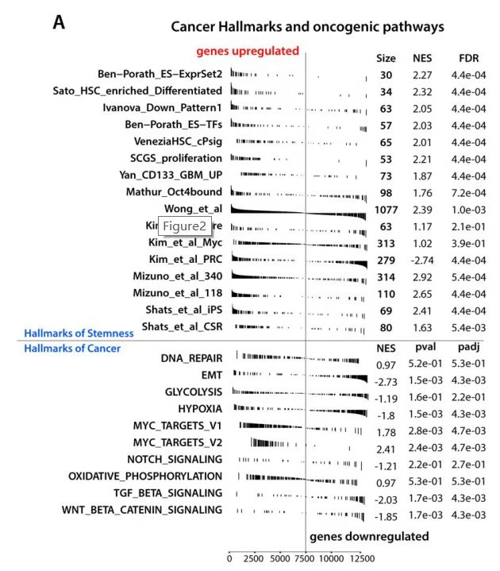

**Author(s)**: `r params$author`  
**Reviewer(s)**: `r params$reviewer`  
**Date**: `r Sys.Date()`  


# Academic Citation
If you use this code in your work or research, we kindly request that you cite our publication:

Xiaofan Lu, et al. (2025). FigureYa: A Standardized Visualization Framework for Enhancing Biomedical Data Interpretation and Research Efficiency. iMetaMed. https://doi.org/10.1002/imm3.70005

```{r setup, include=FALSE}
knitr::opts_chunk$set(echo = TRUE)
```

## 需求描述
## Requirement description

用paper里这种类似fgsea的图展示GSEA富集分析结果。兼容Java版和clusterProfiler版GSEA：
Use a fgsea-like graph in the paper to display the results of GSEA enrichment analysis. Compatible with Java and clusterProfiler versions of GSEA:

1. Java版GSEA的输出结果作为输入，到画图；
1. Use the output of Java version of GSEA as input to draw a graph;

2. 用clusterProfiler做GSEA，到画图。这里重点在画DIYpaper里的这幅图。
2. Use clusterProfiler to do GSEA and then draw a graph. The focus here is on drawing the graph in DIYpaper.



出自<https://www.sciencedirect.com/science/article/pii/S0092867418303581?via%3Dihub#app2>
From <https://www.sciencedirect.com/science/article/pii/S0092867418303581?via%3Dihub#app2>

Figure 2. Biological processes associated with cancer stemness
(A) Gene Set Enrichment Analysis showing RNAseq-based stemness signature evaluated in the context of gene sets representative for Hallmarks of Stemness and Cancer.

**图的解析**
**Analysis of the figure**

1. 每行一个geneset，通常我们会用MsigDB里的geneset。而这篇文章的作者是从其他16篇文献中收集的，每篇文章的基因作为一个geneset。HT曾分享过类似的思想，推荐阅读：《富集分析，十年的思考 | “小Ying画图群”讨论记录》<https://mp.weixin.qq.com/s/O1xd5l5h33fXUWOvX3UBGw>
2. 基因按foldchange排序，当遇到属于这个geneset的基因时，就会画黑色竖线（bar）。纵坐标是foldchange，因此左半边是genes upregulate，右半边是gene downregulated。
3. 右侧列出每个geneset的size、NES、FDR等信息，集中在一个图里，整齐并不拥挤，展示的信息量还非常大。
4. 如果gene set少些，甚至可以像FigureYa60GSEA_clusterProfiler那样，在rank上标出关键基因。
1. Each line has a geneset. Usually we use the genesets in MsigDB. The author of this article collected them from 16 other articles, and the genes in each article are used as a geneset. HT has shared similar ideas. Recommended reading: "Enrichment Analysis, Ten Years of Thinking | Discussion Records of "Xiao Ya Drawing Group"" <https://mp.weixin.qq.com/s/O1xd5l5h33fXUWOvX3UBGw>
2. Genes are sorted by foldchange. When encountering a gene belonging to this geneset, a black vertical line (bar) will be drawn. The vertical axis is foldchange, so the left half is genes upregulated and the right half is genes downregulated.
3. The size, NES, FDR and other information of each geneset are listed on the right side, concentrated in one figure, which is neat and not crowded, and the amount of information displayed is still very large.
4. If there are fewer gene sets, you can even mark the key genes on the rank like FigureYa60GSEA_clusterProfiler.

## 应用场景
## Application scenario

做完GSEA富集分析，接下来就该考虑如何在一张图中合理的展示多组或多条通路的结果。
After completing the GSEA enrichment analysis, the next step is to consider how to reasonably display the results of multiple groups or multiple pathways in one figure.

更多画法可参考FigureYa13GSEA_Java或FigureYa60GSEA_clusterProfiler。
For more drawing methods, please refer to FigureYa13GSEA_Java or FigureYa60GSEA_clusterProfiler.

另外，GSEA的应用不仅仅是输入差异分析得到的基因foldchange/adj.p list，用来展示差异表达的通路，GSEA其实还有更多的应用方式，例如[RNA蛋白质关联分析](https://www.sciencedirect.com/science/article/pii/S0016508517357426?via%3Dihub)Figure3等，或者像例文那样探讨感兴趣的指标（stemness index与其他gene list的关系）。
In addition, the application of GSEA is not only to input the gene foldchange/adj.p list obtained by differential analysis to display the differentially expressed pathways. GSEA actually has more applications, such as [RNA protein association analysis](https://www.sciencedirect.com/science/article/pii/S0016508517357426?via%3Dihub)Figure3, etc., or explore the indicators of interest (the relationship between stemness index and other gene lists) as in the example article.

这里将展示三种方法：
Here are three methods:

- 方法一：fgsea直接出图，需要后期用AI等软件处理；
- 方法二：用clusterProfiler做GSEA，DIY出paper里的图；
- 方法三：用Java版GSEA的输出文件作为输入，DIY出paper里的图。
- Method 1: fgsea directly outputs the picture, which needs to be processed by AI and other software later;
- Method 2: Use clusterProfiler to do GSEA and DIY the picture in the paper;
- Method 3: Use the output file of the Java version of GSEA as input to DIY the picture in the paper.


## 环境设置
## Environment settings

```{r}
source("install_dependencies.R")
library(fgsea)
library(clusterProfiler)
library(enrichplot)
library(xlsx)
library(tidyverse)
options(stringsAsFactors = F)
Sys.setenv(LANGUAGE = "en")
```

## 方法一和二的输入文件
## Input files for methods 1 and 2

- DNAmethylation_and_RNAexpression_Stemness_Signatures.xlsx: 基因排序，相当于Java版GSEA的rnk文件，至少包含两列：基因ID和用于排序的数值（foldchange、pvalue等等）。这里用的是[文章附属文件](https://api.gdc.cancer.gov/data/401e9e48-12d2-4177-81a7-10043a32867c)DNAmethylation_and_RNAexpression_Stemness_Signatures.xlsx，对stemness index感兴趣的小伙伴可以按照文章给出的[代码](http://tcgabiolinks.fmrp.usp.br/PanCanStem/)重复出该文件。
- DNAmethylation_and_RNAexpression_Stemness_Signatures.xlsx: Gene ranking, equivalent to the rnk file of Java version GSEA, contains at least two columns: gene ID and numerical values used for ranking (foldchange, pvalue, etc.). Here we use the [article attachment file](https://api.gdc.cancer.gov/data/401e9e48-12d2-4177-81a7-10043a32867c)DNAmethylation_and_RNAexpression_Stemness_Signatures.xlsx. Friends who are interested in stemness index can reproduce the file according to the [code](http://tcgabiolinks.fmrp.usp.br/PanCanStem/) given in the article.

- h.all.v7.0.symbols.gmt，signature list。这里以MsigDB中的hallmark为例。例文是作者去文献里收集的16个genesets，实际应用时可以用MsigDB的geneset，也可以自己去文献里收集，原理看这篇：《富集分析，十年的思考 | “小Ying画图群”讨论记录》<https://mp.weixin.qq.com/s/O1xd5l5h33fXUWOvX3UBGw>。
- h.all.v7.0.symbols.gmt, signature list. Here we take the hallmark in MsigDB as an example. The example article is 16 genesets collected by the author from the literature. In actual application, you can use the genesets of MsigDB, or you can collect them from the literature yourself. For the principle, please refer to this article: "Enrichment Analysis, Ten Years of Thinking | Discussion Record of "Xiao Ya Drawing Group"" <https://mp.weixin.qq.com/s/O1xd5l5h33fXUWOvX3UBGw>.

```{r}
# GSEA 输入基因，按照stemness weight大小排序
# GSEA input genes, sorted by stemness weight
mRNA_si <- openxlsx::read.xlsx("DNAmethylation_and_RNAexpression_Stemness_Signatures.xlsx", 
                      sheet = 2, colNames = TRUE)
head(mRNA_si)
mRNA_si$Weight <- as.numeric(as.character(mRNA_si$Weight))
mRNA_si <- mRNA_si[order(mRNA_si$Weight, decreasing = T), ]
si.id <- mRNA_si$Weight; names(si.id) <- mRNA_si$HUGO
head(si.id)

# 感兴趣的signature
# Interesting signature
gmtfile <- "./h.all.v7.0.symbols.gmt"
hallmark <- read.gmt(gmtfile)
hallmark.list <- hallmark %>% split(.$term) %>% lapply( "[[", 2)
```

## 方法一：fgsea直接出图
## Method 1: fgsea directly outputs the image

后期再借助illustrator等软件进一步美化
Use illustrator and other software to further beautify it later

```{r}
fgseaRes <- fgsea(pathways = hallmark.list, 
                  stats = si.id,
                  minSize=15,
                  maxSize=500,
                  nperm=10000)
topPathwaysUp <- fgseaRes[ES > 0][head(order(pval), n=10), pathway]
topPathwaysDown <- fgseaRes[ES < 0][head(order(pval), n=10), pathway]
topPathways <- c(topPathwaysUp, rev(topPathwaysDown))
length(topPathways)

pdf("fgsea.pdf", width = 12, height = 8)
plotGseaTable(hallmark.list[topPathways], si.id, fgseaRes, 
              gseaParam = 0.5)
dev.off()
```


同原文结果一致，可见MYC——target是显著跟stemness是显著正相关的，而TGF_beta和EMT则呈现负相关。
The results are consistent with the original paper. It can be seen that MYC-target is significantly positively correlated with stemness, while TGF_beta and EMT are negatively correlated.

## 方法二：用clusterProfiler做GSEA，DIY出paper里的图
## Method 2: Use clusterProfiler to do GSEA and DIY the graph in the paper

用Guangchuang Yu的**clusterProfiler**做GSEA分析，然后用base plot画出原文相似的图。相似用法可以参考FigureYa60GSEA_clusterprofiler。
Use Guangchuang Yu's **clusterProfiler** to do GSEA analysis, and then use base plot to draw a graph similar to the original paper. For similar usage, please refer to FigureYa60GSEA_clusterprofiler.

先整理输入格式
First, organize the input format

```{r}
clustergsea <- GSEA(geneList = si.id, TERM2GENE=hallmark, verbose = F,
                    minGSSize = 15, maxGSSize = 500, nPerm = 10000, pvalueCutoff = 1)
write.csv(clustergsea, "clustergsea.csv")

x = clustergsea
gsdata <- do.call(rbind, lapply(topPathways, enrichplot:::gsInfo, object = x))
gsdata$gsym <- rep(mRNA_si$HUGO, length(topPathways))
head(gsdata)

#整理成base画图所需要的格式
#Organize into the format required for base drawing
statsAdj <- si.id/max(abs(si.id))
gsdata$statsAdj <- rep(statsAdj, length(topPathways))  %>% ifelse(gsdata$position == 0, 0, .)
summary(gsdata$statsAdj) #后面base循坏画图的时候ylim大小根据这个范围，画出图比较好看
#When drawing the graph in the base loop later, the ylim size will be based on this range, so the graph will look better
#write.csv(gsdata, "easyinput.csv", row.names = F)

#gsdata <- read.csv("easyinput.csv", header = T)
baseinput <- gsdata %>% split(.$Description)
```

开始画图

```{r}
Size <- clustergsea@result$setSize; names(Size) <- clustergsea@result$ID 
NES <- clustergsea@result$NES; names(NES) <- clustergsea@result$ID
FDR <- clustergsea@result$p.adjust; names(FDR) <- clustergsea@result$ID
opar <- par(no.readonly = T)
opar$mar #5.1 4.1 4.1 2.1
mtextsize = 0.8; mtextsize2 = 1.2

#base布局，base画图多组组合在一起可以用以下三种方法：par(mfrow),layout(),split.screen()，这里用split.screen()
#base layout, base drawing can be combined in three ways: par(mfrow), layout(), split.screen(), split.screen() is used here
n3 <- seq(from = 0.95, to = 0.05, length.out = 25)
n4 <- c(0.98, n3[1:length(n3)-1])
n <- data.frame(n1 = 0.05, n2 = 0.95, n3 = n3,
                 n4 = n4)
n <- as.matrix(n)#分为25个screen
textscreen <- c(1, 2, length(topPathwaysUp)+3, length(topPathwaysUp)+4,nrow(n))#这些screen用来重复出原图的注释信息等。
#These screens are used to repeat the annotation information of the original image, etc.

pdf("gseabase.pdf", width = 8, height = 10)
split.screen(n, erase = T)
screen(1, new = T)
par(xpd = T, mar = c(0, 0, 0, 0), oma = c(0, 0, 0, 0),
    bty = "n")#xpd = T,让超出画图范围的字也能显示出来
#xpd = T, so that words beyond the drawing range can also be displayed
plot(c(0, 1), c(0, 1), xlab = "",xaxt = "n", ylab = "",yaxt = "n",lty= 0, col = "white")#建立个空白画布, xaxt = "n":suppresses plotting of the axis
#Create a blank canvas, xaxt = "n":suppresses plotting of the axis
text(c(par()$usr[1] + par()$usr[2])/1.5, c(par()$usr[3] + par()$usr[4])/2,
     labels = "Cancer Hallmarks and oncogenic pathways", adj = 0.5, cex = 1.2)
###################################
screen(2, new = T)
par(xpd = F, mar = opar$mar + c(-5.1, 15 , -4.1, 6), oma = c(0, 0, 0, 0),
    bty = "n")
plot(c(0, 1), c(0, 1), xlab = "",xaxt = "n", ylab = "",yaxt = "n", lty= 0, col = "white")
mtext("gene upregulated", side = 2, adj = 1, line = -4, las = 1, col = "red", cex = 1)
mtext("Size", side = 4, adj = 0, las = 1, line = 1, cex = mtextsize)
mtext("NES", side = 4, adj = 0, las = 1, line = 3.5, cex = mtextsize)
mtext("Size", side = 4, adj = 0, las = 1, line = 6, cex = mtextsize)
###################################
screen(textscreen[3], new = T)
par(xpd = F, mar = c(0, 0, 0, 0), oma = c(0, 0, 0, 0),
    bty = "n")
plot(c(0, 1), c(0, 1), xlab = "",xaxt = "n", ylab = "",yaxt = "n", lty = 0, col = "white")
mtext(text = "Postive correlated hallmarks", side = 2, adj = 0, line = 1.5, las = 1, 
      cex = mtextsize2, col = "blue")
segments(x0 = par("usr")[1], x1 = par("usr")[2], 
         y0 = par("usr")[3], y1 = par("usr")[3], col="grey",lwd=1)

screen(textscreen[3], new = F)
par(xpd = F, mar = opar$mar + c(-5.1, 15 , -4.1, 6), oma = c(0, 0, 0, 0),
    bty = "n")
plot(c(0, 1), c(0, 1), xlab = "",xaxt = "n", ylab = "",yaxt = "n", lty = 0, col = "white")
segments(x0 = c(par("usr")[1]+par("usr")[2])/2, x1 = c(par("usr")[1]+par("usr")[2])/2,
         y0 = par("usr")[3], y1 = par("usr")[4], col="grey",lwd=1)
###################################
screen(textscreen[4], new = T)
par(xpd = F, mar = c(0, 0, 0, 0), oma = c(0, 0, 0, 0),
    bty = "n")
plot(c(0, 1), c(0, 1), xlab = "",xaxt = "n", ylab = "",yaxt = "n", lty = 0, col = "white")
mtext(text = "Negative correlated hallmarks", side = 2, adj = 0, line = 1.5, las = 1, 
      cex = mtextsize2, col = "blue")
screen(textscreen[4], new = F)
par(xpd = F, mar = opar$mar + c(-5.1, 15 , -4.1, 6), oma = c(0, 0, 0, 0),
    bty = "n")
plot(c(0, 1), c(0, 1), xlab = "",xaxt = "n", ylab = "",yaxt = "n", lty = 0, col = "white")
segments(x0 = c(par("usr")[1]+par("usr")[2])/2, x1 = c(par("usr")[1]+par("usr")[2])/2,
         y0 = par("usr")[3], y1 = par("usr")[4], col="grey",lwd=1)
###################################
screen(textscreen[5], new = T)
par(xpd = F, mar = opar$mar + c(-5.1, 15 , -4.1, 6), oma = c(0, 0, 0, 0),
    bty = "n")
plot(c(0, nrow(mRNA_si)), c(0, 1), xlab = "",xaxt = "n", ylab = "",yaxt = "n", lty= 0, col = "white",
     xaxs = "i")# xaxs = "i":finds an axis with pretty labels that fits within the original data range
mtext("gene downregulated", side = 4, adj = 0, line = -4, las = 1, col = "black", cex = 1)
segments(x0 = c(par("usr")[1]+par("usr")[2])/2, x1 = c(par("usr")[1]+par("usr")[2])/2,
         y0 = par("usr")[3], y1 = par("usr")[4], col="grey",lwd=1)
axis(side = 1, at = seq(0, 12500, 2500), labels = T, cex.axis = 0.5)
###################################
plotscreen <- c(1:25)[-textscreen]
for (i in 1:length(plotscreen)){
  j = plotscreen[i]
    screen(j, new = T)
    par(xpd = F, mar = opar$mar + c(-5.1, 15 , -4.1, 6), oma = c(0, 0, 0, 0),
      bty = "n")
    input1 <- baseinput[[ topPathways[i] ]]
    input1 <- input1[input1$position == 1, ]
    plot(c(1,nrow(mRNA_si)),c(-0.66, 0.66),
     xlab = "",xaxt = "n", ylab = "",yaxt = "n", lty = 0, col = "white") 
    segments(x0 = input1$x, x1 = input1$x, y0 = 0, y1 = input1$statsAdj, col = "black")
    segments(x0 = c(par("usr")[1]+par("usr")[2])/2, x1 = c(par("usr")[1]+par("usr")[2])/2,
         y0 = par("usr")[3], y1 = par("usr")[4], col="grey",lwd=1)
    mtext(text = str_sub(input1$Description[1], 10),side = 2, adj = 1, line = 1, las = 1)
    mtext(text = sprintf("%1.0f", Size[input1$Description[1]] ), 
          side = 4, adj = 0, las = 1, line = 1, cex = mtextsize)
    mtext(text = sprintf("%.2f", NES[input1$Description[1]] ), 
          side = 4, adj = 0, las = 1, line = 3.5, cex = mtextsize)
    mtext(text = sprintf("%.2f", FDR[input1$Description[1]] ), 
          side = 4, adj = 0, las = 1, line = 6, cex = mtextsize)
}
close.screen(all = TRUE)#关闭screen
dev.off()
par(opar)
```


## 方法三：用Java版GSEA的输出文件作为输入，DIY出paper里的图。
## Method 3: Use the output file of the Java version of GSEA as input and DIY the graph in the paper.

GSEA JAVA版本跑出的结果作为输入，整理数据格式，然后画图，画图代码跟方法二的类似。
Use the results of the GSEA JAVA version as input, organize the data format, and then draw the graph. The drawing code is similar to that of method 2.

先写个函数
Write a function first

```{r}
Limma.dif <- function(exprdata, pdata, contrastfml){
library(limma)
group_list <- as.character(pdata[, 2])
design <- model.matrix(~0 + factor(group_list))
colnames(design) <- levels(as.factor(pdata[, 2]))
rownames(design) <- colnames(exprdata)
if (!all(colnames(exprdata) == pdata[, 1])){
    exprdata <- exprdata[, match(pdata[, 1], colnames(exprdata))]
  }
if (!all(colnames(exprdata) == pdata[, 1])){
    stop(" expression data do not match pdata")
  }
contrast.matrix <- makeContrasts(contrasts = contrastfml, levels=design)
fit <- lmFit(exprdata, design)
fit <- contrasts.fit(fit,contrast.matrix)
fit <- eBayes(fit)
return(fit)
}
```

整理数据格式
Arrange data format

```{r}
gseajava.dat <- read.table("./GSEA/CD274.gct", skip = 2, header = T, sep = "\t", check.names = F)
#算差异基因
#Calculate differentially expressed genes
gseajava.dat <- gseajava.dat[, -2]
gseajava.dat <- aggregate(.~genesymbol, gseajava.dat, mean)
rownames(gseajava.dat) <- gseajava.dat$genesymbol #注意这里有很多日期，所以说最好不要用excel打开这些数据。
#Note that there are many dates here, so it is best not to use Excel to open these data.
gseajava.dat <- gseajava.dat[, -1]
sample_info <- data.frame(sample = colnames(gseajava.dat), type = str_sub(colnames(gseajava.dat), 1, 3))
result_limma <- Limma.dif(exprdata = gseajava.dat, pdata = sample_info, contrastfml = "Hig - Low")
result_limma <- topTable(result_limma, coef = "Hig - Low", n = Inf)
gene.id <- result_limma$logFC; names(gene.id) <- rownames(result_limma)
head(gene.id)
statsAdj2 <- gene.id/max(abs(gene.id))

#读入GSEA JAVA结果
#Read GSEA JAVA results
gseaout.high <- read.delim("./GSEA/my_analysis.Gsea.1569680710457/gsea_report_for_High_1569680710457.xls") # 新版GSEA输出tsv格式的文件，这样修改替换一下即可
# The new version of GSEA outputs a file in tsv format. Just modify and replace it like this
gseaout.low <- read.delim("./GSEA/my_analysis.Gsea.1569680710457/gsea_report_for_Low_1569680710457.xls")
topPathwaysUp2 <- gseaout.high[order(gseaout.high$FDR.q.val, decreasing = F), "NAME"][1:10] 
topPathwaysDown2 <- gseaout.low[order(gseaout.low$FDR.q.val, decreasing = F), "NAME"][1:10]

fnames <- paste0(c(topPathwaysUp2, topPathwaysDown2), ".xls")
fdataset <- lapply(paste0("./GSEA/my_analysis.Gsea.1569680710457/",fnames),read.delim)
names(fdataset) <- c(topPathwaysUp2, topPathwaysDown2)
for (i in 1:length(fdataset)){
  fdataset[[i]]$statsAdj <- statsAdj2[fdataset[[i]]$PROBE]
}
```

开始画图
Start drawing

```{r}
javagsea <- rbind(gseaout.high, gseaout.low)
Size2 <- javagsea$SIZE; names(Size2) <- javagsea$NAME
NES2 <- javagsea$NES; names(NES2) <- javagsea$NAME
FDR2 <- javagsea$FDR.q.val; names(FDR2) <- javagsea$NAME
opar <- par(no.readonly = T)
opar$mar #5.1 4.1 4.1 2.1
mtextsize = 0.8; mtextsize2 = 1.2
#base布局，base画图多组组合在一起可以用以下三种方法：par(mfrow),layout(),split.screen()，这里用split.screen()
#base layout, base drawing multiple groups can be combined together using the following three methods: par(mfrow), layout(), split.screen(), split.screen() is used here
n3 <- seq(from = 0.95, to = 0.05, length.out = 25)
n4 <- c(0.98, n3[1:length(n3)-1])
n <- data.frame(n1 = 0.05, n2 = 0.95, n3 = n3,
                 n4 = n4)
n <- as.matrix(n)#分为25个screen
textscreen <- c(1, 2, length(topPathwaysUp2)+3, length(topPathwaysUp2) + 4,nrow(n))#这些screen用来重复出原图的注释信息等。
# These screens are used to repeat the annotation information of the original image, etc.

pdf("javagsea.pdf", width = 10, height = 10)
split.screen(n, erase = T)
screen(1, new = T)
par(xpd = T, mar = c(0, 0, 0, 0), oma = c(0, 0, 0, 0),
    bty = "n")#xpd = T,让超出画图范围的字也能显示出来
#xpd = T, so that words beyond the drawing range can also be displayed
plot(c(0, 1), c(0, 1), xlab = "",xaxt = "n", ylab = "",yaxt = "n",lty= 0, col = "white")#建立个空白画布, xaxt = "n":suppresses plotting of the axis
#Create a blank canvas, xaxt = "n":suppresses plotting of the axis
text(c(par()$usr[1] + par()$usr[2])/1.5, c(par()$usr[3] + par()$usr[4])/2,
     labels = "Cancer Hallmarks and oncogenic pathways", adj = 0.5, cex = 1.2)
###################################
screen(2, new = T)
par(xpd = F, mar = opar$mar + c(-5.1, 15 , -4.1, 6), oma = c(0, 0, 0, 0),
    bty = "n")
plot(c(0, 1), c(0, 1), xlab = "",xaxt = "n", ylab = "",yaxt = "n", lty= 0, col = "white")
mtext("gene upregulated", side = 2, adj = 1, line = -4, las = 1, col = "red", cex = 1)
mtext("Size", side = 4, adj = 0, las = 1, line = 1, cex = mtextsize)
mtext("NES", side = 4, adj = 0, las = 1, line = 3.5, cex = mtextsize)
mtext("Size", side = 4, adj = 0, las = 1, line = 6, cex = mtextsize)
###################################
screen(textscreen[3], new = T)
par(xpd = F, mar = c(0, 0, 0, 0), oma = c(0, 0, 0, 0),
    bty = "n")
plot(c(0, 1), c(0, 1), xlab = "",xaxt = "n", ylab = "",yaxt = "n", lty = 0, col = "white")
mtext(text = "Postive correlated hallmarks", side = 2, adj = 0, line = 1.5, las = 1, 
      cex = mtextsize2, col = "blue")
segments(x0 = par("usr")[1], x1 = par("usr")[2], 
         y0 = par("usr")[3], y1 = par("usr")[3], col="grey",lwd=1)

screen(textscreen[3], new = F)
par(xpd = F, mar = opar$mar + c(-5.1, 15 , -4.1, 6), oma = c(0, 0, 0, 0),
    bty = "n")
plot(c(0, 1), c(0, 1), xlab = "",xaxt = "n", ylab = "",yaxt = "n", lty = 0, col = "white")
segments(x0 = c(par("usr")[1]+par("usr")[2])/2, x1 = c(par("usr")[1]+par("usr")[2])/2,
         y0 = par("usr")[3], y1 = par("usr")[4], col="grey",lwd=1)
###################################
screen(textscreen[4], new = T)
par(xpd = F, mar = c(0, 0, 0, 0), oma = c(0, 0, 0, 0),
    bty = "n")
plot(c(0, 1), c(0, 1), xlab = "",xaxt = "n", ylab = "",yaxt = "n", lty = 0, col = "white")
mtext(text = "Negative correlated hallmarks", side = 2, adj = 0, line = 1.5, las = 1, 
      cex = mtextsize2, col = "blue")
screen(textscreen[4], new = F)
par(xpd = F, mar = opar$mar + c(-5.1, 15 , -4.1, 6), oma = c(0, 0, 0, 0),
    bty = "n")
plot(c(0, 1), c(0, 1), xlab = "",xaxt = "n", ylab = "",yaxt = "n", lty = 0, col = "white")
segments(x0 = c(par("usr")[1]+par("usr")[2])/2, x1 = c(par("usr")[1]+par("usr")[2])/2,
         y0 = par("usr")[3], y1 = par("usr")[4], col="grey",lwd=1)
###################################
screen(textscreen[5], new = T)
par(xpd = F, mar = opar$mar + c(-5.1, 15 , -4.1, 6), oma = c(0, 0, 0, 0),
    bty = "n")
plot(c(0, length(gene.id)), c(0, 1), xlab = "",xaxt = "n", ylab = "",yaxt = "n", lty= 0, col = "white",
     xaxs = "i")# xaxs = "i":finds an axis with pretty labels that fits within the original data range
mtext("gene downregulated", side = 4, adj = 0, line = -4, las = 1, col = "black", cex = 1)
segments(x0 = c(par("usr")[1]+par("usr")[2])/2, x1 = c(par("usr")[1]+par("usr")[2])/2,
         y0 = par("usr")[3], y1 = par("usr")[4], col="grey",lwd=1)
axis(side = 1, at = seq(0, length(gene.id), 2500), labels = T, cex.axis = 0.5)
###################################
#限制ylim大小美观输出,这里用0.2,具体使用的时候根据自己的数据
#Limit the size of ylim for beautiful output. Here we use 0.2. When using it, you can use it according to your own data.
lapply(fdataset, function(x)x$statsAdj) %>% lapply(., as.numeric) %>% lapply(., max) %>% unlist() %>% max
lapply(fdataset, function(x)x$statsAdj) %>% lapply(., as.numeric) %>% lapply(., min) %>% unlist() %>% min
plotscreen <- c(1:25)[-textscreen]
for (i in 1:length(plotscreen)){
  j = plotscreen[i]
    screen(j, new = T)
    par(xpd = F, mar = opar$mar + c(-5.1, 15 , -4.1, 6), oma = c(0, 0, 0, 0),
      bty = "n")
    input2 <- fdataset[[ c(topPathwaysUp2, topPathwaysDown2)[i] ]]
    plot(c(1,length(gene.id)),c(-0.2, 0.2),
     xlab = "",xaxt = "n", ylab = "",yaxt = "n", lty = 0, col = "white") 
    segments(x0 = input2$RANK.IN.GENE.LIST, x1 = input2$RANK.IN.GENE.LIST, y0 = 0, y1 = input2$statsAdj, col = "black")
    segments(x0 = c(par("usr")[1]+par("usr")[2])/2, x1 = c(par("usr")[1]+par("usr")[2])/2,
         y0 = par("usr")[3], y1 = par("usr")[4], col="grey",lwd=1)
    mtext(text = str_sub(names(fdataset)[i], 6),side = 2, adj = 1, line = 1, las = 1, cex = 0.75)
    mtext(text = sprintf("%1.0f", Size2[ names(fdataset)[i] ] ), 
          side = 4, adj = 0, las = 1, line = 1, cex = mtextsize)
    mtext(text = sprintf("%.2f", NES2[ names(fdataset)[i] ]), 
          side = 4, adj = 0, las = 1, line = 3.5, cex = mtextsize)
    mtext(text = sprintf("%.2f", FDR2[names(fdataset)[i]] ), 
          side = 4, adj = 0, las = 1, line = 6, cex = mtextsize)
}
close.screen(all = TRUE)#关闭screen
#Close the screen
dev.off()
par(opar)
```


# Session Info

```{r}
sessionInfo()
```