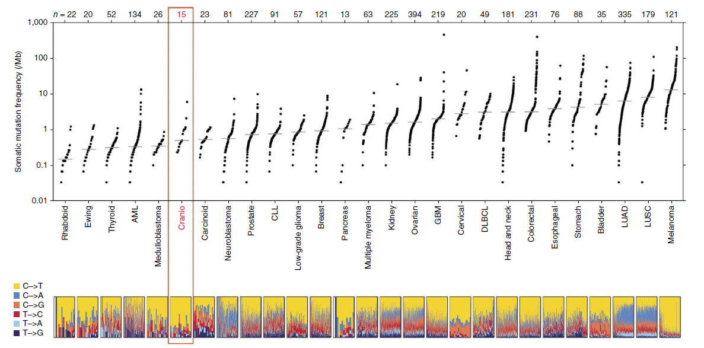

**Author(s)**: `r params$author`  
**Reviewer(s)**: `r params$reviewer`  
**Date**: `r Sys.Date()`  


# Academic Citation
If you use this code in your work or research, we kindly request that you cite our publication:

Xiaofan Lu, et al. (2025). FigureYa: A Standardized Visualization Framework for Enhancing Biomedical Data Interpretation and Research Efficiency. iMetaMed. https://doi.org/10.1002/imm3.70005


```{r setup, include=FALSE}
knitr::opts_chunk$set(echo = TRUE)
knitr::opts_chunk$set(message = FALSE)
knitr::opts_chunk$set(warning = FALSE)
```

## 需求描述
## Requirement description

输入TCGA突变的数据，重复出如下图。
Input TCGA mutation data and repeat the following figure.



出自<https://www.nature.com/articles/ng.2868>
From <https://www.nature.com/articles/ng.2868>

Figure 1 Plot of the number of nonsynonymous mutations per megabase in craniopharyngiomas (n = 15) in comparison to a broad range of pediatric and adult tumors n = 3,083). Data for all other tumor types, as well as the figure design, were taken from Lawrence et al.14. Each dot in this plot corresponds to a **matched tumor-normal pair**. The vertical position indicates the **frequency of somatic mutations** in that exome. Tumor types are ordered on the basis of their median nonsynonymous frequency, and within each tumor type, tumor-normal pairs are ordered from lowest to highest frequency. The relative proportions of **six different possible base-pair substitutions** are indicated at the bottom. Craniopharyngioma data are derived from whole-exome sequencing of 15 tumor-normal pairs, including 12 adamantinomatous and 3 papillary craniopharyngioma, and are marked in red.

In consonance with the benign histology of these tumors, we identified only a relatively small number of nonsynonymous somatic mutations in both craniopharyngioma subtypes when compared to large cohorts of other tumor types14 (Fig. 1). The **nonsynonymous mutation rate** of 0.9 per Mb in the craniopharyngioma samples was similar to that found in a number of pediatric tumors, as well as that in low-grade tumors in adults, for example, World Health Organization– classified grade I meningioma15 (Fig. 1). 58% of the mutations were **cytosine to thymidine at CpG dinucleotides**, which is consistent with spontaneous deamination and not a carcinogen-induced process (Fig. 1)14. As we anticipated, the allelic fraction for many of the mutations was very low (median, 3%; range, 0.96–48%).

**图的解读**
**Interpretation of the graph**

把颅咽管瘤跟其他癌症一同展示，便于做对比。图分上下两部分：
Display craniopharyngioma with other cancers for easy comparison. The graph is divided into two parts:

上半部分散点图：
Upper part scatter plot:

- 散点图中每个点对应1个matched tumor-normal pair
- 纵坐标为突变频率
- 横坐标的各种肿瘤按nonsynonymous frequency的中值排列，每个肿瘤内部按突变频率排序
- Each point in the scatter plot corresponds to a matched tumor-normal pair
- The vertical axis is the mutation frequency
- The various tumors on the horizontal axis are arranged according to the median of nonsynonymous frequency, and each tumor is sorted by mutation frequency

底部为每个matched tumor-normal pair中6种碱基突变方式所占的比例
The bottom is the proportion of the six base mutations in each matched tumor-normal pair

## 应用场景
## Application scenario

同时展示TCGA泛癌样本TMB情况以及6种碱基转换和颠换情况(T>G, T>A, T>C, C>G, C>T, C>A )。像例文一样用于直观展示感兴趣癌种与TCGA其他癌种的整体TMB情况。
Show the TMB of TCGA pan-cancer samples and the six base conversions and transversions (T>G, T>A, T>C, C>G, C>T, C>A) at the same time. Like the example text, it is used to intuitively display the overall TMB of the cancer of interest and other TCGA cancers.

还可以自定义分组，例如对比同一疾病不同亚型。
You can also customize the grouping, such as comparing different subtypes of the same disease.

## 环境设置
## Environment settings


```r
BiocManager::install("maftools")
```


```{r}
source("install_dependencies.R")
library(TCGAbiolinks)
library(maftools)
library(ggplot2)
library(tidyverse)
library(ggsci)

Sys.setenv(LANGUAGE = "en") #显示英文报错信息 #Display English error message
options(stringsAsFactors = FALSE) #禁止chr转成factor #Disable conversion of chr to factor
```

## 输入数据的下载
## Download input data

下载TCGA全部癌种的maf文件。
Download the maf files of all TCGA cancer types.

这里我们用TCGAbiolinks下载maf文件。（也可以用R包TCGAmutations，这个包里面已经下载并且处理成maf的格式了，但是版本不是最新的。）
Here we use TCGAbiolinks to download the maf files. (You can also use the R package TCGAmutations, which has been downloaded and processed into maf format, but the version is not the latest.)

```r
tumors <- TCGAbiolinks::getGDCprojects()$project_id %>% .[grep("TCGA", .)] %>% str_sub(., 6)
# pipeline 可以选择muse, varscan2, somaticsniper, mutect2 在这里选用mutect2
# pipeline can choose muse, varscan2, somaticsniper, mutect2. Here, mutect2 is selected
maflist <- tumors %>% lapply(., GDCquery_Maf, save.csv = FALSE, directory = "GDCdata", pipelines = "mutect2") %>% lapply(., read.maf)
names(maflist) <- tumors
# 保存数据，以后可以反复使用
# Save the data for repeated use later
save(maflist, file = "maflist.RData")
TMB.dat <- lapply(maflist, getSampleSummary)
titv.dat <- lapply(maflist, function(x)titv(maf = x, plot = FALSE, useSyn = FALSE#不添加同义突变 #Do not add synonymous mutations
                                            )) %>% lapply(., function(x)x$fraction.contribution)
save(TMB.dat, titv.dat, file = "TMB_titv.RData")
```

## 准备突变频率输入数据
## Prepare mutation frequency input data

先准备上半部分散点图的数据（TMB.dat），底部图（titv.dat）中样本顺序按照散点图的TMB大小排列。
First prepare the data of the scatter plot in the upper part (TMB.dat), and the order of samples in the bottom figure (titv.dat) is arranged according to the TMB size of the scatter plot.

```{r}
# 原文TMB是算的nonsynonymous mutations per megabase
# The original TMB counts nonsynonymous mutations per megabase
#silent mutation突变包括：3'Flank，3'UTR，5'Flank，5'UTR，IGR，Intron，RNA，Silent，Splice_Region
#Silent mutations include: 3'Flank, 3'UTR, 5'Flank, 5'UTR, IGR, Intron, RNA, Silent, Splice_Region
# 定义6种突变的颜色
# Define 6 mutation colors
col <- pal_npg("nrc", alpha=0.7)(6) #用色板  # Use color palette
# 或者像这样自己定义颜色
# Or define colors yourself like this
# col <- c("yellow", "blue", "orange", "red", "lightblue", "darkblue")
names(col) <- c("C>T", "T>C", "C>A", "C>G", "T>A", "T>G")
col
 
(load("TMB_titv.RData")) # 载入保存好的数据 # Load saved data
#str(TMB.dat)
TMB.dat <- TMB.dat %>% lapply(., as.data.frame) %>% 
  lapply(., function(x)x[, c("Tumor_Sample_Barcode", "total")]) %>% plyr::ldply(., data.frame)
colnames(TMB.dat)[1] <- "cohort"; colnames(TMB.dat)[3] <- "TMB"
head(TMB.dat); str(TMB.dat)
```

**题外话**
**Off-topic**

TMB.dat里面存储的是所有癌症的突变频率，其中第一列是癌症名称，第二列是sample ID，第三列是突变频率。
TMB.dat stores the mutation frequency of all cancers, where the first column is the cancer name, the second column is the sample ID, and the third column is the mutation frequency.

如果你对pancancer不感兴趣，只想在某1种癌症不同分子亚型之间做对比，就把第一列换成分子亚型的名字。
If you are not interested in pancancer and only want to compare different molecular subtypes of a certain cancer, replace the first column with the name of the molecular subtype.

可以这样导出数据格式，替换成自己的数据，然后导入：
You can export the data format like this, replace it with your own data, and then import it:

```r
# 保存到文件
# Save to file
write.csv(TMB.dat, "easy_input.csv", row.names = F)
# 把第一列改为自己想要的分组后，读入文件
# After changing the first column to the group you want, read the file
TMB.dat <- read.csv("easy_input.csv", check.names = F)
head(TMB.dat)
```

继续
Continue

```{r}
TMB.dat$TMB <- TMB.dat$TMB/35 # 计算TMB # Calculate TMB
tcga.cohort.med <- TMB.dat %>% group_by(cohort) %>% summarize(median = median(TMB)) %>%
  as.data.frame() %>% .[order(.$median, decreasing = F), ]
TMB.dat$cohort <- factor(x = TMB.dat$cohort, levels = tcga.cohort.med$cohort)
TMB.dat <- TMB.dat[order(TMB.dat$cohort, TMB.dat$TMB, decreasing = F), ]

# sample order in bottom panel
sampleorder <- TMB.dat %>% split(.$cohort) %>% lapply("[[", 2) %>% lapply(., as.character)
TMB.plot <- split(TMB.dat, as.factor(TMB.dat$cohort))
TMB.plot <- lapply(seq_len(length(TMB.plot)), function(i) {
    x = TMB.plot[[i]]
    x = data.frame(x = seq(i - 1, i, length.out = nrow(x)), 
                   TMB = x[, "TMB"], cohort = x[, "cohort"])
    return(x)
  })
names(TMB.plot) <- levels(as.factor(TMB.dat$cohort))
```

## 准备titv输入数据
## Prepare titv input data

```{r}
#str(titv.dat)
titv.dat2 <- lapply(tcga.cohort.med$cohort, function(x){
  tmp <- titv.dat[[x]]
  tmp <- tmp[match(sampleorder[[x]], tmp$Tumor_Sample_Barcode), ]
  return(tmp)
  if (!all(tmp$Tumor_Sample_Barcode == sampleorder[[x]])){
    stop("Inconsistent sample order")
  }
}) 

names(titv.dat2) <- tcga.cohort.med$cohort
titv.dat2 <- lapply(titv.dat2, function(x){
  x <- as.data.frame(x)
  rownames(x) <- x$Tumor_Sample_Barcode
  x <- x[, -1]
  x <- t(x)
  #delete samples without mutation
  if (length(which(colSums(x) == 0)) > 0) {
      x = x[, -which(colSums(x) == 0), drop = FALSE]
    }
  return(x)
})
#str(titv.dat2)
all(names(TMB.plot) == names(titv.dat2))
tcga.cohort.med$Median_Mutations_log10 <- log10(tcga.cohort.med$median + 1)
```

## 开始画图
## Start drawing

用base plot一笔一笔画图
Use base plot to draw one stroke at a time

```{r}
#base layout
n1 <- seq(from = 0.105, to = 0.915, length.out = 33)
n2 <- c(n1[2:length(n1)], n1[33] + n1[33] - n1[32])
n <- data.frame(n1 = n1, n2 = n2, n3 = 0.05,
                 n4 = 0.2) %>% rbind(c(0.05, 0.97, 0.25, 1), ., c(0, 0.1, 0.05, 0.25)) 
n <- as.matrix(n) #分为33 + 2个screen # Divided into 33 + 2 screens
opar <- par(no.readonly = T)

pdf("TMB_titv.pdf", width = 9, height = 5)
split.screen(n, erase = T)
screen(1, new = T)
par(xpd = T, mar = c(4, 1, 2, 0), oma = c(0, 0, 0, 0),
    bty = "n", mgp = c(3, 1, 0)) #xpd = T,让超出画图范围的字也能显示出来 #xpd = T, so that words beyond the drawing range can also be displayed
y_lims = range(log10(unlist(lapply(TMB.plot, function(x) max(x[, "TMB"], na.rm = TRUE))) + 1))
y_lims[1] = 0
y_lims[2] = ceiling(max(y_lims))
y_at = c(0, 1, 2, 3)
# 画散点图
# Draw a scatter plot
plot(NA, NA, xlim = c(0, length(TMB.plot)), ylim = y_lims, 
     xlab = NA, ylab = NA, xaxt="n", yaxt = "n", xaxs = "r")
lapply(seq_len(length(TMB.plot)), function(i){
  tmp = TMB.plot[[i]]
  points(tmp$x, log10(tmp$TMB+1), pch = 16, cex = 0.4, col = "black")
})
# 画坐标轴
# Draw coordinate axes
axis(side = 1, at = seq(0.5, length(TMB.plot) - 0.5, 1), labels = names(TMB.plot), 
     las = 2, tick = T, line = 0)
axis(side = 2, at = y_at, las = 2, line = -1.25, tick = T, labels = c(0, 1, 2, 3))
# 写y轴label
# Write y-axis label
mtext(text = "log10(TMB+1)", side = 2, 
      line = 1.75, cex = 1.1)
lapply(seq_len(nrow(tcga.cohort.med)), function(i) {
  segments(x0 = i - 1, x1 = i, 
           y0 = tcga.cohort.med[i, "Median_Mutations_log10"], 
           y1 = tcga.cohort.med[i, "Median_Mutations_log10"],     
           col = "grey")})
# 画底部6种突变比例
# Draw the 6 mutation ratios at the bottom
lapply(seq_len(length(titv.dat2)), function(i){
  screen(i+1, new = T)
  par(xpd = T, mar = c(0, 0, 0, 0), oma = c(0, 0, 0, 0),
    bty = "o")#xpd = T，让超出画图范围的字也能显示出来 #xpd = T, so that words beyond the drawing range can also be displayed
  tmp <- titv.dat2[[i]]
  barplot(tmp, col = col[rownames(tmp)], names.arg = rep("", ncol(tmp)),
          axes = FALSE, space = 0, border = NA, lwd = 1.2)
  box()
})

screen(35, new = T)
par(xpd = T, mar = c(0, 0, 0, 0), oma = c(0, 0, 0, 0),
    bty = "n")
plot(NA, NA, xlim = c(0, 1), ylim = c(0, 1), 
     axes = FALSE, xlab = NA, ylab = NA)
# 画图例
# Draw legend
legend("center", 
  fill = col,
  legend = names(col),
  bty = "n",
  cex=0.7)
close.screen(all = TRUE)
dev.off()
par(opar)
```


## 把每个癌种的数目标在图的上方
## Mark the number of each cancer type on the top of the picture

上图就很好看了，不过原图最上方还标出了每个癌种的数目，下面复现原图。
The above picture looks good, but the original picture also marked the number of each cancer type at the top. The original picture is reproduced below.

```{r}
opar <- par(no.readonly = T)
#######################################
pdf("TMB_titv2.pdf", width = 10, height = 5)
split.screen(n, erase = T)
screen(1, new = T)
par(xpd = T, mar = c(4, 1, 2, 0), oma = c(0, 0, 0, 0),
    bty = "o", mgp = c(3, 1, 0)) #bty= "o"让图的方框显示出来 #bty= "o" makes the box of the figure appear
y_lims = range(log10(unlist(lapply(TMB.plot, function(x) max(x[, "TMB"], na.rm = TRUE))) + 1))
y_lims[1] = 0
y_lims[2] = ceiling(max(y_lims))
y_at = c(0, 1, 2, 3)
x_top_label <- as.numeric(unlist(lapply(TMB.plot, nrow)))
plot(NA, NA, xlim = c(0, length(TMB.plot)), ylim = y_lims, 
     xlab = NA, ylab = NA, xaxt="n", yaxt = "n", xaxs = "r")
lapply(seq_len(length(TMB.plot)), function(i){
  tmp = TMB.plot[[i]]
  points(tmp$x, log10(tmp$TMB+1), pch = 16, cex = 0.4, col = "black")
})
axis(side = 1, at = seq(0.5, length(TMB.plot) - 0.5, 1), labels = names(TMB.plot), 
     las = 2, tick = T, line = 0)
axis(side = 2, at = y_at, las = 2, line = 0, tick = T, labels = c(0, 1, 2, 3))

# 添加每个癌症的matched tumor-normal pair数量
# Add the number of matched tumor-normal pairs for each cancer
axis(side = 3, at = seq(0.5, length(TMB.plot) - 0.5, 1), labels = x_top_label,
     tick = T, line = 0, cex.axis = 0.6)
mtext(text = "log10(TMB+1)", side = 2, 
      line = 1.75, cex = 1.1)
lapply(seq_len(nrow(tcga.cohort.med)), function(i) {
  segments(x0 = i - 1, x1 = i, 
           y0 = tcga.cohort.med[i, "Median_Mutations_log10"], 
           y1 = tcga.cohort.med[i, "Median_Mutations_log10"],     
           col = "grey")})

lapply(seq_len(length(titv.dat2)), function(i){
  screen(i+1, new = T)
  par(xpd = T, mar = c(0, 0, 0, 0), oma = c(0, 0, 0, 0),
    bty = "o") #xpd = T，让超出画图范围的字也能显示出来 #xpd = T, so that words beyond the drawing range can also be displayed
  tmp <- titv.dat2[[i]]
  barplot(tmp, col = col[rownames(tmp)], names.arg = rep("", ncol(tmp)),
          axes = FALSE, space = 0, border = NA, lwd = 1.2)
  box()
})

screen(35, new = T)
par(xpd = T, mar = c(0, 0, 0, 0), oma = c(0, 0, 0, 0),
    bty = "n")
plot(NA, NA, xlim = c(0, 1), ylim = c(0, 1), 
     axes = FALSE, xlab = NA, ylab = NA)
legend("center", 
  fill = col,
  legend = names(col),
  bty = "n",
  cex=0.7)
close.screen(all = TRUE)
dev.off()
par(opar)
```


## 后期处理
## Post-processing

后期需要用illustrator微调一下：
1. 把两边纵坐标往里再移动一下
2. 在top_label第一个再加上"n = "
Illustrator needs to be used for fine-tuning in the later stage:
1. Move the vertical coordinates on both sides inward
2. Add "n = " to the first top_label

```{r}
sessionInfo()
```