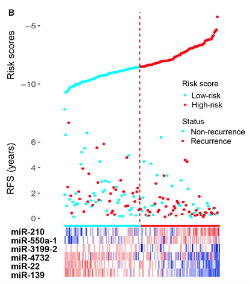
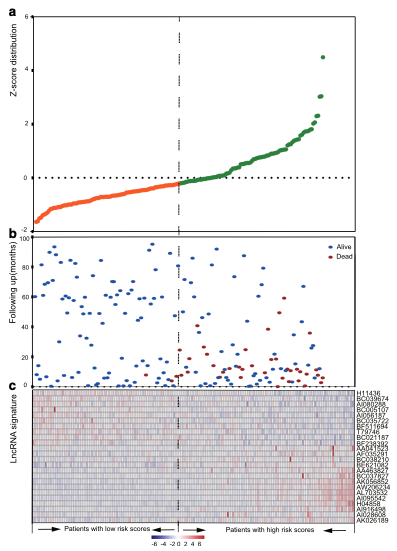
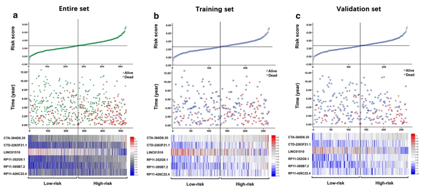

**Author(s)**: `r params$author`  
**Reviewer(s)**: `r params$reviewer`  
**Date**: `r Sys.Date()`  


# Academic Citation
If you use this code in your work or research, we kindly request that you cite our publication:

Xiaofan Lu, et al. (2025). FigureYa: A Standardized Visualization Framework for Enhancing Biomedical Data Interpretation and Research Efficiency. iMetaMed. https://doi.org/10.1002/imm3.70005

```{r setup, include=FALSE}
knitr::opts_chunk$set(echo = TRUE)
```

## 需求描述
## Requirement description

画风险因子关联图，中间用一条竖线把两组分开，signature的热图用两种颜色区分两组。
Draw a risk factor correlation graph, separate the two groups with a vertical line in the middle, and use two colors to distinguish the two groups in the signature heat map.



出自<https://febs.onlinelibrary.wiley.com/doi/full/10.1002/1878-0261.12315>
From <https://febs.onlinelibrary.wiley.com/doi/full/10.1002/1878-0261.12315>



出自<https://molecular-cancer.biomedcentral.com/articles/10.1186/s12943-016-0544-0>
From <https://molecular-cancer.biomedcentral.com/articles/10.1186/s12943-016-0544-0>



出自<https://translational-medicine.biomedcentral.com/articles/10.1186/s12967-019-2032-y>
From <https://translational-medicine.biomedcentral.com/articles/10.1186/s12967-019-2032-y>

## 应用场景
## Application scenario

同时展示risk score和表达量
Show risk score and expression at the same time

## 环境设置
## Environment settings

```{r}
source("install_dependencies.R")
library(reshape2)
library(ggplot2)
library(scales)
library(cowplot)

Sys.setenv(LANGUAGE = "en") #显示英文报错信息 #Display English error message
options(stringsAsFactors = FALSE) #禁止chr转成factor #Disable chr to factor
```

## 输入文件
## Input file

easy_input_risk.csv，包含生存信息、表达量、risk score。其中risk score的获得，可以通过FigureYa31lasso计算并输出每个signature的系数coefficient，然后算出risk score，可参考这篇文章的第二步：<https://mp.weixin.qq.com/s/4s6X0dpvEqOh-KtxES3sTg>
easy_input_risk.csv, contains survival information, expression level, and risk score. The risk score can be obtained by calculating and outputting the coefficient of each signature through FigureYa31lasso, and then calculating the risk score. Please refer to the second step of this article: <https://mp.weixin.qq.com/s/4s6X0dpvEqOh-KtxES3sTg>

easy_input_sig.txt，signature。可以通过lasso、SVM等方法筛选获得，可参考FigureYa31lasso或FigureYa65SVM-RFE。
easy_input_sig.txt, signature. It can be obtained by screening through lasso, SVM and other methods, please refer to FigureYa31lasso or FigureYa65SVM-RFE.

```{r}
data <- read.csv("easy_input_risk.csv.gz", row.names = 1)
data[1:2, 1:4]

bestvars <- read.table("easy_input_sig.txt")$V1
bestvars
```

## 按risk score分组
## Group by risk score

这里用中值做cutoff分组。还可以用X-tile找最佳分组cutoff；或用FigureYa4bestSeparation找到P value最小的分组；或用FigureYa35batch_bestSeparation，从一群基因中批量找最佳分组，并筛选出高低两组有显著差异的基因。可参考这篇的思路：<https://mp.weixin.qq.com/s/4s6X0dpvEqOh-KtxES3sTg>
Here, the median is used as the cutoff group. You can also use X-tile to find the best grouping cutoff; or use FigureYa4bestSeparation to find the group with the smallest P value; or use FigureYa35batch_bestSeparation to batch find the best grouping from a group of genes and filter out genes with significant differences between the high and low groups. You can refer to the idea of this article: <https://mp.weixin.qq.com/s/4s6X0dpvEqOh-KtxES3sTg>


```{r}
# risk score，用于画顶部散点图
# risk score, used to draw the top scatter plot
rs <- data$riskscore
names(rs) <- rownames(data)
rs_data <- data.frame(x=1:length(rs),rs=as.numeric(sort(rs)))
# 用中值分组
# Group by median
rs_data$Risk <- ifelse(rs_data$rs>=median(rs_data$rs), "High-risk", "Low-risk")
head(rs_data)

# follow-up，用于画中间B图
# follow-up, used to draw the middle B graph
surv_data <- data.frame(x=1:length(rs),
                    t=data[names(sort(rs)),'times']/365*12,
                    s=data[names(sort(rs)),'status']) 
surv_data$Status <- as.factor(ifelse(surv_data$s==0,'Alive','Death'))
head(surv_data)

# 提取signature对应的data，并按risk score排序，用于画底部热图
# Extract the data corresponding to the signature and sort it by risk score for drawing the bottom heat map
exp_data <- data[names(sort(rs)),which(colnames(data) %in% bestvars)]
exp_data[1:2,1:4]
```

## 开始画图
## Start drawing

分别画出最上方的risk score、中间的follow-up和最下面的signature，最后拼图。
Draw the risk score at the top, the follow-up in the middle, and the signature at the bottom, and then complete the puzzle.

### A - risk score

```{r}
plot.A <- ggplot(rs_data, aes(x=x,y=rs))+
  geom_point(aes(col=Risk),size=0.5)+
  scale_color_manual(labels=c("High-risk","Low-risk"), 
                     #guide_legend(guide = NULL), #如果不想画图例就删掉# #Delete if you don't want to draw a legend#
                     name="Risk score", values =c("#DC0000FF", "#00A087FF")) + 
  
  # 画竖向虚线
  # Draw a vertical dashed line
  geom_segment(aes(x = sum(rs_data$Risk=="Low-risk"),
                   y = 0, 
                   xend = sum(rs_data$Risk=="Low-risk"), 
                   yend = max(rs_data$rs)), linetype="dashed", size = 0.6)+
  # 画横线
  # Draw a vertical dashed line
  #geom_segment(aes(x=0,y=median(rs_data$rs),
  #                 xend=nrow(rs_data),
  #                 yend=median(rs_data$rs)),linetype="dashed", size = 0.3)+
  
  # 写文字Cutoff:
  #Write text Cutoff: 
  #geom_text(aes(x=sum(rs_data$Risk=="Low-risk")/2,
  #              y=median(rs_data$rs)+8,
  #              label=paste0("Cutoff: ",round(median(rs_data$rs),3))),
  #          col ="black",size = 4,alpha=0.8)+
  
  theme(axis.title.x=element_blank()) +
  scale_x_continuous(limits = c(0,NA),expand = c(0,0)) +
  labs(y="Risk score",x="",fill="Risk") +
  #scale_colour_discrete(name="Risk scores") +
  theme_classic() +
  theme(axis.ticks.x=element_blank(),
        axis.line = element_blank(), #如果想像example2那样画坐标轴，就删掉这行 #If you want to draw the coordinate axis like example2, delete this line
        axis.text.x=element_blank())

plot.A
```

### B - follow-up

```{r}
plot.B <- ggplot(surv_data,aes(x=x,y=t))+
  geom_point(aes(col=Status),size=0.5)+
  geom_vline(aes(xintercept=sum(rs_data$Risk=="Low-risk")),size=0.6,linetype="dashed")+
  scale_x_continuous(limits = c(0,NA),expand = c(0,0))+
  scale_color_manual(labels=c("Alive","Dead"),
                     values =c("#00A087FF","#DC0000FF"))+
  labs(y="RFS(months)",x="")+
  theme_classic()+
  theme(axis.ticks.x=element_blank(),
        axis.line = element_blank(), #如果想像example2那样不画坐标轴，就删掉前面的#
#If you don't want to draw the axis like example2, delete the previous #
        axis.text.x=element_blank())

plot.B
```

### C - signature

```{r}
tmp <- t(scale(exp_data))
tmp[tmp > 1] = 1
tmp[tmp < -1] = -1
reorder_cormat <- function(cormat){
  dd <- dist(cormat)
  hc <- hclust(dd,method = "average")
  cormat <-cormat[hc$order,]
}
tmp1 <- reorder_cormat(tmp)
tmp1 <- rbind(tmp1,ifelse(rs_data$Risk=="Low-risk",-1.5,1.5))
tmp.m <- melt(tmp1)

p2 <-ggplot(tmp.m, aes(Var2, Var1),size=0.5) + 
  geom_tile(aes(fill = value)) 

plot.C <- p2 + scale_fill_gradient2(name="Genes\nexpression", low="#00A087FF", high="#DC0000FF", mid="white") +
  labs(x = "", y = "")+
  theme_classic()+
  theme(legend.title = element_text(size = 12), legend.position = "right",
        axis.line = element_blank(),
        axis.ticks=element_blank(),
        axis.text.x=element_blank())

plot.C
```

### 拼图
### Integration graph

```{r, fig.width=7, fig.height=9}
plot_grid(plot.A, plot.B, plot.C,
          labels = c("B", "",""), # 或者按顺序标注ABC # Or label ABC in order
          rel_heights = c(1,1,1), # 3个图的比例 # Scale of 3 graphs
          #label_x=0,
          #label_y=1,
          align = 'v',ncol = 1, axis="lr", scale = c(1,1,1), greedy = F)

# 保存到文件
# Save to file
ggsave("cox.pdf", width = 7, height = 9)
```

## 另一种拼法
## Another way to spell

图AB跟前面一样，C的分类和热图分开画
Graphs AB are the same as before, and the classification and heat map of C are drawn separately

### C - signature

```{r}
tmp <- t(scale(exp_data))
tmp[tmp > 1] = 1
tmp[tmp < -1] = -1
reorder_cormat <- function(cormat){
  dd <- dist(cormat)
  hc <- hclust(dd,method = "average")
  cormat <-cormat[hc$order,]
}
tmp1 <- reorder_cormat(tmp)
tmp.m <- melt(tmp1)
p2 <-ggplot(tmp.m, aes(Var2, Var1),size=0.5) + 
  geom_tile(aes(fill = value)) 

plot.C <- p2 + scale_fill_gradient2(name="Genes\nexpression", low="#00A087FF", high="#DC0000FF", mid="white") +
  labs(x = "", y = "")+
  theme_classic()+
  theme(legend.title = element_text(size = 12),legend.position = "right",
        axis.ticks=element_blank(), axis.text.x=element_blank(),
        axis.line = element_blank())+
  #geom_vline(aes(xintercept=sum(rs_data$Risk=="Low-risk")), linetype="dashed",size=0.6,col="black")+
  theme(plot.margin = margin(0, 0, 0, 0, "cm"))

annotation_col<- data.frame(Var1 = rs_data$Risk, 
                            Var2=c(1:length(colnames(tmp))),
                            value=1)
plot.C
```

### 分类
### Classification

```{r}
p4 <- ggplot(tmp.m, aes(Var2, Var1),size=0.5)+
    geom_raster(aes(Var2,value,fill = Var1), data= annotation_col)+ 
  labs(x = "", y = "")+
  theme_void()+
  theme(legend.position = "right", legend.title = element_blank())+
  scale_x_discrete(name="")+
  scale_fill_manual(labels=c("High-risk","Low-risk"),
                    values =c("#DC0000FF","#00A087FF"))+

  theme(plot.margin = margin(0, 0, 0, 0, "cm"))
p4
```

### 拼图
### Integration graph

```{r, fig.width=7, fig.height=9}
plot_grid(plot.A,plot.B,p4,NULL,plot.C,
          labels = c("A","B","C",""),
          rel_heights = c(1,1,0.2,-0.05,0.8),
          label_x=0,
          label_y=1,
          align = 'v',ncol = 1,greedy = F)
ggsave("cox2.pdf", width = 7, height = 9)
```

## 后期处理
## Post-processing

如果想要例文那样一通到底的竖直虚线，就在Illustrator里打开PDF文件，删除现有的虚线，另外添加虚线。
If you want a vertical dashed line that goes all the way through like the example, open the PDF file in Illustrator, delete the existing dashed line, and add another one.

```{r}
sessionInfo()
```