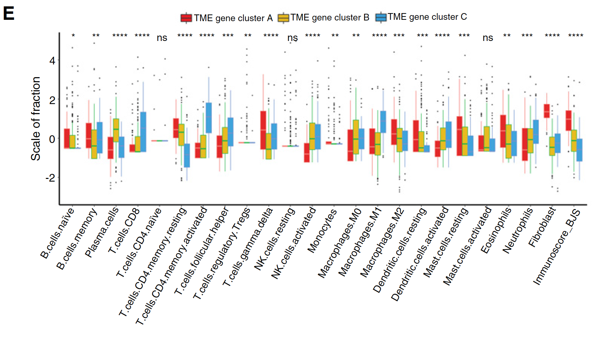

**Author(s)**: `r params$author`  
**Reviewer(s)**: `r params$reviewer`  
**Date**: `r Sys.Date()`  


# Academic Citation
If you use this code in your work or research, we kindly request that you cite our publication:

Xiaofan Lu, et al. (2025). FigureYa: A Standardized Visualization Framework for Enhancing Biomedical Data Interpretation and Research Efficiency. iMetaMed. https://doi.org/10.1002/imm3.70005

```{r setup, include=FALSE}
knitr::opts_chunk$set(echo = TRUE)
```

## 需求描述
## Requirement description

计算免疫微环境TMEscore，画出对比的box plot，标出差异显著性。
Calculate the immune microenvironment TMEscore, draw a comparative box plot, and mark the significance of the difference.



出自<https://cancerimmunolres.aacrjournals.org/content/early/2019/03/06/2326-6066.CIR-18-0436>
From <https://cancerimmunolres.aacrjournals.org/content/early/2019/03/06/2326-6066.CIR-18-0436>

Figure 2. Construction of TME signatures and functional annotation. E, The fraction of TME cells in three gene clusters. Within each group, the scattered dots represent TME cell expression values. We also plotted the Immunoscore of three gene clusters. The thick line represents the median value. The bottom and top of the boxes are the 25th and 75th percentiles (interquartile range). The whiskers encompass 1.5 times the interquartile range. The statistical difference of three gene clusters was compared through the Kruskal–Wallis test. \*, P < 0.05; \*\*, P < 0.01; \*\*\*, P < 0.001; \*\*\*\*, P < 0.0001

## 应用场景
## Application scenarios

这个流程探索的是不同TMEcluster的微环境相关signature的分布是否有差异，同样可以适用于是否复发，是否转移，癌和癌旁的表型数据。
This process explores whether the distribution of microenvironment-related signatures of different TME clusters is different. It can also be applied to recurrence, metastasis, cancer and adjacent phenotypic data.

## 环境设置
## Environment settings

```{r}
source("install_dependencies.R")

library(reshape2)
library(ggplot2)
library(ggpubr)
library(tidyverse)

Sys.setenv(LANGUAGE = "en") #显示英文报错信息 #Display English error message
options(stringsAsFactors = FALSE) #禁止chr转成factor #Display English error message
```

## 输入文件
## Input file

如果你不想计算TMEscore，只是想画带显著性的box plot，可以参考FigureYa12box。或者按照very_easy_input.csv文件准备自己的数据，直接进入“开始画图”。
If you don't want to calculate TMEscore, but just want to draw a significant box plot, you can refer to FigureYa12box. Or prepare your own data according to the very_easy_input.csv file and go directly to "Start drawing".

- easy_input_cluster.txt，样本所在的分类，实际应用时可以替换成是否复发,  是否转移等表型。原文通过CIBERSORT的细胞聚类和基因聚类获得，这一步不太好实现，流程太长了，如果哪个朋友想要个性化服务再说吧。具体步骤如下：先通过consensuclusterplus2确定细胞的最佳聚类，然后通过kmeans获得cell cluster; 接着通过cell cluster进行了两两差异分析，再通过随机森林降维获得signature gene, 然后再用signature gene通过kmeans聚类获得这个数据中的TMEcluster。
- easy_input_cluster.txt, the classification of the sample, can be replaced with phenotypes such as recurrence or metastasis in actual application. The original text is obtained through CIBERSORT cell clustering and gene clustering. This step is too long, if any friend wants personalized service, please talk to us. The specific steps are as follows: first determine the best clustering of cells through consensusuclusterplus2, and then obtain cell cluster through kmeans; then perform pairwise difference analysis through cell cluster, and then obtain signature gene through random forest dimensionality reduction, and then use signature gene to obtain TMEcluster in this data through kmeans clustering.

Tumor microenvironment characterization in gastric cancer identifies prognostic and imunotherapeutically relevant gene signatures. 2019, Cancer Immunology Research. DOI: 10.1158/2326-6066.CIR-18-0436 PMID: 30842092

- signature.RData，signature gene set，其中包含代表免疫微环境signature的 TMEscoreA和TMEscoreB，总结于这篇2018年的Nature: TGFbeta attenuates tumour response to PD-L1 blockade by contributing to exclusion of T cells. Nature 2018;554:544–8. https://www.nature.com/articles/nature25501?draft=journal&proof=true1
- signature.RData, signature gene set, which contains TMEscoreA and TMEscoreB representing the immune microenvironment signature, summarized in this 2018 Nature: TGFbeta attenuates tumour response to PD-L1 blockade by contributing to exclusion of T cells. Nature 2018;554:544–8. https://www.nature.com/articles/nature25501?draft=journal&proof=true1

- eset，每个样本的基因表达矩阵。例文整合了多个数据集，数据量庞大。为了尽量减小传输文件的大小，这里的表达矩阵是经过了signature_gene挑选后的矩阵（来自于GSE62254），也因此最后画出的图中pvalue都很小。
- eset, gene expression matrix for each sample. The example paper integrates multiple data sets, and the amount of data is huge. In order to minimize the size of the transfer file, the expression matrix here is the matrix selected by signature_gene (from GSE62254), so the pvalues in the final figure are very small.

```{r}
# phenotype data
pdata <- read.table("easy_input_cluster.txt", header = T, sep = "\t")
head(pdata)

# signature
(load("signature.RData"))
head(signature)

# expression set
eset <- read.csv("easy_input_expr.csv", row.names = 1)
eset[1:3, 1:3]

# phenotype data的样本需与expression set的样本一致
# The samples of phenotype data must be consistent with the samples of expression set
pdata <- pdata[pdata$ID%in%colnames(eset),]
dim(pdata)
eset <- eset[,colnames(eset)%in%pdata$ID]
dim(eset)

# 筛选，每个geneset的基因需要起码有2个以上在expression set中，否则运行后面的代码会报错
# Screening, each gene set needs to have at least 2 genes in the expression set, otherwise running the following code will result in an error
mingenecounts <- 2
print(lapply(signature,function(x) summary(x%in%rownames(eset))))
signature <- signature[lapply(signature,function(x) sum(x%in%rownames(eset)==TRUE)) >= mingenecounts]
```

## Calculate gene set scores

```{r}
goi <- names(signature)

#相关的signature-gene-set如下：
#The relevant signature-gene-set is as follows:
print(goi)

# 计算gene set score
# Calculate gene set score
for (sig in goi) {
  pdata[, sig] <- NA
  genes <- signature[[sig]]
  genes <- genes[genes %in% rownames(eset)]
  tmp <- eset[genes, , drop=FALSE]

  pc <- prcomp(t(tmp),retx=TRUE)
  pdata[, sig] <- pc$x[,1] * sign(cor(pc$x[,1], colMeans(tmp)))
}
head(pdata)

# 把其中两列的名字由缩写改为全称
# 按照这个写法，你还可以修改其他列的名字，它将最后出现在图的横坐标里
# Change the names of two columns from abbreviations to full names
# Following this writing method, you can also modify the names of other columns, which will appear in the horizontal axis of the graph
colnames(pdata) <- sub("APM","Antigen_processing_machinery",
                       colnames(pdata))
colnames(pdata) <- sub("DDR","DNA_damage_response",
                       colnames(pdata))

# 用TMEscoreA和TMEscoreB计算TMEscore
# Calculate TMEscore using TMEscoreA and TMEscoreB
pdata$TMEscore <- pdata$TMEscoreA - pdata$TMEscoreB

# 进行数据标准化
# 共用一个坐标时可以使数据更加集中
# Standardize data
# Sharing a coordinate can make the data more concentrated
pdata[,3:ncol(pdata)] <- scale(pdata[,3:ncol(pdata)],scale = T,center = T)

# 重排列的顺序，非必须
# Rearrange the order, not necessary
pdata <- pdata[,c(1,2,ncol(pdata),3:c(ncol(pdata)-1))]
head(pdata)

#数据宽转长
# Convert data from wide to long
pdata_melt <- melt(pdata,
                 id.vars = c("ID","TMEcluster"),
                 variable.name ="Signature",
                 value.name = "Signature_score")

# 输出到文件
# Output to file
write.csv(pdata_melt, "very_easy_input.csv", row.names = F, quote = F)
```

## 开始画图
## Start drawing
```{r, fig.width=13, fig.height=6}
pdata_melt <- read.csv("very_easy_input.csv", header = T)
head(pdata_melt)

# 使用ggplo2画图
# Use ggplo2 to draw
c <- ggplot(pdata_melt,
            aes(x=Signature, y=Signature_score, 
                fill = TMEcluster, #按类填充颜色 # Fill color by class
                color = TMEcluster)) + #按类给边框着色 # Color the border by class
  geom_boxplot(notch = F, alpha = 0.95, 
               outlier.shape = 16,
               outlier.colour = "black", #outlier点用黑色 #outlier points in black 
               outlier.size = 0.65) +
  #自定义配色
#custom color matching 
  scale_fill_manual(values= c("#E31A1C","#E7B800","#2E9FDF")) +
  #ggtitle("Gene signature score", "stratified by TME-cluster") + 
  theme_classic() +
  theme(axis.text.x = element_text(angle = 60, hjust = 1,size = 10), 
        axis.text.y = element_text(angle = 90, size = 12),
        axis.title.y = element_text(angle = 90, size = 15)) +
  theme(legend.position = "top")

# 标注p value
# Mark p value
c + stat_compare_means(aes(label = paste0("p = ", ..p.format..)))

# 标注*
# mark*
# `****` = 1e-04, `***` = 0.001, `**` = 0.01, `*` = 0.05, ns = 1
p <- c + stat_compare_means(label = "p.signif")
p

ggsave(p, filename = "TME-relevant-sigature-boxplot.pdf", width = 13, height = 6)
```

```{r}
sessionInfo()
```