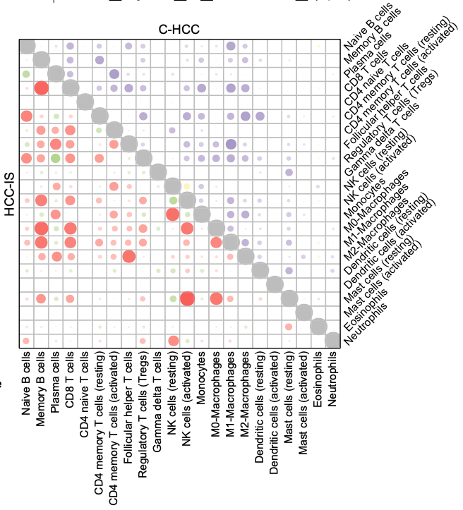

**Author(s)**: `r params$author`  
**Reviewer(s)**: `r params$reviewer`  
**Date**: `r Sys.Date()`  

# Academic Citation
If you use this code in your work or research, we kindly request that you cite our publication:

Xiaofan Lu, et al. (2025). FigureYa: A Standardized Visualization Framework for Enhancing Biomedical Data Interpretation and Research Efficiency. iMetaMed. https://doi.org/10.1002/imm3.70005


```

## 需求描述
## Requirement

复现原文这种两组画一起的相关性图。
Reproduce the correlation graph of two groups shown in the original article.



出自<https://www.sciencedirect.com/science/article/abs/pii/S0168827819301898>
From <https://www.sciencedirect.com/science/article/abs/pii/S0168827819301898>

Fig. 3. Microenvironmental immune cell profiling of HCC-IS and C-HCC. (A) Estimated absolute scores for each immune cell type by CIBERSORT and PD1-TIL, PDL1-TIL, and PDL1-Tumor immunostaining in C-HCC and HCC-IS. 

**图的解读**
**Graph Interpretation**

右上角展示C-HCC里各种免疫细胞之间的相关性，左下角展示HCC-IS里各种免疫细胞之间的相关性。
The upper right corner shows the correlation between various immune cells in C-HCC, and the lower left corner shows the correlation between various immune cells in HCC-IS.

Figure legend没写清楚，按图推测：
The figure legend is unclear, so I'm guessing based on the image:

- 泡泡大小代表相关系数r
- 泡泡颜色代表相关系数r
- p value > 0.05时不画泡泡
- Bubble size represents the correlation coefficient r
- Bubble color represents the correlation coefficient r
- Bubble not drawn if p-value > 0.05

## 应用场景
## Application Scenarios

在做相关多个基因（或免疫细胞，或样本）之间相关分析时，如果有两个不同来源的数据，通常需要各画一个图，其实可以画在一个图上。
When performing correlation analysis between multiple genes (or immune cells, or samples), if data is collected from two different sources, separate graphs are usually required. However, they can be drawn on a single graph.

适用于**横纵坐标一致**的相关性结果展示，因为这种相关性矩阵可以画成三角形（左下跟右上是一样的）。如果**横纵坐标不一致**，需要画成矩形，计算和画法可参考FigureYa97correlation。如果要同时展示两组，可参考FigureYa144DiagHeatmap的画法。
This is suitable for displaying correlation results with consistent horizontal and vertical coordinates, as such correlation matrices can be drawn as triangles (the lower left and upper right are the same). If the horizontal and vertical coordinates are inconsistent, a rectangle should be drawn. For calculation and drawing methods, refer to Figure Ya97correlation. If you need to display two groups simultaneously, refer to Figure Ya144DiagHeatmap.

## 环境设置
## Environment Setup

Using a Chinese mirror to install the package

```{r}
source("install_dependencies.R")
```

Loading the package

```{r}
library(ComplexHeatmap)
Sys.setenv(LANGUAGE = "en") #显示英文报错信息 #Display English error messages
options(stringsAsFactors = FALSE) #禁止chr转成factor #Disable conversion of chr to factor
```

## 输入文件的获得
## Obtaining the Input File

如果你的数据已经整理成easy_input\*P.csv和easy_input\*R.csv的格式，就可以跳过这步，直接进入“输入文件”
If your data has already been organized into easy_input\*P.csv and easy_input\*R.csv formats, you can skip this step and proceed directly to "Input Files."

### 相关性分析
### Correlation Analysis

这里借用FigureYa71ssGSEA输出的ssGSEA_output.csv，用来展示相关系数和p value的计算方法，生成所需的easy_input\*P.csv和easy_input\*R.csv。
Here, we use the ssGSEA_output.csv file (Figure Ya71) to demonstrate how to calculate the correlation coefficient and p-value, and to generate the required easy_input\*P.csv and easy_input\*R.csv files.

- ssGSEA_output.csv，免疫细胞矩阵，列是免疫细胞，行是样本。可以换成其他类型的数据，例如基因表达矩阵。
- ssGSEA_output.csv is an immune cell matrix, with immune cells as columns and samples as rows. This can be replaced with other data types, such as a gene expression matrix.

```{r}
tcga_gsva <- read.csv("ssGSEA_output.csv", row.names = 1, check.names = F)
tcga_gsva[1:3,1:3]
#这里将计算每列之间的相关性
# This will calculate the correlation between each column.
#如果要计算行之间的相关性就运行下面这行转置（把行变成列，列变成行）
# To calculate the correlation between rows, run the following transposition line (convert rows to columns and columns to rows).
# tcga_gsva <- t(tcga_gsva)

# 计算相关系数
# Calculate the correlation coefficient
cor_r <- cor(tcga_gsva)
cor_r[1:3,1:3]
write.csv(cor_r, "easy_input_R.csv", quote = F)

# 计算p value
# Calculate the p value
cor_p <- matrix(0, nrow = ncol(tcga_gsva), ncol = ncol(tcga_gsva))
rownames(cor_p) <- colnames(tcga_gsva)
colnames(cor_p) <- colnames(tcga_gsva)
for (i in 1:ncol(tcga_gsva)){
  for (j in 1:ncol(tcga_gsva)){
      p <- cor.test(tcga_gsva[,i],tcga_gsva[,j])
      cor_p[i,j] <- p$p.value
  }
}
write.csv(cor_p, "easy_input_P.csv", quote = F)
```

两组数据都按照这个方式运行，分别算出两组相关系数和pvalue，作为输入文件。
Both sets of data are run in this manner, and two sets of correlation coefficients and pvalues are calculated as input files.

### 输入文件
### Input File

这里我们直接用TCGA当中**KICH**以及**KIRC**内的免疫细胞之间相关分析的结果来进行绘图展示。
Here, we directly use the results of the correlation analysis between immune cells in **KICH** and **KIRC** from TCGA to plot and display.

输入文件分别是两个癌症的相关系数`easy_input*_R.csv`和P值`easy_input*_P.csv`。
The input files are `easy_input*_R.csv` and `easy_input*_P.csv`, respectively, for the correlation coefficients of the two cancer types.

```{r}
KICHR <- read.csv("easy_input1_R.csv", row.names = 1)
KICHR[1:3,1:3]
KICHP <- read.csv("easy_input1_P.csv", row.names = 1)
KICHP[1:3,1:3]
KIRCR <- read.csv("easy_input2_R.csv", row.names = 1)
KIRCP <- read.csv("easy_input2_P.csv", row.names = 1)
```

## 合并数据
## Merging Data

由于要做对两个数据集进行一起做图，所以需要把两个数据集整合到一起。由于两个数据集都是经过相关算法计算的结果，所以变量顺序也一样，所以我们就不检查其顺序是否一样。如果是自己的数据记得使用`identical`检查一下列名和行名的顺序是否一样。
Since we want to plot two datasets together, we need to merge them. Since both datasets are calculated using the correlation algorithm, the variable order is the same, so we won't check whether the order is the same. If you're using your own data, remember to use `identical` to check that the order of the column and row names is the same.

这里在相关图里面的右上半部分来展示**KICH**的相关系数，左下半部分来展示**KIRC**的相关系数。
The top right half of the correlation plot shows the **KICH** correlation coefficient, and the bottom left half shows the **KIRC** correlation coefficient.

```{r}
## 合并相关系数的数据
## Merge correlation coefficient data
datR <- KICHR
for(i in 1:nrow(datR)){
    datR[i,1:i] <- KIRCR[i,1:i]
}
datR[1:3,1:3]

## 合并P值的数据
## Merge P value data
datP <- KICHP
for (i in 1:nrow(datP)) {
    datP[i,1:i] <- KIRCP[i,1:i]
}
datP[1:3,1:3]

# P>= 0.05时，把相关系数设为NA
datR[datP > 0.05] <- NA
```

## 开始画图
## Start plotting

用`ComplexHeatmap`画图
Plot using `ComplexHeatmap`

```{r, fig.width=6, fig.height=6}
## 定义左右两个不同相关系数图的颜色
## Define the colors for the left and right correlation coefficient plots.

# 定义右上部分图形的颜色
# Define the color for the upper right plot.
colCorRight <-  circlize::colorRamp2(c(-1, 0, 1), c("green", "white", "#ef3b2c"))

# 定义左上部分图形的颜色
# Define the color for the upper left plot.
colCorLeft <- circlize::colorRamp2(c(-1, 0, 1), c("yellow", "white", "#762a83"))

## 绘制基本图形
## Draw the basic graph.
p1 <- Heatmap(datR, rect_gp = gpar(type = "none"), 
              show_heatmap_legend = F,
              cell_fun = function(j, i, x, y, width, height, fill) {
                grid.rect(x = x, y = y, width = width, height = height,
                          gp = gpar(col = "grey", fill = NA))
                if(i == j) {
                  grid.circle(x = x, y = y, r = 0.5 * min(unit.c(width, height)), gp = gpar(fill = "grey", col = NA))
                  }else if(i > j) {
                    grid.circle(x = x, y = y, r = abs(datR[i, j])/2 * min(unit.c(width, height)), 
                                gp = gpar(fill = colCorLeft(datR[i, j]), col = NA))
                    } else {
                      grid.circle(x = x, y = y, r = abs(datR[i, j])/2 * min(unit.c(width, height)), 
                                  gp = gpar(fill = colCorRight(datR[i, j]), col = NA))
                      }
                },
              cluster_rows = FALSE, cluster_columns = FALSE,
              show_row_names = T, show_column_names = T, 
              row_names_side = "right", 
              row_names_rot = 45,
              row_names_gp = gpar(fontsize = 8),
              column_names_gp = gpar(fontsize = 8)
              )
p1

## 绘制两个不同不同相关的图例
## Draw two legends for different correlations
lgdRight <- Legend(col_fun = colCorRight, title = "KICH", 
                   direction = "horizontal")
lgdLeft <- Legend(col_fun = colCorLeft, title = "KIRC", 
                  direction = "horizontal")
pd = list(lgdRight, lgdLeft)

## 最后出图
## Draw the final plot
pdf("DouleCorPlot.pdf", width = 5, height = 5.5)
draw(p1, annotation_legend_list = pd,
     annotation_legend_side = "top")
dev.off()
```


```{r}
sessionInfo()
```