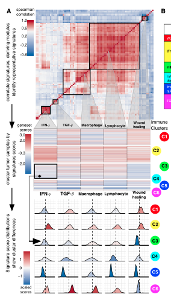

**Author(s)**: `r params$author`  
**Reviewer(s)**: `r params$reviewer`  
**Date**: `r Sys.Date()`  


# Academic Citation
If you use this code in your work or research, we kindly request that you cite our publication:

Xiaofan Lu, et al. (2025). FigureYa: A Standardized Visualization Framework for Enhancing Biomedical Data Interpretation and Research Efficiency. iMetaMed. https://doi.org/10.1002/imm3.70005

```{r setup, include=FALSE}
knitr::opts_chunk$set(echo = TRUE)
```

## 需求描述
## Requirement description

复现文章里的结果图
Reproduce the result graph in the article



出自<https://doi.org/10.1016/j.immuni.2018.03.023>
From <https://doi.org/10.1016/j.immuni.2018.03.023>

Figure 1. Immune Subtypes in Cancer (A) Expression signature modules and identification of immune subtypes. 

- Top: Consensus clustering of the pairwise correlation of cancer immune gene expression signature scores (rows and columns). Five modules of shared associations are indicated by boxes. 
- Middle: Representative gene expression signatures from each module (columns), which robustly reproduced module clustering, were used to cluster TGCA tumor samples (rows), resulting in six immune subtypes C1–C6 (colored circles). 
- Bottom: Distributions of signature scores within the six subtypes (rows), with dashed line indicating the median.

原文作者提供了代码to reproduce the signature scores and clusters，<https://github.com/Gibbsdavidl/Immune-Subtype-Clustering>。NOTE! This method is very sensitive to the software pipeline used in quantifying genes. It does not work well with FPKM, RPKM, TPM, etc.
The original author provided code to reproduce the signature scores and clusters, <https://github.com/Gibbsdavidl/Immune-Subtype-Clustering>. NOTE! This method is very sensitive to the software pipeline used to quantify genes. It does not work well with FPKM, RPKM, TPM, etc.

后来又写了个R包`ImmuneSubtypeClassifier`，more robust，<https://github.com/Gibbsdavidl/ImmuneSubtypeClassifier>，感兴趣的小伙伴可以去研究一下。
The author later wrote a more robust R package `ImmuneSubtypeClassifier`, <https://github.com/Gibbsdavidl/ImmuneSubtypeClassifier>. Interested readers are encouraged to explore it.

## 应用场景
## Application Scenarios

按免疫浸润定量结果给样本分类。
Classify samples based on immune infiltration quantification results.

## 环境设置
## Environment Setup

```{r}
source("install_dependencies.R")

library(ConsensusClusterPlus)
library(corrplot)
library(ggplot2)
library(dplyr)
library(reshape2)

Sys.setenv(LANGUAGE = "en") #显示英文报错信息 #Display English error messages
options(stringsAsFactors = FALSE) #禁止chr转成factor #Disable conversion of chr to factor
```

## 输入文件
## Input file

mmc2.xlsx，即例文的Table S1，包含TCGA里33种癌症1万多个样本的免疫浸润结果。
mmc2.xlsx, also known as Table S1 in the example article, contains immune infiltration results for over 10,000 samples from 33 cancer types collected by TCGA.

We integrated major immunogenomics methods to characterize
the immune tumor microenvironment (TME) across 33 cancers
analyzed by TCGA, applying methods for the assessment of
total lymphocytic infiltrate (from genomic and H&E image data),
immune cell fractions from deconvolution analysis of mRNAseq
data, immune gene expression signatures, neoantigen prediction,
TCR and BCR repertoire inference, viral RNA expression,
and somaticDNAalterations (Table S1).

实际应用时，可以提取其中某一种或相关的某几种癌症类型，做进一步分析。
In practical applications, one can extract specific or related cancer types for further analysis.

```{r}
#下载输入文件
# Download the input file
#download.file("https://ars.els-cdn.com/content/image/1-s2.0-S1074761318301213-mmc2.xlsx","mmc2.xlsx")

#读入输入文件
# Read the input file
data <- read.csv(file = "mmc2.csv", sep = ",", header = T, stringsAsFactors = T)
dim(data)
# 过滤50%缺失值的
# Filter 50% missing values
# data2 <- data[apply(data, 1, function(x){sum(is.na(x)) < length(x)/2}),]
data2 <- data[apply(data, 1, function(x){sum(is.na(x)) < ncol(data)/2}),]
my_data <- na.omit(data2)
dim(my_data)
```

## STEP1: Consensus clustering of the pairwise correlation of cancer immune gene expression signature scres

```{r}
data2 <- my_data[,-c(1,2,3,4)]
dim(data2)
data2 <- as.matrix(data2)
##生成聚类矩阵，并保存至setp01文件夹内
## Generate the clustering matrix and save it to the setp01 folder
res <- ConsensusClusterPlus(data2, maxK = 6, reps = 1000, 
                            pItem = 0.8, pFeature = 1, title="step01",
                            clusterAlg = 'hc', distance="spearman", seed=123456,
                            plot="pdf", #或"png"
                            corUse="pairwise.complete.obs",writeTable=T)
```

选取`consensus matrix k=5`的图作为最上面的热图
Select `consensus matrix The k=5 plot is used as the top heatmap.

## STEP2: get the barcode plot of expression signatures of each Immune clusters

自定义函数
Custom function

```{r}
genset_barcode <- function (data, gennset,
                            scale_col_low = "#053061", scale_col_mid = "white",
                            scale_col_high = "#67001f", 
                            scale_col_na = "grey50",
                            scale_name = NULL, 
                            scale_breaks = 5, 
                            scale_digits = 1,
                            x_breaks = waiver())
  {
  ggplot(data, aes_string("TCGA.Participant.Barcode", 1, fill = gennset)) +
    geom_tile() + 
    facet_wrap(.~Immune.Subtype, nrow = 6) + #用分面把6个cluster画一起 # Use faceting to plot the six clusters together. 
    scale_x_continuous(expand = c(0, 0)) +
    scale_y_continuous(expand = c(0,0)) + 
    scale_fill_gradient2(low = scale_col_low, 
                         mid = scale_col_mid, 
                         high = scale_col_high, 
                         na.value = scale_col_na,
                         midpoint = mean(data[[gennset]], na.rm = TRUE), 
                         name = scale_name,
                         breaks = function(x) seq(x[1], x[2], 
                                                  length.out = scale_breaks),
                         labels = function(x) formatC(x, format = "f",
                                                      digits = scale_digits)) + 
    labs(colour = "geneset scores") +
    theme_void() +
    coord_flip() + #坐标轴互换 #coordinate axis swap 
    
    #图例 #legend 
    theme(legend.title.align = 1,
          legend.position = 'top',
          legend.direction = "horizontal")
}
```

画图 Draw a picture

```{r}
my_data$IFN.gamma.Response <- as.numeric(as.character(my_data[,'IFN.gamma.Response']))
my_data$TCGA.Participant.Barcode <- as.numeric(as.factor(as.character(my_data[,'TCGA.Participant.Barcode'])))
#View(my_data)

# 用自定义函数画图
# Draw a picture using a custom function
genset_barcode(my_data,"IFN.gamma.Response")
ggsave("step02/IFN.gamma.Response.pdf", width = 2, height = 8)

genset_barcode(my_data,"TGF.beta.Response")
ggsave("step02/TGF.beta.Response.pdf", width = 2, height = 8)

genset_barcode(my_data,"Macrophages")
ggsave("step02/Macrophages.pdf", width = 2, height = 8)

genset_barcode(my_data,"Lymphocytes")
ggsave("step02/Lymphocytes.pdf", width = 2, height = 8)

genset_barcode(my_data,"Wound.Healing")
ggsave("step02/Wound.Healing.pdf", width = 2, height = 8)
```

## STEP3: get the signature score distributions show cluster differences

自定义函数
Custom function

```{r}
#自定义绘图函数
#Custom drawing function
genset_density <- function(data,gennset, 
                           scale_col_low = "#053061", scale_col_mid = "white",
                           scale_col_high = "#67001f", scale_col_na = "grey50",
                           scale_name = NULL, scale_breaks = 5, scale_digits = 1, 
                           x_breaks = waiver())
  {
  ggplot(data, aes_string(x=gennset, fill = "color", group = "color")) +
    geom_density() + 
    facet_wrap(Immune.Subtype~.,nrow = 6)+
    geom_vline(aes_string(xintercept = mean(my_data[[gennset]],na.rm = TRUE)),
               color = "black", linetype = "dashed", size = 1)+ 
    scale_fill_gradient2(low = scale_col_low,
                         mid = scale_col_mid, 
                         high = scale_col_high,
                         na.value = scale_col_na,
                         midpoint = mean(data[[gennset]], na.rm = TRUE), 
                         name = scale_name,
                         breaks = function(x) seq(x[1], x[2], length.out = scale_breaks),
                         labels = function(x) formatC(x, format = "f",
                                                      digits = scale_digits)) + 
    labs(colour = "scaled scores")+
    theme_void() +
    theme(legend.title.align = 1,
          legend.position = 'top',
          legend.direction = "horizontal")
}

#自定义归一化函数
#Custom normalization function
normalization <- function(x){
  return((x-min(x))/(max(x)-min(x)))}
```

画图 Draw a picture

```{r}
my_data$Immune.Subtype <- as.factor(as.character(my_data$Immune.Subtype))

#生成并归一化映射颜色数值
#Generate and normalize mapped color values
my_data$IFN.gamma.Response <- normalization(as.numeric(as.character(my_data[,'IFN.gamma.Response'],na.rm=TRUE)))
target1 <- summarise(group_by(my_data,Immune.Subtype),target1=mean(IFN.gamma.Response))
my_data1 <- merge(my_data,as.data.frame(target1),all=T)

my_data$TGF.beta.Response <- normalization(as.numeric(as.character(my_data[,'TGF.beta.Response'],na.rm=TRUE)))
target2 <- summarise(group_by(my_data,Immune.Subtype),target2=mean(IFN.gamma.Response))
my_data2 <- merge(my_data1,as.data.frame(target2),all=T)

my_data$Macrophages <- normalization(as.numeric(as.character(my_data[,'Macrophages'],na.rm=TRUE)))
target3 <- summarise(group_by(my_data,Immune.Subtype),target3=mean(Macrophages))
my_data3 <- merge(my_data2,as.data.frame(target3),all=T)

my_data$Lymphocytes <- normalization(as.numeric(as.character(my_data[,'Lymphocytes'],na.rm=TRUE)))
target4 <- summarise(group_by(my_data,Immune.Subtype),target4=mean(Lymphocytes))
my_data4 <- merge(my_data3,as.data.frame(target4),all=T)

my_data$Wound.Healing <- normalization(as.numeric(as.character(my_data[,'Wound.Healing'],na.rm=TRUE)))
target5 <- summarise(group_by(my_data,Immune.Subtype),target5=mean(Wound.Healing))
my_data5 <- merge(my_data4, as.data.frame(target5),all=T)

my_data5$color <- my_data2$target1+my_data2$target2
my_data5$color <- normalization(my_data5[,'color'])

#绘制图形 #draw graphics
genset_density(my_data5, 'IFN.gamma.Response')
ggsave("step03/IFN.gamma.Response.pdf", width = 2, height = 8)

genset_density(my_data5, 'TGF.beta.Response')
ggsave("step03/TGF.beta.Response.pdf", width = 2, height = 8)

genset_density(my_data5, 'Macrophages')
ggsave("step03/Macrophages.pdf", width = 2, height = 8)

genset_density(my_data5, 'Lymphocytes')
ggsave("step03/Lymphocytes.pdf", width = 2, height = 8)

genset_density(my_data5, 'Wound.Healing')
ggsave("step03/Wound.Healing.pdf", width = 2, height = 8)
```

## 说明 ## Notes

C1-6的颜色区间不一致，如果需要统一，需要先整体求一个方差，然后映射回去。但是那样子的话，代码的可复制性就会降低。
The color ranges for C1-6 are inconsistent. To unify them, you need to first calculate the overall variance and then map them back. However, this approach will reduce the reproducibility of the code.

如果需要的话，过几天更新到V2版。 If necessary, we will update to version 2 in a few days.

可以先参考这篇<https://mp.weixin.qq.com/s/yVLgGQQi0CQ9Q9UfIKl5aA>
You can refer to this article <https://mp.weixin.qq.com/s/yVLgGQQi0CQ9Q9UfIKl5aA>

## 后期处理
## Post-Processing

输出的pdf文件是矢量图，可以用Illustrator等矢量图软件打开，拼接、编辑图形和文字。
The output PDF file is a vector image and can be opened in vector graphics software such as Illustrator to stitch and edit graphics and text.

# Session Info

```{r}
sessionInfo()
```