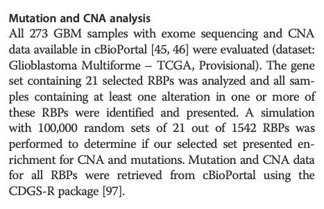

**Author(s)**: `r params$author`  
**Reviewer(s)**: `r params$reviewer`  
**Date**: `r Sys.Date()`  


# Academic Citation
If you use this code in your work or research, we kindly request that you cite our publication:

Xiaofan Lu, et al. (2025). FigureYa: A Standardized Visualization Framework for Enhancing Biomedical Data Interpretation and Research Efficiency. iMetaMed. https://doi.org/10.1002/imm3.70005

```{r setup, include=FALSE}
knitr::opts_chunk$set(echo = TRUE)
```

# 需求描述
# Requirement

作者前面找到两个cohort共有的58个差异表达RBPs，其中21个过表达跟预后差有关。
那么，这21个RBPs是不是随机也能出现？有统计学意义吗？
The authors previously identified 58 differentially expressed RBPs shared by two cohorts, 21 of which were overexpressed and associated with poor prognosis.
Could these 21 RBPs have appeared randomly? Are they statistically significant?

重复文章中的这段方法，提供一个统计学上的结果，支持说他选择的基因集有生物学意义。
Repeat the method in the article and provide statistical results to support the biological significance of the gene set they selected.



出自<https://link.springer.com/article/10.1186%2Fs13059-016-0990-4>
From <https://link.springer.com/article/10.1186%2Fs13059-016-0990-4>

# 应用场景
# Application Scenario

通过（蒙特卡洛）随机模拟计算观测事件发生的经验性概率。
Calculate the empirical probability of an observed event through (Monte Carlo) random simulation.

该方法可以从统计学角度帮助判断观测事件是否为小概率事件。
This method can help determine whether an observed event is a low-probability event from a statistical perspective.

# 环境设置
# Environment Setup

```{r}
source("install_dependencies.R")

library(cgdsr)
Sys.setenv(LANGUAGE = "en") #显示英文报错信息 # Display English error messages
options(stringsAsFactors = FALSE) #禁止chr转成factor # Disable conversion of chr to factor
```

# 输入文件
# Input File

## Get RBP genes

get rbp gene list from `Gerstberger S, Hafner M, Tuschl T. A census of human RNA-binding proteins. Nat Rev Genet. 2014;15:829–45.` <https://www.nature.com/articles/nrg3813/#supplementary-information>

```{r rbp_list}
rbplist <- readxl::read_excel(path = "nrg3813-s3.xls", sheet = 2)
```

## Use CGDS-R to get Genetic Data (mutation and CNA)

原文用CGDS-R包从cBioPortal下载数据，我们重复原文，体验一下CGDS-R包的用法。
The original article used the CGDS-R package to download data from cBioPortal. We will repeat the original article to experience the use of the CGDS-R package.

```{r cgdsr_usage, eval=FALSE}
# Create CGDS object
mycgds <- CGDS("https://www.cbioportal.org/")
test(mycgds)

# Get list of cancer studies at server
lcs <- getCancerStudies(mycgds)
View(lcs) #查看表格，找到你要的癌症，记下cancer_study_id，这里选gbm_tcga
# View the table, find the cancer you want, and note the cancer_study_id. Here, select gbm_tcga
# cancer_study_id: gbm_tcga
mycancerstudy = "gbm_tcga"

cl <- getCaseLists(mycgds, mycancerstudy)
View(cl) #查看表格，找到你要的数据类型，记下case_list_id，这里选gbm_tcga_cnaseq
# View the table, find the type of cancer you want, and note the case_list_id. Here, select 
# case_list_id: gbm_tcga_cnaseq. Samples with mutation and CNA data (273 samples)
mycaselist <- "gbm_tcga_cnaseq"

# Get available genetic profiles
gp <- getGeneticProfiles(mycgds, mycancerstudy)
mygeneticprofile1 <- "gbm_tcga_gistic"
mygeneticprofile2 <- "gbm_tcga_mutations"
mygeneticprofile3 <- "gbm_tcga_linear_CNA"

# Get data slices for a specified list of genes, genetic profile and case list
# 下载1542个基因有点多，我们拆成500个/次，然后用cbind合并
# Downloading 1542 genes is a bit too much, so we split it into 500 slices and merge them using cbind
gistic <- cbind(getProfileData(mycgds, rbplist$`gene name`[1:500], mygeneticprofile1, mycaselist),
                getProfileData(mycgds, rbplist$`gene name`[501:1000], mygeneticprofile1, mycaselist),
                getProfileData(mycgds, rbplist$`gene name`[1001:1542], mygeneticprofile1, mycaselist))

mutation <- cbind(getProfileData(mycgds, rbplist$`gene name`[1:500], mygeneticprofile2, mycaselist),
                  getProfileData(mycgds, rbplist$`gene name`[501:1000], mygeneticprofile2, mycaselist),
                  getProfileData(mycgds, rbplist$`gene name`[1001:1542], mygeneticprofile2, mycaselist))

cna <- cbind(getProfileData(mycgds, rbplist$`gene name`[1:500], mygeneticprofile3, mycaselist),
             getProfileData(mycgds, rbplist$`gene name`[501:1000], mygeneticprofile3, mycaselist),
             getProfileData(mycgds, rbplist$`gene name`[1001:1542], mygeneticprofile3, mycaselist))

identical(dimnames(gistic), dimnames(cna))
identical(dimnames(gistic), dimnames(mutation))
#save(gistic, mutation, file = "alteration_data.Rdata")

# Get clinical data for the case list
# myclinicaldata = getClinicalData(mycgds,mycaselist)

# documentation
# help('cgdsr')
# help('CGDS')
```

## The 21 RBPs list

作者前面找到两个cohort共有的58个差异表达RBPs，其中21个过表达跟预后差有关。接下来对这21个基因做统计检验。
The authors previously identified 58 differentially expressed RBPs shared by the two cohorts, of which 21 were overexpressed and associated with poor prognosis. Next, we performed statistical tests on these 21 genes.

Copy from Table 1 `Correa et al. Genome Biology (2016) 17:125 DOI 10.1186/s13059-016-0990-4`

```{r rbp21}
rbp21 <- strsplit("AIMP2 ALYREF CALR EXO1 ISG20 MAGOH MAGOHB MRPS12 MRPS33 NIP7 NXT1 OAS3 PPIH RBMS1 RNASEH2A RNASET2 RUVBL1 SNRPB SNRPG YBX3 XRN2", split = " ")[[1]]
```

# 评价
# Evaluate

## Do simulation

```{r simulation}
(load("alteration_data.Rdata"))
mutation_binary <- 0+!(mutation == "NaN" | is.na(mutation))
gistic_binary <- 0+(abs(gistic) == 2)

rbpall <- colnames(mutation)
# repeat 100,000 times
simulations <- rep(0, 1e5)
set.seed(666)
for(i in 1:1e5){
  sim_genes <- sample(rbpall, size = length(rbp21), replace = F)
  countAlteration_bysample <- sum((rowSums(mutation_binary[,sim_genes], na.rm = T) +
                                  rowSums(gistic_binary[,sim_genes], na.rm = T)) > 0)
  simulations[i] <- countAlteration_bysample
}
```

## Plot empirical probability distribution

```{r}
hist(simulations, breaks = 100)

sim_genes <- rbp21
countAlteration_bysample <- sum((rowSums(mutation_binary[,sim_genes], na.rm = T) +
                                  rowSums(gistic_binary[,sim_genes], na.rm = T)) > 0)
abline(v = countAlteration_bysample, col = 'red')
```

## Calculate Probability

the probability of less alterations occuring in the 21-RBPs than those in randomly selected 21 RBPs

```{r calc_p}
p <- sum(countAlteration_bysample > simulations)/length(simulations)
p 
```

# 结论：
# Conclusion:

- 大于0.05不是小概率事件，所以接受零假设。
- 选的21个跟随机选取21基因没有统计学差异。
- A probability greater than 0.05 is not a small probability event, so the null hypothesis is accepted.
- There is no statistical difference between the 21 selected genes and the randomly selected 21 genes.

# Session Info

```{r}
sessionInfo()
```