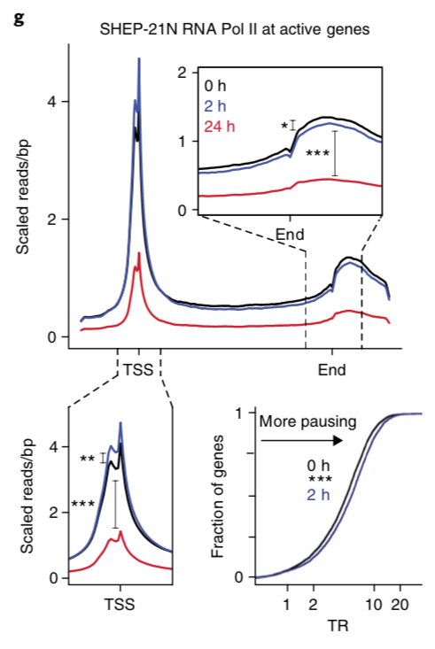

**Author(s)**: `r params$author`  
**Reviewer(s)**: `r params$reviewer`  
**Date**: `r Sys.Date()`  

# Academic Citation
If you use this code in your work or research, we kindly request that you cite our publication:

Xiaofan Lu, et al. (2025). FigureYa: A Standardized Visualization Framework for Enhancing Biomedical Data Interpretation and Research Efficiency. iMetaMed. https://doi.org/10.1002/imm3.70005

```{r setup, include = FALSE}
knitr::opts_chunk$set(echo = TRUE)
```

# 需求描述
# Requirement

计算ChIP-seq样本间的p-value。
Calculate p-values between ChIP-seq samples.



出自<https://www.nature.com/articles/s41588-018-0044-9>
From <https://www.nature.com/articles/s41588-018-0044-9>

Fig. 1 | Deregulated MYCN binds active chromatin and amplifies transcription in neuroblastoma.

g, RNA Pol II meta-gene across **all active genes upon MYCN shutdown**. The regions encompassing the TSS and gene body are enlarged, and significance is indicated. Bottom right, distribution plots of RNA Pol II traveling ratio (TR) for all active genes. Differences in the TR distributions at 0 and 2 h are significant (Welch’s two-tailed t test): ***P < 1 × 10−9, **P < 1 × 10−6, *P < 1 × 10–3. 

# 应用场景
# Application Scenarios

用于判断全基因组范围的结合是否有global change，适用于校正过的ChIP-seq数据。
Used to determine whether there is a global change in genome-wide binding. Applicable to corrected ChIP-seq data.

- 加spike-in的定量ChIP-seq，例如这篇用到的ChIP-RX<https://mp.weixin.qq.com/s/tY-MunnBeFQ9A4_Svswu0g>
- 校正过的普通ChIP-seq，校正方法看这篇<https://www.notion.so/Paper-191102-ChIPseqSpikeInFree-8e225f58252144d0b1a0a15f99020b66>
- Quantitative ChIP-seq with spike-in, such as the ChIP-RX used in this article <https://mp.weixin.qq.com/s/tY-MunnBeFQ9A4_Svswu0g>
- Standard ChIP-seq with calibration. For calibration methods, see this article <https://www.notion.so/Paper-191102-ChIPseqSpikeInFree-8e225f58252144d0b1a0a15f99020b66>

# 环境设置
# Environment Setup

根据自己的系统选择下载链接
Select the download link based on your operating system.

```{r, eval = FALSE}
## macOSX
download.file("http://hgdownload.soe.ucsc.edu/admin/exe/macOSX.x86_64/bigWigSummary", "bigWigSummary")
download.file("http://hgdownload.soe.ucsc.edu/admin/exe/macOSX.x86_64/bigWigInfo", "bigWigInfo")
download.file("http://hgdownload.soe.ucsc.edu/admin/exe/macOSX.x86_64/bedGraphToBigWig", "bedGraphToBigWig")

## linux x86_64
#download.file("http://hgdownload.soe.ucsc.edu/admin/exe/linux.x86_64/bigWigSummary", "bigWigSummary")
#download.file("http://hgdownload.soe.ucsc.edu/admin/exe/linux.x86_64/bigWigInfo", "bigWigInfo")
#download.file("http://hgdownload.soe.ucsc.edu/admin/exe/linux.x86_64/bedGraphToBigWig", "bedGraphToBigWig")

## linux x86_64 v369
#download.file("http://hgdownload.soe.ucsc.edu/admin/exe/linux.x86_64.v369/bigWigSummary", "bigWigSummary")
#download.file("http://hgdownload.soe.ucsc.edu/admin/exe/linux.x86_64.v369/bigWigInfo", "bigWigInfo")
#download.file("http://hgdownload.soe.ucsc.edu/admin/exe/linux.x86_64.v369/bedGraphToBigWig", "bedGraphToBigWig")

Sys.chmod(c("bigWigSummary", "bigWigInfo", "bedGraphToBigWig"), 755)
```

加载自定义函数
Load custom functions

```{r}
# load signal capture methods
source("./corelib.R")

source("install_dependencies.R")
Sys.setenv(LANGUAGE = "en") #显示英文报错信息 # Display English error messages
options(stringsAsFactors = FALSE) #禁止chr转成factor # Disable conversion of chr to factors
```

参数设置
Parameter settings

```{r}
test_region_length = 50
outputName <- "siteProTest_example.pdf"

bedFile <- c("refGene_hg19_TSS.bed") 
bigWigFiles <- c("GSM2113508_SHEP21_0HR_POL2_CHIP_RX.chiprx.scaled.bedgraph.bw", 
                 "GSM2113516_SHEP21_2HR_POL2_CHIP_RX.chiprx.scaled.bedgraph.bw",
                 "GSM2113512_SHEP21_24HR_POL2_CHIP_RX.chiprx.scaled.bedgraph.bw")
labels <- c("0hr", "2hr", "24hr") # same length as bigWigFiles
normalization_constant <- c(0, 0, 0) # 0 means use Fold for nromalization constant, same length as bigWigFiles
colors <- c("black", "navy", "red")

resolution <- 50 #分辨率，数值越低，画出来的曲线越平滑，运行时间越长 # Resolution. Lower values result in smoother curves but longer runtimes.
span <- 1000 #上下游展示范围，需要是resolution的整数倍 # Upstream and downstream display range, must be an integer multiple of resolution.
coreNumber <- 3 #留出一个核用来干别的事情 # Reserve one core for other tasks.
captureMethod = "security"
```

# 输入文件的准备
# Prepare input files

需要bw文件和bed文件。
You need a BW file and a BED file.

bedgraph和bw文件，可直接下载bw文件，跳过下载和转bw，直接进入“准备bed文件”。
The BED graph and BW files. You can directly download the BW file, skip the download and BW conversion, and proceed directly to "Prepare BED Files."

## 下载bedgraph文件
## Download the bedgraph file

原文提供了bedgraph文件，下载后先转成bw文件
The original article provides a bedgraph file. After downloading, convert it to a bw file.

在原文中搜`GSE`，搜到`GSE80154`，进入页面<https://www.ncbi.nlm.nih.gov/geo/query/acc.cgi?acc=GSE80154>，拉到底，在Supplementary file里点击custom，勾选3个时间点SHEP21的PolII ChIP-RX数据bedgraph文件，点击Download下载
Search for `GSE` in the original article until you find `GSE80154`. Go to the page <https://www.ncbi.nlm.nih.gov/geo/query/acc.cgi?acc=GSE80154>, scroll to the bottom, click Custom in the Supplementary Files section, select the bedgraph file for the PolII ChIP-RX data from SHEP21 at three time points, and click Download.

## bedgraph转bw
## Convert bedgraph to bw

```bash
# 下载hg19的染色体长度的文件
# Download the hg19 chromosome size file
#wget http://hgdownload.cse.ucsc.edu/goldenPath/hg19/bigZips/hg19.chrom.sizes
for file in *.bedgraph; do ./wigToBigWig $file hg19.chrom.sizes $file.bw; done
```

## 准备bed文件
## Prepare the bed file

原文用的是all active genes upon MYCN shutdown，没有提供基因名，这里就以所有基因的TSS为例。
The original article uses the "all active genes upon MYCN shutdown" model, without providing gene names. Here, we use the TSSs of all genes as an example.

如果做转录终止位点的统计检验，就把bed文件换成转录终止位点。
If performing a statistical test on transcription termination sites, replace the bed file with the "transcription termination site" model.

下载自<https://raw.githubusercontent.com/Shicheng-Guo/AnnotationDatabase/master/hg19/refGene_hg19_TSS.bed>
Downloaded from <https://raw.githubusercontent.com/Shicheng-Guo/AnnotationDatabase/master/hg19/refGene_hg19_TSS.bed>

```{r}
# load bed file
bed <- read.table(bedFile)
```

# 统计检验
# Statistical test

```{r}
test_region_signal <- c()
for(i in 1:length(bigWigFiles)){
  # caputre signal
  # test region
  seqname <- bed[, 1]
  midpoints <- as.integer((bed[, 2] + bed[, 3] - 1) / 2)
  test_region <- data.frame(seqname = seqname, start = as.integer(midpoints - test_region_length/2), end = as.integer(midpoints + test_region_length/2))
  capture_signal <- average_signal_caputer_around_region(bigWigFiles[i], test_region, captureMethod = captureMethod, cores = as.integer(coreNumber))

  if(normalization_constant[i] == 0) {
    normalization_constant[i] <- as.numeric(system(paste("./bigWigInfo", bigWigFiles[i] , "| grep mean | cut -d ' ' -f 2"), intern = T))
  }
  capture_signal <- capture_signal / normalization_constant[i]
  test_region_signal <- rbind(test_region_signal, t(capture_signal))
}

# 0h跟2h比
# 0h compared to 2h
ttest <- t.test(x=test_region_signal[1,],
                y=test_region_signal[2,],
                alternative="two.sided",paired=T)
ttest
ttest$p.value

# 2h跟24h比
# Comparison of 2 hours and 24 hours
ttest <- t.test(x=test_region_signal[2,],
                y=test_region_signal[3,],
                alternative="two.sided",paired=T)
ttest
ttest$p.value
```

# Capture signal

提取信号画图的方法跟FigureYa44profile一样，这里以TSS为例画图，供参考。
The method for extracting the signal and plotting it is the same as FigureYa44profile. Here, we use TSS as an example for reference.

```{r}
isNormalChrosome <- !grepl("_", bed$V1)
bed <- bed[isNormalChrosome, ]  

average_signal <- c()
for(i in 1:length(bigWigFiles)){
  # caputre signal
  capture_signal <- signal_caputer_around_sites(bigWigFiles[i], bed, resolution = resolution, span = span, captureMethod = captureMethod, cores = as.integer(coreNumber))
  if(normalization_constant[i] == 0) {
    normalization_constant[i] <- as.numeric(system(paste("./bigWigInfo", bigWigFiles[i], "| grep mean | cut -d ' ' -f 2"), intern = T))
    }
  capture_signal <- capture_signal / normalization_constant[i]
  average_signal <- rbind(average_signal, capture_signal)
}

#这步比较耗时，我们把抽取的信号保存到`site_average_signal.csv`文件里。
#This step is time-consuming. We save the extracted signal to the `site_average_signal.csv` file.
write.table(average_signal, "average_signal.txt", quote = F, row.names = F, col.names = F)
```

画图
Draw a picture

```{r}
# 读入前面获得的signal
# Read the signal obtained previously
average_signal <- read.table("average_signal.txt", header = F)

minimum <- min(average_signal) - (max(average_signal) - min(average_signal)) * 0.1
maximum <- max(average_signal) + (max(average_signal) - min(average_signal)) * 0.1 * length(bigWigFiles)

datapoints <- span / resolution

pdf(outputName, width = 4, height = 6)
plot(1:(datapoints*2 + 1), average_signal[1, ], 
     type = "l", lwd = 3, col = colors[1], 
     xaxs = "i", yaxs = "i", xaxt = "n", 
     xlab = "", ylab = "Scaled reads/bp", 
     ylim = c(minimum, maximum))

for(i in 2:length(bigWigFiles)){
  lines(1:(datapoints*2 + 1), average_signal[i, ], col = colors[i], lwd = 3)
}

legend("topright", col = colors, legend = labels, lty = 1, lwd = 3, bty = "n")

axis(side = 1, at = datapoints, "TSS")

dev.off()
```


# 后期处理
# Post-processing

输出的pdf文件是矢量图，可以用illustrator等软件打开编辑，添加星号\*和线段。
The output PDF file is a vector image, which can be opened and edited with software such as illustrator to add asterisks and line segments.

# Session Info

```{r}
sessionInfo()
```