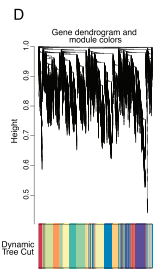

**Author(s)**: `r params$author`  
**Date**: `r Sys.Date()`  

# Academic Citation
If you use this code in your work or research, we kindly request that you cite our publication:

Xiaofan Lu, et al. (2025). FigureYa: A Standardized Visualization Framework for Enhancing Biomedical Data Interpretation and Research Efficiency. iMetaMed. https://doi.org/10.1002/imm3.70005

```{r setup, include=FALSE}
knitr::opts_chunk$set(echo = TRUE)
```

# 需求描述
# Requirement description

用R代码画出paper里的WGCNA结果图、输出每个模块的基因表达谱，用于进一步绘制heatmap、功能富集分析、或拟合表达谱曲线。

Use the R code to draw the WGCNA result map in the paper, output the gene expression profile of each module for further drawing the heatmap, functional enrichment analysis, or fitting the expression profile curve.



出自<https://www.cell.com/cell/abstract/S0092-8674(18)30511-7>

from<https://www.cell.com/cell/abstract/S0092-8674(18)30511-7>

# 应用场景
# Application scenario

不需要筛差异表达基因，直接从全基因组找表达谱相似的gene组成的gene module（模块）。尤其适合样本量超过15的高通量测序数据。

用于研究表型的差异是由哪些gene决定的，例如找出决定不同发育阶段、疾病亚型、药物处理反应的关键基因module，进而鉴定新的biomarkers或治疗靶标。

Instead of screening differentially expressed genes, the gene module is composed of genes with similar expression profiles from the whole genome. It is especially suitable for high-throughput sequencing data with a sample size of more than 15.

It is used to study which genes determine differences in phenotypes, for example, to identify key gene modules that determine responses to different developmental stages, disease subtypes, and drug treatments, and thus to identify new biomarkers or therapeutic targets.

# 环境设置
# Environment setting

```{r}
source("install_dependencies.R")
```


load package

```{r}
library(WGCNA)

Sys.setenv(LANGUAGE = "en") #显示英文报错信息 display English error messages
options(stringsAsFactors = FALSE) #禁止chr转成factor prohibit the conversion of chr to factor
```

# 输入数据的预处理
# Preprocessing of input data

输入数据是12219个TPM > 1的基因在20个sample里的TPM。包括5种细胞、2种处理、2次重复。

数据来源：<https://www.cell.com/cms/attachment/2119342979/2092476184/mmc2.xlsx>

Input data are the TPM of 12219 genes with TPM > 1 in 20 samples, including 5 cells, 2 treatments, and 2 replicates.

Data source: <https://www.cell.com/cms/attachment/2119342979/2092476184/mmc2.xlsx>

```{r}
mydata <- read.csv("easy_input_exp.csv",row.names = 1)
dim(mydata)
#此处用head(mydata)看出行名是基因名，第1列至第20列是基因在20个sample里的表达量
#Here head(mydata) is used to see that the row name is the gene name, and columns 1 through 20 are the expression of the gene in the 20 samples
head(mydata)
#如果你的sample比较多，几十上百个的，推荐用fix函数来查看，MAC系统可能要另外安装XQuartz。运行下面这行来代替head(mydata)
#If you have more samples, dozens or hundreds of them, it is recommended to use the fix function to view them, MAC systems may have to install XQuartz separately. run the following line instead of head(mydata)
#fix(mydata)
```

转置，也就是行变成列，列变成行

Transpose, that is, rows into columns and columns into rows

```{r}
datExpr0 = data.frame(t(mydata))
colnames(datExpr0) <- rownames(mydata)
rownames(datExpr0) <- colnames(mydata)
```

这套数据的作者用的是TPM > 1的所有基因，如果你也想这样做，就先运行下面这行代码，跳过“筛选方差前25%的基因”，直接进入下一部分。

The author of this data set used all genes with TPM > 1. If you want to do the same, run the following line of code first, skip the “filter for genes in the top 25% of variance”, and go directly to the next section.

```{r, eval=FALSE}
datExpr1<-datExpr0
```

## 筛选方差前25%的基因
## Filter for genes in the top 25% of variance

输入数据的作者选取的是TPM>1的基因作为WGCNA的输入。基因数量较多，对电脑要求高。为了便于大家在自己的电脑上操作本套代码，此处挑选了变化较大的前25%的基因。

用前25%的基因会比用全部基因找出来的module数量少。

The author of the input data selected genes with TPM>1 as input for WGCNA. The number of genes is large and demanding on the computer. To make it easier for people to manipulate this code set on their own computers, the top 25% of genes with large variations are selected here.

Using the top 25% of the genes will find a smaller number of modules than using all the genes.

```{r}
m.vars=apply(datExpr0,2,var)
expro.upper=datExpr0[,which(m.vars>quantile(m.vars, probs = seq(0, 1, 0.25))[4])]
datExpr1<-data.matrix(expro.upper)
```

## 判断是否有不好的sample或gene
## Determine if there is a bad sample or gene

先检查是否有哪个sample或基因表达量缺失，定义成不好的sample或gene

First check if any sample or gene expression is missing, define it as a bad sample or gene

```{r,warning=FALSE,message=FALSE}
gsg = goodSamplesGenes(datExpr1, verbose = 3);
gsg$allOK
```

如果这里返回的结果是`TRUE`，说明所有基因都通过了检查。

如果你用全部基因作为输入，很有可能返回`FALSE`，说明存在不好的基因或sample。

下面的代码就会去除那些不好的基因或sample。

If the result returned here is `TRUE`, it means that all genes passed the check.

If you use all the genes as input, it is likely to return `FALSE`, indicating the presence of bad genes or samples.

The code below removes those bad genes or samples.

## 去除不好的sample或gene
## Remove bad sample or gene

```{r}
if (!gsg$allOK){
  # 可选择打印被删除的基因和样本名称：
  # Optionally, print the gene and sample names that were removed:
  if (sum(!gsg$goodGenes)>0) 
     printFlush(paste("Removing genes:", paste(names(datExpr0)[!gsg$goodGenes], collapse = ", ")));
  if (sum(!gsg$goodSamples)>0) 
     printFlush(paste("Removing samples:", paste(rownames(datExpr1)[!gsg$goodSamples], collapse = ", ")));
  # 从数据中删除违规基因和样本：
  # Remove the offending genes and samples from the data:
  datExpr1 = datExpr1[gsg$goodSamples, gsg$goodGenes]
}
```

## 判断是否有离群样本
## Determine if there are outlier samples

通过聚类分析，能看出是否有个别sample跟多数sample的距离较远，决定是否需要去除离群样本。

Cluster analysis shows whether any individual samples are distant from the majority of samples and determines whether outlier samples need to be removed.

```{r,fig.width=10, fig.height=5}
sampleTree = hclust(dist(datExpr1), method = "average")
par(cex = 0.7);
par(mar = c(0,4,2,0))
plot(sampleTree, main = "Sample clustering to detect outliers", sub="", xlab="", cex.lab = 1.5,
     cex.axis = 1.5, cex.main = 2)
```

这套数据没有离群样本，不需要去除。

如果你的数据有离群样本需要去除，就运行下面这段代码。

This data set has no outlier samples to remove.

If your data has outlier samples that need to be removed, run this code below.

## 去除离群样本
## Remove outlier samples

例如：以35000作为cutoff，就会去除最左边的4四个sample，只剩下16个sample。

For example, using 35000 as the cutoff would remove the leftmost 4 four samples, leaving only 16 samples.

```{r,fig.width=10,fig.height=5}
plot(sampleTree, main = "Sample clustering to detect outliers", sub="", xlab="", cex.lab = 1.5, cex.axis = 1.5, cex.main = 2) +
#想用哪里切，就把“h = 35000”和“cutHeight = 35000”中的“500”换成你的cutoff
#Replace the “500” in “h = 35000” and “cutHeight = 35000” with your cutoff wherever you want to cut.
abline(h = 35000, col = "red") 
clust = cutreeStatic(sampleTree, cutHeight = 35000, minSize = 10)
keepSamples = (clust==1)
datExpr = datExpr1[keepSamples, ]
nGenes = ncol(datExpr)
nSamples = nrow(datExpr)
dim(datExpr)
```

这套输入数据不需要去除离群样本，因此，跳过“去除离群样本”。

运行下面的代码，用全部20个样本进行后续的分析：

This set of input data does not require removal of outlier samples, so “remove outlier samples” is skipped.

Run the code below with all 20 samples for subsequent analysis:

```{r, fig.width=10, fig.height=6}
datExpr = as.data.frame(datExpr1)
nGenes = ncol(datExpr)
nSamples = nrow(datExpr)
```

# 找gene module
# Find the gene module

WGCNA分析的关键是找gene module。先选择合适的阈值，通过构建网络找gene module，找出来的gene module可信度如何？要做Preservation，去除not preserved module。这样找出的共表达的gene module就可以用于下一步分析了。

The key to WGCNA analysis is to find the gene module, first choose the appropriate threshold, and then build a network to find the gene module, how reliable is the found gene module? To do preservation, remove the not preserved module, so that the coexpressed gene module can be used for the next step of analysis.

## 选择构建网络的合适阈值
## Select a suitable threshold for constructing the network

通过这步计算，找出scale free topology modle fit接近0.9的最小power（soft threshold），用于下一步构建网络。

This step is used to find out the minimum power (soft threshold) of scale free topology modle fit close to 0.9, which is used to construct the network in the next step.

```{r, warning=FALSE, message=FALSE}
powers = c(c(1:10), seq(from = 12, to=20, by=2))

sft = pickSoftThreshold(datExpr, powerVector = powers, verbose = 5)

pdf("1Threshold.pdf",width = 10, height = 5)
par(mfrow = c(1,2))
cex1 = 0.9
plot(sft$fitIndices[,1], -sign(sft$fitIndices[,3])*sft$fitIndices[,2],
     xlab="Soft Threshold (power)",ylab="Scale Free Topology Model Fit,signed R^2",type="n",
     main = paste("Scale independence")) +
text(sft$fitIndices[,1], -sign(sft$fitIndices[,3])*sft$fitIndices[,2],
     labels=powers,cex=cex1,col="red")+
abline(h=0.90,col="red")

plot(sft$fitIndices[,1], sft$fitIndices[,5],
     xlab="Soft Threshold (power)",ylab="Mean Connectivity", type="n",
     main = paste("Mean connectivity")) +
text(sft$fitIndices[,1], sft$fitIndices[,5], labels=powers, cex=cex1,col="red")
dev.off()
```


从上面的结果可以看出，从14开始进入“平台期”。因此，我们把下面代码里的`power`设置为`power = 14`

As you can see from the results above, the “plateau” starts at 14. Therefore, we set the `power` in the following code to `power = 14`.

## 构建网络，找出gene module
## Build a network to find the gene module

```{r}
net = blockwiseModules(datExpr, power = 14,
                       TOMType = "unsigned", minModuleSize = 30,
                       reassignThreshold = 0, mergeCutHeight = 0.25,
                       numericLabels = TRUE, pamRespectsDendro = FALSE,
                       saveTOMs = TRUE,
                       #saveTOMFileBase = "MyTOM",
                       verbose = 3)

table(net$colors)
```

一共找出12个module，第二行分别对应每个module内的基因个数。

A total of 12 modules were identified, and the second row corresponds to the number of genes within each module, respectively.

## gene module的可视化
## Visualization of gene module

```{r}
mergedColors = labels2colors(net$colors)

pdf("2module.pdf",width = 10, height = 5)
plotDendroAndColors(net$dendrograms[[1]], mergedColors[net$blockGenes[[1]]], "Module colors",
                    dendroLabels = FALSE, hang = 0.03,
                    addGuide = TRUE, guideHang = 0.05)
dev.off()
moduleLabels = net$colors
moduleColors = labels2colors(net$colors)
MEs = net$MEs;
geneTree = net$dendrograms[[1]]
```


## 把gene module输出到文件
## Output the gene module to a file

```{r}
text <- unique(moduleColors)
for (i  in 1:length(text)) {
  y=t(assign(paste(text[i],"expr",sep = "."),datExpr[moduleColors==text[i]]))
  write.csv(y,paste(text[i],"csv",sep = "."),quote = F)
}
```

# gene module的深入分析
# In-depth analysis of gene module

## 表型与模块的相关性
## Correlation of phenotypes with modules

通过计算表型与module的相关性，找出相关性高的gene module，推测可能是因为它们造成了表型差异。

By calculating the correlation between phenotypes and modules, gene modules with high correlation were identified, and it was hypothesized that they might be responsible for the phenotypic differences.

```{r}
samples=read.csv('Sam_info.txt',sep = '\t',row.names = 1)

moduleLabelsAutomatic = net$colors
moduleColorsAutomatic = labels2colors(moduleLabelsAutomatic)
moduleColorsWW = moduleColorsAutomatic
MEs0 = moduleEigengenes(datExpr, moduleColorsWW)$eigengenes
MEsWW = orderMEs(MEs0)
modTraitCor = cor(MEsWW, samples, use = "p")
colnames(MEsWW)
modlues=MEsWW

modTraitP = corPvalueStudent(modTraitCor, nSamples)
textMatrix = paste(signif(modTraitCor, 2), "\n(", signif(modTraitP, 1), ")", sep = "")
dim(textMatrix) = dim(modTraitCor)
```

展示全部module跟表型之间的相关性

Show correlation between all modules and phenotypes

```{r}
pdf("3Module-trait.pdf",width = 6, height = 6)
labeledHeatmap(Matrix = modTraitCor, xLabels = colnames(samples), yLabels = names(MEsWW), cex.lab = 0.5,  yColorWidth=0.01, 
               xColorWidth = 0.03,
               ySymbols = colnames(modlues), colorLabels = FALSE, colors = blueWhiteRed(50), 
               textMatrix = textMatrix, setStdMargins = FALSE, cex.text = 0.5, zlim = c(-1,1)
               , main = paste("Module-trait relationships"))
dev.off()
```


此处green的gene module与PWK_notx和PWK_KLA的相关性高，推测green module里的基因可能对PWK组的贡献较大。

Here the gene module of green has a high correlation with PWK_notx and PWK_KLA, and it is hypothesized that the genes in the green module may contribute more to the PWK group.

```{r}
sessionInfo()
```