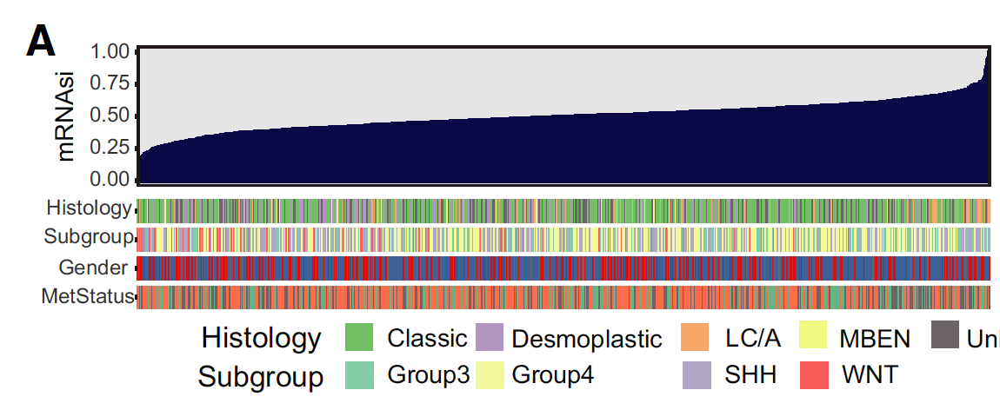
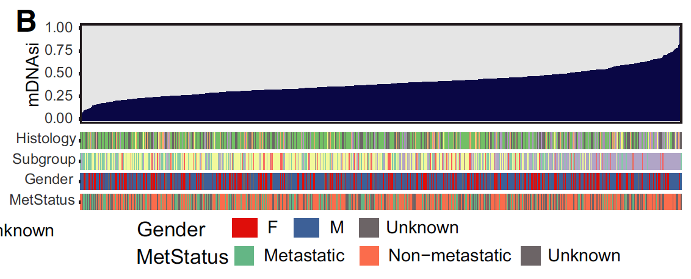

**Author(s)**: `r params$author`  
**Reviewer(s)**: `r params$reviewer`  
**Date**: `r Sys.Date()`  


# Academic Citation
If you use this code in your work or research, we kindly request that you cite our publication:

Xiaofan Lu, et al. (2025). FigureYa: A Standardized Visualization Framework for Enhancing Biomedical Data Interpretation and Research Efficiency. iMetaMed. https://doi.org/10.1002/imm3.70005

```{r setup, include=FALSE}
knitr::opts_chunk$set(echo = TRUE)
```

# 需求描述
# Requirement Description

用GEO数据计算mRNAsi、mDNAsi，画图。
Calculate mRNAsi and mDNAsi using GEO data and plot them.





出自<https://febs.onlinelibrary.wiley.com/doi/abs/10.1002/1878-0261.12557>
Retrieved from <https://febs.onlinelibrary.wiley.com/doi/abs/10.1002/1878-0261.12557>

Fig. 1. Clinical and molecular features associated with the mRNA expression-based stemness index (mRNAsi) and the mDNAsi in MB. (A) An overview of the association between known clinical and molecular features (histology, subgroup, gender, and metastatic status) and mRNAsi in MB. Columns represent samples sorted by mRNAsi from low to high (top row). Rows represent known clinical and molecular features. (B) An overview of the association between known clinical and molecular features (histology, subgroup, gender, and metastatic status) and mDNAsi in MB. Columns represent samples sorted by mDNAsi from low to high (top row). Rows represent known clinical and molecular features.

The work flow to generate the stemness indices (mRNAsi and mDNAsi) is available on <https://bioinformaticsfmrp.github.io/PanCanStem_Web/>. 或<http://tcgabiolinks.fmrp.usp.br/PanCanStem/>

# 应用场景
# Application Scenarios

用于计算肿瘤基因表达以及DNA甲基化的干性指数，跟临床信息一起展示。
This tool is used to calculate stemness indices for tumor gene expression and DNA methylation, and presents them alongside clinical information.

另外，Fig. 6的分析画图可参考FigureYa131CMap。其余可参考文章作者分享的代码：<https://github.com/richie2019/MBpanel>
For the analysis plots in Figure 6, please refer to FigureYa131CMap. For other code, please refer to the article author's shared code: <https://github.com/richie2019/MBpanel>

# 环境设置
# Environment Setup

```{r}
source("install_dependencies.R")
library(GEOquery)
library(dplyr)
library(limma)
library(ComplexHeatmap)
library(RColorBrewer)
library(clusterProfiler)
library(tibble)
library(ggplot2)
library(cowplot)
Sys.setenv(LANGUAGE = "en") #显示英文报错信息 # Display English error message
options(stringsAsFactors = FALSE) #禁止chr转成factor # Disable conversion of chr to factor
```

用到的两个文件：pcbc-stemsig.tsv和pcbc-stemsig.p219.Rda，来自<https://www.cell.com/cell/fulltext/S0092-8674(18)30358-1>，跑自己的数据就用这个作为输入跑就行了。
Two files used: pcbc-stemsig.tsv and pcbc-stemsig.p219.Rda, from <https://www.cell.com/cell/fulltext/S0092-8674(18)30358-1>. Just use this as input to run your own data.

# mRNAsi

## 输入文件
## Input file

需要表达数据GSE85217和临床信息作为输入：
Expression data GSE85217 and clinical information are required as input:

- easyinput_clinicaldata.csv，临床信息。
- easyinput_clinicaldata.csv, clinical information.

```{r}
data_dir <- "GEO_data"  # 创建专门的目录
if (!dir.exists(data_dir)) {
  dir.create(data_dir)
}

gse <- getGEO(GEO = "GSE85217", 
              destdir = data_dir,  # 指定明确的数据目录
              AnnotGPL = FALSE,
              getGPL = TRUE)

if (is.list(gse) && length(gse) > 0) {
  gse <- gse[[1]]  # 取第一个ExpressionSet对象
}

## load clinical data
clic <- read.csv("easyinput_clinicaldata.csv")
names(clic)[1] <- "Sample.ID"
clic$MetStatus <- dplyr::recode(clic$MetStatus, '1'="Metastatic", '0'="Non-metastatic")
```

## 数据预处理
## Data preprocessing

```{r}
# 首先检查gse对象的结构
class(gse)
names(gse)

# 查看gse对象的所有slot
slotNames(gse)

# 根据GEOquery包的新版本，样本信息可能在phenoData中
# 获取样本名称
sample_names <- sampleNames(gse)[1:5]
print(sample_names)

# 获取平台信息
gsmplatforms <- pData(gse)$platform_id
unique(gsmplatforms)

# We have only one platform

## Acquire expression set
# 根据平台ID筛选样本
selected_samples <- pData(gse)$platform_id == 'GPL22286'
expr_data <- exprs(gse)[, selected_samples]

# 获取平台注释信息
GPL_anno <- fData(gse)
head(GPL_anno)

# 使用Entrez ID或其他合适的ID
exprSet <- expr_data
rownames(exprSet) <- GPL_anno$SPOT_ID  # 根据实际的列名调整
exprSet[1:5,1:5]

## Check data distribution
hist(as.matrix(exprSet), main = "MB_mRNA_hist_pre")
boxplot(exprSet, main="MB_mRNA_boxplot_pre")

## check if log2 transformation is needed
ex <- exprSet
qx <- as.numeric(quantile(ex, c(0., 0.25, 0.5, 0.75, 0.99, 1.0), na.rm=T))
LogC <- (qx[5] > 100) ||
  (qx[6]-qx[1] > 50 && qx[2] > 0) ||
  (qx[2] > 0 && qx[2] < 1 && qx[4] > 1 && qx[4] < 2)

if (LogC) { 
  ex[which(ex <= 0)] <- NaN
  exprSet <- log2(ex)
  print("log2 transform finished")
} else {
  print("log2 transform not needed")
}

## background correction and normalization
exprSet_processed <- backgroundCorrect(exprSet, method = "normexp", verbose = F)
exprSet_processed <- normalizeBetweenArrays(exprSet_processed, method="quantile")

## merge with clinical data
# 直接从phenoData中获取样本信息
b <- pData(gse)
b <- b[, c("title", "geo_accession")]
colnames(exprSet_processed) <- b$title[match(colnames(exprSet_processed), b$geo_accession)]
exprSet_processed_back <- exprSet_processed

## Convert IDs
# 确保org.Hs.eg.db包已安装
if (!requireNamespace("org.Hs.eg.db", quietly = TRUE)) {
  BiocManager::install("org.Hs.eg.db")
}
library(org.Hs.eg.db)

idmap <- bitr(geneID = rownames(exprSet_processed), fromType = "ENSEMBL", toType = "SYMBOL", OrgDb="org.Hs.eg.db", drop = TRUE)
exprSet_processed <- as.data.frame(exprSet_processed)
exprSet_processed <- exprSet_processed %>% 
  rownames_to_column(var="ENSEMBL") %>% 
  inner_join(idmap, by="ENSEMBL") %>% 
  dplyr::select(-ENSEMBL) %>% 
  dplyr::select(SYMBOL, everything()) %>%
  dplyr::mutate(rowMean = rowMeans(.[grep("MB_", names(.))], na.rm = TRUE)) %>% 
  dplyr::filter(SYMBOL != "NA") %>% 
  dplyr::arrange(desc(rowMean)) %>% 
  dplyr::distinct(SYMBOL, .keep_all = T) %>% 
  dplyr::select(-rowMean) %>% 
  column_to_rownames(var = "SYMBOL")
exprSet_processed[1:5,1:5]
```

## Calculate RNA stemness

```{r}
fnSig <- "pcbc-stemsig.tsv" 
w <- read.delim(fnSig, header = FALSE, row.names = 1 ) %>% as.matrix() %>% drop()
w[1:10]
#
X <- exprSet_processed %>%
  rownames_to_column(var="gene_id") %>%
  filter( gene_id %in% names(w) ) %>%
  column_to_rownames( "gene_id" ) %>% as.matrix()

# Reduce the signature to the common set of genes.
stopifnot( all( rownames(X) %in% names(w)))
w <- w[ rownames(X) ]
w[1:5]

# Score the Matrix `X` using Spearman correlation. 
s <- apply( X, 2, function(z) {cor( z, w, method="sp", use="complete.obs" )} )
s[1:5]

# Scale the scores to be between 0 and 1
s <- s - min(s)
s <- s / max(s)
s[1:5]

# Then output scores to a file mRNA_StemScore.tsv.
write.table( cbind(s), file="MB_mRNA_StemScore.tsv", sep="\t", quote=FALSE, col.names=FALSE )

ss <- data.frame(Sample.ID = names(s), mRNAsi = s)
input <- clic %>% left_join(ss, by = c("Sample.ID"))
input <- input[order(input$mRNAsi),]
save(input,file = "RNAinput.Rdata")
```

## Visualization

```{r}
load("RNAinput.Rdata")

input <- as.matrix(input)
input[is.na(input)] <- "Unknown"
input <- as.data.frame(input)
input$mRNAsi <- as.numeric(input$mRNAsi)
input$Histology <- factor(input$Histology,levels = c("Classic","Desmoplastic","LCA","MBEN","Unknown"))
input$Subgroup <- factor(input$Subgroup,levels = c("Group3","Group4","SHH","WNT"))
input$Gender <- factor(input$Gender,levels = c("F","M","Unknown"))
input$MetStatus <- factor(input$MetStatus,levels = c("Metastatic","Non-metastatic","Unknown"))
input$index <- 1:nrow(input)

# 画图
# draw
darkred   <- "#F2042C"
blue      <- "#0A0745"
lightgrey <- "#dcddde"
# 自定义主题
# Custom theme
My_Theme1 <- theme_bw() + 
  theme(panel.grid =element_blank()) + 
  theme(panel.border = element_rect(size = 1)) + 
  theme(legend.position="none") +
  theme(axis.title.x=element_blank(),
        axis.title.y=element_text(size = 12,angle = 90),
        axis.text.x = element_blank(),
        axis.ticks.x = element_blank()
        )+
    theme(plot.margin = margin(0,0.1,0,0.1, "cm"))
    
My_Theme2 = theme_minimal()+
  theme(legend.position="none") +
  theme(axis.title.x=element_blank(),
        axis.title.y=element_text(size = 12,angle = 0),
        axis.text = element_blank(),
        axis.ticks = element_blank())+
  theme (panel.grid.major = element_blank(), panel.grid.minor = element_blank())+
  theme(plot.margin = margin(0,0.1,0,0.1, "cm"))

p1 <- ggplot(input, aes(index, mRNAsi))+
  geom_bar(stat="identity",col = blue)+
  My_Theme1 +
  labs(y = "mRNAsi") +
  scale_x_continuous(expand = c(0,0)) #不留空 #Do not leave blank

p2 <- ggplot(input,aes(index,1))+
  geom_tile(aes(fill = Histology))+
  My_Theme2+
  labs(y = "Histology")+
  scale_fill_manual(values = c("#74C065","#B096C2","#FAA96C","#EFF882","#6D6466")) +
  scale_x_continuous(expand = c(0,0)) #不留空 #Do not leave blank

p3 <- ggplot(input,aes(index,1))+
  geom_tile(aes(fill = Subgroup))+
  My_Theme2+
  labs(y = "Subgroup")+
  scale_fill_manual(values = c("#84CBA8","#F2FA9C","#B1A5C8","#FA5E5C")) +
  scale_x_continuous(expand = c(0,0)) #不留空 #Do not leave blank

p4 <- ggplot(input,aes(index,1))+
  geom_tile(aes(fill = Gender))+
  My_Theme2+
  labs(y = "Gender")+
  scale_fill_manual(values=c("#E00F0A","#3D6197","#6D6466")) +
  scale_x_continuous(expand = c(0,0)) #不留空  #Do not leave blank

p5 <- ggplot(input,aes(index,1))+
  geom_tile(aes(fill = MetStatus))+
  My_Theme2 +
  labs(y = "MetStatus")+
  scale_fill_manual(values=c("#64B685","#FC6D4C","#6D6466")) +
  scale_x_continuous(expand = c(0,0)) #不留空 #Do not leave blank

legend_a <- get_legend(p2+theme(legend.position = "bottom"))
legend_b <- get_legend(p3+theme(legend.position = "bottom"))
legend_c <- get_legend(p4+theme(legend.position = "bottom"))
legend_d <- get_legend(p5+theme(legend.position = "bottom"))
p <- plot_grid(p1,p2,p3,p4,p5,
               align = "v",axis = "l",
               ncol = 1, rel_heights = c(4,1,1,1,1),
               legend_a,legend_b,legend_c,legend_d)
p
save_plot("mRNAsi.pdf", p,base_width = 10,base_height = 8)
```

# mDNAsi

## 输入文件
## Input File

```{r}
exprSet <- data.table::fread("GSE85212_Methylation_763samples_SubtypeStudy_TaylorLab_beta_values.txt.gz")
exprSet[1:5,1:5]
exprSet <- exprSet %>% tibble::column_to_rownames(var = "V1")

clic <- read.csv("easyinput_clinicaldata.csv")
names(clic)[1] <- "Sample.ID"
```

## Calculate DNA stemness

```{r}
testset <- exprSet
(load("pcbc-stemsig.p219.Rda"))
w <- mm$w
w[1:5]
w <- w[names(w) %in% rownames(testset)]
X <- testset[as.character(names(w)),]
X <- as.matrix(X)
X[1:5, 1:5]
ss <- t(w) %*% X
ss[1,1:3]

## Scale the scores to be between 0 and 1
ss <- ss - min(ss)
ss <- ss / max(ss)
ss <- as.data.frame(t(ss))
colnames(ss) <- "mDNAsi"  
head(ss)
save(ss, file = "MB_mDNAsi.Rda")
```

## Visualization

```{r}
ss <- data.frame(Sample.ID = rownames(ss), mDNAsi = ss$mDNAsi)
input <- clic %>% left_join(ss, by = c("Sample.ID"))
input <- input[order(input$mDNAsi),]
save(input,file = "DNAinput.Rdata")
```

画图
Draw

```{r}
load(file = "DNAinput.Rdata")

input <- as.matrix(input)
input[is.na(input)] <- "Unknown"
input <- as.data.frame(input)
input$mDNAsi <- as.numeric(input$mDNAsi)
input$Histology <- factor(input$Histology,levels = c("Classic","Desmoplastic","LCA","MBEN","Unknown"))
input$Subgroup <- factor(input$Subgroup,levels = c("Group3","Group4","SHH","WNT"))
input$Gender <- factor(input$Gender,levels = c("F","M","Unknown"))
input$MetStatus <- factor(input$MetStatus,levels = c(" 1"," 0","Unknown"),labels = c("Metastatic","Non−metastatic","Unknown"))
input$index <- 1:nrow(input)

# 画图 Draw
darkred   <- "#F2042C"
blue      <- "#0A0745"
lightgrey <- "#dcddde"

My_Theme1 <- theme_bw() + 
  theme(panel.grid =element_blank()) + 
  theme(panel.border = element_rect(size = 1)) + 
  theme(legend.position="none") +
  theme(axis.title.x=element_blank(),
        axis.title.y=element_text(size = 12,angle = 90),
        axis.text.x = element_blank(),
        axis.ticks.x = element_blank()
        )+
    theme(plot.margin = margin(0,0.1,0,0.1, "cm"))

My_Theme2 = theme_minimal()+
  theme(legend.position="none") +
  theme(axis.title.x=element_blank(),
        axis.title.y=element_text(size = 12,angle = 0),
        axis.text = element_blank(),
        axis.ticks = element_blank())+
  theme (panel.grid.major = element_blank(), panel.grid.minor = element_blank())+
  theme(plot.margin = margin(0,0.1,0,0.1, "cm")) 

p1 <- ggplot(input,aes(index,mDNAsi))+
  geom_bar(stat="identity",col = blue)+
  My_Theme1+
  labs(y = "mDNAsi")+
  scale_x_continuous(expand = c(0,0)) #不留空 #Do not leave blank

p2 <- ggplot(input,aes(index,1))+
  geom_tile(aes(fill = Histology))+
  My_Theme2+
  labs(y = "Histology")+
  scale_fill_manual(values=c("#74C065","#B096C2","#FAA96C","#EFF882","#6D6466"))+
  scale_x_continuous(expand = c(0,0)) #不留空 #Do not leave blank

p3 <- ggplot(input,aes(index,1))+
  geom_tile(aes(fill = Subgroup))+
  My_Theme2+labs(y = "Subgroup")+
  scale_fill_manual(values=c("#84CBA8","#F2FA9C","#B1A5C8","#FA5E5C"))+
  scale_x_continuous(expand = c(0,0)) #不留空 #Do not leave blank

p4 <- ggplot(input,aes(index,1))+
  geom_tile(aes(fill = Gender))+
  My_Theme2+labs(y = "Gender")+
  scale_fill_manual(values=c("#E00F0A","#3D6197","#6D6466")) +
  scale_x_continuous(expand = c(0,0)) #不留空 #Do not leave blank

p5 <- ggplot(input,aes(index,1))+
  geom_tile(aes(fill = MetStatus))+
  My_Theme2+labs(y = "MetStatus")+
  scale_fill_manual(values=c("#64B685","#FC6D4C","#6D6466")) +
  scale_x_continuous(expand = c(0,0)) #不留空 #Do not leave blank

legend_a <- get_legend(p2+theme(legend.position = "bottom"))
legend_b <- get_legend(p3+theme(legend.position = "bottom"))
legend_c <- get_legend(p4+theme(legend.position = "bottom"))
legend_d <- get_legend(p5+theme(legend.position = "bottom"))
p <- plot_grid(p1,p2,p3,p4,p5,align = "v",axis = "l",ncol = 1, rel_heights = c(4,1,1,1,1),legend_a,legend_b,legend_c,legend_d)
p
save_plot("mDNAsi.pdf", p,base_width = 10,base_height = 8)
```

# Session Info

```{r}
sessionInfo()
```
