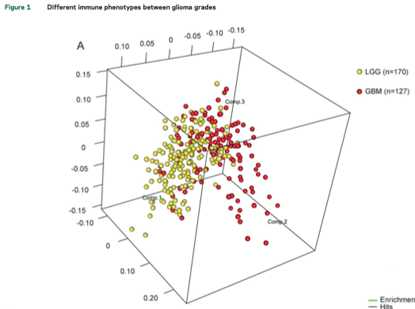
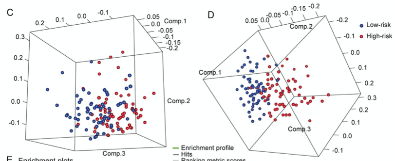

**Author(s)**: `r params$author`  
**Reviewer(s)**: `r params$reviewer`  
**Date**: `r Sys.Date()`  


# Academic Citation
If you use this code in your work or research, we kindly request that you cite our publication:

Xiaofan Lu, et al. (2025). FigureYa: A Standardized Visualization Framework for Enhancing Biomedical Data Interpretation and Research Efficiency. iMetaMed. https://doi.org/10.1002/imm3.70005


```{r setup, include=FALSE}
knitr::opts_chunk$set(echo = TRUE)
```

# 需求描述
# Requirement

像文章里这样的3D PCA图，展示不同组sample的关系。
A 3D PCA plot like the one in the article, showing the relationships between different sample groups.



Figure 1 Different immune phenotypes between glioma grades (A) Principal components analysis of immune-related genes between glioblastoma (GBM) and lower grade glioma (LGG). 



Figure 2 An 8-gene local immune signature for patients with glioblastoma (GBM) (C) Distribution of samples based on the whole genome expression data. (D) High- and low-risk patients distributed on 2 sides based on the immune system process gene set.

出自<https://n.neurology.org/content/86/24/2226>
Source: <https://n.neurology.org/content/86/24/2226>

# 应用场景
# Application Scenarios

场景一：PCA一般用作质控，对测序数据的batch effect有个整体的评价。
Scenario 1: PCA is generally used for quality control, providing an overall assessment of the batch effect of sequencing data.

场景二：展示分组之间特定基因的差异。对比例文Figure 2 C和D，C用whole genome expression data，所有样本都混在一起，D用immune-related gene sets就可以看出 clearly divided patients into 2 sections, indicating their remarkable difference in immune phenotype.
类似的像例文Figure 1
 A用immune-related gene set 做PCA，indicating distinct immune phenotypes among histologic grades。
Scenario 2: Showing differences in specific genes between groups. Compare Figures 2 C and D. C uses whole genome expression data, lumping all samples together. D, using immune-related gene sets, clearly divides patients into two sections, indicating their remarkable differences in immune phenotype.
Similarly, Figure 1 A uses the immune-related gene set for PCA, indicating distinct immune phenotypes among histologic grades.

# 环境设置
# Environment Setup


```{r}
source("install_dependencies.R")
```

Load the package

```{r}
library(rgl)

Sys.setenv(LANGUAGE = "en") #显示英文报错信息 # Display English error messages
options(stringsAsFactors = FALSE) #禁止chr转成factor # Disable conversion of chr to factor
```

# 输入文件
# Input File

如果你自己的数据已经整理成easy_input*文件的格式，就直接跳到“PCA分析”。
If your data is already organized in easy_input* format, skip directly to "PCA Analysis."

## 输入文件的下载
## Download the Input File

基因表达矩阵，CGGA.mRNA_array_301_gene_level.20191128.txt，每行一个基因，每列一个sample。从CGGA下载：[Expression Data (gene level)](http://www.cgga.org.cn/download?file=download/20191128/CGGA.mRNA_array_301_gene_level.20191128.txt.zip&type=mRNA_array_301_gene_level&time=20191128) ，解压；
Gene expression matrix, CGGA.mRNA_array_301_gene_level.20191128.txt, one gene per row, one sample per column. Download [Expression Data (gene level)](http://www.cgga.org.cn/download?file=download/20191128/CGGA.mRNA_array_301_gene_level.20191128.txt.zip&type=mRNA_array_301_gene_level&time=20191128) from CGGA and unzip it.

分组信息，CGGA.mRNA_array_301_clinical.20191128.txt，至少包含CGGA_ID和Grade两列，这里用Grade为LGG和GBM分组。从CGGA下载：[Clinical Data](http://www.cgga.org.cn/download?file=download/20191128/CGGA.mRNA_array_301_clinical.20191128.txt.zip&type=mRNA_array_301_clinical&time=20191128)，解压；
Grouping information, CGGA.mRNA_array_301_clinical.20191128.txt, contains at least two columns: CGGA_ID and Grade. Here, Grade is used to group LGG and GBM. Download [Clinical Data](http://www.cgga.org.cn/download?file=download/20191128/CGGA.mRNA_array_301_clinical.20191128.txt.zip&type=mRNA_array_301_clinical&time=20191128) from CGGA and unzip it.

从MSigDB下载免疫相关基因，用这个方法还可以下载其他感兴趣通路的基因：
Download immune-related genes from MSigDB. This method can also be used to download genes for other pathways of interest:

- [immune system process, M13664](https://www.gsea-msigdb.org/gsea/msigdb/download_geneset.jsp?geneSetName=IMMUNE_SYSTEM_PROCESS&fileType=txt)基因集合，重命名为"IMMUNE_SYSTEM_PROCESS_M13664.txt"；
- [immune response, M19817](https://www.gsea-msigdb.org/gsea/msigdb/download_geneset.jsp?geneSetName=IMMUNE_RESPONSE&fileType=txt)基因集合，重命名为"IMMUNE_RESPONSE_M19817.txt"。
- [immune system process, M13664](https://www.gsea-msigdb.org/gsea/msigdb/download_geneset.jsp?geneSetName=IMMUNE_SYSTEM_PROCESS&fileType=txt) gene set, renamed "IMMUNE_SYSTEM_PROCESS_M13664.txt";
- [immune response, The gene set [M19817](https://www.gsea-msigdb.org/gsea/msigdb/download_geneset.jsp?geneSetName=IMMUNE_RESPONSE&fileType=txt) has been renamed to "IMMUNE_RESPONSE_M19817.txt".

## 读取基因表达矩阵
## Read the gene expression matrix

```{r}
#exp_data <- read.table("CGGA.mRNA_array_301_gene_level.20191128.txt", header=T, row.names=1, sep="\t")
# 为方便传输，只保留小数点后1位
# For ease of transmission, only one decimal place is retained
#write.csv(round(exp_data,1), "easy_input_expr_ori.csv", quote = F)
exp_data <- read.csv("easy_input_expr_all.csv", row.names = 1)
exp_data[1:3,1:3]
```

## 读取分组信息
## Read group information

用到两列：CGGA_ID和Grade
Use two columns: CGGA_ID and Grade

```{r}
clinical_data <- read.table("CGGA.mRNA_array_301_clinical.20191128.txt", header=T, sep="\t")
clinical_data <- clinical_data[!is.na(clinical_data$Grade), ]
clinical_data[1,]
table(clinical_data$Grade)

# 获取LGG样本名称，Grade里的WHO II和WHO III定义为LGG
# Get the LGG sample name. WHO II and WHO III in Grade are defined as LGG.
lgg_sample <- as.character(subset(clinical_data, Grade %in% c("WHO II", "WHO III"))[, "CGGA_ID"])
lgg_sample <- lgg_sample[lgg_sample %in% colnames(exp_data)]
write.table(lgg_sample, "easy_input_group1.txt", quote = F, row.names = F)

# 获取GBM样本名称，Grade里的WHO IV定义为LGG
# Get the GBM sample name. WHO IV in Grade is defined as LGG.
gbm_sample <- as.character(subset(clinical_data, Grade %in% c("WHO IV"))[, "CGGA_ID"])
gbm_sample <- gbm_sample[gbm_sample %in% colnames(exp_data)]
write.table(gbm_sample, "easy_input_group2.txt", quote = F, row.names = F)
```

## 读取参与特定通路的基因
## Read genes involved in a specific pathway

```{r}
# 读取基因集合 # Read the gene collection
immune_response <- as.character(read.table("IMMUNE_RESPONSE_M19817.txt", skip=2)[, 1])
immune_system_process <- as.character(read.table("IMMUNE_SYSTEM_PROCESS_M13664.txt", skip=2)[, 1])
immune_genes <- unique(c(immune_response, immune_system_process))
immune_genes <- immune_genes[immune_genes %in% rownames(exp_data)]

# 获取感兴趣的基因表达谱 # Obtain gene expression profiles of interest
immune_data <- exp_data[immune_genes, c(lgg_sample, gbm_sample)]
immune_data[1:5, 1:5]
# 保存到文件 # Save to file
write.csv(immune_data, "easy_input_expr.csv", quote = F)
```

# PCA分析
# PCA analysis

```{r}
# 读取基因表达矩阵 # Read gene expression matrix
immune_data <- read.csv("easy_input_expr.csv", row.names = 1)
immune_data[1:3,1:3]
dim(immune_data)

# 做PCA # Perform PCA
pca <- prcomp(t(immune_data))
```

# 开始画图
# Start plotting

```{r}
# 两个分组的sample ID
# Sample IDs for the two groups
lgg_sample <- read.table("easy_input_group1.txt", header = T)$x
gbm_sample <- read.table("easy_input_group2.txt", header = T)$x

# 准备颜色
# Prepare the colors
lgg_color <- rep("yellow", length(lgg_sample))
names(lgg_color) <- lgg_sample
gbm_color <- rep("red", length(gbm_sample))
names(gbm_color) <- gbm_sample
groups <- c(lgg_color, gbm_color)
```

> 运行下面这段，会跳出画图窗口，用鼠标拖拽到合适的角度、拉伸窗口到合适的大小后，保存图。
> Run the following code and a drawing window will pop up. Drag the mouse to the desired angle and size, then save the image.

```{r}
# 3d PCA图
# 3D PCA plot
plot3d(pca$x[,1:3], # 取前三个主成分 # Take the first three principal components
       xlab="Comp.1", ylab="Comp.2", zlab="Comp.3", 
       col=groups, # 按groups填充颜色 # Fill color by group
       type="s", # 画球，'p' for points, 's' for spheres, 'l' for lines, 'h' for line segments 
# Draw spheres, 'p' for points, 's' for spheres, 'l' for lines, 'h' for line segments
       size=1, #球的大小 # Size of the spheres
       lwd=2, box=T)
# 保存(目前只能保存为png)
#rgl.snapshot("PCA.png")
# Save (Currently only saves to png)
#rgl.snapshot("PCA.png")
```

有时我们希望同一篇文章中的多个3D图形保持同一角度来展示，那就把角度保存下来，每次画图都加载这个角度。
Sometimes, we want to display multiple 3D graphs in the same article from the same angle. To do this, save the angle and load it each time you draw.

```{r}
#手动调好3D图形位置，获得角度
# Manually adjust the 3D shape's position and obtain the angle
myMatrix <- par3d()
userMatrix <- myMatrix$userMatrix
windowRect <- myMatrix$windowRect
# 把角度保存到文件
# Save the angle to a file
#save(userMatrix, windowRect, file = "mypar3d.RData")

# 载入之前调好的角度
# Load the previously adjusted angle
(load("mypar3d.RData"))
head(userMatrix) # a 4 by 4 matrix describing user actions to display the scene.
head(windowRect) # integer. A vector of four values indicating the left, top, right and bottom of the displayed window (in pixels). Applies to the whole device.
par3d(userMatrix=userMatrix, windowRect=windowRect)
rglwidget()

# 保存(目前只能保存为png)
# Save (Currently only saves as PNG)
#rgl.snapshot("PCA.png")
```

由于是3D图，需要在弹出的窗口自己调整角度，所以待调整完角度后再添加legend
Since this is a 3D graph, you'll need to adjust the angle in the pop-up window. Add the legend after adjusting the angle.

也可以用Illustrator等软件手动添加图例，更灵活。
You can also manually add the legend using software like Illustrator for greater flexibility.

```{r}
legend3d("topright", # legend的位置 # Legend position
         legend = c("LGG (n=173)", "GBM (n=124)"), # 手写文字 # Handwritten text
         bty = "n", # 不带边框 # No border
         cex = 2, # 文字大小 # Text size
         pch = 16, # 圆形 # Circle
         col = c("yellow", "red")) # 颜色跟图中一致 # Colors consistent with the image
# 保存(目前只能保存为png) # Save (Currently only saves to PNG)
rgl.snapshot("PCA.png")
```


# Session Info

```{r}
sessionInfo()
```