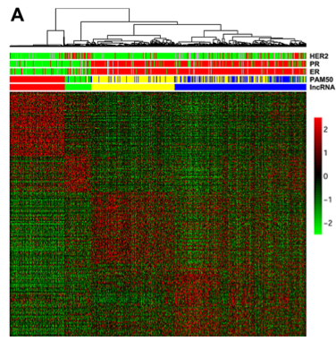

**Author(s)**: `r params$author`  
**Reviewer(s)**: `r params$reviewer`  
**Date**: `r Sys.Date()`  


# Academic Citation
If you use this code in your work or research, we kindly request that you cite our publication:

Xiaofan Lu, et al. (2025). FigureYa: A Standardized Visualization Framework for Enhancing Biomedical Data Interpretation and Research Efficiency. iMetaMed. https://doi.org/10.1002/imm3.70005

```{r setup, include=FALSE}
knitr::opts_chunk$set(echo = TRUE)
```

# 需求描述
# Requirement

过配对差异表达，画亚型特异性上(下)调基因的对角热图。比如样本分了4-5个组，分析并画出每个组里面上调或下调的热图。
Draw a diagonal heatmap of subtype-specific up- and down-regulated genes based on paired differential expression. For example, if samples are divided into 4-5 groups, analyze and draw a heatmap of up- and down-regulated genes within each group.



Figure 2: A) Unsupervised clustering of lncRNAs identified 4 clusters: cluster I (related to the basal-like breast cancer subtype), cluster II (related to the HER-2 enriched subtype), cluster III (related to luminal A subtype), and cluster IV (related to luminal A and B subtypes). Correlation with PAM50 classification, estrogen receptor (ER), progesterone receptor (PR) and HER2 status are depicted. 

出自<https://www.ncbi.nlm.nih.gov/pubmed/25296969>
Source: <https://www.ncbi.nlm.nih.gov/pubmed/25296969>

# 应用场景
# Application Scenario

在大于等于3组亚型的基础上，得到配对差异表达基因后，计算每个亚型特异性上/下调的基因集，并绘制特异性基因表达热图。
After obtaining paired differentially expressed genes for at least three subtypes, we calculated the set of upregulated/downregulated genes for each subtype and plotted a heatmap of specific gene expression.

# 环境设置
# Environment Setup

```{r}
source("install_dependencies.R")

library(ClassDiscovery) # 距离测量 # Distance measurement
library(edgeR) # 差异表达 # Differential expression
library(NMF) # 绘制热图 # Heatmap plotting
library(gplots) # 热图颜色 # Heatmap colors
library(RColorBrewer) # 热图颜色 # Heatmap colors

Sys.setenv(LANGUAGE = "en") #显示英文报错信息 # Display English error messages
options(stringsAsFactors = FALSE) #禁止chr转成factor # Disable conversion of chr to factors
```

自定义配对比较函数 Custom pairwise comparison function

> 这里用edgeR，如果用DESeq2或limma，就把FigureYa118MulticlassDESeq2或FigureYa119MulticlassLimma里面相应的函数替换过来，可无缝对接。
> Here, edgeR is used. If you are using DESeq2 or limma, simply replace the corresponding functions in FigureYa118MulticlassDESeq2 or FigureYa119MulticlassLimma for seamless integration.

```{r}
# 创建需要配对比较的列表
# Create a list for paired comparison
createList <- function(group=NULL) {
  
  tumorsam <- names(group)
  sampleList = list()
  treatsamList =list()
  treatnameList <- c()
  ctrlnameList <- c()
  
  #A-1: 类1 vs 其他
  #A-1: Class 1 vs. Others
  sampleList[[1]] = tumorsam
  treatsamList[[1]] = intersect(tumorsam, names(group[group=="Cluster1"])) # 亚型名称需要根据情况修改
  # The subtype name needs to be modified according to the situation
  treatnameList[1] <- "Cluster1" # 该亚型的命名 # The name of this subtype
  ctrlnameList[1] <- "Others" # 其他亚型的命名 # The name of other subtypes
  
  #A-2: 类2 vs 其他
  #A-2: Class 2 vs. Others
  sampleList[[2]] = tumorsam
  treatsamList[[2]] = intersect(tumorsam, names(group[group=="Cluster2"]))
  treatnameList[2] <- "Cluster2"
  ctrlnameList[2] <- "Others"
  
  #A-3: 类3 vs 其他
  #A-3: Class 3 vs Others 
  sampleList[[3]] = tumorsam
  treatsamList[[3]] = intersect(tumorsam, names(group[group=="Cluster3"]))
  treatnameList[3] <- "Cluster3"
  ctrlnameList[3] <- "Others"
  
  #A-4: 类4 vs 其他
  #A-4: Class 4 vs Others 
  sampleList[[4]] = tumorsam
  treatsamList[[4]] = intersect(tumorsam, names(group[group=="Cluster4"]))
  treatnameList[4] <- "Cluster4"
  ctrlnameList[4] <- "Others"
  
  return(list(sampleList, treatsamList, treatnameList, ctrlnameList))
  
}

# 配对edgeR
# Pair edgeR
twoclassedgeR <- function(res.path=NULL, countsTable=NULL, prefix=NULL, complist=NULL, overwt=FALSE) {
  
  #Groupinfo could contain "batch", which will be considered by edgeR design matrix
  sampleList <- complist[[1]]
  treatsamList <- complist[[2]]
  treatnameList <- complist[[3]]
  ctrlnameList <- complist[[4]]
  allsamples <- colnames(countsTable)
  
  options(warn=1)
  for (k in 1:length(sampleList)) { # 循环读取每一次比较的内容 # Loop through each comparison
    samples <- sampleList[[k]]
    treatsam <- treatsamList[[k]]
    treatname <- treatnameList[k]
    ctrlname <- ctrlnameList[k]
    
    compname <- paste(treatname, "_vs_", ctrlname, sep="") # 生成最终文件名 # Generate final file name
    tmp = rep("others", times=length(allsamples))
    names(tmp) <- allsamples
    tmp[samples]="control"
    tmp[treatsam]="treatment"
    outfile <- file.path( res.path, paste(prefix, "_edgeR_test_result.", compname, ".txt", sep="") )
    if (file.exists(outfile) & (overwt==FALSE)) { # 因此差异表达分析较慢，因此如果文件存在，在不覆盖的情况下（overwt=F）不再次计算差异表达
 # This slows down differential expression analysis. Therefore, if the file exists, do not recalculate differential expression without overwriting (overwt=F)
      cat(k, ":", compname, "exists and skipped;\n")
      next
    }
    
    saminfo <- data.frame("Type"=tmp[samples],"SampleID"=samples,stringsAsFactors = F)
    
    group=factor(saminfo$Type,levels = c("control","treatment"))    
    
    design <- model.matrix(~group) # 设计矩阵仅包含亚型信息，若有批次效应请修改，例如design <- model.matrix(~group+treat) # The design matrix only contains subtype information. If there are batch effects, please modify it. For example, design <- model.matrix(~group+treat)
    rownames(design) <- samples

    # 差异表达过程，具体参数细节及输出结果解释，请参阅相关document
    # Differential expression process. For specific parameter details and output interpretation, please refer   to the relevant documentation.
    y <- DGEList(counts=countsTable[,samples],group=saminfo$Type)
    y <- calcNormFactors(y)
    y <- estimateDisp(y, design, robust=TRUE)
    fit <- glmFit(y, design)
    lrt <- glmLRT(fit)
    ordered_tags <- topTags(lrt, n=100000)
    allDiff=ordered_tags$table
    allDiff=allDiff[is.na(allDiff$FDR)==FALSE,]
    diff=allDiff
    
    diff$id <- rownames(diff)
    res <- diff[,c("id","logFC","logCPM","LR","PValue","FDR")]
    colnames(res) <- c("id","log2FC","logCPM","LR","PValue","FDR")
    write.table(res, file=outfile, row.names=F, col.names=T, sep="\t", quote=F)
    cat(k, ",")
  }
  options(warn=0)
}
```

自定义画图函数
Custom drawing function

```{r}
# 特异性基因计算和热图绘制
# Specific gene calculation and heat map drawing
sigheat <- function(featdata=NULL, # 表达谱，注意一般是标准化后的FPKM或者TPM，此时norm选择none
# Expression spectrum, note that it is usually standardized FPKM or TPM, in this case, norm selects none
                    DEfiles=NULL, # 差异表达结果文件名 # Differential expression result file name
                    outfile=NULL, # 输出文件名 # Output file name
                    hcs=NULL, # 聚类树结构 # Cluster tree structure
                    heatCol=greenred(128), #热图配色 # Heat map color
                    # 如果你喜欢橙黄蓝，可以换成下面这行
# If you prefer orange, yellow, and blue, you can change to the following line:
                    #heatCol=colorRampPalette(rev(brewer.pal(n = 7, name = "RdYlBu")))(100),
                    annCol=NULL, # 样本注释信息 # Sample annotation information
                    annColors=NULL, # 注释信息的颜色 # Annotation color
                    res.path=NULL, # 存储特异性表达的基因集的路径 # Path to store specifically expressed gene sets
                    fig.path=NULL, # 存储热图的路径 # Path to store heatmap
                    halfwidth=3, # 表达谱标准化后的上下限cutoff # Normalized expression profile cutoffs
                    padjcut=0.05, # fdr的阈值 # FDR threshold
                    log2fccut=1, # log2fc的阈值，默认为1 # Log2fc threshold, default is 1
                    height=8, # 热图图片高度 # Heatmap image height
                    width=8, # 热图的宽度 # Heatmap width
                    norm="none", # 输入数据是否需要标准化，默认不需要，可选择quantile，或者median标准化
# Whether the input data should be normalized. Default is not. Quantile or median normalization can be selected.
                    dirct="UP", # 特异性基因的表达方向，默认为上调（推荐），可选择UP或DOWN
# The expression direction of a specific gene. Default is up-regulated (recommended). UP or DOWN can be selected.
                    fontsize=8, # 热图的字号 # Heatmap font size.
                    labRow = F, # 热图是否显示基因名 # Whether the heatmap should display gene names.
                    labCol = F) {  # 热图是否显示样本名 # Whether the heatmap should display sample names.
  
  samabsFlag <- FALSE 
  if (is.null(hcs)) {samabsFlag <- TRUE}
  
  if(is.null(DEfiles)) {stop("DEfiles is NULL!")}
  if (!is.element(norm, c("none", "median", "quantile"))) {stop( "norm type error!") }
  if (!is.element(dirct, c("UP", "DOWN"))) {stop( "dirct type error!") }
  
  if(dirct=="UP") { outlabel <- "uniquely_significantly_overexpressed.txt" }
  if(dirct=="DOWN") { outlabel <- "uniquely_significantly_underexpressed.txt" }
  
  genelist <- c()
  for (filek in DEfiles) {
    DEres <- read.table(file.path(res.path, filek), header=T, row.names=NULL, sep="\t", quote="", stringsAsFactors=F)    
    DEres <- DEres[!duplicated(DEres[, 1]),]
    DEres <- DEres[!is.na(DEres[, 1]), ]
    rownames(DEres) <- DEres[, 1]
    DEres <- DEres[, -1]
    
    if (dirct=="UP") {
      genelist <- c( genelist, rownames(DEres[!is.na(DEres$FDR) & DEres$FDR < padjcut & !is.na(DEres$log2FC) & DEres$log2FC > log2fccut, ]) )
    }
    if (dirct=="DOWN") {
      genelist <- c( genelist, rownames(DEres[!is.na(DEres$FDR) & DEres$FDR < padjcut & !is.na(DEres$log2FC) & DEres$log2FC < -log2fccut, ]) )
    }
  }
  unqlist <- setdiff(genelist,genelist[duplicated(genelist)])
  
  for (filek in DEfiles) {
    DEres <- read.table(file.path(res.path, filek), header=T, row.names=NULL, sep="\t", quote="", stringsAsFactors=F)
    DEres <- DEres[!duplicated(DEres[, 1]),]
    DEres <- DEres[!is.na(DEres[, 1]), ]
    rownames(DEres) <- DEres[, 1]
    DEres <- DEres[, -1]
    
    if(dirct=="UP") {
      outk <- intersect( unqlist, rownames(DEres[!is.na(DEres$FDR) & DEres$FDR < padjcut & !is.na(DEres$log2FC) & DEres$log2FC > log2fccut, ]) )
    }
    if(dirct=="DOWN") {
      outk <- intersect( unqlist, rownames(DEres[!is.na(DEres$FDR) & DEres$FDR < padjcut & !is.na(DEres$log2FC) & DEres$log2FC < -log2fccut, ]) )
    }
    write.table(outk, file=file.path(res.path, paste(filek, outlabel, sep="_")), row.names=F, col.names=F, sep="\t", quote=F)
  }
  
  if (sum(!is.element(unqlist, rownames(featdata)))>0) {stop("unqlist not found in featdata!")}
  
  samples <- colnames(featdata)
  if (norm=="quantile") {
    tmp <- normalize.quantiles(as.matrix(featdata))
    rownames(tmp) <- rownames(featdata)
    colnames(tmp) <- colnames(featdata)
  }
  if (norm=="median") {
    tmp <- sweep(featdata,2, apply(featdata,2,median,na.rm=T))
  }
  if(norm=="none") {
    tmp <- featdata
  }
  
  if (samabsFlag) {
    subdata <- tmp[unqlist, intersect(samples, colnames(tmp))]
  }else{
    subdata <- tmp[unqlist, samples]
  }
  
  hcg <- hclust(distanceMatrix(as.matrix(t(subdata)), "pearson"), "ward.D") 
  plotdata <- t(scale(t(subdata)))
  plotdata[plotdata > halfwidth] <- halfwidth
  plotdata[plotdata < - halfwidth] <- -halfwidth
  
  pdf(file=file.path(fig.path, outfile), height=height, width=width)
  Rowv <- NA
  if (samabsFlag) {
    if (ncol(annCol)<2) {
      tmp <- as.data.frame(annCol[colnames(plotdata), ])
      rownames(tmp) <- colnames(plotdata)
      colnames(tmp) <- colnames(annCol)
    }else{
      tmp <- annCol[colnames(plotdata), ]
    }
    if(isTRUE(labRow) & isTRUE(labCol)){
      aheatmap(plotdata, Rowv=Rowv, Colv=NA, annCol=tmp, annColors=annColors, color=heatCol, revC=TRUE, breaks=0, fontsize=fontsize)
    }
    if(isTRUE(labRow) & isFALSE(labCol)){
      aheatmap(plotdata, Rowv=Rowv, Colv=NA, annCol=tmp, annColors=annColors, color=heatCol, revC=TRUE, breaks=0, fontsize=fontsize, labCol = NA)
    }
    if(isFALSE(labRow) & isTRUE(labCol)){
      aheatmap(plotdata, Rowv=Rowv, Colv=NA, annCol=tmp, annColors=annColors, color=heatCol, revC=TRUE, breaks=0, fontsize=fontsize, labRow = NA)
    } 
    if(isFALSE(labRow) & isFALSE(labCol)){
      aheatmap(plotdata, Rowv=Rowv, Colv=NA, annCol=tmp, annColors=annColors, color=heatCol, revC=TRUE, breaks=0, fontsize=fontsize, labCol = NA, labRow = NA)
    }
    
  }else{
    if (ncol(annCol)<2) {
      tmp <- as.data.frame(annCol[samples, ])
      rownames(tmp) <- samples
      colnames(tmp) <- colnames(annCol)
    }else{
      tmp <- annCol[samples, ]
    }
    if(sum(hcs$labels!=colnames(plotdata))>0) {stop("colnames mismatch for aheatmap!")}
    if(isTRUE(labRow) & isTRUE(labCol)){
      aheatmap(plotdata, Rowv=Rowv, Colv=as.dendrogram(hcs), annCol=tmp, annColors=annColors, color=heatCol, revC=TRUE, breaks=0, fontsize=fontsize)
    }
    if(isTRUE(labRow) & isFALSE(labCol)){
      aheatmap(plotdata, Rowv=Rowv, Colv=as.dendrogram(hcs), annCol=tmp, annColors=annColors, color=heatCol, revC=TRUE, breaks=0, fontsize=fontsize, labCol = NA)
    }
    if(isFALSE(labRow) & isTRUE(labCol)){
      aheatmap(plotdata, Rowv=Rowv, Colv=as.dendrogram(hcs), annCol=tmp, annColors=annColors, color=heatCol, revC=TRUE, breaks=0, fontsize=fontsize, labRow = NA)
    } 
    if(isFALSE(labRow) & isFALSE(labCol)){
      aheatmap(plotdata, Rowv=Rowv, Colv=as.dendrogram(hcs), annCol=tmp, annColors=annColors, color=heatCol, revC=TRUE, breaks=0, fontsize=fontsize, labCol = NA, labRow = NA)
    }
  }
  invisible(dev.off())
  
  # return(unqlist)
}
```

# 输入文件
# Input files

easy_input_counts.txt，easy_input_FPKM.txt，表达矩阵，分别是read count和FPKM。这里以read count为输入，用edgeR做配对比较，用FPKM画图。
easy_input_counts.txt and easy_input_FPKM.txt are expression matrices, representing read counts and FPKM, respectively. Here, read counts are used as input, and edgeR is used for pairwise comparisons and FPKM is used for plotting.

```{r}
# 设置文件路径
# Set the file path
workdir <- "."

# 读取SKCM表达谱(count和对应的FPKM，或者TPM文件)
# Read the SKCM expression profile (counts and corresponding FPKMs, or TPM files)
countstable <- read.table("easy_input_counts.txt",sep = "\t",row.names = 1,header = T,check.names = F,stringsAsFactors = F)

# FPKM与counts对应。如果你要把count转换为FPKM，可参考FigureYa34count2FPKM
# FPKM corresponds to counts. If you need to convert counts to FPKM, refer to FigureYa34count2FPKM
FPKM <- read.table("easy_input_FPKM.txt",sep = "\t",row.names = 1,header = T,check.names = F,stringsAsFactors = F) #

# 如果你只有FPKM数据，打算用FigureYa119Multiclasslimma做配对比较，则只需提供easy_input_FPKM.txt
# 运行下面这行，不运行本段第一行
#countstable <- FPKM

# If you only have FPKM data and plan to use FigureYa119Multiclasslimma for pairwise comparisons, only provide easy_input_FPKM.txt.
# Run the following line; skip the first line of this section.
#countstable <- FPKM

all(colnames(countstable) == colnames(FPKM)) # 检查一下样本名 # Check sample names
all(rownames(countstable) == rownames(FPKM)) # 检查一下基因名 # Check gene names
```

# 聚类和配对差异表达分析
# Clustering and pairwise differential expression analysis

```{r}
# 样本聚类 #
# Sample clustering #
input <- log2(FPKM + 1) # 数据对数化 # Logarithmize the data
hcs <- hclust(distanceMatrix(as.matrix(input), "pearson"), "ward.D") # 样本聚类，更多聚类请参阅FigureYa91cluster_heatmap
# Cluster the samples. For more information on clustering, see FigureYa91cluster_heatmap

group <- cutree(hcs, k = 4) # 样本分4类（实际上大于等于3类就可以）
# Categorize the samples into 4 categories (actually, 3 or more categories are sufficient)
group <- paste0("Cluster",as.numeric(group))
names(group) <- colnames(countstable)

#--------------#
# 配对差异表达 #
# Pairwise differential expression #
# 注意：该处使用的是FigureYa120MulticlassedgeR，若需使用其他差异表达算法请参阅FigureYa118MulticlassDESeq2，FigureYa119Multiclasslimma
# Note: FigureYa120MulticlassedgeR is used here. For other differential expression algorithms, see FigureYa118MulticlassDESeq2 and FigureYa119Multiclasslimma
complist <- createList(group=group)
twoclassedgeR(res.path = ".", #所有配对差异表达结果都会输出在res.path路径下 # All pairwise differential expression results will be output in the res.path path
              countsTable = countstable,
              prefix = "SKCM", #文件名以SKCM开头
              complist = complist,
              overwt = F)
```

# 开始画图
# Start plotting

```{r}
#--------------------------------------#
# 创建样本注释和注释颜色以显示在热图上 #
# Create sample annotations and annotation colors for display on the heatmap #
annCol <- data.frame(Group = group,
                     row.names = names(group),
                     stringsAsFactors = F)
annColors <- list(Group = c("Cluster1"="yellow",
                            "Cluster2"="blue",
                            "Cluster3"="green",
                            "Cluster4"="red")) #如果你有更多类，就依此规律继续添加 # If you have more clusters, continue adding them in this order.

#----------------------------#
# 计算特异性上调基因并画热图 #
# Calculate specifically upregulated genes and plot heatmap #
sigheat(featdata = log2(FPKM + 1), # 数据已标准化
        # 注意：DEfiles的顺序是要进行调整的，当第一次输出热图后观察对应亚型色块所在的位置调整文件读入顺序
        # Note: The order of the DE files needs to be adjusted. After outputting the heatmap for the first time, observe the position of the corresponding subtype color blocks and adjust the order of file imports.
        DEfiles = c("SKCM_edgeR_test_result.Cluster4_vs_Others.txt",
                    "SKCM_edgeR_test_result.Cluster1_vs_Others.txt",
                    "SKCM_edgeR_test_result.Cluster2_vs_Others.txt",
                    "SKCM_edgeR_test_result.Cluster3_vs_Others.txt"),
        hcs = hcs, # 样本聚类信息 # Sample annotations
        annCol = annCol[colnames(FPKM),,drop = F], # 样本注释 # Sample annotations
        annColors = annColors, # 样本注释颜色 # Sample annotation colors
        res.path = workdir,
        fig.path = workdir,
        outfile = "skcm_sigheatmap_upexpressed.pdf",
        halfwidth = 2,
        padjcut = 0.05,
        log2fccut = 1,
        norm = "none", # 不标准化 # No normalization
        dirct = "UP", # 上调 # Upregulated
        width = 8,
        height = 8)

#----------------------------#
# 计算特异性下调基因并画热图 #
# Calculate specifically downregulated genes and draw a heatmap #
sigheat(featdata = log2(FPKM + 1), # 数据已标准化 # Data normalized
        # 注意：DEfiles的顺序是要进行调整的，当第一次输出热图后观察对应亚型色块所在的位置调整文件读入顺序
        # Note: The order of the DE files needs to be adjusted. After outputting the heatmap for the first time, observe the positions of the corresponding subtype blocks and adjust the order of file imports.
        DEfiles = c("SKCM_edgeR_test_result.Cluster4_vs_Others.txt",
                    "SKCM_edgeR_test_result.Cluster1_vs_Others.txt",
                    "SKCM_edgeR_test_result.Cluster2_vs_Others.txt",
                    "SKCM_edgeR_test_result.Cluster3_vs_Others.txt"),
        hcs = hcs, # 样本聚类信息 # Sample clustering information
        annCol = annCol[colnames(FPKM),,drop = F], # 样本注释 # Sample annotations
        annColors = annColors, # 样本注释颜色 # Sample annotation colors
        res.path = workdir,
        fig.path = workdir,
        outfile = "skcm_sigheatmap_downexpressed.pdf",
        halfwidth = 2,
        padjcut = 0.05,
        log2fccut = 1,
        norm = "none", # 不标准化 # No normalization
        dirct = "DOWN", # 下调（不推荐） # Downscaling (not recommended)
        width = 8,
        height = 8)
```


# Session Info

```{r}
sessionInfo()
```