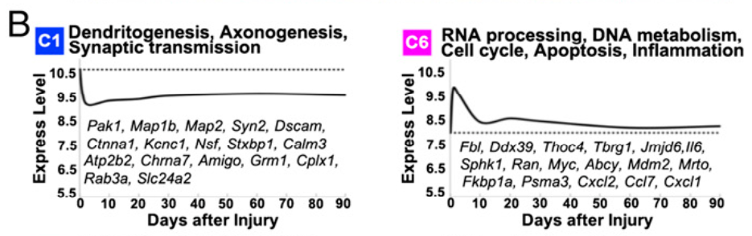

**Author(s)**: `r params$author`  
**Date**: `r Sys.Date()`  


# Academic Citation
If you use this code in your work or research, we kindly request that you cite our publication:

Xiaofan Lu, et al. (2025). FigureYa: A Standardized Visualization Framework for Enhancing Biomedical Data Interpretation and Research Efficiency. iMetaMed. https://doi.org/10.1002/imm3.70005


```{r setup, include=FALSE}
knitr::opts_chunk$set(echo = TRUE)
```

## 需求描述
## Requirement description

WGCNA得到模块以后，用模块包含的基因表达量做拟合曲线。

After WGCNA gets the module, a fitting curve is made with the expression of the genes contained in the module.



出自<http://www.pnas.org/content/112/43/13360>

from<http://www.pnas.org/content/112/43/13360>

## 使用场景
## Usage scenario

本质是用一条趋势线代表多个点或线的变化趋势，多用于时间序列数据。

场景一：WGCNA得到的模块内的基因的变化趋势

场景二：聚类分析得到的cluster内的基因的变化趋势

Essentially, a trend line is used to represent the trend of multiple points or lines, mostly used for time series data.

Scenario 1: Trends in the genes within the module obtained by WGCNA

Scenario 2: Trends of genes within clusters obtained from cluster analysis

## 输入数据
## Input data

用代码15WGCNA输出了各个gene module内的基因表达量，每个module保存在一个csv文件中。

例子paper里的数据是时间序列，作者提取表达量最高的30个基因，取平均值（averaged gene expression of top 30）绘制拟合曲线。

Gene expression within each gene module was output using code 15WGCNA, and each module was saved in a csv file.

The data in the example paper is a time series, and the author extracted the 30 genes with the highest expression and took the average (average gene expression of top 30) to plot the fitted curve.

## 一次画一个module
## Draw one module at a time

这套输入数据里，每种细胞有5个sample，假装是5个时间点，4次重复，取前30个基因在4次重复里的平均值

In this input data set, there are 5 samples for each cell, pretending to be 5 time points in 4 replications, and taking the average of the top 30 genes in the 4 replications.

```{r}
source("install_dependencies.R")
specmod<-read.csv("pink.csv",row.names = 1)[1:30,]
t<-data.frame(tp=1:5,tpm_mean = log2(c(mean(as.matrix(specmod[,1:4])),mean(as.matrix(specmod[,5:8])),mean(as.matrix(specmod[,9:12])),mean(as.matrix(specmod[,13:16])),mean(as.matrix(specmod[,17:20])))))
head(t)
```

### 画图
### Draw plots

```{r,warning=FALSE,message=FALSE,fig.width=8,fig.height=4}
library(ggplot2)
ggplot(t,aes(x = tp,y = tpm_mean)) +
  geom_smooth(color="black") + #拟合曲线的颜色 color of the fitted curve
  labs(x = "Days after injury", y = "Expression Level", title = "black") + 
  theme_bw() + #去除背景色 remove background color
  theme(panel.grid =element_blank()) + #去除网格线 remove gridlines
  theme(panel.border = element_blank()) + #去除外层边框 remove outer border
  theme(axis.line = element_line(colour = "grey")) + #坐标轴画成灰色 coordinate axes are drawn in gray
  theme(axis.ticks = element_blank()) + #取掉坐标轴上的刻度线 remove the scale from the axes
  geom_hline(yintercept = t$tpm_mean[1],linetype="dashed") #在第一个时间点处画虚线 draw a dotted line at the first time point
```

默认用loess模型拟合，你还可以添加method参数，使用其他方法拟合，例如：`method = "lm"`, 或 "glm", "gam", "loess", "rlm"

The default is to fit with the loess model, you can also add the method parameter to fit with other methods, e.g. `method = “lm”`, or “glm”, “gam”, “loess”, “rlm”

## 一次画多个module
## Draw multiple modules at once

读入当前文件夹中的多个module文件，合并。

Read in multiple module files in the current folder and merge them.

```{r}
fnames<-Sys.glob("*.csv")
fnames
fdataset<-lapply(fnames,read.csv)
names(fdataset) <- fnames

library(plyr)
result <- ldply(fdataset, data.frame)
head(result)
df<-result[,2:22]
df$module<-unlist(strsplit(result$.id,split = ".csv"))
row.names(df)<-df$X
df1<-df[2:22]
```

### 画图
### Draw plots

```{r,warning=FALSE,message=FALSE,fig.width=8,fig.height=6}
library(ggplot2)
plist=list()
tag = 0
for (mod in unique(df1$module)){
  tag = tag + 1
  specmod <- df1[df1$module == mod,]
  t<-data.frame(tp=1:5,tpm_mean = log2( c(mean(as.matrix(specmod[1:30,1:4])),mean(as.matrix(specmod[1:30,5:8])),mean(as.matrix(specmod[1:30,9:12])),mean(as.matrix(specmod[1:30,13:16])),mean(as.matrix(specmod[1:30,17:20])))))
  plist[[tag]]<-ggplot(t,aes(x = tp, y = tpm_mean)) +
  geom_smooth(color = mod) + #拟合曲线的颜色 color of the fitted curve
  labs(x = "Days after injury", y = "Expression Level", title = mod) + 
  theme_bw() + #去除背景色 remove background color
  theme(panel.grid =element_blank()) + #去除网格线 remove gridlines
  theme(panel.border = element_blank()) + #去除外层边框 remove outer border
  theme(axis.line = element_line(colour = "grey")) + #坐标轴画成灰色 coordinate axes are drawn in gray
  theme(axis.ticks = element_blank()) + #取掉坐标轴上的刻度线 remove the scale from the axes
  geom_hline(yintercept = t$tpm_mean[1],linetype="dashed") #在第一个时间点处画虚线 draw a dotted line at the first time point
}

require(cowplot)
plot_grid(plotlist=plist, ncol=2)
ggsave(file="myfitting.pdf")
```

```{r}
sessionInfo()
```

