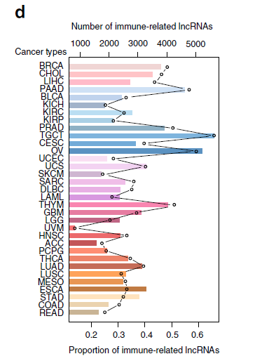
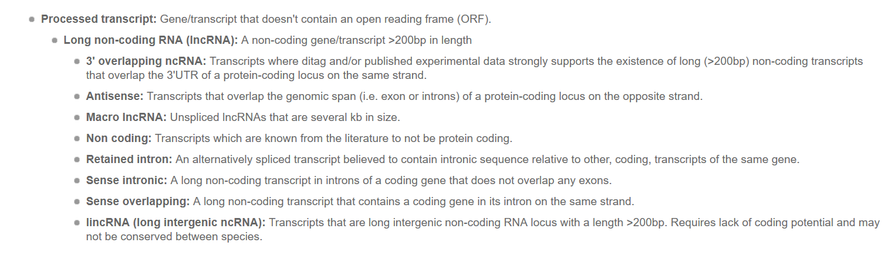
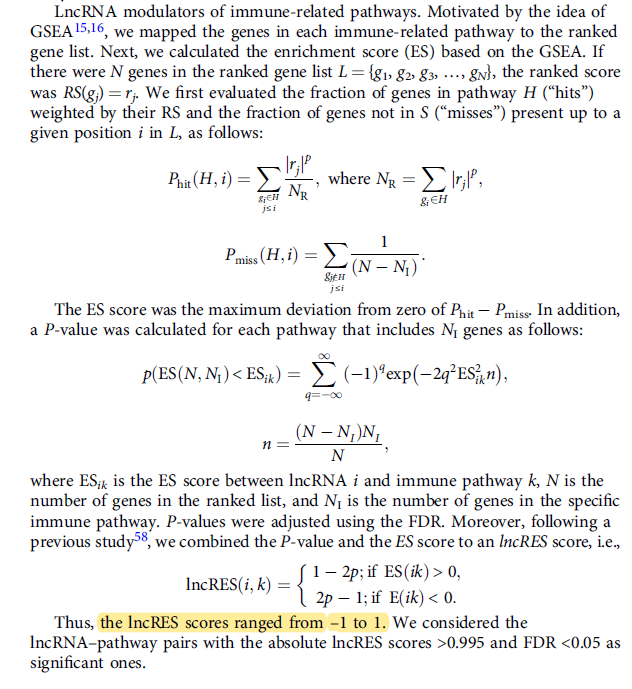

**Author(s)**: `r params$author`  
**Reviewer(s)**: `r params$reviewer`  
**Date**: `r Sys.Date()`  

# Academic Citation
If you use this code in your work or research, we kindly request that you cite our publication:

Xiaofan Lu, et al. (2025). FigureYa: A Standardized Visualization Framework for Enhancing Biomedical Data Interpretation and Research Efficiency. iMetaMed. https://doi.org/10.1002/imm3.70005

If you use ComplexHeatmap in published research, please cite:

Zuguang Gu, et al., Complex heatmaps reveal patterns and correlations in multidimensional genomic data, Bioinformatics, 2016.

Zuguang Gu. Complex Heatmap Visualization, iMeta, 2022.

```{r setup, include=FALSE}
knitr::opts_chunk$set(echo = TRUE)
knitr::opts_chunk$set(message = FALSE)
knitr::opts_chunk$set(warning = FALSE)
```

# 需求描述
# Requirement

希望在展示代码的时候能做一些讲解，讲的容易理解一些，原文写的有些看不懂。
I'd appreciate some explanations when presenting the code to make it easier to understand, as the original paper is a bit difficult to understand.



出自<https://www.nature.com/articles/s41467-020-14802-2>
From <https://www.nature.com/articles/s41467-020-14802-2>

Fig.1 Identification of immune-related lncRNAs across cancer types. d The number of immune-related lncRNAs identified in each cancer type. The top y-axis shows the number of lncRNAs and the bottom y-axis shows the proportion of lncRNAs. Source data are provided as a Source Data file.

利用偏相关系数和GSEA算法鉴定免疫相关的lncRNA，作者提供了R包，算法的主要精华其实已经给我们了。接下来我们就一步步解析，看文章里method部分如何对应算法R code。
The authors provide an R package for identifying immune-related lncRNAs using the partial correlation coefficient and the GSEA algorithm. The key points of the algorithm are already provided. Next, we will analyze it step by step to see how the method section in the article corresponds to the R code for the algorithm.

# 应用场景
# Application Scenarios

对lncRNA做功能注释，也可以用于甲基化数据等。
Functional annotation of lncRNAs can also be applied to methylation data, etc.

双坐标轴图通常用来对比展示数据之间的变化趋势相关关系：
Dual-axis charts are often used to compare and display trends and correlations between data:

- 散点图 + 线性回归，展示3组数据的相关性，A vs. B 和 A vs. C，可参考FigureYa62twoAxis。
- 柱形图 + 折线图，像本篇例文这样，一个是数量，另一个是比例。
- Scatter plot + linear regression, showing the correlation between three data sets, A vs. B and A vs. C. See FigureYa62twoAxis.
- Bar chart + line chart, like the example in this article, one showing quantity and the other showing proportion.

# 环境设置
# Environment Setup

```{r}
source("install_dependencies.R")
source("estimateScore.R") # from estimate package, https://rdrr.io/rforge/estimate/f/
source("filterCommonGenes.R") # from estimate package, https://rdrr.io/rforge/estimate/f/

library(ComplexHeatmap)
library(TCGAbiolinks)
library(SummarizedExperiment)
library(dplyr)
library(rtracklayer)
library(data.table)
library(tidyverse)
library(fgsea)
library(ggplot2)
library(ImmuLncRNA)
Sys.setenv(LANGUAGE = "en") #显示英文报错信息 #Display English error messages
options(stringsAsFactors = FALSE) #禁止chr转成factor #Disable conversion of chr values to factors
```

加载自定义函数，做标准化
Load custom functions for normalization

```{r}
Adjust_mrna <- function(mrna){
  mRow30 <- which(apply(mrna,1,function(v){return((sum(v==0)/length(v))>=0.3)}))
  mRemv <- mRow30
  if(length(mRemv)==0){
      mRNA_out0 <- mrna
    }else{
      mRNA_out0 <- mrna[-(mRemv),]
    }
    mRNA_exp_inter <- log2(mRNA_out0+0.001)
    return(mRNA_exp_inter)
}

Adjust_lncrna <- function(lncrna){
  lncRow50 <- which(apply(lncrna,1,quantile,probs=0.5)==0)
    lncRow90 <- which(apply(lncrna,1,quantile,probs=0.9)<=0.1)
    lncRemv <- union(lncRow50,lncRow90)
    if(length(lncRemv)==0){
      lncRNA_out0 <- lncrna
    }else{
      lncRNA_out0 <- lncrna[-(lncRemv),]
    }
    lncRNA_exp_inter <- log2(lncRNA_out0+0.001)
    return(lncRNA_exp_inter)
}
```

# 输入文件的准备
# Preparing the Input File

如果你只想画这种双坐标图，就把自己的数据整理成easy_input.csv的格式，直接跳到“开始画图”。
If you only want to draw this dual-coordinate graph, format your data as easy_input.csv and jump directly to "Start Drawing."

## 数据下载
## Data Download

以ACC为例，其余癌种同；下载数据后根据GENECODE的注释划分lncRNA表达矩阵和mRNA表达矩阵。数据处理为排除read数为0后进行Log转化。
Using ACC as an example, the same procedure applies to other cancer types. After downloading the data, divide the lncRNA expression matrix into an mRNA expression matrix based on GENECODE annotations. Data processing includes excluding reads with zero counts and performing log transformation.

数据处理方法按照文章所示：
The data processing method is as shown in the article:

RNA-Seqbased gene expression profile data were obtained from the TCGA project via the R package **“TCGAbiolinks”**56. We downloaded the **fragments per kilobase of transcript per million** mapped reads-based gene expression and the raw read count for 33 types of cancer. Based on the gene annotations in **GENCODE**, we divided the gene expression profiles into lncRNA and protein-coding gene expression for each cancer type. The lncRNAs were further classified into different subtypes based on the classification in GENCODE. In total, 19,663 coding genes and 15,513 lncRNAs were included. Next, we excluded the coding genes and lncRNAs with zero reads in all samples. The expression values of lncRNAs and protein-coding genes were logtransformed.

下载表达矩阵
Download expression matrix

```{r}
query <- GDCquery(project = "TCGA-ACC",
                  data.category = "Transcriptome Profiling",
                  data.type = "Gene Expression Quantification", 
                  workflow.type = "HTSeq - FPKM", sample.type = c("Primary Solid Tumor"))
GDCdownload(query, method = "api", files.per.chunk = 10)
acc <- GDCprepare(query)
#保存到文件，便于以后重复使用
#Save to file for future reuse
save(acc, file = "acc.rda")
```

## 提取protein coding RNA和lncRNA的gene_id和gene_name对应关系
## Extract protein coding Correspondence between gene_id and gene_name for RNA and lncRNA

根据[lncRNA的分类](https://asia.ensembl.org/info/genome/genebuild/biotypes.html)
lncRNA分为以下几种
According to the [lncRNA classification](https://asia.ensembl.org/info/genome/genebuild/biotypes.html)
lncRNAs are classified into the following categories:



lncRNA的注释文件可以从[genecode](ftp://ftp.ebi.ac.uk/pub/databases/gencode/Gencode_human/release_22/gencode.v22.long_noncoding_RNAs.gtf.gz)下载，全部rna的基因注释可以从[这里](ftp://ftp.ebi.ac.uk/pub/databases/gencode/Gencode_human/release_22/gencode.v22.annotation.gtf.gz)下载。
The lncRNA annotation file can be downloaded from [genecode](ftp://ftp.ebi.ac.uk/pub/databases/gencode/Gencode_human/release_22/gencode.v22.long_noncoding_RNAs.gtf.gz). Gene annotations for all RNAs can be downloaded from [here](ftp://ftp.ebi.ac.uk/pub/databases/gencode/Gencode_human/release_22/gencode.v22.annotation.gtf.gz).

```{r}
# protein_coding RNA
gtf_mrna_v22 <- rtracklayer::import('gencode.v27.annotation.gtf') %>% as.data.frame()
gtf_mrna_v22 <- dplyr::select(gtf_mrna_v22,c("gene_id","gene_type", "gene_name")) %>% 
  subset(., gene_type == "protein_coding") %>% unique()
gtf_mrna_v22$gene_id <- str_split(gtf_mrna_v22$gene_id, "\\.") %>% lapply(., "[[", 1) %>% unlist()
write.table(gtf_mrna_v22, "gtfmRNA22.txt", row.names = F, sep = "\t")

# lncRNA
gtf_lnc_v22 <- rtracklayer::import("gencode.v22.long_noncoding_RNAs.gtf.gz") %>%  as.data.frame() %>% dplyr::select(., c("gene_id", "gene_type", "gene_name")) %>% unique()
gtf_lnc_v22$gene_id <- str_split(gtf_lnc_v22$gene_id, "\\.") %>% lapply(., "[[", 1) %>% unlist()
write.table(gtf_lnc_v22, "gtflncRNA22.txt", row.names = F, sep = "\t")
```

## 

```{r}
(load("acc.rda"))
acc.dat <- as.data.frame(assay(acc))

gtf_mrna_v22 <- read.table("gtfmRNA22.txt", header = T, sep = "\t")
head(gtf_mrna_v22)
gtf_lnc_v22 <- read.table("gtflncRNA22.txt", header = T, sep = "\t")
head(gtf_lnc_v22)

# mRNA
# 用于immune pathway的富集
# Used for immune pathway enrichment
acc_mrna <- acc.dat[rownames(acc.dat) %in% gtf_mrna_v22$gene_id, ]
acc_mrna <- Adjust_mrna(acc_mrna)
#write.table(acc_mrna, "acc_mrna.txt", sep = "\t")

# mRNA
# genesymbol作为rowname，用来做免疫纯度估计
# genesymbol as rowname, used for immune purity estimation
acc_mrna2 <- merge(gtf_mrna_v22[, c("gene_id", "gene_name")], acc.dat, by.x = 1, by.y = 0) %>%
  .[, -1]
acc_mrna2 <- aggregate(.~gene_name, acc_mrna2, max)
rownames(acc_mrna2) <- acc_mrna2$gene_name; acc_mrna2 <- acc_mrna2[, -1]
acc_mrna2 <- Adjust_mrna(acc_mrna2)
write.table(acc_mrna2, "purityinput.txt", sep = "\t", quote = F)

# lncRNA
acc_lnc <- merge(gtf_lnc_v22[, c("gene_id", "gene_name")], acc.dat, by.x = 1, by.y = 0) %>% .[, -1]
acc_lnc <- aggregate(.~gene_name, acc_lnc, max)
rownames(acc_lnc) <- acc_lnc[, 1]; acc_lnc <- acc_lnc[, -1]
acc_lnc <- Adjust_lncrna(acc_lnc)
acc_mrna[1:3, 1:3]
acc_lnc[1:3, 1:3]
#write.table(acc_lnc, "acc_lnc.txt", sep = "\t")
```

# ImmuLncRNA算法解析
# ImmuLncRNA Algorithm Analysis

注：这里代码都可以从R包[ImmuLncRNA](http://bio-bigdata.hrbmu.edu.cn/ImmLnc/download_loading.jsp?path=jt_download/ImmuLncRNA_0.1.0.tar.gz&name=ImmuLncRNA_0.1.0.tar.gz)中得到。
Note: The code here can be obtained from the R package [ImmuLncRNA](http://bio-bigdata.hrbmu.edu.cn/ImmLnc/download_loading.jsp?path=jt_download/ImmuLncRNA_0.1.0.tar.gz&name=ImmuLncRNA_0.1.0.tar.gz).

## Step1: estimate tumor purity

问：文章找跟免疫相关的lncRNA, 为什么要消掉肿瘤纯度这个因素呢？
Q: When searching for immune-related lncRNAs in this article, why does it eliminate the factor of tumor purity?

大鹏答：本质上你找差异基因，也是要考虑肿瘤纯度，这是很重要covariate 都要放在deseq里的model.matrix里 ，只是忽略了而已。你测的是bulk组织， 测的是各组分平均表达量，当然组分比例不同，平均表达值就不同。肿瘤组织你的取样就那一点，并不能实际反应肿瘤全貌，存在取样差异，还不一定是浸润差异。所以这里不过用partial pearson消除纯度的影响。我曾经矫正纯度或者利用Isopure分解的方法 和laser capture dissection肿瘤的样本比较过，还是得到更好的结果。个人觉得confounding factor重要的，还是要消除。
Dapeng's Answer: Essentially, when searching for differentially expressed genes, tumor purity must also be considered. This is very important. The covariate should be included in the model.matrix in DESeq, but it was simply ignored. You are measuring bulk tissue and the average expression level of each component. Of course, different component proportions will result in different average expression values. The sample size of the tumor tissue you sampled is limited and doesn't truly reflect the full tumor landscape. Sampling variability exists, not necessarily differences in infiltration. Therefore, partial Pearson analysis is used here to eliminate the influence of purity. I've previously corrected for purity or used the Isopure decomposition method to compare samples obtained with laser capture dissection, and still achieved better results. Personally, I think the confounding factor is important and should be eliminated.

至于差异基因，也有文章表明，考虑把肿瘤纯度加入，得到结果会更好。
As for differentially expressed genes, some articles suggest that incorporating tumor purity can yield better results.

还有些类型的肿瘤本身就癌巢就很小，大量免疫浸润，例如anaplastic thyroid cancer，测起来本身就是纯度低啊，照样做测序、芯片。只是做基因组测序 想办法，提高肿瘤纯度了
Some tumor types, such as anaplastic thyroid cancer, have inherently small cancerous nests and extensive immune infiltration. Therefore, sequencing and microarray analysis are still recommended. It's just genomic sequencing, but we're looking for ways to improve tumor purity.

下面用estimate包计算肿瘤纯度
The following uses the estimate package to calculate tumor purity.

```{r}
# estimate包计算浸润水平
# estimate package calculates infiltration level
filterCommonGenes("purityinput.txt", output.f="exp_deal.gct", id="GeneSymbol")
estimateScore("exp_deal.gct", "estimate_score_all.gct", platform="illumina")
est_score_all <- readLines("estimate_score_all.gct")
est_scores <- unlist(strsplit(est_score_all[grep("ESTIMATEScore",est_score_all)],"\t")) %>% 
  .[3:length(.)] %>% as.numeric()
#肿瘤纯度 #tumorpurity
Tumour_purity <- cos(0.6049872018+0.0001467884*est_scores)
samples_name <- unlist(strsplit(est_score_all[grep("NAME",est_score_all)],"\t")) %>% 
  .[3:length(.)]
names(Tumour_purity) <- samples_name %>% str_replace_all(., "\\.", "-")
#去除一些不要用的中间变量
#Remove some unused intermediate variables
rm(acc_mrna2, samples_name, est_score_all, est_scores)
```

## Step2: pcc

在矫正免疫浸润水平的基础上算lncRNA和mRNA的偏相关系数(pcc)，算出RS。
Calculate the partial correlation coefficient (PCC) between lncRNA and mRNA based on the correction for immune infiltration level and calculate RS.


了解偏相关系数点击[这里](https://www.youtube.com/watch?v=U8M-eXR9vj8)
fun_mtx_pcr即为偏相关系数的主要算法。
To learn more about partial correlation coefficients, click [here](https://www.youtube.com/watch?v=U8M-eXR9vj8)
fun_mtx_pcr is the main algorithm for partial correlation coefficients.

```{r}
#这一步非常耗费内存:生成的相关矩阵是行为lncRNA，列为mRNA的矩阵
#This step is very memory-intensive: the resulting correlation matrix is a matrix with lncRNAs as rows and mRNAs as columns
fun_mtx_pcr <- function(x,y,z){
    r12=cor(t(x),t(y))
    r13=cor(t(x),z)
    r23=cor(z,t(y))
    r123=r13%*%r23
    rup=r12-r123
    rd1=sqrt(1-r13*r13)
    rd2=sqrt(1-r23*r23)
    rd=rd1%*%rd2
    rm(r12, r13, r23, r123, rd1, rd2)
    gc()
    rrr=rup/rd
    return(rrr)
}
all(colnames(acc_lnc) == colnames(acc_mrna))
all(colnames(acc_mrna) == names(Tumour_purity))
n = ncol(acc_lnc) #样本数目
gn = 1 #偏相关矫正的影响因素个数，这里只有肿瘤纯度一个。
#Number of influencing factors for partial correlation correction. Here, only the tumour purity is used.
pcor <- fun_mtx_pcr(acc_lnc,acc_mrna, Tumour_purity)
#计算统计量和P值
#Calculate statistics and P-values
statistic <- pcor*sqrt((n-2-gn)/(1-pcor^2))
p.value <- 2*pnorm(-abs(statistic))
rownames(pcor) <- rownames(acc_lnc) ; rownames(p.value) <- rownames(acc_lnc)
colnames(pcor) <- rownames(acc_mrna) ; colnames(p.value) <- rownames(acc_mrna)
#计算RS: 也就是按照pvalue排序，根据正负相关赋予pvalue一个方向
#Calculate RS: Sort by p-value and assign a direction to the p-value based on positive or negative correlation.
RS <- -log10(p.value)*sign(pcor)
RS[1:5, 1:5]
```

## Step3: fgsea

接着采用fgsea对lncRNA做通路富集
Then fgsea was used to enrich lncRNA pathways.



```{r}
load("pathways.rda")
k=0.995
fgseaRes_all <- c()

for(i in 1:nrow(RS)){
  ##remove the rows contain Infs
  if(sum( is.infinite(RS[i,])) != 0){
      next()
    }
  ranks <- RS[i,]
  fgseaRes <- fgsea(pathways, ranks, minSize=1, maxSize=5000, nperm=1000)
  sigValue <- c()
  for(j in 1:nrow(fgseaRes)){
      if(fgseaRes$ES[j]>0){
        sig_ij <- 1 - 2*fgseaRes$pval[j]
      }else{
        sig_ij <- 2*fgseaRes$pval[j] - 1
      }
      sigValue <- c(sigValue,sig_ij)
      
    }
    lncRNA <- rownames(RS)[i]
    fgseaRes_i <- cbind(lncRNA,fgseaRes,sigValue)
    fgseaRes_all <- rbind(fgseaRes_all,fgseaRes_i)
}

#筛选符合标准的gsea结果
# Filter GSEAS results that meet the criteria
sig_ind <- which(abs(fgseaRes_all$sigValue) >= k & fgseaRes_all$padj < 0.05)
#即可求出lncRNA-pathway pairs
# Calculate lncRNA-pathway pairs
sig_pairs <- fgseaRes_all[sig_ind,1:2] %>% as.data.frame()
```

# 跟原文结果比较
# Compare with the original results

上述所有代码都在R包ImmuLncRNA中可以得到，一行代码搞定所有。
All the above code is available in the R package ImmuLncRNA; it takes only one line of code.

文章运行结果可以从其[网页版界面](http://bio-bigdata.hrbmu.edu.cn/ImmLnc/jt-download.jsp)中得到。
The results of the article can be found on its [webpage](http://bio-bigdata.hrbmu.edu.cn/ImmLnc/jt-download.jsp).

我们下载画图所需的两个文件：Lnc_Pathways_Sig.txt & Lnc_Pathways_All.txt
We download the two files required for drawing: Lnc_Pathways_Sig.txt & Lnc_Pathways_All.txt

```{r}
# 用R包ImmuLncRNA计算
# Calculation using R package ImmuLncRNA
acc_pack <- immu.LncRNA(acc_mrna, acc_lnc, adjusted=TRUE, Tumor_purity, pathways, k = 0.995)

# 比较
# Compare
pan_pairs <- read.table("Lnc_Pathways_Sig.txt", header = T, sep = "\t")
pan_pairs <- pan_pairs[, c("cancer_type", "lncRNA_symbol")] %>% unique()
write.table(pan_pairs, "pan_lnc_sig.txt", sep = "\t")

acc_lncrna <- unique(sig_pairs$lncRNA)
acc_article <- pan_pairs[pan_pairs$cancer_type == "ACC", "lncRNA_symbol"] %>% unique()
length(intersect(acc_lncrna, acc_article))
```

分解每一步骤算出的结果和原文大部分是一样的，不一致应该是由于数据预处理上的问题，原文acc输入的lncRNA数目有6501个，我们处理后只有5616
The results calculated in each step are largely consistent with the original paper. The discrepancy is likely due to data preprocessing issues. The original acc input contains 6501 lncRNAs, while ours only contains 5616 after processing.

# 计算lncRNA proportion
# Calculate lncRNA proportions

```{r}
# 加载前面计算获得的免疫相关lncRNA数量，用于top y-axis
# Load the previously calculated immune-related lncRNA counts for the top y-axis
pan_pairs <- read.table("pan_lnc_sig.txt", header = T, sep = "\t")
pdat <- table(pan_pairs$cancer_type) %>% as.data.frame()

# 计算lncRNA proportion，用于bottom y-axis
# 每个癌症中所有lncRNA的数目，看“跟原文结果比较”部分的文字描述，获得Lnc_Pathways_All.txt文件
# all <- data.table::fread("Lnc_Pathways_All.txt", select = c("cancer_type", "lncRNA_symbol")) %>%
#                            unique()
# write.table(all, "pan_lnc_all.txt", sep = "\t")
# Calculate lncRNA proportions for the bottom y-axis
# The number of all lncRNAs in each cancer type is described in the "Comparison with the original results" section. Obtain the Lnc_Pathways_All.txt file.
# all <- data.table::fread("Lnc_Pathways_All.txt", select = c("cancer_type", "lncRNA_symbol")) %>%
# unique()
# write.table(all, "pan_lnc_all.txt", sep = "\t")

all <- read.table("pan_lnc_all.txt", header = T, sep = "\t")
all <-  table(all$cancer_type) %>% as.data.frame()
pdat <- merge(pdat, all, by = "Var1")
colnames(pdat) <- c("Cancer_type", "Sig", "All")
pdat$Prop <- pdat$Sig/pdat$All
write.csv(pdat, "easy_input.csv", quote = F, row.names = F)
```

# 开始画图
# Start drawing the graph

画法参考了FigureYa62twoAxis中的方法一。
The drawing method is based on Method 1 in FigureYa62TwoAxis.

```{r}
pdat <- read.csv("easy_input.csv")
head(pdat)

#按照原图的顺序排列纵坐标
# Arrange the ordinates according to the order of the original image
pdat$Cancer_type <- factor(pdat$Cancer_type, levels = c("BRCA", "CHOL", "LIHC", "PAAD", "BLCA", "KICH", "KIRC", "KIRP", "PRAD", "TGCT", "CESC", "OV", "UCEC", "UCS", "SKCM", "SARC", "DLBC", "LAML",
"THYM", "GBM", "LGG", "UVM", "HNSC", "ACC", "PCPG", "THCA", "LUAD", "LUSC", "MESO", "ESCA", "STAD", "COAD", "READ"))

#默认两个Y轴范围是一样的，然而实际数据Y1和Y2范围差距很大，因此需要用Y1和Y2的数值计算两个Y轴的比例
# By default, the two Y-axis ranges are the same, but the actual data ranges of Y1 and Y2 differ significantly, so the scale of the two Y-axes needs to be calculated using the values of Y1 and Y2.
(scaleFactor <- max(pdat$Sig)/ max(pdat$Prop))

# 自定义配色方案
# Custom color scheme
library(scales)
mycols <- c(brewer_pal(palette = "Reds")(3),
            brewer_pal(palette = "Blues")(9),
            brewer_pal(palette = "Purples")(9),
            brewer_pal(palette = "YlOrRd")(9),
            brewer_pal(palette = "OrRd")(3))
mycols
# 或者自己挨个设置颜色
#mycols <- c("","") # ""里写颜色编码
# Or set the color yourself
#mycols <- c("","") # Write the color code in ""

p <- ggplot(pdat, aes(x=pdat$Cancer_type)) + 
  # 画柱形图
  # Draw a bar chart
  geom_bar(aes(y = pdat$Sig / scaleFactor , fill = pdat$Cancer_type), stat = "identity", size = 0.8, width = 0.7) +
  scale_fill_manual(values = mycols) + #自定义bar的颜色 #Customize the color of the bar 

  # 画折线图
  # Draw a line chart 
  geom_point(aes(y = pdat$Prop), shape = 21, fill = "white") +
  geom_line(aes(y = pdat$Prop, group = 1)) +
  
  scale_x_discrete(expand = expand_scale(mult = c(0.04,0.04)), #上下留空 #Leave the top and bottom blank 
                   limits = rev(levels(pdat$Cancer_type))) + 
  scale_y_continuous(name = "Proportions of immune-related lncRNAs",  
                     sec.axis=sec_axis(trans = ~. * scaleFactor, 
                                       name = "Number of immune-related lncRNAs",
                                       breaks = c(1000, 2000, 3000, 4000, 5000, 6000)),
                     expand = c(0, 0)) + #画右侧Y轴 # Draw the right Y axis
  labs(x="") + 
  theme_bw() + #去除背景色 # Remove the grid lines
  theme(panel.grid = element_blank()) + #去除网格线 # Do not draw the legend
  theme(legend.position = "none") + #不画图例 # Do not draw the legend
  coord_flip() #坐标轴互换，因此图中x轴对应纵坐标癌症名 # Swap the axes so the x-axis corresponds to the cancer name on the y-axis
p

ggsave("ImmuLncRNA.pdf", width = 5, height = 8)
```

# Session Info

```{r}
sessionInfo()
```
