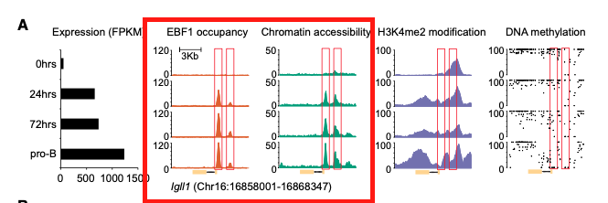

**Author(s)**: `r params$author`  
**Reviewer(s)**: `r params$reviewer`  
**Date**: `r Sys.Date()`  


# Academic Citation
If you use this code in your work or research, we kindly request that you cite our publication:

Xiaofan Lu, et al. (2025). FigureYa: A Standardized Visualization Framework for Enhancing Biomedical Data Interpretation and Research Efficiency. iMetaMed. https://doi.org/10.1002/imm3.70005

```{r setup, include=FALSE}
knitr::opts_chunk$set(echo = TRUE)
```

# 需求描述
# Requirements

以bw或bedgraph文件作为输入，提取信号，用ggplot2画这种峰图。
Take a bw or bedgraph file as input, extract the signal, and plot this peak graph using ggplot2.



出自<http://www.genesdev.org/cgi/doi/10.1101/gad.309583.117>
From <http://www.genesdev.org/cgi/doi/10.1101/gad.309583.117>

Figure 4. Gene-specific analysis of the dynamics of RNA expression, EBF1 occupancy, chromatin accessibility, H3K4me2 modifica- tion, and DNA methylation after EBF1 induction. Representative genes include **Igll1 of cluster U1 (A)**, Cd79a of cluster U4 (B), Pdgfrb of cluster D3 (C ), and Cebpb of cluster D4 (D). The positions of EBF1-bound sites are highlighted with red boxes. The scale of the Y-axis represents RPKM in ChIP-seq and ATAC-seq tracks and percentage in the DNA methylation tracks, in which each black dot represents one CpG.

这篇文章的解读看这里：<https://mp.weixin.qq.com/s/zmf0GMdGZqNxseFZKHooOw>
For an interpretation of this article, see here: <https://mp.weixin.qq.com/s/zmf0GMdGZqNxseFZKHooOw>

其中Figure 2C的画法可参考Figure44profile。
For the plotting of Figure 2C, refer to Figure 44 profile.

FigureYa107ChIPheatmap和FigureYa108RNAseqChIP复现了文中的Figure 2AB和Figure 3AB。
Figure Ya107 ChIP heatmap and Figure Ya108 RNAseq ChIP replicate Figures 2AB and 3AB in the article.

# 应用场景
# Application Scenarios

该图在基因转录调控机制文章里经常出现，在文章里的应用可参考这篇：<https://mp.weixin.qq.com/s/blTL1HIKaOh4IhbmIgXcig>。
This graph frequently appears in articles on gene transcriptional regulation mechanisms. For its application in these articles, see this article: <https://mp.weixin.qq.com/s/blTL1HIKaOh4IhbmIgXcig>.

通常在IGV里查看测序信号分布（bam、bw、wig、bedgraph），这样能够直观地看到基因在哪里转录（RNA-seq）、蛋白质结合在哪里（ChIP-seq）或染色质开放的区域（ATAC-seq）。同样可以看m6A、RIP-seq等数据。
Sequencing signal distribution (bam, bw, wig, bedgraph) is commonly viewed in IGV. This allows for a visual understanding of gene transcription (RNA-seq), protein binding (ChIP-seq), and chromatin access (ATAC-seq). m6A and RIP-seq data can also be viewed.

想把这种图作为Figure放到文章里，有人喜欢用IGV，有人喜欢用WashU brower。群里的小伙伴喜欢自己用代码画图，例如用Gviz画，可参考FigureYa3genomeView；用sushi画，可参考FigureYa82IGVzoom。作者用ggplot2画过这种图，于是请他来分享这套代码。
I'd like to include this type of graph as a figure in my paper. Some people prefer using IGV, while others prefer using the WashU browser. Friends in my group like to create their own graphs using code. For example, if you use Gviz, see FigureYa3genomeView; if you use sushi, see FigureYa82IGVzoom. I've seen the author create this type of graph using ggplot2, so I asked him to share the code.

用ggplot2画图，不仅方便修改细节，还可以很方便的用cowplot把画好的峰图跟其他图拼在一起，cowplot用法可参考这篇<https://mp.weixin.qq.com/s/O9zWCgIgz75Qo7cE6bSZCA>。
Using ggplot2 not only makes it easy to modify details, but also allows you to easily combine the peak plot with other graphs using cowplot. For cowplot usage, see this article <https://mp.weixin.qq.com/s/O9zWCgIgz75Qo7cE6bSZCA>.

跟谁拼一起能充分展示转录调控证据呢？
Which combination will best demonstrate the evidence for transcriptional regulation?

- 可以像例文那样，左边放RNA-seq的bar plot。
- 还可以在下面画个motif的track，甚至把motif的logo加上去。
- You can place an RNA-seq bar plot on the left, as in the example.
- You can also add a motif track below, or even add the motif logo.

# 环境设置
# Environment Setup

画图前的代码需要在terminal里运行，可参考这篇方法<https://www.jianshu.com/p/c16c7095e4b2?from=singlemessage&isappinstalled=0>
Before drawing, the code needs to be run in a terminal. Refer to this method <https://www.jianshu.com/p/c16c7095e4b2?from=singlemessage&isappinstalled=0>

```{r}
source("install_dependencies.R")

library(ggplot2)
library(cowplot)
Sys.setenv(LANGUAGE = "en") #显示英文报错信息
options(stringsAsFactors = FALSE) #禁止chr转成factor
```

# 输入文件的准备
# Preparing input files

## 数据下载
## Data download

如果你的数据是bedgraph格式，就直接跳到“提取所需位置的track信息”。
If your data is in bedgraph format, skip to "Extracting track information for the desired position."

从GEO数据库下载别人已发表的ChIP/ATAC/RNA-seq数据。点击Supplementary file里的custom，勾选想要画的样本的bedgraph或bw或wig文件，点击Download下载。
Download previously published ChIP/ATAC/RNA-seq data from the GEO database. Click "custom" in the Supplementary file section, select the bedgraph, bw, or wig file for the sample you want to plot, and click Download.

- ChIP-seq，GSE107236。作者提供了bedgraph文件<https://www.ncbi.nlm.nih.gov/geo/query/acc.cgi?acc=GSE107236>
- ATAC-seq，GSE107242。作者提供了bigwig文件<https://www.ncbi.nlm.nih.gov/geo/query/acc.cgi?acc=GSE107242>，需要先转换成bedgraph。
- 如果你感兴趣的数据作者没有上传bedgraph或bw或wig文件，可以从SRA格式开始跑，方法可参考FigureYa155ATAC。
- ChIP-seq, GSE107236. The authors provided a bedgraph file <https://www.ncbi.nlm.nih.gov/geo/query/acc.cgi?acc=GSE107236>
- ATAC-seq, GSE107242. The authors also provided a BigWig file <https://www.ncbi.nlm.nih.gov/geo/query/acc.cgi?acc=GSE107242>, which needs to be converted to a bedgraph first.
- If the author of the data you are interested in did not upload a bedgraph, BW, or WIG file, you can start from the SRA format. The method can be found in FigureYa155ATAC.

## bigwig转bedgraph
## Convert BigWig to BedGraph

作者提供的ATAC-seq数据是bigwig文件，需要转换成纯文本文件bedgraph去画图。
The ATAC-seq data provided by the authors is a BigWig file, which needs to be converted to a plain text file called BedGraph for plotting.

把bigwig文件转换成bedgraph，需要用到一个小工具bigWigTobedgraph。
To convert the BigWig file to BedGraph, you need the tool BigWigToBedGraph.

```bash
# 安装bigwigtobedgraph
# Install bigwigtobedgraph
conda install -c bioconda ucsc-bigwigtobedgraph

# bigwig转bedgraph
#bigwig to bedgraph
bigWigToBedGraph -chrom=chr16 -start=16858001 -end=16868347 GSM2863128_N06_0.RPKM_nor.bw 0_ATAC_Igll1.bedgraph
bigWigToBedGraph -chrom=chr16 -start=16858001 -end=16868347 GSM2863129_NO6_24.RPKM_nor.bw 24_ATAC_Igll1.bedgraph
bigWigToBedGraph -chrom=chr16 -start=16858001 -end=16868347 GSM2863130_NO6_72.RPKM_nor.bw 72_ATAC_Igll1.bedgraph
bigWigToBedGraph -chrom=chr16 -start=16858001 -end=16868347 GSM2863131_NO6_cd19pos.RPKM_nor.bw proB_ATAC_Igll1.bedgraph
```

# 提取所需位置的track信息
# Extract the track information for the desired location

例文展示的是Igll1基因附近的区域，把基因位置信息写入Igll1.bed文件，然后提取这段区域的信号，用于画图。
This example shows the region near the Igll1 gene. The gene location information is written to the Igll1.bed file, and the signal in this region is extracted for plotting.

```bash
bedtools intersect -wa -a GSM2863140_Input_NO8_24_mm9.bedGraph -b Igll1.bed> 0_EBF1_Igll1.bedgraph
bedtools intersect -wa -a GSM2863147_EBF1_NO14_24_mm9.bedGraph -b Igll1.bed> 24_EBF1_Igll1.bedgraph
bedtools intersect -wa -a GSM2863148_EBF1_NO14_72_mm9.bedGraph -b Igll1.bed> 72_EBF1_Igll1.bedgraph
bedtools intersect -wa -a GSM2863149_EBF1_NO14_cd19pos_mm9.bedGraph -b Igll1.bed> proB_EBF1_Igll1.bedgraph
```

# 准备基因结构文件
# Prepare the gene structure file

从gtf文件里可以找到基因exon的具体位置。
The specific locations of gene exons can be found in the gtf file.

小鼠和人通常用gencode的基因注释文件。mm9的gtf文件：<https://www.gencodegenes.org/mouse/release_M9.html>。人的<https://www.gencodegenes.org/human/>，其他物种可以从ensembl下载<http://asia.ensembl.org/info/data/ftp/index.html>
Mouse and human gene annotation files are typically generated using Gencode. The mm9 gtf file is available at: <https://www.gencodegenes.org/mouse/release_M9.html>. Human annotations are available at <https://www.gencodegenes.org/human/>. Other species can be downloaded from Ensembl: <http://asia.ensembl.org/info/data/ftp/index.html>.

例文用的Igll1基因包含两个exon的转录本，我们也用这个。ID是ENSMUST00000124649.1。位置：chr16:16860674-16863985。下面就提取这个基因的外显子。
The Igll1 gene used in the example contains two exon transcripts, which we will also use. Its ID is ENSMUST00000124649.1 and its location is chr16:16860674-16863985. Next, we will extract the exons of this gene.

```bash
grep Igll1 gencode.vM9.annotation.gtf | grep ENSMUST00000124649.1 |grep exon | awk '{print $4,$5,$3}' OFS="\t" > Igll1.gene.txt
```

# 开始画图
# Start drawing

策略是用ggplot2画track和gene structure，然后用cowplot拼在一起
The strategy is to use ggplot2 to plot the track and gene structure, then combine them using cowplot.

## 画EBF1的ChIP-seq track
## Draw the ChIP-seq track for EBF1

```{r, fig.width=3, fig.height=7}
# 读入bedgraph
# Read the bedgraph
ebf0 <- read.table("0_EBF1_Igll1.bedgraph",head=F)
head(ebf0)
ebf24 <- read.table("24_EBF1_Igll1.bedgraph",head=F)
ebf72 <- read.table("72_EBF1_Igll1.bedgraph",head=F)
ebf_prob <- read.table("proB_EBF1_Igll1.bedgraph",head=F)

# 读入exon信息，用于画基因结构
# Read exon information for drawing the gene structure
gene <- read.table("Igll1.gene.txt",head=F)
head(gene)

# 自定义主题
# Custom theme
gene_axis_theme <- theme(
		axis.text.x=element_blank(),
		axis.ticks.x=element_blank(),
		axis.line.x=element_blank(),
		axis.text.y=element_blank(),
		axis.ticks.y=element_blank(),
		axis.line.y=element_blank()
)

track_axis_theme <- theme(
		axis.text.x=element_blank(),
		axis.ticks.x=element_blank(),
		axis.line.x=element_blank()
)

# 开始画每一个track
# Start drawing each track
pe0 <- ggplot(ebf0)+
		geom_line(aes((V2+V3)/2,V4),color="#D95F02")+
		geom_area(aes((V2+V3)/2,V4),fill="#D95F02",alpha=.5)+
		theme_classic()+
		labs(x="",y="")+
		coord_cartesian(xlim=c(16858001,16868347),ylim=c(0,170))+
		track_axis_theme

pe1 <- ggplot(ebf24)+
		geom_line(aes((V2+V3)/2,V4),color="#D95F02")+
		geom_area(aes((V2+V3)/2,V4),fill="#D95F02",alpha=.5)+
		theme_classic()+
		labs(x="",y="")+
		coord_cartesian(xlim=c(16858001,16868347),ylim=c(0,170))+
		track_axis_theme


pe2 <- ggplot(ebf72)+
		geom_line(aes((V2+V3)/2,V4),color="#D95F02")+
		geom_area(aes((V2+V3)/2,V4),fill="#D95F02",alpha=.5)+
		theme_classic()+
		labs(x="",y="")+
		coord_cartesian(xlim=c(16858001,16868347),ylim=c(0,170))+
		track_axis_theme


pe3 <- ggplot(ebf_prob)+
		geom_line(aes((V2+V3)/2,V4),color="#D95F02")+
		geom_area(aes((V2+V3)/2,V4),fill="#D95F02",alpha=.5)+
		theme_classic()+
		labs(x="",y="")+
		coord_cartesian(xlim=c(16858001,16868347),ylim=c(0,170))+
		track_axis_theme

# 画基因结构
# 16860674,16863985两个数字来自于转录本的起始和终止。
# 箭头的方向是负向
# Draw the gene structure
# The numbers 16860674 and 16863985 are from the start and end of the transcript.
# Arrow direction is negative
arrow <- data.frame(x=seq(16860674,16863985,length.out=4)[1:3])
peg <- ggplot()+
		geom_segment(data=arrow,aes(x=16863985,xend=x,y=0,yend=0),
		arrow = arrow(),color="#7570B3")+
		geom_rect(data=gene,aes(xmin=V1,xmax=V2,ymin=-1,ymax=1),
		color="#7570B3",fill="#7570B3",alpha=0.5)+
		coord_cartesian(xlim=c(16858001,16868347))+
		theme_classic()+
		labs(x="",y="")+
		gene_axis_theme

plot_grid(pe0,pe1,pe2,pe3,peg,
          ncol=1,align="v",rel_heights=c(1,1,1,1,0.34))
ggsave("ggplot2Gviz_1col.pdf", width = 4, height = 10)
```

## 加上ATAC-seq的track
## Add ATAC-seq track

```{r, fig.width=7, fig.height=7}
at0 <- read.table("0_ATAC_Igll1.bedgraph",head=F)
at24 <- read.table("24_ATAC_Igll1.bedgraph",head=F)
at72 <- read.table("72_ATAC_Igll1.bedgraph",head=F)
at_prob <- read.table("proB_ATAC_Igll1.bedgraph",head=F)

pa0 <- ggplot(at0)+
        geom_line(aes((V2+V3)/2,V4),color="#1B9E77")+
        geom_area(aes((V2+V3)/2,V4),fill="#1B9E77",alpha=.5)+
        theme_classic()+
        labs(x="",y="")+
        coord_cartesian(xlim=c(16858001,16868347),ylim=c(0,50))+
        track_axis_theme

pa1 <- ggplot(at24)+
        geom_line(aes((V2+V3)/2,V4),color="#1B9E77")+
        geom_area(aes((V2+V3)/2,V4),fill="#1B9E77",alpha=.5)+
        theme_classic()+
        labs(x="",y="")+
        coord_cartesian(xlim=c(16858001,16868347),ylim=c(0,50))+
        track_axis_theme

pa2 <- ggplot(at72)+
        geom_line(aes((V2+V3)/2,V4),color="#1B9E77")+                                         
        geom_area(aes((V2+V3)/2,V4),fill="#1B9E77",alpha=.5)+
        theme_classic()+
        labs(x="",y="")+
        coord_cartesian(xlim=c(16858001,16868347),ylim=c(0,50))+
        track_axis_theme

pa3 <- ggplot(at_prob)+
        geom_line(aes((V2+V3)/2,V4),color="#1B9E77")+
        geom_area(aes((V2+V3)/2,V4),fill="#1B9E77",alpha=.5)+
        theme_classic()+
        labs(x="",y="")+
        coord_cartesian(xlim=c(16858001,16868347),ylim=c(0,50))+
        track_axis_theme

# 拼图
# Merge figure
plot_grid(pe0,pa0,pe1,pa1,pe2,pa2,pe3,pa3,peg,peg,
          ncol=2, align="v",
          rel_heights=c(1,1,1,1,0.34))
ggsave("ggplot2Gviz_2col.pdf")
```

# Session Info

```{r}
sessionInfo()
```