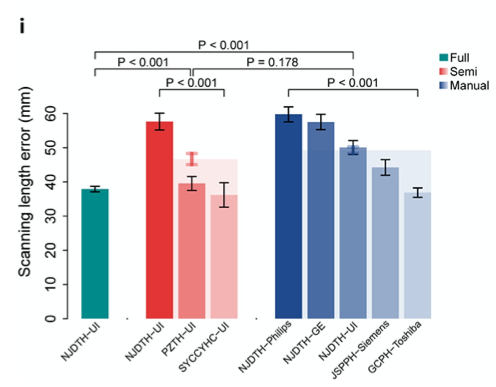

**Author(s)**: `r params$author`  
**Reviewer(s)**: `r params$reviewer`  
**Date**: `r Sys.Date()`  


```{r setup, include=FALSE}
knitr::opts_chunk$set(echo = TRUE)
```

# 需求描述
# Requirement

我想实现这篇文章的Figure 4i和j，是同一种类型的图。这个图，可以比较组内的情况，然后还可以合并组内的数据，再比组间。还有这种可以直接实现出图的代码。
I want to draw as Figures 4i and 4j in this article. They are the same type of graph. This graph allows for comparison within groups, merging data within groups, and comparing across groups. Code is also available to directly generate the graph.



出自<https://doi.org/10.1016/j.ebiom.2020.102724>
From <https://doi.org/10.1016/j.ebiom.2020.102724>

Fig. 4. Practical testing of U-HAPPY CT in three clinical scenarios. 

**图的解读**
**Interpretation of the Figure**

图中绿红蓝是三个大组，内部又用同一色系的渐变色画了多个亚组。
The green, red, and blue colors in the figure represent the three main groups, with multiple subgroups drawn within them using gradients of the same color scheme.

仔细看，其中红色和蓝色大组分别画了半透明的红色和蓝色误差线。
Look closely, the red and blue groups have semi-transparent red and blue error bars, respectively.

用base plot，就像画笔一样，一笔一笔画出想要添加的元素。
Using a base plot is like painting a brush, adding the elements you want, stroke by stroke.

# 应用场景
# Application Scenarios

多组柱状图(mean ± se; se = sd/sqrt(n))，某些组同时存在亚组，并进行组间比较和亚组内比较。
Multiple group bar charts (mean ± se; se = sd/sqrt(n)), with some groups containing subgroups and performing both inter-group and intra-subgroup comparisons.

注意：有些杂志要求，对数据的描述不允许使用se（视觉上感觉离散度更小），要使用sd，请留意。
Note: Some journals prohibit the use of se in data descriptions (visually giving a smaller sense of dispersion). Use sd instead. Please note this.

该绘图代码在出图前需要不断调整坐标或文字位置，需要在理解的基础上加以使用。
This plotting code requires constant adjustment of coordinates or text positions before plotting, so it should be used with understanding.

# 环境设置
# Environment Setup

自定义函数求解se
Custom Function to Solve for se

```{r}
se <- function(x) sd(x)/sqrt(length(x))
```

# 输入文件
# Input File

multicenter_validation_*.txt，每个亚组的观测值对应图中的一个bar，放到一个单独的文件里，只需提供diff这一列。
multicenter_validation_*.txt, where each subgroup's observation corresponds to a bar in the plot. Place these in a separate file. Only the diff column is required.

```{r}
prefix <- "multicenter_validation_" # 输入文件的文件前缀 # File prefix for the input file

# 加载图中绿色大组对应的数据
# Load the data corresponding to the green group in the figure
full1 <- read.table(paste0(prefix,"full_NJDTH_UI.txt"),sep = "\t",check.names = F,stringsAsFactors = F,header = T,row.names = NULL)

# 加载图中红色大组对应的数据
# Load the data corresponding to the red group in the figure
semi1 <- read.table(paste0(prefix,"semi_NJDTH_UI.txt"),sep = "\t",check.names = F,stringsAsFactors = F,header = T,row.names = NULL)
semi2 <- read.table(paste0(prefix,"semi_PZTH_UI.txt"),sep = "\t",check.names = F,stringsAsFactors = F,header = T,row.names = NULL)
semi3 <- read.table(paste0(prefix,"semi_SYCCYHC_UI.txt"),sep = "\t",check.names = F,stringsAsFactors = F,header = T,row.names = NULL)

# 加载图中蓝色大组对应的数据
#Load the data corresponding to the blue group in the picture
manu1 <- read.table(paste0(prefix,"manual_NJDTH_UI.txt"),sep = "\t",check.names = F,stringsAsFactors = F,header = T,row.names = NULL)
manu2 <- read.table(paste0(prefix,"manual_NJDTH_GE.txt"),sep = "\t",check.names = F,stringsAsFactors = F,header = T,row.names = NULL)
manu3 <- read.table(paste0(prefix,"manual_NJDTH_Philips.txt"),sep = "\t",check.names = F,stringsAsFactors = F,header = T,row.names = NULL)
manu4 <- read.table(paste0(prefix,"manual_JSPPH_Siemens.txt"),sep = "\t",check.names = F,stringsAsFactors = F,header = T,row.names = NULL)
manu5 <- read.table(paste0(prefix,"manual_GCPH_Toshiba.txt"),sep = "\t",check.names = F,stringsAsFactors = F,header = T,row.names = NULL)
```

# 计算画图所需的统计量
# Calculate the statistics needed to draw the graph

```{r}
# 1. 计算各亚组均值（注意均值的顺序是后期调整的，根据均值大小[柱子高低]）
# 1. Calculate the mean for each subgroup (note that the order of the means is adjusted later based on the mean size [bar height])
avg <- c(mean(full1$diff),0, # 这里的0是为了柱状图（full和semi）之间的空隙 # The 0 here is for the gap between the bars (full and semi)
         mean(semi1$diff),
         mean(semi2$diff),
         mean(semi3$diff),0, # 这里的0是为了柱状图（semi和manu）之间的空隙 # The 0 here is for the gap between the bars (semi and manu)
         mean(manu3$diff),
         mean(manu2$diff),
         mean(manu1$diff),
         mean(manu4$diff),
         mean(manu5$diff))

# 2. 计算个亚组标准误（注意柱子的顺序要和均值一致，这里的manu组为32145）
# 2. Calculate the standard error for each subgroup (note that the order of the bars must match the mean; here, the standard error for the manu group is 32145)
var <- c(se(full1$diff),0,
         se(semi1$diff),
         se(semi2$diff),
         se(semi3$diff),0,
         se(manu3$diff),
         se(manu2$diff),
         se(manu1$diff),
         se(manu4$diff),
         se(manu5$diff))

# 3. 计算有多个亚组的组均值
# 3. Calculating group means for multiple subgroups
avg_semi <- mean(c(semi1$diff,semi2$diff,semi3$diff))
avg_manu <- mean(c(manu1$diff,manu2$diff,manu3$diff,manu4$diff,manu5$diff))

# 4. 计算有多个亚组的组se
# 4. Calculating group se values for multiple subgroups
var_semi <- se(c(semi1$diff,semi2$diff,semi3$diff))
var_manu <- se(c(manu1$diff,manu2$diff,manu3$diff,manu4$diff,manu5$diff))

# 5. semi亚组的方差分析（可换成kruskal）
# 5. Semi-subgroup ANOVA (can be replaced with Kruskal's method)
tmp <- data.frame(diff = c(semi1$diff,semi2$diff,semi3$diff),
                  class = as.factor(rep(c("A","B","C"), c(nrow(semi1),nrow(semi2),nrow(semi3)))))
saov <- summary(aov(diff~class,tmp)) # intersemi p=6.04e-09

# 6. manual亚组的方差分析（可换成kruskal）
# 6. Manual-subgroup ANOVA (can be replaced with Kruskal's method)
tmp <- data.frame(diff = c(manu1$diff,manu2$diff,manu3$diff,manu4$diff,manu5$diff),
                  class = as.factor(rep(c("A","B","C","D","E"), c(nrow(manu1),nrow(manu2),nrow(manu3),nrow(manu4),nrow(manu5)))))
maov <- summary(aov(diff~class,tmp)) # intermanul p<2e-16

# 6. 组间t检验（可换成wilcox非参检验，未校正）
# 6. Between-group t-test (can be replaced with Wilcox nonparametric test, uncorrected)
fvss.t <- t.test(full1$diff,c(semi1$diff,semi2$diff,semi3$diff))$p.value # full vs semi p=2.194e-06
fvsm.t <- t.test(full1$diff,c(manu1$diff,manu2$diff,manu3$diff,manu4$diff,manu5$diff))$p.value # full vs manul p=1.557547e-18
svsm.t <- t.test(c(semi1$diff,semi2$diff,semi3$diff),c(manu1$diff,manu2$diff,manu3$diff,manu4$diff,manu5$diff))$p.value # semi vs manul p=0.1779296
```

# 开始画图
# Start drawing

代码中常使用到的par("usr")参数简单解释如下：
The par("usr") parameter commonly used in the code is briefly explained as follows:

par("usr)后有4个坐标点，[1]代表图像在水平位置的最左侧，[2]为最右侧，[3]为垂直位置的最低点，[4]为最高点，这在绘制图例的时候很方便找到极端角落位置。
There are 4 coordinate points after par("usr", [1] represents the leftmost horizontal position of the image, [2] the rightmost right position, [3] the lowest vertical point, and [4] the highest point. This is very convenient for finding the extreme corner position when drawing the legend.

```{r}
# 设置颜色 # # Set color #
darkblue   <- "#21498D"
seagreen   <- "#008B8A"
sun        <- "#E53435"
red        <- "red"

# 编写label，注意和均值的柱子一致
# Write label, pay attention to the consistency with the mean column
lab <- c("Full-NJDTH-UI","",
         "Semi-NJDTH-UI","Semi-PZTH-UI","Semi-SYCCYHC-UI","",
         "Manual-NJDTH-Philips","Manual-NJDTH-GE","Manual-NJDTH-UI","Manual-JSPPH-Siemens","Manual-GCPH-Toshiba")

# 绘制基本柱状图
# Draw a basic bar chart
pdf("fancybar.pdf",width = 6,height = 5)
par(bty="o", mgp = c(2,0.5,0), mar = c(7.1,4.1,2.1,4.1),tcl = -.25,las = 1) # 基本设置 # Basic settings
par(xpd = T) # 允许图像超出（一般是为了画图例用） # Allow the plot to extend beyond the bounds (usually for legends)
bar <- barplot(avg, 
               border = F, # 柱子不显示轮廓 # Do not outline the bars
               ylab = "Scanning length error (mm)", # y轴标签 # y-axis label
               ylim = c(0,80), # 高度要比最大的均值要大一些，给添加P值预留空间 # The height should be slightly larger than the maximum mean to allow for adding P values
               yaxt = "n", # 不显示y轴 # Hide the y-axis
               xaxt = "n", # 不显示x轴 # Hide the x-axis
               col = c(seagreen,NA, # 注意颜色的NA是均值为0的部分，为空白柱 # Note that NA in the color represents a blank column with a mean of 0)
                       sun, ggplot2::alpha(sun,0.6), ggplot2::alpha(sun,0.3), NA, # 注意颜色的渐变透明 # Note the color gradient transparency
                       darkblue, ggplot2::alpha(darkblue,0.8), ggplot2::alpha(darkblue,0.6), ggplot2::alpha(darkblue,0.4), ggplot2::alpha(darkblue,0.2)))

axis(side = 2,at = seq(0,60,10)) # 手动添加y轴 # Manually add y-axis

# 添加垂直的误差线
# Add vertical error bars
segments(bar, # 由bar对象确定位置，也就是每个柱子的中心点 # The position is determined by the bar object, that is, the center point of each column
         avg - var, # 下侧最低点，为mean- se # The lowest point on the bottom side is mean-se
         bar,
         avg + var, # 顶部最高点，为mean + se # The highest point on the top is mean + se
         lwd = 1.5)

# 添加水平的误差线
# Add horizontal error bars
arrows(bar, # 同上位置添加水平线 # Add horizontal line at the same position as above
       avg - var, 
       bar,
       avg + var, 
       lwd = 1.5, # 线宽 # Line width
       angle = 90,
       code = 3, length = 0.05)

# 根据bar对象添加x轴标签
# Add x-axis label based on bar object
text(x = bar, 
     y = par("usr")[3] - 1, # 在图像垂直最低点再往下1单位添加x轴标签 # Add x-axis label 1 unit below the lowest vertical point of the image
     srt = 45,
     adj = 1, labels =lab, xpd = TRUE, cex = 0.6)

# 添加图例
# Add legend
par(xpd = T)
legend(par("usr")[2]-0.5, # 水平最右侧向内0.5  # Horizontally rightmost 0.5 inward
       par("usr")[4],  # 垂直最顶上 # Vertically top
       legend = c("Full","Semi","Manual"), # 原文中带有渐变的图例是后期AI的，因为考虑到柱子本身存在渐变 # The original legend with gradient is a later AI, because the column itself has a gradient
       fill = c(seagreen,sun,darkblue),
       cex=0.8, 
       border=NA, 
       y.intersp=1, 
       x.intersp=0.2,
       bty = "n") # 不要图例边框 # No legend border

# 添加semi亚组的背景透明区块（这里要好好体会坐标）
# Add background transparent block of semi subgroup (here you need to understand the coordinates well)
par(new = T,xpd = F) # 新添加图层，允许元素超过边界 # Add a new layer, allowing elements to exceed the boundary
rect(xleft = bar[3]-0.5,# 红色semi组的左侧外缘在bar对象x轴第三个点-0.5的位置（每个柱子宽1，左右各0.5）# The left outer edge of the red semi group is at the position -0.5 of the third point on the x-axis of the bar object (each column is 1 wide, 0.5 on each side)
     ybottom = 0, # y轴底为0 # The bottom of the y-axis is 0
     xright = bar[5]+0.5, # 同理x轴右侧在第五个点向右再+0.5 # Similarly, the right side of the x-axis is +0.5 to the right of the fifth point
     ytop = avg_semi, # y顶就是组均值 # The top of the y-axis is the group mean
     col = ggplot2::alpha(sun,0.1), # 透明色 # Transparent color
     border = NA)

# 同理添加误差线（线稍微粗一些，颜色透明）
# Similarly, add error bars (the line is slightly thicker and the color is transparent)
segments(bar[4], # 在bar的第四个点，也就是红色亚组最中间的点上添加 # Add to the fourth point of the bar, which is the middle point of the red subgroup
         avg_semi - var_semi,
         bar[4],
         avg_semi + var_semi, 
         lwd = 4,
         col = ggplot2::alpha(red,0.4))
arrows(bar[4], 
       avg_semi - var_semi, 
       bar[4],
       avg_semi + var_semi, 
       lwd = 4, angle = 90,
       code = 3, length = 0.05,col = ggplot2::alpha(sun,0.4),lty = 2)

# 同理添加manua亚组的背景透明区块和误差线
# Similarly, add transparent background blocks and error bars for the manua subgroup
rect(bar[7]-0.5,
     0,
     bar[11]+0.5,
     avg_manu,
     col = ggplot2::alpha(darkblue,0.1),border = NA)
segments(bar[9], 
         avg_manu - var_manu, 
         bar[9],
         avg_manu + var_manu,
         lwd = 4,col = ggplot2::alpha(darkblue,0.4))
arrows(bar[9], 
       avg_manu - var_manu, 
       bar[9],
       avg_manu + var_manu, lwd = 4, angle = 90,
       code = 3, length = 0.05,col = ggplot2::alpha(darkblue,0.4),lty = 2)

# 添加P值，觉得坐标调整麻烦的可以直接在AI里画
# Add P value. If you find it troublesome to adjust the coordinates, you can draw it directly in AI.
# full vs semi
par(xpd = F)
segments(bar[1],73,bar[4]-0.05,73) # 这里的坐标，主要是高度要耐心调整 # The coordinates here are mainly about the height. Please adjust them patiently.
segments(bar[1],73,bar[1],71)
segments(bar[4]-0.05,73,bar[4]-0.05,71)
text(x = (bar[1]+bar[4])/2,
     y = 75,
     ifelse(fvss.t < 0.001,"P < 0.001",
            paste0("P = ",round(fvss.t,3))),
     cex = 0.8)

# semi vs manul
segments(bar[4]+0.05,73,bar[9],73)
segments(bar[4]+0.05,73,bar[4]+0.05,71)
segments(bar[9],73,bar[9],71)
text(x = (bar[4]+bar[9])/2,
     y = 75,
     ifelse(svsm.t < 0.001,"P < 0.001",
            paste0("P = ",round(svsm.t,3))),
     cex = 0.8)

# full vs manul
segments(bar[1],78,bar[9],78)
segments(bar[1],78,bar[1],76)
segments(bar[9],78,bar[9],76)
par(xpd = T)
text(x = (bar[1]+bar[9])/2,
     y = 80,
     ifelse(fvsm.t < 0.001,"P < 0.001",
            paste0("P = ",round(fvsm.t,3))),
     cex = 0.8)
par(xpd = F)

# intersemi
segments(bar[3],67,bar[5],67)
segments(bar[3],67,bar[3],65)
segments(bar[5],67,bar[5],65)
text(x = bar[4],
     y = 69,
     ifelse(saov[[1]]$`Pr(>F)`[1] < 0.001,"P < 0.001",
            paste0("P = ",round(saov[[1]]$`Pr(>F)`[1],3))),
     cex = 0.8)

# intermanul
segments(bar[7],67,bar[11],67)
segments(bar[7],67,bar[7],65)
segments(bar[11],67,bar[11],65)
text(x = bar[9],
     y = 69,
     ifelse(maov[[1]]$`Pr(>F)`[1] < 0.001,"P < 0.001",
            paste0("P = ",round(maov[[1]]$`Pr(>F)`[1],3))),
     cex = 0.8)

# 关闭图像句柄
# Close image handle
invisible(dev.off())
```


# Session Info

```{r}
sessionInfo()
```