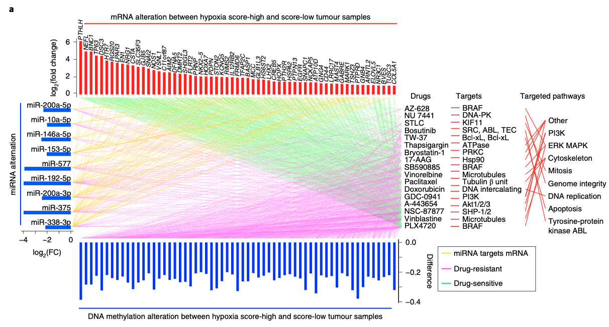

**Author(s)**: `r params$author`  
**Reviewer(s)**: `r params$reviewer`  
**Date**: `r Sys.Date()`  

# Academic Citation
If you use this code in your work or research, we kindly request that you cite our publication:

Xiaofan Lu, et al. (2025). FigureYa: A Standardized Visualization Framework for Enhancing Biomedical Data Interpretation and Research Efficiency. iMetaMed. https://doi.org/10.1002/imm3.70005

```{r setup, include=FALSE}
knitr::opts_chunk$set(echo = TRUE)
```

# 需求描述

# Requirement

这篇文章自带的R代码里没找到这张图的代码……
I couldn't find the code for this graph in the R code provided with this article...

我其实就想要基因表达和药物连线，他右侧target 和pathway的连线。
Actually, I just want the connection between gene expression and drugs, the connection on the right side of the target and pathway.

感觉用的地方其实挺多的，想学学连线的方法。
It seems that there are actually quite a few places where it can be used. I want to learn the method of connecting lines.



出自<https://doi.org/10.1038/s42255-019-0045-8>

Fig. 5 | Effects of multidimensional hypoxia-associated signatures on drug response. a, Interaction of hypoxia-associated mRNAs, DNA methylation, miRNAs and drug response. Upregulated genes (red bars in upper panel) in hypoxia score-high ESCA negatively correlate (green lines, drug-sensitive) with the response to 17 drugs. Downregulated miRNAs (blue bars, left panel), hypomethylation (blue bars, bottom panel) for the corresponding upregulated genes positively correlate (magenta lines, drug-resistant) to drug response. The target genes and targeted pathways of drugs are listed in the panel to the right. The gold line indicates miRNA-targeted mRNAs; the red line links the drug to its target and targeted pathway. DNA-PK, DNA-dependent protein kinase; Hsp90, heat shock protein 90; KIF11, kinesin family member 11; PRKC, serine/threonine-protein kinase; SHP-1/2, Src homology 2 domain- containing protein tyrosine phosphatase 1/2; STLC, S-trityl-l-cysteine. 

# 应用场景

# Application Scenarios

任意两组、多组连线。
Connect any two or more groups.

多列或上下左右的排布方式。
Multi-column or up-down, left-right arrangement.

根据自己数据的生物学意义，来排列各个节点的顺序。或许能够出现特殊的模式，从而展示出有意义的生物学规律。
Arrange the order of each node based on the biological significance of your own data. Perhaps special patterns can emerge, thereby revealing meaningful biological laws.

# 环境设置

# Environment Setup

```{r}
source("install_dependencies.R")
source("crosslink.R") # From R package crosslink
source("layout.R") # From R package crosslink
source("transfromation.R") # From R package crosslink
source("utils.R") # From R package crosslink
source("crossplot.R") # From R package crosslink

library(ggplot2)
library(aplot)
library(dplyr)
library(scales)

Sys.setenv(LANGUAGE = "en") #显示英文报错信息
options(stringsAsFactors = FALSE) #禁止chr转成factor
```

# 输入文件

# Input File

easy_input_nodes.txt，所有节点id及其类别type。
easy_input_nodes.txt, all node ids and their category types.

easy_input_edges.txt，每两个被连起来的节点为一行。
easy_input_edges.txt, every two concatenated nodes form one line.

```{r}
# 载入连线所需的节点类型
# Load the node types required for the connection
nodes <- read.table("easy_input_nodes.txt", header = T)
head(nodes)
table(nodes$type)

# 载入连线所需的节点间的关系
# Load the relationships between the nodes required for the connection
edges <- read.table("easy_input_edges.txt", header = T)
head(edges)
```

为了画上下左三面的bar plot，需提供节点对应的数值：
In order to draw the bar plots on the top, bottom and left sides, the corresponding values of the nodes need to be provided:

- easy_input_geneData.txt
- easy_input_methData.txt
- easy_input_mirData.txt

```{r fig.width=10, fig.height=6}
# 载入画bar plot所需的数值
# Load the values required for drawing the bar plot
geneData <- read.table("easy_input_geneData.txt", header = T)
head(geneData)
methData <- read.table("easy_input_methData.txt", header = T)
head(methData)
mirData <- read.table("easy_input_mirData.txt", header = T)
head(mirData)
```

## 左右连线（列之间）

## Left and right lines (between columns)

左右多列之间连线，用columnCross函数来画。
Draw the lines connecting multiple columns on the left and right using the columnCross function.

两列
Two columns

```{r}
columns <- list(
  Target = nodes$id[nodes$type == "Tar"], # set the order as you like
  Pathway = nodes$id[nodes$type == "Path"]# set the order as you like
)
columns
columnCross(edges, columns, height = 10, flank_mult = 0.1, segment_shrink = 0.2) +
     scale_color_manual(values = "navy") # 自定义线的颜色 # Customize the color of the line
ggsave("squareCross_2.pdf", width = 5, height = 5)
```

三列
Three columns

```{r}
columns <- list(
  #用输入文件中的默认顺序 # Use the default order in the input file
  Drug = nodes$id[nodes$type == "Drug"],
  #也可以换成下面这行，手动按自己想要的顺序写入 
  # Can also be replaced with the following line, and you can manually write in the order you want
  #Drug = c("Drug3", "Drug2", "Drug1", "Drug4", "Drug5", "Drug8", "Drug7", "Drug6"),
  Target = nodes$id[nodes$type == "Tar"], # set the order as you like
  Pathway = nodes$id[nodes$type == "Path"]# set the order as you like
)
columns
columnCross(edges, columns, height = 10, flank_mult = 0.1, segment_shrink = 0.2) +
  scale_color_manual(values = c("navy","red")) # 自定义线的颜色 # Customize the color of the line
ggsave("squareCross_3.pdf", width = 5, height = 5)
```

四列
Four columns

```{r}
columns <- list(
  Gene = nodes$id[nodes$type == "Gene"],
  Drug = nodes$id[nodes$type == "Drug"],
  Target = nodes$id[nodes$type == "Tar"], # set the order as you like
  Pathway = nodes$id[nodes$type == "Path"]# set the order as you like
)
columns
columnCross(edges, columns, height = 10, flank_mult = 0.1, segment_shrink = 0.2) +
  scale_color_manual(values = c("navy","red","orange")) # 自定义线的颜色 
# Customize the color of the line
ggsave("squareCross_4.pdf", width = 6, height = 5)
```

## 上下左右连线（行、列之间）

## Lines connecting up, down, left and right (between rows and columns)

上下左右连线，用squareCross函数来画
Draw the lines up, down, left and right using the squareCross function

```{r}
top <- nodes$id[nodes$type == "Gene"] # set the order as you like
bottom <- nodes$id[nodes$type == "Meth"] # set the order as you like
left <- nodes$id[nodes$type == "Mir"] # set the order as you like
right <- nodes$id[nodes$type == "Drug"] # set the order as you like

squareCross(edges, top ,bottom, left, right, 
            height = 10, width = 10, flank_mult = 0.1,
            show_node_label = T) + # 显示node label # Show node label
  # 自定义线的颜色 # Customize the color of the line
  scale_color_manual(values = c("navy", "red", "yellow", "forestgreen"))
ggsave("squareCross_22.pdf", width = 5, height = 5)
```

## 复现原图

## Reproduce the original image

```{r fig.width=10, fig.height=8}
# 例文顶部按基因变化倍数从高到低排序，底部跟顶部一致
#The top of the example text is sorted by the multiple of genetic changes from high to low, and the bottom is consistent with the top
top <- geneData$gene[order(geneData$lfc, decreasing = T)] # set the order as you like
bottom <- methData$meth[order(geneData$lfc, decreasing = T)] # In this case, Meth should be the same order with Gene
left <- nodes$id[nodes$type == "Mir"] # set the order as you like
right <- nodes$id[nodes$type == "Drug"] # set the order as you like

# 右侧要画的3列
# The three columns to be drawn on the right
columns <- list(
  Drug = nodes$id[nodes$type == "Drug"], # set the order as you like
  Target = nodes$id[nodes$type == "Tar"], # set the order as you like
  Pathway = nodes$id[nodes$type == "Path"]# set the order as you like
)

height <- 10
width <- 10
flank_mult <- c(top = 0.1, bottom = 0.1,left = 0.1, right = 0.1)

# 先分别画出3个bar plot
# First, draw three bar plots respectively
topAnn <- geneData %>%
  mutate(gene_f = factor(gene, top)) %>%
  ggplot(mapping = aes(
    newCoord(gene_f, width, flank_mult[['top']]),
    lfc)) +
  geom_bar(fill = "red",
           stat = "identity",
           width = 0.5) + # 间距跟bar同宽 # The spacing is the same width as the bar
  geom_text(mapping = aes(label = gene), angle = 90, hjust =-0.2, fontface ="italic") +
  labs(x = NULL, y = "log2(Fold Change)") +
  theme_classic() +
  theme(axis.text.x = element_blank(),
        axis.line.x = element_blank(),
        axis.ticks.x = element_blank())
#topAnn

# Bottom plot
botAnn <- methData %>%
  mutate(meth_f = factor(meth, bottom)) %>%
  ggplot(mapping = aes(newCoord(meth_f, width, flank_mult[['bottom']]),
                       lfc)) +
  geom_bar(fill = "blue",
           stat = "identity",
           width = 0.5) +
  #geom_text(mapping = aes(label = gene), angle = 90, hjust =-0.2, fontface ="italic") +
  labs(x = NULL, y = "Difference") +
  theme_classic() +
  theme(axis.text.x = element_blank(),
        axis.line.x = element_blank(),
        axis.ticks.x = element_blank())
#botAnn

# left plot
lftAnn <- mirData %>%
  mutate(mir_f = factor(mir, left)) %>%
  ggplot(mapping = aes(newCoord(mir_f, height, flank_mult[['left']]),
                       lfc)) +
  geom_bar(fill = "red",
           stat = "identity", 
           width = 0.5) +
  geom_text(mapping = aes(y = 0,label = mir), 
            #fontface ="italic", 
            vjust = -1, 
            hjust = 1) +
  labs(x = NULL, y = "log2(Fold Change)") +
  theme_classic() +
  theme(axis.text.y = element_blank(),
        axis.line.y = element_blank(),
        axis.ticks.y = element_blank()) +
  coord_flip()
#lftAnn

# 画连线并跟3个bar plot拼一起
# Draw the lines and combine them with the three bar plots
p <- (squareCross(edges, top ,bottom, left, right, height = 10, width = 10, flank_mult = 0.1) +
        #自定义配色，例文把miRNA和DNA甲基化都归为resistant，因此这两个方向的连线都用了紫色
        # Custom color matching: In the example text, both miRNA and DNA methylation are classified as resistant, so the connections in these two directions are all purple
        #实际应用时，根据自己数据的意义调整颜色
        #When applying it in practice, adjust the color according to the meaning of your data
        scale_color_manual(values = c("purple", "purple", "yellow", "green"))) %>%
  insert_top(topAnn, 0.4) %>%
  insert_bottom(botAnn, 0.4) %>%
  insert_left(lftAnn, 0.4) %>%
  
  # 在右侧加入多列之间的连线
  # Add connections between multiple columns on the right side
  insert_right(columnCross(edges, columns, height = 10, flank_mult = 0.1, segment_shrink = 0.2) +
     scale_color_manual(values = c("red", "red")) , 0.6)
p
ggsave(plot = p, filename = "squarecross.pdf", width = 8, height = 5)
```

# 后期处理

# Post-processing

输出的pdf文件是矢量图，可以用矢量图编辑器打开（例如Illustrator）调整图形、文字。
The output pdf file is a vector graphic, which can be opened with a vector graphic editor (such as Illustrator) to adjust the graphics and text.

# 附：示例数据生成过程

# Attached: Sample data generation process

```{r example_data, eval = F, include=T}
# nodes
nodes <- data.frame(
  id = c(paste0("Gene", 1:10), paste0("Meth", 1:10),
         paste0("Mir", 1:6), paste0("Drug", 1:8),
         paste0("Tar", 1:8), paste0("Path", 1:6)),
  type = c(rep("Gene", 10), rep("Meth", 10), 
           rep("Mir", 6), rep("Drug", 8),
           rep("Tar", 8), rep("Path", 6))
  )
# 保存到文件 # Save to file
write.table(nodes, "easy_input_nodes.txt", quote = F, sep = "\t", row.names = F)

# edges
edges <- data.frame(rbind(
  # gene vs mir
  data.frame(
    source = sample(nodes$id[nodes$type == "Gene"],
                    replace = T, 30),
    target = sample(nodes$id[nodes$type == "Mir"],
                    replace = T, 30)),
  # gene vs drug
  data.frame(
    source = sample(nodes$id[nodes$type == "Gene"],
                    replace = T, 100),
    target = sample(nodes$id[nodes$type == "Drug"],
                    replace = T, 100)),
  # meth vs drug
  data.frame(
    source = sample(nodes$id[nodes$type == "Meth"],
                    replace = T, 100),
    target = sample(nodes$id[nodes$type == "Drug"],
                    replace = T, 100)),
  # mir vs drug
  data.frame(
    source = sample(nodes$id[nodes$type == "Mir"],
                    replace = T, 20),
    target = sample(nodes$id[nodes$type == "Drug"],
                    replace = T, 20)),
  
  # drug vs target
  data.frame(
    source = nodes$id[nodes$type == "Drug"],
    target = nodes$id[nodes$type == "Tar"]),
  # target vs path
  data.frame(
    source = sample(nodes$id[nodes$type == "Tar"],
                    replace = T, 15),
    target = sample(nodes$id[nodes$type == "Path"],
                    replace = T, 15))
))
write.table(edges, "easy_input_edges.txt", quote = F, sep = "\t", row.names = F)

# gene annotation
geneData <- data.frame(
  gene = nodes$id[nodes$type == "Gene"],
  lfc = runif(length(nodes$id[nodes$type == "Gene"]), 0, 6))
write.table(geneData, "easy_input_geneData.txt", quote = F, sep = "\t", row.names = F)

# meth annotation
methData <- data.frame(
  meth = nodes$id[nodes$type == "Meth"],
  lfc = runif(length(nodes$id[nodes$type == "Meth"]), -0.5, -0.2))
write.table(methData, "easy_input_methData.txt", quote = F, sep = "\t", row.names = F)

# mir annotation
mirData <- data.frame(
  mir = nodes$id[nodes$type == "Mir"],# set the order as you want
  lfc = runif(length(nodes$id[nodes$type == "Mir"]), -4,0))
write.table(mirData, "easy_input_mirData.txt", quote = F, sep = "\t", row.names = F)
```

# Session Info

```{r}
sessionInfo()
```