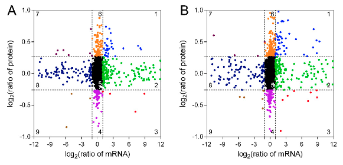
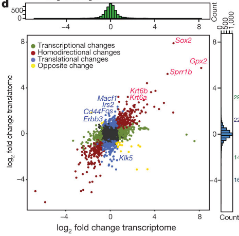
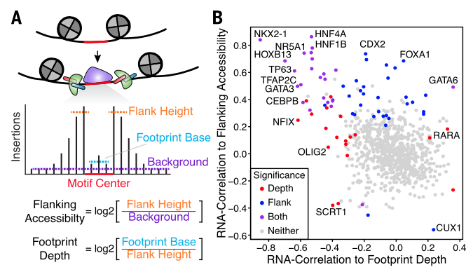

**Author(s)**: `r params$author`  
**Reviewer(s)**: `r params$reviewer`  
**Date**: `r Sys.Date()`  

# Academic Citation
If you use this code in your work or research, we kindly request that you cite our publication:

Xiaofan Lu, et al. (2025). FigureYa: A Standardized Visualization Framework for Enhancing Biomedical Data Interpretation and Research Efficiency. iMetaMed. https://doi.org/10.1002/imm3.70005

```{r setup, include=FALSE}
knitr::opts_chunk$set(echo = TRUE)
```

# 需求描述

# Requirement

画出文章中这种九宫格的散点图，在图中标出想突出显示的基因名。
Draw a scatter plot of the nine-square grid in the article and mark the names of the genes you want to highlight on the plot.



出自<dx.doi.org/10.3390/ijms21051686>
from<dx.doi.org/10.3390/ijms21051686>

Figure 5. Relationship between mRNA and protein expression in TW/NW (A) and TW/OW (B).



出自<www.nature.com/articles/nature21036>
from<www.nature.com/articles/nature21036>

Figure 1. The translational landscape of the epidermis during premalignant transformation. d, Transcriptional and translational changes comparing SOX2 with wild-type P4 epidermis. Colour-coded are genes with the adjusted P value < 0.05 (DESeq2; ref. 43; n = 3 per group for ribosome profiling; n =2 for RNA-seq).



出自<https://science.sciencemag.org/content/362/6413/eaav1898>
fromhttps://science.sciencemag.org/content/362/6413/eaav1898

# 应用场景

# Application Scenarios

同时展示两种特征，尤其适合多组学关联的展示。
Simultaneously presenting two features is particularly suitable for the display of multi-omics associations.

- 像前两篇例文那样，RNA-seq跟蛋白质组数据，展示同一基因在两个维度的一致性。或者RNA-seq跟ATAC-seq，或者RNA-seq跟ChIP-seq，也是同样的道理。
  As in the previous two sample articles, RNA-seq and proteomic data demonstrate the consistency of the same gene in two dimensions. The same principle applies to RNA-seq and ATAC-seq, or RNA-seq and ChIP-seq.
- 像第三篇例文那样，ATAC-seq数据，展示accessibility跟footprint depth的关系。
  As in the third example, the ATAC-seq data shows the relationship between accessibility and footprint depth.
- 展示同一样本的两种生物学/临床特征。
  Display two biological/clinical characteristics of the same sample.

另外可参考这两个FigureYa：
In addition, you can refer to these two figureYa:

- 同时展示两组数据相关性的FigureYa163TwoVarCor；
  FigureYa163TwoVarCor simultaneously presents the correlation between two sets of data;
- 展示相关性的同时给出各区域点所占的比例的FigureYa143survCor。
  FigureYa143survCor shows the correlation while providing the proportion of each regional point.

# 环境设置

# Environment Setup

```{r}
source("install_dependencies.R")

library(dplyr)
library(ggplot2)
library(ggrepel)
library(cowplot)

Sys.setenv(LANGUAGE = "en") #显示英文报错信息 # displays an English error message
options(stringsAsFactors = FALSE) #禁止chr转成factor # prohibit chr from being converted to factor
```

# 输入文件

# Input File

easy_input.txt，每行一个点，第一列为点的ID，第二列x作为横坐标，第三列y作为纵坐标。
easy_input.txt, each line contains one point. The first column is the point ID, the second column x serves as the abscissa, and the third column y serves as the ordinate.

示例数据每个点代表一个基因，x为该基因转录水平的变化倍数，y为蛋白水平变化倍数。
Each point in the sample data represents a gene, where x is the multiple of change at the transcriptional level of the gene and y is the multiple of change at the protein level.

```{r}
# 读取数据 # Reading Data
data <- read.table("easy_input.txt", header = T, row.names = 1)
head(data)
tail(data)
```

# 开始画图

# Start drawing

```{r, fig.width=7, fig.height=7}
# 要显示名称的点的ID
# The ID of the point whose name is to be displayed
# 一定要跟输入文件easy_input.txt文件中的第一行一致
# It must be consistent with the first line in the input file easy_input.txt
genes_to_showname <- c("gene1", "gene2", "gene3", "gene114", "gene3552")
# 如果不想显示点的ID，就用下面这行
# If you don't want to display the ID of the dot, use the following line
#genes_to_showname <- ""

data$gene_label <- ""
data[genes_to_showname, ]$gene_label <- genes_to_showname

# 设置常用变量，根据自己的数据调整
# Set common variables and adjust them according to your own data
xmin <- -1    # x轴用于数据划分象限最小值
# The X-axis is used for the minimum value of the data partitioning quadrant
xmax <- 1     # x轴用于数据划分象限最大值
# The X-axis is used for the maximum value of the data partitioning quadrant
ymin <- -0.25 # y轴用于数据划分象限最小值
 # The Y-axis is used for the minimum value of the data partitioning quadrant
ymax <- 0.25  # y轴用于数据划分象限最大值
# The Y-axis is used to divide the maximum value of the data quadrant

x_axis_min <- -12  # 画图时x轴最小值 # minimum value on the X-axis when drawing
x_axis_max <- 12   # 画图时x轴最大值 # is the maximum value of the X-axis when plotting
y_axis_min <- -1   # 画图时y轴最小值 # minimum Y-axis when plotting
y_axis_max <- 1    # 画图时y轴最大值  # the maximum value on the Y-axis when plotting

xlab <- "log2(ratio of mRNA)"      # x轴标签名称 # X-axis label name
ylab <- "log2(ratio of protein)"   # y轴标签名称 # Y-axis label name

x_tick_pos <- seq(x_axis_min, x_axis_max, 3)
y_tick_pos <- seq(y_axis_min, y_axis_max, 0.5)

# 点的颜色 
# The color of the dot
point_color <- c("#0003f8", "#00c200", "#f4050b", "#d002ea", "#000000", "#ff7c00", "#710749", "#08048c", "#9b6815") 
names(point_color) <- c("Q1", "Q2", "Q3", "Q4", "Q5", "Q6", "Q7", "Q8", "Q9")

# 数据划分象限
# Data Quadrant Division
data <- data %>% mutate(quadrant = case_when(
    x > xmax & y > ymax ~ "Q1",
    x > xmax & y <= ymax & y > ymin ~ "Q2",
    x > xmax & y <= ymin ~ "Q3",
    x <= xmax & x > xmin & y <= ymin ~ "Q4",
    x <= xmax & x > xmin & y > ymin & y <= ymax ~ "Q5",
    x <= xmax & x > xmin & y > ymax ~ "Q6",
    x <= xmin & y > ymax ~ "Q7",
    x <= xmin & y <= ymax & y > ymin ~ "Q8",
    x <= xmin & y <= ymin ~ "Q9"))
head(data)

# 象限名称准备
# Quadrant Name Preparation
annotate_x <- c(rep(x_axis_max, 3), rep((x_axis_min+x_axis_max)/2, 3), rep(x_axis_min, 3))
annotate_y <- rep(c(y_axis_max, (y_axis_min+y_axis_max)/2, y_axis_min), 3)
annotate_text_color <- c(rep("black", 4), "white", rep("black", 4))  #象限名称颜色 # quadrant name color

# 画图
# Drawing
p <- ggplot(data) + 
    geom_point(aes(x=x, y=y, color=quadrant), size=2) + 
    coord_cartesian(xlim=c(x_axis_min, x_axis_max), 
                    ylim=c(y_axis_min, y_axis_max)) + 
    
    # 画虚线
    # Draw a dotted line
    geom_vline(xintercept=c(xmin, xmax), size=0.3, linetype="dashed") + 
    geom_hline(yintercept=c(ymin, ymax), size=0.3, linetype="dashed") +
    
    # 9个象限的名称
    # Names of the 9 quadrants
    annotate("text", x=annotate_x, y=annotate_y, label=c(1,2,3,6,5,4,7,8,9), color=annotate_text_color) + 
    
    labs(x=xlab, y=ylab) + 
    theme_bw() + 
    theme(legend.position="none", panel.grid=element_blank()) + 
    scale_colour_manual(values=point_color) + 
    scale_x_continuous(breaks=x_tick_pos) +
    scale_y_continuous(breaks=y_tick_pos)
p
ggsave("quadrant.pdf", width = 7, height = 7)

# 是否显示特定基因的名称
# Whether to display the name of a specific gene
if (length(genes_to_showname) > 0) {
    p <- p + 
        geom_text_repel(aes(x=x, y=y, label=gene_label, color = quadrant), 
                        size=5, 
                        box.padding = unit(0.35, "lines"), 
                        point.padding = unit(0.3, "lines"))
}

# 在顶部和右侧添加x和y轴hist图
# Add x and Y-axis hist diagrams at the top and on the right
hist_x <- ggplot(data, aes(x=x)) + 
    geom_histogram(bins=100, 
                   color="black", fill = "#4BB33B") +
    coord_cartesian(xlim=c(x_axis_min, x_axis_max)) +
    theme_bw() + 
    theme(panel.grid=element_blank(), 
          axis.text.x=element_blank(), 
          axis.ticks.x=element_blank(),
          axis.title.x=element_blank()) +
    xlab(NULL)
#hist_x

hist_y <- ggplot(data, aes(x=y)) + 
    geom_histogram(bins=100, 
                   color="black", fill = "#5981CE") +
    coord_flip(xlim=c(y_axis_min, y_axis_max)) + 
    theme_bw() + 
    theme(panel.grid=element_blank(), axis.text.y=element_blank(), axis.ticks.y=element_blank() ,axis.title.y=element_blank()) +
    xlab(NULL)
#hist_y

empty <- ggplot() + theme_void()

# 拼图
# Jigsaw Puzzle
a  <- plot_grid(hist_x, p, ncol=1, rel_heights=c(1,6), align="v")
b  <- plot_grid(empty, hist_y, ncol=1, rel_heights=c(1,6))
p_final <- plot_grid(a, b, rel_widths=c(6,1))
p_final

# 输出pdf
# Output pdf
pdf("quadrant_plus.pdf", height=7, width=7)
print(p_final)
dev.off()
```

# Session Info

```{r}
sessionInfo()
```
