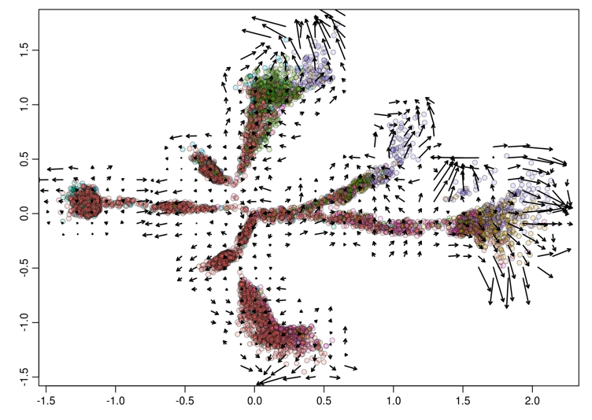

**Author(s)**: `r params$author`  
**Reviewer(s)**: `r params$reviewer`  
**Date**: `r Sys.Date()`  


# Academic Citation
If you use this code in your work or research, we kindly request that you cite our publication:

Xiaofan Lu, et al. (2025). FigureYa: A Standardized Visualization Framework for Enhancing Biomedical Data Interpretation and Research Efficiency. iMetaMed. https://doi.org/10.1002/imm3.70005

```{r setup, include=FALSE}
knitr::opts_chunk$set(echo = TRUE)
```

# 需求描述

# Requirement

使用velotyto对单细胞数据进行RNA velocity分析
RNA velocity analysis of single-cell data was performed using velotyto


出自<https://doi.org/10.1172/jci.insight.131092>
fromhttps://doi.org/10.1172/jci.insight.131092

Figure 3. Transcriptional activity in aging cardiac fibroblasts. (D) Transcriptional activity was estimated by measuring the ratio between unspliced and spliced mRNAs. This so-called RNA velocity is represented by high-dimensional vectors; **the longer the arrow in the plot, the higher the transcriptional activity** as seen in the extremities of states h, j, and l plot containing mostly old cells.

# 应用场景

# Application Scenarios

RNA velocity（RNA速率），即RNA丰度的时间导数，可以通过区分标准单细胞RNA测序中未剪接和剪接的mRNA来预测估计。研究人员认为RNA速率是一个矢量，能预测未来几小时的单细胞状态。RNA速率将极大地帮助研究人员分析发育谱系和细胞动力学。
RNA velocity, the time derivative of RNA abundance, can be predicted and estimated by distinguishing between unspliced and spliced mrnas in standard single-cell RNA sequencing. Researchers believe that the RNA rate is a vector that can predict the state of a single cell in the coming hours. The RNA rate will greatly assist researchers in analyzing developmental lineages and cell dynamics.

可以从fastq开始运行，也可以从matrix开始运行。
It can start running from fastq or from matrix.

# 下载原始数据

# Download the original data

[原始数据在此](ftp://ftp.ebi.ac.uk/pub/databases/microarray/data/experiment/MTAB/E-MTAB-7869/)
[in the original data](ftp://ftp.ebi.ac.uk/pub/databases/microarray/data/experiment/MTAB/E-MTAB-7869/)

直接运行script文件夹下的`01-download.sh`下载数据。
Run '01-download.sh' directly in the script folder to download the data.

# 环境设置

# Environment Setup

见`scripts/s0_createEnv.Rmd`
See 'scripts/s0_createEnv.Rmd'

文章的环境配置如下
The environment configuration of the article is as follows

| 软件Software | 版本Version | 本教程的版本The version of this tutorial |
| :----------: | :---------: | :--------------------------------------: |
|    Seurat    |    2.2.0    |                  2.2.0                   |
|   Monocle    |     2.4     |                   2.14                   |
|  velocyto.R  |    0.17     |                   0.60                   |
|  cellranger  |    2.1.0    |                  3.1.0                   |

## 安装和配置cellranger

## Install and configure cellranger

### cellranger安装 

### Cellranger Installation

参考[10X官方文档](https://support.10xgenomics.com/single-cell-gene-expression/software/pipelines/latest/installation)，直接下载最新版安装。
Reference [10] official document x (https://support.10xgenomics.com/single-cell-gene-expression/software/pipelines/latest/installation), Download the latest version directly and install it.

### Make reference

cellranger官网有做好的mm10的reference，但是作者没有直接采用。
The cellranger official website has a reference for the well-made mm10, but the author did not directly adopt it.

> Reads were aligned to GRCm38 reference genome, and gene annotation was extracted from gencode
> vM12.  Intronic mapped reads were assumed to be part of pre-mRNAs; therefore, they were also assigned to the respective gene.  Because Cell Ranger counts only those reads that map to exons, we created a **modifed gene transfer format file**, which **denotes each gene transcript locus as 1 exon and rebuilt a Cell Ranger reference (cellranger mkref). **This step was necessary because of a high number of pre-mRNA in nuclei.

作者采用的是基因组序列[GRCm38](ftp://ftp.ebi.ac.uk/pub/databases/gencode/Gencode_mouse/release_M12/GRCm38.p5.genome.fa.gz)，基因注释是[gencode vM12](ftp://ftp.ebi.ac.uk/pub/databases/gencode/Gencode_mouse/release_M12/gencode.vM12.annotation.gtf.gz)
The author USES a genome sequence GRCm38, Gene annotation is gencode vM12

本文采用的是single-nucleus sequencing，为了将intron区域的counts也计入表达，作者重新制作了基因GFT文件。将整个转录本作为1个exon来看待。
In this paper, single-nucleus sequencing was adopted. To include the counts in the intron region in the expression as well, the authors remade the gene GFT file. View the entire transcript as one exon.

关于这一点，10X官方网站上是这样说的：
Regarding this point, the 10X official website states as follows:

> To be considered for transcriptome alignment, genes must have annotations with feature type 'exon' (column 3) in the GTF file.

下面是gencode vM12的前8列，我们需要把所有transcript都提取出来，然后改成exon
The following are the first 8 columns of gencode vM12. We need to extract all the transcripts and then change them to exon

```
chr1	HAVANA	gene	3073253	3074322	.	+	.
chr1	HAVANA	transcript	3073253	3074322	.	+	.
chr1	HAVANA	exon	3073253	3074322	.	+	.
chr1	ENSEMBL	gene	3102016	3102125	.	+	.
chr1	ENSEMBL	transcript	3102016	3102125	.	+	.
```

用一个简单的python脚本解决这个问题。
Solve this problem with a simple python script.

```python
with open("gencode.vM12.annotation.gtf") as fi:
    with open("gencode.vM12.transcripts.gtf", "w") as fo:
        for line in fi:
            if line.startswith("#"):
                fo.write(line)
            elif line.split()[2] == "transcript":
                line_list = line.rstrip("\n").split("\t")
                line_list[2] = "exon"
                fo.write("\t".join(line_list)+"\n")
            else:
                pass
```

下面来build index
Now let's build the index

```bash
cellranger mkref --genome="gencode_vM12" \
                 --fasta=GRCm38.p5.genome.fa \
                 --genes=gencode.vM12.transcripts.gtf \
                 --nthreads 8
```

这一步大概需要32GB内存。设定为8个threads，大约需要1小时。
This step requires approximately 32GB of memory. Set it to 8 threads, it will take approximately 1 hour.

> Indexing a typical human 3Gb FASTA file often takes up to 8 core hours and requires 32 GB of memory. 

这一步的结果如下
The result of this step is as follows

```bash
.
├── gencode_vM12
│   ├── fasta
│   │   ├── genome.fa
│   │   └── genome.fa.fai
│   ├── genes
│   │   └── genes.gtf
│   ├── pickle
│   │   └── genes.pickle
│   ├── reference.json
│   └── star
│       ├── chrLength.txt
│       ├── chrNameLength.txt
│       ├── chrName.txt
│       ├── chrStart.txt
│       ├── exonGeTrInfo.tab
│       ├── exonInfo.tab
│       ├── geneInfo.tab
│       ├── Genome
│       ├── genomeParameters.txt
│       ├── SA
│       ├── SAindex
│       ├── sjdbInfo.txt
│       ├── sjdbList.fromGTF.out.tab
│       ├── sjdbList.out.tab
│       └── transcriptInfo.tab
```

## 安装velocyto.py

## Install velocyto.py

利用Anaconda进行虚拟环境和包管理
Manage virtual environments and packages using Anaconda

```bash
## 创建名为scrna_py3的虚拟环境(velotyto.py要求python版本>=3.6)
## Create a virtual environment named scrna_py3 (velotyto.py requires python version >=3.6)
conda create -n scrna_py3 python=3.6
## 激活环境
## Activate the environment
source activate scrna_py3
## 安装velocyto.py的依赖包
## Install the dependency packages of velocyto.py
conda install numpy scipy cython numba matplotlib scikit-learn h5py click samtools
## 安装velocyto.py
## Install velocyto.py
pip install velocyto
```

下载reference文件
Download the reference file

- genes.gtf，利用gencode vM12版本(见上一步Make reference)
  genes.gtf, using gencode vM12 version (see Make reference in the previous step)
- [mm10_rmsk.gtf](https://genome.ucsc.edu/cgi-bin/hgTables?hgsid=611454127_NtvlaW6xBSIRYJEBI0iRDEWisITa&clade=mammal&org=Mouse&db=0&hgta_group=allTracks&hgta_track=rmsk&hgta_table=rmsk&hgta_regionType=genome&position=&hgta_outputType=gff&hgta_outFileName=mm10_rmsk.gtf)

## 安装相关R包

## Install the relevant R packages

详见`s0_createEnv.Rmd`
For details, see 's0_createEnv.Rmd'

### Velocyto.R

在Rstudio中进行安装
Install it in Rstudio

```R
if (!requireNamespace("devtools", quietly = TRUE))
    install.packages("devtools")

if (!requireNamespace("BiocManager", quietly = TRUE))
    install.packages("BiocManager")

BiocManager::install("pcaMethods")
devtools::install_github("velocyto-team/velocyto.R")
```

### Seurat

```R
devtools::install_version(package = 'Seurat', version = package_version('2.2.0'))
```

### Monocle2

```R
BiocManager::install("monocle")
```

# 上游分析

# Upstream Analysis

## Cellranger count

> `input`: fastq
>
> `output`: bam/gene expression matrix (mtx)

这是这个项目的文件树
This is the file tree of this project

```bash
.
├── data
│   ├── fastq
│   │   ├── O1
│   │   ├── O2
│   │   ├── O3
│   │   ├── Y1
│   │   ├── Y2
│   │   └── Y3
├── ref
│   ├── gencode_vM12
│   │   ├── fasta
│   │   ├── genes
│   │   ├── pickle
│   │   ├── reference.json
│   │   └── star
│   ├── gencode.vM12.annotation.gtf
│   ├── mm10_rmsk.gtf
└── scripts
    ├── 01-download.sh
    ├── 02-count.sh
    ├── E-MTAB-7869.sdrf.txt
    ├── fastq.txt
    └── run_parallel.py
```

fastq文件夹的组织形式如下
The organization form of the fastq folder is as follows

```bash
fastq/
├── O1
│   ├── O1_Sample_SaS_CB_002_S4_L006_I1_001.fastq.gz
│   ├── O1_Sample_SaS_CB_002_S4_L006_R1_001.fastq.gz
│   ├── O1_Sample_SaS_CB_002_S4_L006_R2_001.fastq.gz
│   ├── O1_Sample_SaS_CB_002_S4_L007_I1_001.fastq.gz
│   ├── O1_Sample_SaS_CB_002_S4_L007_R1_001.fastq.gz
│   ├── O1_Sample_SaS_CB_002_S4_L007_R2_001.fastq.gz
│   ├── O1_Sample_SaS_CB_002_S4_L008_I1_001.fastq.gz
│   ├── O1_Sample_SaS_CB_002_S4_L008_R1_001.fastq.gz
│   └── O1_Sample_SaS_CB_002_S4_L008_R2_001.fastq.gz
├── O2
│   ├── O2_SaS_CB_005_S10_L007_I1_001.fastq.gz
│   ├── O2_SaS_CB_005_S10_L007_R1_001.fastq.gz
│   ├── O2_SaS_CB_005_S10_L007_R2_001.fastq.gz
│   ├── O2_SaS_CB_005_S11_L007_I1_001.fastq.gz
│   ├── O2_SaS_CB_005_S11_L007_R1_001.fastq.gz
│   ├── O2_SaS_CB_005_S11_L007_R2_001.fastq.gz
│   ├── O2_SaS_CB_005_S12_L007_I1_001.fastq.gz
│   ├── O2_SaS_CB_005_S12_L007_R1_001.fastq.gz
│   ├── O2_SaS_CB_005_S12_L007_R2_001.fastq.gz
│   ├── O2_SaS_CB_005_S9_L007_I1_001.fastq.gz
│   ├── O2_SaS_CB_005_S9_L007_R1_001.fastq.gz
│   └── O2_SaS_CB_005_S9_L007_R2_001.fastq.gz
├── O3
│   ├── O3_SaS_CB_011_S1_L001_I1_001.fastq.gz
│   ├── O3_SaS_CB_011_S1_L001_R1_001.fastq.gz
│   ├── O3_SaS_CB_011_S1_L001_R2_001.fastq.gz
│   ├── O3_SaS_CB_011_S1_L002_I1_001.fastq.gz
│   ├── O3_SaS_CB_011_S1_L002_R1_001.fastq.gz
│   ├── O3_SaS_CB_011_S1_L002_R2_001.fastq.gz
│   ├── O3_SaS_CB_011_S1_L003_I1_001.fastq.gz
│   ├── O3_SaS_CB_011_S1_L003_R1_001.fastq.gz
│   ├── O3_SaS_CB_011_S1_L003_R2_001.fastq.gz
│   ├── O3_SaS_CB_011_S1_L004_I1_001.fastq.gz
│   ├── O3_SaS_CB_011_S1_L004_R1_001.fastq.gz
│   ├── O3_SaS_CB_011_S1_L004_R2_001.fastq.gz
│   ├── O3_SaS_CB_011_S2_L001_I1_001.fastq.gz
│   ├── O3_SaS_CB_011_S2_L001_R1_001.fastq.gz
│   ├── O3_SaS_CB_011_S2_L001_R2_001.fastq.gz
│   ├── O3_SaS_CB_011_S2_L002_I1_001.fastq.gz
│   ├── O3_SaS_CB_011_S2_L002_R1_001.fastq.gz
│   ├── O3_SaS_CB_011_S2_L002_R2_001.fastq.gz
│   ├── O3_SaS_CB_011_S2_L003_I1_001.fastq.gz
│   ├── O3_SaS_CB_011_S2_L003_R1_001.fastq.gz
│   ├── O3_SaS_CB_011_S2_L003_R2_001.fastq.gz
│   ├── O3_SaS_CB_011_S2_L004_I1_001.fastq.gz
│   ├── O3_SaS_CB_011_S2_L004_R1_001.fastq.gz
│   ├── O3_SaS_CB_011_S2_L004_R2_001.fastq.gz
│   ├── O3_SaS_CB_011_S3_L001_I1_001.fastq.gz
│   ├── O3_SaS_CB_011_S3_L001_R1_001.fastq.gz
│   ├── O3_SaS_CB_011_S3_L001_R2_001.fastq.gz
│   ├── O3_SaS_CB_011_S3_L002_I1_001.fastq.gz
│   ├── O3_SaS_CB_011_S3_L002_R1_001.fastq.gz
│   ├── O3_SaS_CB_011_S3_L002_R2_001.fastq.gz
│   ├── O3_SaS_CB_011_S3_L003_I1_001.fastq.gz
│   ├── O3_SaS_CB_011_S3_L003_R1_001.fastq.gz
│   ├── O3_SaS_CB_011_S3_L003_R2_001.fastq.gz
│   ├── O3_SaS_CB_011_S3_L004_I1_001.fastq.gz
│   ├── O3_SaS_CB_011_S3_L004_R1_001.fastq.gz
│   ├── O3_SaS_CB_011_S3_L004_R2_001.fastq.gz
│   ├── O3_SaS_CB_011_S4_L001_I1_001.fastq.gz
│   ├── O3_SaS_CB_011_S4_L001_R1_001.fastq.gz
│   ├── O3_SaS_CB_011_S4_L001_R2_001.fastq.gz
│   ├── O3_SaS_CB_011_S4_L002_I1_001.fastq.gz
│   ├── O3_SaS_CB_011_S4_L002_R1_001.fastq.gz
│   ├── O3_SaS_CB_011_S4_L002_R2_001.fastq.gz
│   ├── O3_SaS_CB_011_S4_L003_I1_001.fastq.gz
│   ├── O3_SaS_CB_011_S4_L003_R1_001.fastq.gz
│   ├── O3_SaS_CB_011_S4_L003_R2_001.fastq.gz
│   ├── O3_SaS_CB_011_S4_L004_I1_001.fastq.gz
│   ├── O3_SaS_CB_011_S4_L004_R1_001.fastq.gz
│   └── O3_SaS_CB_011_S4_L004_R2_001.fastq.gz
├── Y1
│   ├── Y1_Sample_SaS_CB_001_S3_L006_I1_001.fastq.gz
│   ├── Y1_Sample_SaS_CB_001_S3_L006_R1_001.fastq.gz
│   ├── Y1_Sample_SaS_CB_001_S3_L006_R2_001.fastq.gz
│   ├── Y1_Sample_SaS_CB_001_S3_L007_I1_001.fastq.gz
│   ├── Y1_Sample_SaS_CB_001_S3_L007_R1_001.fastq.gz
│   ├── Y1_Sample_SaS_CB_001_S3_L007_R2_001.fastq.gz
│   ├── Y1_Sample_SaS_CB_001_S3_L008_I1_001.fastq.gz
│   ├── Y1_Sample_SaS_CB_001_S3_L008_R1_001.fastq.gz
│   └── Y1_Sample_SaS_CB_001_S3_L008_R2_001.fastq.gz
├── Y2
│   ├── Y2_SaS_CB_003_S1_L005_I1_001.fastq.gz
│   ├── Y2_SaS_CB_003_S1_L005_R1_001.fastq.gz
│   ├── Y2_SaS_CB_003_S1_L005_R2_001.fastq.gz
│   ├── Y2_SaS_CB_003_S2_L005_I1_001.fastq.gz
│   ├── Y2_SaS_CB_003_S2_L005_R1_001.fastq.gz
│   ├── Y2_SaS_CB_003_S2_L005_R2_001.fastq.gz
│   ├── Y2_SaS_CB_003_S3_L005_I1_001.fastq.gz
│   ├── Y2_SaS_CB_003_S3_L005_R1_001.fastq.gz
│   ├── Y2_SaS_CB_003_S3_L005_R2_001.fastq.gz
│   ├── Y2_SaS_CB_003_S4_L005_I1_001.fastq.gz
│   ├── Y2_SaS_CB_003_S4_L005_R1_001.fastq.gz
│   └── Y2_SaS_CB_003_S4_L005_R2_001.fastq.gz
└── Y3
    ├── Y3_SaS_CB_004_S5_L006_I1_001.fastq.gz
    ├── Y3_SaS_CB_004_S5_L006_R1_001.fastq.gz
    ├── Y3_SaS_CB_004_S5_L006_R2_001.fastq.gz
    ├── Y3_SaS_CB_004_S6_L006_I1_001.fastq.gz
    ├── Y3_SaS_CB_004_S6_L006_R1_001.fastq.gz
    ├── Y3_SaS_CB_004_S6_L006_R2_001.fastq.gz
    ├── Y3_SaS_CB_004_S7_L006_I1_001.fastq.gz
    ├── Y3_SaS_CB_004_S7_L006_R1_001.fastq.gz
    ├── Y3_SaS_CB_004_S7_L006_R2_001.fastq.gz
    ├── Y3_SaS_CB_004_S8_L006_I1_001.fastq.gz
    ├── Y3_SaS_CB_004_S8_L006_R1_001.fastq.gz
    └── Y3_SaS_CB_004_S8_L006_R2_001.fastq.gz
```

关于cellranger fastq文件的命名规则：
Regarding the naming rules for cellranger fastq files:

```bash
[Sample Name] [Sample Index] [Lane ID] [Read Type]
```

举个例子：
For example:

```
Y3_SaS_CB_004_S5_L006_R1_001.fastq.gz
Sample Name = Y3_SaS_CB_004
Sample Index = S5
Lane ID = L006
Read Type = R1
```

以此样本为例，cellranger count的命令如下：
Take this sample as an example. The command for cellranger count is as follows:

```bash
# 在data/文件夹下
# Under the data/ folder
cellranger count --id=young3 \
--transcriptome=../ref/gencode_vM12 \
--fastqs=fastq/Y3/ \
--sample=Y3_SaS_CB_004 \ # 注意这里必须是fastq文件的SampleName前缀名，cellranger会将带有这一前缀的文件看做同一个样本  # Note that this must be the SampleName prefix of the fastq file. 
--localcores=16 \ # 指派16个核   # assigns 16 cores
--expect-cells=10000 \ 
--localmem=64 # 指派64G内存  # assigns 64G of memory
```

直接运行此脚本批量执行cellranger count命令
Run this script directly to batch execute the cellranger count command

```bash
# 在script下运行此命令
# Run this command in script
bash 02-count.sh
```

这一步我们会得到6个样本的基因表达矩阵
In this step, we will obtain the gene expression matrices of six samples

```
.
├── data
│   ├── fastq
│   ├── old1
│   ├── old2
│   ├── old3
│   ├── processed
│   ├── young1
│   ├── young2
│   └── young3
├── ref
│   ├── gencode_vM12
│   ├── gencode.vM12.annotation.gtf
│   ├── mm10_rmsk.gtf
└── scripts
    ├── 01-download.sh
    ├── 02-count.sh
    ├── 03-velocyto.sh
    ├── E-MTAB-7869.sdrf.txt
    ├── fastq.txt
    └── run_parallel.py
```

## Velocyto.py run10x

> `input`: bam, gene.gtf, rmsk.gtf
>
> `output`: spliced and unspliced expression matrix (loom)

这一步需要大约64G内存。
This step requires approximately 64GB of memory.

```bash
velocyto run10x -m ../ref/mm10_rmsk.gtf old1 ../ref/gencode.vM12.annotation.gtf
```

直接执行script下的脚本，计算所有的样本。
Directly execute the script under "Script" to calculate all the samples.

```
bash 03-velocyto.sh
```

# 下游分析

# Downstream analysis

首先执行script目录下的`04-prepare_files.sh`脚本，准备数据集。
First, execute the '04-prepare_files.sh' script in the script directory to prepare the dataset.

```bash
bash 04-prepare_files.sh
```

在data目录下面会多出matrix和loom两个文件夹，这两个文件夹分别放了cellranger的UMI counts matrix以及velocyto.py的spliced and unspliced matrix
Under the data directory, there will be two additional folders, matrix and loom. These two folders respectively hold the UMI counts matrix of cellranger and the spliced and unspliced matrix of velocyto.py

```bash
data
├── loom
│   ├── old1.loom
│   ├── old2.loom
│   ├── old3.loom
│   ├── young1.loom
│   ├── young2.loom
│   └── young3.loom
├── matrix
│   ├── old1
│   ├── old2
│   ├── old3
│   ├── young1
│   ├── young2
│   └── young3
```

# 数据预处理

# Data preprocessing

见`scripts/s1_prepare.Rmd`
See 'scripts/s1_prepare.Rmd'

# 去除批次效应

# Eliminate batch effect

见`scripts/s2_runCCA.Rmd`
See 'scripts/s2_runCCA.Rmd'

# 降维聚类

# Dimensionality reduction clustering

见`scripts/s3_tsne_clustering.Rmd`
See 'scripts/s3_tsne_clustering.Rmd'

# 细胞类型鉴定

# Cell Type identification

见`scripts/s4_annotateCellType.Rmd`
See 'scripts/s4_annotateCellType.Rmd'

# 差异基因分析

# Differential Gene Analysis

见`scripts/s5_DEG.Rmd`
See 'scripts/s5_DEG.Rmd'

# 轨迹分析

# Trajectory Analysis

见`scripts/s6_trajectory.Rmd`
See 'scripts/ s6_trajector.rmd'

# RNA动力学分析

# RNA Kinetics Analysis

见`scripts/s7_RNAVelocity.Rmd`
See 'scripts/s7_RNAVelocity.Rmd'

# 结论

# Conclusion

结果图跟文章有些出入，分析原因可能是细胞的数量、特征基因的选择差异导致的，不过文章的结论是成立的。
The result graph differs somewhat from the article. The analysis suggests that the reasons might be due to differences in the number of cells and the selection of characteristic genes. However, the conclusion of the article holds true.



# Session Info

```{r}
sessionInfo()
```