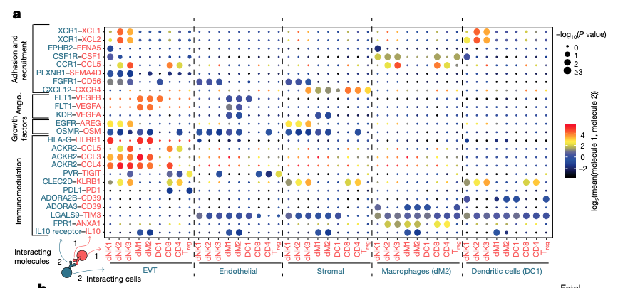
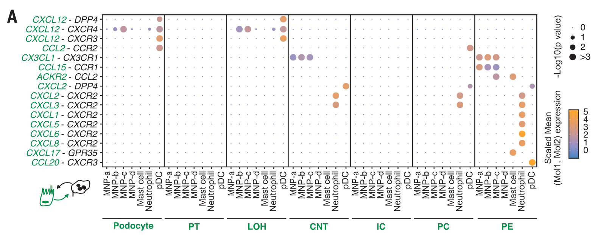

**Author(s)**: `r params$author`  
**Reviewer(s)**: `r params$reviewer`  
**Date**: `r Sys.Date()`  

# Academic Citation
If you use this code in your work or research, we kindly request that you cite our publication:

Xiaofan Lu, et al. (2025). FigureYa: A Standardized Visualization Framework for Enhancing Biomedical Data Interpretation and Research Efficiency. iMetaMed. https://doi.org/10.1002/imm3.70005


```{r setup, include=FALSE}
knitr::opts_chunk$set(echo = TRUE)
```

# 需求描述

# Requirement

用本地CellPhoneDB分析配体-受体，用ggplot2重新画图。
Ligand-receptor analysis was performed using local CellPhoneDB, and the plot was redrawn using ggplot2.



出自<https://www.nature.com/articles/s41586-018-0698-6>
from<https://www.nature.com/articles/s41586-018-0698-6>

We next used **CellPhoneDB** to identify the expression of cytokines and chemokines by dNKs, and to predict their interactions with other cells at the maternal–fetal interface.

Fig. 5 | Multiple regulatory immune responses at the site of placentation. a, Overview of selected ligand–receptor interactions; P values indicated by circle size, scale on right (permutation test, see Methods). The means of the average expression level of interacting molecule 1 in cluster 1 and interacting molecule 2 in cluster 2 are indicated by colour. Only droplet data were used (n = 6 deciduas). Angio., angiogenesis. Assays were carried out at the mRNA level, but are extrapolated to protein interactions. 



出自<https://science.sciencemag.org/content/365/6460/1461.full>
fromhttps://science.sciencemag.org/content/365/6460/1461.full

Fig. 4. Spatial topology of myeloid cell populations in the mature kidney. (A) Heat map of chemokine ligandreceptor interactions between mature myeloid and nephron cell types arranged by proximal to distal nephron organization. Point size indicates permutation p value (CellPhoneDB). Color indicates the scaled mean expression level of ligand and receptor (Mol1/2).

# 应用场景

# Application Scenarios

适用于单细胞转录组数据。跟网页版相比，本地安装运行CellPhoneDB更加灵活。
Applicable to single-cell transcriptome data. Compared with the web version, installing and running CellPhoneDB locally is more flexible.

可参考CellPhoneDB的作者发表的这篇Nature Protocol<https://doi.org/10.1038/s41596-020-0292-x>
Refer to the author published this Nature CellPhoneDB Protocol < https://doi.org/10.1038/s41596-020-0292-x

# 环境设置

# Environment Setup

Load the R package

```{r}
source("install_dependencies.R")
library(data.table)
library(tidyverse)
library(dplyr)
library(ggplot2)

Sys.setenv(LANGUAGE = "en") #显示英文报错信息
options(stringsAsFactors = FALSE) #禁止chr转成factor
```

CellPhoneDB需要在终端（Linux、MAC系统）安装和运行。Windows用户用wsl<https://docs.microsoft.com/en-us/windows/wsl/install-win10>
CellPhoneDB needs to be installed and run on the terminal (Linux or MAC system). Windows users with WSL < https://docs.microsoft.com/en-us/windows/wsl/install-win10 >

安装CellPhoneDB，参考<https://github.com/Teichlab/cellphonedb>
Install CellPhoneDB, reference < https://github.com/Teichlab/cellphonedb >

```bash
#Installing CellPhoneDB
python -m venv cpdb-venv

#Activate virtualenv
source cpdb-venv/bin/activate

#Install CellPhoneDB
pip install cellphonedb
```

# 输入文件

# Input File

CellPhoneDB需要两个文件：
CellPhoneDB requires two files:

- test_meta.txt，两列，一列是每个细胞的barcode，一列是对应的细胞类型。
  test_meta.txt, two columns, one for the barcode of each cell and the other for the corresponding cell type.
- test_counts.txt，表达矩阵。
  test_counts.txt, expression matrix.

文章中raw data下载地址：表达矩阵<https://www.ebi.ac.uk/arrayexpress/files/E-MTAB-6701/E-MTAB-6701.processed.1.zip>
Article raw data download address: expressing matrix < https://www.ebi.ac.uk/arrayexpress/files/E-MTAB-6701/E-MTAB-6701.processed.1.zip >

meta文件<https://www.ebi.ac.uk/arrayexpress/files/E-MTAB-6701/E-MTAB-6701.processed.2.zip>
Meta files < https://www.ebi.ac.uk/arrayexpress/files/E-MTAB-6701/E-MTAB-6701.processed.2.zip >

经过以下处理，获得test_meta.txt和test_counts.txt文件。
After the following processing, the test_meta.txt and test_counts.txt files were obtained.

```{r, eval=FALSE}
# test count
system.time(test_counts <- fread(input="raw_data_10x.txt", stringsAsFactors = T))
test_counts <- as.data.frame(test_counts)
test_counts <- separate(data = test_counts, col=Gene, into = c("gene", "Gene"), sep = "_")
test_counts <- test_counts[,-1]
fwrite(test_counts, file = "./test_counts.txt", sep = "\t")

# test meta
system.time(test_meta <- fread(input="meta_10x.txt", stringsAsFactors = T))
test_meta <- as.data.frame(test_meta)
colnames(test_meta)[1] <- "Cell"
colnames(test_meta)[dim(test_meta)[2]] <- "CellType"
test_meta <- test_meta[,c("Cell","CellType")]
fwrite(test_meta, file = "./test_meta.txt", sep = "\t")
```

由于文章raw data太大且没有normalized，因此下面使用小数据演示。
Since the raw data of the article is too large and not normalized, small data will be used for demonstration below.

# Running CellPhoneDB

```bash
cellphonedb method statistical_analysis test_meta.txt test_counts.txt --iterations=1000 --threads=10

#参数说明：
#Parameter description
#--iterations: Number of iterations for the statistical analysis [1000]
#--threads: Number of threads to use. >=1
#--counts-data: [ensembl | gene_name | hgnc_symbol] Type of gene identifiers in the counts data，表达矩阵中基因的identifier（identifier of genes in the expression matrix）

```

执行完，会在该文件夹下产生一个out文件夹，里面有四个文件means.txt、pvalues.txt、significant_means.txt、deconvoluted.txt
After execution, an "out" folder will be generated under this folder, which contains four files: means.txt, pvalues.txt, significant_means.txt, and deconvoluted.txt

# 用CellPhoneDB自带的函数画图

# Draw the graph using the built-in functions of CellPhoneDB

```bash
cellphonedb plot dot_plot --output-name dotplot.pdf

#参数说明：
#--output-path: Output folder [./out]
#--output-name: Filename of the output plot [plot.pdf]
```


直接运行上面命令会画出所有细胞类型之间配体受体对的dotplot，对结果有一个总体的把握。
Running the above command directly will draw the dotplot of ligand-receptor pairs among all cell types, providing an overall grasp of the results.

> 放到文章里时，只绘制所需的行/列(受体配体对/细胞类型)。一般根据pvalue筛选，结合背景知识选择感兴趣的受体配体对。把希望呈现在图中的受体配体对/细胞类型保存在两个文件中：
> When placed in the article, only draw the required rows/columns (receptor-ligand pairs/cell types). Generally, based on P-value screening, and in combination with background knowledge, select the receptor and ligand pairs of interest. Save the receptor-ligand pairs/cell types that you wish to present in the figure in two files:

- easy_input_rows.txt：选择的受体配体对
  easy_input_rows.txt: Selected receptor-ligand pair
- easy_input_columns.txt：选择的互作的细胞类型。
  easy_input_columns.txt: Selected interacting cell type.

新建in文件夹，将这两个文件夹放置在in文件夹中。
Create a new "in" folder and place these two folders in it.

```bash
cellphonedb plot dot_plot --rows in/easy_input_rows.txt --columns in/easy_input_columns.txt --output-name dotplot_select.pdf

# 也可以只选择受体配体对，画出全部互作的细胞类型
# It is also possible to select only the receptor-ligand pairs and draw all the interacting cell types
cellphonedb plot dot_plot --rows in/easy_input_rows.txt --output-name dotplot_select.pdf
```


> cellphonedb自带的画图函数用了R的ggplot2，我们把画图部分拿出来，根据自己的审美调整更多细节，例如配色。甚至可以加入更多特征。也不拘泥于点图，可顺利对接其他类型的图，可参考FigureYa97correlation的展示方式和画图代码。
> The built-in plotting function of cellphonedb uses R's ggplot2. We take out the plotting part and adjust more details according to our own aesthetic preferences, such as color matching. Even more features can be added. It is not limited to point-based graphs and can be smoothly integrated with other types of graphs. You can refer to the display method and drawing code of FigureYa97correlation.

# 提取要画的受体配体对和互作的细胞类型

# Extract the receptor-ligand pairs to be drawn and the cell types interacting with them

```{r}
# 加载要画的受体配体对
# Load the receptor-ligand pairs to be drawn
selected_rows <- read.table("in/easy_input_rows.txt", header=F, sep="\t")
selected_rows <- as.vector(selected_rows$V1)

# 加载要画的互作的细胞类型
# Load the interacting cell types to be drawn
selected_columns <- read.table("in/easy_input_columns.txt", header=F,sep="\t")
selected_columns <- as.vector(selected_columns$V1)

# 加载受体配体分析结果
# Loading receptor ligand analysis results
all_pval = read.table("out/pvalues.txt", header=T, stringsAsFactors = F, sep = '\t', comment.char = '', check.names=F)
all_means = read.table("out/means.txt", header=T, stringsAsFactors = F, sep = '\t', comment.char = '', check.names=F)

# 提取要画的受体配体对和互作的细胞类型
# Extract the receptor-ligand pairs to be drawn and the cell types interacting with them
intr_pairs = all_pval$interacting_pair
all_pval = all_pval[,-c(1:11)]
all_means = all_means[,-c(1:11)]
sel_pval = all_pval[match(selected_rows, intr_pairs), selected_columns]
sel_means = all_means[match(selected_rows, intr_pairs), selected_columns]

df_names = expand.grid(selected_rows, selected_columns)
pval = unlist(sel_pval)
pval[pval==0] = 0.0009
plot.data = cbind(df_names,pval)
pr = unlist(as.data.frame(sel_means))
pr[pr==0] = 1
plot.data = cbind(plot.data,log2(pr))
colnames(plot.data) = c('pair', 'clusters', 'pvalue', 'mean')
head(plot.data)
```

有了plot.data，就可以顺利对接ggplot2，画各种类型的图。
With plot.data, it is possible to smoothly connect with ggplot2 and draw various types of graphs.

# 修改自带函数画点图

# Modify the built-in function to draw a dot graph

```{r}
# 配色
# Color Matching
my_palette <- colorRampPalette(c("black", "blue", "yellow", "red"), alpha=TRUE)(n=399)

pdf("receptorLigand.pdf", width = 8, height = 5)
ggplot(plot.data, aes(x=clusters,y=pair)) +
  geom_point(aes(size=-log10(pvalue),color=mean)) +
  scale_color_gradientn('Log2 mean (Molecule 1, Molecule 2)', 
                        colors=my_palette) + # 用自定义颜色画点  # Draw dots with custom colors
  theme_bw() +
  theme(panel.grid.minor = element_blank(), #不画网格  # No grids
        panel.grid.major = element_blank(),
        axis.text=element_text(size=14, colour = "black"),
        axis.text.x = element_text(angle = 90, hjust = 1),
        axis.text.y = element_text(size=12, colour = "black"),
        axis.title = element_blank(),
        panel.border = element_rect(size = 0.7, linetype = "solid", colour = "black")) #边框 # Border

dev.off()
```


# 用plot.data对接更多类型的图

# Connect more types of graphs with plot.data

目前展示receptor-ligand结果的经典方式是例文那种点图，其实你也可以结合自己的数据特点，画出更适合自己的图。
The classic way to present the results of receptor-ligand at present is the dot graph in the example text. In fact, you can also draw a graph that suits you better based on the characteristics of your own data.

下面画热图，用'*和**'标注pvalue。上面得到的'plot.data'可以跟ggplot2顺利对接。画图代码在FigureYa97correlation的基础上修改而来。
Draw a heat map below and mark the p-value with '* 'and '* *'. The 'plot.data' obtained above can be smoothly integrated with ggplot2. The drawing code is modified based on FigureYa97correlation.

```{r,fig.width=8, fig.height=4}
# 增加一列，区分p值的大小。
# Add a column to distinguish the magnitude of the p-value.
# 使用两个ifelse实现三分类
# Implement three-category using two if-else statements
plot.data$pstar <- ifelse(plot.data$pvalue < 0.05,
                     ifelse(plot.data$pvalue < 0.01,"**","*"),
                     "")
plot.data$pstar[1:20]

ggplot(plot.data, aes(clusters, pair)) + 
  geom_tile(aes(fill = mean), colour = "white",size=1)+
  scale_fill_gradientn(colours = my_palette) + #用例文的配色 # Use the color scheme of the example text
  geom_text(aes(label=pstar),col ="black",size = 5)+
  theme_minimal()+ #不要背景  # No background Required
  theme(axis.title.x=element_blank(), #不要title  # No title
        axis.ticks.x=element_blank(), #不要x轴  # do not use the X-axis
        axis.title.y=element_blank(), #不要y轴  # do not use the Y-axis
        axis.text.x = element_text(angle = 45, hjust = 1), #调整x轴文字 # Adjust the text on the X-axis
        axis.text.y = element_text(size = 8))+ #调整y轴文字 # Adjust the Y-axis text
  #调整legend 
  # Adjust legend
  labs(fill =paste0(" * p < 0.05","\n\n","** p < 0.01","\n\n","Log2 mean (Molecule 1, Molecule 2)"))

#保存到文件 
# Save to file
ggsave("receptorLigand_plus.pdf", width = 8, height = 4)
```

# 后期处理

# Post-processing

输出的pdf文件是矢量图，可以用Illustrator等工具打开，添加虚线，修改受体配体文字的颜色。
The output pdf file is a vector graphic, which can be opened with tools such as Illustrator, dotted lines can be added, and the color of the receptor and ligand text can be modified.

图中两种细胞类型之间用'|'分隔，可以参考例文的方式手动修改。
The two cell types in the figure are separated by '/', which can be manually modified by referring to the example text.

# Session Info

```{r}
sessionInfo()
```