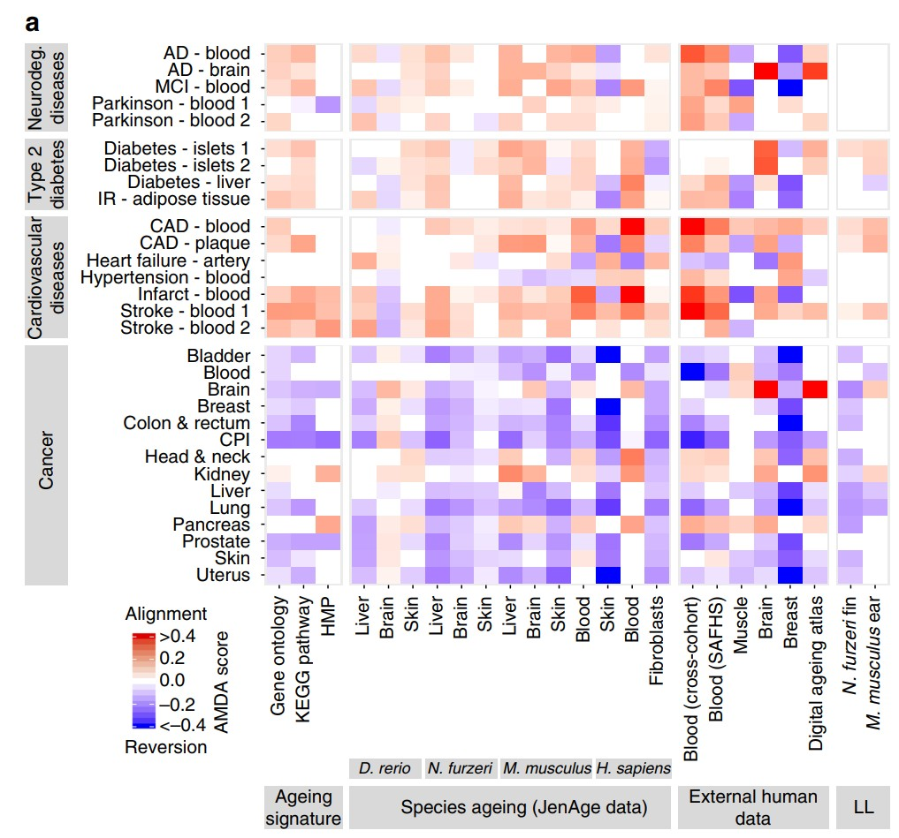

**Author(s)**: `r params$author`  
**Reviewer(s)**: `r params$reviewer`  
**Date**: `r Sys.Date()`  


# Academic Citation
If you use this code in your work or research, we kindly request that you cite our publication:

Xiaofan Lu, et al. (2025). FigureYa: A Standardized Visualization Framework for Enhancing Biomedical Data Interpretation and Research Efficiency. iMetaMed. https://doi.org/10.1002/imm3.70005

```{r setup, include=FALSE}
knitr::opts_chunk$set(echo = TRUE,
                      tidy=TRUE,
                      dev = "svglite",
                      fig.ext = ".svg")
```

# 需求描述

# Requirement

重复文章中ageing-mediated disease alignment score (AMDA score)的算法，并复现原文的Figure3a。

Repeat the algorithm of aging-mediated disease alignment score (AMDA score) in the article and reproduce Figure3a of the original text.

{width=45%}  

{width=45%}

Fig. 3 Association of ageing-associated gene expression changes with ageing diseases and lifespan. a Ageing-mediated disease alignment scores (AMDA scores) for different ageing (x axis) and disease data sets (y axis). Abbreviations: AD Alzheimer’s disease, CAD coronary artery disease, CPI cancer proliferation index, cross-cohort cross-cohort study of blood ageing, HMP human metabolic pathways, IR insulin resistance, LL longitudinal ageing data, MCI mild cognitive impairment; SAFHS, San Antonio Family Heart Study. 

出自<https://www.nature.com/articles/s41467-017-02395-2>
From<https://www.nature.com/articles/s41467-017-02395-2>

# 应用场景

# Application Scenarios

把自己的数据跟衰老联系起来，肿瘤、非肿瘤领域都可以用起来。具体原理参考下文的“AMDA score算法讲解”。

Linking one's own data to aging can be applied in both oncology and non-oncology fields. The specific principle can be referred to in the "Explanation of AMDA score Algorithm" below.

适用于转录组数据，用文中的公式计算出样本的**AMDA score（量化衰老与疾病相关的指标）**，进行组间对比。

Applicable to transcriptome data, calculate the **AMDA score (an indicator quantifying aging and disease-related indicators) ** of the samples using the formula in the text, and conduct inter-group comparisons.

也可以用自己的数据画这种**带有局部二级标签**的热图。

You can also use your own data to draw such a heat map with local secondary labels.

# 环境设置

# Environment Setup

```{r message=FALSE, warning=FALSE}
source("install_dependencies.R")

library(ggplot2)
library(DESeq2)
library(S4Vectors)
#library(BiocParallel) #SnowParam(6) 函数来自 BiocParallel 包，用于设置 DESeq2 的多线程并行计算

Sys.setenv(LANGUAGE = "en") #显示英文报错信息 # Display an English error message
options(stringsAsFactors = FALSE) #禁止chr转成factor  # prohibit chr from being converted to factor
```

> 如果你对AMDA score算法不感兴趣，只想画带二级分类标签的热图，就直接跳到“开始画图”。
> If you are not interested in the AMDA score algorithm and only want to draw a heat map with secondary classification labels, just jump directly to "Start Drawing".

# AMDA score算法讲解

# Explanation of the AMDA score Algorithm

要明白AMDA score得先看原文中的Figure 3a，其中分为两部分。

To understand AMDA score, one must first look at Figure 3a in the original text, which is divided into two parts.

- Part-1属于衰老基因集，是作者自己通过不同物种和组织经过年龄分层的多因素ANOVA进行计算所得的。衰老基因集包含了体现衰老信息的差异基因集，里面分为up和down（详见原文Supplementary Data）。衰老基因集是计算AMDA score的基础，但这个无法复现。因为衰老基因集是作者使用包括斑马鱼、非洲青鳉鱼、小鼠和人的各种组织以及纤维细胞系的基因组所计算得出的。所以，Part-1的基因集在Supplementary Data有提供，直接使用即可。

  Part-1 belongs to the aging gene set and was calculated by the author himself through multi-factor ANOVA with age stratification of different species and tissues. The aging gene set contains a set of differentially expressed genes that reflect aging information, which is divided into up and down (for details, see the original Supplementary Data). The aging gene set is the basis for calculating the AMDA score, but this cannot be reproduced. Because the aging gene set was calculated by the authors using the genomes of various tissues including zebrafish, African medaka, mice and humans, as well as fibroblast cell lines. So, the gene set of Part-1 is available in Supplementary Data and can be used directly.

- Part-2是包括cancer、cvd等各种疾病的病人基因组数据，通过不同的分组策略（见原文Supplementary Table 5）后进行差异基因分析（Deseq2)。然后将差异结果里的log2 Foldchange（原文里描述的是Foldchange，其实实际上是log2FC）在进行normalization（详见下文**"计算AMDA score"**），最后得出取值范围为[-1,1]的log2FC值。

  Part-2 is genomic data of patients with various diseases including cancer and cvd, and differential gene analysis (Deseq2) was conducted after different grouping strategies (see Supplementary Table 5). Then, the log2 Foldchange in the difference results (described as Foldchange in the original text, but in fact it is log2FC) is subjected to normalization (for details, see below **" Calculating AMDA score"**). Finally, a log2FC value with a range of [-1,1] is obtained.

**AMDA score公式的分子部分表示某个病种中匹配到某个基因集中up组的差异基因的rank normalization后的log2FC值的和，减去匹配到down组的差异基因的log2FC的和。分母则是这个基因集中up和down组基因的总数量。**

The molecular part of the AMDA score formula represents the sum of log2FC values after rank normalization of the differentially expressed genes matched to the up group in a certain gene set in a certain disease, minus the sum of log2FC values of the differentially expressed genes matched to the down group. The denominator represents the total number of genes in the up and down groups of this gene set. 

{width=50%}

下面以Part-2里的一种疾病为例，展示AMDA score 的计算过程。这里使用**TCGA-BLCA**的转录组数据进行计算（**为什么不用原文中所用的ICGC-BLCA数据，见文末 Q & A**）

The following takes a disease in Part-2 as an example to demonstrate the calculation process of the AMDA score. Here, the transcriptome data of **TCGA-BLCA** is used for calculation (**Why not use the ICGC-BLCA data used in the original text, see Q&A at the end of the text** )

# 输入数据预处理

# Input data preprocessing

实际应用时，如果已经准备好了基因表达矩阵，可跳过这步，直接进入“差异表达分析”。如果已经做好差异表达分析，就直接进入“输入文件”。

In practical application, if the gene expression matrix has already been prepared, this step can be skipped and you can directly enter "Differential expression Analysis". If the differential expression analysis has been completed, directly enter the "Input File".

## 清洗TCGA-BLCA数据

## Clean the TCGA-BLCA data

这里为了复现原文，因此提取与原文匹配的样本名，用到ICGC-BLCA的转录组数据，但不用里面的raw.count。因ICGC-BLCA数据过大（1.67G），这里不再运行。感兴趣的小伙伴可以自己下载数据放入当前目录内运行。

Here, in order to reproduce the original text, sample names that match the original text are extracted, using the transcriptome data of ICGC-BLCA, but not the raw.count inside. Because the ICGC-BLCA data is too large (1.67G), it is no longer running here. Interested friends can download the data themselves and run it in the current directory.

```{r eval=F, echo=T,message=FALSE, warning=FALSE}
## 加载ICGC-BLCA的转录组数据
## Load the transcriptome data of ICGC-BLCA
exp <- read.delim("exp_seq.BLCA-US.tsv") #ICGC-BLCA的转录组数据 # Transcriptome data of ICGC-BLCA
## 提取对应的列进行宽数据转换
## Extract the corresponding columns for wide data transformation
tmp=exp[,c(5,8,10)] 
tmp=unique(tmp)
tmp=tmp[!tmp$gene_id=='?',]
tmp = data.table(tmp)
ans = tmp[,list(raw_read_count=mean(raw_read_count)), by = 'submitted_sample_id,gene_id']
rna<-spread(ans,key='submitted_sample_id',value="raw_read_count",fill = NA)
table(str_sub(colnames(rna),14,15)) 
# 与文章中的paired样本数量相符
# Consistent with the number of paired samples in the article

## 分离对照组
## Separate the control group
rna=as.data.frame(rna) 
control=rna[,str_sub(colnames(rna),14,15)=='11'] 
row.names(control)=rna[,1]
## 分离肿瘤组
## Isolate the tumor group
cases=rna[,(str_sub(colnames(rna),end=12)%in%str_sub(colnames(control),end=12))&(str_sub(colnames(rna),14,15)=='01')] 
cases=cases[,c(-1,-3)]
row.names(cases)=rna[,1]
table(duplicated(colnames(cases))) 
table((str_sub(colnames(cases),end=12))==(str_sub(colnames(control),end=12))) 
colnames(cases)=str_sub(colnames(cases),end=15)
colnames(control)=str_sub(colnames(control),end=15)
save(cases,file='BLCA_cases.Rdata')
save(control,file='BLCA_control.Rdata')
```

为了方便可以直接导入我整理好的与文章中匹配的17对BLCA样本

For convenience, you can directly import the 17 pairs of BLCA samples that I have sorted out and match the article

```{r eval=F,echo=T, message=FALSE, warning=FALSE}
## 导入用ICGC-BLCA数据整理好的17对配对好的样本
## Import 17 pairs of paired samples that have been organized using ICGC-BLCA data
(load(file='BLCA_cases.Rdata'))
(load(file='BLCA_control.Rdata'))

## 导入TCGA-BLCA的转录组数据进行样本配对
## Import the transcriptome data of TCGA-BLCA for sample pairing
HTSeq_Counts <- read.delim("HTSeq - Counts.merge.txt") #TCGA-BLCA的转录组数据  # Transcriptome data of TCGA-BLCA
colnames(HTSeq_Counts)%<>%str_replace_all('[/.]',"-")
table(str_sub(colnames(HTSeq_Counts),end=15)%in% colnames(cases))

# 提取肿瘤样本
# Extract tumor samples
cases_tcga=HTSeq_Counts[,str_sub(colnames(HTSeq_Counts),end=15)%in% colnames(cases)]
cases_tcga$ENSG=HTSeq_Counts[,1]
cases_tcga <- separate(cases_tcga,ENSG,into = "ENSG",sep = "[.]")
cases_tcga=cases_tcga[str_sub(cases_tcga$ENSG,1,4)=="ENSG",]
cases_tcga=cases_tcga[,c(-12,-19)] #去掉两个重复样本  # Remove two duplicate samples
write.csv(cases_tcga, "easy_input_case.csv", quote = F)

# 提取control样本
# Extract the control sample
control_tcga=HTSeq_Counts[,str_sub(colnames(HTSeq_Counts),end=15)%in% colnames(control)]
control_tcga$ENSG=HTSeq_Counts[,1]
control_tcga <- separate(control_tcga,ENSG,into = "ENSG",sep = "[.]")
control_tcga=control_tcga[str_sub(control_tcga$ENSG,1,4)=="ENSG",]
table(duplicated(control_tcga$ENSG)) #ENSG没有重复 #ENSG has no repetition
write.csv(control_tcga, "easy_input_control.csv", quote = F)
```

## 差异表达分析

## Differential expression analysis

使用DEseq2，与原文一致，对TCGA-BLCA转录组进行差异表达分析。其中基因的row.count数没有进行过滤（比如某基因row.count总和<1的剔除），因为不影响差异结果（已验证）。

Using DEseq2, consistent with the original text, differential expression analysis of the TCGA-BLCA transcriptome was conducted. Among them, the row.count number of genes was not filtered (for example, the elimination of a certain gene whose row.count sum is less than 1), because it does not affect the difference result (verified).

```{r eval=F, echo=T, warning=FALSE}
# 加载基因表达矩阵
# Load the gene expression matrix
# 肿瘤组
# Tumor Group
cases_tcga <- read.csv("easy_input_case.csv", row.names = 1, header = T, check.names = F)
cases_tcga[1:3, 1:3]

# 对照组
# Control Group
control_tcga <- read.csv("easy_input_control.csv", row.names = 1, header = T, check.names = F)
control_tcga[1:3, 1:3]

## 合并肿瘤组和对照组
## The combined tumor group and the control group
rownames(cases_tcga)=cases_tcga$ENSG
cases_tcga=cases_tcga[,-ncol(cases_tcga)]
rownames(control_tcga)=control_tcga$ENSG
control_tcga=control_tcga[,-ncol(control_tcga)]
mRNA=cbind(cases_tcga,control_tcga)
type_tissue<-ifelse(as.numeric(substr(colnames(mRNA),14,15)) < 10,'tumor','normal')
table(type_tissue)
type_tissue=relevel(factor(type_tissue),ref = "normal")
mRNA=round(mRNA,digits=0) #数据取整，DESeq2需要整数counts # Data rounding: DESeq2 requires integer counts
colData <- data.frame(row.names=colnames(mRNA), 
                      type=c(type_tissue))  #样本名+类别标签   # Sample name + category label

## 构建dds矩阵
## Build the dds matrix
dds <- DESeqDataSetFromMatrix(countData = mRNA, 
                              colData = colData, 
                              design = ~ type) 

## 差异分析较久，创建文件方便保存结果
## The difference analysis takes a long time. Creating a file is convenient for saving the results
tmp_f=file.path('mRNA.DESeq2-dds.Rdata') 
register(SnowParam(6)) #设置多线程  # sets multithreading
if(!file.exists(tmp_f)){
  dds <- DESeq(dds,parallel = T) #进行DESeq差异分析：估计大小因素，估算分散度，gene-wise分散估计，均值-色散关系，最终的分散估计(与原文描述一致)  ## conduct DESeq variance analysis: estimate size factor, estimate dispersion, gene-wise dispersion estimation, mean-dispersion relationship, final dispersion estimation (consistent with the original description)
  save(dds,file = tmp_f)
} #最耗时（已启用多线程） # Most time-consuming (Multithreading enabled)
```

```{r warning=FALSE, eval=F, echo=T, cache=T}
load('mRNA.DESeq2-dds.Rdata')
res <- results(dds, tidy = F)
DEG =as.data.frame(res) #转为数据框  # Convert to Data Frame
head(DEG)
write.csv(DEG, file = "easy_input_DEG.csv") #保存差异基因  # save the differential genes
```

## 对log2FC进行标准化，并对比原文提供的经标准化后的log2FC结果

## Standardize the log2FC and compare it with the standardized log2FC results provided in the original text

这里使用上面计算的log2Foldchange(原文里描述的是Foldchange，实际上是log2FC(**已证实，详见 Q & A**))进行rank normalization

**（原文里是先把所有disease的log2FC进行quantile normalization，再进行单个disease的rank normalization，因为这里只演示一个diseases所以无需进行quantile normalization）**

Here, rank normalization is performed using the log2Foldchange calculated above (the original text describes Foldchange, but in fact, it is log2FC(** confirmed, see Q&A **))

First, quantile normalization is performed on the log2FC of all diseases, and then rank normalization is carried out on individual diseases. Since only one disease is being demonstrated here, there is no need for quantile normalization

- STEP1: 先取绝对值进行大小排列，然后经(r-1)/(R-1)变换得出取值范围为[0,1]的log2FC值（**为什么是(r-1)/(R-1)变换而不是r/R变化，详见Q & A**）。
  STEP1: First, take the absolute value and sort it by size. Then, perform the (r-1)/(r-1) transformation to obtain the log2FC value with a range of [0,1] (** Why it is the (r-1)/(r-1) transformation instead of the r/R change, see Q&A **).
- STEP2: 将取值范围为[0,1]的log2FC值加上log2FC值原有的正负号，使其取值范围变为[-1,1]。
  STEP2: Add the original sign of the log2FC value with a value range of [0,1] to change its value range to [-1,1].

文章提供了一个包含3032个基因的几乎所有diseases（除了Cancer-CPI）的经标准化后的log2FC值（位于Supplementary Data S2）。这个文件与文中Figure3a中AMDA score无关，我们只用它来验证log2FC标准化的结果。

The article provides a standardized log2FC value for almost all diseases (except Cancer-CPI) containing 3032 genes (located in Supplementary Data S2). This file has nothing to do with the AMDA score in Figure3a in the text. We only use it to verify the results of log2FC standardization.

```{r message=FALSE, warning=FALSE,cache=T}
##导入文章提供的经过标准化后的log2FC值,进行匹配
##Import the standardized log2FC values provided in the article and perform matching
ori=read.csv("41467_2017_2395_MOESM5_ESM/Supplementary Data S2/DiseaseAlignment-1-4+5/normalizedFoldChanges.csv")
DEG=read.csv("easy_input_DEG.csv")
row.names(DEG)=DEG[,1]
DEG=DEG[,-1]
all_DEG=DEG[ori$X,]
all_DEG$val=ori$cancer.bladder
all_DEG$absval=abs(ori$cancer.bladder)
all_DEG$Foldchange=abs(all_DEG$log2FoldChange) #绝对值log2FC # Absolute value log2FC
all_DEG=all_DEG[complete.cases(all_DEG),]
all_DEG=all_DEG[order(all_DEG$Foldchange),] #标准化 # normalized
all_DEG$rank=c(0:(nrow(all_DEG)-1))/(nrow(all_DEG)-1) #是0开始的 # starts from 0
all_DEG$rank=all_DEG$rank*all_DEG$log2FoldChange/abs(all_DEG$log2FoldChange) #加上正负号  # plus plus or minus sign
```

画图查看相关性

Draw a graph to check the correlation

```{r fig.show=T}
ggplot(data=all_DEG, aes(x=rank, y=val)) + 
  geom_point(color="#ffb549") + 
  stat_smooth(method="lm",se=T) 
#基本吻合
# Basically consistent
cor.test(all_DEG$rank,all_DEG$val,method="pearson") 
#相关系数>0.9
# Correlation coefficient >0.9
```

# 输入文件

# Input File

需要用到差异表达分析结果和衰老基因集：

The results of differential expression analysis and the aging gene set are needed:

- 衰老基因集，用例文附件提供的多个文本文件，位于当前文件夹里的41467_2017_2395_MOESM5_ESM/Supplementary Data S2/DEGs/1-4+5/
  Aging gene set, using multiple text files provided in the example attachment, located in the current folder 41467_2017_2395_MOESM5_ESM/Supplementary Data S2/DEGs/1-4+5/
- easy_input_DEG.csv，前面用DESeq2获得的差异表达分析结果。
  easy_input_DEG.csv, the differential expression analysis results obtained earlier using DESeq2

## 导入原文提供的所有衰老基因集

## Import all the aging gene sets provided in the original text

可以把这套衰老基因集用到自己的paper里，记得引用原文哦～

You can apply this aging gene set to your own paper. Remember to quote the original text

```{r fig.show=T}
metabolic <- read.csv("41467_2017_2395_MOESM5_ESM/Supplementary Data S2/DEGs/1-4+5/metabolic.txt", sep="")
breast <- read.csv("41467_2017_2395_MOESM5_ESM/Supplementary Data S2/DEGs/1-4+5/human-breast.txt", sep="")
skin <- read.csv("41467_2017_2395_MOESM5_ESM/Supplementary Data S2/DEGs/1-4+5/human-skin.txt", sep="")
human.daa <- read.csv("41467_2017_2395_MOESM5_ESM/Supplementary Data S2/DEGs/1-4+5/human-daa.txt", sep="")
human.muscle <- read.csv("41467_2017_2395_MOESM5_ESM/Supplementary Data S2/DEGs/1-4+5/human-muscle.txt", sep="")
metabolic <- read.csv("41467_2017_2395_MOESM5_ESM/Supplementary Data S2/DEGs/1-4+5/metabolic.txt", sep="")
SAFHS <- read.csv("41467_2017_2395_MOESM5_ESM/Supplementary Data S2/DEGs/1-4+5/human-blood-SAFHS.txt", sep="")
mouse.blood <- read.csv("41467_2017_2395_MOESM5_ESM/Supplementary Data S2/DEGs/1-4+5/mouse-blood.txt", sep="")
go <- read.csv("41467_2017_2395_MOESM5_ESM/Supplementary Data S2/DEGs/1-4+5/go.txt", sep="")
danio.brain <- read.csv("41467_2017_2395_MOESM5_ESM/Supplementary Data S2/DEGs/1-4+5/danio-brain.txt", sep="")
data.list=list.files('41467_2017_2395_MOESM5_ESM/Supplementary Data S2/DEGs/1-4+5/',pattern="*.txt")
all=list()
for (i in 1:length(data.list)){
  x=read.csv(paste0('41467_2017_2395_MOESM5_ESM/Supplementary Data S2/DEGs/1-4+5/',data.list[i]),sep="")
  up=x[1:which(x$Up.=="Down:")-1,1]
  if(isEmpty(which(x$Up.=="Other:"))) {
    down=x[which(x$Up.=="Down:")+1:nrow(x),1]
  } else{
    down=x[((which(x$Up.=="Down:")+1):(which(x$Up.=="Other:")-1)),1]
    all[[i]]=list(data.list[i],up,down)}}
```

## 加载差异表达分析结果

## Load the results of differential expression analysis

```{r}
DEG <- read.csv("easy_input_DEG.csv", row.names = 1)
head(DEG)
```

# 计算AMDA score和p值

# Calculate the AMDA score and P-value

使用标准化后的log2FC值计算AMDA.score并计算p值。计算结果与原文的AMDA score基本吻合，偏差来源分析见Q & A。

Calculate the AMDA.score using the standardized log2FC value and calculate the p-value. The calculation results are basically consistent with the AMDA score of the original text. The analysis of the source of deviation can be found in Q&A.

```{r}
test=data.frame()
for (i in 1:length(data.list)) {
  n=unlist(all[[i]][1]) #name
  x=unlist(all[[i]][2]) #up
  y=unlist(all[[i]][3]) #down
  xx=table(x%in% row.names(DEG))
  yy=table(y%in% row.names(DEG))
  all_DEG=DEG[c(x,y),] #合并up和down基因集  # Merge the up and down gene sets
  all_DEG=all_DEG[complete.cases(all_DEG),] 
  all_DEG$Foldchange=abs(all_DEG$log2FoldChange) #绝对值log2FC  # Absolute value log2FC
  all_DEG=all_DEG[order(all_DEG$Foldchange),] #标准化  # Standardization
  all_DEG$rank=c(0:(nrow(all_DEG)-1))/(nrow(all_DEG)-1) #0开始 #start from 0
  all_DEG$rank=all_DEG$rank*all_DEG$log2FoldChange/abs(all_DEG$log2FoldChange)
  res=(sum(na.omit(all_DEG[x,"rank"]))-sum(na.omit(all_DEG[y,"rank"])))/length(c(x,y))
  a=wilcox.test(na.omit(all_DEG[x,"rank"]),na.omit(all_DEG[y,"rank"]),paired = FALSE, exact = F, correct = TRUE,conf.int = FALSE, conf.level = 0.95) 
  #Wilcoxon rank-sum test of normalized foldchanges of genes from a disease data sets between ageing-repressed and ageing-induced genes(原文)
  test=rbind(test,cbind(n,res,a[["p.value"]],xx["TRUE"]/sum(xx),yy["TRUE"]/sum(yy)))
}
rownames(test)=c(1:nrow(test))
colnames(test)=c('fact',"AMDA.score",'AMDA.padj',"up%",'down%')
test$AMDA.score%<>% as.numeric()
test$AMDA.padj%<>% as.numeric()

# 把AMDA score保存到文件
# Save AMDA score to file
write.csv(test, "AMDAscore_output.csv", row.names = F, quote = F)
```

## 导入原文的AMDA score进行比较

## Import the AMDA score of the original text for comparison

```{r}
AMDA <- read.csv("41467_2017_2395_MOESM5_ESM/Supplementary Data S2/DiseaseAlignment-1-4+5/AMDA-dirs.csv")
test$oriAMDA=AMDA$cancer.bladder
ggplot(test,aes(x=AMDA.score, y=oriAMDA)) +
  geom_point(color="#ffb549") + 
  stat_smooth(method="lm",se=T)
cor.test(test$AMDA.score,test$oriAMDA,method="pearson")  
```

这里算出的AMDA score跟原文的相关系数为0.967。
The correlation coefficient between the AMDA score calculated here and the original text is 0.967.

# 开始画图

# Start drawing

以上BLCA的AMDA score对应图中的一行。实际应用时，如果有多组对比，可以像例文那样用热图展示；如果只有一组对比，可以换成柱形图或lollipop等方式展示。
The above BLCA AMDA score corresponds to one row in the graph. In practical applications, if there are multiple sets of comparisons, they can be presented using heat maps as in the example text. If there is only one set of comparisons, they can be presented in the form of bar charts or lollipops, etc.

这里复现文中的Figure 3a的带局部二级标签的heatmap
Here, the heatmap with local secondary labels of Figure 3a in the text is reproduced

## 输入文件预处理

## Input file preprocessing

直接使用**文章的Supplementary Data S2的数据**复现Figure 3a，对照图来理解语句的含义。
Reproduce Figure 3a directly using the Data in Supplementary Data S2 of the article, and understand the meaning of the sentences by referring to the figure.

```{r message=FALSE, warning=FALSE, tidy=T}
AMDA <- read.csv("41467_2017_2395_MOESM5_ESM/Supplementary Data S2/DiseaseAlignment-1-4+5/AMDA-dirs.csv") #导入文中数据进行比对  # Import the data in the text for comparison
head(AMDA)

AMDA$X%<>%str_sub(end=-5)
heat <- pivot_longer(AMDA,-X, 
                      names_to = "diseases", values_to = "AMDA.score")
heat <- as.data.frame(heat)
Cancer <- heat$diseases[1:14]
Cardiovasculardiseases <- heat$diseases[15:21]
Neurodeg.diseases <- heat$diseases[22:26]
Type2diabetes <- heat$diseases[27:30]
Ageingsignature <- c('metabolic',"kegg","go")
Speciesageing <- c("danio-liver","danio-brain","danio-skin",
                "notho-liver","notho-brain","notho-skin",
                "mouse-liver","mouse-brain","mouse-skin","mouse-blood",
                "human-skin","human-blood","fibroblasts")
Externalhumandata=c("human-blood-cross-cohort","human-blood-SAFHS","human-muscle","human-brain","human-breast","human-daa")
LL=c("notho-longitudinal","mouse-longitudinal")

heat$xx <- ifelse(heat$X%in%Ageingsignature,"Ageingsignature",
              ifelse(heat$X%in%Speciesageing,"Speciesageing",
                     ifelse(heat$X%in%Externalhumandata,"Externalhumandata","LL")
                     )
              )
heat$yy <- ifelse(heat$diseases%in%Cancer,"Cancer",
              ifelse(heat$diseases%in%Cardiovasculardiseases,"Cardiovasculardiseases",
                     ifelse(heat$diseases%in%Type2diabetes,"Type2diabetes","Neurodeg.diseases")
              )
)

heat$xx%<>%factor(levels = c("Ageingsignature","Speciesageing","Externalhumandata","LL"),ordered = T)
heat$yy%<>%factor(levels = c("Neurodeg.diseases","Type2diabetes","Cardiovasculardiseases","Cancer"),ordered = T)
heat$X%<>%factor(levels = c("go","kegg","metabolic","danio-liver","danio-brain","danio-skin",
                            "notho-liver","notho-brain","notho-skin",
                            "mouse-liver","mouse-brain","mouse-skin","mouse-blood",
                            "human-skin","human-blood","fibroblasts",
                            "human-blood-cross-cohort","human-blood-SAFHS",
                            "human-muscle","human-brain","human-breast","human-daa",
                            "notho-longitudinal","mouse-longitudinal"),ordered = T,
                 labels = c("Gene ontology","KEGG pathway","HMP",
                            "Liver","Brain","Skin",
                            " Liver"," Brain"," Skin",
                            "  Liver","  Brain","  Skin","Blood",
                            "   Skin"," Blood","Fibroblasts",
                            "   Blood (cross-cohort)","Blood (SAFHS)","Muscle","   Brain","Breast","Digital ageing atlas",
                            "N. furzeri fin","M. musculus ear"
                 ))
heat$diseases%<>%factor(levels = c(sort(names(table(heat[heat$yy=='Cancer',"diseases"])),decreasing = T),
                                   sort(names(table(heat[heat$yy=='Cardiovasculardiseases',"diseases"])),decreasing = T),
                                   sort(names(table(heat[heat$yy=='Type2diabetes',"diseases"])),decreasing = T),
                                   sort(names(table(heat[heat$yy=='Neurodeg.diseases',"diseases"])),decreasing = T)),ordered = T,
                                   labels = c("Uterus","Skin","Prostate","Pancreas","Lung","Liver","
                                              Kidney","Head & neck","CPI","Colon & rectum",
                                              "Breast","Brain","Blood","Bladder","Stroke - blood 2","Stroke - blood 1",
                                              "Infarct - blood","Hypertension - blood","Heart failure - artery","CAD - plaque",
                                              "CAD - blood","IR - adipose tissue",
                                              "Diabetes - liver","Diabetes - islets 2","Diabetes - islets 1",
                                              "Parkinson - blood 2","Parkinson - blood 1",
                                              "MCI - blood","AD - brain","AD - blood")
                        )

# x轴二级分类标签
# X-axis Secondary Classification labels
tableGL <- data.frame(group=c(1:13),labels=rep(NA,13),subgroup=c(rep("D. rerio",3),rep("N. furzeri",3),rep("M. musculus",4),rep("H. sapiens",3)))
tableGL$subgroup%<>%factor(levels = c("D. rerio","N. furzeri","M. musculus","H. sapiens"))

labx <- c(Ageingsignature=paste("Ageing","\n","signature"),Speciesageing='Species ageing (JenAge data)',Externalhumandata=paste("External human","\n","data"),LL="LL")

# y轴二级分类标签
# Y-axis secondary classification label
laby <- c(Cardiovasculardiseases=paste("Cardiovascular","\n","diseases"),
       Type2diabetes=paste("Type2","\n","diabetes"),
       Neurodeg.diseases=paste("Neurodeg.","\n","diseases"),
       Cancer="Cancer")
```

## 画主图

## Draw the main image

```{r message=FALSE, warning=FALSE,tidy=T,fig.show=T}
s <- 10 #统一字体大小 # Uniform font size
p_cor.order <- ggplot(heat, aes(X, diseases)) + 
  geom_tile(aes(fill = round(AMDA.score,2)))+
  theme(axis.text.y =element_text(size=s,face = "bold",margin = margin(r =5)),
        axis.title = element_blank(),
        axis.text.x = element_text(angle=90,hjust =1,vjust = 0.3,face = "bold",size=s,margin = margin(t =5)),
        legend.key.height =  unit(0.2, "inch"),
        legend.key.width  =  unit(0.25, "inch"),
        legend.text = element_text(size=s-0.2),
        legend.background = element_blank(),
        legend.title=element_text(angle=90,vjust = -0.5,hjust = 0.5),
        plot.margin = unit(c(1,2,1,1), "lines")
        ) +
  scale_fill_gradientn(limits = c(-0.42, 0.42),na.value="#ff0000",
                       breaks = c(-0.4, -0.2,0,0.2,0.4),
                       labels = c("<-0.4", "-0.2","0","0.2",">0.4"),
                       values=c(0,0.1,0.5,0.9,1),
                       colours = c('#0000ff','#0000ff','#ffffff','#ff351c', '#ff0000')
                       )+
  guides(fill = guide_colourbar(title="AMDA score",title.position = 'right'))

# 加二级分类标签 
# Add secondary classification tags
p1 <- p_cor.order +
  facet_grid(yy~xx,scales="free",space="free",switch = "both",
                          labeller=labeller(xx = labx, yy=laby)) +
  theme(strip.text = element_text(size = 11,hjust=0.5),
        strip.placement = "outside")

# 保存到文件
# Save to file
pdf("AMDAplot_pri.pdf", width = 11, height = 9)
p1
dev.off()
```


> 输出的pdf文件是矢量图，可以用Illustrator等软件打开，手动编辑。
> The output pdf file is a vector graphic and can be opened with software such as Illustrator for manual editing.

> 追求全自动，用代码画出物种拉丁名那行，下面会用到grid。如果理解有困难，可以到这里结束。
> Pursue full automation. Draw the line with the Latin name of the species in code. grid will be used below. If you have difficulty understanding, you can end here.

## 画局部二级标签

## Draw partial secondary labels

```{r message=FALSE, warning=FALSE,tidy=T}
p2 <- ggplot() +
  geom_text(data = tableGL, 
            aes(label = labels, x=group), y = 0.5,
            size = 0)+
  theme_pubr()+
  theme(axis.line =element_blank(),
        axis.ticks =element_blank(),
        axis.text =element_blank(),
        axis.title =element_blank(),
        plot.margin = unit(c(6,0.1,0,0.1), "lines"))+
  facet_grid(~subgroup,scales = "free_x",space = "free_x",switch = "x")+
  theme(strip.text = element_text(size = 10,hjust=0.5,face="italic"),
        strip.background = element_rect( fill="#d9d9d9",color="#d9d9d9"))
#——————转为grid对象
#—————— to grid object
pg1 = ggplotGrob(p1)
pg2 = ggplotGrob(p2)
#——————提取亚标签、合并
#—————— extract subtags, merge
pg2 <- gtable_filter(pg2, 
                     "(background|strip-b-[1234])",
                     trim=T,invert = F)
panel_col <- pg1$layout$l[grepl("panel", pg1$layout$name)][1]
pgn <- gtable_add_rows(pg1, heights = unit(1, "lines"), pos = 0)
pgn <- gtable_add_grob(pgn, pg2, t = 1, l = panel_col, r = panel_col, z=2)
```

## 提取legend、添加上下文字、合并图层

## Extract legend, add context, and merge layers

```{r message=FALSE, warning=FALSE,fig.show=F}
pgn2 <- gtable_filter(pgn, 
                     "(guide-box)",
                     trim=T,invert = F)
pgn2 <- pgn2[["grobs"]][[1]][["grobs"]][[1]] #去壳 # Shell Removal
pgn <- gtable_filter(pgn, 
                     "(tag|guide-box|caption)",
                     trim=T,invert = T) #删除原有标签  # Delete the original tag

Alignment <- textGrob("Alignment", gp = gpar(fontsize = 10))
Reversion <- textGrob("Reversion", gp = gpar(fontsize = 10))
padding <- unit(0.5,"line")

# 根据布局调整pos
# Adjust pos according to the layout
gtable_show_layout(pgn2)
pgn3 <- gtable_add_rows(pgn2, heights = grobHeight(Alignment) + padding, pos = 0)
pgn3 <- gtable_add_rows(pgn3, heights = grobHeight(Reversion) + padding, pos = nrow(pgn3))
pgn3 <- gtable_add_grob(pgn3, list(Alignment),t = 1, l = 1, r = ncol(pgn3))
pgn3 <- gtable_add_grob(pgn3, list(Reversion),t = nrow(pgn3), l = 1, r = ncol(pgn3))
panel_t <- pgn$layout$t[grepl("panel", pgn$layout$name)][1]
guide_l <- pg1$layout$l[grepl("guide-box", pg1$layout$name)][1]
pgn <- gtable_add_grob(pgn, pgn3, t = panel_t, l = guide_l, r = guide_l, z=13)
#合并，固定位置 # Merge, Fixed position
```

## 输出图片

## Output image

```{r message=FALSE, warning=FALSE, include=FALSE}
pdf("AMDAplot.pdf",width=11,height=9)
grid.draw(pgn)
dev.off()
```


# Q & A

1. 为什么确定原文用的log2FC标准化是(r-1)/(R-1)变换而不是r/R变换? 为什么说原文里描述的是Foldchange，实际上是log2FC？

Why is it determined that the log2FC normalization used in the original text is the (r-1)/(r-1) transformation rather than the r/R transformation? Why is it said that what is described as Foldchange in the original text is actually log2FC?

答：我们可以打开原文提供的包含3032个基因的经标准化后的FC值。

Answer: We can open the standardized FC values provided in the original text, which contain 3,032 genes.

```{r}
ori <- read.csv("41467_2017_2395_MOESM5_ESM/Supplementary Data S2/DiseaseAlignment-1-4+5/normalizedFoldChanges.csv")
```

我们会发现，每一列是独立的disease，行是3032个基因，每一列按大小排列后值都是一样的

We will find that each column represents an independent disease, with 3,032 genes in each row. After arranging each column by size, the values are all the same

```{r}
as.numeric(unlist(lapply(ori[,-1], max))) #最大值 # maximum value
as.numeric(unlist(lapply(ori[,-1], min))) #最小值 # minimum value
as.numeric(unlist(lapply(ori[,-1], median))) #中位数  # median
lapply(ori[,2:5], function(x){table(x>0)}) #这里可以看到每个样本正负的数量都是一样的，这是quantile normalization的证据（为了减少篇幅只取前几列）  # Here it can be seen that the number of positive and negative samples for each sample is the same, which is evidence of quantile normalization (only the first few columns are taken to reduce space).
```

这里证实了作者是先对所有disease进行quantile normalization，也**说明了作者不是用foldchange**。如果使用foldchange，所有负值将变成最小的正值，当进行绝对值的rank normalization后加上原有的正负号会出现**最显著的负的log2FC会变成最不显著的负的log2FC**，这个可以自己去试一下。

This confirms that the author first performed quantile normalization on all diseases, and also indicates that the author did not use foldchange. If foldchange is used, all negative values will become the smallest positive values. After performing rank normalization of absolute values and adding the original plus or minus signs, the most significant negative log2FC will become the least significant negative log2FC. You can try this yourself.

接下来取某一列乘以3032，还原r/R变换

Next, multiply a certain column by 3032 to restore the r/R transformation

```{r}
head(sort(abs(ori[,2])*3032,decreasing = F))
```
这里发现*3032后最小值是0，而且其他数都不是整数，这与文章描述的不一致（原文：replaced fold-changes by their absolute ranks in the list of fold-changes）

It is found here that the minimum value after *3032 is 0, and none of the other numbers are integers, which is inconsistent with the description in the article (original text: replaced fold-changes by their absolute ranks in the list of fold-changes)

```{r}
head(sort(abs(ori[,2])*3031,decreasing = F))
#换成*3031，结果都是整数完全符合(r-1)/(R-1)变换
#Replace it with *3031, and the results are all integers that fully conform to the (r-1)/(R-1) transformation
```

2. 为什么不用原文中所用的ICGC-BLCA数据而用TCGA的？

2. Why use TCGA instead of the ICGC-BLCA data mentioned in the original text?

答：ICGC-BLCA转录组数据中基因名是gene id和gene alias（基因别名）构成，这导致了很严重的问题。在基因ID转换的过程中（不管是用org.Hs.eg.db还是自己读取GTF进行匹配），会出现gene id与ensembl id多对多的情况。更严重的是，因为ICGC是gene id和gene alias混用，会导致某些gene alias匹配到其对应的gene id的ensembl id，也会出现一个ensembl id匹配到多个gene id和gene alias，导致多对多。这种结果会使得我们无法判断作者提供的normalizedFoldChanges.csv是属于ICGC里面的哪想基因（文中作者描述是使用Bimart进行转换，但Bimart同样也会遇到多对多转换，所以面临着随机性，可能某些gene id变成与其ensembl id下gene alias同名的gene id的ensembl id**（这也是复现这个图才发现的一个ID转换的坑！）**）。

Answer: In the ICGC-BLCA transcriptome data, the gene names are composed of gene ids and gene aliases, which leads to very serious problems. During the process of gene id conversion (whether using org.Hs.eg.db or reading GTF by oneself for matching), there will be a many-to-many situation between Gene id and ensembl id. What is more serious is that since ICGC involves the mixed use of gene ids and gene Aliases, it may lead to certain gene aliases matching the ensembl ids of their corresponding gene ids, and also result in one ensembl id matching multiple gene ids and gene Aliases. This leads to a many-to-many situation. This result will make us unable to judge the author provide normalizedFoldChanges. The CSV which belongs to the inside of the led to gene (in this paper, the authors describe Bimart is used for conversion, but Bimart will also encounter a many-to-many conversion, so facing the randomness, It's possible that some gene ids have become the ensembl ids of gene ids with the same name as the gene alias under their ensembl ids ** (This is also an ID conversion pithole discovered only after reproducing this diagram!)" "**).

因此，这次直接用TCGA-BLCA的数据，里面是ensembl id，直接使用即可，不过这也导致了下面的问题：计算结果偏差，**经对比发现，ICGC转录组的raw.count和TCGA的raw.count完全不一致（相同sample下）**。

Therefore, this time we directly used the data from TCGA-BLCA, which contains the ensembl id, and could use it directly. However, this also led to the following problem: After comparison, it was found that the raw.count of the ICGC transcriptome and that of the TCGA are completely inconsistent (under the same sample).

3. 计算结果与原文的AMDA score的偏差是什么导致的？

3. What causes the deviation between the calculation result and the original AMDA score?

答：除了上面说的用了TCGA导致的偏差外，还有一个文章本身的原因。

Answer: Besides the deviation caused by the use of TCGA mentioned above, there is also a reason related to the article itself.

通过读取文章Supplementary Data S2中所有作者自己计算出的衰老基因集发现，大多数衰老基因集的up和down个数与文章中Supplementary Table 3列出的个数不一致（记得只有metabolism是一致的）。这可能是作者在处理数据时出现的差错。

By reading the aging gene sets calculated by all the authors themselves in the Supplementary Data S2 of the article, it was found that the up and down numbers of most aging gene sets were inconsistent with the numbers listed in Supplementary Table 3 of the article (remember that only metabolism was consistent). This might be an error made by the author when handling the data.

# Session Info

```{r}
sessionInfo()
```
