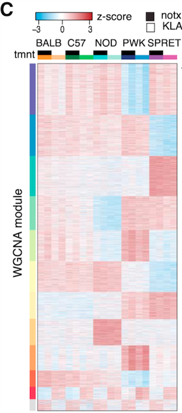

**Author(s)**: `r params$author`  
**Date**: `r Sys.Date()`  


# Academic Citation
If you use this code in your work or research, we kindly request that you cite our publication:

Xiaofan Lu, et al. (2025). FigureYa: A Standardized Visualization Framework for Enhancing Biomedical Data Interpretation and Research Efficiency. iMetaMed. https://doi.org/10.1002/imm3.70005


```{r setup, include=FALSE}
knitr::opts_chunk$set(echo = TRUE)
```

## 需求描述
## Requirement description

用R代码画出paper里WGCNA module的heatmap

Draw the heatmap of the WGCNA module in paper using R code



出自<https://www.cell.com/cell/abstract/S0092-8674(18)30511-7>

from<https://www.cell.com/cell/abstract/S0092-8674(18)30511-7>

## 使用场景
## Usage scenario

WGCNA找出了gene module，展示各module的基因在各组样本中的表达谱变化。

WGCNA identified gene modules to show the changes in the expression profiles of the genes of each module in each group of samples.

## 输入数据的预处理
## Preprocessing of input data

用FigureYa15WGCNA_module输出了各个gene module内的基因表达量，每个module保存在一个csv文件中，位于当前文件夹。

WGCNA已经按照共表达特征给基因分成了多个module，因此，这里不需要再做聚类，直接按照module内基因的数量给基因排序，再用热图的方式可视化。

如果你的数据已经保存成像`easy_input.csv`的格式，就可以跳过这步，直接进入“开始画图”。

Gene expression within each gene module was output using FigureYa15WGCNA_module, and each module was saved in a csv file located in the current folder.

WGCNA has already divided genes into modules according to co-expression characteristics, so there is no need to do clustering here, and genes are directly sorted according to the number of genes within a module, and then visualized by heatmap.

If your data has been saved in a format like `easy_input.csv`, you can skip this step and go directly to "Start drawing".

```{r}
source("install_dependencies.R")
fnames<-Sys.glob("*.csv")
fnames
```

读取这些module，合并。

Read these modules, merge them.

```{r}
fdataset<-lapply(fnames,read.csv)
names(fdataset) <- fnames

library(plyr)
result <- ldply(fdataset, data.frame)
head(result)

df<-result[,2:22]
df$module<-unlist(strsplit(result$.id,split = ".csv"))
head(df)
```

按照module内基因数量从多到少，给基因排序。

Order the genes according to the number of genes within the module from most to least.

```{r}
#先按module内基因的数量为module排序
#sort the module first by the number of genes in the module
module.num<-table(df$module)
module.num.sort<-module.num[order(module.num,decreasing =TRUE)]
module.num.sort
keys<-names(module.num.sort)
keysDF<-data.frame(module=keys,order=1:length(keys))
keysDF

#再按这个module的顺序为基因排序
#then sort the genes in the order of this module
df.merged<-merge(df,keysDF,by.x = 'module',by.y = 'module',all.x = T, all.y = F)
df.sort <- df.merged[order(df.merged$order),]
write.table(df.sort[1:22],"easy_input.txt",row.names = F, quote = F)
```

## 开始画图
## Start drawing

```{r}
#读取带有module信息的基因表达量文件
#read gene expression file with module information
df.exp<-read.table("easy_input.txt",header = T, as.is = T)
row.names(df.exp)<-df.exp$X
head(df.exp)
dim(df.exp)

library(pheatmap)
#设置sample的分组
#set the grouping of sample
annotation_col = data.frame(
  type = factor(rep(c("BALB","C57","NOD","PWK","SPRET"),c(4,4,4,4,4))),
  treatment = factor(rep(c("notx","notx","KLA","KLA"),5))
)
rownames(annotation_col) = colnames(df.exp[,3:22])

#设置基因的分组，也就是module
#set the grouping of genes, also known as the module
annotation_row = data.frame(df.exp$module)
rownames(annotation_row) = df.exp$X
colnames(annotation_row)<-"WGCNA.module"

#为sample和基因的分组设置颜色
#module的名字作为module的颜色
#set colors for grouping of sample and gene
#the name of the module is used as the color of the module
module.name<-names(table(df.exp$module))
names(module.name)<-module.name

ann_colors = list(
  treatment = c(notx = "black", KLA = "white"),#给两种处理设置颜色 set colors for both treatments
  type = c(BALB = "orange", C57 = "#007C46", NOD = "#00D0D1", PWK = "#333D7E", SPRET = "#A25BAA"),
  WGCNA.module = module.name
)

#画heatmap
#draw heatmap
pheatmap(df.exp[,3:22],cellwidth = 12, cellheight = 0.2, fontsize = 8,
         scale="row", #为基因做scale scale for Genes
         cluster_rows=F,cluster_cols=F,#不聚类 not clustered
         color = colorRampPalette(c("#00A9E0", "white", "firebrick3"))(50),
         show_colnames=F,show_rownames =F,
         annotation_col = annotation_col,
         annotation_row = annotation_row,
         annotation_colors = ann_colors,
         border_color = "NA",
         filename = "heatmap.pdf")
```


```{r}
sessionInfo()
```