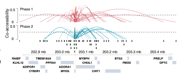
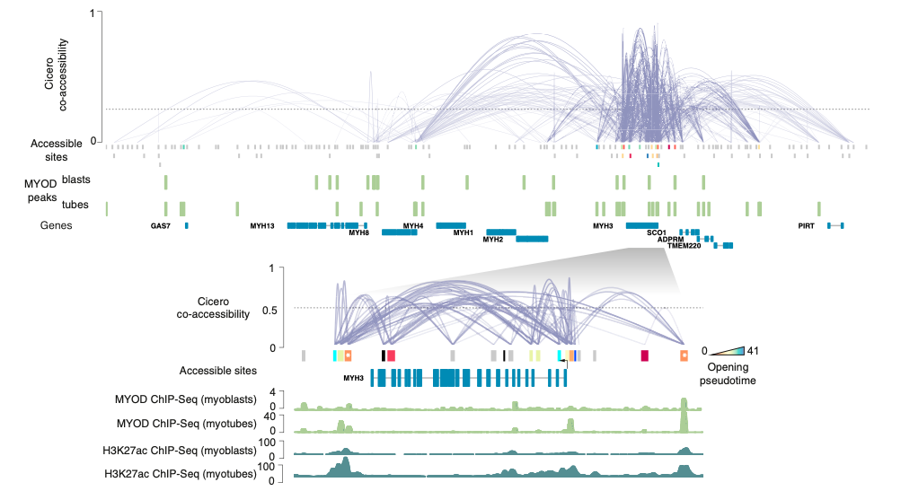
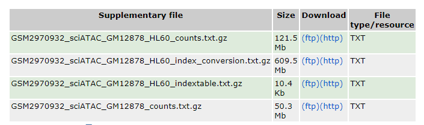
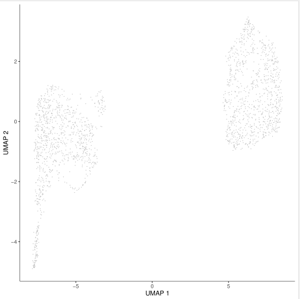
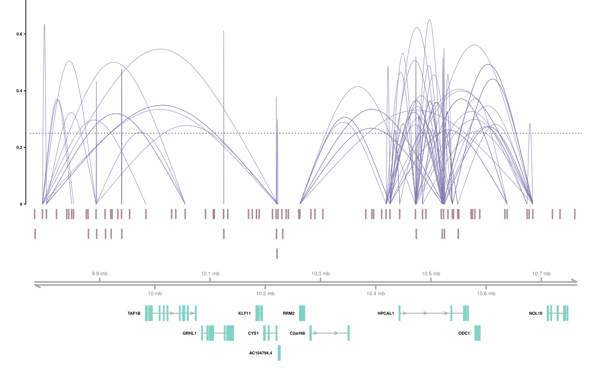
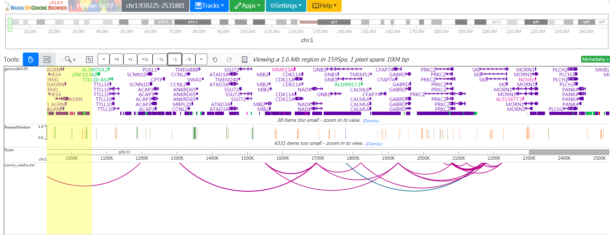
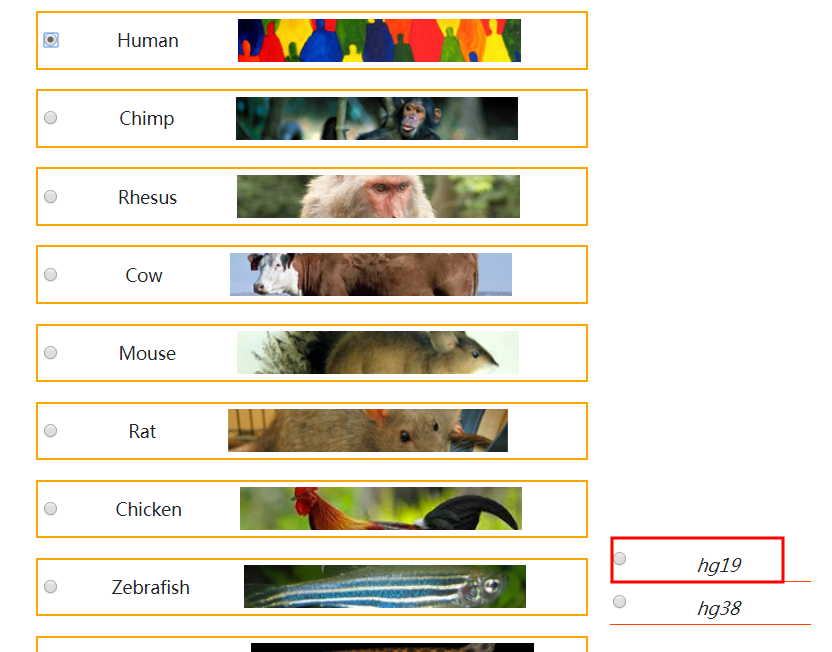
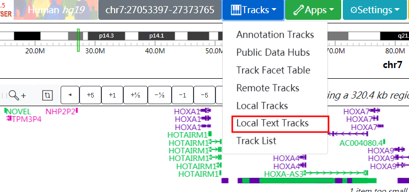
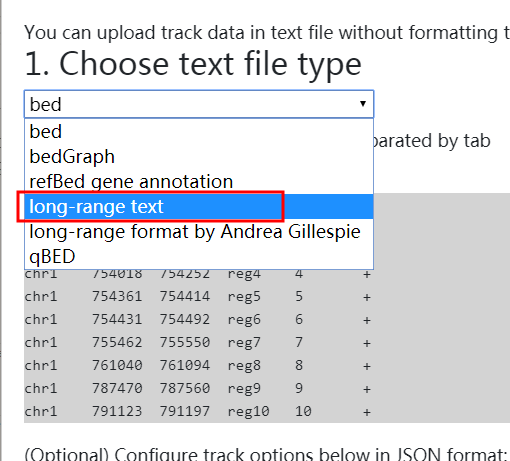
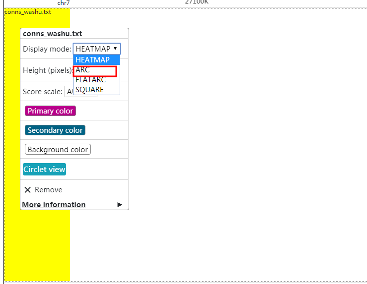

**Author(s)**: `r params$author`  
**Reviewer(s)**: `r params$reviewer`  
**Date**: `r Sys.Date()`  

# Academic Citation
If you use this code in your work or research, we kindly request that you cite our publication:

Xiaofan Lu, et al. (2025). FigureYa: A Standardized Visualization Framework for Enhancing Biomedical Data Interpretation and Research Efficiency. iMetaMed. https://doi.org/10.1002/imm3.70005

```{r setup, include=FALSE}
knitr::opts_chunk$set(echo = TRUE)
```

# 需求描述

# Requirement

用Cicero分析cis-regulation，用washu browser展示结果，搞定中间的衔接。
Analyze cis-regulation with Cicero, display the results with washu browser, and handle the intermediate connections.



Figure 3. Cicero Constructs cis-Regulatory Models Genome-wide from Sci-ATAC-Seq Data
(F) A summary of the Cicero co-accessibility links between the MYOG promoter and distal sites in the surrounding region. The height of connections indicates the magnitude of the Cicero co-accessibility score between the connected peaks. The top set of (red) links were constructed from cells in phase 1, while the bottom (in blue) were built from phase 2.
See also Figures S3 and S4.


Figure 5. Co-accessible DNA Elements Linked by Cicero Are Epigenetically Co-modified
(E) The Cicero map for the 755 kb region surrounding MYH3 along with called MYOD1 ChIP-seq peaks from (Cao et al., 2010). Sites opening in accessibility are colored by their opening pseudotime (see STAR Methods), sites not opening in accessibility are shown in gray. Inset: 60 kb region surrounding MYH3 along with MYOD1 ChIP-seq and H3K27ac ChIP-seq signal tracks from Cao et al. (2010) and the ENCODE Project Consortium (2012). Only protein-coding genes are shown.

出自<https://doi.org/10.1016/j.molcel.2018.06.044>
fromhttps://doi.org/10.1016/j.molcel.2018.06.044

# 应用场景

# Application Scenarios

用单细胞ATAC-seq数据找cis-regulation，为挖掘目的基因的远距离调控机制提供线索。
Search for cis-regulation using single-cell ATAC-seq data to provide clues for exploring the long-distance regulatory mechanism of the target gene.

还可参考这篇Cell paper的Figure 5和6深入挖掘，
You can also refer to Figures 5 and 6 of this Cell paper for in-depth exploration.

<https://www.sciencedirect.com/science/article/pii/S0092867418308559>，

# 环境设置

# Environment Setup

```{r}
source("install_dependencies.R")
```

遇到问题可参考以下安装方法：

Refer to 
[Cicero for Monocle 3](https://cole-trapnell-lab.github.io/cicero-release/docs_m3/#loading-data-from-a-simple-sparse-matrix-format)

踩了软件安装的坑。软件安装有些麻烦，一些依赖不太好解决。所以这里直接用conda安装monocle3。
I fell into a trap in software installation. The software installation is a bit troublesome, and some dependencies are not easy to solve. So here, we directly use conda to install monocle3.

```bash
conda create -n py36 python=3.6
conda activate py36
#conda install -c r r-base=3.6.3
conda install -c bioconda r-monocle3
conda install -c bioconda bioconductor-cicero -y
```

cicero直接安装github版。不用conda安装，是因为conda的cicero不是最新版本，在处理10X cell ranger的数据没问题，但是在处理稀疏矩阵的时候有问题。
Install the github version of cicero directly. Not using conda for installation is because conda's cicero is not the latest version. It works fine with the data of 10X cell ranger, but has problems when dealing with sparse matrices.

MAC系统安装monocle时可能遇到问题，解决方法看这里https://cole-trapnell-lab.github.io/monocle3/docs/installation/
MAC system installing a monocle may encounter problems, solution here at https://cole-trapnell-lab.github.io/monocle3/docs/installation/

```{r, eval=FALSE}
library(tidyverse)
library(cicero) #单细胞ATAC-seq数据分析  # Single-cell ATAC-seq Data analysis
library(monocle3) #单细胞  # Single cell

Sys.setenv(LANGUAGE = "en") #显示英文报错信息  # displays an English error message
options(stringsAsFactors = FALSE) #禁止chr转成factor   # prohibit chr from being converted to factor
```

# 输入文件

# Input File

需要单细胞ATAC-seq数据和基因组注释gtf文件。
Single-cell ATAC-seq data and genomic annotation gtf files are required.

## 单细胞ATAC-seq数据

## Single-cell ATAC-seq data

从GEO下载单细胞ATAC-seq数据：<https://www.ncbi.nlm.nih.gov/geo/query/acc.cgi?acc=GSM2970932>，以其中数据量小些的GSM2970932为例，包括两个细胞的mix，一个是HL60，另外一个是GM12878。
Download single-cell ATAC-seq data from GEO: < https://www.ncbi.nlm.nih.gov/geo/query/acc.cgi?acc=GSM2970932 >, in which the data volume small GSM2970932, for example, including the mix two cells, one is the HL60, another is GM12878.



- GSM2970932_sciATAC_GM12878_HL60_counts.txt.gz，每个peak的reads数量
  GSM2970932_sciATAC_GM12878_HL60_counts.txt.gz, the number of reads per peak
- GSM2970932_sciATAC_GM12878_HL60_indextable.txt.gz，index

这是一种常见格式，好多文章都在GEO中提供这种格式的文件。感兴趣的小伙伴可以参考本文的方式挖掘一下自己感兴趣问题的相关数据。
This is a common format, and many articles provide files in this format in GEO. Interested friends can refer to the methods in this article to dig out the relevant data of the issues they are interested in.

```{r}
# peak read count
cicero_data <- read.table("GSM2970932_sciATAC_GM12878_HL60_counts.txt") 
cicero_data[1:3,]
```

## 基因组注释gtf文件

## Genome annotation gtf file

人和小鼠建议用genecode<https://www.gencodegenes.org>，其他物种可以从ensembl下载<ftp://ftp.ensembl.org/pub>。
The suggestion of mice and humans with genecode < https://www.gencodegenes.org >, other species can be downloaded from the ensembl < ftp://ftp.ensembl.org/pub >.

这里用到的gtf文件我改过，不是原版。建议自己从以上**官网**下载。
The gtf file used here has been modified by me and is not the original version. It is recommended that you download it from the above-mentioned official website by yourself.

```{r}
gene_anno <- rtracklayer::readGFF("hg19.gtf") 
gene_anno[1:3,]

gene_anno$chromosome <- gene_anno$seqid
gene_anno$gene <- gene_anno$gene_id
gene_anno$transcript <- gene_anno$transcript_id
gene_anno$symbol <- gene_anno$gene_name
```

# 评估co-acessiblity打分

# Evaluate the co-acessiblity score

因为单细胞ATAC的数据比较稀疏，所以一般为了评估co-acessiblity打分的时候，需要将feature比较相似的细胞汇聚到一起，再来评估。所以一般会先降维。这里用UMAP降维，也可以用其他任意的降维算法，例如t-SNE，可参考FigureYa27t-SNE。
Because the data of single-cell ATAC is relatively sparse, generally, when scoring to assess co-acessiblity, cells with relatively similar features need to be aggregated together for evaluation. So usually, the dimension is reduced first. Here, UMAP is used for dimensionality reduction. Any other dimensionality reduction algorithm can also be used, such as t-SNE. For reference, see Figure A27 T-SNE.

```{r, eval=FALSE}
input_cds <- make_atac_cds(cicero_data, binarize = TRUE)

set.seed(1234)
# 对于每个细胞来说，计算有多少表达的基因（或开放的peak）在阈值之上，默认是最小表达大于0。
#For each cell, calculate how many expressed genes (or open peaks) are above the threshold. By default, the minimum expression is greater than 0.
# 对于每个基因（peak），计算有多少细胞中有表达水平；
# For each gene (peak), calculate how many cells have an expression level
# 会在rowData或者colData中加一行或一列
# will add a row or a column to rowData or colData
input_cds <- detect_genes(input_cds) 

#计算size factor
# Calculate the size factor
input_cds <- estimate_size_factors(input_cds) 

#normalization：首先通过size factor和深度进行标准化。之后计算较低维度空间，作为下一步降维的输入文件。
#normalization: First, normalize through size factor and depth. Then calculate the lower-dimensional space as the input file for the next step of dimensionality reduction.
input_cds <- preprocess_cds(input_cds, method = "LSI") 

#降维
# Dimension Reduction
input_cds <- reduce_dimension(input_cds, reduction_method = 'UMAP', 
                              preprocess_method = "LSI") 
plot_cells(input_cds)
```



因为是两个细胞的mix，所以分成两个大群，自己数据分析的时候应该注意，是否应该把两个群分开分别计算co-accessibility。这里为了方便展示，就混在一起了。
Since it is a mix of two cells, it is divided into two large groups. When conducting your own data analysis, you should pay attention to whether you should calculate the co-accessibility of the two groups separately. Here, for the sake of convenient display, they are all mixed together.

降维之后可以通过make_cicero_cds来构建cell_data_set (CDS)。
After dimensionality reduction, cell_data_set (CDS) can be constructed through make_cicero_cds.

```{r, eval=FALSE}
umap_coords <- reducedDims(input_cds)$UMAP 
cicero_cds <- make_cicero_cds(input_cds, reduced_coordinates = umap_coords) #构建CDS  # Building CDS

data("human.hg19.genome")
sample_genome <- human.hg19.genome
conns <- run_cicero(cicero_cds, sample_genome, sample_num = 2)  #计算co-accessibility
head(conns)

# conns里面就是两个位置的co-accessibility信息
# conns contains the co-accessibility information for two positions
# 保存到文件
# Save to file
# write.csv(conns, "output_co-accessibility.csv", quote = F, row.names = F)
```

# 开始画图

# Start drawing

## 用cicero画图

## Draw with cicero

cicero自带画图函数，可以参考其说明文档来画图。
cicero comes with its own drawing function. You can refer to its documentation for drawing.

```{r, eval=FALSE}
plot_connections(conns, "chr2", 9773451,10773451,
                 gene_model = gene_anno, 
                 coaccess_cutoff = .25, 
                 connection_width = .5, 
                 collapseTranscripts = "longest" )
```



cicero会调用Gviz包，跟Gviz类似，参数找起来太麻烦。很难调到自己理想的状态。因此，下面用washu browser来展示，**重点是搞定输入文件格式转换**。
cicero will call the Gviz package. Similar to Gviz, it is too troublesome to find the parameters. It's very difficult to adjust to one's ideal state. Therefore, the following is demonstrated using washu browser.  The key point is to handle the input file format conversion.

## 用washu browser展示

## Display with washu browser

把co-accessibility信息转换为washu browser所需的格式。
Convert the co-accessibility information to the format required by washu browser.

```{r, eval=FALSE}
conns_selected <- filter(conns, coaccess >= 0.5 | coaccess <= -0.5)
peak1 <- conns_selected$Peak1 %>% str_split("_",simplify=T)
peak1_chr <- peak1[,1] %>% as.character()
peak1_start <- peak1[,2] %>% as.numeric()
peak1_end <- peak1[,3] %>% as.numeric()
peak2 <- conns_selected$Peak2 %>% str_split("_",simplify=T)
peak2_cor <- peak2[,1] %>% paste(peak2[,2],sep=":") %>% paste(peak2[,3],sep="-") %>% paste(conns_selected$coaccess*10,sep=",")
conns_washu <- data.frame(V1=peak1_chr,V2=peak1_start,V3=peak1_end,V4=peak2_cor,V5=seq_along(peak1_chr)*2,V6=".") %>% arrange(V1,V2,V3,V4)
write.table(conns_washu, "conns_washu.txt", sep="\t", row.names=F, col.names=F)
```

导入washu
Import washu
<https://epigenomegateway.wustl.edu/browser/>



具体方法如下：
The specific methods are as follows:





如果想要example2.png那样展示bw的track，也可以在这里上传
If you want to display the tracks of bw like example2.png, you can also upload them here






# Session Info

```{r}
sessionInfo()
```