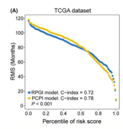

**Author(s)**: `r params$author`  
**Reviewer(s)**: `r params$reviewer`  
**Date**: `r Sys.Date()`  

# Academic Citation
If you use this code in your work or research, we kindly request that you cite our publication:

Xiaofan Lu, et al. (2025). FigureYa: A Standardized Visualization Framework for Enhancing Biomedical Data Interpretation and Research Efficiency. iMetaMed. https://doi.org/10.1002/imm3.70005

```{r setup, include=FALSE}
knitr::opts_chunk$set(echo = TRUE)
```

# 需求描述

# Requirement

用c-index比较两个预后模型，并画出图A。
Compare the two prognostic models using c-index and draw Figure A.



出自<https://onlinelibrary.wiley.com/doi/full/10.1111/cpr.12861>
fromhttps://onlinelibrary.wiley.com/doi/full/10.1111/cpr.12861

FIGURE 6 RMS curves for RPGI and the integrated PCPI scores are plotted for: A, the TCGA cohort, B, validation set 1 and C, validation set 2. Each point represents the RMS time of corresponding RPGI and PCPI scores. The RMS curves show a larger slope in all three data sets for PCPI, indicating superior estimation of survival with PCPI. C-indexes for RPGI and PCPI are also provided. P values represent the difference between the two models in terms of C-index.

# 应用场景

# Application Scenarios

计算限制性生存时间，并比较不同因素的预后价值
Calculate the restrictive survival time and compare the prognostic value of different factors

# 环境设置

# Environment Setup

```{r}
source("install_dependencies.R")

library(survival)
library(survcomp)
library(survRM2)
Sys.setenv(LANGUAGE = "en") #显示英文报错信息  # Display an English error message
options(stringsAsFactors = FALSE) #禁止chr转成factor  # prohibit chr from being converted to factor
```

自定义函数，计算、画图
Custom functions, calculation, and drawing

```{r}
# 自定义函数
# Custom Functions
rms2curve <- function(survdt = NULL, 
                      base.marker = NULL, 
                      modified.marker = NULL, 
                      tau = 120,
                      n.grid = 100,
                      prefix = NULL,
                      width = 4.5,
                      height = 4.5) {
  
  # survdt：输入数据，必须包含生存时间和生存状态，且无缺失值
  # survdt: Input data must include the survival time and survival status, and there must be no missing values
  # base.marker：数值向量，预先计算好的基础marker，样本顺序与survdt一致
  # Base.Marker: Numerical vector, pre-calculated base marker, sample order consistent with survdt
  # modified.marker：数值向量，预先计算好的“综合”marker，样本顺序与survdt一致
  # modified.marker: Numerical vector, pre-calculated "comprehensive" marker, sample order consistent with survdt
  # tau：限制时间点，一般为5年或10年，即60月或120月
  # tau: The time limit is usually 5 or 10 years, that is, 60 months or 120 months
  # n.grid：横左边切割用，默认为100，做百分化处理
  # n.grid: Used for horizontal left cutting, with a default value of 100, for 100% splitting processing
  # prefix：输出图片的前缀名
  # prefix: The prefix name of the output image
  # width：输出图片宽度
  # width: Output the width of the image
  # height：输出图片高度
  # height: Output the height of the image
  
  cat("Please make sure the survival time (day|year) has been converted to survival time (month)!\n")
  surv.time <- survdt$OS.time
  surv.event <- survdt$OS
  marker1 <- base.marker
  marker2 <- modified.marker

  surv <-Surv(surv.time,surv.event)
  marker.pp <- seq(from=0,to=1,length=n.grid)
  marker1.qq <- quantile(marker1,marker.pp)
  marker2.qq <- quantile(marker2,marker.pp)
  
  fitdat.df1 <- data.frame(marker1=marker1)
  newdat.df1 <- data.frame(marker1=marker1.qq)
  
  fitdat.df2 <- data.frame(marker2=marker2)
  newdat.df2 <- data.frame(marker2=marker2.qq)
  
  cox.model1 <- coxph(surv~marker1,data=fitdat.df1)
  rms.calc1 <- summary(survfit(cox.model1,
                               newdata=newdat.df1),rmean=tau)
  rms.mean1 <- rms.calc1$table[,"rmean"]
  
  cox.model2 <- coxph(surv~marker2,data=fitdat.df2)
  rms.calc2 <- summary(survfit(cox.model2,newdata=newdat.df2),rmean=tau)
  rms.mean2 <- rms.calc2$table[,"rmean"]
  
  fit1 <- coxph(Surv(OS.time,OS) ~ marker1,data = survdt)
  cindex1 <- concordance.index(predict(fit1),surv.time = survdt$OS.time,surv.event = survdt$OS,method = "noether")
  
  fit2 <- coxph(Surv(OS.time,OS) ~ marker2,data = survdt)
  cindex2 <- concordance.index(predict(fit2),surv.time = survdt$OS.time,surv.event = survdt$OS,method = "noether")
  ccomp <- cindex.comp(cindex1 = cindex2, cindex2 = cindex1)

  # RMS Curve
  fig.name <- paste0(prefix,".pdf")
  pdf(fig.name, width = width,height = height)
  par(bty="o", mgp = c(1.9,.33,0), mar=c(4.1,4.1,2.1,2.1)+.1, las=1, tcl=-.25)
  plot(marker.pp,rms.mean1,type="p",pch = 19,col = jco[1],ylim = c(0,tau),
       xlab="Percentile of Riskscore",ylab = "RMS (Months)",cex = 0.8)
  points(marker.pp,rms.mean2,pch = 19,col = jco[2],cex = 0.8)
  legend("bottomleft", 
         legend = c(paste0("Baseline    model: C-index = ",round(cindex1$c.index,2)),paste0("Integrative model: C-index = ",round(cindex2$c.index,2)),
                    paste0("P ",ifelse(ccomp$p.value < 0.001, "< 0.001", paste0("= ",round(ccomp$p.value,3))))),
         fill = c(jco[1],jco[2],NA),cex=0.8, border=NA, y.intersp=1, x.intersp=0.2,bty = "n")
  invisible(dev.off())
  
  return(list(survfit.marker1 = fit1,survfit.marker2 = fit2,cindex.compare = ccomp))
}
```

# 输入文件

# Input File

easy_input.csv，包括一个baseline score。一般是预后模型如LASSO得到的基因得分（可参考FigurejYa31lasso的输出文件lasso_output.txt），以及其他额外变量，这些变量可能提高预后的预测性能。
easy_input.csv, including a baseline score. Generally, it is the gene score obtained from prognostic models such as LASSO (refer to the output file lasso_output.txt of FigurejYa31lasso), as well as other additional variables, which may improve the predictive performance of prognosis.

此处的输入数据来自原文，包括由多变量Cox + LASSO惩罚得到的riskscore（例文为RNA processing gene index，缩写为RPGI），以及两个临床变量（年龄、stage），还有time-to-event数据。
The input data here are from the original text, including the riskscore obtained by multivariate Cox + LASSO penalty (the example text is RNA processing gene index, abbreviated as RPGI), as well as two clinical variables (age, stage), and time-to-event data.

```{r}
dat <- read.csv("easy_input.csv", row.names = 1, header = T, check.names = F, stringsAsFactors = F)
dat$OS.time <- dat$OS.time/30.5 #把日转为月  # Convert days to months
dat <- as.data.frame(na.omit(dat))
head(dat)

# 设置颜色
# Set Colors
jco <- c("#2874C5","#EABF00")
```

# 多变量cox模型得到新的score

# The multivariate cox model has obtained a new score

例文为Processing-Clinical prognostic index (PCPI)
Example text: Processing-Clinical prognostic index (PCPI)

```{r}
tmp <- coxph(Surv(OS.time, OS) ~ Riskscore + Age + Stage, data = dat)

base.score <- dat$Riskscore
new.score <- as.numeric(apply(dat[,c("Riskscore","Age","Stage")], 1, function(x) {x %*% as.numeric(tmp$coefficients)}))
```

# 开始画图

# Start drawing

用自定义的函数画图
Draw graphs using custom functions

```{r}
rms <- rms2curve(survdt = dat,
                 base.marker = base.score,
                 modified.marker = new.score,
                 tau = 120,
                 n.grid = 100,
                 prefix = "RMS",
                 width = 4.5,
                 height = 4.5)
```


# Session Info

```{r}
sessionInfo()
```
