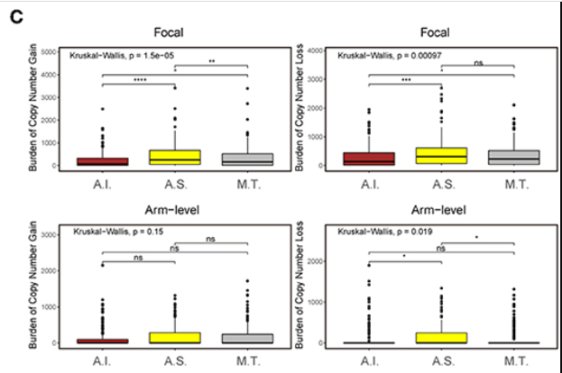

**Author(s)**: `r params$author`  
**Reviewer(s)**: `r params$reviewer`  
**Date**: `r Sys.Date()`  

# Academic Citation
If you use this code in your work or research, we kindly request that you cite our publication:

Xiaofan Lu, et al. (2025). FigureYa: A Standardized Visualization Framework for Enhancing Biomedical Data Interpretation and Research Efficiency. iMetaMed. https://doi.org/10.1002/imm3.70005

```{r setup, include=FALSE}
knitr::opts_chunk$set(echo = TRUE)
```

# 需求描述

# Requirement

比较不同分子分型之间的focal-level gain & loss burden 和 arm-level gain & loss burden，并且画出下图。
Compare the focal level gain & loss burden and arm level gain & loss burden among different molecular subtypes and draw the following figure.



出自<https://pubmed.ncbi.nlm.nih.gov/31998649/>
from<https://pubmed.ncbi.nlm.nih.gov/31998649/>

FIGURE 4 | Genetic and copy number alterations across immune subtypes. (A,C) Distribution of TMB (A) and focal and broad copy number alterations (C) among the TME subtypes. The statistical significance of pairwise comparisons is annotated with symbols in which ns and *** represent not significant (P > 0.05) and P ≤ 0.001, respectively A.I., A.S., and M.T. represent the active immune, active stroma and mixed type, respectively. 

# 应用场景

# Application Scenarios

刻画分型背后的拷贝数burden变化，不同于TMB，copy number load机制更多的涉及到免疫逃逸方面。类似的文章应用还有[Identification of an Immune-specific Class of Hepatocellular Carcinoma, Based on Molecular Features](https://pubmed.ncbi.nlm.nih.gov/28624577/)
Depict the variation of copy number burden behind typing. Different from TMB, the copy number load mechanism is more related to immune escape. Similar article applications include Identification of an Immune-specific Class of Hepatocellular Carcinoma, Based on Molecular Features

**相似结论请引用文章：**
For similar conclusions, please cite the article: 

Shen R, Li P, Li B, Zhang B, Feng L, Cheng S. Identification of Distinct Immune Subtypes in Colorectal Cancer Based on the Stromal Compartment. Front Oncol. 2019;9:1497. doi:10.3389/fonc.2019.01497

# 环境设置

# Environment Setup

```{r}
source("install_dependencies.R")

library(cowplot)
library(ggplot2)
library(ggpubr)
library(tidyverse)
Sys.setenv(LANGUAGE = "en") #显示英文报错信息  # Display an English error message
options(stringsAsFactors = FALSE) #禁止chr转成factor   # prohibit chr from being converted to factor
```

# 输入文件

# Input File

需要GISTIC的两个输出文件focal_data_by_genes.txt和broad_data_by_genes.txt，以及分组临床输入pdat.txt文件。
Two output files of GISTIC, focal_data_by_genes.txt and broad_data_by_genes.txt, as well as the grouped clinical input pdat.txt file, are required.

具体GISTIC运行输入文件的获取和运行操作参考FigureYa79CNV的附录部分，用的是GISTIC的默认参数。
For the specific acquisition and operation of the GISTIC operation input file, please refer to the appendix of Figure A79CNV, which uses the default parameters of GISTIC.

```{r}
# 加载focal和broad data
# Load focal and broad data
focalload <- read.table("focal_data_by_genes.txt", header = T, sep = "\t", check.names = F)
rownames(focalload) <- focalload$Gene.Symbol
head(focalload)[, 1:8]
broadload <- read.table("broad_data_by_genes.txt", header = T, sep = "\t", check.names = F)
rownames(broadload) <- broadload$Gene.Symbol

# 加载分组信息
# Load group information
crcpdata  <- read.table("pdat.txt", header = T, sep = "\t")
head(crcpdata)
```

# 分别统计focal和broad的gain load和loss load

# Count the gain load and loss load of focal and broad respectively

```{r}
## focal
focalload <- focalload[, -c(1:3)]
focalgainload <- focalload
focallossload <- focalload
# gain 
focalgainload[focalgainload > 0]  <- 1
focalgainload[focalgainload < 0]  <- 0
focalgainload <- data.frame(colSums(focalgainload))
colnames(focalgainload) <- "focal_gain_load"
# loss
focallossload[focallossload > 0]  <- 0
focallossload[focallossload < 0]  <- 1
focallossload <- data.frame(colSums(focallossload))
colnames(focallossload) <- "focal_loss_load"

## broad
broadload <- broadload[, -c(1:3)]
broadload_gain <- broadload
broadload_loss <- broadload
# gain 
broadload_gain[broadload_gain > 0] <- 1
broadload_gain[broadload_gain < 0] <- 0
broadload_gain <- data.frame(colSums(broadload_gain))
colnames(broadload_gain) <- "broad_gain_load"
# loss 
broadload_loss[broadload_loss > 0] <- 0
broadload_loss[broadload_loss < 0] <- 1
broadload_loss <- data.frame(colSums(broadload_loss))
colnames(broadload_loss) <- "broad_loss_load"

## 把focal和broad的gain load和loss load这四列merge在一起
## merge the four columns of gain load and loss load of focal and broad together
copyloadlist <- list(focalgainload = focalgainload, focallossload = focallossload,
                     broadload_gain = broadload_gain, broadload_loss = broadload_loss)
for (i in 1:length(copyloadlist)){
  tmpdata <- copyloadlist[[i]]
  copyloadlist[[i]] <- data.frame(barcode = rownames(tmpdata), tmpdata)
}
copyload <- Reduce(function(x, y) merge(x = x, y = y, by = "barcode"), 
                   copyloadlist)
head(copyload)

## 再跟分组信息merge在一起
## merge it with the grouping information again
rownames(copyload) <- copyload$barcode
copyload <- data.frame(sampleID = str_sub(rownames(copyload), 1, 16),
                       copyload)
copyload <- merge(copyload, crcpdata[, c("TME_Subtype", "sampleID")], by = "sampleID")
copyload$TME_Subtype <- as.character(copyload$TME_Subtype)
head(copyload)
table(copyload$TME_Subtype)
```

# 开始画图

# Start drawing

```{r fig.width=10,fig.height=8}
# 让图中的三组数据按顺序排列
# Arrange the three groups of data in the picture in sequence
copyload$TME_Subtype <- factor(copyload$TME_Subtype, levels = c("Active immune", 
                                                                "Active stroma",
                                                                "Mixed type"))
# 对比时的分组
# Grouping during Comparison
my_comparisons <- list(c("Active immune", "Active stroma"),
                       c("Active immune", "Mixed type"),
                       c("Active stroma", "Mixed type"))

# 画图，写在list里
# Draw a picture and write it in the list
copyplot <- lapply(1:4, function(i){
  loadname <- colnames(copyload)[3:6]
  plotdata <- copyload[, c(loadname[i], "TME_Subtype")]
  colnames(plotdata) <- c("loadtype", "TME_Subtype")
  ylabel <- c("Burden of Copy Number Gain", "Burden of Copy Number Loss",
              "Burden of Copy Number Gain", "Burden of Copy Number Loss")
  mainlabel <- c("Focal", "Focal", "Arm-level", "Arm-level")
  label <- ggdraw() + draw_label(mainlabel[i])
  ymax <- max(plotdata$loadtype)
  plot_grid(label, 
            ggpubr::ggboxplot(plotdata, x = "TME_Subtype", y = "loadtype", 
                    fill = "TME_Subtype", palette =c("brown", "yellow", "grey"),
                    ggtheme = theme_bw()) +
              theme(panel.grid =element_blank()) +
              xlab("") +
              ylab(ylabel[i]) +
              theme(legend.position = "none")+
              theme(axis.title.y = element_text(size = rel(1.25)),
                    axis.text.x = element_text(size = rel(1.25)),
                    axis.text.y = element_text(size = rel(1.25))) +
              stat_compare_means(comparisons = my_comparisons, label = "p.signif") + 
              stat_compare_means(label.y = 1.45*ymax,
                                 label.x = 0.8),
            ncol=1, rel_heights=c(.2, 1))
  })

# 组图
# Group Pictures
cowplot::plot_grid(plotlist = copyplot, ncol = 2)
ggsave("CNVload.pdf", width = 10, height = 8)
```

# Session Info

```{r}
sessionInfo()
```