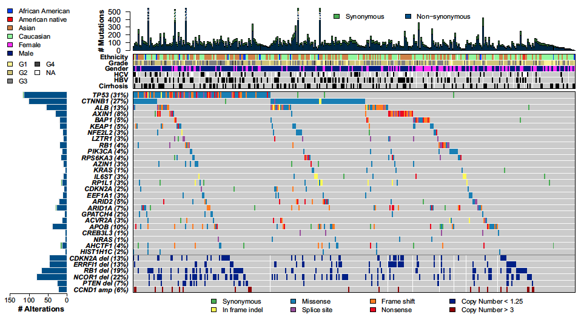
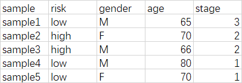

**Author(s)**: `r params$author`  
**Date**: `r Sys.Date()`  


# Academic Citation
If you use this code in your work or research, we kindly request that you cite our publication:

Xiaofan Lu, et al. (2025). FigureYa: A Standardized Visualization Framework for Enhancing Biomedical Data Interpretation and Research Efficiency. iMetaMed. https://doi.org/10.1002/imm3.70005

```{r setup, include=FALSE}
knitr::opts_chunk$set(echo = TRUE)
```

# 需求描述
# Requirement description

用R代码画出paper里的这种瀑布图。

Use R code to draw oncoplot like the one in the paper.



出自<https://www.cell.com/cell/abstract/S0092-8674(17)30639-6>

from<https://www.cell.com/cell/abstract/S0092-8674(17)30639-6>

# 使用场景
# Usage scenario

展示多个样本中多个基因的突变情况，包括但不限于SNP、indel、CNV。

尤其是几十上百的大样本量的情况下，一目了然，看出哪个基因在哪个人群里突变多，以及多种突变类型的分布。

- 场景一：作为全基因组测序或全外显子组测序文章的第一个图。
- 场景二：展示感兴趣的癌症类型里，某一个通路的基因突变情况。

这里用TCGAbiolinks下载数据，用maftools画图。如果要更灵活的定制，可参考FigureYa42oncoprint，用complexheatmap画图。

maftools功能丰富，浏览一下<https://bioconductor.org/packages/release/bioc/vignettes/maftools/inst/doc/maftools.html>，知道用它能画哪些图，需要时就知道过来找啦～

Display the mutations of multiple genes in multiple samples, including but not limited to SNP, indel and CNV.

Especially in the case of dozens or hundreds of large sample volumes, it is clear at a glance which gene has more mutations in which population, and the distribution of multiple types of mutations.

- Scenario 1: As the first figure in a whole genome sequencing or whole exome sequencing article.
- Scenario 2: Show the genetic mutation of a certain pathway in the type of cancer you are interested in.

Here, use TCGAbiolinks to download data and draw with maftools. If you want more flexible customization, you can refer to FigureYa42oncoprint and draw with complexheatmap.

Maftools are rich in functions, browse <https://bioconductor.org/packages/release/bioc/vignettes/maftools/inst/doc/maftools.html> to know what kind of graphs you can draw with it, and then come to it when you need it~

# 环境设置
# Environment setting

```{r}
source("install_dependencies.R")

library(TCGAbiolinks)
library(maftools)
Sys.setenv(LANGUAGE = "en") #显示英文报错信息 display English error messages
options(stringsAsFactors = FALSE) #禁止chr转成factor prohibit the conversion of chr to factor
```

# 输入文件下载
# Input file download

需要下载突变信息和临床信息，作为输入数据。

Mutation information and clinical information need to be downloaded as input data.

```{r,message=FALSE,warning=FALSE}
#查看癌症项目名缩写
#view cancer program name abbreviations
cancerName <- data.frame(id = TCGAbiolinks:::getGDCprojects()$project_id, name = TCGAbiolinks:::getGDCprojects()$name)
head(cancerName)
```

## 下载临床信息
## Download clinical information

参数`project = `后面写你要看的癌症名称缩写

Parameter `project = ` followed by the abbreviation of the cancer name you want to view

```{r,message=FALSE}
on.exit(unlink("GDCdata", recursive = TRUE, force = TRUE), add = TRUE)

clinical <- GDCquery(project = "TCGA-LIHC", 
                     data.category = "Clinical", 
                     data.type = "Clinical Supplement", 
                     data.format = "BCR XML")

GDCdownload(clinical)

cliquery <- GDCprepare_clinic(clinical, clinical.info = "patient")
colnames(cliquery)[1] <- "Tumor_Sample_Barcode"
# 用View查看临床数据里有哪些项，不同癌症不一样，每个人感兴趣的性状也不同，根据自己的需要来选择感兴趣的列
# 理论上，每一列都可以作为分类信息画出来。
# use View to see what items are in the clinical data, different cancers are different, and each person is interested in different traits, select the columns of interest according to your needs
# theoretically, each column can be drawn as classified information.
#View(cliquery)

# 加载自定义分组，例如risk高低等信息，后面就可以像其他临床信息一样，按risk分组了
# load custom grouping, such as high and low risk and other information, and then you can group by risk like other clinical information
#group <- read.table("group.txt")
#cliquery <- merge(group, cliquery, by.x = "sample", by.y = "Tumor_Sample_Barcode")
```



这里history_hepato_carcinoma_risk_factors列有50种类型，按照例图，只提取其中的Hepatitis B、Hepatitis C和cirrhosis。

Here history_hepato_carcinoma_risk_factors has 50 types listed, and according to the example diagram, only Hepatitis B, Hepatitis C and cirrhosis are extracted from them.

```{r}
cliquery$HBV <- 0
cliquery$HBV[grep(pattern = "Hepatitis B",cliquery$history_hepato_carcinoma_risk_factors)] <- 1

cliquery$HCV <- 0
cliquery$HCV[grep(pattern = "Hepatitis C",cliquery$history_hepato_carcinoma_risk_factors)] <- 1

cliquery$cirrhosis <- 0
cliquery$cirrhosis[grep(pattern = "cirrhosis",cliquery$history_hepato_carcinoma_risk_factors)] <- 1
```

后面我们将以`neoplasm_histologic_grade`，`gender`，`race_list`，`HCV`，`HBV`，`cirrhosis`作为分类画图。

Later we will draw with `neoplasm_histologic_grade`, `gender`, `race_list`, `HCV`, `HBV`, `cirrhosis` as classifications.

## 下载突变数据
## Download mutation data

4种找mutation的pipeline任选其一：`muse`, `varscan2`, `somaticsniper`, `mutect2`，此处选mutect2。

Choose one of the 4 types of pipelines to find mutation: `muse`, `varscan2`, `somaticsniper`, `mutect2`, choose mutect2 here.

```{r,message=FALSE}
query_maf <- GDCquery(
  project = "TCGA-LIHC",
  data.category = "Simple Nucleotide Variation",
  data.type = "Masked Somatic Mutation",
  workflow.type = "Aliquot Ensemble Somatic Variant Merging and Masking"
)
GDCdownload(query_maf)
maf_data <- GDCprepare(query_maf) 
mut <- as.data.frame(maf_data)
maf <- read.maf(maf = mut, clinicalData = cliquery, isTCGA = T)
```

# 开始画图
# Start drawing

oncoplot画法：<https://bioconductor.org/packages/release/bioc/vignettes/maftools/inst/doc/oncoplots.html>

oncoplot drawing method: <https://bioconductor.org/packages/release/bioc/vignettes/maftools/inst/doc/oncoplots.html>

## 展示突变频率排名前20的基因
## Show the top 20 genes with mutation frequency

```{r}
pdf("oncoplotTop20.pdf",width = 15,height = 10)
oncoplot(maf = maf,
         top = 20,
         clinicalFeatures = c("race_list", "neoplasm_histologic_grade", "gender", "HCV", "HBV", "cirrhosis")
         )
dev.off()
```


## 用默认配色方案展示一个列表里的基因
## Show genes in a list with default color scheme

把你感兴趣的基因名存到`easy_input.txt`文件里，每个基因为一行。就可以只画这几个基因，其中没发生突变的基因会被忽略。

Save the gene names you are interested in to the `easy_input.txt` file, one row per gene. Only these genes will be drawn, and genes without mutations will be ignored.  

```{r}
geneName <- read.table("easy_input.txt",header = F,as.is = T)
genelist <- geneName$V1

pdf("oncoplotLIST.pdf",width = 12,height = 6)
oncoplot(maf = maf,
         genes = genelist,
         clinicalFeatures = c("race_list","neoplasm_histologic_grade","gender","HCV","HBV","cirrhosis")
         )
dev.off()
```


## 重新配色展示突变频率排名前20的基因
## Recolor to show the top 20 genes with mutation frequency

默认的颜色不够好看，还可以改配色

The default color is not good-looking enough, and you can also change the color scheme

```{r}
#突变
#mutation
col = RColorBrewer::brewer.pal(n = 10, name = 'Paired')
names(col) = c('Frame_Shift_Del','Missense_Mutation', 'Nonsense_Mutation', 'Frame_Shift_Ins','In_Frame_Ins', 'Splice_Site', 'In_Frame_Del','Nonstop_Mutation','Translation_Start_Site','Multi_Hit')

#人种
#race
racecolors = RColorBrewer::brewer.pal(n = 4,name = 'Spectral')
names(racecolors) = c("ASIAN", "WHITE", "BLACK_OR_AFRICAN_AMERICAN",  "AMERICAN_INDIAN_OR_ALASKA_NATIVE")

#病毒、肝硬化
#virus, cirrhosis
factcolors = c("grey","black")
names(factcolors) = c("0","1")
annocolors = list(race_list = racecolors, 
                  HCV = factcolors, 
                  HBV = factcolors, 
                  cirrhosis = factcolors)

maf@clinical.data$HBV <- as.character(maf@clinical.data$HBV)
maf@clinical.data$HCV <- as.character(maf@clinical.data$HCV)
maf@clinical.data$cirrhosis <- as.character(maf@clinical.data$cirrhosis)

#画图
#draw a plot
pdf("oncoplotTop20_col.pdf",width = 15,height = 10)
oncoplot(maf = maf,
         colors = col,#给突变配色 match colors to mutations
         annotationColor = annocolors, #给临床信息配色 match colors to clinical information
         top = 20,
         clinicalFeatures = c("race_list","HCV","HBV","cirrhosis"),
         writeMatrix =T)
dev.off()
```


还可以按样本信息来分组。这里按人种来分组，你还可以按照其他感兴趣的特征来分组，例如是否有病毒感染、基因型、生存信息等

It can also be grouped according to sample information. It is grouped by race here, and you can also group according to other characteristics of interest, such as whether there is a virus infection, genotype, survival information, etc.

```{r}
#png("oncoplotGroup.png",width = 1000,height = 500)
pdf("oncoplotGroup.pdf",width = 15,height = 10)
oncoplot(maf = maf,
         colors = col,#给突变配色 match colors to mutations
         annotationColor = annocolors, #给临床信息配色 match colors to clinical information
         top = 20,
         clinicalFeatures = c("race_list","HCV","HBV","cirrhosis"), # 分组依据排在第一位 the grouping basis ranks first
         sortByAnnotation = TRUE,
         writeMatrix =T)
dev.off()
```


# Session Info

```{r}
sessionInfo()
```
