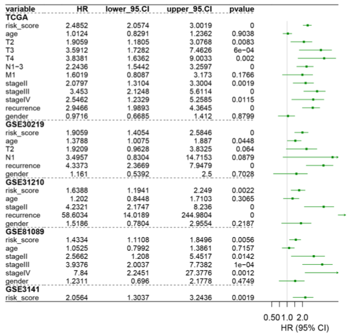

**Author(s)**: `r params$author`  
**Reviewer(s)**: `r params$reviewer`  
**Date**: `r Sys.Date()`  

# Academic Citation
If you use this code in your work or research, we kindly request that you cite our publication:

Xiaofan Lu, et al. (2025). FigureYa: A Standardized Visualization Framework for Enhancing Biomedical Data Interpretation and Research Efficiency. iMetaMed. https://doi.org/10.1002/imm3.70005

```{r setup, include=FALSE}
knitr::opts_chunk$set(echo = TRUE)
```

# 需求描述

# Requirement

上半部分是TCGA数据，下半部分是用GEO数据集验证，riskscore用多因素cox或lasso都行。搞一个GEO验证集就好了，例文的两个GEO数据都是类似的，我们比葫芦画瓢。
The upper part is TCGA data, and the lower part is verified using the GEO dataset. riskscore can be achieved using either multivariate cox or lasso. Just set up a GEO validation set. The two GEO data in the example are similar. Let's imitate them.



出自<https://translational-medicine.biomedcentral.com/articles/10.1186/s12967-019-1824-4>
fromhttps://translational-medicine.biomedcentral.com/articles/10.1186/s12967-019-1824-4

# 应用场景

# Application Scenarios

训练集构建riskscore并验证，采用多变量回归检验预后独立性并绘制森林图。
The riskscore of the training set was constructed and verified. Multivariate regression was used to test the prognostic independence and a forest map was drawn.

# 环境设置

# Environment Setup

```{r}
source("install_dependencies.R")

library(survival) # 生存分析  # Survival Analysis
library(glmnet) # LASSO回归   # LASSO Regression
library(forestplot) # 绘制森林图   # Draw forest maps

Sys.setenv(LANGUAGE = "en") #显示英文报错信息  # displays an English error message
options(stringsAsFactors = FALSE) #禁止chr转成factor  # prohibit chr from being converted to factor
```

自定义函数显示进程
Custom functions display processes

```{r}
display.progress = function (index, totalN, breakN=20) {
  if ( index %% ceiling(totalN/breakN)  ==0  ) {
    cat(paste(round(index*100/totalN), "% ", sep=""))
  }
}  
```

# 输入文件

# Input File

需要表达矩阵和生存信息
The matrix and survival information need to be expressed.

这里用TCGA数据做训练集，用从GEO数据库下载的一组表达数据做测试集。如果你用多组GEO数据或自己的表达数据做测试集，就依次添加。
Here, TCGA data is used as the training set, and a set of expression data downloaded from the GEO database is used as the test set. If you use multiple sets of GEO data or your own expression data as test sets, add them one by one.

- tcga.expr.txt，TCGA的表达矩阵；/ the expression matrix of TCGA.
- tcga.surv.txt，TCGA的生存数据。/ survival data of TCGA.
- gse39582.expr.txt，GEO的表达矩阵；/ the expression matrix of GEO.
- gse39582.surv.txt，GEO的生存数据。/ survival data of GEO.

```{r}
# 加载TCGA训练集
# Load the TCGA training set
tcga.expr <- read.table("tcga.expr.txt", row.names = 1, check.names = F, stringsAsFactors = F, header = T)
tcga.expr[1:3, 1:3]
tcga.surv <- read.table("tcga.surv.txt", row.names = 1, check.names = F, stringsAsFactors = F, header = T)
tcga.surv[1:3,]
# 保留既有表达数据又有生存数据的sample
# Retain samples that have both expressive data and survival data
comsam.tcga <- intersect(rownames(tcga.surv), colnames(tcga.expr))
tcga.expr <- tcga.expr[,comsam.tcga]
tcga.surv <- tcga.surv[comsam.tcga,]

# 加载GEO测试集
# Load the GEO test set
geo.expr <- read.delim("gse39582.expr.txt", row.names = 1, check.names = F, stringsAsFactors = F, header = T)
geo.surv <- read.table("gse39582.surv.txt", row.names = 1, check.names = F, stringsAsFactors = F, header = T)
# 保留既有表达数据又有生存数据的sample
# Retain samples that have both expressive data and survival data
comsam.geo <- intersect(rownames(geo.surv), colnames(geo.expr))
geo.expr <- geo.expr[,comsam.geo]
geo.surv <- geo.surv[comsam.geo,]

# 取交集基因并做数据标准化用于模型构建
# Take the intersection genes and standardize the data for model construction
comgene <- intersect(rownames(tcga.expr), rownames(geo.expr))
tcga.expr <- as.data.frame(t(scale(t(log2(tcga.expr[comgene,] + 1)))))
geo.expr <- as.data.frame(t(scale(t(geo.expr[comgene,]))))
```

# 训练集用传统做法构建riskscore（单变量cox + 多变量cox + LASSO惩罚）

# The training set was constructed with riskscore using the traditional approach (univariate cox + multivariate cox + LASSO penalty).

```{r}
# 单变量cox
# Univariate cox
unicox <- data.frame()
for(i in 1:nrow(tcga.expr)){
  
  display.progress(index = i, totalN = nrow(tcga.expr))
  gene <- rownames(tcga.expr)[i]
  tmp <- data.frame(expr = as.numeric(tcga.expr[i,]),
                    futime = tcga.surv$OS.time,
                    fustat = tcga.surv$OS,
                    stringsAsFactors = F)
  
  # 移除缺失值 | Remove missing values
  tmp <- na.omit(tmp)
  
  # 检查是否有足够的数据进行cox分析 | Check if there is enough data for cox analysis
  if (nrow(tmp) < 10) {  # 至少需要10个观测值 | Need at least 10 observations
    cat("跳过基因", gene, ": 观测值不足\n")
    cat("Skipping gene", gene, ": insufficient observations\n")
    next
  }
  
  # 检查表达值是否都是常数 | Check if expression values are all constant
  if (sd(tmp$expr, na.rm = TRUE) == 0) {
    cat("跳过基因", gene, ": 表达值为常数\n")
    cat("Skipping gene", gene, ": constant expression values\n")
    next
  }
  
  # 检查是否有事件发生 | Check if any events occurred
  if (sum(tmp$fustat) == 0) {
    cat("跳过基因", gene, ": 无事件发生\n")
    cat("Skipping gene", gene, ": no events occurred\n")
    next
  }
  
  tryCatch({
    cox <- coxph(Surv(futime, fustat) ~ expr, data = tmp)
    coxSummary <- summary(cox)
    unicox <- rbind.data.frame(unicox,
                               data.frame(gene = gene,
                                          HR = as.numeric(coxSummary$coefficients[,"exp(coef)"])[1],
                                          z = as.numeric(coxSummary$coefficients[,"z"])[1],
                                          pvalue = as.numeric(coxSummary$coefficients[,"Pr(>|z|)"])[1],
                                          lower = as.numeric(coxSummary$conf.int[,3][1]),
                                          upper = as.numeric(coxSummary$conf.int[,4][1]),
                                          stringsAsFactors = F),
                               stringsAsFactors = F)
  }, error = function(e) {
    cat("跳过基因", gene, ": Cox分析错误 -", e$message, "\n")
    cat("Skipping gene", gene, ": Cox analysis error -", e$message, "\n")
  })
}

# 检查是否有成功的cox分析结果 | Check if any Cox analysis was successful
if (nrow(unicox) == 0) {
  stop("没有基因成功完成Cox分析，请检查数据质量\nNo genes successfully completed Cox analysis, please check data quality")
}

# 多变量cox+LASSO惩罚
# Multivariate cox+LASSO punishment
set.seed(2020821)
selgene <- unicox[which(unicox$pvalue < 0.05), "gene"]

# 检查是否有显著基因 | Check if there are significant genes
if (length(selgene) == 0) {
  stop("没有显著基因（p < 0.05），无法进行LASSO分析\nNo significant genes (p < 0.05), cannot perform LASSO analysis")
}

cvfit = cv.glmnet(t(tcga.expr[selgene,]), 
                  Surv(tcga.surv$OS.time, tcga.surv$OS),
                  family = "cox",
                  nfold = 10) 

myCoefs <- coef(cvfit, s="lambda.min");
lasso_fea <- myCoefs@Dimnames[[1]][which(myCoefs != 0 )]

# 检查LASSO是否选择了特征 | Check if LASSO selected any features
if (length(lasso_fea) == 0) {
  stop("LASSO没有选择任何特征，请调整参数\nLASSO did not select any features, please adjust parameters")
}

# 计算训练集riskscore（rs）
# Calculate the riskscore (rs) of the Training Set
rs.tcga <- apply(t(tcga.expr[lasso_fea,]), 1, function(x) {x %*% myCoefs@x})

# 计算测试集riskscore
# Calculate the riskscore of the test set
rs.geo <- apply(t(geo.expr[lasso_fea,]), 1, function(x) {x %*% myCoefs@x})

#--------------------#
# 计算rs的预后独立性 #
# Calculate the prognostic independence of rs #

# 训练集预后独立性
# Training set prognostic independence
tcga.surv$riskscore <- rs.tcga[rownames(tcga.surv)]
head(tcga.surv)

# 移除缺失值 | Remove missing values
tcga.surv_complete <- na.omit(tcga.surv)

mulcox.tcga <- summary(coxph(Surv(OS.time, OS) ~ ., data = tcga.surv_complete))
mulcox.tcga <- data.frame(variable = rownames(mulcox.tcga$conf.int),
                          HR = mulcox.tcga$conf.int[,1],
                          lower.95CI = mulcox.tcga$conf.int[,3],
                          upper.95CI = mulcox.tcga$conf.int[,4],
                          p = mulcox.tcga$coefficients[,5],
                          stringsAsFactors = F)
rownames(mulcox.tcga) <- NULL
head(mulcox.tcga)

# 测试集预后独立性
# Test set prognostic independence
geo.surv$riskscore <- rs.geo[rownames(geo.surv)]
head(geo.surv)
geo.surv <- geo.surv[,c("Age","Sex","Stage","OS","OS.time","riskscore")] # 保持和训练集一样的顺序
# Keep the same order as the training set

# 移除缺失值 | Remove missing values
geo.surv_complete <- na.omit(geo.surv)

mulcox.geo <- summary(coxph(Surv(OS.time, OS) ~ ., data = geo.surv_complete))
mulcox.geo <- data.frame(variable = rownames(mulcox.geo$conf.int),
                         HR = mulcox.geo$conf.int[,1],
                         lower.95CI = mulcox.geo$conf.int[,3],
                         upper.95CI = mulcox.geo$conf.int[,4],
                         p = mulcox.geo$coefficients[,5],
                         stringsAsFactors = F)
rownames(mulcox.geo) <- NULL
head(mulcox.geo) # 该死，这个riskscore在测试集里不是独立预后因素，但nobody cares，继续画图
# Damn it, this riskscore is not an independent prognostic factor in the test set, but nobody cares, keep plotting
```

# 绘制森林图

# Draw a Forest Map

注意！因为HR值太大了，画出来很丑，所以我把轴状的HR取了对数，此时log2(HR)范围在[-Inf, Inf]，参考值为0（对应HR为1无意义的时候）
Attention! Because the HR value is too large and looks ugly when drawn, I took the logarithm of the axially shaped HR. At this time, the log2(HR) range is [-Inf, Inf], and the reference value is 0 (corresponding to when HR is 1 and meaningless).

取对数画图的做法，可参考我最新发表在Cell Proliferation上的文章中的Figure 2B （RNA processing genes characterize RNA splicing and further stratify colorectal cancer）<https://onlinelibrary.wiley.com/doi/full/10.1111/cpr.12861>
The method of drawing graphs by taking logarithms You may refer to Figure 2B in my latest article published in Cell Proliferation (RNA processing genes characterize RNA splicing and further stratify Colorectal cancer) < https://onlinelibrary.wiley.com/doi/full/10.1111/cpr.12861

```{r}
hrtable <- rbind(c("TCGA",NA,NA,NA,NA),
                 mulcox.tcga,
                 c("GSE39582",NA,NA,NA,NA),
                 mulcox.geo)
tabletext <- cbind(c("Variable",hrtable$variable),
                   c("HR",format(round(as.numeric(hrtable$HR),3),nsmall = 3)),
                   c("lower 95%CI",format(round(as.numeric(hrtable$lower.95CI),3),nsmall = 3)),
                   c("upper 95%CI",format(round(as.numeric(hrtable$upper.95CI),3),nsmall = 3)),
                   c("pvalue",formatC(as.numeric(hrtable$p), format = "e", digits = 2)))
tabletext
nrow(tabletext) + 1 #把这个数字写入hrzl_lines参数的第四行   # Write this number to the fourth line of the hrzl_lines parameter

# 按需设置，因为注意到第二行的NA变成了字符串，因此会显示在最终的森林图里，这里改为NA
# Set as needed. Since it was noticed that the "NA" in the second line has become a string, it will be displayed in the final forest diagram. Here, it is changed to "NA"
tabletext[2,] <- c("TCGA",NA,NA,NA,NA) 
# 按需设置，因为注意到第九行的NA变成了字符串，因此会显示在最终的森林图里，这里改为NA
# Set as needed. Since it was noticed that the "NA" in the ninth line has become a string, it will be displayed in the final forest diagram. Here, it is changed to "NA"
tabletext[9,] <- c("GSE39582",NA,NA,NA,NA) 

pdf("forestplot of risk table.pdf", width = 8, height = 5)
forestplot(labeltext=tabletext,
           mean=c(NA,log2(as.numeric(hrtable$HR))),#log2(HR)
           lower=c(NA,log2(as.numeric(hrtable$lower.95CI))), #log2(95%置信区间下限)  #log2(Lower Limit of the 95% confidence interval)
           upper=c(NA,log2(as.numeric(hrtable$upper.95CI))),#log2(95%置信区间上限)  #log2(upper limit of the 95% confidence interval)
           graph.pos=6,#图在表中的列位置  # The column positions of the figure in the table
           graphwidth = unit(.25,"npc"),#图在表中的宽度比  # the width ratio of the graph in the table
           fn.ci_norm="fpDrawDiamondCI",#box类型选择钻石   #select diamond as the box type
           col=fpColors(box="#00A896", lines="#02C39A", zero = "black"),#box颜色  #box colors
           boxsize=0.4,#box大小固定  #box size is fixed
           lwd.ci=1,
           ci.vertices.height = 0.1,ci.vertices=F,#不显示区间  # does not display intervals
           zero=0,#zero线横坐标  #zero is the x-coordinate of the line
           lwd.zero=2,#zero线宽  #zero line width
           xticks = c(-1,0,1,2,3,4,5),#横坐标刻度根据需要可随意设置  # horizontal coordinate scale can be set freely as needed
           lwd.xaxis=2,
           xlab=expression("log"[2]~"HR"),
           hrzl_lines=list("1" = gpar(lwd=2, col="black"),#第二行顶部加黑实线  #Add a black solid line at the top of the second line
                           "2" = gpar(lwd=1, col="grey50", lty=2),#第二行顶部加灰色虚线  # add a gray dotted line at the top of the second line
                           "9" = gpar(lwd=1, col="grey50", lty=2),#第九行顶部加灰色虚线  # add a gray dotted line at the top of the ninth line
                           "16" = gpar(lwd=2, col="black")),#最后一行底部加黑线，""中数字为nrow(tabletext) + 1  # with a black line at the bottom of the last line, and the number in "" is nrow(tabletext) + 1
           txt_gp=fpTxtGp(label=gpar(cex=1.2),#各种字体大小设置  # Various font size Settings
                          ticks=gpar(cex=0.85),
                          xlab=gpar(cex=1),
                          title=gpar(cex=1.5)),
           lineheight = unit(.75,"cm"),#固定行高  # Fixed row height
           colgap = unit(0.3,"cm"),
           mar=unit(rep(1.5, times = 4), "cm"),
           new_page = F
)
invisible(dev.off())
```


# Session Info

```{r}
sessionInfo()
```
