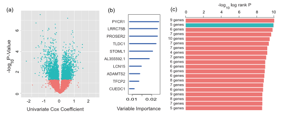
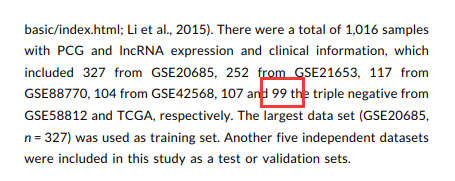

**Author(s)**: `r params$author`  
**Date**: `r Sys.Date()`  

# Academic Citation
If you use this code in your work or research, we kindly request that you cite our publication:

Xiaofan Lu, et al. (2025). FigureYa: A Standardized Visualization Framework for Enhancing Biomedical Data Interpretation and Research Efficiency. iMetaMed. https://doi.org/10.1002/imm3.70005

```{r setup, include=FALSE}
knitr::opts_chunk$set(echo = TRUE)
```

# 需求描述

我想实现下文章figure 1c的计算方法，FigureYa182RFSurv挑出了importance 比较大的基因，后续常规用muticox等方法再缩减基因。这篇文章写的是用1023中组合按KM的 logRank pvalue和基因数目挑选模型，不一样的风格。

# Requirement Description
I would like to crowdsource the calculation method for Figure 1c in the article. FigureYa182RFSurv selected genes with relatively high importance, followed by conventional methods like multicox to further reduce the number of genes. However, this paper describes a different approach—selecting the model from 1,023 combinations based on the log-rank p-value of the Kaplan-Meier (KM) analysis and the number of genes, which is a distinct style.



出自<https://onlinelibrary.wiley.com/doi/abs/10.1002/jcp.28600>
from<https://onlinelibrary.wiley.com/doi/abs/10.1002/jcp.28600>

FIGURE 1 Identification of candidate genes and development of an integrated PCG‐lncRNA signature. (a) Volcano plot displayed the lncRNAs and PCGs of the univariate Cox regression analysis. (b) Random survival forest analysis screened 10 genes. (c) After Kaplan–Meier analysis of 2 ‒1 = 1,023 combinations, the top 20 signatures were sorted according to the p value of KM. And the signature included five genes that were screened out, for it had a relative big −log10 p value and a small number of genes. KM: Kaplan–Meier; lncRNA: long noncoding RNA; PCG: protein‐coding gene

# 应用场景
# Application scenarios

核心就是排列组合。

根据随机生存森林分析筛选变量，通过基因组合后利用log-rank检验取p值显著且基因个数较少的组合，定义为预后签名。

The core idea is permutation and combination.

Based on the variables screened by random survival forest analysis, gene combinations are evaluated using the log-rank test, and the combination with a significant p-value and a smaller number of genes is selected as the prognostic signature.

# 环境设置
# Environment settings

```{r}
source("install_dependencies.R")

library(survival)
library(randomForestSRC)

Sys.setenv(LANGUAGE = "en") #显示英文报错信息 # error messages are displayed in English
options(stringsAsFactors = FALSE) #禁止chr转成factor # It is forbidden to convert chr into factor
```

自定义函数
Custom functions

```{r}
# 显示进程
# Displays the process
display.progress = function (index, totalN, breakN=20) {
  if ( index %% ceiling(totalN/breakN) == 0  ) {
    cat(paste(round(index*100/totalN), "% ", sep=""))
  }
}  
```

# 输入文件
# Enter the file

brca.mRNA.expr.txt和brca.lncRNA.expr.txt，基因表达矩阵。

brca.surv.txt，临床信息。

原文只有99个样本。我们这里有180个样本。

brca.mRNA.expr.txt and brca.lncRNA.expr.txt, gene expression matrix.

brca.surv.txt. Clinical information.

The original text had only 99 samples. We have 180 samples here.




```{r}
# 加载表达数据 
# Load the expression data
mexp <- read.table("brca.mRNA.expr.txt",sep = "\t",header = T,row.names = 1,check.names = F,stringsAsFactors = F)
lexp <- read.table("brca.lncRNA.expr.txt",sep = "\t",header = T,row.names = 1,check.names = F,stringsAsFactors = F)
surv <- read.table("brca.surv.txt",sep = "\t",header = T,row.names = 1,check.names = F,stringsAsFactors = F)

# 提取既有表达数据又有临床数据的样本
# Samples with both expression and clinical data were extracted
com_sam <- intersect(intersect(colnames(mexp),rownames(surv)),colnames(lexp))
mexp <- mexp[,com_sam]
lexp <- lexp[,com_sam]
surv <- surv[com_sam,]

# 合并表达谱
# Merge expression matrix
expr <- rbind.data.frame(mexp,lexp)

# 去除无表达的基因，log变换，z-score
# Removal of non-expressed genes, log transformation, z-score
expr <- expr[rowSums(expr) > 0,]
expr <- as.data.frame(round(t(scale(t(log2(expr + 1)))),3))
```

# 过滤出与OS有关的基因
# Filter out genes associated with OS

```{r}
cox.pcutoff <- 0.05 # cox的p阈值 # p-threshold for cox
Coxoutput.OS <- NULL
for (i in 1:nrow(expr)) {
  display.progress(index = i,totalN = nrow(expr)) # 显示进度 # Shows progress
  
  # 产生临时变量存储生存以及变量表达值
  # Generate temporary variables to store survival and variable expression values
  tmp <- data.frame(gene = as.numeric(expr[i,]),
                    OS.time = surv[,"OS.time"],
                    OS = surv[,"OS"],
                    stringsAsFactors = F)
  
  # 单变量cox比例风险模型
  # Univariate COX proportional hazards model
  cox <- coxph(Surv(OS.time, OS) ~ gene, data = tmp)
  coxSummary = summary(cox)
  
  # 生成cox结果数据框，包括基因名，风险比，z值，waldtest p值，以及HR置信区间
  # Generate a cox result data frame including gene name, hazard ratio, z-value, Waldtest p-value, and HR confidence intervals
  Coxoutput.OS=rbind.data.frame(Coxoutput.OS,data.frame(gene=rownames(expr)[i],
                                                        HR=as.numeric(coxSummary$coefficients[,"exp(coef)"]),
                                                        z=as.numeric(coxSummary$coefficients[,"z"]),
                                                        pvalue=as.numeric(coxSummary$coefficients[,"Pr(>|z|)"]),
                                                        lower=as.numeric(coxSummary$conf.int[,3]),
                                                        upper=as.numeric(coxSummary$conf.int[,4]),
                                                        stringsAsFactors = F),
                                stringsAsFactors = F)
}
head(Coxoutput.OS)
write.csv(Coxoutput.OS,"univariate cox regression for gene filtering.csv",row.names = F,quote = F)
```

# 随机森林进一步降维
# Random forests are further dimensionally reduced

```{r}
gene.sel <- Coxoutput.OS[which(Coxoutput.OS$pvalue < cox.pcutoff),"gene"]
tmp <- expr[gene.sel,]

rownames(tmp) <- gsub("-","_",rownames(tmp)) # 防止出现“-”导致程序报错 # Prevent the occurrence of "-" from causing errors in the program
dt.rf <- cbind.data.frame(surv[,c("OS","OS.time")],t(tmp))

ntree <- 1000
surv.rf <- rfsrc(Surv(OS.time, OS) ~ ., 
                 data = dt.rf, 
                 ntree = ntree,
                 importance = TRUE,
                 seed = 12345678)
```

# 排列组合确定最优签名
# Permutations and combinations determine the optimal signature

```{r}
num.imp <- 10
rel.imp <- sort(surv.rf$importance, decreasing = T)
rel.imp.sel <- rel.imp[1:num.imp] # 取出一定数量的基因 # Remove a certain number of genes
names(rel.imp.sel) <- gsub("_","-",names(rel.imp.sel)) # 还原基因名 # Restore the gene name

outTab <- NULL
n.sum <- 0
for (i in 1:num.imp) {
  cat(paste0("combination using ",i," genes...\n"))
  tmp <- utils::combn(names(rel.imp.sel), m=i) # 获取当前基因个数下的排列组合 # Get the permutations and combinations under the current number of genes
  n <- ncol(tmp)
  for (j in 1:n) {
    combgene <- tmp[,j] # 取出每一次组合的基因名 #Take out the gene name for each combination
    combexpr <- cbind.data.frame(t(expr[combgene,]), # 构建数据库做多变量cox # Build a database to do multivariate cox
                                 OS.time = surv[,"OS.time"],
                                 OS = surv[,"OS"],
                                 stringsAsFactors = F)
    cox <- coxph(Surv(OS.time, OS) ~ ., data = combexpr)
    coxSummary <- summary(cox)
    coeff <- coxSummary$coefficients[,1] # 取出系数 # Take out the coefficient
    riskscore <- as.matrix(combexpr[,combgene]) %*% coeff # 计算riskscore # Calculate riskscore
    riskscore <- data.frame(riskscore = as.numeric(riskscore[,1]),
                            group = ifelse(riskscore[,1] > median(riskscore[,1]),"HRisk","LRisk"), # 根据中位数分组 # Grouped according to median
                            row.names = rownames(riskscore),
                            OS.time = combexpr$OS.time,
                            OS = combexpr$OS,
                            stringsAsFactors = F)
    fitd <- survdiff(Surv(OS.time, OS) ~ group,
                     data = riskscore,
                     na.action = na.exclude)
    p.val <- 1-pchisq(fitd$chisq, length(fitd$n) - 1) # log-rank检验 #log-rank test
    
    outTab <- rbind.data.frame(outTab,
                               data.frame(num.gene = ifelse(i == 1, paste0(i," gene"), paste0(i," genes")), # 当前基因数目 # Current number of genes
                                          km.pvalue = p.val, # KM曲线p值 # KM curve p value
                                          core.gene = paste(combgene,collapse = " | "), # 该组合下的基因 # Genes under the combination
                                          stringsAsFactors = F),
                               stringsAsFactors = F)
  }
  n.sum <- n + n.sum # 校验排列组合的总数 # Check the total number of permutations
}
if(n.sum == 2^num.imp-1) { # 如果总和不等则报错 # If the sum is not equal, an error is reported
  write.csv(outTab,"combination of important genes with KM pvalues.csv",row.names = F,quote = F)
} else (message("Wrong combination!!!"))
```

# 开始画图
  
## 绘制火山图

# Start drawing

# Draw a volcano map

```{r}
sigpoints <- Coxoutput.OS[which(Coxoutput.OS$pvalue < cox.pcutoff),]
unsigpoints <- Coxoutput.OS[which(Coxoutput.OS$pvalue >= cox.pcutoff),]

pdf("volcano.pdf",width = 5,height = 5)
par(bty = "o", mgp = c(2,.6,0), mar = c(3,3,1,1), las = 1, font.axis = 1) # 基础参数
plot(log(Coxoutput.OS$HR),
     -log10(Coxoutput.OS$pvalue),
     xlab = "Univariate Cox coefficient",
     ylab = bquote("-log"[10]~"(P value)"),
     xlim = c(-2,2))
points(log(sigpoints$HR),
       -log10(sigpoints$pvalue),
       col = ggplot2::alpha("#E53435",0.8),
       pch = 19)
points(log(unsigpoints$HR),
       -log10(unsigpoints$pvalue),
       col = ggplot2::alpha("#21498D",0.8),
       pch = 19)
abline(h = -log10(cox.pcutoff), lty = 2, col = "grey60")
invisible(dev.off())
```


## 重要性图
# Importance map

```{r}
xrange <- range(pretty(range(rel.imp.sel))) # 根据重要性区间确定x轴范围 # The x-axis range is determined according to the importance interval
yrange <- c(1,length(rel.imp.sel))  # 根据重要变量个数确定y轴范围 # The y-axis range is determined based on the number of important variables

pdf("variable importance.pdf",width = 5,height = 5)
par(bty = "o", mgp = c(1.5,.33,0), mar = c(3,7,1,2),las = 1, tcl = -.25)
plot(NULL,NULL,
     xlim = xrange,
     ylim = yrange,
     xlab = "Variable Importance",
     ylab = "",
     yaxt = "n",
     las = 1)
axis(side = 2,at = 1:length(rel.imp.sel),rev(names(rel.imp.sel))) # 补齐y轴
for (i in 1:length(rel.imp.sel)) { # 循环添加线 # Cycle through the addition of lines
  lines(c(xrange[1],rev(rel.imp.sel)[i]),
        c(i,i),
        lwd = 2.5,
        col = "steelblue")
}
invisible(dev.off())
```


## 绘制排列组合p值

# Plot permutations and combinations of p-values

```{r}
num.comb <- 20
outTab2 <- outTab[order(outTab$km.pvalue),][1:num.comb,]

pdf("combination barplot.pdf",width = 5,height = 5)
par(bty = "o", mgp = c(1.5,.33,0), mar = c(1,4,3,1),las = 1, tcl = -.25)
barplot(rev(-log10(outTab2$km.pvalue)),
        horiz = T, # 柱状图横向 #Histogram landscape
        names.arg = rev(outTab2$num.gene), # 添加y轴名称 # Add a y-axis name
        xaxt = "n", # 取消下方x轴 # Cancel the lower x-axis
        col = "#E53435")
axis(side = 3) # 在上方添加x轴 # Add the x-axis above
mtext(side = 3, bquote("-log"[10]~"(P value)"), line = 1) # 添加x轴名称 # Add a name for the x-axis
invisible(dev.off())
```


# Session Info

```{r}
sessionInfo()
```