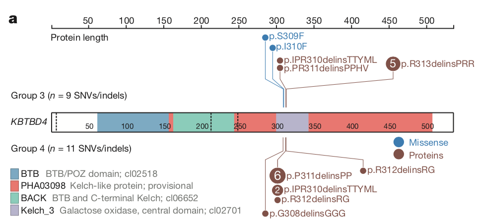

**Author(s)**: `r params$author`  
**Date**: `r Sys.Date()`  


# Academic Citation
If you use this code in your work or research, we kindly request that you cite our publication:

Xiaofan Lu, et al. (2025). FigureYa: A Standardized Visualization Framework for Enhancing Biomedical Data Interpretation and Research Efficiency. iMetaMed. https://doi.org/10.1002/imm3.70005

```{r setup, include=FALSE}
knitr::opts_chunk$set(echo = TRUE)
```

## 需求描述
## Requirement description

用R代码画出paper里的Lollipop，棒棒糖🍭。

Draw the Lollipop in the paper using R code, lollipop 🍭.



出自<https://www.nature.com/articles/nature22973>

from<https://www.nature.com/articles/nature22973>

## 应用场景
## Application scenario

某个基因的突变发生在哪个重要的结构域？推测该位点的突变影响了蛋白质功能。

场景一：展示TCGA某个癌症类型里某个基因的突变位点。

场景二：对比不同癌症/亚型的突变位点。

In which important structural domain does the mutation of a gene occur? It is speculated that the mutation of this site affects protein function.

Scenario 1: Show the mutation site of a gene in a cancer type in TCGA.

Scenario 2: Compare the mutation sites of different cancers/subtypes.

## 环境设置
## Environment setting

```{r}
source("install_dependencies.R")

library(TCGAbiolinks)
library(maftools)
library(trackViewer)
library(RColorBrewer)
```

## 下载TCGA数据
## Download TCGA data

如果你要画的基因突变信息已经保存在类似`easy_input.csv`的文件里，就可以跳过这步，直接进入“输入数据”。

下载突变信息作为输入数据。

If genetic mutation information you want to draw is already saved in a file like `easy_input.csv`, you can skip this step and go directly to `Input data`.

Download the mutation information as input data.

```{r,message=FALSE,warning=FALSE}
on.exit(unlink("GDCdata", recursive = TRUE, force = TRUE), add = TRUE)

mutquery <- GDCquery(project = "TCGA-LIHC",
                     data.category = "Simple Nucleotide Variation",
                     data.type = "Masked Somatic Mutation",
                     workflow.type = "Aliquot Ensemble Somatic Variant Merging and Masking")
GDCdownload(mutquery)
mut<-GDCprepare(mutquery)

#运行下面这行，会把所有基因的突变数据保存到文件里，你可以用这个文件做更多的事情。
#run the line below will save the mutation data for all the genes to a file, which you can use to do more.
#write.csv(mut,"TCGA_SNV.csv")

#画棒棒糖图只需要其中的一个基因，我们单独抽提出来，此处提取TP53。
#draw a lollipop plot requires only one of these genes, which we extract separately, here we extract TP53.
write.table(mut[mut$Hugo_Symbol == "TP53",],"easy_input.txt",row.names = F,quote = F,sep = "\t")
```

## 输入数据
## Input data

需要结构域和突变信息。

Structural domains and mutation information are required.

### 突变信息
### Mutation information

此处直接用TCGA的突变数据，有很多列，其中`RefSeq``HGVSp` `HGVSp_Short`三列是必须的。

因此，你也可以只准备这三列。

Here, the mutation data from TCGA is used directly, with many columns, of which three columns `RefSeq` `HGVSp` `HGVSp_Short` are mandatory.

Therefore, you can also prepare only these three columns.

```{r}
df<-read.table("easy_input.txt",as.is = T,sep = "\t",header = T)

#筛掉氨基酸未突变的行
#screen out rows with unmutated amino acids
newdf<-df[!is.na(df$HGVSp),]
```

### 结构域
### Structural domains

根据基因名（此处是TP53）和refseq ID从maftools提供的蛋白domain注释中提取某个基因的domain注释

Extract the domain annotation of a gene from the protein domain annotation provided by maftools according to the gene name (TP53 here) and refseq ID

```{r,message=FALSE}
gff = readRDS(file = system.file('extdata', 'protein_domains.RDs', package = 'maftools'))
refseqid <- strsplit(x = as.character(newdf$RefSeq), split = '.', fixed = TRUE)[[1]][1]
protein_inform <- gff[HGNC %in% "TP53"][refseq.ID == refseqid,]
```

### 从突变注释中提取氨基酸位置
### Extract amino acid positions from mutation annotations

先写个函数，用于从突变注释中提取氨基酸位置

First write a function for extracting amino acid positions from mutation annotations

```{r}
extractpos <- function(maf_aachange){
  prot.spl = strsplit(x = as.character(maf_aachange), split = '.', fixed = TRUE)
  prot.conv = sapply(sapply(prot.spl, function(x) x[length(x)]), '[', 1)
  pos = gsub(pattern = 'Ter.*', replacement = '',x = prot.conv)
  pos = gsub(pattern = '[[:alpha:]]', replacement = '', x = pos)
  pos = gsub(pattern = '\\*$', replacement = '', x = pos)
  pos = gsub(pattern = '^\\*', replacement = '', x = pos)
  pos = gsub(pattern = '\\*.*', replacement = '', x = pos)
  pos = as.numeric(sapply(X = strsplit(x = pos, split = '_', fixed = TRUE), FUN = function(x) x[1])) 
  aa = paste0(unlist(regmatches(maf_aachange, gregexpr("p[.].[0-9]+",maf_aachange))),"X")
  mutpos = data.frame(position = pos, mutation = maf_aachange, aa = aa, stringsAsFactors = F)
  return(mutpos[order(mutpos$pos),])
}
```

从突变注释中提取氨基酸位置

Extract amino acid positions from mutation annotations

```{r}
pos <- extractpos(newdf$HGVSp_Short)
head(pos)
```

统计不同氨基酸突变类型的突变频率

Count the mutation frequency of different amino acid mutation types

```{r}
nrpos <- pos[!duplicated(pos),]
rownames(nrpos) <- nrpos$mutation
nrpos$rate <- 1
nrpos[names(table(pos$mutation)),]$rate <-table(pos$mutation)
head(nrpos)
```

## 开始画图
## Start drawing

```{r,message=FALSE}
#首先将上面获得的蛋白domain注释信息写入一个GRanges对象
#first write the protein domain annotation information obtained above to a GRanges object
features <- GRanges("chr1", IRanges(start=protein_inform$Start,end=protein_inform$End,names=protein_inform$Description))
features$height <- 0.07 #domain box高 domain box high
features$fill<-brewer.pal(9,"Set1")[1:3] #domain box颜色 domain box color

#将突变点的信息写入一个GRanges对象
#Write information about the mutation point to a GRanges object
na_rows <- is.na(nrpos$position) | is.na(nrpos$mutation)
nrpos <- nrpos[!na_rows, ]
sample.gr <- GRanges("chr1", IRanges(nrpos$position, width=1, names=nrpos$mutation))
sample.gr$label.parameter.rot <- 90 #label角度 label angle
sample.gr$label <- as.character(nrpos$rate) #点中的标记 markers in the point
sample.gr$label.col <- "white" #点中标记的颜色 color of the markers in the point
sample.gr$color <-sample.gr$border <- brewer.pal(9,"Set1")[4] #点及连线颜色 point and line color
sample.gr$score<- log2(nrpos$rate) #点所在高度（纵坐标） height of the point (vertical coordinate) 

pdf("test1.pdf",width=24,height = 5)
lolliplot(sample.gr, features,xaxis = c(protein_inform$Start,protein_inform$End),yaxis = F, ylab = F,type="circle")
dev.off()
```


突变点太拥挤，解决办法是分上下两层，点可随机分。

注意这里也可按照临床信息分类（只能分2类），这样更有意义，下面把点随机分上下两层：

The mutation pointa are too crowded, the solution is to divide them into upper and lower layers, and the points can be randomly divided.

Note that it can also be classified according to clinical information (it can only be divided into 2 categories), which is more meaningful. The points are randomly divided into upper and lower layers below:

```{r}
torb <- sample(c("top", "bottom"), length(sample.gr), replace=TRUE)
sample.gr$SNPsideID <- torb
sample.gr$color[torb=="bottom"] <- sample.gr$border[torb=="bottom"] <- brewer.pal(9,"Set1")[7]

pdf("test2.pdf",width=21)
lolliplot(sample.gr, features,xaxis = c(protein_inform$Start,protein_inform$End),yaxis = F, ylab = F,type="circle")
dev.off()
```


点内的标记太多，去掉1

There are too many marks in the point, remove 1

```{r}
labs<-sample.gr$label
labs[labs=="1"]<-""
sample.gr$label <- labs
pdf("test3.pdf",width=21)
lolliplot(sample.gr, features,xaxis = c(protein_inform$Start,protein_inform$End),yaxis = F, ylab = F,type="circle")
dev.off()
```


根据突变频率设置点大小

Set point size according to mutation frequency

```{r}
sample.gr$cex <- log10(nrpos$rate) + 0.4
pdf("test4.pdf",width=21)
lolliplot(sample.gr, features,xaxis = c(protein_inform$Start,protein_inform$End),yaxis = F, ylab = F,type="circle")
dev.off()
```


进一步根据突变位置整合突变,如将p.Y126D 和 p.Y126D 合并成p.Y126X

Further integrate mutations according to the mutation position, such as merging p.Y126D and p.Y126D into p.Y126X

```{r}
newpos <- pos[!duplicated(pos$position),]
newpos$aachange <- newpos$mutation
newpos <- newpos[!is.na(newpos$position), ]
rownames(newpos) <-newpos$position
duppos <- names(table(pos$position)[table(pos$position)>1])
newpos[duppos,]$aachange <- newpos[duppos,]$aa

sample.gr <- GRanges("chr1", IRanges(newpos$position, width=1, names=newpos$aachange))
sample.gr$label.parameter.rot <- 45
sample.gr$label <- as.character(table(pos$position))
sample.gr$label.col <- "white"
sample.gr$color <-sample.gr$border <- brewer.pal(9,"Set1")[4]
sample.gr$score<- log2(table(pos$position))
labs<-sample.gr$label
labs[labs=="1"]<-""
sample.gr$label <- labs
torb <- sample(c("top", "bottom"), length(sample.gr), replace=TRUE)
sample.gr$SNPsideID <- torb
sample.gr$color[torb=="bottom"] <- sample.gr$border[torb=="bottom"] <- brewer.pal(9,"Set1")[7]

pdf("test5.pdf",width=21)
lolliplot(sample.gr, features,xaxis = c(protein_inform$Start,protein_inform$End),yaxis = F, ylab = F,type="circle")
dev.off()
```


# Session Info

```{r}
sessionInfo()
```
