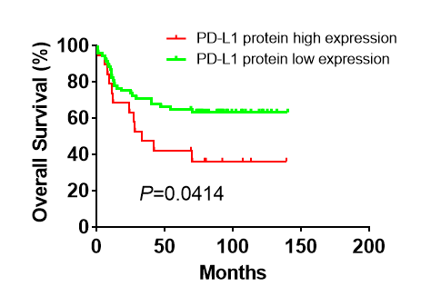

**Author(s)**: `r params$author`  
**Date**: `r Sys.Date()`  


# Academic Citation
If you use this code in your work or research, we kindly request that you cite our publication:

Xiaofan Lu, et al. (2025). FigureYa: A Standardized Visualization Framework for Enhancing Biomedical Data Interpretation and Research Efficiency. iMetaMed. https://doi.org/10.1002/imm3.70005

```{r setup, include=FALSE}
knitr::opts_chunk$set(echo = TRUE)
```

## 需求描述
## Requirement description

网上搜到过代码，但是都是用TCGA自己带的肺癌数据画的，我需要用自己的数据绘制。

两组或多组对比。

I've searched the internet for code, but it's all drawn with TCGA's own lung cancer data that it comes with, and I need to draw it with my own data.

Two or more groups are compared.



## 使用场景
## Usage scenario

需要至少两列信息：结局和结局的发生时间。如果还要做组间对比就再来一列分组信息。

用于展示分类样本的生存曲线，或其他有结局和结局发生时间的数据。

更多应用和背景知识可参考“小白学统计”的生存分析系列：

- 生存分析（一）生存分析方法，你听说过几种？<https://mp.weixin.qq.com/s/pAVzfPLfGmnaxQ93IQgmjw>

- 生存分析（二）中位生存时间和中位随访时间，<https://mp.weixin.qq.com/s/I_sHAz-RP5s7z1-75nIFSg>

- 生存分析（三）log-rank检验在什么情况下失效？<https://mp.weixin.qq.com/s/XpPpOpeNcIDXbd6es5VnvA>

- 生存分析（四）我们的生命，能否如指数分布般平稳？<https://mp.weixin.qq.com/s/NsMX3U_Bcmyn7u6NFGIaBw>

- 生存分析（五）实用的（却又被忽略的）Weibull回归，<https://mp.weixin.qq.com/s/RsVaqu3p9SXNICWaxaPbeQ>

- 生存分析（六）如何判断你的生存数据能否用cox回归——等比例风险假定判断，<https://mp.weixin.qq.com/s/7lCRmezb0yw1JewHBw0ZrQ>

At least two columns of information are needed: the ending and when the ending occurred. If you also want to do a comparison between groups have another column for grouping information.

Used to present survival curves for categorized samples, or other data with endpoints and time of occurrence of endpoints.

More applications and background knowledge can be found in the survival analysis series of “Xiaobai Learning Statistics”:

- Survival Analysis (I) Survival analysis methods, how many have you heard of?<https://mp.weixin.qq.com/s/pAVzfPLfGmnaxQ93IQgmjw>

- Survival Analysis (II) Median survival time and median follow-up time,<https://mp.weixin.qq.com/s/I_sHAz-RP5s7z1-75nIFSg>

- Survival Analysis (III) Under what circumstances does the log-rank test fail?<https://mp.weixin.qq.com/s/XpPpOpeNcIDXbd6es5VnvA>

- Survival Analysis (IV) Our lives, can they be as smooth as an exponential distribution?<https://mp.weixin.qq.com/s/NsMX3U_Bcmyn7u6NFGIaBw>

- Survival Analysis (V) The Practical (Yet Overlooked) Weibull Regression,<https://mp.weixin.qq.com/s/RsVaqu3p9SXNICWaxaPbeQ>

- Survival Analysis (VI) How to tell if your survival data can be judged with cox regression - equal proportional risk assumption,<https://mp.weixin.qq.com/s/7lCRmezb0yw1JewHBw0ZrQ>

**该如何分组呢？**

可以通过best separation来按表达量高低分组，可参考FigureYa4bestSeparation用中位值分组或找最佳分组；或者批量为多个基因找最佳分组，可参考FigureYa35batch_bestSeparation。

或者不用表达量分组，而是用已知的亚型（聚类得到，或者金标准亚型）分组，可参考FigureYa116supervisedCluster，进一步用它的金标准亚型寻找marker，再利用监督层次聚类在验证集上识别新亚型。

**How should it be grouped?**

You can use best separation to group by high or low expression, see FigureYa4bestSeparation to group by median value or find the best group; or batch to find the best group for multiple genes, see FigureYa35batch_bestSeparation.

Or instead of using expression grouping, use known subtypes (obtained by clustering, or gold standard subtypes) grouping, see FigureYa116supervisedCluster, and further use its gold standard subtypes to find markers, and then use supervised hierarchical clustering to identify new subtypes on the validation set.

## 环境设置
## Environment setting

```{r}
source("install_dependencies.R")
library("survival")
library("survminer")

Sys.setenv(LANGUAGE = "en") #显示英文报错信息 display English error messages
options(stringsAsFactors = FALSE) #禁止chr转成factor prohibit the conversion of chr to factor
```

## 输入数据的预处理
## Preprocessing of input data

如果你的数据已经整理成“easy_input_*.txt”的格式，就可以跳过这步，直接进入“两组对比”。

如果想获得TCGA的生存数据，可参考FigureYa128Prognostic。

需求方提供的输入数据生存期是Months列，样本分类和追踪情况揉在第2和3列中，1代表death，0代表alive，NA和1/0代表样本分类，因此，样本分类和追踪情况需要重新生成

If your data has been organized into “easy_input_*.txt” format, you can skip this step and go directly to the “two group comparison”.

For TCGA survival data, see FigureYa128Prognostic.

The input data survival provided by the demand-side is the Months column, and the sample classification and tracking are rubbed in columns 2 and 3, with 1 for death, 0 for alive, and NA and 1/0 for Sample Classification, so the sample classification and tracking will need to be regenerated

```{r cars}
svData<-read.delim(file="not_easy_input.txt",header=T,as.is=T)
head(svData)

svData$Expression <- NA
svData$Expression[!is.na(svData$PD.L1.protein.high.expression)] <- "high"
svData$Expression[is.na(svData$PD.L1.protein.high.expression)] <- "low"
svData$Status <- 1+(!is.na(svData$PD.L1.protein.high.expression|svData$PD.L1.protein.low.expression))
head(svData[,c(1,4,5)])
write.table(svData[,c(1,4,5)],file="easy_input_2.txt",sep = "\t",col.names = T,row.names = F,quote = F)
```

可以看到重新生成后，svData中生存期、样本分类和追踪情况分别是Months、Expression、Status列。

多说一句，追踪信息遵循的规则是，The status indicator, normally 0=alive, 1=dead. Other choices are TRUE/FALSE (TRUE = death) or 1/2 (2=death)

再模拟一个3组的输入文件，仅用来展示三组对比的画法：

You can see that after regeneration, the survival, sample classification, and tracking status in svData are the Months, Expression, and Status columns, respectively.

As an additional note, tracking information follows the rule that the status indicator, normally 0=alive, 1=dead. Other choices are TRUE/FALSE (TRUE = death) or 1/2 (2=death)

A further 3-group input file is simulated and used only to show the drawing of the three contrasting groups:

```{r}
svData$Expression[35:55] <- "med"
write.table(svData[,c(1,4,5)],file="easy_input_3.txt",sep = "\t",col.names = T,row.names = F,quote = F)
```

## 两组对比
## Comparison of two groups

### 输入文件
### Input file

画图用的数据结构是一个包含样本分类、生存期和追踪情况的数据框。

The data structure used for drawing the graph is a data frame containing the sample classification, survival and follow-up.

```{r}
svData <- read.table("easy_input_2.txt", header = T, as.is = T)
head(svData)
unique(svData$Expression)

svData$Expression <- factor(svData$Expression, levels = c("high","low"))
```

### 开始画图
### Start drawing

常见调整参数有颜色、线的类型、是否显示置信区间等

用?ggsurvplot查看更多参数设置

Common adjustment parameters are color, line type, whether to display confidence intervals, etc.

See more parameter settings with ?ggsurvplot

```{r}
# 这里用默认参数做回归
# 如果想先判断符合哪种分布再选择合适的方法回归，我们再实现吧。
# Here the regression is done with default parameters
# If you want to determine which distribution is met before choosing the appropriate method of regression, let's crowdsource it again.
fit <- survfit(Surv(Months, Status) ~ Expression, data = svData)

#先用默认参数画，用于校对后面画的图
#Drawing with default parameters first is used to proofread the diagrams drawn later on
ggsurvplot(fit)

#不画置信区间
#No confidence intervals are drawn
ggsurvplot(fit, pval = TRUE,linetype = c("solid", "dashed"), #线的类型 type of line
           palette = c("red","blue"),#线的颜色 color of line
           legend.title="",legend=c(0.7,0.9),#图例的位置 location of legend
           legend.labs=c("High-expression","Low-expression"),
           conf.int = F) #不显示置信区间 confidence intervals are not shown
ggsave(file="survivalcurve_2.pdf", width = 4, height = 4)

#画置信区间
#Draw confidence intervals
pdf("survivalcurve_2_table.pdf", width = 6, height = 5)
ggsurvplot(fit, pval = TRUE, linetype = "solid", #都画实线 draw solid lines
           palette = c("red","blue"),
           legend.title="",legend=c(0.7,0.9),
           legend.labs=c("High-expression","Low-expression"),
           
           # 画表格 
           # draw a table
           risk.table = TRUE,
           tables.height = 0.2,
           tables.theme = theme_cleantable(),

           conf.int = T,#显示置信区间 show confidence intervals
           conf.int.style="ribbon",#展示方式 display mode
           conf.int.alpha=0.1)#透明度 transparency
dev.off()
```


## 三组对比
## Three groups of comparisons

如果有更多组要对比，就按照规律在参数里添加即可。

If there are more groups to compare, just follow the pattern and add them in the parameters.

### 输入文件
### Input file

```{r}
svData <- read.table("easy_input_3.txt", header = T, as.is = T)
head(svData)
unique(svData$Expression)

svData$Expression <- factor(svData$Expression, levels = c("high","med","low"))
```

### 开始画图
### Start drawing

pvalue的计算方法可修改，可通过?surv_pvalue查看可选的method

The method of calculating pvalue can be modified, see the optional method via ?surv_pvalue

```{r}
fit <- survfit(Surv(Months, Status) ~ Expression, data = svData)

#先用默认参数画，用于校对后面画的图
#Drawing with default parameters first is used to proofread the diagrams drawn later on
ggsurvplot(fit)

#不画置信区间
#No confidence intervals are drawn
ggsurvplot(fit, pval = TRUE,linetype = c("solid", "solid", "solid"), #线的类型 type of line
           palette = c("red","navy","darkgreen"),#线的颜色 color of line
           legend.title="",legend=c(0.7,0.9), #图例的位置 location of legend
           legend.labs=c("High-expression", "med-expression", "low-expression"),
           conf.int = F) #不显示置信区间 confidence intervals are not shown
ggsave(file="survivalcurve_3.pdf", width = 4, height = 4)

#画置信区间
#Draw confidence intervals
pdf("survivalcurve_3_table.pdf", width = 7, height = 6)
ggsurvplot(fit, pval = TRUE, linetype = "solid", #都画成实线 draw solid lines
           palette = c("red","navy","darkgreen"),
           legend.title="",legend=c(0.8,0.9),
           legend.labs=c("High-expression","med-expression", "low-expression"),
           
           # 画表格
           # draw a table
           risk.table = TRUE,
           tables.height = 0.3,
           tables.theme = theme_cleantable(),

           conf.int = T,#显示置信区间 show confidence intervals
           conf.int.style="ribbon",#展示方式 display mode
           conf.int.alpha=0.1)#透明度 transparency
dev.off()
```


输出的pdf文件是矢量图，可以在Illustrator等软件里进行字体、字号等编辑操作

The output pdf file is a vector image, can be in Illustrator and other software for fonts, font size and other editing operations

# Session Info

```{r}
sessionInfo()
```