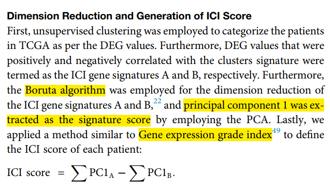

**Author(s)**: `r params$author`  
**Date**: `r Sys.Date()`  

# Academic Citation
If you use this code in your work or research, we kindly request that you cite our publication:

Xiaofan Lu, et al. (2025). FigureYa: A Standardized Visualization Framework for Enhancing Biomedical Data Interpretation and Research Efficiency. iMetaMed. https://doi.org/10.1002/imm3.70005

```{r setup, include=FALSE}
knitr::opts_chunk$set(echo = TRUE)
```

# 需求描述

想实现下这个文章的建模方法，不同于常规的lasso, cox回归系数与基因表达量的乘积，这篇文章采用Boruta降维，联合主成分分析第一主成分构建 signature score，特别适合做分子分型分析。

# Requirement Description

I want to try the modeling method of this article, which is different from the conventional lasso, the product of the cox regression coefficient and the gene expression, this article uses Boruta to reduce the dimension and combine the principal component analysis with the first principal component to construct a signature score, which is especially suitable for molecular typing analysis.



出自<https://www.cell.com/molecular-therapy-family/nucleic-acids/fulltext/S2162-2531(20)30259-6>
from<https://www.cell.com/molecular-therapy-family/nucleic-acids/fulltext/S2162-2531(20)30259-6>

# 应用场景

根据Figure201ClusterCorrelation得到的亚型以及ICI signature结果，进一步利用Boruta算法对AB签名降维，并利用PCA计算单样本ICI得分。

# Application Scenarios

According to the isoforms obtained by Figure201ClusterCorrelation and the ICI signature results, the Boruta algorithm was used to reduce the dimensionality of AB signatures, and the single-sample ICI score was calculated by PCA.

# 环境设置

# Environment settings

```{r}
source("install_dependencies.R")

library(Boruta)
library(ggplot2)
library(ggpubr)
library(pheatmap)
Sys.setenv(LANGUAGE = "en") #显示英文报错信息 # Display English error messages
options(stringsAsFactors = FALSE) #禁止chr转成factor # Prohibit converting chr to factor
```

# 输入文件

easy_input_expr.txt，表达矩阵，这里与原文保持一致，用了TPM，也可以用FPKM。FigureYa201ClusterCorrelation的输入文件是FPKM，同样也可以用TPM。

easy_input_cluster.txt，把Figure201ClusterCorrelation获得的亚型信息（ConsensusCluster文件夹里，ConsensusCluster.k=X.consensusClass.csv对应每种分类数量下sample所在的cluster）写在cluster列。其余为样本信息，跟FigureYa201ClusterCorrelation的`easy_input_sinfo.txt`文件一致。

ouput_ICIsignatureGene.txt，Figure201ClusterCorrelation的ICI signature gene结果。

# Input Files
easy_input_expr.txt, the expression matrix, which is consistent with the original text, uses TPM, and FPKM can also be used. The input file of FigureYa201ClusterCorrelation is FPKM, and TPM can also be used.

easy_input_cluster.txt, write the subtype information obtained by Figure201ClusterCorrelation (in the ConsensusCluster folder, ConsensusCluster.k=X.consensusClass.csv the cluster corresponding to the number of samples under each category) in the cluster column. The rest is sample information, which is the same as the 'easy_input_sinfo.txt' file of FigureYa201ClusterCorrelation.

ouput_ICIsignatureGene.txt, ICI signature gene results of Figure201ClusterCorrelation.

```{r}
# 加载表达谱 # Load the expression spectrum
expr <- read.table("easy_input_expr.txt",sep = "\t",row.names = 1,check.names = F,stringsAsFactors = F,header = T)
tumsam <- colnames(expr)[substr(colnames(expr),11,12) == "01"]
expr <- expr[,tumsam]
indata <- t(scale(t(log2(expr + 1)))) # z-score表达谱 # z-score expression spectrum

# 加载亚型结果 # Load subtype results
annCol <- read.table("easy_input_cluster.txt",sep = "\t",row.names = 1,check.names = F,stringsAsFactors = F,header = T)
table(annCol$`Gene cluster`)

# 加载Figure201ClusterCorrelation的ICI signature gene结果 
# Load the ICI signature gene result of Figure201ClusterCorrelation
outTab <- read.table("ouput_ICIsignatureGene.txt",sep = "\t",row.names = NULL,header = T,stringsAsFactors = F,check.names = F)
table(outTab$direct) # AB两种签名按相关性正负来分类，正相关标为A，否则标为B # The two types of signatures are classified according to the positive and negative correlations, and the positive correlation is marked as A, otherwise it is marked as B
```

# 用Boruta对ICI signature降维 

这一步原则上是应该把AB两种签名一起来构建预后签名的。但这套数据情况特殊，因此遇到了问题（负相关结果被淹没），因此我们拆开A、B签名，分开降维。

## 原则上：一起构建预后签名

# Use Boruta to reduce the dimensionality of the ICI signature

In principle, this step should combine the two signatures of AB to construct the prognostic signature. However, this set of data is a special case, so we have encountered a problem (the negative correlation results are drowned out), so we take apart the A and B signatures and reduce the dimensionality separately.

## In principle: build prognostic signatures together

```{r}
set.seed(20201024)
dat.boruta <- as.data.frame(t(indata[outTab$gene,rownames(annCol)]))
borutafit <- Boruta(x = as.matrix(dat.boruta), 
                    y = as.factor(annCol$`Gene cluster`), # multiclassification
                    doTrace = 2,
                    maxRuns = 100,
                    ntree = 500)
boruta_fea <- attStats(borutafit)
boruta_fea <- rownames(boruta_fea[which(boruta_fea$decision == "Confirmed"),])
boruta.all <- outTab[which(outTab$gene %in% boruta_fea),]
table(boruta.all$direct)

# 拆分降维后的AB签名
# Split the AB signature after dimensionality reduction

#boruta.A <- boruta.all[boruta.all$direct == "A",]
#boruta.B <- boruta.all[boruta.all$direct == "B",]
```

这里结果全部为A签名，分析原因：

从Figure201ClusterCorrelation的相关性分析可知，正相关占主导地位，所以在上一步的回归分析里，可想而知负相关结果会被淹没。

怎么办呢？

原文没有提及具体做法。这里我拆开A、B签名，分开降维，以保证负相关基因个数不会太少。

Here, all results correspond to Signature A. Analysis of the reasons:

From the correlation analysis in FigureYa201ClusterCorrelation, it is evident that positive correlations dominate. Consequently, in the preceding regression analysis, negative correlation results were likely overshadowed.

How to address this?

The original paper does not specify a detailed approach. To ensure an adequate representation of negatively correlated genes, I separated Signatures A and B and performed dimensionality reduction independently. This prevents the negative correlation gene set from being too sparse.

## 灵活处理：拆开A、B签名，分开降维
## Flexible processing: Disassemble A and B signatures and reduce dimensionality separately
```{r}
# 提取A签名
# Extract A signature
set.seed(20201024)
dat.boruta <- as.data.frame(t(indata[outTab[which(outTab$direct == "A"),"gene"],rownames(annCol)]))
borutafit <- Boruta(x = as.matrix(dat.boruta), 
                    y = as.factor(annCol$`Gene cluster`), # multiclassification
                    doTrace = 2,
                    maxRuns = 100,
                    ntree = 500)
boruta_fea <- attStats(borutafit)
boruta_fea <- rownames(boruta_fea[which(boruta_fea$decision == "Confirmed"),])
boruta.A <- outTab[which(outTab$gene %in% boruta_fea),]
# 降维前后基因数量
# Number of genes before and after dimension reduction
ncol(dat.boruta)
nrow(boruta.A)

# 提取B签名
# Extract signature B
set.seed(20201024)
dat.boruta <- as.data.frame(t(indata[outTab[which(outTab$direct == "B"),"gene"],rownames(annCol)]))
borutafit <- Boruta(x = as.matrix(dat.boruta), 
                    y = as.factor(annCol$`Gene cluster`), # multiclassification
                    doTrace = 2,
                    maxRuns = 100,
                    ntree = 500)
boruta_fea <- attStats(borutafit)
boruta_fea <- rownames(boruta_fea[which(boruta_fea$decision == "Confirmed"),])
boruta.B <- outTab[which(outTab$gene %in% boruta_fea),]
# 降维前后基因数量
# Number of genes before and after dimension reduction
ncol(dat.boruta)
nrow(boruta.B)
```

# 用降维后的签名画热图
# Draw a heatmap with the dimensionally reduced signature
```{r}
annRow <- data.frame("ICI signature gene" = rep(c("A","B"), c(nrow(boruta.A), nrow(boruta.B))),
                     row.names = c(boruta.A$gene,boruta.B$gene),
                     check.names = F,
                     stringsAsFactors = F)
annColors <- list("Gene cluster" = c("A" = "#008ECB", "B" = "#EA921D", "C" = "#D14039"),
                  "Gender" = c("Male" = "#79B789", "Female" = "#B5262A"),
                  "Status" = c("Alive" = "#79B789", "Dead" = "#B5262A"),
                  "Grade" = c("G1" = "#CBBEC1", "G2" = "#53B1E7", "G3" = "#C78157", "G4" = "#A54D48"),
                  "Age" = colorRampPalette(c("#F7D202", "#96862A"))(64),
                  "ICI signature gene" = c("A" = "#D14039", "B" = "#008ECB"))
plotdata <- indata[rownames(annRow), rownames(annCol)]
plotdata[plotdata > 3] <- 3 # 截断极端值 # Truncate extreme values
plotdata[plotdata < -3] <- -3 # 截断极端值 # Truncate extreme values
pheatmap(plotdata,
         cluster_rows = F,
         cluster_cols = F,
         show_rownames = F,
         show_colnames = F,
         annotation_row = annRow,
         annotation_col = annCol,
         annotation_colors = annColors,
         color = colorRampPalette(c("#343493", "white", "#C24A45"))(64))
dev.copy2pdf(file = "heatmap_dimension_reduced.pdf", width = 10, height = 8) # 保存图像 # Save the image
```

把这里的`heatmap_dimension_reduced.pdf`跟FigureYa201ClusterCorrelation的`ClusterCorrelation.pdf`对比一下，看看降维前后的效果。

Compare the 'heatmap_dimension_reduced.pdf' here with the 'ClusterCorrelation.pdf' of FigureYa201ClusterCorrelation to see the effect before and after dimensionality reduction.

# 联合主成分分析第一主成分计算ICI得分
# Combined principal component analysis (PCA) first principal component to calculate the ICI score
```{r}
# 在“输入文件”那里，已经做过z-score处理，因此这里不再进行标准化
# In the "Input File" section, the z-score has already been processed, so it is no longer normalized here
expr.A <- indata[boruta.A$gene,rownames(annCol)]
pca.A <- prcomp(t(expr.A), scale = F, center = F) # 如果数据没有标准化，这里都要设置为TRUE # If the data is not normalized, it must be set to TRUE
pca1.A <- pca.A$x[,1] # 取出第一主成分 # Remove the first principal component

expr.B <- indata[boruta.B$gene,rownames(annCol)]
pca.B <- prcomp(t(expr.B), scale = F, center = F) #如果数据没有标准化，这里都要设置为TRUE # If the data is not normalized, it should be set to TRUE
pca1.B <- pca.B$x[,1] # 取出第一主成分 # Remove the first principal component

ICI.score <- pca1.A - pca1.B # 主成份相减得到ICI得分 # Subtract the principal components to get the ICI score
ICI.outtab <- data.frame(samID = rownames(annCol),
                         pca1.A = pca1.A[rownames(annCol)],
                         pca1.B = pca1.B[rownames(annCol)],
                         ICI.score = ICI.score[rownames(annCol)],
                         subtype = annCol$`Gene cluster`,
                         stringsAsFactors = F)
# 输出到文件
# Output to file
write.table(ICI.outtab,"output_ICI_score.txt",sep = "\t",row.names = F,col.names = T,quote = F)
```

# 画图对比ABC三类的ICI score

参考FigureYa162boxViolin的画法

# Draw and compare the ICI scores of the three types of ABC

Refer to FigureYa162boxViolin's drawing method

```{r}
ggplot(data = ICI.outtab,aes(x = subtype, y = ICI.score, fill = subtype))+
  scale_fill_manual(values = c("#008ECB", "#EA921D", "#D14039")) + 
  geom_violin(alpha=0.4, position = position_dodge(width = .75),
              size=0.8, color="black") + # 边框线黑色 # The border line is black
  geom_boxplot(notch = TRUE, outlier.size = -1, 
               color="black", lwd=0.8, alpha = 0.7)+ # 背景色透明化 # The background color is transparent
  geom_point(shape = 21, size=2, 
             position = position_jitterdodge(), 
             color="black", alpha=1)+ # 边框线黑色 # The border line is black
  theme_classic() +
  ylab(expression("ICI score")) +
  xlab("Subtype")  +
  theme(axis.ticks = element_line(size=0.2,color="black"),
    axis.ticks.length = unit(0.2,"cm"),
    legend.position = "none",
    axis.title = element_text(size = 12),
    axis.text = element_text(size = 10)) +
  stat_compare_means(method = "kruskal.test", label.y = max(ICI.score))
ggsave(filename = "ICI_score.pdf", width = 5, height = 5)
```

# Session Info

```{r}
sessionInfo()
```