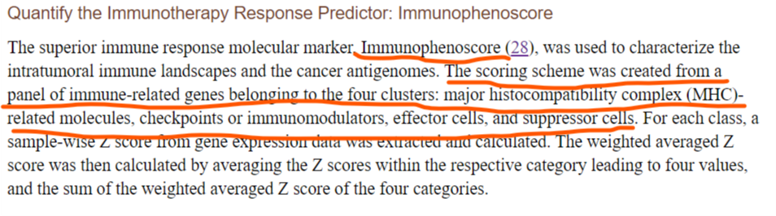
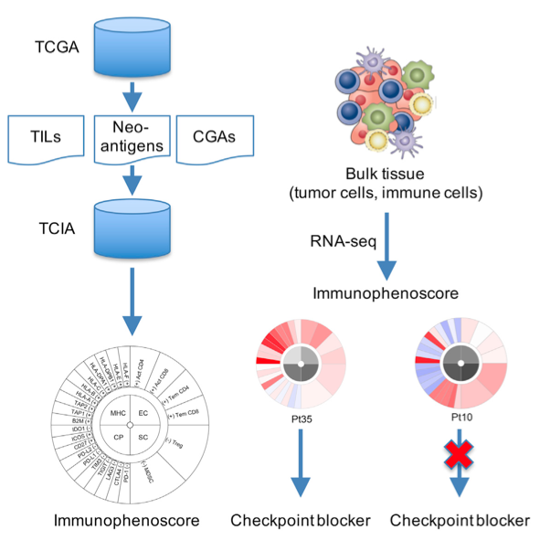

**Author(s)**: `r params$author`  
**Reviewer(s)**: `r params$reviewer`  
**Date**: `r Sys.Date()`  

# Academic Citation
If you use this code in your work or research, we kindly request that you cite our publication:

Xiaofan Lu, et al. (2025). FigureYa: A Standardized Visualization Framework for Enhancing Biomedical Data Interpretation and Research Efficiency. iMetaMed. https://doi.org/10.1002/imm3.70005

To cite 'Immunophenoscore' in publications use:

Charoentong P, Finotello F, Angelova M, Mayer C, Efremova M, Rieder D, et al. Pan-cancer immunogenomic analyses reveal genotype-immunophenotype relationships and predictors of response to checkpoint blockade. Cell Rep. (2017) 18:248–62. doi: 10.1016/j.celrep.2016.12.019

```{r setup, include=FALSE}
knitr::opts_chunk$set(echo = TRUE)
```

# 需求描述
# Requirement Description

想实现下这个 Immunophenoscore的算法，免疫相关的指标有TMB，TILs和免疫细胞浸润等，这个相当于是综合评分，可以丰富下免疫分析的内容。IPS每个基因z score后的值，输出到文件。

If you want to try this Immunophenoscore algorithm, immune-related indicators include TMB, TILs and immune cell infiltration, etc., which is equivalent to a comprehensive score, which can enrich the content of immune analysis. The value of the z-score of each gene of IPS is output to a file.



出自<https://www.frontiersin.org/articles/10.3389/fimmu.2020.01678/full>
From<https://www.frontiersin.org/articles/10.3389/fimmu.2020.01678/full>

# 应用场景
# Application Scenario



计算Immunophenoscore（IPS），并绘制immunophenogram。

- 免疫表型评分（immunophenoscore，缩写为IPS），算法来自例文的参考文献28，也就是这篇Cell Rep文章：Charoentong P, Finotello F, Angelova M, Mayer C, Efremova M, Rieder D, Hackl H, Trajanoski Z. Pan-cancer Immunogenomic Analyses Reveal Genotype-Immunophenotype Relationships and Predictors of Response to Checkpoint Blockade. Cell Rep. 2017 Jan 3;18(1):248-262. doi: 10.1016/j.celrep.2016.12.019. PMID: 28052254.
- 免疫表型图（immunophenogram），这种图可单独使用或多组排成矩阵使用，也可以结合散点图展示想要说明的特征。具体用法可参考上述[Cell Reports文章] (https://www.cell.com/cell-reports/comments/S2211-1247(16)31709-0)的Figure 5和6，大量用到这种immunophenogram。
- 输出IPS每个基因z score后的值到文件，便于DIY画出自己喜欢的图。例如多组对比进行统计分析，画box/bar/violin，或者所有sample一起画热图。

> **代码及IPS基因权重文件**公开于github，<https://github.com/icbi-lab/Immunophenogram>。这里稍微改写，并翻译，使用时请**引用上述文章**。

Calculate the Immunohenoscore (IPS) and plot the immunophenogram.

- Immunophenoscore (IPS): The algorithm is derived from Reference 28 in the example paper, which is this Cell Reports article:
Charoentong P, Finotello F, Angelova M, Mayer C, Efremova M, Rieder D, Hackl H, Trajanoski Z. Pan-cancer Immunogenomic Analyses Reveal Genotype-Immunophenotype Relationships and Predictors of Response to Checkpoint Blockade. Cell Rep. 2017 Jan 3;18(1):248-262. doi: 10.1016/j.celrep.2016.12.019. PMID: 28052254.
- Immunophenogram: This type of plot can be used individually, arranged in a matrix for multiple groups, or combined with scatter plots to highlight specific features. For specific usage, refer to Figures 5 and 6 in the above Cell Reports article, where immunophenograms are extensively employed.
- Output the z-score-normalized values of each IPS gene to a file, enabling users to create customized visualizations. For example:box/bar/violin,or Generate a heatmap for all samples .

> **Code and IPS gene weight files** are publicly available on GitHub: <https://github.com/icbi-lab/Immunophenogram>
The code has been slightly modified and translated here. **Please cite the original paper** when using this method.

# 环境设置
# Environment settings

```{r}
source("install_dependencies.R")

library(ggplot2)       # 数据可视化包，用于绘制图形 # Data visualization package for creating plots
library(grid)          # 网格图形系统，用于布局和图形排列 # Grid graphics system for layout and graphical arrangement
library(gridExtra)     # 提供额外的网格布局功能，用于组合多个图形 # Provides additional grid layout functionality for combining multiple plots

Sys.setenv(LANGUAGE = "en") #显示英文报错信息 # error messages are displayed in English
options(stringsAsFactors = FALSE) #禁止chr转成factor # It is forbidden to convert chr into factor
```

自定义函数，用于计算 Immunophenoscore(IPS)
Custom functions to calculate Immunophenoscore(IPS) 
```{r}
ipsmap <- function (x) {
  if (x<=0) {
    ips<-0
  } else {
    if (x>=3) {
      ips<-10
    } else {
      ips<-round(x*10/3, digits=0)
    }
  }
  return(ips)
}
```

分配颜色
Assign colors
```{r}
my_palette <- colorRampPalette(c("blue", "white", "red"))(n = 1000)
mapcolors<-function (x) {
  za<-NULL
  if (x>=3) {
    za=1000
  } else {
    if (x<=-3) {
      za=1
    } else {
      za=round(166.5*x+500.5,digits=0)
    }
  }
  return(my_palette[za])
}
my_palette2 <- colorRampPalette(c("black", "white"))(n = 1000)
mapbw<-function (x) {
  za2<-NULL
  if (x>=2) {
    za2=1000
  } else {
    if (x<=-2) {
      za2=1
    } else {
      za2=round(249.75*x+500.5,digits=0)
    }
  }
  return(my_palette2[za2])
}
```

# 输入文件
# Input files

easy_input_expr.csv，表达矩阵。例如log2(TPM+1)，每行一个基因，每列一个样本。

easy_input_IPS_genes.txt，IPS基因权重文件。IPS相关基因、分类及其权重。

easy_input_expr.csv, the expression matrix. For example, log2 (TPM 1), one gene per row, one sample per column.

easy_input_IPS_genes.txt, IPS gene weight file. IPS-related genes, taxonomy and their weights.

```{r}
## 读取表达谱文件
## Read the expression profile file
expr <- read.table("easy_input_expr.txt",row.names=1,header=TRUE, sep="\t",check.names=FALSE,stringsAsFactors = FALSE)
expr[1:3,1:3]

## 取出肿瘤样本
## pick up a sample of the tumor
tumsam <- colnames(expr)[substr(colnames(expr),14,15) == "01"] # 取出肿瘤样本 # pick up a sample of the tumor
gene_expression <- log2(expr[,tumsam] + 1) # 对TPM值做对数转化 # Logarithmic conversion of TPM values
sample_names <- tumsam

## 修改几个基因名
## IPS基因权重文件中的基因名跟常用的gene symbol不同，我们把表达矩阵里的gene symbol修改成跟IPS基因列表一致的基因名。

## Modify several gene names
## The gene name in the IPS gene weight file is different from the commonly used gene symbol, we change the gene symbol in the expression matrix to the gene name that is consistent with the IPS gene list.

if(is.element("CAVIN2",rownames(gene_expression))) {
  rownames(gene_expression) <- gsub("CAVIN2","SDPR",rownames(gene_expression)) # 根据https://www.genecards.org上的相关信息进行同名转换
  # Convert the same name according to the relevant information on the https://www.genecards.org
}
# 另外注意示例数据的里的CCL3L3的注释源自GENCODE27，GeneCards显示CCL3L1的ENSEMBL为ENSG00000276085，该编码在GENCODE27里注释为CCL3L3，因此修改

# Also note that the annotation of CCL3L3 in the example data is derived from GENCODE27, GeneCards shows that the ENSEMBL of CCL3L1 is ENSG00000276085, and the encoding is annotated as CCL3L3 in the GENCODE27, so it is modified

if(is.element("CCL3L3",rownames(gene_expression))) {
  rownames(gene_expression) <- gsub("CCL3L3","CCL3L1",rownames(gene_expression))
}

## 读取IPS相关基因以及其权重
## Read IPS-related genes and their weights
IPSG <- read.table("easy_input_IPS_genes.txt",header=TRUE, sep="\t",check.names=FALSE,stringsAsFactors = FALSE,row.names = NULL)
head(IPSG)
unique_ips_genes <- as.vector(unique(IPSG$NAME))

## 初始化数据
## Initialize the data
IPS <- MHC <- CP <- EC <- SC <- AZ <- NULL

# 获取表达谱里的基因名
# Get the gene name in the expression spectrum
GVEC <- row.names(gene_expression)

# 获取IPS基因文件里的基因名
# Obtain the gene name in the IPS gene file
VEC <- as.vector(IPSG$GENE)

# 匹配基因并找到缺失基因
# Match genes and find the missing genes
ind <- which(is.na(match(VEC,GVEC)))
MISSING_GENES <- VEC[ind]

dat <- IPSG[ind,]
if (length(MISSING_GENES) > 0) { # 若存在缺失基因报出（如果上面两个基因不修改，这里是要报缺失的，会导致最终结果错误）
  # If there is a deletion gene reported (if the above two genes are not modified, the deletion will be reported here, which will lead to an error in the final result.)
  message(paste0("--differently named or missing genes: ",paste(MISSING_GENES,collapse = ", ")))
  print(IPSG[ind,])
  message("please check data and make sure all genes matches!")
} else {
  message("--all genes matched!") # 请确保所有基因都匹配!!! # Please make sure all genes match!!
}
```

# 计算并画图
# Calculate and draw

```{r}
## 循环每个样本
## Cycle through each sample
outTab <- NULL
for (i in 1:length(sample_names)) {	
  GE <- gene_expression[[i]]
  mGE <- mean(GE)
  sGE <- sd(GE)
  Z1 <- (gene_expression[as.vector(IPSG$GENE),i]-mGE)/sGE
  W1 <- IPSG$WEIGHT
  WEIGHT <- MIG <- NULL
  k <- 1
  for (gen in unique_ips_genes) {
    MIG[k] <- mean(Z1[which (as.vector(IPSG$NAME)==gen)],na.rm=TRUE)
    WEIGHT[k] <- mean(W1[which (as.vector(IPSG$NAME)==gen)])
    k <- k + 1
  }
  WG <- MIG * WEIGHT
  MHC[i] <- mean(WG[1:10])
  CP[i] <- mean(WG[11:20])
  EC[i] <- mean(WG[21:24])
  SC[i] <- mean(WG[25:26])
  AZ[i] <- sum(MHC[i],CP[i],EC[i],SC[i])
  IPS[i] <- ipsmap(AZ[i])
  
  tmp <- as.data.frame(t(data.frame(WG))); colnames(tmp) <- unique_ips_genes; rownames(tmp) <- sample_names[i]
  outTab <- rbind.data.frame(outTab,tmp)
  
  # 绘制Immunophenogram
  # Draw the Immunophenogram
  data_a <- data.frame (start = c(0,2.5,5,7.5,10,15,seq(20,39),0,10,20,30), end = c(2.5,5,7.5,10,15,seq(20,40),10,20,30,40), y1=c(rep(2.6,26),rep(0.4,4)),y2=c(rep(5.6,26),rep(2.2,4)),z=c(MIG[c(21:26,11:20,1:10)],EC[i],SC[i],CP[i],MHC[i]),vcol=c(unlist(lapply(MIG[c(21:26,11:20,1:10)],mapcolors)), unlist(lapply(c(EC[i],SC[i],CP[i],MHC[i]),mapbw))), label = c(unique_ips_genes[c(21:26,11:20,1:10)],"EC","SC","CP","MHC"))
  data_a$label <- factor(data_a$label, levels=unique(data_a$label))
  plot_a1 <- ggplot() + 
    geom_rect(data=data_a, mapping=aes(xmin=start, xmax=end, ymin=y1, ymax=y2, fill=label), size=0.5,color="black", alpha=1) +
    coord_polar()  + 
    scale_y_continuous(limits = c(0, 6)) +
    scale_fill_manual(values =as.vector(data_a$vcol),guide=FALSE) +
    theme_bw() + 
    theme(panel.spacing = unit(0, 'mm'), 
          panel.grid.major = element_blank(),
          panel.grid.minor = element_blank(),
          panel.border = element_blank(),
          panel.background = element_blank(),
          axis.line = element_line(colour = "white"),
          axis.text=element_blank(), 
          axis.ticks= element_blank()) + 
    geom_text(aes(x=5, y=1.3, label="EC"), size=4) +
    geom_text(aes(x=15, y=1.3, label="SC"), size=4) + 
    geom_text(aes(x=25, y=1.3, label="CP"), size=4) + 
    geom_text(aes(x=35, y=1.3, label="MHC"), size=4)
  plot_a2 <- plot_a1 +
    geom_text(aes(x=1.25, y=4.1, label="+ Act CD4"), angle=78.75, size=4) +
    geom_text(aes(x=3.75, y=4.1, label="+ Act CD8"),angle=56.25, size=4) +
    geom_text(aes(x=6.25, y=4.1, label="+ Tem CD4"), angle=33.75,size=4) +
    geom_text(aes(x=8.75, y=4.1, label="+ Tem CD8"), angle=11.25,size=4) +
    geom_text(aes(x=17.5, y=4.1, label="- MDSC"), angle=-67.5,size=4) +
    geom_text(aes(x=12.5, y=4.1, label="- Treg"), angle=-22.5,size=4)
  plot_a3 <- plot_a2 +
    geom_text(aes(x=20.5, y=4.1, label="PD-1 -"), angle=85.5, size=4) +
    geom_text(aes(x=21.5, y=4.1, label="CTLA4 -"), angle=76.5, size=4) +
    geom_text(aes(x=22.5, y=4.1, label="LAG3 -"), angle=67.5, size=4) +
    geom_text(aes(x=23.5, y=4.1, label="TIGIT -"), angle=58.5, size=4) +
    geom_text(aes(x=24.5, y=4.1, label="TIM3 -"), angle=49.5, size=4) +
    geom_text(aes(x=25.5, y=4.1, label="PD-L1 -"), angle=40.5, size=4) +
    geom_text(aes(x=26.5, y=4.1, label="PD-L2 -"), angle=31.5, size=4) +
    geom_text(aes(x=27.5, y=4.1, label="CD27 +"), angle=22.5, size=4) +
    geom_text(aes(x=28.5, y=4.1, label="ICOS +"), angle=13.5, size=4) +
    geom_text(aes(x=29.5, y=4.1, label="IDO1 -"), angle=4.5, size=4)
  plot_a4 <- plot_a3 +
    geom_text(aes(x=30.5, y=4.1, label="B2M +"), angle=-4.5, size=4) +
    geom_text(aes(x=31.5, y=4.1, label="TAP1 +"), angle=-13.5, size=4) +
    geom_text(aes(x=32.5, y=4.1, label="TAP2 +"), angle=-22.5, size=4) +
    geom_text(aes(x=33.5, y=4.1, label="HLA-A +"), angle=-31.5, size=4) +
    geom_text(aes(x=34.5, y=4.1, label="HLA-B +"), angle=-40.5, size=4) +
    geom_text(aes(x=35.5, y=4.1, label="HLA-C +"), angle=-49.5, size=4) +
    geom_text(aes(x=36.5, y=4.1, label="HLA-DPA1 +"), angle=-58.5, size=4) +
    geom_text(aes(x=37.5, y=4.1, label="HLA-DPB1 +"), angle=-67.5, size=4) +
    geom_text(aes(x=38.5, y=4.1, label="HLA-E +"), angle=-76.5, size=4) +
    geom_text(aes(x=39.5, y=4.1, label="HLA-F +"), angle=-85.5, size=4)
  plot_a5 <- plot_a4 +
    geom_text(aes(x=0, y=6, label=paste("Immunophenoscore: ",IPS[i],sep="")), angle=0,size=6,vjust=-0.5) + 
    theme(axis.title=element_blank())
  plot_a <- plot_a5 + theme(plot.margin=unit(c(0,0,0,0),"mm")) +
    geom_text(vjust=1.15,hjust=0,aes(x=25.5, y=6,label="\n\n\n\n   MHC: Antigen Processing                                 EC: Effector Cells\n   CP: Checkpoints | Immunomodulators              SC: Suppressor Cells\n\n", hjust = 0), size=4)
  
  ## 绘制图例 sample-wise (averaged) z-scores
  ## Plot the legend sample-wise (averaged) z-scores
  data_b <- data.frame (start = rep(0,23), 
                        end = rep(0.7,23), 
                        y1=seq(0,22,by=1), 
                        y2=seq(1,23,by=1),
                        z=seq(-3,3,by=6/22),
                        vcol=c(unlist(lapply(seq(-3,3,by=6/22),mapcolors))), 
                        label = LETTERS[1:23])
  data_b_ticks <- data.frame(x = rep(1.2, 7), 
                             value = seq(-3,3, by=1), 
                             y = seq(0,6, by=1)*(22/6) +0.5)
  legendtheme <- theme(plot.margin = unit(c(2,0,2,0),"inch"), 
                       panel.spacing = unit(0,"null"), 
                       panel.grid.major = element_blank(),
                       panel.grid.minor = element_blank(),
                       panel.border = element_blank(),
                       panel.background = element_blank(), 
                       axis.line = element_line(colour = "white"), 
                       axis.text=element_blank(), 
                       axis.ticks= element_blank(), 
                       axis.title.x=element_blank())
  plot_b <- ggplot(hjust=0) + 
    geom_rect(data=data_b, 
              mapping=aes(xmin=start, xmax=end, ymin=y1, ymax=y2, fill=label), size=0.5,color="black", alpha=1) +
    scale_x_continuous(limits = c(0, 1.5),expand = c(0,0)) +
    scale_fill_manual(values =as.vector(data_b$vcol),guide=FALSE) +
    geom_text(data=data_b_ticks, aes(x=x, y=y, label=value),hjust="inward", size=4) +
    theme_bw() +
    legendtheme + 
    ylab("Sample-wise (averaged) z-score")
  
  ## 绘制图例 weighted z-scores
  ## Draw the legend weighted z-scores
  data_c <- data.frame(start = rep(0,23),
                       end = rep(0.7,23),
                       y1=seq(0,22,by=1),
                       y2=seq(1,23,by=1),
                       z=seq(-2,2,by=4/22),
                       vcol=c(unlist(lapply(seq(-2,2,by=4/22),mapbw))), 
                       label = LETTERS[1:23])
  data_c_ticks <- data.frame(x = rep(1.2, 5), 
                             value = seq(-2,2, by=1),
                             y = seq(0,4, by=1)*(22/4) +0.5)
  plot_c <- ggplot() + 
    geom_rect(data=data_c, 
              mapping=aes(xmin=start, xmax=end, ymin=y1, ymax=y2, fill=label),size=0.5,color="black", alpha=1) + 
    scale_x_continuous(limits = c(0, 1.5),expand = c(0,0)) + 
    scale_fill_manual(values =as.vector(data_c$vcol),guide=FALSE) + 
    geom_text(data=data_c_ticks, aes(x=x, y=y, label=value),hjust="inward", size=4) +
    theme_bw() + 
    legendtheme + 
    ylab("Weighted z-score")
  
  ## 每一个样本保存图片
  ## Save images for each sample
  file_name<-paste("IPS_",sample_names[i],".pdf",sep="")
  pdf(file_name, width=10, height=8)
  grid.arrange(plot_a,plot_b,plot_c, ncol=3, widths=c(0.8,0.1,0.1))
  invisible(dev.off())
  
  message(paste0("--analysis of ", tumsam[i]," done..."))
}

# 构建结果，包括各项得分以及IPS
# Build the results, including the scores and IPS
DF <- data.frame(SAMPLE=sample_names,
                 MHC=MHC,
                 EC=EC,
                 SC=SC,
                 CP=CP,
                 AZ=AZ,
                 IPS=IPS,
                 stringsAsFactors = F)

# 输出z-score值到文件
# Output the z-score value to a file
write.table(outTab, file = "output_zscore.txt", row.names = TRUE, col.names = NA, quote=FALSE, sep="\t") 

# 输出IPS到文件
# Export IPS to a file
write.table(DF,file = "output_IPS.txt", row.names = FALSE, col.names = TRUE, quote=FALSE, sep="\t") 
```

# Session Info

```{r}
sessionInfo()
```