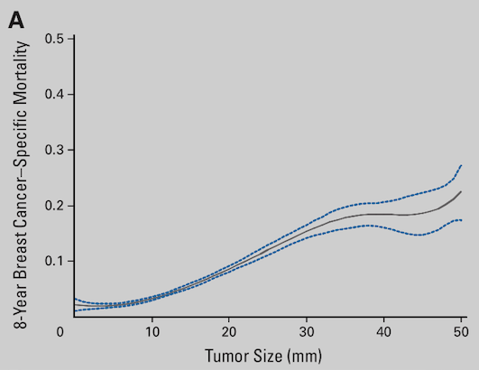

**Author(s)**: `r params$author`  
**Date**: `r Sys.Date()`  

[](https://guangchuangyu.github.io/blog_images/biobabble.jpg) 

# Academic Citation
If you use this code in your work or research, we kindly request that you cite our publication:

Xiaofan Lu, et al. (2025). FigureYa: A Standardized Visualization Framework for Enhancing Biomedical Data Interpretation and Research Efficiency. iMetaMed. https://doi.org/10.1002/imm3.70005

```{r setup, include=FALSE}
knitr::opts_chunk$set(echo = TRUE)
```

## 需求描述
## Requirement description

用R代码画出paper里的图。

Use R code to draw the plot in paper.



出自<http://ascopubs.org/doi/abs/10.1200/JCO.2010.29.5907?url_ver=Z39.88-2003&rfr_id=ori:rid:crossref.org&rfr_dat=cr_pub%3dpubmed>

from<http://ascopubs.org/doi/abs/10.1200/JCO.2010.29.5907?url_ver=Z39.88-2003&rfr_id=ori:rid:crossref.org&rfr_dat=cr_pub%3dpubmed>

## 使用场景
## Usage scenario

根据肿瘤大小分组，以存活时间作为输入，计算死亡率。

展示死亡率与肿瘤大小的关系。

还可以用来展示转移率与肿瘤大小的关系。

Group by tumor size, use survival time as input, and calculate the mortality rate.

Demonstrate the relationship between mortality and tumor size.

It can also be used to demonstrate the relationship between metastasis rate and tumor size.

## 环境设置
## Environment Setup

```{r}
source("install_dependencies.R")
# 加载所需的R包
# Load required R packages
library(dplyr)    # 用于数据操作和处理的包 # For data manipulation and processing
library(ggplot2)  # 用于数据可视化的包 # For data visualization

# 显示英文报错信息
# Show English error messages
Sys.setenv(LANGUAGE = "en") 

# 禁止chr转成factor
# Prevent character-to-factor conversion
options(stringsAsFactors = FALSE) 
```

## 输入数据及处理
## Input data and processing

```{r,message=FALSE,warning=FALSE}
x <- read.csv("easy_input.csv")
head(x)
## 第一列Survival里的1为死亡事件，其它当一类处理，你可以按照实现的标记灵活处理一下。
## 第二列Time的时间单位是月，5年即60个月。
## 5年之后死的，5年内是活的，把超过5年之后死的改为活的。
## The 1 in the first column of Survival is the death event, and the others are handled as a class, so you can be flexible according to the implementation of the markup.
## The unit of time in the second column of Time is the month, and 5 years is 60 months.
## What is dead after 5 years is alive for 5 years, changing what is dead after more than 5 years to alive.
x$Survival[x$Survival == 1 & x$Time > 60 ] = 0
head(x)

## 或者按步长为2切，然后group_by，用这个group变量，画图Tumor.size改成这个group，就可以是按照2mm来算了，要多少mm算一组都可以。
## Slice with a step of 2, then use group_by with this group variable to plot. Replace Tumor.size with this group, and it can be calculated based on 2mm. You can set any mm as a group.
#x$group = cut(x$Tumor.size, seq(0, 50, 2), seq(0, 50-1, 2) + 1) %>% as.character %>% as.numeric

## 按照Tumor size切分，计算死亡率，及0.95的置信区间
## calculate the mortality rate and the 0.95 confidence interval based on tumor size.
y <- group_by(x, Tumor.size) %>%
  summarize(ratio = mean(Survival == 1),
            int95 = qt(0.975, length(Survival)-1) * sd(Survival==1)/sqrt(length(Survival))) 
head(y)
```

## 开始画图
## Start drawing

```{r}
p1 <-ggplot(y, aes(Tumor.size, ratio)) +
     geom_ribbon(aes(ymin=ratio-int95, ymax=ratio+int95), fill="grey") + 
     geom_line() + xlab("Tumor Size (mm)") +
     ylab("5-Year XXX Mortality") + theme_minimal()
p1
```

这个图不够平滑，因为Tumor.size是正整数的，都是离散点。

可以使用Local Regression，也就是LOESS来处理，使之平滑。

The plot is not smooth enough because Tumor.size comprises positive integers, which are discrete points.

This can be smoothed by using Local Regression, also known as LOESS.

```{r,fig.width=6,fig.height=4}
#可以试着更改一下span参数，指定多少的smoothing span
#try changing the span parameter to specify how much of a smoothing span
span <- 0.5
loess_ratio <- loess(ratio ~ Tumor.size, data=y, span=span) 
loess_ci <- loess(int95 ~ Tumor.size, data=y, span=span) 

y$ratiop = predict(loess_ratio)
y$int95p = predict(loess_ci)

p2 <-ggplot(y, aes(Tumor.size, ratiop)) +
     geom_ribbon(aes(ymin=ratiop-int95p, ymax=ratiop+int95p), fill="grey") + 
     geom_line() + xlab("Tumor Size (mm)") +
     coord_cartesian(xlim = c(0,51),ylim = c(0,0.3)) + #设置坐标轴范围 set the axis range
     scale_x_continuous(expand = c(0, 0)) + scale_y_continuous(expand = c(0, 0)) +#让x和y轴都从0开始 let both the x and y axes start at 0
     theme_bw() + #去除背景色 remove background color
     theme(panel.grid =element_blank()) + #去除网格线 remove gridlines
     theme(panel.border = element_blank()) + #去除外层边框 remove outer border
     theme(axis.line = element_line(colour = "black")) + #坐标轴画成黑色 coordinate axes are drawn in black
     ylab("5-Year XXX Mortality")
p2
ggsave("mortality.pdf",width = 6,height = 4)
```

p2画出来就非常好看了

把没做smoothing的叠加上去看看：

p2 looks great when drawn

Overlay the version without smoothing to take a look:

```{r}
p2 + geom_ribbon(aes(ymin=ratio-int95, ymax=ratio+int95), fill="steelblue", alpha=.3) + 
     geom_line(aes(Tumor.size, ratio), color='red') + xlab("Tumor Size (mm)") +
     ylab("5-Year XXX Mortality") + theme_minimal()
```

```{r}
sessionInfo()
```