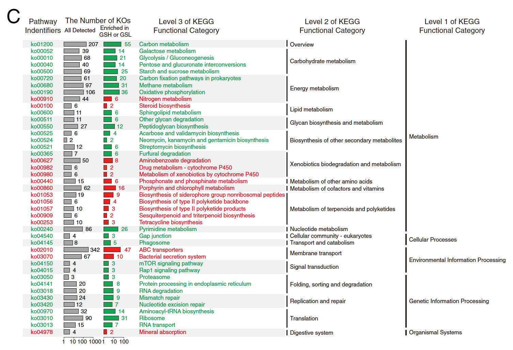
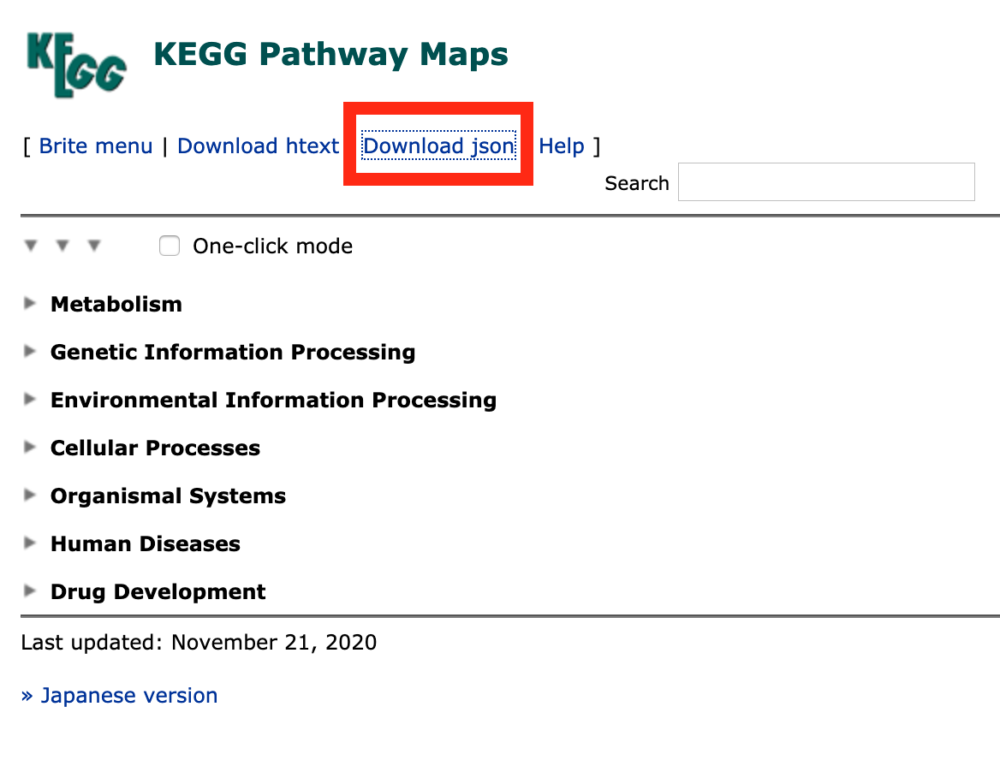

**Author(s)**: `r params$author`  
**Date**: `r Sys.Date()`  

# Academic Citation
If you use this code in your work or research, we kindly request that you cite our publication:

Xiaofan Lu, et al. (2025). FigureYa: A Standardized Visualization Framework for Enhancing Biomedical Data Interpretation and Research Efficiency. iMetaMed. https://doi.org/10.1002/imm3.70005

```{r setup, include=FALSE}
knitr::opts_chunk$set(echo = TRUE)
```

# 需求描述

富集分析，右侧的kegg画出了三层

# Requirement Description

For enrichment analysis, the kegg on the right draws three layers



出自<https://doi.org/10.1186/s40168-019-0629-2>
from<https://doi.org/10.1186/s40168-019-0629-2>

Fig. 4 Significantly (P < 0.05) different
KO functional categories that were significantly enriched in GSH or GSL were separately analyzed for KEGG pathway enrichment; those pathways that did not belong to microorganisms were removed; **all significantly enriched pathways** are described in (c). 
KO functional categories and pathways that were **significantly enriched in GSH are shown in red**; those **significantly enriched in GSL are shown in green**

# 应用场景

富集分析得到太多term，其中好多还是相似的，怎样合理的合并？clusterProfiler有一个simplify函数，能给富集分析结果瘦身by removing redundancy of enriched GO terms，但有时瘦的不够多。

- GO富集分析可以用FigureYa80GOclustering，用GOSemSim计算GO term之间的相似性，但是只能合并GO注释，对其他来源的注释无能为力。
- 合并来源于不同数据库的term，可参考FigureYa88DAVIDkappa
- 本文做KEGG富集分析，直接用第一层和第二层的term归类。

另外，Fig. 4B的画法可参考FigureYa142circosBar。

# Application Scenarios

The enrichment analysis yields too many terms, many of which are still similar, how to merge them reasonably? The clusterProfiler has a simplify function that slims down the enrichment analysis results by removing redundancy of enriched GO terms, but sometimes not enough thin.

- GO enrichment analysis can be done with FigureYa80GOclustering, and GOSemSim can be used to calculate the similarity between GO terms, but only GO annotations can be merged, and annotations from other sources cannot be consolidated.
- Merge terms from different databases, see FigureYa88DAVIDkappa
- In this paper, KEGG enrichment analysis is performed and the terms of the first and second layers are directly classified.

In addition, the drawing method of Fig. 4B can be found in Figure Ya142circosBar.

# 环境设置

# Environment settings

```{r}
source("install_dependencies.R")

library(tidyjson) 
library(jsonlite)
library(dplyr)
library(tidyr)
library(clusterProfiler)
library(ggplot2)
Sys.setenv(LANGUAGE = "en") #显示英文报错信息 # error messages are displayed in English
options(stringsAsFactors = FALSE) #禁止chr转成factor # chr is not allowed to be converted to factor
```

# 提取KEGG的三层注释

这里提取的是最新版本KEGG的三个level的注释信息，保存到kegg_hierarchy.csv文件。

从KEGG官网下载json file，<https://www.kegg.jp/kegg-bin/get_htext?br08901.keg>

# Extract the three-layer annotations of KEGG

Here is the annotation information of the three levels of the latest version of KEGG, which is saved to a kegg_hierarchy.csv file.

Download the json file from the KEGG official website and <https://www.kegg.jp/kegg-bin/get_htext?br08901.keg>



关于json file，看这里<https://mran.microsoft.com/snapshot/2016-10-12/web/packages/tidyjson/vignettes/introduction-to-tidyjson.html>

For JSON files, see here<https://mran.microsoft.com/snapshot/2016-10-12/web/packages/tidyjson/vignettes/introduction-to-tidyjson.html>

```{r}
# 加载json file
# Load the json file
path_hierarchy <- jsonlite::fromJSON("br08901.json", simplifyDataFrame = T, flatten = T)

path_hierarchy$children %>% 
  rename(level1 = name) %>%
  unnest(cols = c(children)) %>% 
  rename(level2=name) %>%
  unnest(cols = c("children")) %>%
  rename(level3=name) %>%
  mutate(id = paste0("ko", substr(level3, 1,5)),
         level3 = substr(level3, 7, nchar(level3))) %>%
  select(id, level3, level2, level1) %>%
  
  # 保存到文件
  # Save to file
  write.csv("kegg_hierarchy.csv")
```

# 输入文件

kegg_hierarchy.csv，前面获得的KEGG三层注释的对应关系。

easy_input.txt，前4列是富集分析结果，最后一列是上调/下调，对应图中文字的红绿色。这里直接使用原文的结果。平常我们做KEGG的富集分析，结果里的ID通常是“hsa+数字”，只需把hsa替换成ko即可。

The pathway map identifier takes the form of:<prefix><five-digit number>
where the number is uniquely assigned to each pathway map and the prefix is for a different version of the same pathway map, such as "map" for the manually drawn reference pathway and the three- or four-letter organism code for a computationally generated organism specific pathway.

做KEGG富集分析，有很多方式来实现，只要把上下调的显著条目合并，整理成“easy_input.txt”的格式就好。超几何分布（ORA）或GSEA，方法可参考：<https://yulab-smu.top/clusterProfiler-book/chapter6.html#kegg-gene-set-enrichment-analysis>。例文用的是超几何分布（ORA）：KEGG pathway enrichment analysis was performed using the function phyper from the R package “stats”。

# Input files

kegg_hierarchy.csv, the correspondence of the KEGG three-layer annotation obtained earlier.

easy_input.txt, the first 4 columns are the results of the enrichment analysis, and the last column is the up/down adjustment, corresponding to the red-green color of the figure Chinese. Here we use the results of the original text directly. Usually we do KEGG enrichment analysis, and the ID in the result is usually "hsa number", just replace the hasa with ko.

The pathway map identifier takes the form of:<prefix><five-digit number>
where the number is uniquely assigned to each pathway map and the prefix is for a different version of the same pathway map, such as "map" for the manually drawn reference pathway and the three- or four-letter organism code for a computationally generated organism specific pathway.

There are many ways to do KEGG enrichment analysis, as long as the significant items up and down are merged and organized into a "easy_input.txt" format. Hypergeometric Distribution (ORA) or GSEA, for the method can be found at: <https://yulab-smu.top/clusterProfiler-book/chapter6.html#kegg-gene-set-enrichment-analysis>。 The example is a hypergeometric distribution (ORA): KEGG pathway enrichment analysis was performed using the function phyper from the R package "stats".

```{r}
# 加载富集分析结果
# Load the enrichment analysis results
data <- read.table("easy_input.txt", sep = "\t", header = T)
head(data)

# 加载KEGG三层注释关系
# Load the three-layer annotation relationship of KEGG
kegg <- read.csv(file = "kegg_hierarchy.csv")
head(kegg)
```

# 整理成画图所需的格式
# Organize into the format you need to paint
```{r}
# bar plot data
# arrange data by level1, level2, and then level3,
# you can set the order as you like, but keep those terms with same level2 together and so as level1.
# 查看level 1和level 2的term
# Check the terms of Level 1 and Level 2
table(kegg$level1)
#table(kegg$level2)

ggData <- data %>%
  mutate(level3 = kegg$level3[match(ID, kegg$id)],
         level2 = kegg$level2[match(ID, kegg$id)],
         level1 = kegg$level1[match(ID, kegg$id)]) %>%
  
  # 给level1和level2的term排序
  # 注意：只保留table(kegg$level1)里出现的term
  # Sort the terms of level1 and level2
# Note: Only the term that appears in table(kegg$level1) is kegged
  mutate(level1 = factor(level1, 
                          c("Metabolism", "Cellular Processes", "Environmental Information Processing",
                            "Genetic Information Processing", "Organismal Systems")),
          level2 = factor(level2, 
                          c("Global and overview maps", "Carbohydrate metabolism", "Energy metabolism", 
                            "Lipid metabolism", "Glycan biosynthesis and metabolism",
                            "Biosynthesis of other secondary metabolites",
                            "Xenobiotics biodegradation and metabolism", 
                            "Metabolism of other amino acids", 
                            "Metabolism of cofactors and vitamins", 
                            "Metabolism of terpenoids and polyketides", 
                            "Nucleotide metabolism", 
                            "Cellular community - eukaryotes", 
                            "Transport and catabolism", 
                            "Membrane transport",
                            "Signal transduction", 
                            "Folding, sorting and degradation", 
                            "Replication and repair", 
                            "Translation",
                            "Digestive system"))
                          ) %>%
  arrange(level1, level2, Direction, level3) %>%
  mutate(ID = factor(ID, rev(unique(ID))),
         level3_x = factor(level3, rev(unique(as.character(level3)))))
head(ggData)

# level1的文字
# Level 1 text
ggData_l1 <- data.frame(nrow(ggData) - (cumsum(table(ggData$level1)) - table(ggData$level1)/2))
ggData_l1$start <- ggData_l1$Freq - table(ggData$level1)/2
ggData_l1$end <- ggData_l1$Freq + table(ggData$level1)/2

# level2的文字
# Level 2 text
ggData_l2 <- data.frame(nrow(ggData) - (cumsum(table(ggData$level2)) - table(ggData$level2)/2))
ggData_l2$start <- ggData_l2$Freq - table(ggData$level2)/2
ggData_l2$end <- ggData_l2$Freq + table(ggData$level2)/2
```

# 开始画图
# Start drawing
```{r data, fig.width=2, fig.height=5}
# bar 1
ggplot(ggData) +
  geom_col(mapping = aes(ID, Detected),
           color = "black", fill = "grey",
           width = 0.75, 
           show.legend = F) +
  geom_text(mapping = aes(ID, Detected, label = Detected),
            hjust=-0.4, size = 2.5) +
  scale_y_log10(limits = c(1, 1000),
                expand = expansion()) +
  scale_fill_manual(values = c("green4", "red")) +
  coord_flip() + 
  theme_classic() +
  labs(x = NULL, y = NULL, title = "All Detected") +
  theme(axis.text.y = element_blank(),
        axis.ticks.y = element_blank(),
        axis.line.y = element_blank(),
        plot.title = element_text(hjust = 0.5, size = 8)) -> p1

# bar2
ggplot(ggData) +
  geom_col(mapping = aes(ID, Enriched, fill = Direction),
           color = "black", width = 0.75, show.legend = F) +
  geom_text(mapping = aes(ID, Enriched, label = Enriched),
            hjust=-0.4, size = 2.5) +
  scale_y_log10(limits = c(1, 100),
                expand = expansion()) +
  scale_fill_manual(values = c("green4", "red")) +
  coord_flip() + 
  theme_classic() +
  labs(x = NULL, y = NULL, title = "Enriched in \n GSH or GSL") +
  theme(axis.text.y = element_blank(),
        axis.ticks.y = element_blank(),
        axis.line.y = element_blank(),
        plot.title = element_text(hjust = 0.5, size = 8)) -> p2

# text ko
ggplot(ggData) +
  geom_text(mapping = aes(ID, 0, label = ID, color = Direction), 
            size = 3, show.legend = F, hjust = 0) +
  scale_color_manual(values = c("green4", "red")) +
  scale_y_continuous(expand = expansion(), limits = c(0,1)) +
  coord_flip() + 
  theme_void() +
  labs(x = NULL, y = NULL, title = "Pathway \nIdentifiers") +
  theme(axis.text.y = element_blank(),
        axis.ticks.y = element_blank(),
        axis.line.y = element_blank(),
        plot.title = element_text(hjust = 0.5, size = 8)) -> p0

# text level3
ggplot(ggData) +
  geom_text(mapping = aes(ID, 0, label = level3, color = Direction), 
            size = 3, show.legend = F, hjust = 0) +
  scale_color_manual(values = c("green4", "red")) +
  scale_y_continuous(expand = expansion(), limits = c(0,1)) +
  coord_flip() + 
  theme_void() +
  labs(x = NULL, y = NULL, title = "Level 3 of KEGG\nfunctional Category") +
  theme(axis.text.y = element_blank(),
        axis.ticks.y = element_blank(),
        axis.line.y = element_blank(),
        plot.title = element_text(hjust = 0.5, size = 8)) -> p3

# text level2
ggplot(ggData_l2) +
  geom_segment(mapping = aes(x = start+0.1, xend = end-0.1, y = -0.1, yend = -0.1), size = 2)+
  geom_text(mapping = aes(Freq, 0, label = Var1), 
            size = 3, show.legend = F, hjust = 0) +
  scale_y_continuous(expand = expansion(), limits = c(-0.1,1)) +
  scale_x_continuous(expand = expansion()) +
  coord_flip() + 
  theme_void() +
  labs(x = NULL, y = NULL, title = "Level 2 of KEGG\nfunctional Category") +
  theme(axis.text.y = element_blank(),
        axis.ticks.y = element_blank(),
        axis.line.y = element_blank(),
        plot.title = element_text(hjust = 0.5, size = 8)) -> p4

# text level1
ggplot(ggData_l1) +
  geom_segment(mapping = aes(x = start+0.1, xend = end-0.1, y = -0.1, yend = -0.1), size = 2)+
  geom_text(mapping = aes(Freq, 0, label = Var1), 
            size = 3, show.legend = F, hjust = 0) +
  scale_y_continuous(expand = expansion(), limits = c(-0.1,1)) +
  scale_x_continuous(expand = expansion()) +
  coord_flip() + 
  theme_void() +
  labs(x = NULL, y = NULL, title = "Level 1 of KEGG\nfunctional Category") +
  theme(axis.text.y = element_blank(),
        axis.ticks.y = element_blank(),
        axis.line.y = element_blank(),
        plot.title = element_text(hjust = 0.5, size = 8)) -> p5
```

```{r fig.width=10, fig.height=6}
cowplot::plot_grid(p0,p1, p2,p3,p4,p5, align = "h", nrow = 1, 
                   rel_widths = c(0.1,0.2,0.2,0.6, 0.5, 0.4))

ggsave("KEGGhierarchy.pdf", width = 12, height = 8)
```

# Session Info

```{r}
sessionInfo()
```