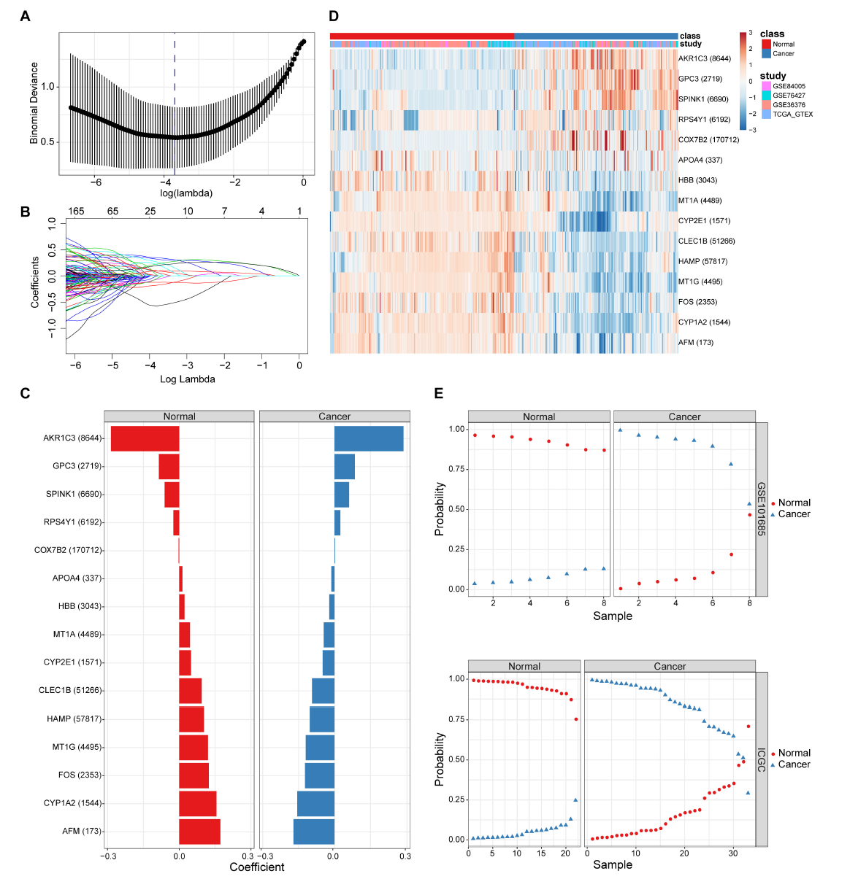

**Author(s)**: `r params$author`  
**Date**: `r Sys.Date()`  


# Academic Citation
If you use this code in your work or research, we kindly request that you cite our publication:

Xiaofan Lu, et al. (2025). FigureYa: A Standardized Visualization Framework for Enhancing Biomedical Data Interpretation and Research Efficiency. iMetaMed. https://doi.org/10.1002/imm3.70005

```{r setup, include=FALSE}
knitr::opts_chunk$set(echo = TRUE)
```

# 需求描述
# Requirement description

我想实现弹性网络筛选和分类的数据分析。根据表达矩阵，绘制figure2的A,B,C筛选和系数图，再根据结果绘制分类效果E图，得到准确率。

I would like to try data analysis for resilient network screening and classification. Based on the expression matrix, I will generate the screening and coefficient plots for groups A, B, and C as shown in Figure 2. Subsequently, I will plot the classification performance diagram E based on the results to determine the accuracy rate.



出自<https://www.frontiersin.org/articles/10.3389/fgene.2020.00857/full>

FIGURE 2 | The screening and validation of 15 genes conducted by the diagnostic classifier. 
(A,B) Binomial deviance as a function of the regularization parameter lambda for leave-one-study-out cross-validation on the training datasets. Points correspond to the means, and error bars correspond to the standard deviations. Coefficients of 15 genes were selected by the lambda with the minimum binomial deviance marked by the blue dashed line (lambda = 0.025, ln(lambda) = −3.692). 
(C) Coefficient values for each of the fifteen selected genes. A positive coefficient for a gene signature within its class indicates that elevated expression of this gene increases the probability of a specimen belonging to its tissue type. 
(D) Heatmap for describing the expression levels of selected genes in the binomial classifier erected by training datasets. Each row is a gene with its Entrez Gene ID in parentheses; each column is a sample. 
(E) Estimated probabilities for samples in testing datasets (GSE101685 and ICGC). For each sample, there are two points, corresponding to the probability that the sample belongs to the respective class. Within each dataset and class, samples are sorted by the probability of the true class. For most samples, the probability of the true subtype is near 1, indicating an unambiguous classification.

from<https://www.frontiersin.org/articles/10.3389/fgene.2020.00857/full>

FIGURE 2 | The screening and validation of 15 genes conducted by the diagnostic classifier. 
(A,B) Binomial deviance as a function of the regularization parameter lambda for leave-one-study-out cross-validation on the training datasets. Points correspond to the means, and error bars correspond to the standard deviations. Coefficients of 15 genes were selected by the lambda with the minimum binomial deviance marked by the blue dashed line (lambda = 0.025, ln(lambda) = −3.692). 
(C) Coefficient values for each of the fifteen selected genes. A positive coefficient for a gene signature within its class indicates that elevated expression of this gene increases the probability of a specimen belonging to its tissue type. 
(D) Heatmap for describing the expression levels of selected genes in the binomial classifier erected by training datasets. Each row is a gene with its Entrez Gene ID in parentheses; each column is a sample. 
(E) Estimated probabilities for samples in testing datasets (GSE101685 and ICGC). For each sample, there are two points, corresponding to the probability that the sample belongs to the respective class. Within each dataset and class, samples are sorted by the probability of the true class. For most samples, the probability of the true subtype is near 1, indicating an unambiguous classification.

# 应用场景
# Application scenario

根据弹性网络筛选变量构建分类模型，生成筛选和系数图，以及分类效果图。

Construct a classification model by selecting variables based on the elastic net, generate screening and coefficient diagrams, as well as classification effect diagrams.

# 环境设置
# Environment setting

```{r}
source("install_dependencies.R")

library(data.table)
library(glmnet)
library(limma)
library(ggplot2)
Sys.setenv(LANGUAGE = "en") #显示英文报错信息 display English error messages
options(stringsAsFactors = FALSE) #禁止chr转成factor prohibit the conversion of chr to factor
```

# 输入文件的获得
# Acquisition of input files

提取感兴趣的肿瘤及对照组织的表达数据。如果你已经准备好，就跳过这步，直接进入“输入文件”。

这里用TCGA的肿瘤，用GTEX的正常组织作为对照。从UCSC xena<https://xenabrowser.net/datapages/>下载经过TOIL流程统一处理的TCGA和GTEx的TPM值，free of computational batch effects。从中提取肝癌和肝脏数据。

- TCGA与GTEX合并的表达数据：<https://xenabrowser.net/datapages/?dataset=TcgaTargetGtex_rsem_gene_tpm&host=https%3A%2F%2Ftoil.xenahubs.net&removeHub=https%3A%2F%2Fxena.treehouse.gi.ucsc.edu%3A443>
- 样本注释信息：<https://xenabrowser.net/datapages/?dataset=TcgaTargetGTEX_phenotype.txt&host=https%3A%2F%2Ftoil.xenahubs.net&removeHub=https%3A%2F%2Fxena.treehouse.gi.ucsc.edu%3A443>

我们在FigureYa55panCancer_violin有过类似的操作。

Extract expression data for tumours and control tissues of interest. If you have already prepared these, skip this step and proceed directly to "Input Files".

Here, we utilise TCGA tumours with GTEX normal tissues as controls. Download the TPM values for TCGA and GTEx, processed uniformly via the TOIL workflow and free of computational batch effects, from UCSC xena<https://xenabrowser.net/datapages/>. Extract data for hepatocellular carcinoma and liver tissue.

- Combined TCGA and GTEX expression data: <https://xenabrowser.net/datapages/?dataset=TcgaTargetGtex_rsem_gene_tpm&host=https%3A%2F%2Ftoil.xenahubs.net&removeHub=https%3A%2F%2Fxena.treehouse.gi.ucsc.edu%3A443>
- Sample annotation information: <https://xenabrowser.net/datapages/?dataset=TcgaTargetGTEX_phenotype.txt&host=https%3A%2F%2Ftoil.xenahubs.net&removeHub=https%3A%2F%2Fxena.treehouse.gi.ucsc.edu%3A443>

We have performed similar operations on FigureYa55panCancer_violin.

```{r eval=FALSE}
# 加载基因注释文件XENA网站
# Load gene annotation file XENA website
Ginfo <- read.table("overlapTable27.txt",sep = "\t",row.names = 1,check.names = F,stringsAsFactors = F,header = T)

phenotype <- read.table("TcgaTargetGTEX_phenotype.txt",sep = "\t",row.names = 1,check.names = F,stringsAsFactors = F,header = T)
phenotype <- phenotype[which(phenotype$`_study` %in% c("TCGA","GTEX")),] # 仅筛选TCGA和GETX，移除TARGET filter out TCGA and GETX only, remove TARGET
phenotype <- phenotype[which(phenotype$`_primary_site` != ""),] # 删除值为空的位点 remove site with empty value

# 以下数据（9个G）提取过程需要内存较大的电脑（纯R，不受操作系统限制）
# 或者用cut命令提取（需Linux或MAC），可参考FigureYa56immune_inflitration
# The extraction process for the following data (9 GB) requires a computer with substantial memory (pure R, not restricted by operating system)
# Alternatively, use the cut command for extraction (requires Linux or MAC), refer to FigureYa56immune_inflitration
tpm <- fread("TcgaTargetGtex_rsem_gene_tpm",sep = "\t",header = T,check.names = F,stringsAsFactors = F)
tpm.df <- as.data.frame(tpm)
ensembl <- sapply(strsplit(tpm$sample,".",fixed = T),"[",1) # 取出有效的Ensembl ID Retrieve valid Ensembl IDs

# 过滤出感兴趣的数据集
# Filter out the datasets of interest
sites <- unique(phenotype$`_primary_site`) # 提出所有有效的位点 Identify all valid sites
sites # 查看位点 View sites
tissue <- "Liver" # 设置位点（必须为有效位点） Set site (must be a valid site)
if(!is.element(tissue, sites)) { # 如不存在则报错 If it does not exist, report an error
  stop("incorrect tissue, should be one of the primary_site column in phenotype.txt file.")
}

phenotype_tissue <- phenotype[which(phenotype$`_primary_site` == tissue),]
if(length(unique(phenotype_tissue$`_study`)) == 2) { # 必须同时含有TCGA和GETX数据 Must contain both TCGA and GTEx data
  tcga.barcode <- intersect(rownames(phenotype_tissue[which(phenotype_tissue$`_study` == "TCGA"),]), colnames(tpm.df)) # 获取TCGA样本 get TCGA samples
  gtex.barcode <- intersect(rownames(phenotype_tissue[which(phenotype_tissue$`_study` == "GTEX"),]), colnames(tpm.df)) # 获取GTEX样本 get GTEX samples
 
  combined.tpm <- tpm.df[,c(tcga.barcode,gtex.barcode)]  
  combined.tpm <- 2^(combined.tpm) - 0.001 # 官网数据为log2(x+0.001)转换的，这里转回来 The official website data has been converted to log2(x+0.001), and here it is converted back
  combined.tpm[combined.tpm < 0] <- 0 # 由于原数据是+0.001来的，所以这里所有<0的数据均为最小值，拉为0 As the original data was +0.001, all values <0 here represent the minimum value and are adjusted to 0
  combined.tpm <- log2(combined.tpm + 1) # 重新对数化，保证0还是0 Re-logarithmisation ensures zero remains zero
  rownames(combined.tpm) <- ensembl # 添上行名 Add the row name
  
  comgene <- intersect(rownames(combined.tpm), rownames(Ginfo)) # 取出和注释文件一致的基因 Extract the genes corresponding to the annotated files
  
  # 将Ensembl ID转为symbol
  # Convert Ensembl ID to symbol
  combined.tpm <- combined.tpm[comgene,]
  combined.tpm$genename <- Ginfo[comgene,"genename"]
  combined.tpm <- combined.tpm[!duplicated(combined.tpm$genename),] # 去除重复基因 Remove duplicate genes
  rownames(combined.tpm) <- combined.tpm$genename 
  combined.tpm <- combined.tpm[,-ncol(combined.tpm)]
} else {
  stop("this tissue has only one of TCGA or GTEX data, please switch to another tissue.") # 若缺少任何一个数据库，则报错 If any database is missing, an error will be reported
}
# 保存数据
# Save data
write.table(combined.tpm,paste0("tpms_",tissue,"_TCGAGTEX.txt"),sep = "\t",row.names = T,col.names = NA,quote = F)
```

# 输入文件
# Input Files

- 训练集：
  - tpms_Liver_TCGAGTEX.txt，TCGA（肝癌）和GTEX（正常组织）表达矩阵。
  - lihc_sinfo.txt，TCGA肝癌临床信息
- 测试集（GEO数据的下载及数据预处理可参考FigureYa203ComBat）
  - gse101685.expr.txt，表达矩阵
  - gse101685.sinfo.txt，样本信息

加载数据，构建训练集和测试集，并定义早期肝癌与正常组织。

- Training set:
  - tpms_Liver_TCGAGTEX.txt, TCGA (liver cancer) and GTEX (normal tissue) expression matrices.
  - lihc_sinfo.txt, TCGA liver cancer clinical information
- Test set (GEO data download and preprocessing can be referenced to FigureYa203ComBat)
  - gse101685.expr.txt, expression matrix
  - gse101685.sinfo.txt, sample information

Load data, construct training and test sets, and define early-stage hepatocellular carcinoma versus normal tissue.

```{r}
## 训练集
## Training set
# 加载TCGA_GTEX肝癌表达谱数据
# Load TCGA_GTEX liver cancer expression profile data
tcga.expr <- read.table("tpms_Liver_TCGAGTEX.txt",sep = "\t",row.names = 1,check.names = F,stringsAsFactors = F,header = T)
tcga.index <- grep("TCGA",colnames(tcga.expr)) # 找到TCGA肝癌样本的索引 Find the index of TCGA liver cancer samples.
tcga.barcode <- colnames(tcga.expr)[tcga.index] # 取出样本名 Retrieve sample name
tcga.barcode <- paste0("LIHC",substr(tcga.barcode,8,15),"A") # 修改样本名以匹配注释文件 Modify the sample name to match the annotation file
colnames(tcga.expr)[tcga.index] <- tcga.barcode # 替换样本名 Replace sample name

# 加载TCGA肝癌临床信息
# Load TCGA liver cancer clinical information
tcga.sinfo <- read.table("lihc_sinfo.txt",sep = "\t",row.names = 1,check.names = F,stringsAsFactors = F,header = T)
tcga.tumsam <- intersect(rownames(tcga.sinfo[which(tcga.sinfo$sampleType == "Tumor" & tcga.sinfo$AJCC_PATHOLOGIC_TUMOR_STAGE == "Stage I"),]), tcga.barcode)
tcga.norsam <- intersect(rownames(tcga.sinfo[which(tcga.sinfo$sampleType == "Normal"),]),tcga.barcode)
gtex.norsam <- colnames(tcga.expr)[grep("GTEX",colnames(tcga.expr))] # 找到GTEX正常样本 Find the normal sample of GTEX

# 构建TCGAGTEX最终表达谱以及样本信息
# Construct the final expression profile and sample information for TCGAGTEX
tcga.expr <- tcga.expr[,c(tcga.tumsam,tcga.norsam,gtex.norsam)]
tcga.expr <- tcga.expr[rowSums(tcga.expr) > 0,]
#rownames(tcga.expr) <- gsub("-","_",rownames(tcga.expr),fixed = T)
tcga.sinfo <- data.frame(samID = c(tcga.tumsam,tcga.norsam,gtex.norsam),
                         tissue = rep(c("Tumor","Normal"),c(length(tcga.tumsam), length(tcga.norsam) + length(gtex.norsam))),
                         row.names = c(tcga.tumsam,tcga.norsam,gtex.norsam),
                         stringsAsFactors = F)

## 测试集
## Test set
gse101685.expr <- read.delim("gse101685.expr.txt",sep = "\t",row.names = 1,check.names = F,stringsAsFactors = F,header = T)
gse101685.expr[1:6,1:3] # 注意到行名里存在多种匹配，取///符号前的基因名（可以在EXCEL里检查一下，但不要用EXCEL进行任何操作，千万不要保存，否则可能出现月份） Note that there are multiple matches in the row names; take the gene name before the /// symbol (you can check this in EXCEL, but do not perform any operations within EXCEL, never save the file, or else you may encounter issues with date formats, such as the date being displayed as a month.)
gse101685.expr$Gene <- sapply(strsplit(rownames(gse101685.expr)," /// ",fixed = T),"[",1)
gse101685.expr <- apply(gse101685.expr[,setdiff(colnames(gse101685.expr), "Gene")], 2, function(x) tapply(x, INDEX=factor(gse101685.expr$Gene), FUN=median, na.rm=TRUE))
gse101685.expr <- as.data.frame(round(gse101685.expr,2))
write.csv(gse101685.expr, "easy_input_GSE101685.csv", quote = F)
#rownames(gse101685.expr) <- gsub("-","_",rownames(gse101685.expr),fixed = T)

gse101685.sinfo <- read.delim("gse101685.sinfo.txt",sep = "\t",row.names = 1,check.names = F,stringsAsFactors = F,header = T)
gse.tumsam <- intersect(rownames(gse101685.sinfo[which(gse101685.sinfo$`1:TISSUE` == "Hepatocellular carcinoma" & gse101685.sinfo$`1:STAGE` == "T1"),]),colnames(gse101685.expr)) # 取出肝癌且早期的样本 Retrieve samples of early-stage liver cancer
gse.norsam <- intersect(rownames(gse101685.sinfo[which(gse101685.sinfo$`1:TISSUE` == "Normal liver"),]),colnames(gse101685.expr)) # 取出正常样本 Retrieve the normal sample

# 构建GSE最终表达谱以及样本信息
# Construct the final expression profile and sample information for GSE
gse.expr <- gse101685.expr[,c(gse.tumsam,gse.norsam)]
gse.sinfo <- data.frame(samID = c(gse.tumsam,gse.norsam),
                        tissue = rep(c("Tumor","Normal"),c(length(gse.tumsam),length(gse.norsam))),
                        row.names = c(gse.tumsam,gse.norsam),
                        stringsAsFactors = F)
```

# 构建弹性网络预测模型，查看效果
# Construct an elastic net prediction model and check the effect

根据弹性网络筛选变量构建分类模型。

在训练集构建弹性网络预测模型，分别查看模型在训练集和测试集的效果。

Build a classification model by selecting variables based on the elastic net.

Build an elastic net predictive model on the training set and examine the effectiveness on both the training set and the test set.

```{r}
# 选取共同基因
# Select common genes
comgene <- intersect(rownames(tcga.expr),rownames(gse.expr))

# 先挑选一部分差异表达基因来构建模型
# First, select a subset of differentially expressed genes to construct the model
pd <- data.frame(Samples = tcga.sinfo$samID,
                 Group = tcga.sinfo$tissue,
                 stringsAsFactors = FALSE)
design <-model.matrix(~ -1 + factor(pd$Group, levels = c("Tumor","Normal")))
colnames(design) <- c("Tumor","Normal")
gset <- tcga.expr[comgene,pd$Samples]
fit <- limma::lmFit(gset, design = design);
contrastsMatrix <- limma::makeContrasts(Tumor - Normal, levels = c("Tumor", "Normal"))
fit2 <- limma::contrasts.fit(fit, contrasts = contrastsMatrix)
fit2 <- limma::eBayes(fit2, 0.01)
resData <- limma::topTable(fit2, adjust = "fdr", sort.by = "B", number = 100000)
resData <- as.data.frame(subset(resData, select=c("logFC","t","B","P.Value","adj.P.Val")))
resData$id <- rownames(resData)
colnames(resData) <- c("log2fc","t","B","pvalue","padj","id")
resData$fc <- 2^resData$log2fc
resData <- resData[order(resData$padj),c("id","fc","log2fc","pvalue","padj")]
write.table(resData,"limma results between early liver cancer and normal tissues.txt",sep = "\t",row.names = F,col.names = T,quote = F)

# 训练弹性网络
# Train elastic networks
degs <- resData[which(abs(resData$log2fc) > log2(1.5) & resData$padj < 0.05),] # 取出差异表达基因 Extract differentially expressed genes
x <- scale(t(tcga.expr[rownames(degs),rownames(tcga.sinfo)])) # 数据标准化 Data standardisation
y <- as.factor(ifelse(tcga.sinfo$tissue == "Tumor",1,0))
set.seed(20201104) # 设置种子使得结果可重复 Set the seed to ensure reproducible results
cvfit <- cv.glmnet(x, y, 
                   nfolds = nrow(x), # 余一交叉验证 Leave-one-out cross-validation
                   family = "binomial", # 二分类模型 Binary classification model
                   grouped = FALSE, # 在余一交叉验证的时候设置为FALSE Set it to FALSE during leave-one-out cross-validation
                   alpha = 0.9, # 原文参数（alpha=0为岭回归；=1为lasso；=0~1为弹性网络） Original text parameters (alpha=0 for ridge regression; alpha=1 for lasso; alpha between 0 and 1 for elastic net)
                   type.measure = "deviance") # 原文参数 Original text parameters

# 取出系数不为0的变量
# Extract variables with non-zero coefficients
myCoefs <- coef(cvfit, s="lambda.min");
lasso_fea <- rownames(coef(cvfit, s = 'lambda.min'))[coef(cvfit, s = 'lambda.min')[,1]!= 0]
if(is.element("(Intercept)", lasso_fea)) {
  lasso_fea <- lasso_fea[-1] # 去掉截距项 Remove the intercept term
}

# 查看模型在训练集的效果
# Examine the performance of the model on the training set
pred_train <- data.frame(prob = round(predict(cvfit, newx = x,type="response"),4)[,1],
                         tissue = tcga.sinfo$tissue)

# 查看模型在测试集的效果
# Examine the performance of the model on the test set
x <- as.matrix(as.data.frame(scale(t(gse.expr[rownames(degs),gse.sinfo$samID]))))
pred_test <- data.frame(prob = round(predict(cvfit, newx = x,type="response"),4)[,1],
                        tissue = gse.sinfo$tissue)
```

# 开始画图
# Start drawing

生成筛选和系数图，以及分类效果图。

Generate screening and coefficient plots, along with classification performance diagrams.

```{r}
# Figure 2A
pdf("Figure2A.pdf",width = 4.5,height = 4)
par(bty="o", mgp = c(2,0.5,0), mar = c(3.1,3.1,2.1,2.1),tcl=-.25,las = 1)
plot(cvfit)
dev.off()
```


```{r}
# Figure 2B
pdf("Figure2B.pdf",width = 4.5,height = 4)
par(bty="o", mgp = c(2,0.5,0), mar = c(3.1,3.1,2.1,2.1),tcl=-.25,las = 1)
plot(cvfit$glmnet.fit, "lambda", label=FALSE)
dev.off()
```


```{r}
# Figure 2C
coeff <- myCoefs@x[-1]; names(coeff) <- lasso_fea
coeff <- sort(coeff,decreasing = F)
coeff.dt <- data.frame(gene = rep(names(coeff),2),
                    coeff = c(as.numeric(coeff),-as.numeric(coeff)),
                    tissue = rep(c("Tumor","Normal"),c(length(coeff),length(coeff))))
coeff.dt$gene <- factor(coeff.dt$gene, levels = names(coeff))
p <- ggplot(data=coeff.dt, aes(x=gene, y=coeff,fill = tissue)) +
  geom_bar(stat="identity") + 
  scale_fill_manual(values = c("#E4191B","#357EB8")) + 
  coord_flip() + 
  facet_grid( ~ tissue) +
  theme_bw() +
  ylab("Coefficient") + xlab("") +
  theme(legend.position = "none",
        axis.title = element_text(size = 12,color = "black"),
        axis.text = element_text(color = "black"))
p
ggsave(file = "Figure2C.pdf",width = 8,height = 6)

# Figure 2E
tmp1 <- pred_test[which(pred_test$tissue == "Tumor"),]
tmp2 <- pred_test[which(pred_test$tissue == "Normal"),]
tmp1 <- tmp1[order(tmp1$prob,decreasing = T),] # 肿瘤概率降序 Tumor probability in descending order
tmp2 <- tmp2[order(tmp2$prob,decreasing = F),] # 正常概率升序 Normal probability in ascending order

pred.dt <- rbind.data.frame(tmp1,tmp2)
pred.dt$Pred.Tumor <- pred.dt$prob
pred.dt$Pred.Normal <- 1-pred.dt$prob
pred.dt$sample <- c(1:length(gse.tumsam), 1:length(gse.norsam))
long <- melt(setDT(pred.dt[,2:5]), id.vars = c("tissue","sample"), variable.name = "pred")

p <- ggplot(data=long, aes(x=sample, y=value,color = pred)) +
  geom_point(stat="identity") + 
  scale_color_manual(values = c("#E4191B","#357EB8")) + 
  facet_grid( ~ tissue) +
  theme_bw() +
  ylab("Probability") + xlab("Sample") +
  theme(legend.position = "bottom",
        legend.title = element_blank(),
        axis.text = element_text(colour = "black"),
        axis.title = element_text(size = 12,color = "black"))
p
ggsave(file = "Figure2E.pdf",width = 6,height = 4)
```

# Session Info

```{r}
sessionInfo()
```